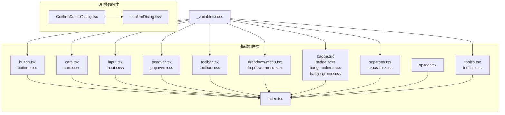
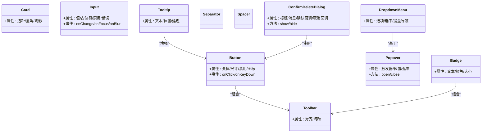
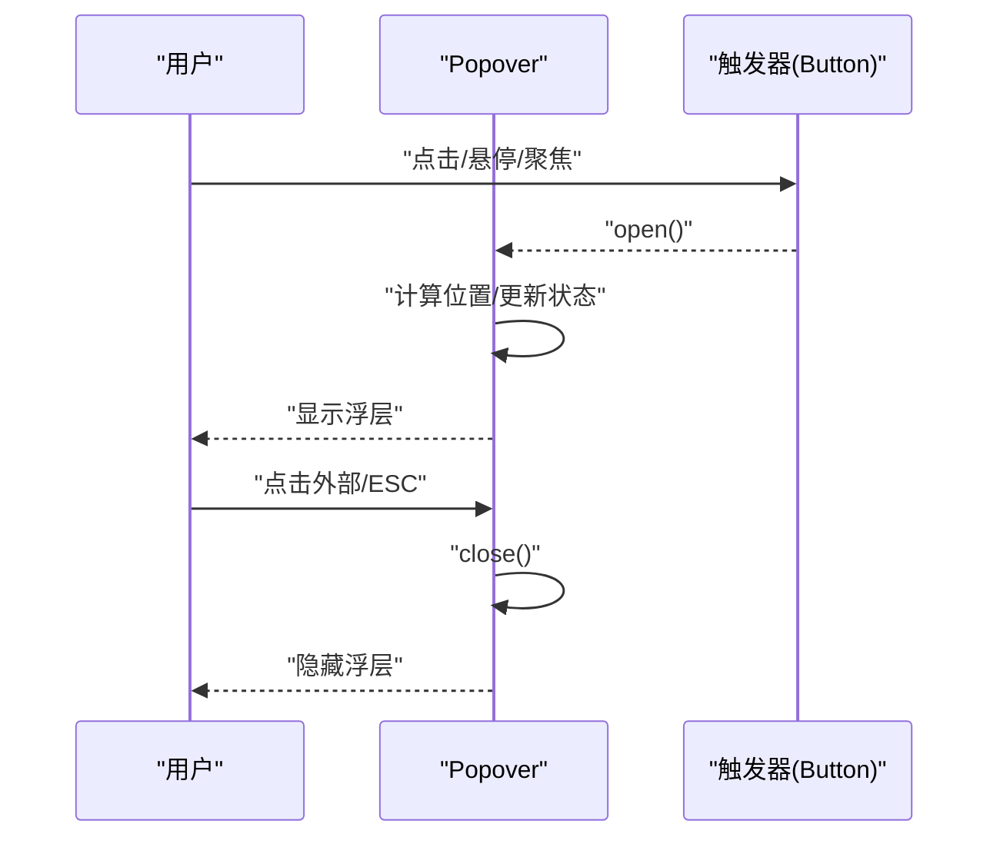
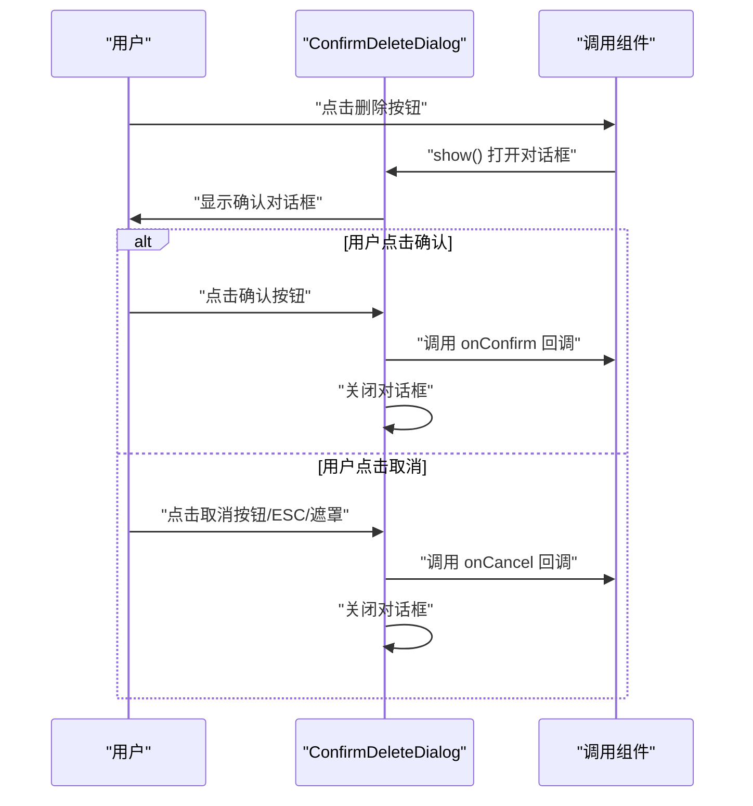
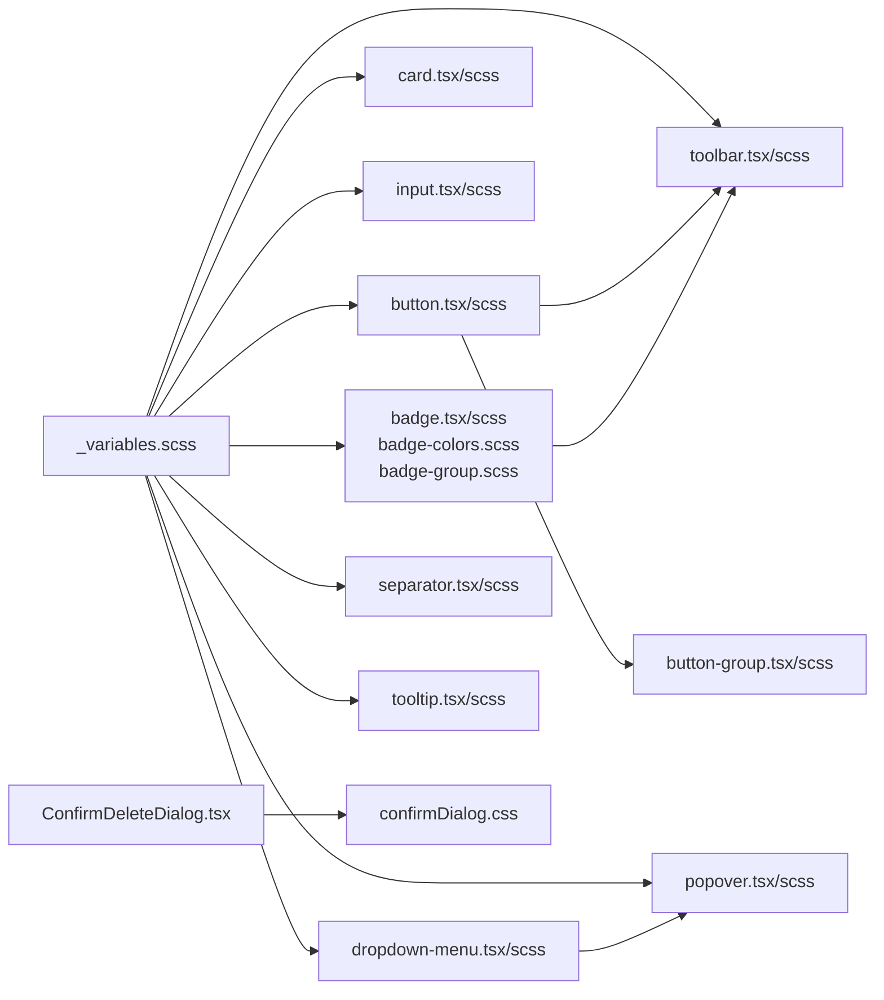

# 基础 UI 组件层

<cite>
**本文引用的文件**   
- [src/components/tiptap-ui-primitive/button.tsx](file://src/components/tiptap-ui-primitive/button.tsx)
- [src/components/tiptap-ui-primitive/button.scss](file://src/components/tiptap-ui-primitive/button.scss)
- [src/components/tiptap-ui-primitive/button-colors.scss](file://src/components/tiptap-ui-primitive/button-colors.scss)
- [src/components/tiptap-ui-primitive/button-group.tsx](file://src/components/tiptap-ui-primitive/button-group.tsx)
- [src/components/tiptap-ui-primitive/button-group.scss](file://src/components/tiptap-ui-primitive/button-group.scss)
- [src/components/tiptap-ui-primitive/card.tsx](file://src/components/tiptap-ui-primitive/card.tsx)
- [src/components/tiptap-ui-primitive/card.scss](file://src/components/tiptap-ui-primitive/card.scss)
- [src/components/tiptap-ui-primitive/input.tsx](file://src/components/tiptap-ui-primitive/input.tsx)
- [src/components/tiptap-ui-primitive/input.scss](file://src/components/tiptap-ui-primitive/input.scss)
- [src/components/tiptap-ui-primitive/popover.tsx](file://src/components/tiptap-ui-primitive/popover.tsx)
- [src/components/tiptap-ui-primitive/popover.scss](file://src/components/tiptap-ui-primitive/popover.scss)
- [src/components/tiptap-ui-primitive/toolbar.tsx](file://src/components/tiptap-ui-primitive/toolbar.tsx)
- [src/components/tiptap-ui-primitive/toolbar.scss](file://src/components/tiptap-ui-primitive/toolbar.scss)
- [src/components/tiptap-ui-primitive/dropdown-menu.tsx](file://src/components/tiptap-ui-primitive/dropdown-menu.tsx)
- [src/components/tiptap-ui-primitive/dropdown-menu.scss](file://src/components/tiptap-ui-primitive/dropdown-menu.scss)
- [src/components/tiptap-ui-primitive/badge.tsx](file://src/components/tiptap-ui-primitive/badge.tsx)
- [src/components/tiptap-ui-primitive/badge.scss](file://src/components/tiptap-ui-primitive/badge.scss)
- [src/components/tiptap-ui-primitive/badge-colors.scss](file://src/components/tiptap-ui-primitive/badge-colors.scss)
- [src/components/tiptap-ui-primitive/badge-group.scss](file://src/components/tiptap-ui-primitive/badge-group.scss)
- [src/components/tiptap-ui-primitive/separator.tsx](file://src/components/tiptap-ui-primitive/separator.tsx)
- [src/components/tiptap-ui-primitive/separator.scss](file://src/components/tiptap-ui-primitive/separator.scss)
- [src/components/tiptap-ui-primitive/spacer.tsx](file://src/components/tiptap-ui-primitive/spacer.tsx)
- [src/components/tiptap-ui-primitive/tooltip.tsx](file://src/components/tiptap-ui-primitive/tooltip.tsx)
- [src/components/tiptap-ui-primitive/tooltip.scss](file://src/components/tiptap-ui-primitive/tooltip.tsx)
- [src/components/tiptap-ui-primitive/index.tsx](file://src/components/tiptap-ui-primitive/index.tsx)
- [src/components/ui/ConfirmDeleteDialog.tsx](file://src/components/ui/ConfirmDeleteDialog.tsx)
- [src/components/ui/confirmDialog.css](file://src/components/ui/confirmDialog.css)
- [src/styles/_variables.scss](file://src/styles/_variables.scss)
</cite>

## 更新摘要
**变更内容**   
- 新增统一的删除确认对话框组件（ConfirmDeleteDialog）
- 改进弹窗逻辑，提供标准化的用户确认交互模式
- 增强基础组件层的可访问性和用户体验一致性

## 目录
1. [简介](#简介)
2. [项目结构](#项目结构)
3. [核心组件](#核心组件)
4. [架构总览](#架构总览)
5. [详细组件分析](#详细组件分析)
6. [新增组件：删除确认对话框](#新增组件删除确认对话框)
7. [依赖关系分析](#依赖关系分析)
8. [性能考量](#性能考量)
9. [故障排查指南](#故障排查指南)
10. [结论](#结论)
11. [附录](#附录)

## 简介
本章节面向 FishWorker 应用的基础 UI 组件层，聚焦 tiptap-ui-primitive 目录中的原子级组件（Button、Card、Input、Popover、Toolbar 等），以及新增的统一删除确认对话框组件。文档将系统阐述：
- 设计理念与职责边界
- Props 接口设计与类型约定
- 样式系统与主题支持（SCSS）
- 可访问性实现与键盘交互
- 响应式设计模式
- 组合使用示例与最佳实践
- 测试策略与性能优化建议

## 项目结构
tiptap-ui-primitive 采用"按组件拆分"的组织方式：每个组件包含独立的 TSX 实现与 SCSS 样式，并通过统一入口 index.tsx 进行再导出。该结构有利于：
- 单一职责与高内聚
- 按需引入与打包体积控制
- 样式隔离与主题变量复用

图表来源
- [src/components/tiptap-ui-primitive/index.tsx](file://src/components/tiptap-ui-primitive/index.tsx)
- [src/components/ui/ConfirmDeleteDialog.tsx](file://src/components/ui/ConfirmDeleteDialog.tsx)
- [src/styles/_variables.scss](file://src/styles/_variables.scss)

章节来源
- [src/components/tiptap-ui-primitive/index.tsx](file://src/components/tiptap-ui-primitive/index.tsx)
- [src/components/ui/ConfirmDeleteDialog.tsx](file://src/components/ui/ConfirmDeleteDialog.tsx)
- [src/styles/_variables.scss](file://src/styles/_variables.scss)

## 核心组件
本节概述各基础组件的职责与典型用法要点，后续章节将深入源码细节。

- Button：通用按钮，支持多种变体、尺寸、禁用态与图标插槽；提供键盘可达性与焦点样式。
- Card：内容容器，用于卡片式布局与信息分组，支持圆角、阴影与间距。
- Input：文本输入控件，支持占位符、禁用态、错误提示与尺寸适配。
- Popover：浮层弹出框，支持定位、触发方式与遮罩行为。
- Toolbar：工具栏容器，用于排列一组操作按钮或菜单项，具备对齐与间距控制。
- DropdownMenu：下拉菜单，常与 Popover 组合使用，提供键盘导航与选中状态。
- Badge：标签/徽章，用于计数、状态标识，支持颜色与分组。
- Separator：分割线，用于视觉分隔。
- Spacer：间距占位元素，便于布局微调。
- Tooltip：悬浮提示，用于补充说明信息。
- ConfirmDeleteDialog：统一的删除确认对话框，提供标准化的危险操作确认流程。

章节来源
- [src/components/tiptap-ui-primitive/button.tsx](file://src/components/tiptap-ui-primitive/button.tsx)
- [src/components/tiptap-ui-primitive/button.scss](file://src/components/tiptap-ui-primitive/button.scss)
- [src/components/tiptap-ui-primitive/button-colors.scss](file://src/components/tiptap-ui-primitive/button-colors.scss)
- [src/components/tiptap-ui-primitive/button-group.tsx](file://src/components/tiptap-ui-primitive/button-group.tsx)
- [src/components/tiptap-ui-primitive/button-group.scss](file://src/components/tiptap-ui-primitive/button-group.scss)
- [src/components/tiptap-ui-primitive/card.tsx](file://src/components/tiptap-ui-primitive/card.tsx)
- [src/components/tiptap-ui-primitive/card.scss](file://src/components/tiptap-ui-primitive/card.scss)
- [src/components/tiptap-ui-primitive/input.tsx](file://src/components/tiptap-ui-primitive/input.tsx)
- [src/components/tiptap-ui-primitive/input.scss](file://src/components/tiptap-ui-primitive/input.scss)
- [src/components/tiptap-ui-primitive/popover.tsx](file://src/components/tiptap-ui-primitive/popover.tsx)
- [src/components/tiptap-ui-primitive/popover.scss](file://src/components/tiptap-ui-primitive/popover.scss)
- [src/components/tiptap-ui-primitive/toolbar.tsx](file://src/components/tiptap-ui-primitive/toolbar.tsx)
- [src/components/tiptap-ui-primitive/toolbar.scss](file://src/components/tiptap-ui-primitive/toolbar.scss)
- [src/components/tiptap-ui-primitive/dropdown-menu.tsx](file://src/components/tiptap-ui-primitive/dropdown-menu.tsx)
- [src/components/tiptap-ui-primitive/dropdown-menu.scss](file://src/components/tiptap-ui-primitive/dropdown-menu.scss)
- [src/components/tiptap-ui-primitive/badge.tsx](file://src/components/tiptap-ui-primitive/badge.tsx)
- [src/components/tiptap-ui-primitive/badge.scss](file://src/components/tiptap-ui-primitive/badge.scss)
- [src/components/tiptap-ui-primitive/badge-colors.scss](file://src/components/tiptap-ui-primitive/badge-colors.scss)
- [src/components/tiptap-ui-primitive/badge-group.scss](file://src/components/tiptap-ui-primitive/badge-group.scss)
- [src/components/tiptap-ui-primitive/separator.tsx](file://src/components/tiptap-ui-primitive/separator.tsx)
- [src/components/tiptap-ui-primitive/separator.scss](file://src/components/tiptap-ui-primitive/separator.scss)
- [src/components/tiptap-ui-primitive/spacer.tsx](file://src/components/tiptap-ui-primitive/spacer.tsx)
- [src/components/tiptap-ui-primitive/tooltip.tsx](file://src/components/tiptap-ui-primitive/tooltip.tsx)
- [src/components/tiptap-ui-primitive/tooltip.scss](file://src/components/tiptap-ui-primitive/tooltip.tsx)
- [src/components/ui/ConfirmDeleteDialog.tsx](file://src/components/ui/ConfirmDeleteDialog.tsx)
- [src/components/ui/confirmDialog.css](file://src/components/ui/confirmDialog.css)

## 架构总览
基础组件层遵循"原子化 + 主题变量驱动"的架构：
- 组件仅关注自身渲染与交互逻辑，不耦合业务数据
- 样式通过 SCSS 变量集中管理，便于主题切换与一致性维护
- 通过 index.tsx 统一导出，上层可按需引用，避免重复导入
- 新增的 ConfirmDeleteDialog 组件提供标准化的危险操作确认流程

图表来源
- [src/components/tiptap-ui-primitive/button.tsx](file://src/components/tiptap-ui-primitive/button.tsx)
- [src/components/tiptap-ui-primitive/popover.tsx](file://src/components/tiptap-ui-primitive/popover.tsx)
- [src/components/tiptap-ui-primitive/dropdown-menu.tsx](file://src/components/tiptap-ui-primitive/dropdown-menu.tsx)
- [src/components/tiptap-ui-primitive/toolbar.tsx](file://src/components/tiptap-ui-primitive/toolbar.tsx)
- [src/components/tiptap-ui-primitive/badge.tsx](file://src/components/tiptap-ui-primitive/badge.tsx)
- [src/components/tiptap-ui-primitive/tooltip.tsx](file://src/components/tiptap-ui-primitive/tooltip.tsx)
- [src/components/ui/ConfirmDeleteDialog.tsx](file://src/components/ui/ConfirmDeleteDialog.tsx)

## 详细组件分析

### Button 组件
- 设计目标：提供一致的点击交互与视觉反馈，支持多形态与可访问性。
- Props 要点：
  - 外观：变体（如 primary/secondary/ghost）、尺寸（sm/md/lg）、颜色
  - 状态：禁用、加载、激活
  - 内容：文本、图标插槽、前缀/后缀
  - 交互：onClick、onKeyDown、tabIndex、aria-*
- 样式系统：
  - 基础样式在 button.scss 中定义，颜色变体在 button-colors.scss 中扩展
  - 通过 SCSS 变量控制圆角、阴影、过渡动画
- 可访问性：
  - 默认 role="button"，支持键盘 Enter/Space 触发
  - 禁用态设置 aria-disabled，焦点可见性清晰
- 响应式：
  - 小屏下自动调整内边距与字号，保证触控友好

```mermaid
flowchart TD
Start(["用户交互"]) --> CheckDisabled{"是否禁用?"}
CheckDisabled --> |是| ShowDisabled["显示禁用态样式"]
CheckDisabled --> |否| TriggerAction["触发 onClick 回调"]
TriggerAction --> KeyboardCheck{"键盘触发?"}
KeyboardCheck --> |Enter/Space| FireClick["模拟点击事件"]
KeyboardCheck --> |其他| Ignore["忽略"]
ShowDisabled --> End(["结束"])
FireClick --> End
Ignore --> End
```

图表来源
- [src/components/tiptap-ui-primitive/button.tsx](file://src/components/tiptap-ui-primitive/button.tsx)
- [src/components/tiptap-ui-primitive/button.scss](file://src/components/tiptap-ui-primitive/button.scss)
- [src/components/tiptap-ui-primitive/button-colors.scss](file://src/components/tiptap-ui-primitive/button-colors.scss)

章节来源
- [src/components/tiptap-ui-primitive/button.tsx](file://src/components/tiptap-ui-primitive/button.tsx)
- [src/components/tiptap-ui-primitive/button.scss](file://src/components/tiptap-ui-primitive/button.scss)
- [src/components/tiptap-ui-primitive/button-colors.scss](file://src/components/tiptap-ui-primitive/button-colors.scss)

### ButtonGroup 组件
- 设计目标：将多个 Button 组合为组，提供紧凑布局与边框合并效果。
- Props 要点：
  - 方向（水平/垂直）、间距、对齐
  - 子项选择（单选/多选）与选中态联动
- 样式系统：
  - 通过 button-group.scss 控制边框合并、圆角裁剪与间距
- 可访问性：
  - 提供 role="group" 与 aria-label，确保屏幕阅读器识别

章节来源
- [src/components/tiptap-ui-primitive/button-group.tsx](file://src/components/tiptap-ui-primitive/button-group.tsx)
- [src/components/tiptap-ui-primitive/button-group.scss](file://src/components/tiptap-ui-primitive/button-group.scss)

### Card 组件
- 设计目标：作为内容容器，承载标题、正文与操作区。
- Props 要点：
  - 边距、圆角、阴影、背景色
  - 可选头部/尾部插槽
- 样式系统：
  - card.scss 定义容器样式与阴影层级
- 可访问性：
  - 语义化标签（article/section），必要时添加 aria-labelledby

章节来源
- [src/components/tiptap-ui-primitive/card.tsx](file://src/components/tiptap-ui-primitive/card.tsx)
- [src/components/tiptap-ui-primitive/card.scss](file://src/components/tiptap-ui-primitive/card.scss)

### Input 组件
- 设计目标：标准文本输入控件，满足表单场景。
- Props 要点：
  - 值绑定、占位符、禁用、只读
  - 错误提示、辅助文本、尺寸
  - 事件：onChange、onFocus、onBlur、onKeyDown
- 样式系统：
  - input.scss 定义边框、焦点环、错误态与尺寸变体
- 可访问性：
  - 关联 label（id/for），错误时设置 aria-invalid 与 aria-describedby

章节来源
- [src/components/tiptap-ui-primitive/input.tsx](file://src/components/tiptap-ui-primitive/input.tsx)
- [src/components/tiptap-ui-primitive/input.scss](file://src/components/tiptap-ui-primitive/input.scss)

### Popover 组件
- 设计目标：轻量浮层，用于展示附加信息或操作面板。
- Props 要点：
  - 触发器（点击/悬停/焦点）、位置（上/下/左/右）、偏移量
  - 遮罩、关闭行为（点击外部/ESC）、受控/非受控
- 样式系统：
  - popover.scss 定义定位、阴影、层级与动画
- 可访问性：
  - 使用 aria-haspopup、aria-expanded、aria-controls 与 focus trap

图表来源
- [src/components/tiptap-ui-primitive/popover.tsx](file://src/components/tiptap-ui-primitive/popover.tsx)
- [src/components/tiptap-ui-primitive/popover.scss](file://src/components/tiptap-ui-primitive/popover.scss)

章节来源
- [src/components/tiptap-ui-primitive/popover.tsx](file://src/components/tiptap-ui-primitive/popover.tsx)
- [src/components/tiptap-ui-primitive/popover.scss](file://src/components/tiptap-ui-primitive/popover.scss)

### Toolbar 组件
- 设计目标：工具栏容器，用于排列一组操作按钮或菜单项。
- Props 要点：
  - 对齐（左/中/右）、间距、换行
  - 子项自适应宽度与溢出处理
- 样式系统：
  - toolbar.scss 定义 Flex 布局、间距与滚动条样式
- 可访问性：
  - role="toolbar"，子项可聚焦并支持键盘导航

章节来源
- [src/components/tiptap-ui-primitive/toolbar.tsx](file://src/components/tiptap-ui-primitive/toolbar.tsx)
- [src/components/tiptap-ui-primitive/toolbar.scss](file://src/components/tiptap-ui-primitive/toolbar.scss)

### DropdownMenu 组件
- 设计目标：下拉菜单，常与 Popover 组合使用。
- Props 要点：
  - 选项列表、选中项、禁用项、分隔符
  - 键盘导航（上下箭头、回车选择）、受控/非受控
- 样式系统：
  - dropdown-menu.scss 定义菜单项样式、悬停与选中态
- 可访问性：
  - role="menu"，项 role="menuitem"，当前选中 aria-selected

章节来源
- [src/components/tiptap-ui-primitive/dropdown-menu.tsx](file://src/components/tiptap-ui-primitive/dropdown-menu.tsx)
- [src/components/tiptap-ui-primitive/dropdown-menu.scss](file://src/components/tiptap-ui-primitive/dropdown-menu.scss)

### Badge 组件
- 设计目标：标签/徽章，用于计数、状态标识。
- Props 要点：
  - 文本、颜色变体、尺寸、是否圆形
  - 可与 Button/Toolbar 组合
- 样式系统：
  - badge.scss 定义基础样式
  - badge-colors.scss 定义颜色映射
  - badge-group.scss 定义分组布局

章节来源
- [src/components/tiptap-ui-primitive/badge.tsx](file://src/components/tiptap-ui-primitive/badge.tsx)
- [src/components/tiptap-ui-primitive/badge.scss](file://src/components/tiptap-ui-primitive/badge.scss)
- [src/components/tiptap-ui-primitive/badge-colors.scss](file://src/components/tiptap-ui-primitive/badge-colors.scss)
- [src/components/tiptap-ui-primitive/badge-group.scss](file://src/components/tiptap-ui-primitive/badge-group.scss)

### Separator 与 Spacer
- Separator：细线分隔，常用于 Toolbar 或 Card 内部区块划分。
- Spacer：空白占位，用于精细间距控制。

章节来源
- [src/components/tiptap-ui-primitive/separator.tsx](file://src/components/tiptap-ui-primitive/separator.tsx)
- [src/components/tiptap-ui-primitive/separator.scss](file://src/components/tiptap-ui-primitive/separator.scss)
- [src/components/tiptap-ui-primitive/spacer.tsx](file://src/components/tiptap-ui-primitive/spacer.tsx)

### Tooltip 组件
- 设计目标：悬浮提示，提供简短说明。
- Props 要点：
  - 文本、位置、延迟、触发方式
- 样式系统：
  - tooltip.scss 定义气泡样式与定位
- 可访问性：
  - aria-describedby 指向提示内容，确保屏幕阅读器可读

章节来源
- [src/components/tiptap-ui-primitive/tooltip.tsx](file://src/components/tiptap-ui-primitive/tooltip.tsx)
- [src/components/tiptap-ui-primitive/tooltip.scss](file://src/components/tiptap-ui-primitive/tooltip.scss)

## 新增组件：删除确认对话框

### ConfirmDeleteDialog 组件
- 设计目标：提供统一的删除确认对话框，标准化危险操作的确认流程，提升用户体验和数据安全性。
- Props 要点：
  - 标题：对话框标题，通常为"确认删除"
  - 消息：确认提示信息，描述删除操作的后果
  - 确认回调：用户确认后的处理函数
  - 取消回调：用户取消时的处理函数
  - 确认按钮文本：自定义确认按钮文字
  - 取消按钮文本：自定义取消按钮文字
  - 受控状态：通过 isOpen 控制对话框显示/隐藏
- 样式系统：
  - confirmDialog.css 定义对话框样式、动画效果与响应式布局
  - 使用全局样式变量保持一致的视觉风格
- 可访问性：
  - 使用 dialog 语义化标签
  - 支持 ESC 键关闭
  - 焦点陷阱确保用户在对话框内导航
  - 适当的 aria-label 和 aria-describedby 属性
- 交互逻辑：
  - 点击确认按钮执行删除操作并关闭对话框
  - 点击取消按钮或遮罩层关闭对话框
  - 支持键盘导航和焦点管理

图表来源
- [src/components/ui/ConfirmDeleteDialog.tsx](file://src/components/ui/ConfirmDeleteDialog.tsx)
- [src/components/ui/confirmDialog.css](file://src/components/ui/confirmDialog.css)

章节来源
- [src/components/ui/ConfirmDeleteDialog.tsx](file://src/components/ui/ConfirmDeleteDialog.tsx)
- [src/components/ui/confirmDialog.css](file://src/components/ui/confirmDialog.css)

## 依赖关系分析
- 组件间依赖：
  - DropdownMenu 依赖 Popover 提供定位与生命周期
  - ButtonGroup 聚合多个 Button，负责选中态与布局
  - Toolbar 聚合 Button/Badge/DropdownMenu 等
  - ConfirmDeleteDialog 独立组件，可被任何需要删除确认的组件使用
- 样式依赖：
  - 所有组件共享 _variables.scss 中的主题变量（颜色、圆角、阴影、字体等）
  - ConfirmDeleteDialog 使用 confirmDialog.css 专用样式
- 导出依赖：
  - index.tsx 统一再导出，供上层模块按需引入

图表来源
- [src/styles/_variables.scss](file://src/styles/_variables.scss)
- [src/components/tiptap-ui-primitive/index.tsx](file://src/components/tiptap-ui-primitive/index.tsx)
- [src/components/ui/ConfirmDeleteDialog.tsx](file://src/components/ui/ConfirmDeleteDialog.tsx)
- [src/components/ui/confirmDialog.css](file://src/components/ui/confirmDialog.css)

章节来源
- [src/components/tiptap-ui-primitive/index.tsx](file://src/components/tiptap-ui-primitive/index.tsx)
- [src/styles/_variables.scss](file://src/styles/_variables.scss)
- [src/components/ui/ConfirmDeleteDialog.tsx](file://src/components/ui/ConfirmDeleteDialog.tsx)
- [src/components/ui/confirmDialog.css](file://src/components/ui/confirmDialog.css)

## 性能考量
- 按需引入：通过 index.tsx 的命名导出，避免全量引入导致包体膨胀
- 样式隔离：每个组件独立 SCSS，减少全局污染与重绘范围
- 事件节流：对频繁触发的交互（如滚动、拖拽）建议使用节流/防抖策略
- 渲染优化：
  - 避免在高频回调中创建新对象/函数，提升 React 比较效率
  - 对复杂浮层（Popover/DropdownMenu）使用惰性渲染与条件挂载
  - ConfirmDeleteDialog 使用条件渲染，仅在需要时挂载到 DOM
- 可访问性开销：合理设置 aria-* 与 tabindex，避免不必要的焦点陷阱

## 故障排查指南
- 浮层遮挡问题：
  - 检查 z-index 层级与父容器 overflow 设置
  - 确认 Popover 的定位参考元素是否正确
- 键盘不可达：
  - 验证 tabIndex、role 与 aria-* 属性是否完整
  - 检查焦点顺序与 ESC 关闭逻辑
- 主题不一致：
  - 确认 SCSS 变量是否被正确覆盖
  - 检查组件是否使用了硬编码颜色而非变量
- 移动端体验差：
  - 调整触摸目标尺寸与间距
  - 在小屏下简化浮层内容或改用抽屉/模态
- 删除确认对话框问题：
  - 确认回调函数是否正确传递和执行
  - 检查对话框状态管理（isOpen）是否正确同步
  - 验证样式冲突，特别是与其他模态框组件的 z-index 冲突

章节来源
- [src/components/tiptap-ui-primitive/popover.tsx](file://src/components/tiptap-ui-primitive/popover.tsx)
- [src/components/tiptap-ui-primitive/button.tsx](file://src/components/tiptap-ui-primitive/button.tsx)
- [src/components/tiptap-ui-primitive/input.tsx](file://src/components/tiptap-ui-primitive/input.tsx)
- [src/components/ui/ConfirmDeleteDialog.tsx](file://src/components/ui/ConfirmDeleteDialog.tsx)
- [src/styles/_variables.scss](file://src/styles/_variables.scss)

## 结论
tiptap-ui-primitive 以原子化组件为核心，结合 SCSS 变量驱动的主题体系，提供了稳定、可访问且易于组合的基础 UI 能力。新增的 ConfirmDeleteDialog 组件进一步完善了用户交互的一致性，特别是在危险操作确认方面提供了标准化的解决方案。通过合理的依赖管理与性能优化策略，可在复杂编辑器场景中保持良好的一致性与可维护性。

## 附录

### 组合使用示例与最佳实践
- 工具栏组合：
  - 使用 Toolbar 包裹 Button、Badge、DropdownMenu，形成统一的编辑工具栏
  - 通过 Spacer 控制局部间距，Separator 区分功能区域
- 浮层与菜单：
  - 使用 Popover 承载 DropdownMenu，实现点击触发与外部点击关闭
  - 为菜单项提供键盘导航与选中态反馈
- 表单与提示：
  - Input 配合 Tooltip 提供字段说明，错误态使用 aria-invalid 与辅助文本
- 危险操作确认：
  - 使用 ConfirmDeleteDialog 包装删除按钮，提供二次确认机制
  - 在删除操作前显示明确的警告信息和后果说明
- 主题定制：
  - 通过覆盖 _variables.scss 中的变量实现品牌化主题
  - 避免在组件内硬编码颜色，优先使用变量与语义类名

### 测试策略建议
- 单元测试：
  - 针对 Button/Input 的交互与状态变更编写用例
  - 验证 Popover/DropdownMenu 的打开/关闭与键盘导航
  - 测试 ConfirmDeleteDialog 的确认/取消逻辑与状态管理
- 集成测试：
  - 组合 Toolbar 与多个子组件，验证布局与交互一致性
  - 测试删除操作流程的完整用户体验
- 可访问性测试：
  - 使用屏幕阅读器与键盘遍历验证焦点顺序与语义标注
  - 特别验证 ConfirmDeleteDialog 的键盘导航与焦点管理
- 快照测试：
  - 对复杂组件树进行快照比对，防止意外回归