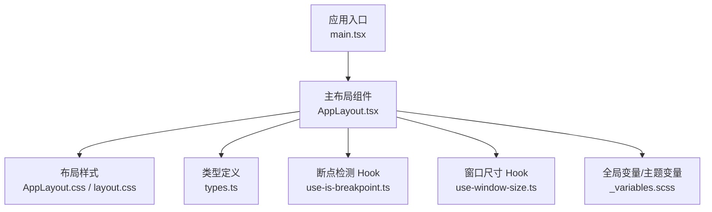
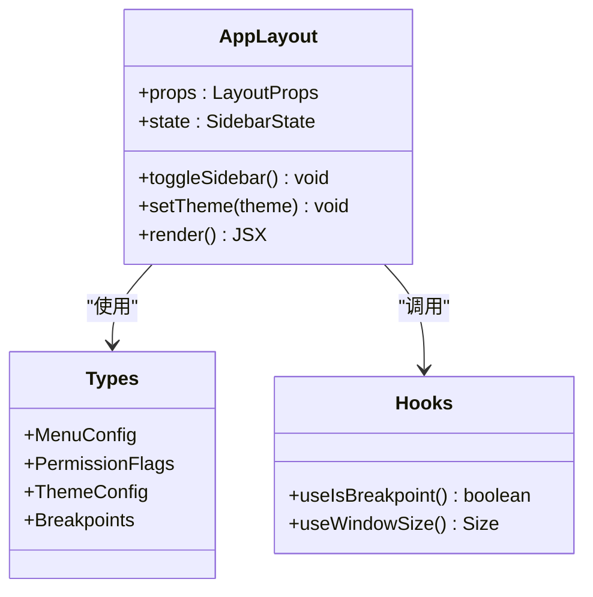
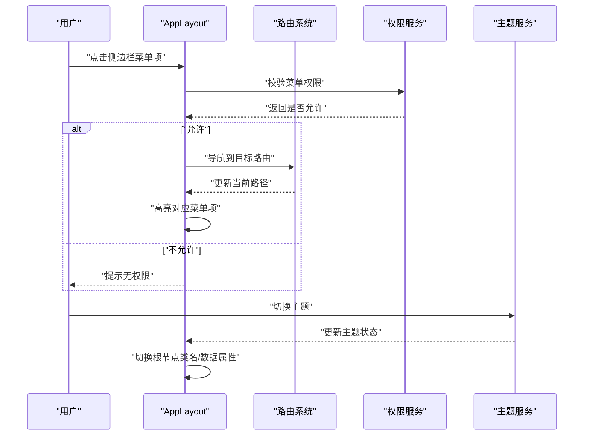
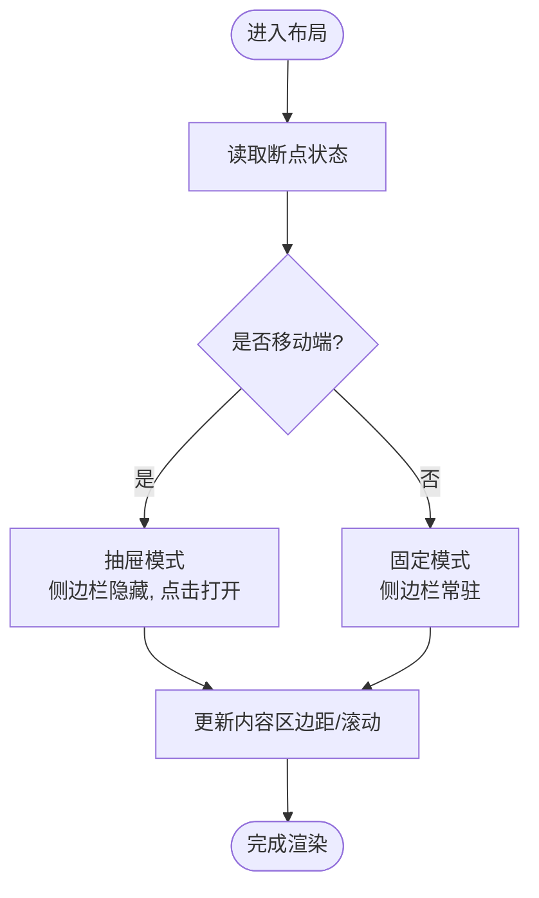
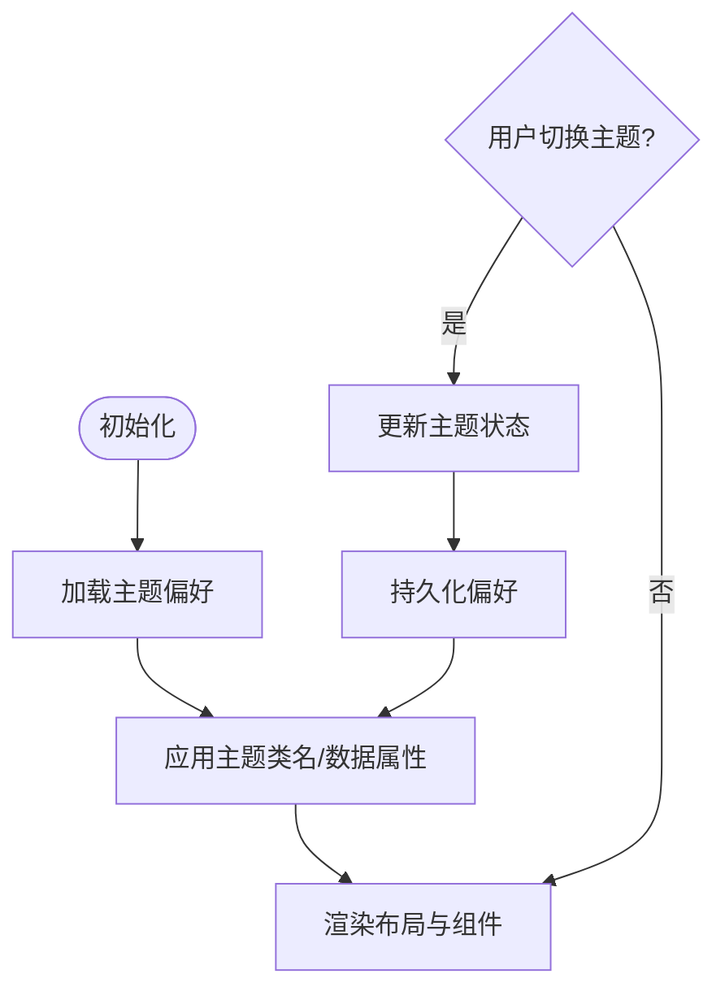
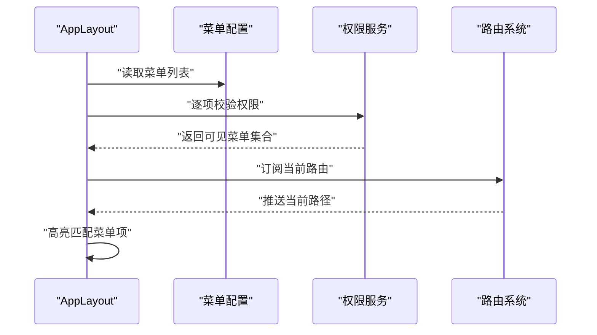
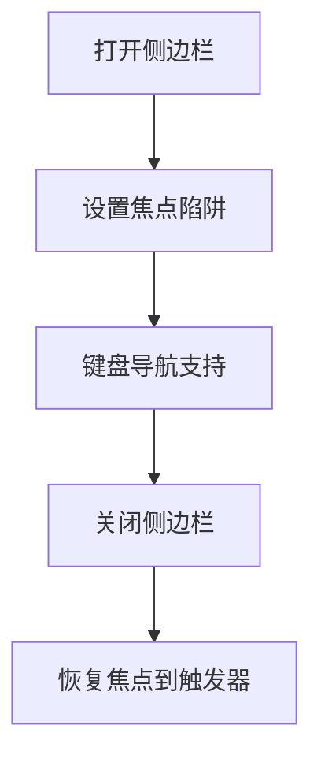
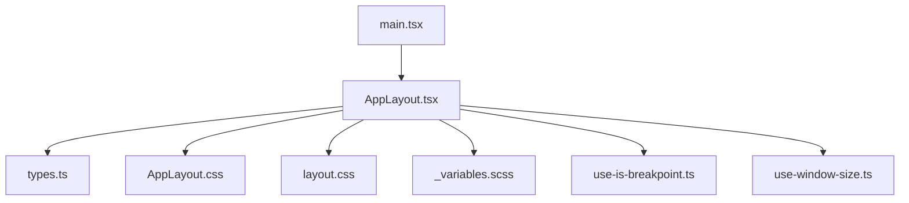

# 布局组件系统

<cite>
**本文引用的文件**   
- [AppLayout.tsx](file://src/components/layout/AppLayout.tsx)
- [AppLayout.css](file://src/components/layout/AppLayout.css)
- [types.ts](file://src/components/layout/types.ts)
- [layout.css](file://src/styles/layout.css)
- [_variables.scss](file://src/styles/_variables.scss)
- [main.tsx](file://src/main.tsx)
- [use-is-breakpoint.ts](file://src/hooks/use-is-breakpoint.ts)
- [use-window-size.ts](file://src/hooks/use-window-size.ts)
</cite>

## 目录
1. [简介](#简介)
2. [项目结构](#项目结构)
3. [核心组件](#核心组件)
4. [架构总览](#架构总览)
5. [详细组件分析](#详细组件分析)
6. [依赖关系分析](#依赖关系分析)
7. [性能考量](#性能考量)
8. [故障排查指南](#故障排查指南)
9. [结论](#结论)
10. [附录](#附录)

## 简介
本文件聚焦 FishWorker 应用的布局组件系统，围绕 AppLayout 主布局组件展开，系统性阐述其设计架构与实现要点。内容涵盖侧边栏导航、内容区域管理、响应式布局、状态管理与路由集成、权限控制机制、主题切换与暗色模式支持、自定义配置选项、扩展与定制最佳实践，以及移动端适配与可访问性实现。目标是帮助开发者快速理解并高效扩展布局能力。

## 项目结构
布局相关代码主要位于 src/components/layout 与 src/styles 下，并通过 hooks 提供响应式能力，入口在 main.tsx 中完成应用初始化与根布局挂载。

图表来源
- [main.tsx:1-200](file://src/main.tsx#L1-L200)
- [AppLayout.tsx:1-200](file://src/components/layout/AppLayout.tsx#L1-L200)
- [AppLayout.css:1-200](file://src/components/layout/AppLayout.css#L1-L200)
- [layout.css:1-200](file://src/styles/layout.css#L1-L200)
- [types.ts:1-200](file://src/components/layout/types.ts#L1-L200)
- [use-is-breakpoint.ts:1-200](file://src/hooks/use-is-breakpoint.ts#L1-L200)
- [use-window-size.ts:1-200](file://src/hooks/use-window-size.ts#L1-L200)
- [_variables.scss:1-200](file://src/styles/_variables.scss#L1-L200)

章节来源
- [main.tsx:1-200](file://src/main.tsx#L1-L200)
- [AppLayout.tsx:1-200](file://src/components/layout/AppLayout.tsx#L1-L200)
- [AppLayout.css:1-200](file://src/components/layout/AppLayout.css#L1-L200)
- [layout.css:1-200](file://src/styles/layout.css#L1-L200)
- [types.ts:1-200](file://src/components/layout/types.ts#L1-L200)
- [use-is-breakpoint.ts:1-200](file://src/hooks/use-is-breakpoint.ts#L1-L200)
- [use-window-size.ts:1-200](file://src/hooks/use-window-size.ts#L1-L200)
- [_variables.scss:1-200](file://src/styles/_variables.scss#L1-L200)

## 核心组件
- AppLayout：作为应用的主布局容器，负责整体页面骨架（顶部、侧边栏、内容区、底部等）的渲染与交互逻辑，包括侧边栏的展开/收起、内容区域的占位与路由注入、响应式行为切换、主题与暗色模式切换、以及基于权限的路由可见性控制。
- types.ts：集中定义布局相关的类型与配置项，如菜单项、权限标识、主题配置、断点常量等，供 AppLayout 与其他模块复用。
- AppLayout.css / layout.css：布局样式与通用布局规则，包含侧边栏宽度、内容区自适应、响应式断点、暗色模式变量覆盖等。
- _variables.scss：主题变量与颜色体系，支撑亮色/暗色模式的统一切换。
- use-is-breakpoint.ts / use-window-size.ts：提供响应式能力，用于根据屏幕尺寸调整布局行为（如侧边栏自动折叠）。

章节来源
- [AppLayout.tsx:1-200](file://src/components/layout/AppLayout.tsx#L1-L200)
- [types.ts:1-200](file://src/components/layout/types.ts#L1-L200)
- [AppLayout.css:1-200](file://src/components/layout/AppLayout.css#L1-L200)
- [layout.css:1-200](file://src/styles/layout.css#L1-L200)
- [_variables.scss:1-200](file://src/styles/_variables.scss#L1-L200)
- [use-is-breakpoint.ts:1-200](file://src/hooks/use-is-breakpoint.ts#L1-L200)
- [use-window-size.ts:1-200](file://src/hooks/use-window-size.ts#L1-L200)

## 架构总览
AppLayout 采用“容器 + 策略”的组合方式：容器负责结构与状态，策略通过 props 或上下文注入（如路由、权限、主题）驱动具体行为。响应式通过断点 Hook 判断，主题通过 CSS 变量与类名切换实现，权限控制通过菜单项与路由守卫协同完成。

图表来源
- [AppLayout.tsx:1-200](file://src/components/layout/AppLayout.tsx#L1-L200)
- [types.ts:1-200](file://src/components/layout/types.ts#L1-L200)
- [use-is-breakpoint.ts:1-200](file://src/hooks/use-is-breakpoint.ts#L1-L200)
- [use-window-size.ts:1-200](file://src/hooks/use-window-size.ts#L1-L200)

## 详细组件分析

### AppLayout 主布局组件
职责与特性
- 侧边栏导航：维护展开/收起状态，支持键盘导航与焦点管理；在移动端默认收起，点击触发器打开抽屉式侧边栏。
- 内容区域管理：为子路由或业务面板提供占位容器，确保内容区自适应与滚动隔离。
- 响应式布局：基于断点 Hook 动态调整侧边栏显示模式（固定/抽屉），并在窗口尺寸变化时更新状态。
- 状态管理：内部维护侧边栏状态与主题状态，必要时与外部 store 同步（如设置面板）。
- 路由集成：与路由系统协作，根据当前路径高亮菜单项，并受权限控制过滤不可见菜单。
- 权限控制：依据权限标志与菜单配置决定菜单项可见性与可操作状态。
- 主题与暗色模式：通过切换根节点类名或使用数据属性，配合 CSS 变量实现亮/暗主题切换。
- 自定义配置：通过 props 或配置文件注入菜单、权限、主题偏好等，便于多环境或多租户定制。

关键流程（序列图）

图表来源
- [AppLayout.tsx:1-200](file://src/components/layout/AppLayout.tsx#L1-L200)
- [types.ts:1-200](file://src/components/layout/types.ts#L1-L200)

章节来源
- [AppLayout.tsx:1-200](file://src/components/layout/AppLayout.tsx#L1-L200)
- [types.ts:1-200](file://src/components/layout/types.ts#L1-L200)

### 响应式布局实现
- 断点检测：使用 useIsBreakpoint 获取当前断点，决定是否启用抽屉模式或固定侧边栏。
- 窗口尺寸监听：useWindowSize 提供实时宽高，用于计算内容区高度、避免溢出与滚动条抖动。
- 行为切换：在小屏设备上，侧边栏以抽屉形式出现，遮罩层阻止背景滚动；在大屏设备上，侧边栏固定展示。

图表来源
- [use-is-breakpoint.ts:1-200](file://src/hooks/use-is-breakpoint.ts#L1-L200)
- [use-window-size.ts:1-200](file://src/hooks/use-window-size.ts#L1-L200)
- [AppLayout.css:1-200](file://src/components/layout/AppLayout.css#L1-L200)
- [layout.css:1-200](file://src/styles/layout.css#L1-L200)

章节来源
- [use-is-breakpoint.ts:1-200](file://src/hooks/use-is-breakpoint.ts#L1-L200)
- [use-window-size.ts:1-200](file://src/hooks/use-window-size.ts#L1-L200)
- [AppLayout.css:1-200](file://src/components/layout/AppLayout.css#L1-L200)
- [layout.css:1-200](file://src/styles/layout.css#L1-L200)

### 主题切换与暗色模式
- 变量体系：通过 _variables.scss 定义亮/暗两套变量，AppLayout 根据主题状态切换根节点类名或数据属性。
- 切换入口：可在设置面板或工具栏提供切换按钮，调用主题服务更新状态并持久化偏好。
- 兼容性：CSS 变量与类名切换保证平滑过渡，避免闪烁。

图表来源
- [_variables.scss:1-200](file://src/styles/_variables.scss#L1-L200)
- [AppLayout.tsx:1-200](file://src/components/layout/AppLayout.tsx#L1-L200)

章节来源
- [_variables.scss:1-200](file://src/styles/_variables.scss#L1-L200)
- [AppLayout.tsx:1-200](file://src/components/layout/AppLayout.tsx#L1-L200)

### 路由集成与权限控制
- 路由集成：AppLayout 监听当前路由，高亮对应菜单项，并根据路由元信息（如标题）更新页面标题。
- 权限控制：菜单项携带权限标识，AppLayout 在渲染前进行权限校验，未授权菜单隐藏或禁用。
- 安全跳转：对无权限的路由尝试访问，拦截并提示或重定向至首页。

图表来源
- [AppLayout.tsx:1-200](file://src/components/layout/AppLayout.tsx#L1-L200)
- [types.ts:1-200](file://src/components/layout/types.ts#L1-L200)

章节来源
- [AppLayout.tsx:1-200](file://src/components/layout/AppLayout.tsx#L1-L200)
- [types.ts:1-200](file://src/components/layout/types.ts#L1-L200)

### 移动端适配与可访问性
- 移动端适配：小屏设备使用抽屉式侧边栏，点击遮罩关闭；内容区自动调整内边距与滚动区域，避免遮挡。
- 可访问性：为交互元素提供语义化标签与 aria-* 属性，支持键盘导航（Tab/Enter/Escape），确保焦点顺序合理。
- 焦点管理：打开/关闭侧边栏时正确设置焦点位置，防止焦点丢失或循环。

图表来源
- [AppLayout.tsx:1-200](file://src/components/layout/AppLayout.tsx#L1-L200)
- [AppLayout.css:1-200](file://src/components/layout/AppLayout.css#L1-L200)

章节来源
- [AppLayout.tsx:1-200](file://src/components/layout/AppLayout.tsx#L1-L200)
- [AppLayout.css:1-200](file://src/components/layout/AppLayout.css#L1-L200)

### 扩展与定制化最佳实践
- 菜单与权限：通过 types.ts 中的配置项扩展菜单结构，新增权限标识并在权限服务中注册规则。
- 主题扩展：在 _variables.scss 中新增主题变量，AppLayout 支持按品牌或场景切换主题集。
- 布局插槽：为头部、底部、侧边栏提供插槽或回调，便于业务模块插入自定义内容。
- 响应式策略：新增断点时，在 hooks 与样式中保持一致，避免布局错乱。
- 测试建议：为侧边栏开关、主题切换、权限过滤编写单元测试与视觉回归测试。

章节来源
- [types.ts:1-200](file://src/components/layout/types.ts#L1-L200)
- [_variables.scss:1-200](file://src/styles/_variables.scss#L1-L200)
- [AppLayout.tsx:1-200](file://src/components/layout/AppLayout.tsx#L1-L200)

## 依赖关系分析
布局组件依赖类型定义、样式与响应式 Hook，入口文件负责挂载与初始化。

图表来源
- [main.tsx:1-200](file://src/main.tsx#L1-L200)
- [AppLayout.tsx:1-200](file://src/components/layout/AppLayout.tsx#L1-L200)
- [types.ts:1-200](file://src/components/layout/types.ts#L1-L200)
- [AppLayout.css:1-200](file://src/components/layout/AppLayout.css#L1-L200)
- [layout.css:1-200](file://src/styles/layout.css#L1-L200)
- [_variables.scss:1-200](file://src/styles/_variables.scss#L1-L200)
- [use-is-breakpoint.ts:1-200](file://src/hooks/use-is-breakpoint.ts#L1-L200)
- [use-window-size.ts:1-200](file://src/hooks/use-window-size.ts#L1-L200)

章节来源
- [main.tsx:1-200](file://src/main.tsx#L1-L200)
- [AppLayout.tsx:1-200](file://src/components/layout/AppLayout.tsx#L1-L200)
- [types.ts:1-200](file://src/components/layout/types.ts#L1-L200)
- [AppLayout.css:1-200](file://src/components/layout/AppLayout.css#L1-L200)
- [layout.css:1-200](file://src/styles/layout.css#L1-L200)
- [_variables.scss:1-200](file://src/styles/_variables.scss#L1-L200)
- [use-is-breakpoint.ts:1-200](file://src/hooks/use-is-breakpoint.ts#L1-L200)
- [use-window-size.ts:1-200](file://src/hooks/use-window-size.ts#L1-L200)

## 性能考量
- 减少重排：侧边栏切换尽量通过 transform/opacity 动画，避免频繁修改布局属性。
- 事件节流：窗口尺寸变化监听使用节流或防抖，降低高频更新带来的开销。
- 懒加载：非首屏的菜单或面板按需加载，缩短初始渲染时间。
- 样式优化：将主题变量集中在 SCSS 文件中，利用构建期优化减少运行时计算。

[本节为通用指导，不直接分析具体文件]

## 故障排查指南
- 侧边栏无法打开/关闭：检查断点 Hook 返回值与样式类名是否正确应用；确认遮罩层 z-index 与点击事件绑定。
- 主题切换无效：确认根节点类名或数据属性已更新；检查 CSS 变量覆盖是否生效。
- 菜单权限异常：核对权限标识与服务端返回的一致性；确认权限校验逻辑分支。
- 移动端滚动问题：验证内容区滚动容器与遮罩层的 overflow 设置；确保焦点陷阱不会导致滚动卡死。

章节来源
- [AppLayout.tsx:1-200](file://src/components/layout/AppLayout.tsx#L1-L200)
- [AppLayout.css:1-200](file://src/components/layout/AppLayout.css#L1-L200)
- [layout.css:1-200](file://src/styles/layout.css#L1-L200)

## 结论
AppLayout 作为 FishWorker 的核心布局组件，通过清晰的职责划分与模块化设计，实现了侧边栏导航、内容区域管理、响应式布局、主题切换与权限控制的完整闭环。借助类型定义与 Hook 提供的可扩展能力，开发者可以便捷地进行主题定制、菜单扩展与移动端适配，同时兼顾可访问性与性能表现。

[本节为总结性内容，不直接分析具体文件]

## 附录
- 术语说明
  - 断点：用于区分不同屏幕尺寸的阈值，常用于响应式布局。
  - 抽屉模式：侧边栏以浮层形式出现，通常伴随遮罩层。
  - 权限标识：用于控制菜单或功能可见性的标记。
- 参考文件
  - 入口与挂载：[main.tsx](file://src/main.tsx)
  - 主布局实现：[AppLayout.tsx](file://src/components/layout/AppLayout.tsx)
  - 类型与配置：[types.ts](file://src/components/layout/types.ts)
  - 布局样式：[AppLayout.css](file://src/components/layout/AppLayout.css), [layout.css](file://src/styles/layout.css)
  - 主题变量：[_variables.scss](file://src/styles/_variables.scss)
  - 响应式 Hook：[use-is-breakpoint.ts](file://src/hooks/use-is-breakpoint.ts), [use-window-size.ts](file://src/hooks/use-window-size.ts)