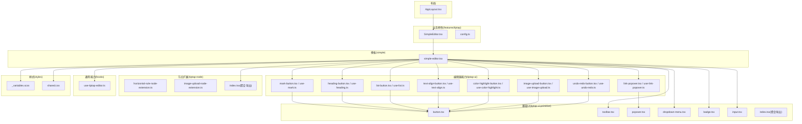
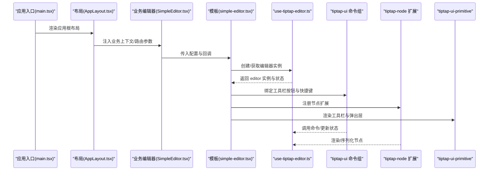
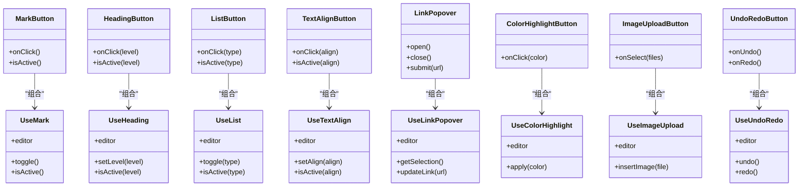
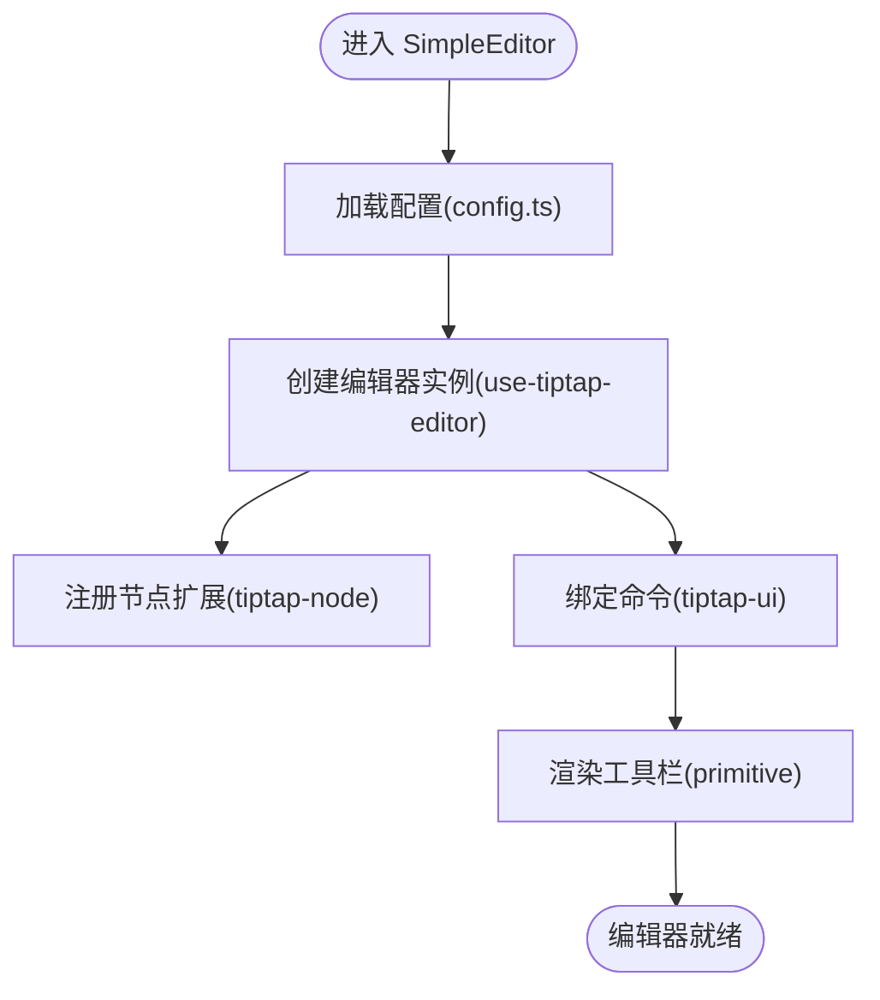
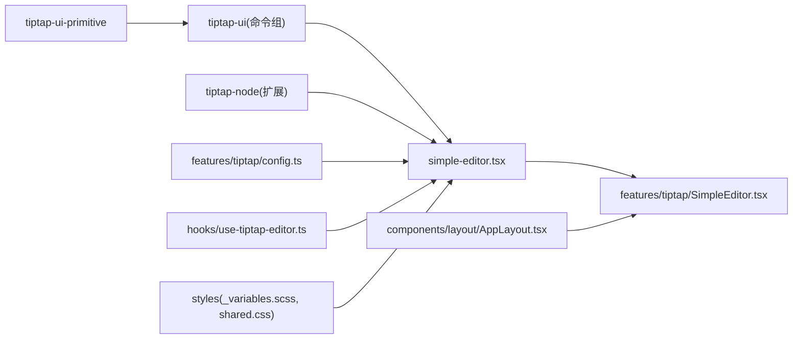

# 组件架构设计

<cite>
**本文引用的文件**   
- [src/components/layout/AppLayout.tsx](file://src/components/layout/AppLayout.tsx)
- [src/components/tiptap-ui-primitive/button.tsx](file://src/components/tiptap-ui-primitive/button.tsx)
- [src/components/tiptap-ui-primitive/toolbar.tsx](file://src/components/tiptap-ui-primitive/toolbar.tsx)
- [src/components/tiptap-ui-primitive/popover.tsx](file://src/components/tiptap-ui-primitive/popover.tsx)
- [src/components/tiptap-ui-primitive/dropdown-menu.tsx](file://src/components/tiptap-ui-primitive/dropdown-menu.tsx)
- [src/components/tiptap-ui-primitive/badge.tsx](file://src/components/tiptap-ui-primitive/badge.tsx)
- [src/components/tiptap-ui-primitive/input.tsx](file://src/components/tiptap-ui-primitive/input.tsx)
- [src/components/tiptap-ui-primitive/index.tsx](file://src/components/tiptap-ui-primitive/index.tsx)
- [src/components/tiptap-ui/mark-button.tsx](file://src/components/tiptap-ui/mark-button.tsx)
- [src/components/tiptap-ui/use-mark.ts](file://src/components/tiptap-ui/use-mark.ts)
- [src/components/tiptap-ui/heading-button.tsx](file://src/components/tiptap-ui/heading-button.tsx)
- [src/components/tiptap-ui/use-heading.ts](file://src/components/tiptap-ui/use-heading.ts)
- [src/components/tiptap-ui/list-button.tsx](file://src/components/tiptap-ui/list-button.tsx)
- [src/components/tiptap-ui/use-list.ts](file://src/components/tiptap-ui/use-list.ts)
- [src/components/tiptap-ui/text-align-button.tsx](file://src/components/tiptap-ui/text-align-button.tsx)
- [src/components/tiptap-ui/use-text-align.ts](file://src/components/tiptap-ui/use-text-align.ts)
- [src/components/tiptap-ui/link-popover.tsx](file://src/components/tiptap-ui/link-popover.tsx)
- [src/components/tiptap-ui/use-link-popover.ts](file://src/components/tiptap-ui/use-link-popover.ts)
- [src/components/tiptap-ui/color-highlight-button.tsx](file://src/components/tiptap-ui/color-highlight-button.tsx)
- [src/components/tiptap-ui/use-color-highlight.ts](file://src/components/tiptap-ui/use-color-highlight.ts)
- [src/components/tiptap-ui/image-upload-button.tsx](file://src/components/tiptap-ui/image-upload-button.tsx)
- [src/components/tiptap-ui/use-image-upload.ts](file://src/components/tiptap-ui/use-image-upload.ts)
- [src/components/tiptap-ui/undo-redo-button.tsx](file://src/components/tiptap-ui/undo-redo-button.tsx)
- [src/components/tiptap-ui/use-undo-redo.ts](file://src/components/tiptap-ui/use-undo-redo.ts)
- [src/components/tiptap-node/image-upload-node-extension.ts](file://src/components/tiptap-node/image-upload-node-extension.ts)
- [src/components/tiptap-node/horizontal-rule-node-extension.ts](file://src/components/tiptap-node/horizontal-rule-node-extension.ts)
- [src/components/tiptap-node/index.tsx](file://src/components/tiptap-node/index.tsx)
- [src/components/tiptap-templates/simple/simple-editor.tsx](file://src/components/tiptap-templates/simple/simple-editor.tsx)
- [src/features/tiptap/SimpleEditor.tsx](file://src/features/tiptap/SimpleEditor.tsx)
- [src/features/tiptap/config.ts](file://src/features/tiptap/config.ts)
- [src/hooks/use-tiptap-editor.ts](file://src/hooks/use-tiptap-editor.ts)
- [src/styles/_variables.scss](file://src/styles/_variables.scss)
- [src/styles/shared.css](file://src/styles/shared.css)
- [src/main.tsx](file://src/main.tsx)
</cite>

## 目录
1. [简介](#简介)
2. [项目结构](#项目结构)
3. [核心组件](#核心组件)
4. [架构总览](#架构总览)
5. [详细组件分析](#详细组件分析)
6. [依赖关系分析](#依赖关系分析)
7. [性能考虑](#性能考虑)
8. [故障排查指南](#故障排查指南)
9. [结论](#结论)
10. [附录](#附录)

## 简介
本文件为 FishWorker 应用的组件架构设计文档，聚焦于 React 组件的分层与职责划分：基础 UI 组件（tiptap-ui-primitive）、业务组件（features）和布局组件（layout）。文档同时阐述组件复用策略与设计模式（组合、高阶组件、自定义 Hooks），并深入解析 TipTap 编辑器扩展体系（节点扩展、标记扩展、工具栏组件）。此外，提供响应式设计与主题系统实现说明、组件依赖图、最佳实践、测试策略与性能优化建议。

## 项目结构
FishWorker 前端采用“分层 + 领域”的组织方式：
- 基础 UI 层：位于 src/components/tiptap-ui-primitive，提供无业务语义的原子化 UI 控件（按钮、工具栏、弹出层、下拉菜单、徽章、输入等）。
- 编辑器能力层：位于 src/components/tiptap-ui 与 src/components/tiptap-node，封装 TipTap 相关的交互与扩展（标记操作、列表、标题、链接气泡、颜色高亮、图片上传、撤销重做等；以及节点扩展如水平线、图片上传节点）。
- 模板与集成层：位于 src/components/tiptap-templates/simple，提供开箱即用的简单编辑器模板。
- 业务特性层：位于 src/features，按功能域组织（每日回顾、习惯、清单、使命、设置、时间管理、TipTap 集成等）。
- 布局层：位于 src/components/layout，负责应用级页面骨架与区域划分。
- 通用能力层：位于 src/hooks 与 src/lib，提供跨模块复用的 Hook 与工具函数。
- 样式层：位于 src/styles，集中变量与共享样式。

图表来源
- [src/components/layout/AppLayout.tsx](file://src/components/layout/AppLayout.tsx)
- [src/components/tiptap-ui-primitive/index.tsx](file://src/components/tiptap-ui-primitive/index.tsx)
- [src/components/tiptap-ui/mark-button.tsx](file://src/components/tiptap-ui/mark-button.tsx)
- [src/components/tiptap-ui/heading-button.tsx](file://src/components/tiptap-ui/heading-button.tsx)
- [src/components/tiptap-ui/list-button.tsx](file://src/components/tiptap-ui/list-button.tsx)
- [src/components/tiptap-ui/text-align-button.tsx](file://src/components/tiptap-ui/text-align-button.tsx)
- [src/components/tiptap-ui/link-popover.tsx](file://src/components/tiptap-ui/link-popover.tsx)
- [src/components/tiptap-ui/color-highlight-button.tsx](file://src/components/tiptap-ui/color-highlight-button.tsx)
- [src/components/tiptap-ui/image-upload-button.tsx](file://src/components/tiptap-ui/image-upload-button.tsx)
- [src/components/tiptap-ui/undo-redo-button.tsx](file://src/components/tiptap-ui/undo-redo-button.tsx)
- [src/components/tiptap-node/index.tsx](file://src/components/tiptap-node/index.tsx)
- [src/components/tiptap-templates/simple/simple-editor.tsx](file://src/components/tiptap-templates/simple/simple-editor.tsx)
- [src/features/tiptap/SimpleEditor.tsx](file://src/features/tiptap/SimpleEditor.tsx)
- [src/features/tiptap/config.ts](file://src/features/tiptap/config.ts)
- [src/hooks/use-tiptap-editor.ts](file://src/hooks/use-tiptap-editor.ts)
- [src/styles/_variables.scss](file://src/styles/_variables.scss)
- [src/styles/shared.css](file://src/styles/shared.css)

章节来源
- [src/main.tsx:1-50](file://src/main.tsx#L1-L50)
- [src/components/layout/AppLayout.tsx:1-120](file://src/components/layout/AppLayout.tsx#L1-L120)
- [src/components/tiptap-ui-primitive/index.tsx:1-80](file://src/components/tiptap-ui-primitive/index.tsx#L1-L80)
- [src/components/tiptap-node/index.tsx:1-60](file://src/components/tiptap-node/index.tsx#L1-L60)
- [src/components/tiptap-templates/simple/simple-editor.tsx:1-120](file://src/components/tiptap-templates/simple/simple-editor.tsx#L1-L120)
- [src/features/tiptap/SimpleEditor.tsx:1-120](file://src/features/tiptap/SimpleEditor.tsx#L1-L120)
- [src/features/tiptap/config.ts:1-60](file://src/features/tiptap/config.ts#L1-L60)
- [src/hooks/use-tiptap-editor.ts:1-120](file://src/hooks/use-tiptap-editor.ts#L1-L120)
- [src/styles/_variables.scss:1-120](file://src/styles/_variables.scss#L1-L120)
- [src/styles/shared.css:1-120](file://src/styles/shared.css#L1-L120)

## 核心组件
本节从分层视角梳理关键组件的职责与协作关系。

- 布局组件（layout）
  - AppLayout：应用级容器，负责全局导航、侧边栏与主内容区布局、路由占位与全屏/弹窗容器的挂载点。
  - 职责边界：不承载具体业务逻辑，仅编排子区域与全局状态入口。

- 基础 UI 组件（tiptap-ui-primitive）
  - Button、Toolbar、Popover、DropdownMenu、Badge、Input 等：无业务语义、可组合的基础控件，统一样式与交互契约。
  - 通过 index.tsx 聚合导出，便于上层按需引用。

- 编辑器能力（tiptap-ui）
  - 标记类：MarkButton + useMark 用于加粗、斜体、删除线等文本标记切换。
  - 块级控制：HeadingButton + useHeading、ListButton + useList、TextAlignButton + useTextAlign 等。
  - 交互增强：LinkPopover + useLinkPopover、ColorHighlightButton + useColorHighlight、ImageUploadButton + useImageUpload、UndoRedoButton + useUndoRedo。
  - 设计模式：以“按钮/控制器 + 状态 Hook”的组合模式解耦 UI 与行为，避免重复订阅编辑器事件。

- 节点扩展（tiptap-node）
  - 水平线、图片上传等节点扩展，定义渲染与序列化规则，配合对应的 UI 按钮完成插入与编辑。
  - 通过 index.tsx 聚合导出，供编辑器模板装配。

- 模板与集成（tiptap-templates/simple 与 features/tiptap）
  - simple-editor.tsx：将基础 UI、编辑器能力与节点扩展组装为可复用的“简单编辑器”。
  - features/tiptap/SimpleEditor.tsx：在业务层对模板进行二次封装，注入业务配置（如工具栏项、快捷键、保存策略等）。
  - config.ts：集中管理编辑器插件、扩展、命令与工具栏配置。

- 通用能力（hooks）
  - use-tiptap-editor：封装 TipTap 实例生命周期、命令调用、状态订阅与副作用清理，作为上层 Hook 的统一入口。

章节来源
- [src/components/layout/AppLayout.tsx:1-120](file://src/components/layout/AppLayout.tsx#L1-L120)
- [src/components/tiptap-ui-primitive/index.tsx:1-80](file://src/components/tiptap-ui-primitive/index.tsx#L1-L80)
- [src/components/tiptap-ui/mark-button.tsx:1-120](file://src/components/tiptap-ui/mark-button.tsx#L1-L120)
- [src/components/tiptap-ui/use-mark.ts:1-120](file://src/components/tiptap-ui/use-mark.ts#L1-L120)
- [src/components/tiptap-ui/heading-button.tsx:1-120](file://src/components/tiptap-ui/heading-button.tsx#L1-L120)
- [src/components/tiptap-ui/use-heading.ts:1-120](file://src/components/tiptap-ui/use-heading.ts#L1-L120)
- [src/components/tiptap-ui/list-button.tsx:1-120](file://src/components/tiptap-ui/list-button.tsx#L1-L120)
- [src/components/tiptap-ui/use-list.ts:1-120](file://src/components/tiptap-ui/use-list.ts#L1-L120)
- [src/components/tiptap-ui/text-align-button.tsx:1-120](file://src/components/tiptap-ui/text-align-button.tsx#L1-L120)
- [src/components/tiptap-ui/use-text-align.ts:1-120](file://src/components/tiptap-ui/use-text-align.ts#L1-L120)
- [src/components/tiptap-ui/link-popover.tsx:1-120](file://src/components/tiptap-ui/link-popover.tsx#L1-L120)
- [src/components/tiptap-ui/use-link-popover.ts:1-120](file://src/components/tiptap-ui/use-link-popover.ts#L1-L120)
- [src/components/tiptap-ui/color-highlight-button.tsx:1-120](file://src/components/tiptap-ui/color-highlight-button.tsx#L1-L120)
- [src/components/tiptap-ui/use-color-highlight.ts:1-120](file://src/components/tiptap-ui/use-color-highlight.ts#L1-L120)
- [src/components/tiptap-ui/image-upload-button.tsx:1-120](file://src/components/tiptap-ui/image-upload-button.tsx#L1-L120)
- [src/components/tiptap-ui/use-image-upload.ts:1-120](file://src/components/tiptap-ui/use-image-upload.ts#L1-L120)
- [src/components/tiptap-ui/undo-redo-button.tsx:1-120](file://src/components/tiptap-ui/undo-redo-button.tsx#L1-L120)
- [src/components/tiptap-ui/use-undo-redo.ts:1-120](file://src/components/tiptap-ui/use-undo-redo.ts#L1-L120)
- [src/components/tiptap-node/index.tsx:1-60](file://src/components/tiptap-node/index.tsx#L1-L60)
- [src/components/tiptap-node/horizontal-rule-node-extension.ts:1-120](file://src/components/tiptap-node/horizontal-rule-node-extension.ts#L1-L120)
- [src/components/tiptap-node/image-upload-node-extension.ts:1-120](file://src/components/tiptap-node/image-upload-node-extension.ts#L1-L120)
- [src/components/tiptap-templates/simple/simple-editor.tsx:1-120](file://src/components/tiptap-templates/simple/simple-editor.tsx#L1-L120)
- [src/features/tiptap/SimpleEditor.tsx:1-120](file://src/features/tiptap/SimpleEditor.tsx#L1-L120)
- [src/features/tiptap/config.ts:1-60](file://src/features/tiptap/config.ts#L1-L60)
- [src/hooks/use-tiptap-editor.ts:1-120](file://src/hooks/use-tiptap-editor.ts#L1-L120)

## 架构总览
下图展示从应用入口到编辑器能力的整体数据与控制流。

图表来源
- [src/main.tsx:1-50](file://src/main.tsx#L1-L50)
- [src/components/layout/AppLayout.tsx:1-120](file://src/components/layout/AppLayout.tsx#L1-L120)
- [src/features/tiptap/SimpleEditor.tsx:1-120](file://src/features/tiptap/SimpleEditor.tsx#L1-L120)
- [src/components/tiptap-templates/simple/simple-editor.tsx:1-120](file://src/components/tiptap-templates/simple/simple-editor.tsx#L1-L120)
- [src/hooks/use-tiptap-editor.ts:1-120](file://src/hooks/use-tiptap-editor.ts#L1-L120)
- [src/components/tiptap-ui/mark-button.tsx:1-120](file://src/components/tiptap-ui/mark-button.tsx#L1-L120)
- [src/components/tiptap-node/index.tsx:1-60](file://src/components/tiptap-node/index.tsx#L1-L60)
- [src/components/tiptap-ui-primitive/index.tsx:1-80](file://src/components/tiptap-ui-primitive/index.tsx#L1-L80)

## 详细组件分析

### 基础 UI 组件（tiptap-ui-primitive）
- 职责
  - 提供无业务语义的原子控件：Button、Toolbar、Popover、DropdownMenu、Badge、Input、Separator、Tooltip、Spacer 等。
  - 统一样式与可访问性约定，确保上层组合时的体验一致性。
- 设计要点
  - 纯展示型为主，尽量保持受控与非受控两种形态的可选项。
  - 通过 index.tsx 聚合导出，减少上层导入路径复杂度。
- 典型用法
  - 工具栏由 Toolbar 包裹多个 Button/DropdownMenu/Popover 组成。
  - 表单输入使用 Input，支持主题变量与尺寸变体。

章节来源
- [src/components/tiptap-ui-primitive/button.tsx:1-120](file://src/components/tiptap-ui-primitive/button.tsx#L1-L120)
- [src/components/tiptap-ui-primitive/toolbar.tsx:1-120](file://src/components/tiptap-ui-primitive/toolbar.tsx#L1-L120)
- [src/components/tiptap-ui-primitive/popover.tsx:1-120](file://src/components/tiptap-ui-primitive/popover.tsx#L1-L120)
- [src/components/tiptap-ui-primitive/dropdown-menu.tsx:1-120](file://src/components/tiptap-ui-primitive/dropdown-menu.tsx#L1-L120)
- [src/components/tiptap-ui-primitive/badge.tsx:1-120](file://src/components/tiptap-ui-primitive/badge.tsx#L1-L120)
- [src/components/tiptap-ui-primitive/input.tsx:1-120](file://src/components/tiptap-ui-primitive/input.tsx#L1-L120)
- [src/components/tiptap-ui-primitive/index.tsx:1-80](file://src/components/tiptap-ui-primitive/index.tsx#L1-L80)

### 编辑器能力（tiptap-ui）
- 设计模式
  - “按钮 + Hook”的组合模式：每个能力由一个按钮组件与其对应的 useXxx Hook 组成，按钮只负责 UI 与点击事件，Hook 负责订阅编辑器状态与执行命令。
  - 通过 use-tiptap-editor 统一获取 editor 实例，避免重复初始化与内存泄漏。
- 关键能力
  - 标记操作：MarkButton + useMark（加粗、斜体、删除线等）。
  - 段落与列表：HeadingButton + useHeading、ListButton + useList、TextAlignButton + useTextAlign。
  - 交互增强：LinkPopover + useLinkPopover、ColorHighlightButton + useColorHighlight、ImageUploadButton + useImageUpload、UndoRedoButton + useUndoRedo。
- 与基础 UI 的关系
  - 所有按钮均基于 primitive 的 Button 构建，弹出层基于 Popover/DropdownMenu，保证风格一致。

图表来源
- [src/components/tiptap-ui/mark-button.tsx:1-120](file://src/components/tiptap-ui/mark-button.tsx#L1-L120)
- [src/components/tiptap-ui/use-mark.ts:1-120](file://src/components/tiptap-ui/use-mark.ts#L1-L120)
- [src/components/tiptap-ui/heading-button.tsx:1-120](file://src/components/tiptap-ui/heading-button.tsx#L1-L120)
- [src/components/tiptap-ui/use-heading.ts:1-120](file://src/components/tiptap-ui/use-heading.ts#L1-L120)
- [src/components/tiptap-ui/list-button.tsx:1-120](file://src/components/tiptap-ui/list-button.tsx#L1-L120)
- [src/components/tiptap-ui/use-list.ts:1-120](file://src/components/tiptap-ui/use-list.ts#L1-L120)
- [src/components/tiptap-ui/text-align-button.tsx:1-120](file://src/components/tiptap-ui/text-align-button.tsx#L1-L120)
- [src/components/tiptap-ui/use-text-align.ts:1-120](file://src/components/tiptap-ui/use-text-align.ts#L1-L120)
- [src/components/tiptap-ui/link-popover.tsx:1-120](file://src/components/tiptap-ui/link-popover.tsx#L1-L120)
- [src/components/tiptap-ui/use-link-popover.ts:1-120](file://src/components/tiptap-ui/use-link-popover.ts#L1-L120)
- [src/components/tiptap-ui/color-highlight-button.tsx:1-120](file://src/components/tiptap-ui/color-highlight-button.tsx#L1-L120)
- [src/components/tiptap-ui/use-color-highlight.ts:1-120](file://src/components/tiptap-ui/use-color-highlight.ts#L1-L120)
- [src/components/tiptap-ui/image-upload-button.tsx:1-120](file://src/components/tiptap-ui/image-upload-button.tsx#L1-L120)
- [src/components/tiptap-ui/use-image-upload.ts:1-120](file://src/components/tiptap-ui/use-image-upload.ts#L1-L120)
- [src/components/tiptap-ui/undo-redo-button.tsx:1-120](file://src/components/tiptap-ui/undo-redo-button.tsx#L1-L120)
- [src/components/tiptap-ui/use-undo-redo.ts:1-120](file://src/components/tiptap-ui/use-undo-redo.ts#L1-L120)

章节来源
- [src/components/tiptap-ui/mark-button.tsx:1-120](file://src/components/tiptap-ui/mark-button.tsx#L1-L120)
- [src/components/tiptap-ui/use-mark.ts:1-120](file://src/components/tiptap-ui/use-mark.ts#L1-L120)
- [src/components/tiptap-ui/heading-button.tsx:1-120](file://src/components/tiptap-ui/heading-button.tsx#L1-L120)
- [src/components/tiptap-ui/use-heading.ts:1-120](file://src/components/tiptap-ui/use-heading.ts#L1-L120)
- [src/components/tiptap-ui/list-button.tsx:1-120](file://src/components/tiptap-ui/list-button.tsx#L1-L120)
- [src/components/tiptap-ui/use-list.ts:1-120](file://src/components/tiptap-ui/use-list.ts#L1-L120)
- [src/components/tiptap-ui/text-align-button.tsx:1-120](file://src/components/tiptap-ui/text-align-button.tsx#L1-L120)
- [src/components/tiptap-ui/use-text-align.ts:1-120](file://src/components/tiptap-ui/use-text-align.ts#L1-L120)
- [src/components/tiptap-ui/link-popover.tsx:1-120](file://src/components/tiptap-ui/link-popover.tsx#L1-L120)
- [src/components/tiptap-ui/use-link-popover.ts:1-120](file://src/components/tiptap-ui/use-link-popover.ts#L1-L120)
- [src/components/tiptap-ui/color-highlight-button.tsx:1-120](file://src/components/tiptap-ui/color-highlight-button.tsx#L1-L120)
- [src/components/tiptap-ui/use-color-highlight.ts:1-120](file://src/components/tiptap-ui/use-color-highlight.ts#L1-L120)
- [src/components/tiptap-ui/image-upload-button.tsx:1-120](file://src/components/tiptap-ui/image-upload-button.tsx#L1-L120)
- [src/components/tiptap-ui/use-image-upload.ts:1-120](file://src/components/tiptap-ui/use-image-upload.ts#L1-L120)
- [src/components/tiptap-ui/undo-redo-button.tsx:1-120](file://src/components/tiptap-ui/undo-redo-button.tsx#L1-L120)
- [src/components/tiptap-ui/use-undo-redo.ts:1-120](file://src/components/tiptap-ui/use-undo-redo.ts#L1-L120)

### 节点扩展（tiptap-node）
- 职责
  - 定义自定义节点的 schema、渲染与序列化规则，例如水平线、图片上传节点等。
  - 与 tiptap-ui 中的对应按钮协作，完成插入、选中与编辑流程。
- 设计要点
  - 节点扩展与 UI 分离：扩展关注数据模型与渲染，UI 关注交互。
  - 通过 index.tsx 聚合导出，便于模板一次性注册。

章节来源
- [src/components/tiptap-node/horizontal-rule-node-extension.ts:1-120](file://src/components/tiptap-node/horizontal-rule-node-extension.ts#L1-L120)
- [src/components/tiptap-node/image-upload-node-extension.ts:1-120](file://src/components/tiptap-node/image-upload-node-extension.ts#L1-L120)
- [src/components/tiptap-node/index.tsx:1-60](file://src/components/tiptap-node/index.tsx#L1-L60)

### 模板与业务集成（tiptap-templates/simple 与 features/tiptap）
- 模板层（simple-editor.tsx）
  - 将基础 UI、编辑器能力与节点扩展拼装为“简单编辑器”，暴露最小必要 props（如初始值、只读、回调等）。
- 业务层（features/tiptap/SimpleEditor.tsx）
  - 在模板基础上注入业务配置（工具栏项、快捷键、自动保存、权限控制等），对外暴露更高层 API。
- 配置中心（config.ts）
  - 集中管理编辑器插件、扩展、命令与工具栏项，便于多场景复用与动态裁剪。

图表来源
- [src/components/tiptap-templates/simple/simple-editor.tsx:1-120](file://src/components/tiptap-templates/simple/simple-editor.tsx#L1-L120)
- [src/features/tiptap/SimpleEditor.tsx:1-120](file://src/features/tiptap/SimpleEditor.tsx#L1-L120)
- [src/features/tiptap/config.ts:1-60](file://src/features/tiptap/config.ts#L1-L60)
- [src/hooks/use-tiptap-editor.ts:1-120](file://src/hooks/use-tiptap-editor.ts#L1-L120)
- [src/components/tiptap-node/index.tsx:1-60](file://src/components/tiptap-node/index.tsx#L1-L60)
- [src/components/tiptap-ui-primitive/index.tsx:1-80](file://src/components/tiptap-ui-primitive/index.tsx#L1-L80)

章节来源
- [src/components/tiptap-templates/simple/simple-editor.tsx:1-120](file://src/components/tiptap-templates/simple/simple-editor.tsx#L1-L120)
- [src/features/tiptap/SimpleEditor.tsx:1-120](file://src/features/tiptap/SimpleEditor.tsx#L1-L120)
- [src/features/tiptap/config.ts:1-60](file://src/features/tiptap/config.ts#L1-L60)
- [src/hooks/use-tiptap-editor.ts:1-120](file://src/hooks/use-tiptap-editor.ts#L1-L120)

### 响应式设计与主题系统
- 响应式
  - 通过断点 Hook 与窗口尺寸 Hook 适配不同屏幕，结合 CSS 媒体查询与弹性布局实现。
  - 工具栏在小屏下折叠或滚动，弹出层与气泡菜单根据视口位置自适应。
- 主题
  - 使用 SCSS 变量与 CSS 变量统一管理色彩、字号、间距等，支持明暗主题切换。
  - 基础 UI 组件读取主题变量，确保全链路视觉一致。

章节来源
- [src/hooks/use-is-breakpoint.ts:1-120](file://src/hooks/use-is-breakpoint.ts#L1-L120)
- [src/hooks/use-window-size.ts:1-120](file://src/hooks/use-window-size.ts#L1-L120)
- [src/styles/_variables.scss:1-120](file://src/styles/_variables.scss#L1-L120)
- [src/styles/shared.css:1-120](file://src/styles/shared.css#L1-L120)

## 依赖关系分析
- 耦合与内聚
  - 基础 UI 组件低耦合、高内聚，被上层广泛复用。
  - 编辑器能力层通过 Hook 与基础 UI 组合，避免直接依赖具体实现。
  - 模板层聚合能力层与节点扩展，形成稳定的装配点。
  - 业务层仅依赖模板与配置，屏蔽底层细节。
- 外部依赖
  - TipTap 编辑器核心通过 use-tiptap-editor 抽象，降低替换成本。
  - 样式系统通过变量与共享样式文件集中管理。

图表来源
- [src/components/tiptap-ui-primitive/index.tsx:1-80](file://src/components/tiptap-ui-primitive/index.tsx#L1-L80)
- [src/components/tiptap-ui/mark-button.tsx:1-120](file://src/components/tiptap-ui/mark-button.tsx#L1-L120)
- [src/components/tiptap-node/index.tsx:1-60](file://src/components/tiptap-node/index.tsx#L1-L60)
- [src/components/tiptap-templates/simple/simple-editor.tsx:1-120](file://src/components/tiptap-templates/simple/simple-editor.tsx#L1-L120)
- [src/features/tiptap/SimpleEditor.tsx:1-120](file://src/features/tiptap/SimpleEditor.tsx#L1-L120)
- [src/features/tiptap/config.ts:1-60](file://src/features/tiptap/config.ts#L1-L60)
- [src/hooks/use-tiptap-editor.ts:1-120](file://src/hooks/use-tiptap-editor.ts#L1-L120)
- [src/styles/_variables.scss:1-120](file://src/styles/_variables.scss#L1-L120)
- [src/styles/shared.css:1-120](file://src/styles/shared.css#L1-L120)
- [src/components/layout/AppLayout.tsx:1-120](file://src/components/layout/AppLayout.tsx#L1-L120)

章节来源
- [src/components/tiptap-ui-primitive/index.tsx:1-80](file://src/components/tiptap-ui-primitive/index.tsx#L1-L80)
- [src/components/tiptap-ui/mark-button.tsx:1-120](file://src/components/tiptap-ui/mark-button.tsx#L1-L120)
- [src/components/tiptap-node/index.tsx:1-60](file://src/components/tiptap-node/index.tsx#L1-L60)
- [src/components/tiptap-templates/simple/simple-editor.tsx:1-120](file://src/components/tiptap-templates/simple/simple-editor.tsx#L1-L120)
- [src/features/tiptap/SimpleEditor.tsx:1-120](file://src/features/tiptap/SimpleEditor.tsx#L1-L120)
- [src/features/tiptap/config.ts:1-60](file://src/features/tiptap/config.ts#L1-L60)
- [src/hooks/use-tiptap-editor.ts:1-120](file://src/hooks/use-tiptap-editor.ts#L1-L120)
- [src/styles/_variables.scss:1-120](file://src/styles/_variables.scss#L1-L120)
- [src/styles/shared.css:1-120](file://src/styles/shared.css#L1-L120)
- [src/components/layout/AppLayout.tsx:1-120](file://src/components/layout/AppLayout.tsx#L1-L120)

## 性能考虑
- 编辑器实例管理
  - 使用统一的 use-tiptap-editor 管理实例生命周期，避免重复创建与内存泄漏。
  - 仅在必要时订阅编辑器状态，减少重渲染范围。
- 组件粒度与惰性加载
  - 将重型能力（如图片上传、复杂弹出层）按需加载或延迟初始化。
  - 工具栏项通过配置动态生成，避免无关组件常驻内存。
- 样式与主题
  - 使用 CSS 变量与 SCSS 变量，减少运行时计算与样式抖动。
  - 大段内容渲染时启用虚拟滚动或分页策略（在业务层实现）。
- 事件节流与防抖
  - 对高频事件（如输入、滚动、拖拽）进行节流/防抖处理，降低主线程压力。

[本节为通用指导，无需源码引用]

## 故障排查指南
- 常见问题定位
  - 编辑器未渲染：检查 use-tiptap-editor 是否正确初始化与销毁；确认节点扩展是否注册。
  - 工具栏无效：核对对应 useXxx Hook 是否订阅了正确的编辑器状态；确认命令调用是否处于有效选择范围。
  - 主题异常：确认 SCSS/CSS 变量是否生效；检查暗黑/明亮模式切换逻辑。
- 调试建议
  - 在模板层打印编辑器实例与当前状态，快速定位问题来源。
  - 使用浏览器开发者工具的组件树与样式面板，验证 DOM 结构与样式覆盖。
  - 针对复杂交互（如气泡菜单、下拉菜单）记录触发顺序与边界条件。

章节来源
- [src/hooks/use-tiptap-editor.ts:1-120](file://src/hooks/use-tiptap-editor.ts#L1-L120)
- [src/components/tiptap-templates/simple/simple-editor.tsx:1-120](file://src/components/tiptap-templates/simple/simple-editor.tsx#L1-L120)
- [src/styles/_variables.scss:1-120](file://src/styles/_variables.scss#L1-L120)
- [src/styles/shared.css:1-120](file://src/styles/shared.css#L1-L120)

## 结论
FishWorker 的组件架构遵循清晰的分层与职责划分：基础 UI 组件提供稳定原语，编辑器能力层以组合模式解耦 UI 与行为，模板层负责装配，业务层专注配置与集成。TipTap 扩展体系通过节点与标记扩展实现灵活的内容建模，配合响应式与主题系统，形成可扩展、可维护的前端组件生态。建议在后续迭代中持续完善测试覆盖率与性能监控，进一步巩固架构优势。

[本节为总结性内容，无需源码引用]

## 附录
- 最佳实践
  - 优先使用组合而非继承，保持组件单一职责。
  - 将状态与副作用下沉至 Hook，组件保持纯展示。
  - 通过配置驱动工具栏与能力开关，提升复用性。
  - 为关键交互编写单元测试与端到端用例，保障稳定性。
- 测试策略
  - 基础 UI 组件：快照测试与交互断言。
  - 编辑器能力：模拟编辑器实例，断言命令执行与状态变化。
  - 模板与业务集成：端到端测试覆盖主要用户流程。

[本节为通用指导，无需源码引用]