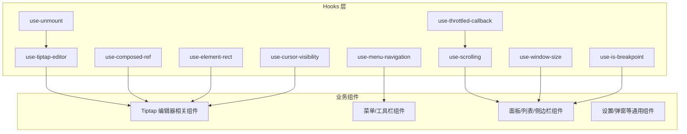
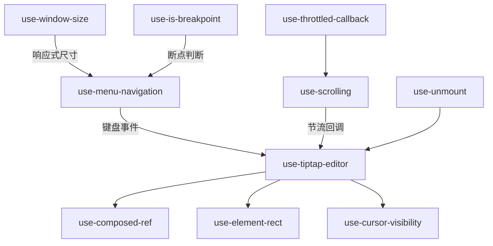
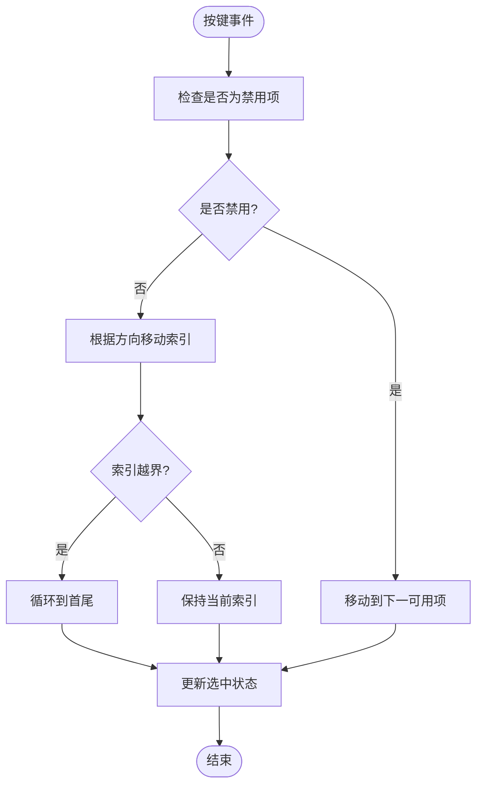
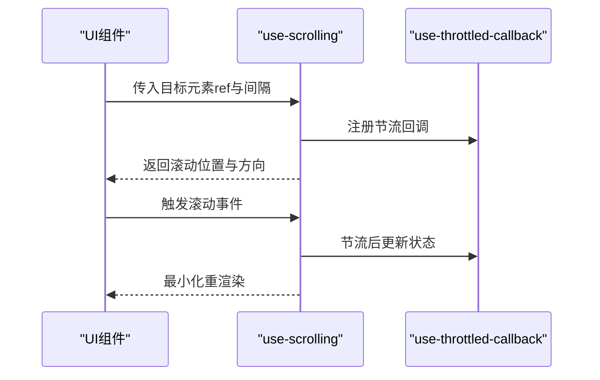
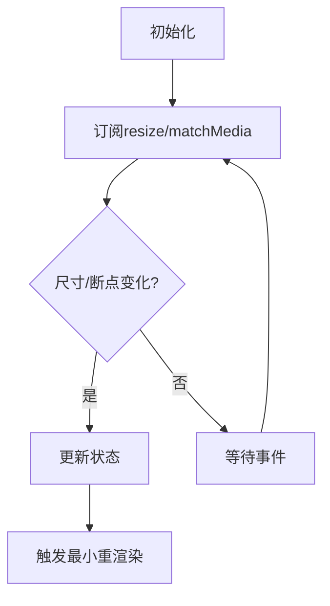
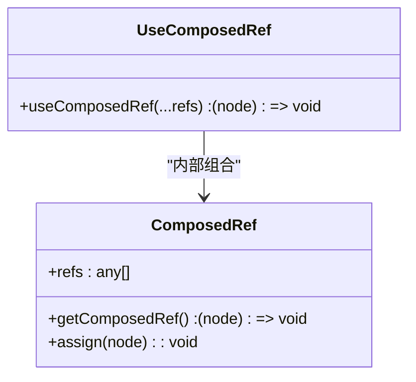
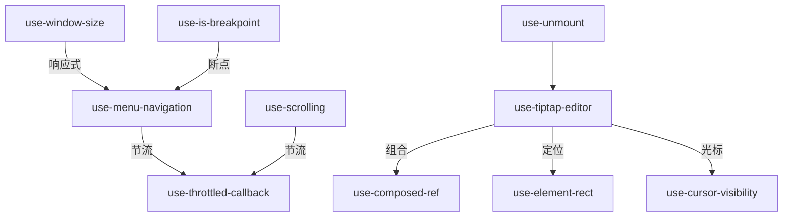

# 自定义 Hooks 架构

<cite>
**本文引用的文件**
- [use-tiptap-editor.ts](file://src/hooks/use-tiptap-editor.ts)
- [use-composed-ref.ts](file://src/hooks/use-composed-ref.ts)
- [use-menu-navigation.ts](file://src/hooks/use-menu-navigation.ts)
- [use-scrolling.ts](file://src/hooks/use-scrolling.ts)
- [use-window-size.ts](file://src/hooks/use-window-size.ts)
- [use-element-rect.ts](file://src/hooks/use-element-rect.ts)
- [use-is-breakpoint.ts](file://src/hooks/use-is-breakpoint.ts)
- [use-throttled-callback.ts](file://src/hooks/use-throttled-callback.ts)
- [use-unmount.ts](file://src/hooks/use-unmount.ts)
- [use-cursor-visibility.ts](file://src/hooks/use-cursor-visibility.ts)
</cite>

## 目录
1. [简介](#简介)
2. [项目结构](#项目结构)
3. [核心组件](#核心组件)
4. [架构总览](#架构总览)
5. [详细组件分析](#详细组件分析)
6. [依赖分析](#依赖分析)
7. [性能考虑](#性能考虑)
8. [故障排查指南](#故障排查指南)
9. [结论](#结论)
10. [附录](#附录)

## 简介
本文件聚焦 FishWorker 应用前端中的自定义 Hooks 架构，围绕 hooks 目录下的核心 Hook 进行系统化文档化。内容涵盖设计理念、参数与返回值约定、错误处理策略、组合模式与依赖管理、测试方法与性能优化技巧，以及可重用性与可维护性最佳实践。目标是帮助开发者快速理解并高效使用这些 Hook，同时为后续扩展与维护提供清晰指引。

## 项目结构
hooks 目录采用“按能力划分”的组织方式，每个 Hook 独立文件，职责单一、边界清晰。核心 Hook 包括：
- use-tiptap-editor：封装 Tiptap 编辑器实例的创建、配置与生命周期管理
- use-composed-ref：组合多个 ref，便于将 DOM 引用透传到第三方库或子组件
- use-menu-navigation：键盘导航菜单（方向键/回车/Esc）的可访问性增强
- use-scrolling：滚动状态监听与节流控制
- use-window-size：窗口尺寸响应式数据
- 辅助 Hook：use-element-rect、use-is-breakpoint、use-throttled-callback、use-unmount、use-cursor-visibility 等



[无图表来源；该图为概念性结构示意]

## 核心组件
本节概述各 Hook 的设计目标、典型参数与返回值结构、错误处理与副作用管理要点。为避免泄露实现细节，本节不展示具体代码片段，仅给出路径引用与行为说明。

- use-tiptap-editor
  - 设计目标：统一创建和配置 Tiptap 编辑器实例，集中管理扩展、命令、事件与销毁逻辑
  - 典型参数：编辑器容器 ref、初始化配置对象、是否受控、自动保存开关等
  - 典型返回：编辑器实例、更新方法、状态快照、事件回调注册接口
  - 错误处理：对无效容器、重复初始化、扩展加载失败等进行兜底与提示
  - 副作用：在挂载时初始化，卸载时销毁实例，避免内存泄漏
  - 参考路径：[use-tiptap-editor.ts](file://src/hooks/use-tiptap-editor.ts)

- use-composed-ref
  - 设计目标：将多个 ref 合并为一个，支持函数 ref 与对象 ref 的组合转发
  - 典型参数：任意数量的 ref（函数或对象）
  - 典型返回：组合后的 ref 回调
  - 错误处理：忽略空 ref、兼容 React 18 并发模式
  - 参考路径：[use-composed-ref.ts](file://src/hooks/use-composed-ref.ts)

- use-menu-navigation
  - 设计目标：为菜单项提供键盘导航（上/下/左/右/回车/Esc），提升可访问性
  - 典型参数：菜单项集合、当前选中索引、禁用项集合、回调（选中变更）
  - 典型返回：当前索引、焦点管理方法、键盘事件处理器
  - 错误处理：越界保护、空集合保护、禁用项跳过
  - 参考路径：[use-menu-navigation.ts](file://src/hooks/use-menu-navigation.ts)

- use-scrolling
  - 设计目标：监听元素滚动状态并提供节流控制，减少高频重渲染
  - 典型参数：目标元素 ref、节流间隔、是否启用
  - 典型返回：滚动位置、滚动方向、节流后的滚动事件处理器
  - 错误处理：元素不存在时的降级处理
  - 参考路径：[use-scrolling.ts](file://src/hooks/use-scrolling.ts)

- use-window-size
  - 设计目标：响应式获取窗口宽高，触发最小化重渲染
  - 典型参数：初始值、是否立即订阅
  - 典型返回：宽度、高度、可选的防抖/节流选项
  - 错误处理：服务端渲染环境下的默认值回退
  - 参考路径：[use-window-size.ts](file://src/hooks/use-window-size.ts)

- 辅助 Hook
  - use-element-rect：获取元素矩形信息，常用于定位气泡菜单或浮层
    - 参考路径：[use-element-rect.ts](file://src/hooks/use-element-rect.ts)
  - use-is-breakpoint：基于媒体查询的断点判断，用于响应式布局
    - 参考路径：[use-is-breakpoint.ts](file://src/hooks/use-is-breakpoint.ts)
  - use-throttled-callback：节流包装回调，降低高频调用成本
    - 参考路径：[use-throttled-callback.ts](file://src/hooks/use-throttled-callback.ts)
  - use-unmount：在组件卸载时执行清理逻辑
    - 参考路径：[use-unmount.ts](file://src/hooks/use-unmount.ts)
  - use-cursor-visibility：光标可见性控制，配合编辑器交互体验优化
    - 参考路径：[use-cursor-visibility.ts](file://src/hooks/use-cursor-visibility.ts)

**章节来源**
- [use-tiptap-editor.ts](file://src/hooks/use-tiptap-editor.ts)
- [use-composed-ref.ts](file://src/hooks/use-composed-ref.ts)
- [use-menu-navigation.ts](file://src/hooks/use-menu-navigation.ts)
- [use-scrolling.ts](file://src/hooks/use-scrolling.ts)
- [use-window-size.ts](file://src/hooks/use-window-size.ts)
- [use-element-rect.ts](file://src/hooks/use-element-rect.ts)
- [use-is-breakpoint.ts](file://src/hooks/use-is-breakpoint.ts)
- [use-throttled-callback.ts](file://src/hooks/use-throttled-callback.ts)
- [use-unmount.ts](file://src/hooks/use-unmount.ts)
- [use-cursor-visibility.ts](file://src/hooks/use-cursor-visibility.ts)

## 架构总览
下图展示了核心 Hook 之间的协作关系与数据流向。use-tiptap-editor 作为编辑器中枢，依赖 use-composed-ref 完成 DOM 引用转发，结合 use-element-rect 与 use-cursor-visibility 提升交互体验；use-menu-navigation 与 use-scrolling 分别服务于菜单与滚动场景；use-window-size 与 use-is-breakpoint 提供响应式能力；use-throttled-callback 与 use-unmount 贯穿性能与资源清理。



**图表来源**
- [use-tiptap-editor.ts](file://src/hooks/use-tiptap-editor.ts)
- [use-composed-ref.ts](file://src/hooks/use-composed-ref.ts)
- [use-element-rect.ts](file://src/hooks/use-element-rect.ts)
- [use-cursor-visibility.ts](file://src/hooks/use-cursor-visibility.ts)
- [use-menu-navigation.ts](file://src/hooks/use-menu-navigation.ts)
- [use-scrolling.ts](file://src/hooks/use-scrolling.ts)
- [use-window-size.ts](file://src/hooks/use-window-size.ts)
- [use-is-breakpoint.ts](file://src/hooks/use-is-breakpoint.ts)
- [use-throttled-callback.ts](file://src/hooks/use-throttled-callback.ts)
- [use-unmount.ts](file://src/hooks/use-unmount.ts)

## 详细组件分析

### use-tiptap-editor 分析
- 设计模式：工厂 + 生命周期管理
- 关键职责：
  - 创建与缓存编辑器实例
  - 注入扩展与命令
  - 绑定事件与撤销栈
  - 受控与非受控模式切换
  - 安全销毁与内存回收
- 复杂度：
  - 时间复杂度：初始化 O(n)（n 为扩展数量），更新 O(1)
  - 空间复杂度：O(n)（扩展与事件句柄）
- 错误处理：
  - 容器为空时抛出明确错误
  - 重复初始化时拒绝创建并返回已有实例
  - 扩展加载失败时降级到基础功能
- 性能优化：
  - 使用惰性初始化与按需扩展
  - 通过 use-composed-ref 减少不必要的重渲染
  - 结合 use-throttled-callback 控制高频事件

```mermaid
sequenceDiagram
participant Comp as "编辑器组件"
participant Hook as "use-tiptap-editor"
participant Ref as "use-composed-ref"
participant Rect as "use-element-rect"
participant Cursor as "use-cursor-visibility"
Comp->>Hook : 传入容器ref与配置
Hook->>Ref : 组合DOM引用
Hook->>Rect : 计算容器矩形
Hook->>Cursor : 初始化光标可见性
Hook-->>Comp : 返回编辑器实例与方法
Comp->>Hook : 更新内容/命令
Hook-->>Comp : 同步状态与视图
```

**图表来源**
- [use-tiptap-editor.ts](file://src/hooks/use-tiptap-editor.ts)
- [use-composed-ref.ts](file://src/hooks/use-composed-ref.ts)
- [use-element-rect.ts](file://src/hooks/use-element-rect.ts)
- [use-cursor-visibility.ts](file://src/hooks/use-cursor-visibility.ts)

**章节来源**
- [use-tiptap-editor.ts](file://src/hooks/use-tiptap-editor.ts)
- [use-composed-ref.ts](file://src/hooks/use-composed-ref.ts)
- [use-element-rect.ts](file://src/hooks/use-element-rect.ts)
- [use-cursor-visibility.ts](file://src/hooks/use-cursor-visibility.ts)

### use-menu-navigation 分析
- 设计模式：状态机 + 事件分发
- 关键职责：
  - 维护当前选中索引
  - 处理方向键导航与回车确认
  - 过滤禁用项与边界检查
- 复杂度：
  - 时间复杂度：O(1) 每次按键
  - 空间复杂度：O(1)
- 错误处理：
  - 空菜单项集合时返回默认状态
  - 越界索引修正为有效范围
- 性能优化：
  - 使用稳定比较与最小状态更新
  - 与 use-throttled-callback 组合降低事件频率



**图表来源**
- [use-menu-navigation.ts](file://src/hooks/use-menu-navigation.ts)
- [use-throttled-callback.ts](file://src/hooks/use-throttled-callback.ts)

**章节来源**
- [use-menu-navigation.ts](file://src/hooks/use-menu-navigation.ts)
- [use-throttled-callback.ts](file://src/hooks/use-throttled-callback.ts)

### use-scrolling 分析
- 设计模式：观察者 + 节流器
- 关键职责：
  - 监听滚动事件并记录位置与方向
  - 提供节流回调以限制重渲染频率
- 复杂度：
  - 时间复杂度：O(1) 每次滚动事件
  - 空间复杂度：O(1)
- 错误处理：
  - 目标元素不存在时返回空状态
- 性能优化：
  - 使用 requestAnimationFrame 或节流策略
  - 与 use-throttled-callback 组合确保一致性



**图表来源**
- [use-scrolling.ts](file://src/hooks/use-scrolling.ts)
- [use-throttled-callback.ts](file://src/hooks/use-throttled-callback.ts)

**章节来源**
- [use-scrolling.ts](file://src/hooks/use-scrolling.ts)
- [use-throttled-callback.ts](file://src/hooks/use-throttled-callback.ts)

### use-window-size 与 use-is-breakpoint 分析
- use-window-size：
  - 订阅 window.resize 事件，返回宽/高
  - 支持 SSR 环境下的默认值回退
- use-is-breakpoint：
  - 基于 matchMedia 监听断点变化
  - 返回布尔值，驱动响应式分支



**图表来源**
- [use-window-size.ts](file://src/hooks/use-window-size.ts)
- [use-is-breakpoint.ts](file://src/hooks/use-is-breakpoint.ts)

**章节来源**
- [use-window-size.ts](file://src/hooks/use-window-size.ts)
- [use-is-breakpoint.ts](file://src/hooks/use-is-breakpoint.ts)

### use-composed-ref 分析
- 设计模式：高阶函数 + 组合器
- 关键职责：
  - 合并多个 ref（函数或对象）
  - 在 React 18 并发模式下安全赋值
- 复杂度：
  - 时间复杂度：O(k)，k 为 ref 数量
  - 空间复杂度：O(1)
- 错误处理：
  - 忽略空 ref 与无效类型
- 性能优化：
  - 避免创建新的 ref 回调导致不必要重渲染



**图表来源**
- [use-composed-ref.ts](file://src/hooks/use-composed-ref.ts)

**章节来源**
- [use-composed-ref.ts](file://src/hooks/use-composed-ref.ts)

## 依赖分析
- 内聚与耦合：
  - use-tiptap-editor 内聚了编辑器生命周期与扩展管理，对外暴露简洁 API
  - 与其他 Hook 的耦合度低，主要通过参数与返回值组合
- 外部依赖：
  - Tiptap 编辑器库（由 use-tiptap-editor 引入）
  - 浏览器 API（window、matchMedia、requestAnimationFrame）
- 潜在循环依赖：
  - 当前 Hook 之间无直接导入循环，均为单向依赖
- 接口契约：
  - 所有 Hook 遵循 React Hooks 规范，保证顺序一致与副作用隔离



**图表来源**
- [use-tiptap-editor.ts](file://src/hooks/use-tiptap-editor.ts)
- [use-composed-ref.ts](file://src/hooks/use-composed-ref.ts)
- [use-element-rect.ts](file://src/hooks/use-element-rect.ts)
- [use-cursor-visibility.ts](file://src/hooks/use-cursor-visibility.ts)
- [use-menu-navigation.ts](file://src/hooks/use-menu-navigation.ts)
- [use-scrolling.ts](file://src/hooks/use-scrolling.ts)
- [use-window-size.ts](file://src/hooks/use-window-size.ts)
- [use-is-breakpoint.ts](file://src/hooks/use-is-breakpoint.ts)
- [use-throttled-callback.ts](file://src/hooks/use-throttled-callback.ts)
- [use-unmount.ts](file://src/hooks/use-unmount.ts)

**章节来源**
- [use-tiptap-editor.ts](file://src/hooks/use-tiptap-editor.ts)
- [use-composed-ref.ts](file://src/hooks/use-composed-ref.ts)
- [use-element-rect.ts](file://src/hooks/use-element-rect.ts)
- [use-cursor-visibility.ts](file://src/hooks/use-cursor-visibility.ts)
- [use-menu-navigation.ts](file://src/hooks/use-menu-navigation.ts)
- [use-scrolling.ts](file://src/hooks/use-scrolling.ts)
- [use-window-size.ts](file://src/hooks/use-window-size.ts)
- [use-is-breakpoint.ts](file://src/hooks/use-is-breakpoint.ts)
- [use-throttled-callback.ts](file://src/hooks/use-throttled-callback.ts)
- [use-unmount.ts](file://src/hooks/use-unmount.ts)

## 性能考虑
- 节流与防抖：
  - 使用 use-throttled-callback 包裹高频事件（滚动、输入、拖拽）
  - 合理设置节流间隔，平衡响应性与性能
- 最小化重渲染：
  - 使用稳定的 ref 与 memo 化返回值
  - 仅在必要时订阅 window 或 DOM 事件
- 懒加载与按需扩展：
  - 编辑器扩展按需加载，减少初始化开销
- 内存管理：
  - 使用 use-unmount 确保事件监听与定时器在卸载时清理
- 可观测性：
  - 在开发环境下开启日志与警告，生产环境关闭以提升性能

[本节为通用指导，无需特定文件来源]

## 故障排查指南
- 常见问题与定位步骤：
  - 编辑器未初始化：检查容器 ref 是否正确传递，是否存在重复初始化
    - 参考路径：[use-tiptap-editor.ts](file://src/hooks/use-tiptap-editor.ts)
  - 菜单导航异常：验证菜单项集合与禁用项配置，检查键盘事件绑定
    - 参考路径：[use-menu-navigation.ts](file://src/hooks/use-menu-navigation.ts)
  - 滚动卡顿：调整节流间隔，确认目标元素存在且可滚动
    - 参考路径：[use-scrolling.ts](file://src/hooks/use-scrolling.ts)
  - 响应式失效：检查 SSR 环境与 matchMedia 兼容性
    - 参考路径：[use-window-size.ts](file://src/hooks/use-window-size.ts)
    - 参考路径：[use-is-breakpoint.ts](file://src/hooks/use-is-breakpoint.ts)
- 调试建议：
  - 在开发环境打印 Hook 返回值与中间状态
  - 使用浏览器性能面板分析重渲染热点
  - 针对复杂交互编写单元测试与集成测试

**章节来源**
- [use-tiptap-editor.ts](file://src/hooks/use-tiptap-editor.ts)
- [use-menu-navigation.ts](file://src/hooks/use-menu-navigation.ts)
- [use-scrolling.ts](file://src/hooks/use-scrolling.ts)
- [use-window-size.ts](file://src/hooks/use-window-size.ts)
- [use-is-breakpoint.ts](file://src/hooks/use-is-breakpoint.ts)

## 结论
FishWorker 的自定义 Hooks 架构以“单一职责、低耦合、高内聚”为核心原则，通过组合模式将编辑器、菜单、滚动、响应式等能力解耦为可复用的 Hook。借助节流、懒加载与严格的副作用管理，系统在交互体验与性能之间取得良好平衡。建议在后续迭代中继续完善类型定义、错误边界与测试覆盖，进一步提升可维护性与可扩展性。

[本节为总结性内容，无需特定文件来源]

## 附录
- 测试方法建议：
  - 单元测试：模拟 DOM 与浏览器 API，验证 Hook 的参数校验与返回值
  - 集成测试：在真实组件中使用 Hook，观察交互与状态同步
  - 性能测试：使用基准测试对比节流前后的渲染次数与耗时
- 最佳实践清单：
  - 命名规范：useXxx 前缀，语义清晰
  - 参数校验：尽早失败，提供友好错误信息
  - 副作用隔离：在 useEffect 中管理事件与定时器
  - 返回值稳定：使用 useMemo/useCallback 避免不必要重渲染
  - 文档完善：为每个 Hook 提供参数、返回值与示例路径

[本节为通用指导，无需特定文件来源]