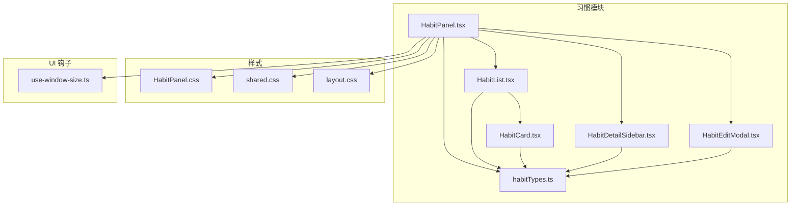
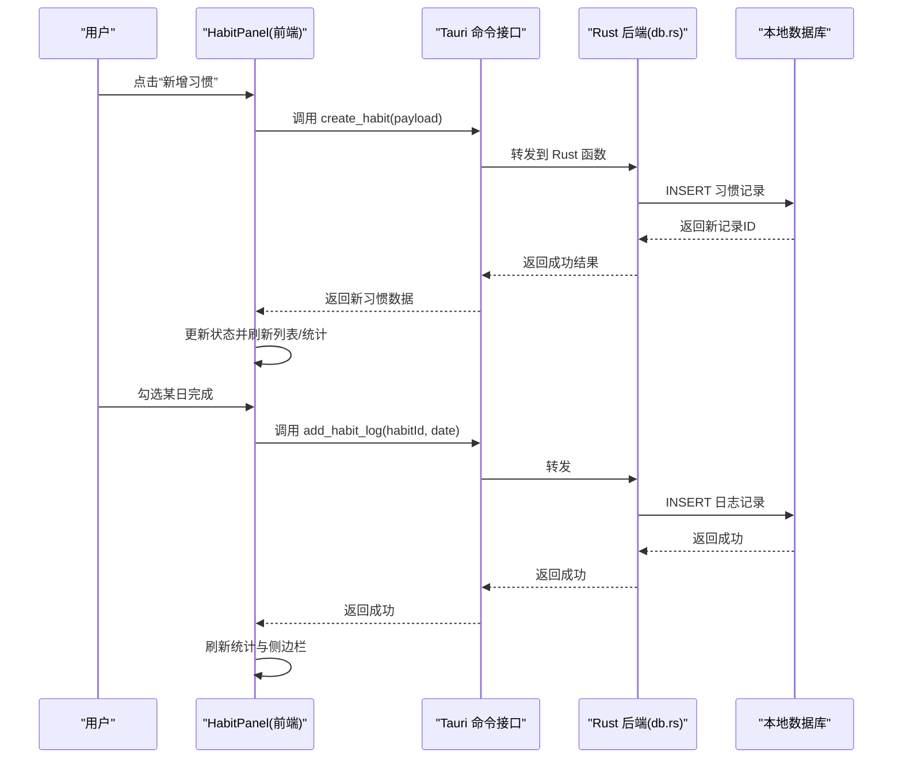
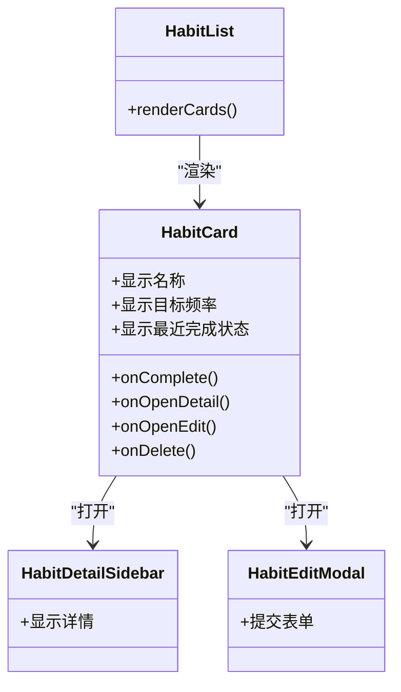
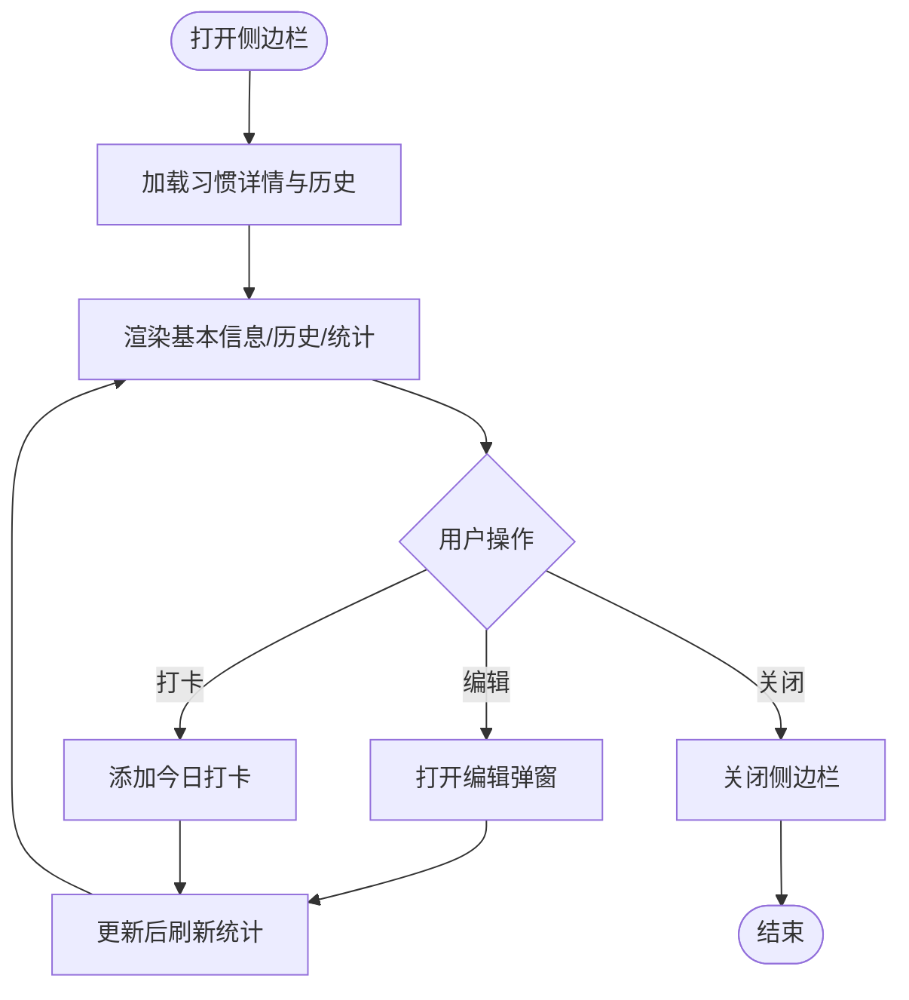
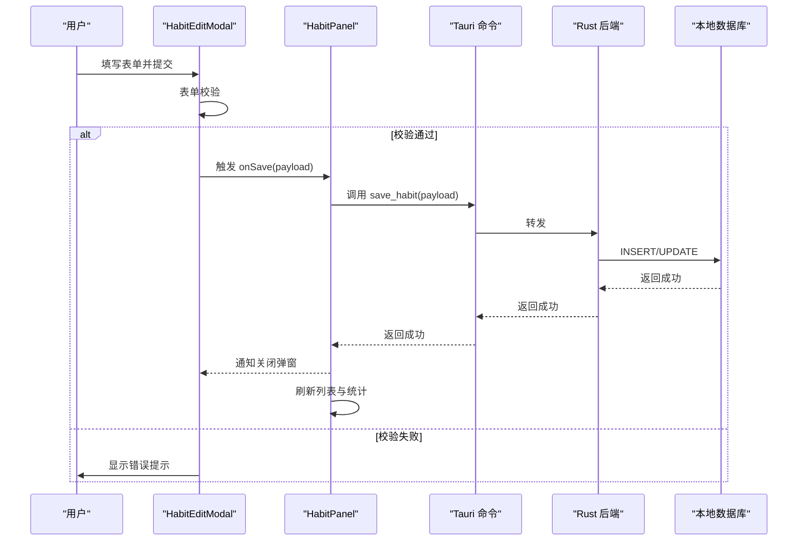
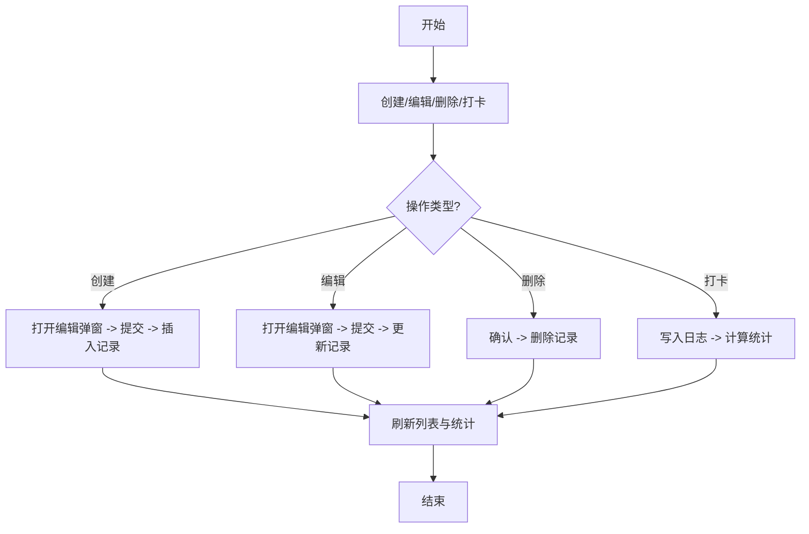
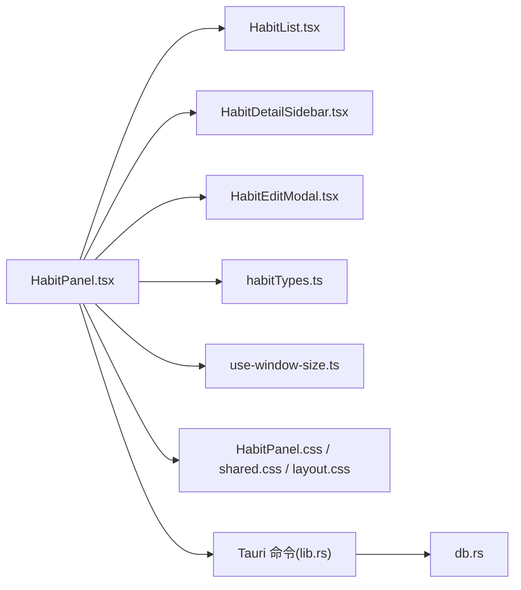

# 习惯追踪系统

<cite>
**本文引用的文件**   
- [src/features/habits/HabitPanel.tsx](file://src/features/habits/HabitPanel.tsx)
- [src/features/habits/components/HabitCard.tsx](file://src/features/habits/components/HabitCard.tsx)
- [src/features/habits/components/HabitDetailSidebar.tsx](file://src/features/habits/components/HabitDetailSidebar.tsx)
- [src/features/habits/components/HabitEditModal.tsx](file://src/features/habits/components/HabitEditModal.tsx)
- [src/features/habits/components/HabitList.tsx](file://src/features/habits/components/HabitList.tsx)
- [src/features/habits/habitTypes.ts](file://src/features/habits/habitTypes.ts)
- [src/features/habits/HabitPanel.css](file://src/features/habits/HabitPanel.css)
- [src/styles/shared.css](file://src/styles/shared.css)
- [src/styles/layout.css](file://src/styles/layout.css)
- [src/hooks/use-window-size.ts](file://src/hooks/use-window-size.ts)
- [src-tauri/src/db.rs](file://src-tauri/src/db.rs)
- [src-tauri/src/lib.rs](file://src-tauri/src/lib.rs)
- [src-tauri/Cargo.toml](file://src-tauri/Cargo.toml)
</cite>

## 目录
1. [简介](#简介)
2. [项目结构](#项目结构)
3. [核心组件](#核心组件)
4. [架构总览](#架构总览)
5. [详细组件分析](#详细组件分析)
6. [依赖关系分析](#依赖关系分析)
7. [性能考虑](#性能考虑)
8. [故障排查指南](#故障排查指南)
9. [结论](#结论)
10. [附录](#附录)

## 简介
本技术文档围绕“习惯追踪系统”的完整业务流程与实现细节展开，覆盖习惯的创建、编辑、删除与进度跟踪；深入解析习惯卡片组件的设计模式、详情侧边栏的数据展示与编辑模态框的交互逻辑；说明数据持久化、历史记录管理与统计计算方法；并给出用户界面设计原则、响应式适配与可访问性支持建议，以及扩展开发与自定义样式的方法。

## 项目结构
习惯功能位于前端 features 层，采用“按特性组织”的结构：
- 页面容器：HabitPanel 负责整体布局、状态与路由/面板控制
- 列表与卡片：HabitList 渲染习惯列表，HabitCard 展示单条习惯摘要与快捷操作
- 详情与编辑：HabitDetailSidebar 提供右侧详情面板，HabitEditModal 提供弹窗编辑表单
- 类型定义：habitTypes.ts 统一数据结构与枚举
- 样式：HabitPanel.css 与全局 shared.css、layout.css 配合完成主题与布局

图表来源
- [src/features/habits/HabitPanel.tsx](file://src/features/habits/HabitPanel.tsx)
- [src/features/habits/components/HabitList.tsx](file://src/features/habits/components/HabitList.tsx)
- [src/features/habits/components/HabitCard.tsx](file://src/features/habits/components/HabitCard.tsx)
- [src/features/habits/components/HabitDetailSidebar.tsx](file://src/features/habits/components/HabitDetailSidebar.tsx)
- [src/features/habits/components/HabitEditModal.tsx](file://src/features/habits/components/HabitEditModal.tsx)
- [src/features/habits/habitTypes.ts](file://src/features/habits/habitTypes.ts)
- [src/features/habits/HabitPanel.css](file://src/features/habits/HabitPanel.css)
- [src/styles/shared.css](file://src/styles/shared.css)
- [src/styles/layout.css](file://src/styles/layout.css)
- [src/hooks/use-window-size.ts](file://src/hooks/use-window-size.ts)

章节来源
- [src/features/habits/HabitPanel.tsx](file://src/features/habits/HabitPanel.tsx)
- [src/features/habits/components/HabitList.tsx](file://src/features/habits/components/HabitList.tsx)
- [src/features/habits/components/HabitCard.tsx](file://src/features/habits/components/HabitCard.tsx)
- [src/features/habits/components/HabitDetailSidebar.tsx](file://src/features/habits/components/HabitDetailSidebar.tsx)
- [src/features/habits/components/HabitEditModal.tsx](file://src/features/habits/components/HabitEditModal.tsx)
- [src/features/habits/habitTypes.ts](file://src/features/habits/habitTypes.ts)
- [src/features/habits/HabitPanel.css](file://src/features/habits/HabitPanel.css)
- [src/styles/shared.css](file://src/styles/shared.css)
- [src/styles/layout.css](file://src/styles/layout.css)
- [src/hooks/use-window-size.ts](file://src/hooks/use-window-size.ts)

## 核心组件
- HabitPanel（页面容器）
  - 职责：管理习惯列表、选中项、侧边栏与编辑弹窗的显隐；协调增删改查流程；承载统计与筛选入口。
  - 关键交互：新增习惯打开编辑弹窗；点击卡片打开详情侧边栏；在侧边栏或弹窗中完成保存后刷新列表与统计。
- HabitList（列表容器）
  - 职责：接收习惯集合与选择回调，渲染多个 HabitCard；处理空状态与加载态。
- HabitCard（习惯卡片）
  - 职责：展示习惯名称、目标频率、最近完成状态与进度概览；提供勾选完成、查看详情、编辑与删除等快捷操作。
- HabitDetailSidebar（详情侧边栏）
  - 职责：以只读为主，展示习惯元信息、历史打卡记录与统计指标；支持从侧边栏触发编辑。
- HabitEditModal（编辑弹窗）
  - 职责：提供新建/编辑表单；包含校验、提交与错误提示；提交成功后关闭弹窗并刷新数据。
- habitTypes（类型定义）
  - 职责：统一习惯实体、历史记录条目、统计结果等数据结构与枚举值。

章节来源
- [src/features/habits/HabitPanel.tsx](file://src/features/habits/HabitPanel.tsx)
- [src/features/habits/components/HabitList.tsx](file://src/features/habits/components/HabitList.tsx)
- [src/features/habits/components/HabitCard.tsx](file://src/features/habits/components/HabitCard.tsx)
- [src/features/habits/components/HabitDetailSidebar.tsx](file://src/features/habits/components/HabitDetailSidebar.tsx)
- [src/features/habits/components/HabitEditModal.tsx](file://src/features/habits/components/HabitEditModal.tsx)
- [src/features/habits/habitTypes.ts](file://src/features/habits/habitTypes.ts)

## 架构总览
前端采用 React + Tauri 的组合：React 负责 UI 与交互，Tauri 通过 Rust 后端提供本地数据库能力。习惯数据在前端以状态对象表示，通过 Tauri 命令读写持久化存储。

图表来源
- [src/features/habits/HabitPanel.tsx](file://src/features/habits/HabitPanel.tsx)
- [src-tauri/src/db.rs](file://src-tauri/src/db.rs)
- [src-tauri/src/lib.rs](file://src-tauri/src/lib.rs)

章节来源
- [src-tauri/src/lib.rs](file://src-tauri/src/lib.rs)
- [src-tauri/src/db.rs](file://src-tauri/src/db.rs)

## 详细组件分析

### 习惯卡片组件（HabitCard）
- 设计模式
  - 受控展示：由父级传入选中状态与回调，避免自身维护复杂状态。
  - 组合式 UI：将图标、按钮、徽章等基础元素组合为可复用卡片。
- 关键行为
  - 快速完成：点击完成按钮写入当日打卡记录，立即刷新统计。
  - 导航与编辑：打开详情侧边栏或进入编辑弹窗。
  - 删除确认：二次确认后发起删除请求并移除本地缓存。
- 复杂度
  - 渲染复杂度 O(1)，仅展示单条习惯的摘要与操作。
- 优化点
  - 对频繁更新的完成状态使用局部重渲染策略，避免整表重排。

图表来源
- [src/features/habits/components/HabitCard.tsx](file://src/features/habits/components/HabitCard.tsx)
- [src/features/habits/components/HabitList.tsx](file://src/features/habits/components/HabitList.tsx)
- [src/features/habits/components/HabitDetailSidebar.tsx](file://src/features/habits/components/HabitDetailSidebar.tsx)
- [src/features/habits/components/HabitEditModal.tsx](file://src/features/habits/components/HabitEditModal.tsx)

章节来源
- [src/features/habits/components/HabitCard.tsx](file://src/features/habits/components/HabitCard.tsx)
- [src/features/habits/components/HabitList.tsx](file://src/features/habits/components/HabitList.tsx)
- [src/features/habits/components/HabitDetailSidebar.tsx](file://src/features/habits/components/HabitDetailSidebar.tsx)
- [src/features/habits/components/HabitEditModal.tsx](file://src/features/habits/components/HabitEditModal.tsx)

### 详情侧边栏（HabitDetailSidebar）
- 数据展示
  - 基本信息：名称、描述、目标频率、创建时间等。
  - 历史记录：按日期倒序展示打卡记录。
  - 统计指标：完成率、连续天数、近 N 天趋势等。
- 交互逻辑
  - 从侧边栏直接跳转到编辑弹窗。
  - 支持一键回退到今日打卡。
- 可访问性
  - 侧边栏焦点管理：打开时聚焦首项，关闭时恢复焦点。
  - 键盘导航：Esc 关闭、Tab 顺序合理。

图表来源
- [src/features/habits/components/HabitDetailSidebar.tsx](file://src/features/habits/components/HabitDetailSidebar.tsx)
- [src/features/habits/HabitPanel.tsx](file://src/features/habits/HabitPanel.tsx)

章节来源
- [src/features/habits/components/HabitDetailSidebar.tsx](file://src/features/habits/components/HabitDetailSidebar.tsx)
- [src/features/habits/HabitPanel.tsx](file://src/features/habits/HabitPanel.tsx)

### 编辑模态框（HabitEditModal）
- 表单字段
  - 名称、描述、目标频率、提醒设置等。
- 校验与反馈
  - 必填校验、格式校验；失败时高亮错误字段并提示。
- 提交流程
  - 新建：调用创建接口，成功后关闭弹窗并刷新列表。
  - 编辑：调用更新接口，成功后关闭弹窗并刷新详情与统计。
- 用户体验
  - 防抖提交、乐观更新可选；网络异常时重试与降级提示。

图表来源
- [src/features/habits/components/HabitEditModal.tsx](file://src/features/habits/components/HabitEditModal.tsx)
- [src/features/habits/HabitPanel.tsx](file://src/features/habits/HabitPanel.tsx)
- [src-tauri/src/db.rs](file://src-tauri/src/db.rs)
- [src-tauri/src/lib.rs](file://src-tauri/src/lib.rs)

章节来源
- [src/features/habits/components/HabitEditModal.tsx](file://src/features/habits/components/HabitEditModal.tsx)
- [src/features/habits/HabitPanel.tsx](file://src/features/habits/HabitPanel.tsx)
- [src-tauri/src/db.rs](file://src-tauri/src/db.rs)
- [src-tauri/src/lib.rs](file://src-tauri/src/lib.rs)

### 业务流：创建、编辑、删除与进度跟踪
- 创建
  - 入口：HabitPanel 打开编辑弹窗 -> 用户提交 -> 调用后端插入 -> 刷新列表与统计。
- 编辑
  - 入口：卡片或侧边栏进入编辑弹窗 -> 修改字段 -> 提交更新 -> 刷新详情与统计。
- 删除
  - 入口：卡片操作区触发删除 -> 二次确认 -> 调用后端删除 -> 移除本地缓存并刷新。
- 进度跟踪
  - 打卡：卡片快捷完成或侧边栏一键打卡 -> 写入日志 -> 计算统计 -> 更新视图。
  - 统计：基于历史记录计算完成率、连续天数、周/月趋势等。

图表来源
- [src/features/habits/HabitPanel.tsx](file://src/features/habits/HabitPanel.tsx)
- [src/features/habits/components/HabitEditModal.tsx](file://src/features/habits/components/HabitEditModal.tsx)
- [src/features/habits/components/HabitDetailSidebar.tsx](file://src/features/habits/components/HabitDetailSidebar.tsx)
- [src/features/habits/components/HabitCard.tsx](file://src/features/habits/components/HabitCard.tsx)

章节来源
- [src/features/habits/HabitPanel.tsx](file://src/features/habits/HabitPanel.tsx)
- [src/features/habits/components/HabitEditModal.tsx](file://src/features/habits/components/HabitEditModal.tsx)
- [src/features/habits/components/HabitDetailSidebar.tsx](file://src/features/habits/components/HabitDetailSidebar.tsx)
- [src/features/habits/components/HabitCard.tsx](file://src/features/habits/components/HabitCard.tsx)

## 依赖关系分析
- 前端内部依赖
  - HabitPanel 依赖所有子组件与类型定义，并通过样式与窗口尺寸钩子进行布局与响应式适配。
  - 子组件之间通过回调与状态提升进行通信，保持单向数据流。
- 前后端集成
  - 前端通过 Tauri 命令调用 Rust 后端，后端封装数据库操作。
  - 类型与协议约定集中在 habitTypes 与后端接口定义处，确保前后端一致性。

图表来源
- [src/features/habits/HabitPanel.tsx](file://src/features/habits/HabitPanel.tsx)
- [src/features/habits/components/HabitList.tsx](file://src/features/habits/components/HabitList.tsx)
- [src/features/habits/components/HabitDetailSidebar.tsx](file://src/features/habits/components/HabitDetailSidebar.tsx)
- [src/features/habits/components/HabitEditModal.tsx](file://src/features/habits/components/HabitEditModal.tsx)
- [src/features/habits/habitTypes.ts](file://src/features/habits/habitTypes.ts)
- [src/hooks/use-window-size.ts](file://src/hooks/use-window-size.ts)
- [src-tauri/src/lib.rs](file://src-tauri/src/lib.rs)
- [src-tauri/src/db.rs](file://src-tauri/src/db.rs)

章节来源
- [src/features/habits/HabitPanel.tsx](file://src/features/habits/HabitPanel.tsx)
- [src-tauri/src/lib.rs](file://src-tauri/src/lib.rs)
- [src-tauri/src/db.rs](file://src-tauri/src/db.rs)

## 性能考虑
- 渲染优化
  - 卡片级渲染：仅对变更的习惯进行最小化更新，避免全表重绘。
  - 虚拟滚动：当习惯数量较大时，可采用虚拟列表减少 DOM 节点数量。
- 计算优化
  - 统计增量计算：新增打卡仅更新受影响的时间窗口统计，避免全量重算。
  - 缓存中间结果：如连续天数、近 N 天趋势等，按需失效与更新。
- I/O 优化
  - 批量写入：合并多次打卡为批量插入，降低数据库压力。
  - 懒加载详情：侧边栏仅在需要时拉取历史与统计。

[本节为通用性能建议，不直接分析具体文件]

## 故障排查指南
- 常见问题
  - 弹窗无法关闭：检查焦点管理与事件冒泡，确保关闭回调正确执行。
  - 侧边栏数据不同步：确认状态提升路径与刷新时机，避免竞态条件。
  - 统计异常：核对历史记录的日期去重与边界条件（跨月/跨年）。
- 调试建议
  - 在关键回调处打印输入输出，验证前后端数据契约。
  - 使用浏览器开发者工具观察网络与本地存储变化。
- 错误处理
  - 网络/后端错误：统一错误提示与重试机制。
  - 表单校验错误：定位字段并给出明确修复指引。

章节来源
- [src/features/habits/components/HabitEditModal.tsx](file://src/features/habits/components/HabitEditModal.tsx)
- [src/features/habits/components/HabitDetailSidebar.tsx](file://src/features/habits/components/HabitDetailSidebar.tsx)
- [src/features/habits/HabitPanel.tsx](file://src/features/habits/HabitPanel.tsx)

## 结论
本系统通过清晰的前端分层与 Tauri 后端集成，实现了习惯的创建、编辑、删除与进度跟踪的完整闭环。组件间采用受控与状态提升模式，保证数据一致性与可维护性；结合统计与历史记录，为用户提供直观的行为反馈。后续可在性能与体验方面继续优化，如虚拟列表、增量统计与更完善的错误恢复策略。

[本节为总结性内容，不直接分析具体文件]

## 附录

### 用户界面设计原则
- 一致性：统一的间距、字号、色彩与交互反馈。
- 可发现性：主要操作置于显眼位置，并提供即时反馈。
- 容错性：明确的错误提示与撤销/重试能力。
- 简洁性：减少不必要的干扰元素，突出核心任务。

[本节为通用设计建议，不直接分析具体文件]

### 响应式适配
- 断点策略：基于 use-window-size 获取窗口尺寸，在小屏隐藏次要信息，在大屏展示更多统计。
- 布局弹性：使用 CSS Grid/Flex 自适应列数与行高。
- 触控友好：增大点击区域与触摸反馈。

章节来源
- [src/hooks/use-window-size.ts](file://src/hooks/use-window-size.ts)
- [src/features/habits/HabitPanel.css](file://src/features/habits/HabitPanel.css)
- [src/styles/layout.css](file://src/styles/layout.css)

### 可访问性支持
- 语义化标签：使用 button、dialog、aside 等原生语义元素。
- 键盘导航：支持 Tab、Enter、Esc 等常用快捷键。
- 屏幕阅读器：为图标与按钮提供 aria-label 与 role。
- 对比度与焦点可见：确保颜色对比度达标，焦点指示清晰。

[本节为通用可访问性建议，不直接分析具体文件]

### 扩展开发指南
- 新增习惯属性
  - 在 habitTypes 中扩展类型定义，并在编辑弹窗与详情侧边栏同步展示。
- 新增统计维度
  - 在统计计算处增加新的聚合逻辑，并确保增量更新策略。
- 新增后端接口
  - 在 lib.rs 注册新命令，在 db.rs 实现数据库操作，并在前端调用。

章节来源
- [src/features/habits/habitTypes.ts](file://src/features/habits/habitTypes.ts)
- [src/features/habits/components/HabitEditModal.tsx](file://src/features/habits/components/HabitEditModal.tsx)
- [src/features/habits/components/HabitDetailSidebar.tsx](file://src/features/habits/components/HabitDetailSidebar.tsx)
- [src-tauri/src/lib.rs](file://src-tauri/src/lib.rs)
- [src-tauri/src/db.rs](file://src-tauri/src/db.rs)

### 自定义样式方法
- 主题变量：通过共享样式变量统一管理颜色、圆角、阴影等。
- 组件样式隔离：为习惯模块提供独立样式文件，避免全局污染。
- 动态主题：根据系统或用户偏好切换明暗主题。

章节来源
- [src/features/habits/HabitPanel.css](file://src/features/habits/HabitPanel.css)
- [src/styles/shared.css](file://src/styles/shared.css)
- [src/styles/layout.css](file://src/styles/layout.css)

### 数据模型与持久化
- 数据模型
  - 习惯实体：标识、名称、描述、目标频率、创建/更新时间等。
  - 历史记录：关联习惯 ID、打卡日期、备注等。
  - 统计结果：完成率、连续天数、趋势数组等。
- 持久化
  - 前端状态：用于 UI 渲染与临时缓存。
  - 后端存储：通过 Tauri 命令与 Rust 后端对接本地数据库，确保数据持久化与一致性。

章节来源
- [src/features/habits/habitTypes.ts](file://src/features/habits/habitTypes.ts)
- [src-tauri/src/db.rs](file://src-tauri/src/db.rs)
- [src-tauri/Cargo.toml](file://src-tauri/Cargo.toml)