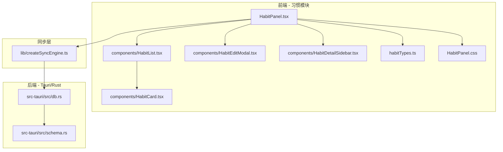
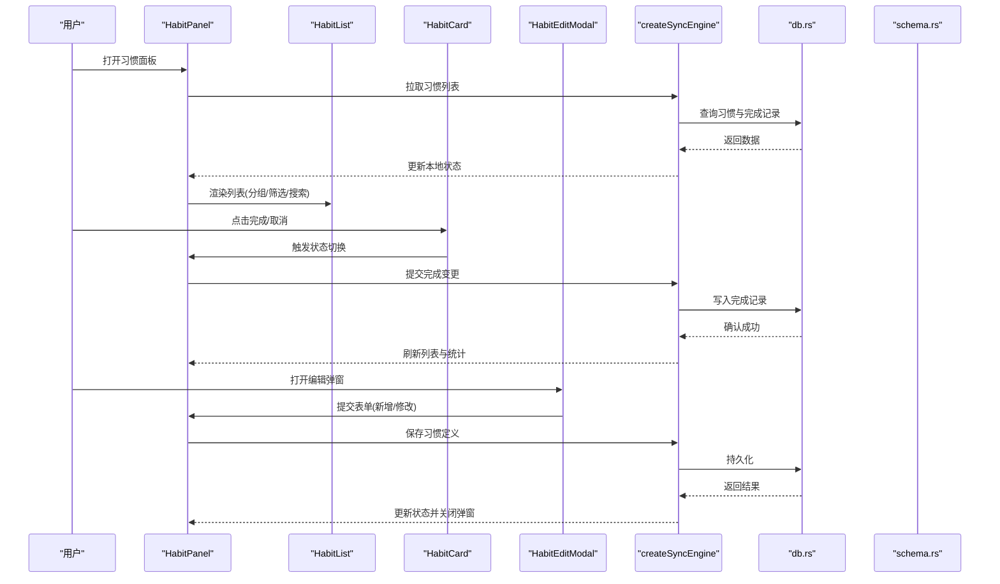
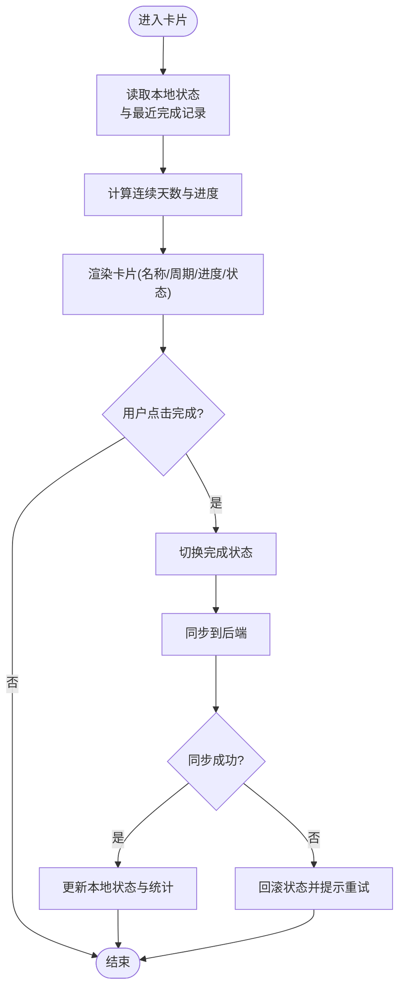
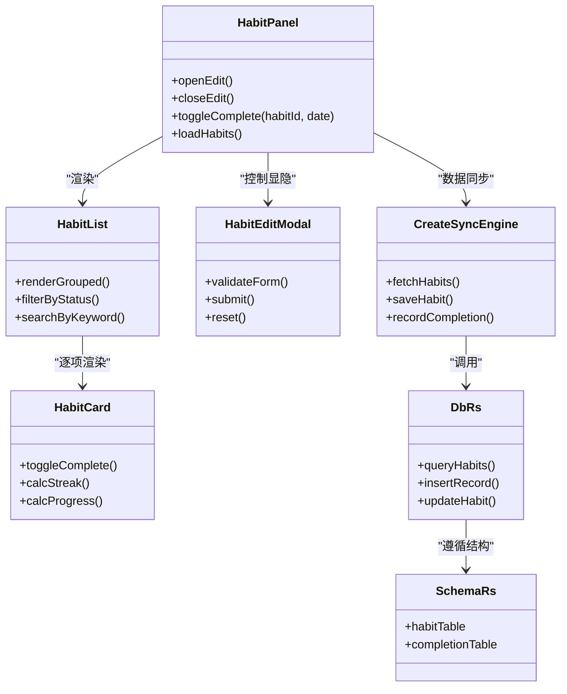

# 习惯追踪系统

<cite>
**本文引用的文件**
- [src/features/habits/HabitPanel.tsx](file://src/features/habits/HabitPanel.tsx)
- [src/features/habits/components/HabitList.tsx](file://src/features/habits/components/HabitList.tsx)
- [src/features/habits/components/HabitCard.tsx](file://src/features/habits/components/HabitCard.tsx)
- [src/features/habits/components/HabitEditModal.tsx](file://src/features/habits/components/HabitEditModal.tsx)
- [src/features/habits/components/HabitDetailSidebar.tsx](file://src/features/habits/components/HabitDetailSidebar.tsx)
- [src/features/habits/habitTypes.ts](file://src/features/habits/habitTypes.ts)
- [src/features/habits/HabitPanel.css](file://src/features/habits/HabitPanel.css)
- [src/lib/createSyncEngine.ts](file://src/lib/createSyncEngine.ts)
- [src-tauri/src/db.rs](file://src-tauri/src/db.rs)
- [src-tauri/src/schema.rs](file://src-tauri/src/schema.rs)
- [docx/习惯PRD.md](file://docx/习惯PRD.md)
- [docx/习惯API接口文档.md](file://docx/习惯API接口文档.md)
</cite>

## 目录
1. [简介](#简介)
2. [项目结构](#项目结构)
3. [核心组件](#核心组件)
4. [架构总览](#架构总览)
5. [详细组件分析](#详细组件分析)
6. [依赖关系分析](#依赖关系分析)
7. [性能考量](#性能考量)
8. [故障排查指南](#故障排查指南)
9. [结论](#结论)
10. [附录](#附录)

## 简介
本技术文档围绕“习惯追踪系统”的前端实现与后端同步机制展开，重点覆盖以下能力：
- 习惯的创建、跟踪与统计（完成率、趋势等）
- 数据模型设计（习惯定义、完成记录、周期设置）
- 习惯列表渲染（分组、筛选、搜索）
- HabitCard 状态管理（完成切换、连续天数、进度条）
- HabitEditModal 表单验证、数据绑定与错误处理
- 导入导出与批量操作说明
- 与后端数据库的同步机制与一致性保证

## 项目结构
习惯功能位于 features/habits 目录下，包含面板入口、类型定义、UI 组件与样式；与后端通过 Tauri + Rust 提供的本地数据库进行交互。

图表来源
- [src/features/habits/HabitPanel.tsx](file://src/features/habits/HabitPanel.tsx)
- [src/features/habits/components/HabitList.tsx](file://src/features/habits/components/HabitList.tsx)
- [src/features/habits/components/HabitCard.tsx](file://src/features/habits/components/HabitCard.tsx)
- [src/features/habits/components/HabitEditModal.tsx](file://src/features/habits/components/HabitEditModal.tsx)
- [src/features/habits/components/HabitDetailSidebar.tsx](file://src/features/habits/components/HabitDetailSidebar.tsx)
- [src/features/habits/habitTypes.ts](file://src/features/habits/habitTypes.ts)
- [src/features/habits/HabitPanel.css](file://src/features/habits/HabitPanel.css)
- [src/lib/createSyncEngine.ts](file://src/lib/createSyncEngine.ts)
- [src-tauri/src/db.rs](file://src-tauri/src/db.rs)
- [src-tauri/src/schema.rs](file://src-tauri/src/schema.rs)

章节来源
- [src/features/habits/HabitPanel.tsx](file://src/features/habits/HabitPanel.tsx)
- [src/features/habits/habitTypes.ts](file://src/features/habits/habitTypes.ts)
- [src/lib/createSyncEngine.ts](file://src/lib/createSyncEngine.ts)
- [src-tauri/src/db.rs](file://src-tauri/src/db.rs)
- [src-tauri/src/schema.rs](file://src-tauri/src/schema.rs)

## 核心组件
- HabitPanel：习惯模块的主容器，负责聚合子组件、承载全局状态与业务编排（如加载、保存、打开编辑弹窗、侧边详情等）。
- HabitList：渲染习惯列表，提供分组显示、筛选过滤与搜索逻辑。
- HabitCard：单条习惯卡片，展示名称、周期、进度、完成状态，支持点击切换完成。
- HabitEditModal：新增/编辑习惯的弹窗，含表单校验、数据绑定与错误提示。
- HabitDetailSidebar：习惯详情侧栏，用于查看历史完成记录与统计数据。
- habitTypes.ts：统一的数据类型定义（习惯、完成记录、周期等）。
- createSyncEngine.ts：前后端同步引擎，封装与 Tauri/Rust 后端的调用与一致性策略。
- db.rs / schema.rs：Rust 后端数据库访问与表结构定义。

章节来源
- [src/features/habits/HabitPanel.tsx](file://src/features/habits/HabitPanel.tsx)
- [src/features/habits/components/HabitList.tsx](file://src/features/habits/components/HabitList.tsx)
- [src/features/habits/components/HabitCard.tsx](file://src/features/habits/components/HabitCard.tsx)
- [src/features/habits/components/HabitEditModal.tsx](file://src/features/habits/components/HabitEditModal.tsx)
- [src/features/habits/components/HabitDetailSidebar.tsx](file://src/features/habits/components/HabitDetailSidebar.tsx)
- [src/features/habits/habitTypes.ts](file://src/features/habits/habitTypes.ts)
- [src/lib/createSyncEngine.ts](file://src/lib/createSyncEngine.ts)
- [src-tauri/src/db.rs](file://src-tauri/src/db.rs)
- [src-tauri/src/schema.rs](file://src-tauri/src/schema.rs)

## 架构总览
整体采用“前端 React 组件 + 同步引擎 + Tauri/Rust 本地数据库”的分层架构。前端以组件化组织 UI 与交互，通过同步引擎与后端通信，确保数据在内存与持久化存储之间保持一致。

图表来源
- [src/features/habits/HabitPanel.tsx](file://src/features/habits/HabitPanel.tsx)
- [src/features/habits/components/HabitList.tsx](file://src/features/habits/components/HabitList.tsx)
- [src/features/habits/components/HabitCard.tsx](file://src/features/habits/components/HabitCard.tsx)
- [src/features/habits/components/HabitEditModal.tsx](file://src/features/habits/components/HabitEditModal.tsx)
- [src/lib/createSyncEngine.ts](file://src/lib/createSyncEngine.ts)
- [src-tauri/src/db.rs](file://src-tauri/src/db.rs)
- [src-tauri/src/schema.rs](file://src-tauri/src/schema.rs)

## 详细组件分析

### 数据模型设计（habitTypes.ts）
- 习惯定义：包含唯一标识、标题、描述、周期规则（每日/每周/自定义）、目标次数、提醒开关、标签/分组等。
- 完成记录：关联习惯 ID、日期、是否完成、备注等。
- 周期设置：支持按日、按周、按月或自定义间隔，以及开始日期、结束日期、重复规则。
- 统计字段：可计算完成率、连续完成天数、最近完成时间等衍生指标。

章节来源
- [src/features/habits/habitTypes.ts](file://src/features/habits/habitTypes.ts)

### 习惯列表渲染（HabitList.tsx）
- 分组显示：按标签/分类对习惯进行分组，支持折叠/展开。
- 筛选过滤：按状态（进行中/已完成/暂停）、周期类型、标签等进行过滤。
- 搜索功能：基于关键词匹配标题、描述、标签等字段，支持实时过滤。
- 排序与分页：可按创建时间、完成率、最近完成时间排序；大数据量时建议分页或虚拟滚动。

章节来源
- [src/features/habits/components/HabitList.tsx](file://src/features/habits/components/HabitList.tsx)

### 习惯卡片状态管理（HabitCard.tsx）
- 完成状态切换：点击卡片触发完成/取消，立即更新本地状态并异步同步到后端。
- 连续天数计算：根据完成记录序列计算当前连续完成天数，跨天重置逻辑需考虑时区与边界条件。
- 进度条展示：基于当日目标次数与实际完成次数计算百分比，动态更新视觉反馈。
- 交互细节：防抖点击避免重复提交，失败回滚与重试提示。

图表来源
- [src/features/habits/components/HabitCard.tsx](file://src/features/habits/components/HabitCard.tsx)
- [src/lib/createSyncEngine.ts](file://src/lib/createSyncEngine.ts)

章节来源
- [src/features/habits/components/HabitCard.tsx](file://src/features/habits/components/HabitCard.tsx)
- [src/lib/createSyncEngine.ts](file://src/lib/createSyncEngine.ts)

### 编辑弹窗与表单验证（HabitEditModal.tsx）
- 表单字段：标题、描述、周期规则、目标次数、标签/分组、开始/结束日期等。
- 数据绑定：双向绑定到状态对象，支持草稿自动保存。
- 验证规则：必填项检查、日期范围合法性、周期与目标次数合理性、重复冲突检测。
- 错误处理：集中式错误收集与展示，提交前预检，失败时保留已填内容并提供重试。
- 生命周期：打开初始化、关闭清理、键盘快捷键支持。

章节来源
- [src/features/habits/components/HabitEditModal.tsx](file://src/features/habits/components/HabitEditModal.tsx)

### 详情侧栏与统计（HabitDetailSidebar.tsx）
- 历史记录：按日期倒序展示完成记录，支持备注查看与删除。
- 统计信息：完成率、近 7/30 天趋势、连续完成天数、最长连续天数。
- 可视化：简单柱状图/折线图展示近期完成趋势（若集成图表库）。
- 操作：快速标记完成、批量修正历史、导出片段。

章节来源
- [src/features/habits/components/HabitDetailSidebar.tsx](file://src/features/habits/components/HabitDetailSidebar.tsx)

### 主面板编排（HabitPanel.tsx）
- 职责：协调列表、卡片、弹窗与侧栏的状态流转；统一管理加载、保存、错误提示。
- 事件流：打开/关闭弹窗、新增/编辑/删除习惯、批量操作、刷新统计。
- 与同步引擎集成：统一发起读写请求，处理乐观更新与失败回滚。

章节来源
- [src/features/habits/HabitPanel.tsx](file://src/features/habits/HabitPanel.tsx)

## 依赖关系分析
- 组件耦合：HabitPanel 作为父容器，向下分发 props 与回调；HabitList 与 HabitCard 为无状态/轻状态展示组件，便于复用与测试。
- 同步引擎：createSyncEngine 屏蔽底层 Tauri 调用差异，提供统一的 Promise API，便于上层组件使用。
- 后端依赖：db.rs 暴露 SQL 操作，schema.rs 定义表结构与约束，确保数据完整性。

图表来源
- [src/features/habits/HabitPanel.tsx](file://src/features/habits/HabitPanel.tsx)
- [src/features/habits/components/HabitList.tsx](file://src/features/habits/components/HabitList.tsx)
- [src/features/habits/components/HabitCard.tsx](file://src/features/habits/components/HabitCard.tsx)
- [src/features/habits/components/HabitEditModal.tsx](file://src/features/habits/components/HabitEditModal.tsx)
- [src/lib/createSyncEngine.ts](file://src/lib/createSyncEngine.ts)
- [src-tauri/src/db.rs](file://src-tauri/src/db.rs)
- [src-tauri/src/schema.rs](file://src-tauri/src/schema.rs)

章节来源
- [src/features/habits/HabitPanel.tsx](file://src/features/habits/HabitPanel.tsx)
- [src/lib/createSyncEngine.ts](file://src/lib/createSyncEngine.ts)
- [src-tauri/src/db.rs](file://src-tauri/src/db.rs)
- [src-tauri/src/schema.rs](file://src-tauri/src/schema.rs)

## 性能考量
- 列表渲染优化：对长列表启用虚拟滚动或分页；对筛选/搜索引入节流与去抖。
- 状态更新最小化：仅在必要处更新局部状态，避免整树重渲染。
- 网络/IO 合并：批量操作合并请求，减少 I/O 次数。
- 计算复杂度：连续天数与进度计算尽量缓存中间结果，避免重复遍历。
- 样式与主题：将样式与逻辑解耦，利用 CSS 变量提升切换效率。

[本节为通用指导，不直接分析具体文件]

## 故障排查指南
- 同步失败：检查 createSyncEngine 的错误分支与重试策略，确认 db.rs 返回码与异常信息。
- 数据不一致：核对 schema.rs 的约束与默认值，确保前端状态与后端一致。
- 表单验证异常：定位 HabitEditModal 的校验函数，检查输入边界与正则表达式。
- 列表渲染卡顿：检查 HabitList 的过滤与搜索逻辑，必要时增加索引或缓存。
- 连续天数计算错误：审查日期边界与时区处理，确保跨月/跨年场景正确。

章节来源
- [src/lib/createSyncEngine.ts](file://src/lib/createSyncEngine.ts)
- [src-tauri/src/db.rs](file://src-tauri/src/db.rs)
- [src-tauri/src/schema.rs](file://src-tauri/src/schema.rs)
- [src/features/habits/components/HabitEditModal.tsx](file://src/features/habits/components/HabitEditModal.tsx)
- [src/features/habits/components/HabitList.tsx](file://src/features/habits/components/HabitList.tsx)

## 结论
本系统通过清晰的组件分层与同步引擎，实现了习惯的创建、跟踪与统计闭环。数据模型与后端约束保证了数据一致性，UI 层提供了良好的交互体验。后续可在统计可视化、批量操作与导入导出方面进一步增强。

[本节为总结性内容，不直接分析具体文件]

## 附录

### 习惯统计功能
- 完成率：基于完成记录数与目标次数计算，支持按日/周/月维度汇总。
- 趋势分析：滑动窗口统计（7/30 天），识别上升/下降趋势。
- 可视化：结合图表库绘制折线/柱状图，辅助用户洞察行为变化。

章节来源
- [src/features/habits/components/HabitDetailSidebar.tsx](file://src/features/habits/components/HabitDetailSidebar.tsx)

### 导入导出与批量操作
- 导入：支持 CSV/JSON 格式，解析后进行数据清洗与冲突处理（如重复 ID、非法日期）。
- 导出：按筛选条件导出当前视图数据，便于备份与分析。
- 批量操作：批量完成、批量修改周期/标签、批量删除，注意事务性与回滚。

章节来源
- [src/features/habits/HabitPanel.tsx](file://src/features/habits/HabitPanel.tsx)

### 与后端数据库的同步机制与一致性保证
- 乐观更新：前端先更新本地状态，再异步同步；失败时回滚并提示。
- 幂等写入：为完成记录生成稳定键（habitId+date），避免重复提交导致重复计数。
- 事务与约束：后端通过 schema.rs 定义主外键与约束，db.rs 执行原子操作。
- 版本与迁移：当 schema 变更时，提供迁移脚本与兼容性处理。

章节来源
- [src/lib/createSyncEngine.ts](file://src/lib/createSyncEngine.ts)
- [src-tauri/src/db.rs](file://src-tauri/src/db.rs)
- [src-tauri/src/schema.rs](file://src-tauri/src/schema.rs)

### 参考文档
- 产品需求与设计说明：[docx/习惯PRD.md](file://docx/习惯PRD.md)
- 接口规范与约定：[docx/习惯API接口文档.md](file://docx/习惯API接口文档.md)

章节来源
- [docx/习惯PRD.md](file://docx/习惯PRD.md)
- [docx/习惯API接口文档.md](file://docx/习惯API接口文档.md)