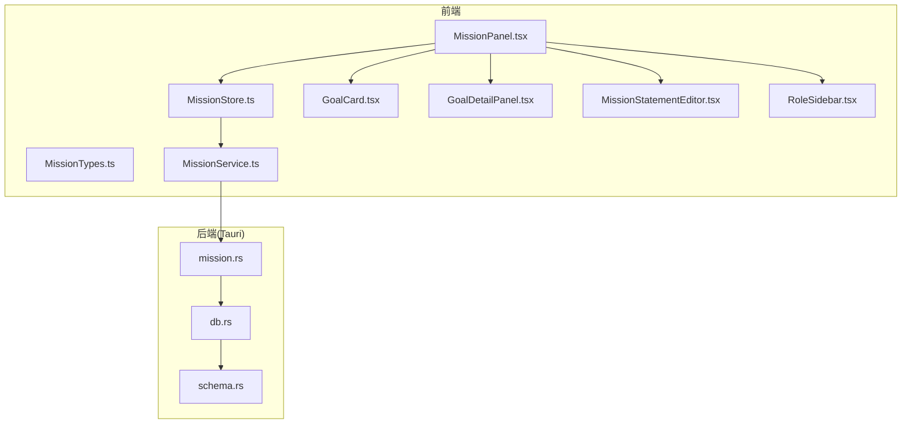
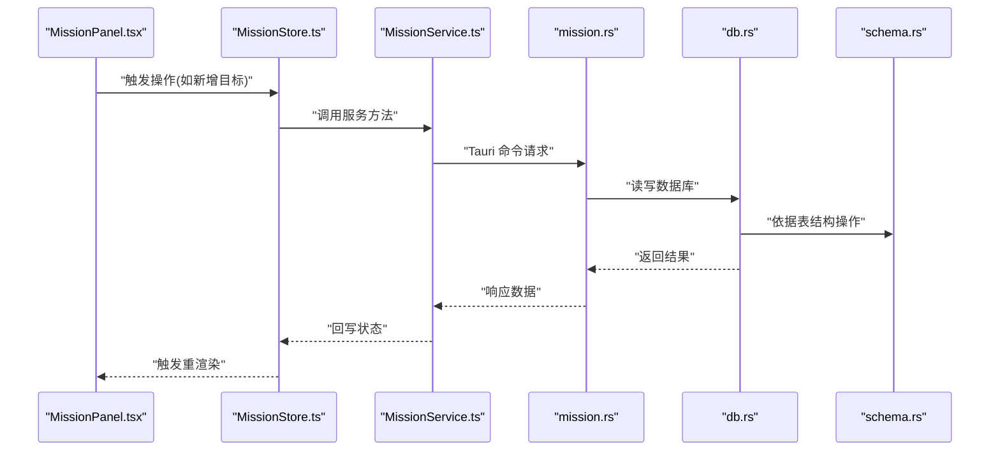
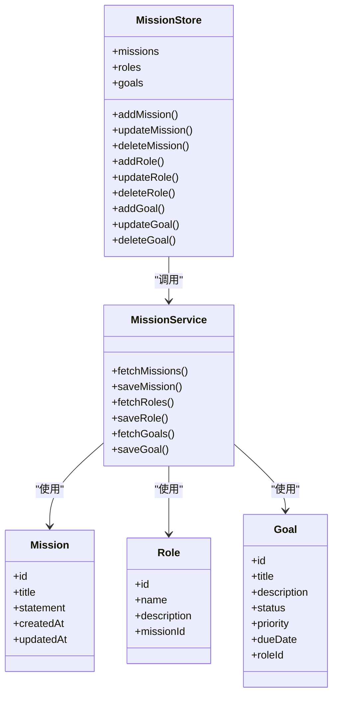
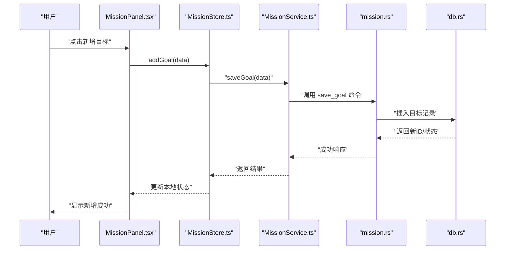
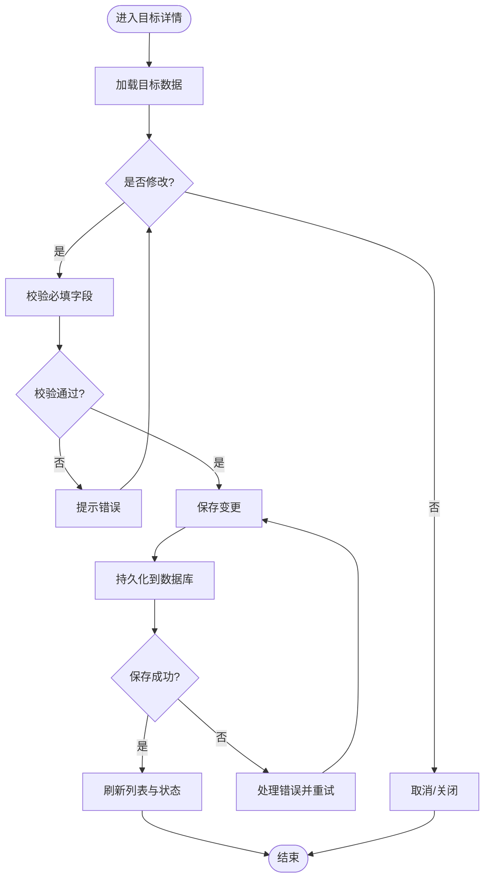
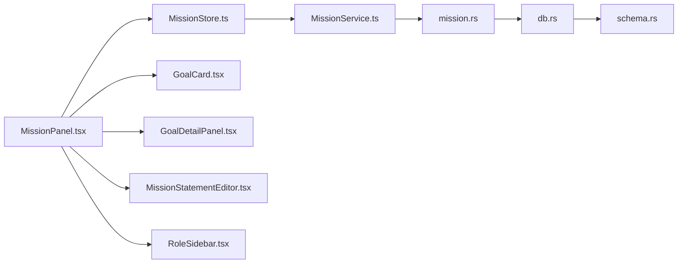

# 人生罗盘功能

<cite>
**本文引用的文件**   
- [src/features/mission/MissionPanel.tsx](file://src/features/mission/MissionPanel.tsx)
- [src/features/mission/MissionStore.ts](file://src/features/mission/MissionStore.ts)
- [src/features/mission/MissionTypes.ts](file://src/features/mission/MissionTypes.ts)
- [src/features/mission/MissionService.ts](file://src/features/mission/MissionService.ts)
- [src/features/mission/GoalCard.tsx](file://src/features/mission/GoalCard.tsx)
- [src/features/mission/GoalDetailPanel.tsx](file://src/features/mission/GoalDetailPanel.tsx)
- [src/features/mission/MissionStatementEditor.tsx](file://src/features/mission/MissionStatementEditor.tsx)
- [src/features/mission/RoleSidebar.tsx](file://src/features/mission/RoleSidebar.tsx)
- [src-tauri/src/mission.rs](file://src-tauri/src/mission.rs)
- [src-tauri/src/db.rs](file://src-tauri/src/db.rs)
- [src-tauri/src/schema.rs](file://src-tauri/src/schema.rs)
</cite>

## 目录
1. [简介](#简介)
2. [项目结构](#项目结构)
3. [核心组件](#核心组件)
4. [架构总览](#架构总览)
5. [详细组件分析](#详细组件分析)
6. [依赖分析](#依赖分析)
7. [性能考虑](#性能考虑)
8. [故障排查指南](#故障排查指南)
9. [结论](#结论)
10. [附录](#附录)

## 简介
“人生罗盘”是 FishWorker 中的使命与目标管理模块，围绕“使命宣言—角色—目标—任务”的层级关系，帮助用户将长期愿景拆解为可执行计划。该功能通过前端面板、状态管理与后端持久化协同工作，提供可视化的目标编辑、详情查看与数据同步能力。

## 项目结构
本功能位于 features/mission 目录下，采用“按特性组织”的结构：UI 组件、状态存储、服务层与类型定义清晰分离；后端 Rust 侧提供 Tauri 命令与数据库访问。

图表来源
- [src/features/mission/MissionPanel.tsx](file://src/features/mission/MissionPanel.tsx)
- [src/features/mission/MissionStore.ts](file://src/features/mission/MissionStore.ts)
- [src/features/mission/MissionTypes.ts](file://src/features/mission/MissionTypes.ts)
- [src/features/mission/GoalCard.tsx](file://src/features/mission/GoalCard.tsx)
- [src/features/mission/GoalDetailPanel.tsx](file://src/features/mission/GoalDetailPanel.tsx)
- [src/features/mission/MissionStatementEditor.tsx](file://src/features/mission/MissionStatementEditor.tsx)
- [src/features/mission/RoleSidebar.tsx](file://src/features/mission/RoleSidebar.tsx)
- [src/features/mission/MissionService.ts](file://src/features/mission/MissionService.ts)
- [src-tauri/src/mission.rs](file://src-tauri/src/mission.rs)
- [src-tauri/src/db.rs](file://src-tauri/src/db.rs)
- [src-tauri/src/schema.rs](file://src-tauri/src/schema.rs)

章节来源
- [src/features/mission/MissionPanel.tsx](file://src/features/mission/MissionPanel.tsx)
- [src/features/mission/MissionStore.ts](file://src/features/mission/MissionStore.ts)
- [src/features/mission/MissionTypes.ts](file://src/features/mission/MissionTypes.ts)
- [src/features/mission/MissionService.ts](file://src/features/mission/MissionService.ts)
- [src-tauri/src/mission.rs](file://src-tauri/src/mission.rs)
- [src-tauri/src/db.rs](file://src-tauri/src/db.rs)
- [src-tauri/src/schema.rs](file://src-tauri/src/schema.rs)

## 核心组件
- 使命面板（MissionPanel）：承载“使命宣言、角色、目标”的主视图，协调子组件渲染与交互。
- 状态存储（MissionStore）：集中管理使命、角色、目标的增删改查与本地状态更新。
- 类型定义（MissionTypes）：统一前后端共享的数据模型与枚举。
- 服务层（MissionService）：封装对 Tauri 命令的调用，负责与后端通信。
- 目标卡片（GoalCard）：展示单个目标的概览信息，支持点击展开详情。
- 目标详情面板（GoalDetailPanel）：展示并编辑目标的详细信息。
- 使命宣言编辑器（MissionStatementEditor）：用于编辑使命宣言文本。
- 角色侧边栏（RoleSidebar）：管理角色列表及切换当前角色。

章节来源
- [src/features/mission/MissionPanel.tsx](file://src/features/mission/MissionPanel.tsx)
- [src/features/mission/MissionStore.ts](file://src/features/mission/MissionStore.ts)
- [src/features/mission/MissionTypes.ts](file://src/features/mission/MissionTypes.ts)
- [src/features/mission/MissionService.ts](file://src/features/mission/MissionService.ts)
- [src/features/mission/GoalCard.tsx](file://src/features/mission/GoalCard.tsx)
- [src/features/mission/GoalDetailPanel.tsx](file://src/features/mission/GoalDetailPanel.tsx)
- [src/features/mission/MissionStatementEditor.tsx](file://src/features/mission/MissionStatementEditor.tsx)
- [src/features/mission/RoleSidebar.tsx](file://src/features/mission/RoleSidebar.tsx)

## 架构总览
整体采用“前端 React + Tauri 后端”的分层架构：UI 组件通过 Store 驱动状态，Store 调用 Service 发起命令，Rust 侧 mission.rs 暴露命令并访问 db.rs 与 schema.rs 完成持久化。

图表来源
- [src/features/mission/MissionPanel.tsx](file://src/features/mission/MissionPanel.tsx)
- [src/features/mission/MissionStore.ts](file://src/features/mission/MissionStore.ts)
- [src/features/mission/MissionService.ts](file://src/features/mission/MissionService.ts)
- [src-tauri/src/mission.rs](file://src-tauri/src/mission.rs)
- [src-tauri/src/db.rs](file://src-tauri/src/db.rs)
- [src-tauri/src/schema.rs](file://src-tauri/src/schema.rs)

## 详细组件分析

### 对象模型与类图

图表来源
- [src/features/mission/MissionTypes.ts](file://src/features/mission/MissionTypes.ts)
- [src/features/mission/MissionStore.ts](file://src/features/mission/MissionStore.ts)
- [src/features/mission/MissionService.ts](file://src/features/mission/MissionService.ts)

章节来源
- [src/features/mission/MissionTypes.ts](file://src/features/mission/MissionTypes.ts)
- [src/features/mission/MissionStore.ts](file://src/features/mission/MissionStore.ts)
- [src/features/mission/MissionService.ts](file://src/features/mission/MissionService.ts)

### 新增目标流程（序列图）

图表来源
- [src/features/mission/MissionPanel.tsx](file://src/features/mission/MissionPanel.tsx)
- [src/features/mission/MissionStore.ts](file://src/features/mission/MissionStore.ts)
- [src/features/mission/MissionService.ts](file://src/features/mission/MissionService.ts)
- [src-tauri/src/mission.rs](file://src-tauri/src/mission.rs)
- [src-tauri/src/db.rs](file://src-tauri/src/db.rs)

章节来源
- [src/features/mission/MissionPanel.tsx](file://src/features/mission/MissionPanel.tsx)
- [src/features/mission/MissionStore.ts](file://src/features/mission/MissionStore.ts)
- [src/features/mission/MissionService.ts](file://src/features/mission/MissionService.ts)
- [src-tauri/src/mission.rs](file://src-tauri/src/mission.rs)
- [src-tauri/src/db.rs](file://src-tauri/src/db.rs)

### 目标详情编辑流程（流程图）

图表来源
- [src/features/mission/GoalDetailPanel.tsx](file://src/features/mission/GoalDetailPanel.tsx)
- [src/features/mission/MissionStore.ts](file://src/features/mission/MissionStore.ts)
- [src/features/mission/MissionService.ts](file://src/features/mission/MissionService.ts)
- [src-tauri/src/mission.rs](file://src-tauri/src/mission.rs)
- [src-tauri/src/db.rs](file://src-tauri/src/db.rs)

章节来源
- [src/features/mission/GoalDetailPanel.tsx](file://src/features/mission/GoalDetailPanel.tsx)
- [src/features/mission/MissionStore.ts](file://src/features/mission/MissionStore.ts)
- [src/features/mission/MissionService.ts](file://src/features/mission/MissionService.ts)
- [src-tauri/src/mission.rs](file://src-tauri/src/mission.rs)
- [src-tauri/src/db.rs](file://src-tauri/src/db.rs)

### 关键实现要点
- 状态驱动：所有 UI 变化由 MissionStore 驱动，避免分散的状态更新逻辑。
- 服务隔离：MissionService 仅负责与 Tauri 命令交互，屏蔽底层通信细节。
- 类型安全：MissionTypes 统一定义前后端共享结构，减少不一致风险。
- 组件职责单一：GoalCard 专注展示，GoalDetailPanel 专注编辑，MissionStatementEditor 专注文本编辑，RoleSidebar 专注角色管理。

章节来源
- [src/features/mission/MissionStore.ts](file://src/features/mission/MissionStore.ts)
- [src/features/mission/MissionService.ts](file://src/features/mission/MissionService.ts)
- [src/features/mission/MissionTypes.ts](file://src/features/mission/MissionTypes.ts)
- [src/features/mission/GoalCard.tsx](file://src/features/mission/GoalCard.tsx)
- [src/features/mission/GoalDetailPanel.tsx](file://src/features/mission/GoalDetailPanel.tsx)
- [src/features/mission/MissionStatementEditor.tsx](file://src/features/mission/MissionStatementEditor.tsx)
- [src/features/mission/RoleSidebar.tsx](file://src/features/mission/RoleSidebar.tsx)

## 依赖分析
- 前端内部依赖：MissionPanel 组合多个子组件并通过 MissionStore 管理状态；MissionStore 依赖 MissionService 进行数据持久化。
- 前后端边界：MissionService 通过 Tauri 命令与 mission.rs 交互；db.rs 与 schema.rs 提供数据库访问与结构定义。
- 耦合度：组件间通过 props 与 store 解耦，服务层屏蔽外部依赖，降低循环依赖风险。

图表来源
- [src/features/mission/MissionPanel.tsx](file://src/features/mission/MissionPanel.tsx)
- [src/features/mission/MissionStore.ts](file://src/features/mission/MissionStore.ts)
- [src/features/mission/MissionService.ts](file://src/features/mission/MissionService.ts)
- [src-tauri/src/mission.rs](file://src-tauri/src/mission.rs)
- [src-tauri/src/db.rs](file://src-tauri/src/db.rs)
- [src-tauri/src/schema.rs](file://src-tauri/src/schema.rs)

章节来源
- [src/features/mission/MissionPanel.tsx](file://src/features/mission/MissionPanel.tsx)
- [src/features/mission/MissionStore.ts](file://src/features/mission/MissionStore.ts)
- [src/features/mission/MissionService.ts](file://src/features/mission/MissionService.ts)
- [src-tauri/src/mission.rs](file://src-tauri/src/mission.rs)
- [src-tauri/src/db.rs](file://src-tauri/src/db.rs)
- [src-tauri/src/schema.rs](file://src-tauri/src/schema.rs)

## 性能考虑
- 批量操作：在大量目标或角色场景下，建议合并多次写入，减少 I/O 次数。
- 懒加载：目标详情按需加载，避免首屏渲染压力。
- 缓存策略：对不频繁变动的角色与使命声明做短期缓存，提升交互流畅度。
- 防抖与节流：输入框与滚动相关事件应加入防抖/节流，降低不必要的重渲染。

[本节为通用指导，无需源码引用]

## 故障排查指南
- 数据不同步：检查 MissionStore 是否正确接收 MissionService 的返回值并更新本地状态。
- 命令失败：确认 mission.rs 中对应命令的实现与参数映射是否正确，查看 db.rs 的错误返回。
- 表单校验失败：核对 GoalDetailPanel 的必填字段校验逻辑与提示信息。
- 权限与路径：确保 Tauri 配置允许访问所需资源与数据库路径。

章节来源
- [src/features/mission/MissionStore.ts](file://src/features/mission/MissionStore.ts)
- [src/features/mission/MissionService.ts](file://src/features/mission/MissionService.ts)
- [src-tauri/src/mission.rs](file://src-tauri/src/mission.rs)
- [src-tauri/src/db.rs](file://src-tauri/src/db.rs)

## 结论
“人生罗盘”以清晰的层次结构与职责划分，实现了从使命到目标的完整闭环管理。通过 Store 驱动与 Service 隔离，系统具备良好的可维护性与扩展性。后续可在批量操作、缓存与异步优化方面进一步提升体验。

[本节为总结，无需源码引用]

## 附录
- 相关文档参考：
  - [Time_Management_API_Spec.md](file://docx/Time_Management_API_Spec.md)
  - [Weekly_Planning_PRD.md](file://docx/Weekly_Planning_PRD.md)
  - [habit_tracker (1).html](file://habit_tracker (1).html)

[本节为补充材料，无需源码引用]