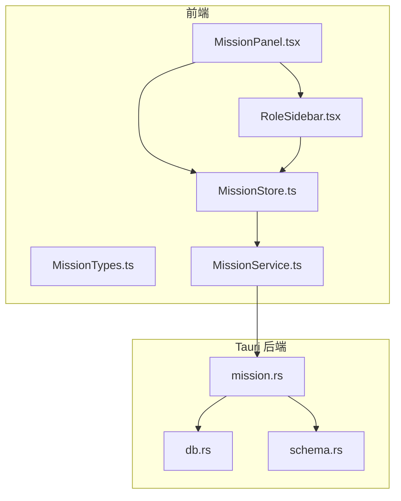
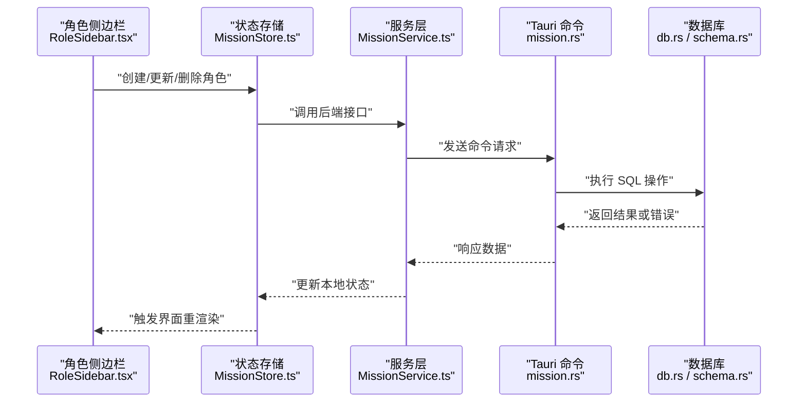
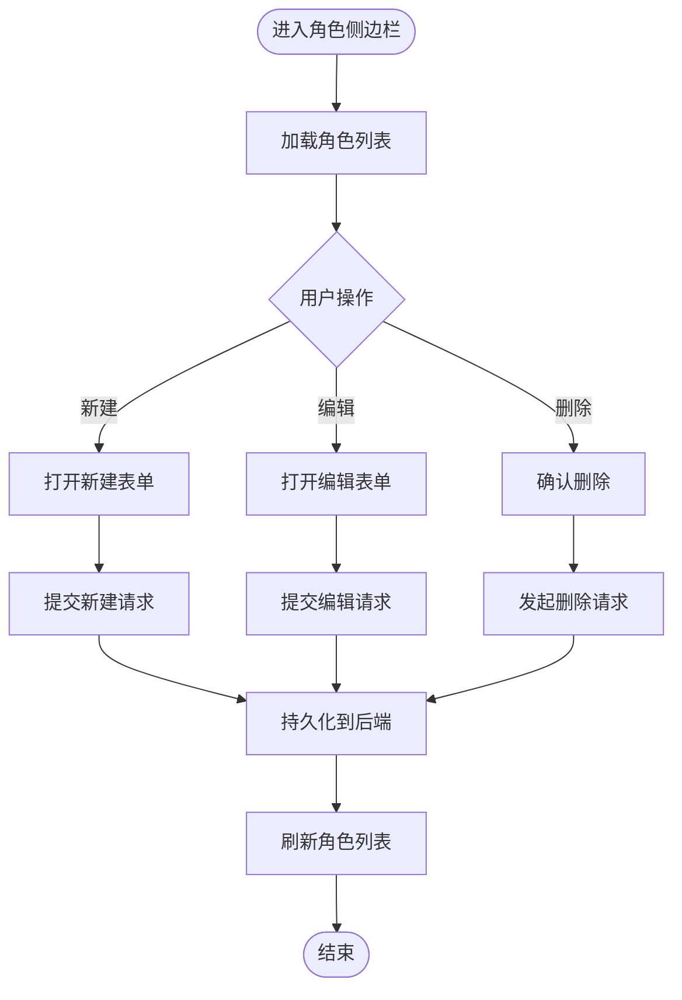
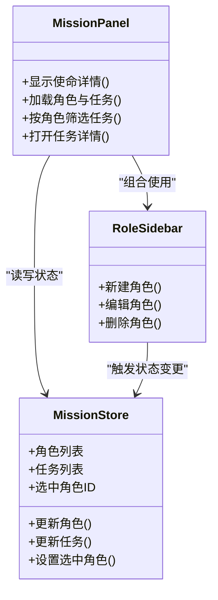
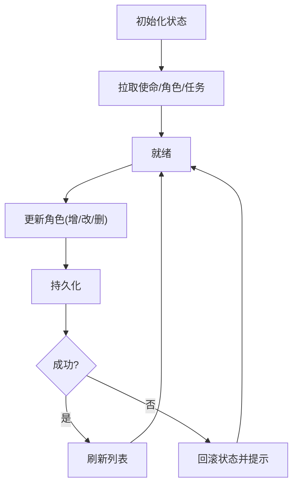
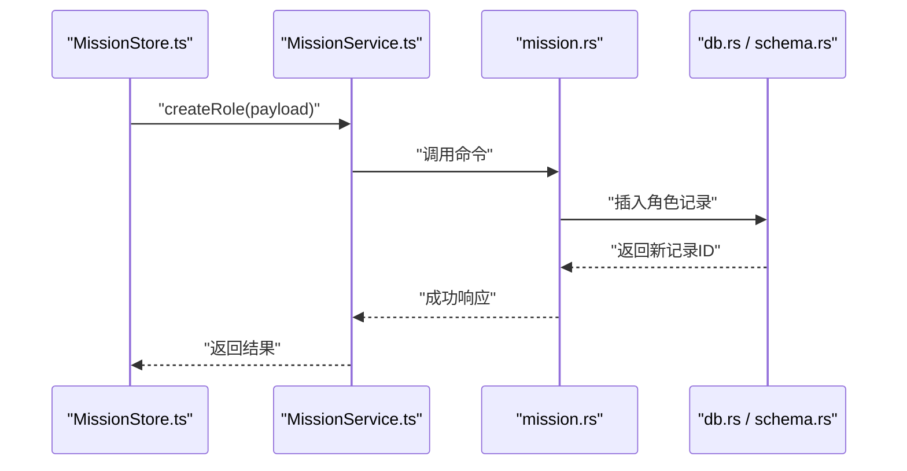
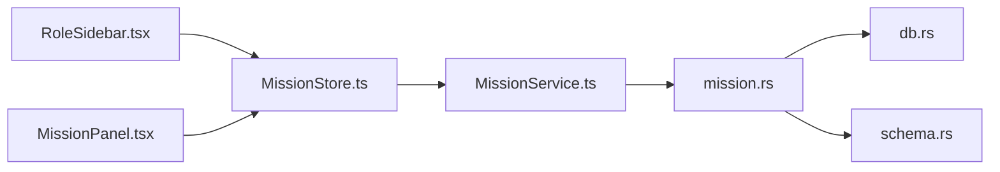

# 任务角色管理

<cite>
**本文引用的文件**   
- [src/features/mission/MissionPanel.tsx](file://src/features/mission/MissionPanel.tsx)
- [src/features/mission/RoleSidebar.tsx](file://src/features/mission/RoleSidebar.tsx)
- [src/features/mission/MissionStore.ts](file://src/features/mission/MissionStore.ts)
- [src/features/mission/MissionTypes.ts](file://src/features/mission/MissionTypes.ts)
- [src/features/mission/MissionService.ts](file://src/features/mission/MissionService.ts)
- [src-tauri/src/mission.rs](file://src-tauri/src/mission.rs)
- [src-tauri/src/db.rs](file://src-tauri/src/db.rs)
- [src-tauri/src/schema.rs](file://src-tauri/src/schema.rs)
</cite>

## 目录
1. [简介](#简介)
2. [项目结构](#项目结构)
3. [核心组件](#核心组件)
4. [架构总览](#架构总览)
5. [详细组件分析](#详细组件分析)
6. [依赖分析](#依赖分析)
7. [性能考虑](#性能考虑)
8. [故障排查指南](#故障排查指南)
9. [结论](#结论)
10. [附录](#附录)

## 简介
本文件聚焦 FishWorker 中的“任务角色管理”能力，围绕“使命（Mission）—角色（Role）—任务（Task）”的关联关系，梳理前端展示、状态管理与后端持久化的完整链路。文档面向不同技术背景的读者，提供从高层架构到代码级细节的分层说明，并辅以可视化图示与排障建议。

## 项目结构
与“任务角色管理”直接相关的代码主要分布在以下位置：
- 前端特性模块 features/mission：包含面板、侧边栏、类型定义、状态存储与服务调用
- Tauri 后端 src-tauri/src：包含 Rust 端命令实现、数据库连接与数据模型

图表来源
- [src/features/mission/MissionPanel.tsx](file://src/features/mission/MissionPanel.tsx)
- [src/features/mission/RoleSidebar.tsx](file://src/features/mission/RoleSidebar.tsx)
- [src/features/mission/MissionStore.ts](file://src/features/mission/MissionStore.ts)
- [src/features/mission/MissionTypes.ts](file://src/features/mission/MissionTypes.ts)
- [src/features/mission/MissionService.ts](file://src/features/mission/MissionService.ts)
- [src-tauri/src/mission.rs](file://src-tauri/src/mission.rs)
- [src-tauri/src/db.rs](file://src-tauri/src/db.rs)
- [src-tauri/src/schema.rs](file://src-tauri/src/schema.rs)

章节来源
- [src/features/mission/MissionPanel.tsx](file://src/features/mission/MissionPanel.tsx)
- [src/features/mission/RoleSidebar.tsx](file://src/features/mission/RoleSidebar.tsx)
- [src/features/mission/MissionStore.ts](file://src/features/mission/MissionStore.ts)
- [src/features/mission/MissionTypes.ts](file://src/features/mission/MissionTypes.ts)
- [src/features/mission/MissionService.ts](file://src/features/mission/MissionService.ts)
- [src-tauri/src/mission.rs](file://src-tauri/src/mission.rs)
- [src-tauri/src/db.rs](file://src-tauri/src/db.rs)
- [src-tauri/src/schema.rs](file://src-tauri/src/schema.rs)

## 核心组件
- 角色侧边栏 RoleSidebar：负责角色的增删改查交互与列表渲染，触发对 MissionStore 的状态更新
- 使命面板 MissionPanel：承载角色与任务的聚合视图，协调角色与任务的数据联动
- 状态存储 MissionStore：维护角色与任务相关的全局状态，封装变更逻辑与副作用
- 服务层 MissionService：封装与 Tauri 后端的通信协议（如命令调用），统一错误处理与重试策略
- 类型定义 MissionTypes：集中定义角色、任务、关联关系等数据结构
- 后端 mission.rs：暴露 Tauri 命令，实现角色与任务的 CRUD 与查询
- 数据库 db.rs：管理数据库连接、事务与通用 SQL 执行
- 数据模型 schema.rs：定义角色、任务及其关联表的结构

章节来源
- [src/features/mission/RoleSidebar.tsx](file://src/features/mission/RoleSidebar.tsx)
- [src/features/mission/MissionPanel.tsx](file://src/features/mission/MissionPanel.tsx)
- [src/features/mission/MissionStore.ts](file://src/features/mission/MissionStore.ts)
- [src/features/mission/MissionService.ts](file://src/features/mission/MissionService.ts)
- [src/features/mission/MissionTypes.ts](file://src/features/mission/MissionTypes.ts)
- [src-tauri/src/mission.rs](file://src-tauri/src/mission.rs)
- [src-tauri/src/db.rs](file://src-tauri/src/db.rs)
- [src-tauri/src/schema.rs](file://src-tauri/src/schema.rs)

## 架构总览
整体采用“前端特性模块 + Tauri 后端命令”的分层架构。前端通过 Service 层调用 Tauri 命令，Rust 端再访问数据库完成持久化。

图表来源
- [src/features/mission/RoleSidebar.tsx](file://src/features/mission/RoleSidebar.tsx)
- [src/features/mission/MissionStore.ts](file://src/features/mission/MissionStore.ts)
- [src/features/mission/MissionService.ts](file://src/features/mission/MissionService.ts)
- [src-tauri/src/mission.rs](file://src-tauri/src/mission.rs)
- [src-tauri/src/db.rs](file://src-tauri/src/db.rs)
- [src-tauri/src/schema.rs](file://src-tauri/src/schema.rs)

## 详细组件分析

### 角色侧边栏 RoleSidebar
职责与行为
- 提供角色的新增、编辑、删除入口
- 根据当前选中的使命上下文，加载并展示角色列表
- 将用户操作转换为对 MissionStore 的状态更新调用

交互流程
- 用户点击“新建角色”时，打开表单并写入临时状态
- 提交后调用服务层进行持久化，成功后刷新列表
- 删除角色前进行确认，避免误操作

图表来源
- [src/features/mission/RoleSidebar.tsx](file://src/features/mission/RoleSidebar.tsx)
- [src/features/mission/MissionStore.ts](file://src/features/mission/MissionStore.ts)
- [src/features/mission/MissionService.ts](file://src/features/mission/MissionService.ts)

章节来源
- [src/features/mission/RoleSidebar.tsx](file://src/features/mission/RoleSidebar.tsx)
- [src/features/mission/MissionStore.ts](file://src/features/mission/MissionStore.ts)
- [src/features/mission/MissionService.ts](file://src/features/mission/MissionService.ts)

### 使命面板 MissionPanel
职责与行为
- 聚合展示使命、角色与任务信息
- 在角色变更后联动更新任务视图（例如按角色筛选任务）
- 协调 MissionStore 的状态同步与界面刷新

关键流程
- 选择使命后，拉取该使命下的角色与任务
- 切换角色时，过滤并高亮对应任务
- 任务详情弹窗中支持基于角色的权限控制（如仅特定角色可编辑）

图表来源
- [src/features/mission/MissionPanel.tsx](file://src/features/mission/MissionPanel.tsx)
- [src/features/mission/RoleSidebar.tsx](file://src/features/mission/RoleSidebar.tsx)
- [src/features/mission/MissionStore.ts](file://src/features/mission/MissionStore.ts)

章节来源
- [src/features/mission/MissionPanel.tsx](file://src/features/mission/MissionPanel.tsx)
- [src/features/mission/RoleSidebar.tsx](file://src/features/mission/RoleSidebar.tsx)
- [src/features/mission/MissionStore.ts](file://src/features/mission/MissionStore.ts)

### 状态存储 MissionStore
职责与行为
- 维护角色与任务的核心状态
- 封装状态变更方法，确保一致性
- 与 MissionService 协作，处理异步副作用与错误回滚

典型方法
- 初始化：加载使命、角色与任务
- 更新角色：新增/修改/删除角色并刷新列表
- 更新任务：根据角色变化调整任务可见性与权限
- 错误处理：捕获网络与后端错误，提示用户并恢复状态

图表来源
- [src/features/mission/MissionStore.ts](file://src/features/mission/MissionStore.ts)
- [src/features/mission/MissionService.ts](file://src/features/mission/MissionService.ts)

章节来源
- [src/features/mission/MissionStore.ts](file://src/features/mission/MissionStore.ts)
- [src/features/mission/MissionService.ts](file://src/features/mission/MissionService.ts)

### 服务层 MissionService
职责与行为
- 封装与 Tauri 后端的通信协议
- 统一错误码映射与重试策略
- 为上层提供简洁的 API（如 createRole、updateRole、deleteRole、listTasksByRole）

调用序列
- 前端调用服务方法
- 服务构造请求参数并调用 Tauri 命令
- 解析响应并返回给调用方

图表来源
- [src/features/mission/MissionService.ts](file://src/features/mission/MissionService.ts)
- [src-tauri/src/mission.rs](file://src-tauri/src/mission.rs)
- [src-tauri/src/db.rs](file://src-tauri/src/db.rs)
- [src-tauri/src/schema.rs](file://src-tauri/src/schema.rs)

章节来源
- [src/features/mission/MissionService.ts](file://src/features/mission/MissionService.ts)
- [src-tauri/src/mission.rs](file://src-tauri/src/mission.rs)
- [src-tauri/src/db.rs](file://src-tauri/src/db.rs)
- [src-tauri/src/schema.rs](file://src-tauri/src/schema.rs)

### 类型定义 MissionTypes
职责与行为
- 集中定义角色、任务、关联关系等数据结构
- 保证前后端数据契约一致
- 提供可选字段与默认值的类型约束

常见类型
- 角色：标识、名称、描述、所属使命、创建时间等
- 任务：标识、标题、内容、优先级、截止日期、关联角色等
- 关联：任务与角色的多对多关系（如通过中间表）

章节来源
- [src/features/mission/MissionTypes.ts](file://src/features/mission/MissionTypes.ts)

### 后端 mission.rs
职责与行为
- 暴露 Tauri 命令，接收前端请求
- 校验输入参数，调用数据库层执行 CRUD
- 返回结构化响应，便于前端解析

典型命令
- 创建角色
- 更新角色
- 删除角色
- 查询使命下角色与任务
- 按角色筛选任务

章节来源
- [src-tauri/src/mission.rs](file://src-tauri/src/mission.rs)

### 数据库 db.rs
职责与行为
- 管理数据库连接与生命周期
- 提供事务支持与通用 SQL 执行工具
- 封装错误类型与日志输出

章节来源
- [src-tauri/src/db.rs](file://src-tauri/src/db.rs)

### 数据模型 schema.rs
职责与行为
- 定义角色、任务及关联表的字段与约束
- 明确主键、外键与索引策略
- 为迁移与查询提供稳定结构

章节来源
- [src-tauri/src/schema.rs](file://src-tauri/src/schema.rs)

## 依赖分析
组件间依赖关系如下：

图表来源
- [src/features/mission/RoleSidebar.tsx](file://src/features/mission/RoleSidebar.tsx)
- [src/features/mission/MissionPanel.tsx](file://src/features/mission/MissionPanel.tsx)
- [src/features/mission/MissionStore.ts](file://src/features/mission/MissionStore.ts)
- [src/features/mission/MissionService.ts](file://src/features/mission/MissionService.ts)
- [src-tauri/src/mission.rs](file://src-tauri/src/mission.rs)
- [src-tauri/src/db.rs](file://src-tauri/src/db.rs)
- [src-tauri/src/schema.rs](file://src-tauri/src/schema.rs)

章节来源
- [src/features/mission/RoleSidebar.tsx](file://src/features/mission/RoleSidebar.tsx)
- [src/features/mission/MissionPanel.tsx](file://src/features/mission/MissionPanel.tsx)
- [src/features/mission/MissionStore.ts](file://src/features/mission/MissionStore.ts)
- [src/features/mission/MissionService.ts](file://src/features/mission/MissionService.ts)
- [src-tauri/src/mission.rs](file://src-tauri/src/mission.rs)
- [src-tauri/src/db.rs](file://src-tauri/src/db.rs)
- [src-tauri/src/schema.rs](file://src-tauri/src/schema.rs)

## 性能考虑
- 列表分页与懒加载：角色与任务较多时，采用分页与滚动加载减少首屏压力
- 增量更新：仅在必要字段变更时触发重渲染，避免整树更新
- 批量操作：合并多次角色更新为一次事务，降低数据库往返次数
- 缓存策略：对不频繁变动的角色元数据进行短期缓存，提升二次访问速度
- 并发控制：防止重复提交导致的竞态条件，必要时加入去抖与锁机制

## 故障排查指南
常见问题与定位步骤
- 角色无法保存
  - 检查 MissionService 的错误映射是否覆盖后端异常
  - 查看 MissionStore 的回滚逻辑是否正确恢复状态
  - 验证 mission.rs 的参数校验与数据库约束
- 角色与任务不同步
  - 确认 MissionStore 在角色变更后是否触发任务刷新
  - 检查 MissionPanel 的筛选逻辑是否与角色 ID 绑定
- 数据库连接失败
  - 核对 db.rs 的连接配置与重试策略
  - 查看 schema.rs 的表结构与迁移是否匹配

章节来源
- [src/features/mission/MissionStore.ts](file://src/features/mission/MissionStore.ts)
- [src/features/mission/MissionService.ts](file://src/features/mission/MissionService.ts)
- [src-tauri/src/mission.rs](file://src-tauri/src/mission.rs)
- [src-tauri/src/db.rs](file://src-tauri/src/db.rs)
- [src-tauri/src/schema.rs](file://src-tauri/src/schema.rs)

## 结论
“任务角色管理”以清晰的层次划分与稳定的数据契约为基础，实现了从前端交互到后端持久化的闭环。通过合理的状态管理与错误处理，系统在易用性与可靠性之间取得平衡。后续可在分页、缓存与批量操作上进一步优化体验与性能。

## 附录
- 术语
  - 使命：业务目标的高层抽象，作为角色与任务的上下文容器
  - 角色：承担特定职责的实体，用于组织与管理任务
  - 任务：具体工作项，可与一个或多个角色关联
- 扩展建议
  - 引入角色权限矩阵，细化任务的可读/可写/可删除权限
  - 增加审计日志，记录角色与任务的关键变更历史
  - 提供导入导出功能，便于团队协作与备份