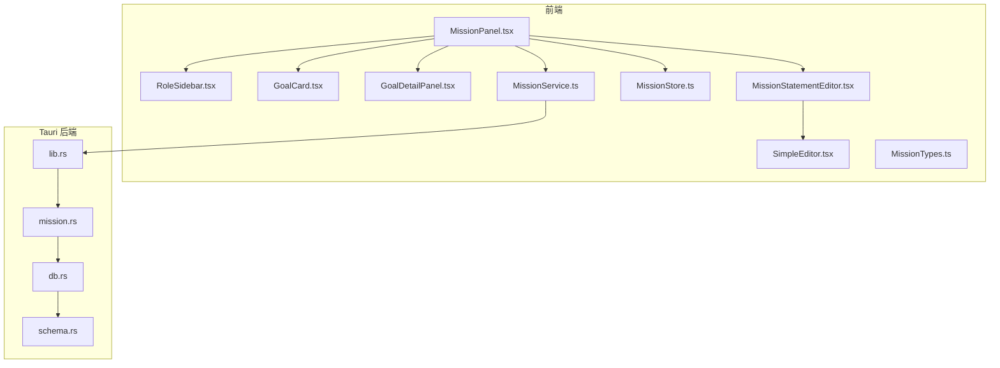
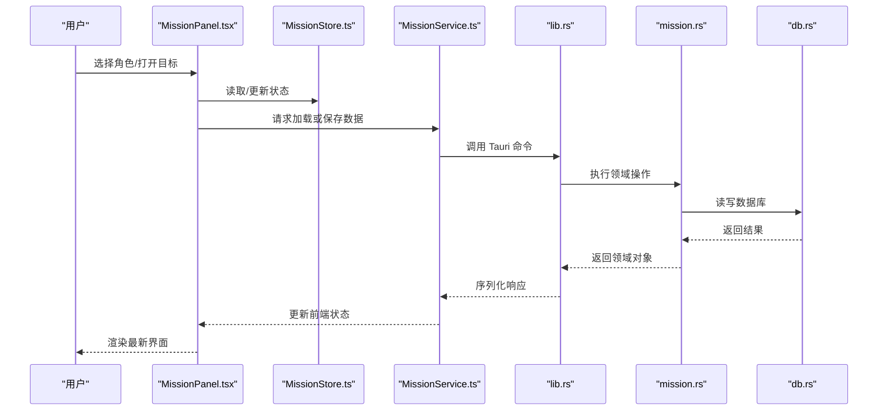
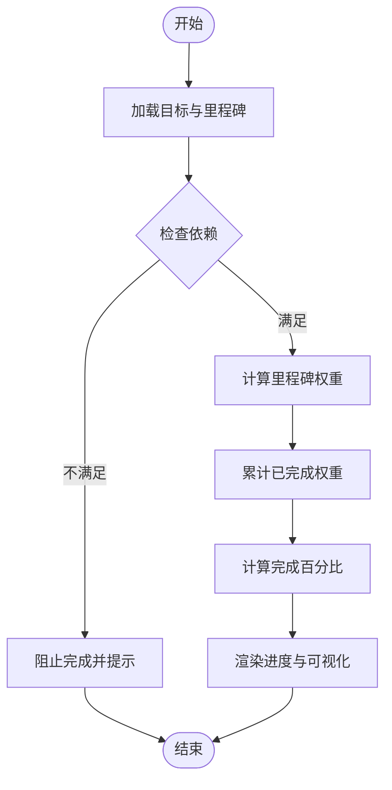
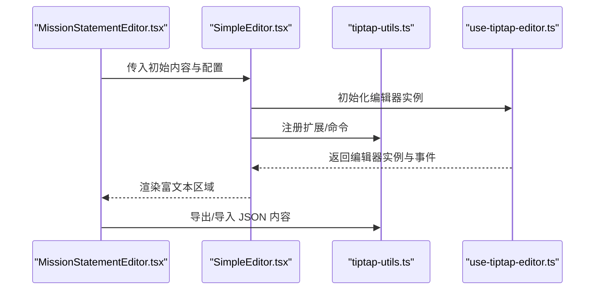
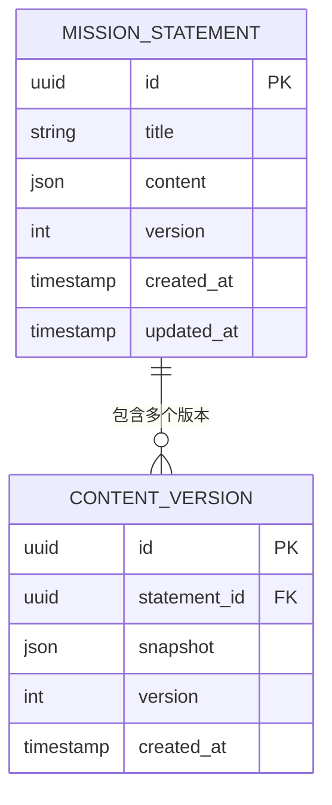
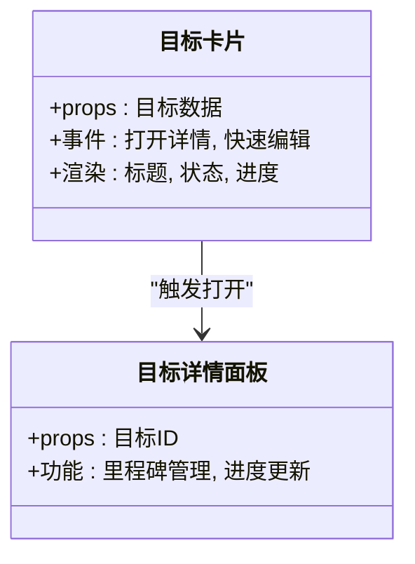
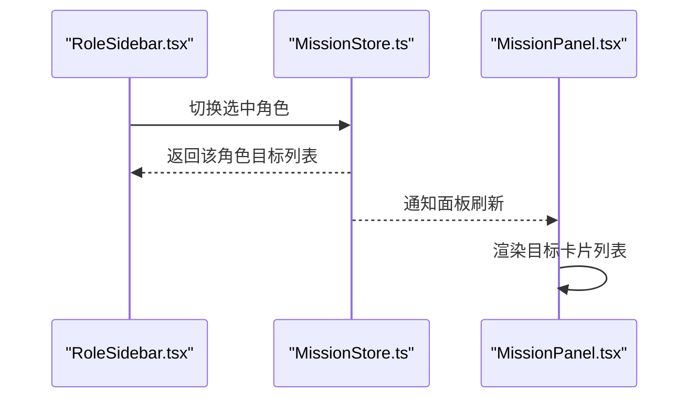
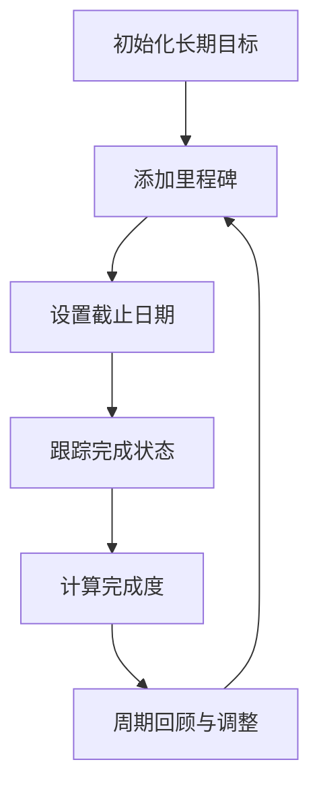
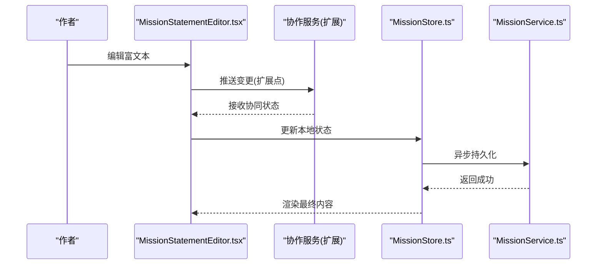
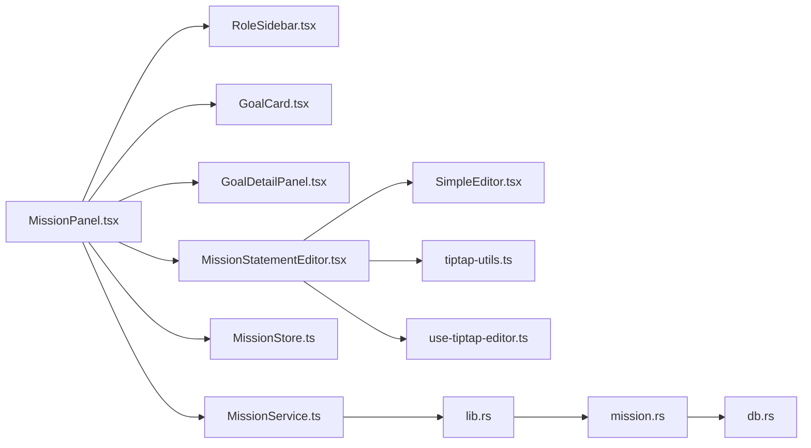

# 使命声明系统

<cite>
**本文引用的文件**   
- [MissionPanel.tsx](file://src/features/mission/MissionPanel.tsx)
- [MissionStore.ts](file://src/features/mission/MissionStore.ts)
- [MissionTypes.ts](file://src/features/mission/MissionTypes.ts)
- [MissionService.ts](file://src/features/mission/MissionService.ts)
- [RoleSidebar.tsx](file://src/features/mission/RoleSidebar.tsx)
- [GoalCard.tsx](file://src/features/mission/GoalCard.tsx)
- [GoalDetailPanel.tsx](file://src/features/mission/GoalDetailPanel.tsx)
- [MissionStatementEditor.tsx](file://src/features/mission/MissionStatementEditor.tsx)
- [SimpleEditor.tsx](file://src/features/tiptap/SimpleEditor.tsx)
- [use-tiptap-editor.ts](file://src/hooks/use-tiptap-editor.ts)
- [tiptap-utils.ts](file://src/lib/tiptap-utils.ts)
- [lib.rs](file://src-tauri/src/lib.rs)
- [mission.rs](file://src-tauri/src/mission.rs)
- [db.rs](file://src-tauri/src/db.rs)
- [schema.rs](file://src-tauri/src/schema.rs)
</cite>

## 目录
1. [简介](#简介)
2. [项目结构](#项目结构)
3. [核心组件](#核心组件)
4. [架构总览](#架构总览)
5. [详细组件分析](#详细组件分析)
6. [依赖关系分析](#依赖关系分析)
7. [性能考虑](#性能考虑)
8. [故障排查指南](#故障排查指南)
9. [结论](#结论)
10. [附录](#附录)

## 简介
本技术文档围绕“使命声明系统”展开，聚焦角色驱动的目标管理设计理念、目标分解算法与可视化展示方案；深入说明使命编辑器与 TipTap 编辑器的集成方式、富文本内容的存储结构与版本管理机制；解析目标卡片组件的设计模式、角色侧边栏的导航逻辑与数据绑定方式；阐述长期目标的跟踪方法、里程碑设置与完成度评估算法；并给出内容创作工作流设计与协作扩展接口建议。

## 项目结构
使命声明系统位于前端 features/mission 模块，并与 Tauri 后端通过 Rust 服务进行持久化交互。整体采用“特性内聚 + 前后端分层”的组织方式：
- 前端 UI 层：面板、侧边栏、卡片、详情面板、编辑器等组件
- 状态层：基于 Store 的状态管理与业务计算
- 服务层：封装对后端的调用（Tauri）
- 后端层：Rust 实现数据库访问与领域模型映射



图表来源
- [MissionPanel.tsx](file://src/features/mission/MissionPanel.tsx)
- [RoleSidebar.tsx](file://src/features/mission/RoleSidebar.tsx)
- [GoalCard.tsx](file://src/features/mission/GoalCard.tsx)
- [GoalDetailPanel.tsx](file://src/features/mission/GoalDetailPanel.tsx)
- [MissionStatementEditor.tsx](file://src/features/mission/MissionStatementEditor.tsx)
- [SimpleEditor.tsx](file://src/features/tiptap/SimpleEditor.tsx)
- [MissionStore.ts](file://src/features/mission/MissionStore.ts)
- [MissionService.ts](file://src/features/mission/MissionService.ts)
- [MissionTypes.ts](file://src/features/mission/MissionTypes.ts)
- [lib.rs](file://src-tauri/src/lib.rs)
- [mission.rs](file://src-tauri/src/mission.rs)
- [db.rs](file://src-tauri/src/db.rs)
- [schema.rs](file://src-tauri/src/schema.rs)

章节来源
- [MissionPanel.tsx](file://src/features/mission/MissionPanel.tsx)
- [MissionStore.ts](file://src/features/mission/MissionStore.ts)
- [MissionTypes.ts](file://src/features/mission/MissionTypes.ts)
- [MissionService.ts](file://src/features/mission/MissionService.ts)
- [RoleSidebar.tsx](file://src/features/mission/RoleSidebar.tsx)
- [GoalCard.tsx](file://src/features/mission/GoalCard.tsx)
- [GoalDetailPanel.tsx](file://src/features/mission/GoalDetailPanel.tsx)
- [MissionStatementEditor.tsx](file://src/features/mission/MissionStatementEditor.tsx)
- [SimpleEditor.tsx](file://src/features/tiptap/SimpleEditor.tsx)
- [lib.rs](file://src-tauri/src/lib.rs)
- [mission.rs](file://src-tauri/src/mission.rs)
- [db.rs](file://src-tauri/src/db.rs)
- [schema.rs](file://src-tauri/src/schema.rs)

## 核心组件
- 使命面板 MissionPanel：聚合角色侧边栏、目标卡片列表、详情面板与使命编辑器，是用户主入口。
- 角色侧边栏 RoleSidebar：按角色维度组织目标，提供导航与筛选能力。
- 目标卡片 GoalCard：展示单条目标的概览信息，支持点击打开详情。
- 目标详情面板 GoalDetailPanel：承载目标的里程碑、进度、备注与关联任务。
- 使命编辑器 MissionStatementEditor：基于 TipTap 的富文本编辑器，用于维护使命陈述与背景知识。
- 通用编辑器 SimpleEditor：封装 TipTap 初始化、命令与工具函数。
- 状态管理 MissionStore：集中管理角色、目标、里程碑、进度与版本等状态。
- 服务层 MissionService：封装 Tauri 命令调用，负责读写持久化数据。
- 类型定义 MissionTypes：统一前后端数据结构契约。

章节来源
- [MissionPanel.tsx](file://src/features/mission/MissionPanel.tsx)
- [RoleSidebar.tsx](file://src/features/mission/RoleSidebar.tsx)
- [GoalCard.tsx](file://src/features/mission/GoalCard.tsx)
- [GoalDetailPanel.tsx](file://src/features/mission/GoalDetailPanel.tsx)
- [MissionStatementEditor.tsx](file://src/features/mission/MissionStatementEditor.tsx)
- [SimpleEditor.tsx](file://src/features/tiptap/SimpleEditor.tsx)
- [MissionStore.ts](file://src/features/mission/MissionStore.ts)
- [MissionService.ts](file://src/features/mission/MissionService.ts)
- [MissionTypes.ts](file://src/features/mission/MissionTypes.ts)

## 架构总览
系统采用“前端特性模块 + Tauri 后端服务”的分层架构。前端以 React 组件为视图层，使用 Store 管理状态，并通过 Service 层调用 Tauri 暴露的命令；后端通过 Rust 模块处理数据库访问与领域逻辑，保证数据一致性与安全性。



图表来源
- [MissionPanel.tsx](file://src/features/mission/MissionPanel.tsx)
- [MissionStore.ts](file://src/features/mission/MissionStore.ts)
- [MissionService.ts](file://src/features/mission/MissionService.ts)
- [lib.rs](file://src-tauri/src/lib.rs)
- [mission.rs](file://src-tauri/src/mission.rs)
- [db.rs](file://src-tauri/src/db.rs)

## 详细组件分析

### 角色驱动的目标管理设计
- 设计理念：以“角色”为第一维度组织目标，体现多身份场景下的目标分层与优先级管理。
- 数据结构：角色集合与目标集合通过外键或标识关联，支持按角色过滤、排序与统计。
- 交互流程：用户在侧边栏切换角色，面板动态刷新对应目标列表；在目标卡片中查看里程碑与进度。

```mermaid
classDiagram
class 角色 {
+id
+名称
+描述
}
class 目标 {
+id
+标题
+角色_id
+状态
+优先级
+创建时间
+更新时间
}
class 里程碑 {
+id
+目标_id
+标题
+截止日期
+完成标志
}
角色 ||--o{ 目标 : "拥有"
目标 ||--o{ 里程碑 : "包含"
```

图表来源
- [MissionTypes.ts](file://src/features/mission/MissionTypes.ts)
- [MissionStore.ts](file://src/features/mission/MissionStore.ts)

章节来源
- [MissionTypes.ts](file://src/features/mission/MissionTypes.ts)
- [MissionStore.ts](file://src/features/mission/MissionStore.ts)

### 目标分解算法与可视化
- 分解策略：将长期目标拆解为阶段性里程碑，再进一步细化为可执行子目标或任务项。
- 可视化呈现：在目标详情面板中以时间轴或列表形式展示里程碑，结合进度条显示完成度。
- 算法要点：
  - 里程碑权重分配：可按时间跨度、复杂度或依赖关系加权。
  - 完成度计算：基于已完成里程碑数量与权重汇总，得到总体百分比。
  - 依赖校验：若存在前置里程碑未完成，则阻止后续里程碑标记完成。



图表来源
- [GoalDetailPanel.tsx](file://src/features/mission/GoalDetailPanel.tsx)
- [MissionStore.ts](file://src/features/mission/MissionStore.ts)

章节来源
- [GoalDetailPanel.tsx](file://src/features/mission/GoalDetailPanel.tsx)
- [MissionStore.ts](file://src/features/mission/MissionStore.ts)

### 使命编辑器与 TipTap 集成
- 集成方式：MissionStatementEditor 作为上层容器，内部使用 SimpleEditor 初始化 TipTap 实例，注入自定义节点与扩展。
- 工具函数：通过 tiptap-utils 提供常用操作（如插入节点、格式化、导出 JSON）。
- 钩子封装：use-tiptap-editor 提供统一的编辑器生命周期与事件订阅。
- 内容结构：富文本以 JSON 文档结构存储，便于版本对比与回滚。



图表来源
- [MissionStatementEditor.tsx](file://src/features/mission/MissionStatementEditor.tsx)
- [SimpleEditor.tsx](file://src/features/tiptap/SimpleEditor.tsx)
- [tiptap-utils.ts](file://src/lib/tiptap-utils.ts)
- [use-tiptap-editor.ts](file://src/hooks/use-tiptap-editor.ts)

章节来源
- [MissionStatementEditor.tsx](file://src/features/mission/MissionStatementEditor.tsx)
- [SimpleEditor.tsx](file://src/features/tiptap/SimpleEditor.tsx)
- [tiptap-utils.ts](file://src/lib/tiptap-utils.ts)
- [use-tiptap-editor.ts](file://src/hooks/use-tiptap-editor.ts)

### 富文本内容存储结构与版本管理
- 存储结构：富文本内容以 JSON 文档格式持久化，字段包含版本号、修订历史与快照。
- 版本机制：每次保存生成新版本记录，支持回溯到指定版本；差异比较可用于变更预览。
- 同步策略：前端增量更新，后端合并冲突时保留双方变更并提示用户确认。



图表来源
- [MissionTypes.ts](file://src/features/mission/MissionTypes.ts)
- [MissionService.ts](file://src/features/mission/MissionService.ts)
- [mission.rs](file://src-tauri/src/mission.rs)
- [schema.rs](file://src-tauri/src/schema.rs)

章节来源
- [MissionTypes.ts](file://src/features/mission/MissionTypes.ts)
- [MissionService.ts](file://src/features/mission/MissionService.ts)
- [mission.rs](file://src-tauri/src/mission.rs)
- [schema.rs](file://src-tauri/src/schema.rs)

### 目标卡片组件设计模式
- 设计模式：组合式组件，将基础展示与交互行为解耦；通过 props 传递数据，回调函数处理事件。
- 数据绑定：从 MissionStore 订阅目标状态变化，局部重渲染提升性能。
- 交互细节：悬停显示快捷操作，点击跳转详情面板，支持拖拽排序（可选）。



图表来源
- [GoalCard.tsx](file://src/features/mission/GoalCard.tsx)
- [GoalDetailPanel.tsx](file://src/features/mission/GoalDetailPanel.tsx)
- [MissionStore.ts](file://src/features/mission/MissionStore.ts)

章节来源
- [GoalCard.tsx](file://src/features/mission/GoalCard.tsx)
- [GoalDetailPanel.tsx](file://src/features/mission/GoalDetailPanel.tsx)
- [MissionStore.ts](file://src/features/mission/MissionStore.ts)

### 角色侧边栏导航逻辑与数据绑定
- 导航逻辑：根据当前选中角色过滤目标列表，支持搜索与标签筛选。
- 数据绑定：侧边栏与面板共享同一份角色与目标状态，避免重复请求。
- 性能优化：懒加载目标详情，分页或虚拟滚动处理大量数据。



图表来源
- [RoleSidebar.tsx](file://src/features/mission/RoleSidebar.tsx)
- [MissionStore.ts](file://src/features/mission/MissionStore.ts)
- [MissionPanel.tsx](file://src/features/mission/MissionPanel.tsx)

章节来源
- [RoleSidebar.tsx](file://src/features/mission/RoleSidebar.tsx)
- [MissionStore.ts](file://src/features/mission/MissionStore.ts)
- [MissionPanel.tsx](file://src/features/mission/MissionPanel.tsx)

### 长期目标跟踪、里程碑与完成度评估
- 跟踪方法：以里程碑为粒度记录进展，支持周期性回顾与调整计划。
- 里程碑设置：允许添加、删除、重排与设定截止日期；支持依赖关系约束。
- 完成度评估：基于里程碑权重与完成状态计算百分比，并提供趋势图展示。



图表来源
- [GoalDetailPanel.tsx](file://src/features/mission/GoalDetailPanel.tsx)
- [MissionStore.ts](file://src/features/mission/MissionStore.ts)

章节来源
- [GoalDetailPanel.tsx](file://src/features/mission/GoalDetailPanel.tsx)
- [MissionStore.ts](file://src/features/mission/MissionStore.ts)

### 内容创作工作流与协作扩展接口
- 工作流设计：从灵感收集到结构化大纲，再到富文本撰写与版本归档，形成闭环。
- 协作扩展：预留多人编辑接口，支持实时协同（如 OT/CRDT）、评论与批注。
- 权限控制：基于角色的访问控制，限制敏感内容的编辑与发布。



图表来源
- [MissionStatementEditor.tsx](file://src/features/mission/MissionStatementEditor.tsx)
- [MissionStore.ts](file://src/features/mission/MissionStore.ts)
- [MissionService.ts](file://src/features/mission/MissionService.ts)

章节来源
- [MissionStatementEditor.tsx](file://src/features/mission/MissionStatementEditor.tsx)
- [MissionStore.ts](file://src/features/mission/MissionStore.ts)
- [MissionService.ts](file://src/features/mission/MissionService.ts)

## 依赖关系分析
- 组件耦合：MissionPanel 聚合多个子组件，职责清晰但需关注过度耦合风险。
- 状态依赖：MissionStore 被多处订阅，应确保不可变更新与最小化重渲染。
- 外部依赖：TipTap 扩展与工具函数集中在 lib 与 hooks 目录，便于复用与维护。
- 后端集成：Tauri 命令在 lib.rs 中注册，mission.rs 实现领域逻辑，db.rs 负责数据访问。



图表来源
- [MissionPanel.tsx](file://src/features/mission/MissionPanel.tsx)
- [RoleSidebar.tsx](file://src/features/mission/RoleSidebar.tsx)
- [GoalCard.tsx](file://src/features/mission/GoalCard.tsx)
- [GoalDetailPanel.tsx](file://src/features/mission/GoalDetailPanel.tsx)
- [MissionStatementEditor.tsx](file://src/features/mission/MissionStatementEditor.tsx)
- [SimpleEditor.tsx](file://src/features/tiptap/SimpleEditor.tsx)
- [tiptap-utils.ts](file://src/lib/tiptap-utils.ts)
- [use-tiptap-editor.ts](file://src/hooks/use-tiptap-editor.ts)
- [MissionStore.ts](file://src/features/mission/MissionStore.ts)
- [MissionService.ts](file://src/features/mission/MissionService.ts)
- [lib.rs](file://src-tauri/src/lib.rs)
- [mission.rs](file://src-tauri/src/mission.rs)
- [db.rs](file://src-tauri/src/db.rs)

章节来源
- [MissionPanel.tsx](file://src/features/mission/MissionPanel.tsx)
- [MissionStore.ts](file://src/features/mission/MissionStore.ts)
- [MissionService.ts](file://src/features/mission/MissionService.ts)
- [lib.rs](file://src-tauri/src/lib.rs)
- [mission.rs](file://src-tauri/src/mission.rs)
- [db.rs](file://src-tauri/src/db.rs)

## 性能考虑
- 列表渲染：对大量目标卡片采用虚拟滚动或分页加载，减少 DOM 压力。
- 状态更新：使用不可变更新与选择性订阅，避免全局重渲染。
- 编辑器性能：节流保存与增量同步，避免频繁写入导致卡顿。
- 网络与磁盘：批量提交与去抖策略，降低 I/O 开销。

## 故障排查指南
- 编辑器无法启动：检查 TipTap 初始化参数与扩展注册是否正确。
- 数据不同步：验证 Tauri 命令返回值与前端状态更新路径是否一致。
- 版本冲突：查看版本快照与差异日志，必要时手动合并。
- 里程碑依赖错误：确认依赖关系图无环，且前置里程碑已标记完成。

章节来源
- [MissionStatementEditor.tsx](file://src/features/mission/MissionStatementEditor.tsx)
- [MissionService.ts](file://src/features/mission/MissionService.ts)
- [MissionStore.ts](file://src/features/mission/MissionStore.ts)

## 结论
使命声明系统以角色为中心组织目标，结合里程碑与完成度评估，形成可追踪、可演进的长期目标管理体系。通过 TipTap 富文本编辑器与版本化管理，使命陈述得以结构化沉淀与回溯。前后端分层与清晰的依赖关系保障了系统的可维护性与可扩展性。未来可在协作编辑、权限控制与数据分析方面进一步增强。

## 附录
- 术语表：角色、目标、里程碑、完成度、版本快照
- 最佳实践：不可变更新、最小化重渲染、增量同步、依赖校验