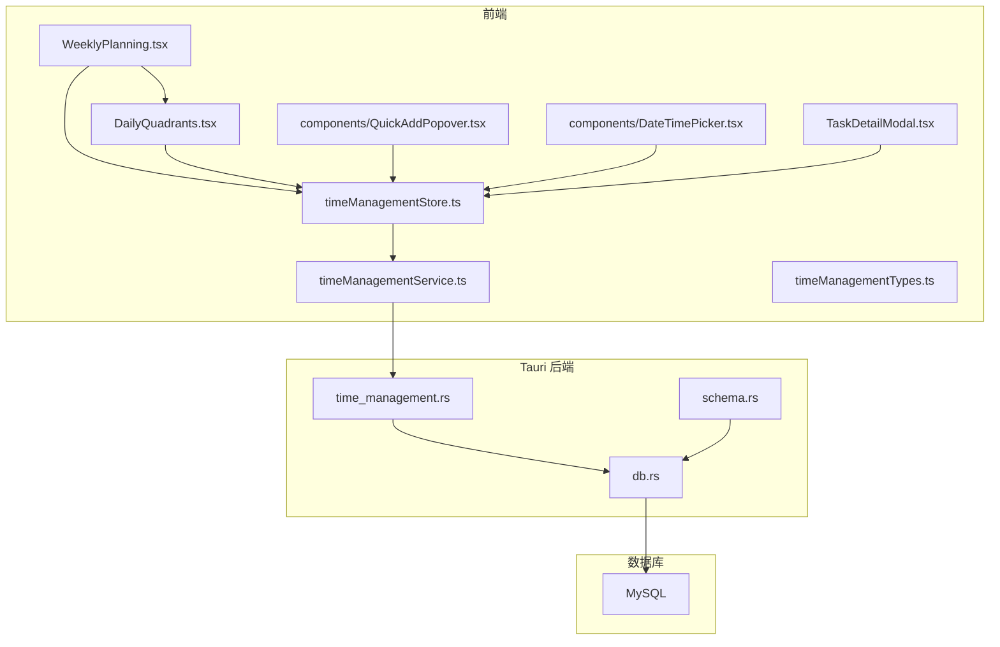
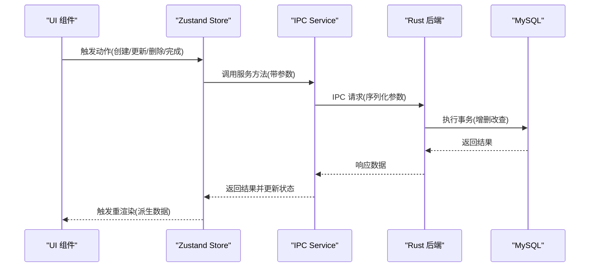
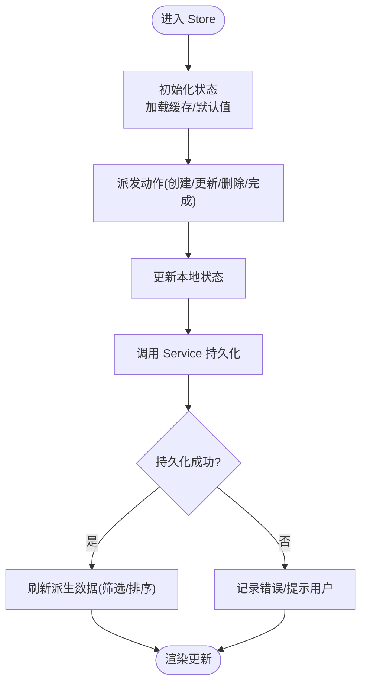
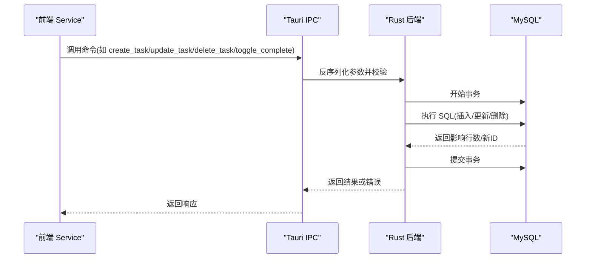
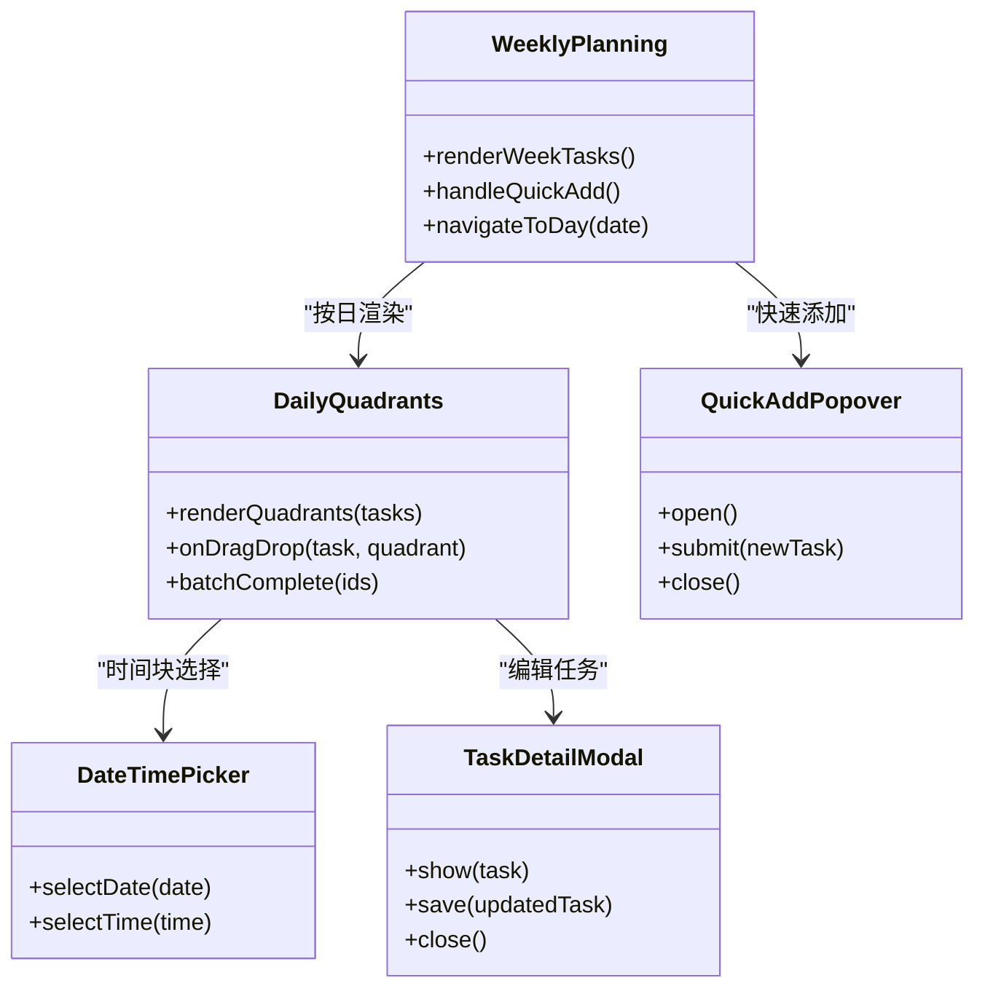
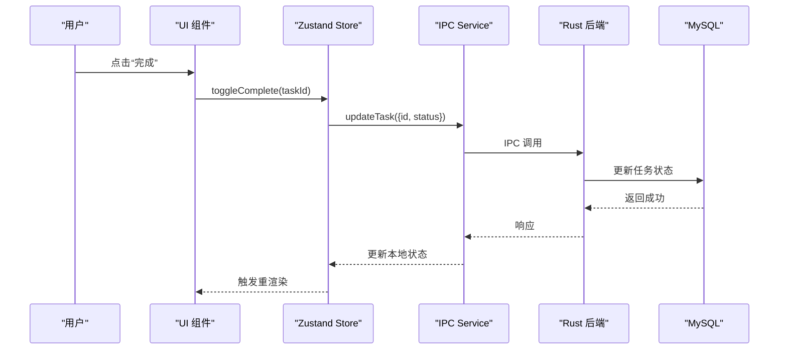
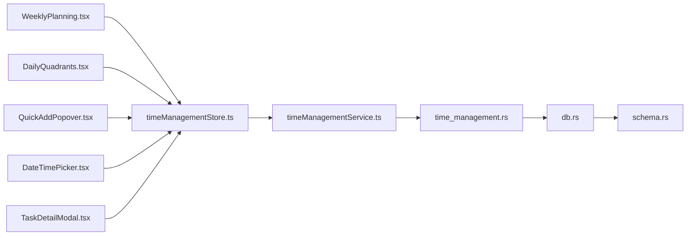

# 时间管理系统

<cite>
**本文引用的文件**   
- [src/features/time-management/WeeklyPlanning.tsx](file://src/features/time-management/WeeklyPlanning.tsx)
- [src/features/time-management/DailyQuadrants.tsx](file://src/features/time-management/DailyQuadrants.tsx)
- [src/features/time-management/timeManagementStore.ts](file://src/features/time-management/timeManagementStore.ts)
- [src/features/time-management/timeManagementService.ts](file://src/features/time-management/timeManagementService.ts)
- [src/features/time-management/timeManagementTypes.ts](file://src/features/time-management/timeManagementTypes.ts)
- [src/features/time-management/components/QuickAddPopover.tsx](file://src/features/time-management/components/QuickAddPopover.tsx)
- [src/features/time-management/components/DateTimePicker.tsx](file://src/features/time-management/components/DateTimePicker.tsx)
- [src/features/time-management/TaskDetailModal.tsx](file://src/features/time-management/TaskDetailModal.tsx)
- [src-tauri/src/time_management.rs](file://src-tauri/src/time_management.rs)
- [src-tauri/src/db.rs](file://src-tauri/src/db.rs)
- [src-tauri/src/schema.rs](file://src-tauri/src/schema.rs)
- [docx/Time_Management_API_Spec.md](file://docx/Time_Management_API_Spec.md)
- [docx/Weekly_Planning_Frontend_API.md](file://docx/Weekly_Planning_Frontend_API.md)
</cite>

## 目录
1. [简介](#简介)
2. [项目结构](#项目结构)
3. [核心组件](#核心组件)
4. [架构总览](#架构总览)
5. [详细组件分析](#详细组件分析)
6. [依赖关系分析](#依赖关系分析)
7. [性能考虑](#性能考虑)
8. [故障排查指南](#故障排查指南)
9. [结论](#结论)
10. [附录](#附录)

## 简介
本技术文档围绕“时间管理系统”展开，聚焦以下目标：
- 周计划规划与每日四象限任务管理的核心功能实现
- 数据模型设计（任务实体、优先级分类、时间块分配）
- Zustand store 状态管理模式（任务状态管理、筛选逻辑、排序算法）
- 与 Rust 后端的 IPC 通信机制、数据库操作接口与事务处理
- 用户界面组件架构（WeeklyPlanning 周视图、DailyQuadrants 四象限布局）
- 任务创建、编辑、删除、完成标记的完整业务流程
- 性能优化策略（虚拟滚动、懒加载等）

## 项目结构
时间管理系统采用前后端分离的 Tauri 应用架构。前端基于 React + TypeScript + Zustand，后端使用 Rust + Tauri 暴露 IPC 接口，持久化层通过 MySQL。

图表来源
- [src/features/time-management/WeeklyPlanning.tsx](file://src/features/time-management/WeeklyPlanning.tsx)
- [src/features/time-management/DailyQuadrants.tsx](file://src/features/time-management/DailyQuadrants.tsx)
- [src/features/time-management/timeManagementStore.ts](file://src/features/time-management/timeManagementStore.ts)
- [src/features/time-management/timeManagementService.ts](file://src/features/time-management/timeManagementService.ts)
- [src/features/time-management/timeManagementTypes.ts](file://src/features/time-management/timeManagementTypes.ts)
- [src/features/time-management/components/QuickAddPopover.tsx](file://src/features/time-management/components/QuickAddPopover.tsx)
- [src/features/time-management/components/DateTimePicker.tsx](file://src/features/time-management/components/DateTimePicker.tsx)
- [src/features/time-management/TaskDetailModal.tsx](file://src/features/time-management/TaskDetailModal.tsx)
- [src-tauri/src/time_management.rs](file://src-tauri/src/time_management.rs)
- [src-tauri/src/db.rs](file://src-tauri/src/db.rs)
- [src-tauri/src/schema.rs](file://src-tauri/src/schema.rs)

章节来源
- [src/features/time-management/WeeklyPlanning.tsx](file://src/features/time-management/WeeklyPlanning.tsx)
- [src/features/time-management/DailyQuadrants.tsx](file://src/features/time-management/DailyQuadrants.tsx)
- [src/features/time-management/timeManagementStore.ts](file://src/features/time-management/timeManagementStore.ts)
- [src/features/time-management/timeManagementService.ts](file://src/features/time-management/timeManagementService.ts)
- [src/features/time-management/timeManagementTypes.ts](file://src/features/time-management/timeManagementTypes.ts)
- [src-tauri/src/time_management.rs](file://src-tauri/src/time_management.rs)
- [src-tauri/src/db.rs](file://src-tauri/src/db.rs)
- [src-tauri/src/schema.rs](file://src-tauri/src/schema.rs)

## 核心组件
- WeeklyPlanning 周视图组件：负责按周维度组织任务、展示周计划概览、提供快速添加入口。
- DailyQuadrants 四象限布局：将当日任务按重要性与紧急性划分到四个象限，支持拖拽调整与批量操作。
- timeManagementStore：Zustand 状态管理，集中维护任务列表、筛选条件、排序规则、分页与缓存。
- timeManagementService：封装对 Rust 后端的 IPC 调用，统一错误处理与重试策略。
- timeManagementTypes：定义任务、优先级、时间块、筛选与排序等类型契约。
- QuickAddPopover / DateTimePicker / TaskDetailModal：辅助交互组件，提升任务录入与编辑体验。

章节来源
- [src/features/time-management/WeeklyPlanning.tsx](file://src/features/time-management/WeeklyPlanning.tsx)
- [src/features/time-management/DailyQuadrants.tsx](file://src/features/time-management/DailyQuadrants.tsx)
- [src/features/time-management/timeManagementStore.ts](file://src/features/time-management/timeManagementStore.ts)
- [src/features/time-management/timeManagementService.ts](file://src/features/time-management/timeManagementService.ts)
- [src/features/time-management/timeManagementTypes.ts](file://src/features/time-management/timeManagementTypes.ts)
- [src/features/time-management/components/QuickAddPopover.tsx](file://src/features/time-management/components/QuickAddPopover.tsx)
- [src/features/time-management/components/DateTimePicker.tsx](file://src/features/time-management/components/DateTimePicker.tsx)
- [src/features/time-management/TaskDetailModal.tsx](file://src/features/time-management/TaskDetailModal.tsx)

## 架构总览
系统遵循“UI -> Store -> Service -> IPC -> DB”的分层架构。UI 仅消费 Store 提供的派生数据；Store 负责状态与计算；Service 负责与后端通信；Rust 后端负责事务与持久化。

图表来源
- [src/features/time-management/timeManagementStore.ts](file://src/features/time-management/timeManagementStore.ts)
- [src/features/time-management/timeManagementService.ts](file://src/features/time-management/timeManagementService.ts)
- [src-tauri/src/time_management.rs](file://src-tauri/src/time_management.rs)
- [src-tauri/src/db.rs](file://src-tauri/src/db.rs)

## 详细组件分析

### 数据模型设计
- 任务实体：包含唯一标识、标题、描述、优先级、重要性、紧急性、所属日期、时间块、状态、创建/更新时间等字段。
- 优先级分类：通常以枚举或数值表示，如高/中/低，或数字等级。
- 时间块分配：用于将任务映射到具体时间段（如上午/下午/晚上），便于可视化与排程。
- 筛选与排序：支持按日期范围、优先级、重要性、紧急性、状态进行筛选；支持按时间、优先级、完成度等排序。

章节来源
- [src/features/time-management/timeManagementTypes.ts](file://src/features/time-management/timeManagementTypes.ts)
- [docx/Time_Management_API_Spec.md](file://docx/Time_Management_API_Spec.md)

### Zustand Store 状态管理
- 状态切片：任务集合、当前视图（周/日）、筛选条件、排序规则、分页信息、加载与错误状态。
- 派生数据：根据筛选与排序规则生成视图所需的数据集，避免在组件内重复计算。
- 动作方法：创建任务、更新任务、删除任务、切换完成状态、移动任务到不同象限或时间块。
- 副作用集成：在关键动作中调用 Service 进行持久化，并在成功后同步本地状态。

图表来源
- [src/features/time-management/timeManagementStore.ts](file://src/features/time-management/timeManagementStore.ts)
- [src/features/time-management/timeManagementService.ts](file://src/features/time-management/timeManagementService.ts)

章节来源
- [src/features/time-management/timeManagementStore.ts](file://src/features/time-management/timeManagementStore.ts)
- [src/features/time-management/timeManagementService.ts](file://src/features/time-management/timeManagementService.ts)

### 与 Rust 后端的 IPC 通信机制
- 接口契约：前端 Service 通过 Tauri 命令调用 Rust 函数，传递 JSON 序列化的参数。
- 事务处理：Rust 后端在执行多步写操作时使用事务，确保一致性。
- 错误传播：后端返回结构化错误码与消息，前端统一捕获并提示。

图表来源
- [src-tauri/src/time_management.rs](file://src-tauri/src/time_management.rs)
- [src-tauri/src/db.rs](file://src-tauri/src/db.rs)
- [src-tauri/src/schema.rs](file://src-tauri/src/schema.rs)

章节来源
- [src-tauri/src/time_management.rs](file://src-tauri/src/time_management.rs)
- [src-tauri/src/db.rs](file://src-tauri/src/db.rs)
- [src-tauri/src/schema.rs](file://src-tauri/src/schema.rs)
- [docx/Time_Management_API_Spec.md](file://docx/Time_Management_API_Spec.md)

### 用户界面组件架构
- WeeklyPlanning 周视图：
  - 聚合一周的任务，按天分组显示
  - 提供快速添加入口（QuickAddPopover）
  - 支持选择日期范围与快捷跳转
- DailyQuadrants 四象限布局：
  - 将任务按重要性与紧急性分配到四个象限
  - 支持拖拽调整象限与时间块
  - 提供批量完成与删除操作
- 辅助组件：
  - DateTimePicker：日期与时间选择
  - TaskDetailModal：任务详情编辑与查看

图表来源
- [src/features/time-management/WeeklyPlanning.tsx](file://src/features/time-management/WeeklyPlanning.tsx)
- [src/features/time-management/DailyQuadrants.tsx](file://src/features/time-management/DailyQuadrants.tsx)
- [src/features/time-management/components/QuickAddPopover.tsx](file://src/features/time-management/components/QuickAddPopover.tsx)
- [src/features/time-management/components/DateTimePicker.tsx](file://src/features/time-management/components/DateTimePicker.tsx)
- [src/features/time-management/TaskDetailModal.tsx](file://src/features/time-management/TaskDetailModal.tsx)

章节来源
- [src/features/time-management/WeeklyPlanning.tsx](file://src/features/time-management/WeeklyPlanning.tsx)
- [src/features/time-management/DailyQuadrants.tsx](file://src/features/time-management/DailyQuadrants.tsx)
- [src/features/time-management/components/QuickAddPopover.tsx](file://src/features/time-management/components/QuickAddPopover.tsx)
- [src/features/time-management/components/DateTimePicker.tsx](file://src/features/time-management/components/DateTimePicker.tsx)
- [src/features/time-management/TaskDetailModal.tsx](file://src/features/time-management/TaskDetailModal.tsx)

### 业务流程示例：任务创建、编辑、删除、完成标记
- 创建任务：
  - 用户在 QuickAddPopover 输入基本信息并提交
  - Store 更新本地状态并调用 Service 持久化
  - 成功后刷新派生数据并关闭弹窗
- 编辑任务：
  - 打开 TaskDetailModal，加载任务详情
  - 修改字段后保存，Store 调用 Service 更新
  - 成功后刷新视图
- 删除任务：
  - 在四象限或周视图中选择任务并删除
  - Store 调用 Service 删除，成功后移除本地数据
- 完成标记：
  - 点击完成按钮，Store 切换任务状态
  - 调用 Service 持久化，成功后刷新视图

图表来源
- [src/features/time-management/timeManagementStore.ts](file://src/features/time-management/timeManagementStore.ts)
- [src/features/time-management/timeManagementService.ts](file://src/features/time-management/timeManagementService.ts)
- [src-tauri/src/time_management.rs](file://src-tauri/src/time_management.rs)
- [src-tauri/src/db.rs](file://src-tauri/src/db.rs)

章节来源
- [src/features/time-management/timeManagementStore.ts](file://src/features/time-management/timeManagementStore.ts)
- [src/features/time-management/timeManagementService.ts](file://src/features/time-management/timeManagementService.ts)
- [src-tauri/src/time_management.rs](file://src-tauri/src/time_management.rs)
- [src-tauri/src/db.rs](file://src-tauri/src/db.rs)

## 依赖关系分析
- 组件耦合：
  - WeeklyPlanning 与 DailyQuadrants 通过 Store 解耦，降低直接依赖
  - 辅助组件（QuickAddPopover、DateTimePicker、TaskDetailModal）仅与 Store 交互
- 外部依赖：
  - Tauri IPC 作为前后端通信桥梁
  - MySQL 作为持久化存储
- 潜在循环依赖：
  - 通过 Store 集中状态，避免组件间互相引用导致的循环依赖

图表来源
- [src/features/time-management/WeeklyPlanning.tsx](file://src/features/time-management/WeeklyPlanning.tsx)
- [src/features/time-management/DailyQuadrants.tsx](file://src/features/time-management/DailyQuadrants.tsx)
- [src/features/time-management/timeManagementStore.ts](file://src/features/time-management/timeManagementStore.ts)
- [src/features/time-management/timeManagementService.ts](file://src/features/time-management/timeManagementService.ts)
- [src/features/time-management/components/QuickAddPopover.tsx](file://src/features/time-management/components/QuickAddPopover.tsx)
- [src/features/time-management/components/DateTimePicker.tsx](file://src/features/time-management/components/DateTimePicker.tsx)
- [src/features/time-management/TaskDetailModal.tsx](file://src/features/time-management/TaskDetailModal.tsx)
- [src-tauri/src/time_management.rs](file://src-tauri/src/time_management.rs)
- [src-tauri/src/db.rs](file://src-tauri/src/db.rs)
- [src-tauri/src/schema.rs](file://src-tauri/src/schema.rs)

章节来源
- [src/features/time-management/timeManagementStore.ts](file://src/features/time-management/timeManagementStore.ts)
- [src/features/time-management/timeManagementService.ts](file://src/features/time-management/timeManagementService.ts)
- [src-tauri/src/time_management.rs](file://src-tauri/src/time_management.rs)
- [src-tauri/src/db.rs](file://src-tauri/src/db.rs)
- [src-tauri/src/schema.rs](file://src-tauri/src/schema.rs)

## 性能考虑
- 虚拟滚动：在任务列表较长时，使用虚拟滚动减少 DOM 节点数量，提升渲染性能。
- 懒加载：按需加载任务详情与图片资源，减少首屏负担。
- 增量更新：Store 仅更新受影响的状态切片，避免全量重渲染。
- 去抖与节流：对搜索与筛选输入进行去抖，减少频繁计算。
- 缓存策略：对常用查询结果进行短期缓存，结合失效策略保证一致性。

[本节为通用指导，不直接分析具体文件]

## 故障排查指南
- IPC 调用失败：
  - 检查 Tauri 命令注册与权限配置
  - 确认前后端参数序列化一致
- 数据库连接异常：
  - 验证 MySQL 配置与网络连通性
  - 检查事务是否被正确提交或回滚
- 状态不一致：
  - 确认 Store 的持久化回调是否正确更新本地状态
  - 检查派生数据的计算逻辑是否有遗漏分支

章节来源
- [src-tauri/src/time_management.rs](file://src-tauri/src/time_management.rs)
- [src-tauri/src/db.rs](file://src-tauri/src/db.rs)
- [src/features/time-management/timeManagementStore.ts](file://src/features/time-management/timeManagementStore.ts)
- [src/features/time-management/timeManagementService.ts](file://src/features/time-management/timeManagementService.ts)

## 结论
本系统通过清晰的层次化架构与职责分离，实现了周计划与四象限任务管理的核心能力。Zustand Store 统一管理状态与派生数据，配合 Rust 后端的 IPC 与事务处理，确保了数据一致性与性能。后续可继续引入虚拟滚动、更细粒度的缓存策略与更完善的错误恢复机制，以提升用户体验与系统稳定性。

[本节为总结性内容，不直接分析具体文件]

## 附录
- API 规范参考：
  - [Time_Management_API_Spec.md](file://docx/Time_Management_API_Spec.md)
  - [Weekly_Planning_Frontend_API.md](file://docx/Weekly_Planning_Frontend_API.md)

章节来源
- [docx/Time_Management_API_Spec.md](file://docx/Time_Management_API_Spec.md)
- [docx/Weekly_Planning_Frontend_API.md](file://docx/Weekly_Planning_Frontend_API.md)