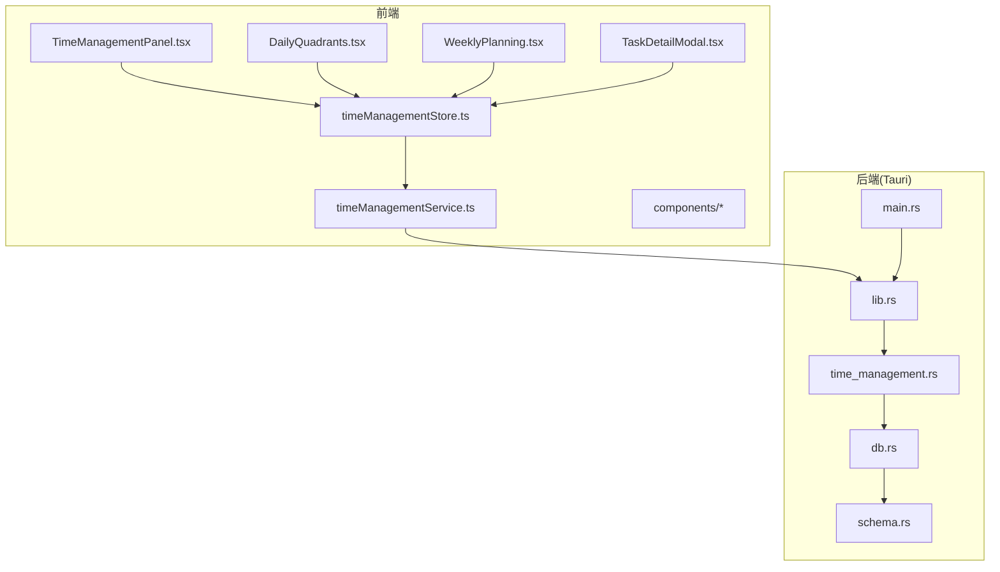
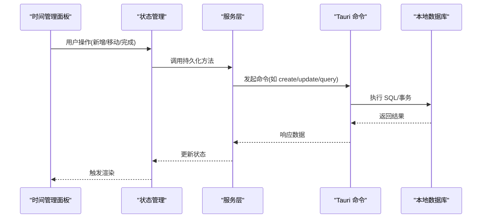
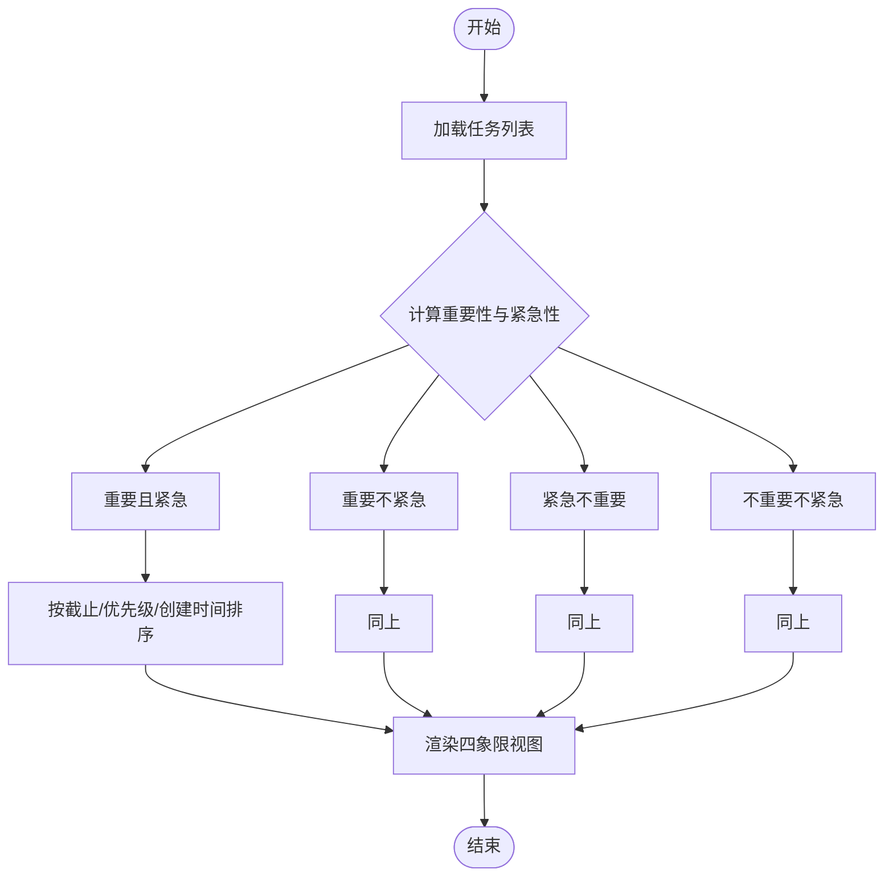
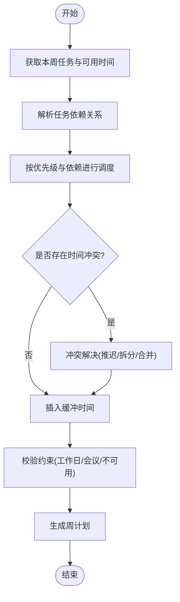
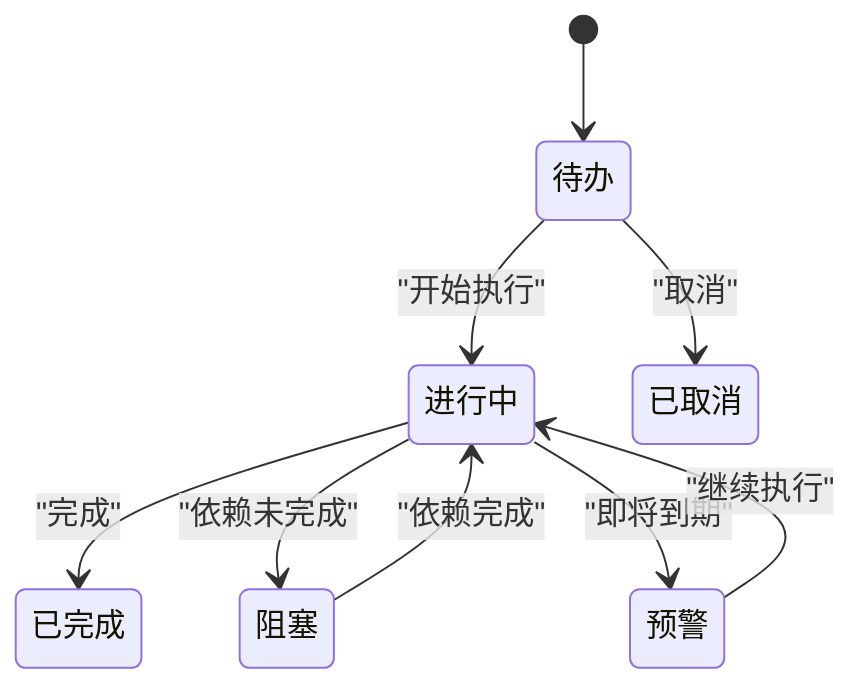
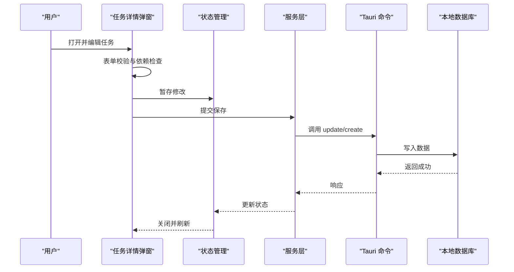
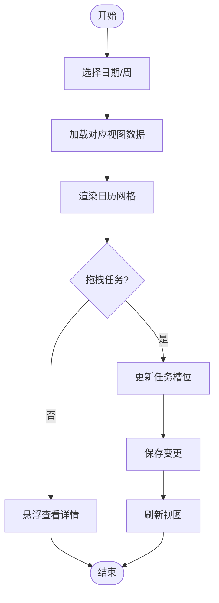
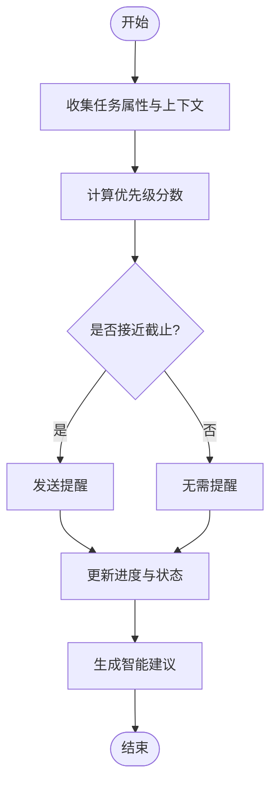
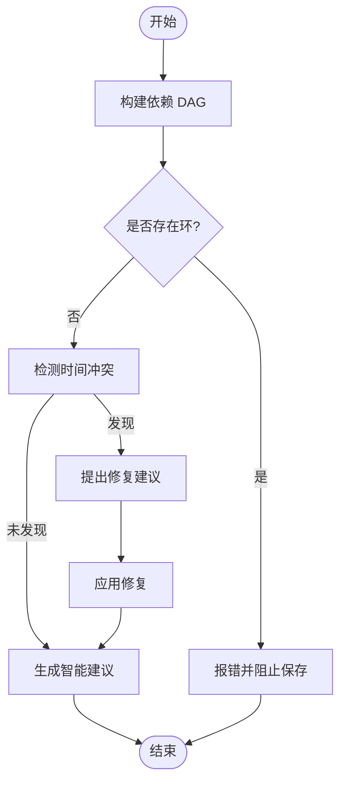
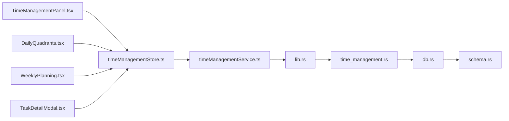

# 时间管理系统

<cite>
**本文引用的文件**   
- [TimeManagementPanel.tsx](file://src/features/time-management/TimeManagementPanel.tsx)
- [DailyQuadrants.tsx](file://src/features/time-management/DailyQuadrants.tsx)
- [WeeklyPlanning.tsx](file://src/features/time-management/WeeklyPlanning.tsx)
- [TaskDetailModal.tsx](file://src/features/time-management/TaskDetailModal.tsx)
- [timeManagementStore.ts](file://src/features/time-management/timeManagementStore.ts)
- [timeManagementService.ts](file://src/features/time-management/timeManagementService.ts)
- [timeManagementTypes.ts](file://src/features/time-management/timeManagementTypes.ts)
- [DateTimePicker.tsx](file://src/features/time-management/components/DateTimePicker.tsx)
- [QuickAddPopover.tsx](file://src/features/time-management/components/QuickAddPopover.tsx)
- [CollapsibleGroup.tsx](file://src/features/time-management/components/CollapsibleGroup.tsx)
- [time_management.rs](file://src-tauri/src/time_management.rs)
- [db.rs](file://src-tauri/src/db.rs)
- [schema.rs](file://src-tauri/src/schema.rs)
- [lib.rs](file://src-tauri/src/lib.rs)
- [main.rs](file://src-tauri/src/main.rs)
- [Time_Management_API_Spec.md](file://docx/Time_Management_API_Spec.md)
- [Time_Management_UI_Update_PRD.md](file://docx/Time_Management_UI_Update_PRD.md)
- [Weekly_Planning_PRD.md](file://docx/Weekly_Planning_PRD.md)
- [Weekly_Planning_Frontend_API.md](file://docx/Weekly_Planning_Frontend_API.md)
</cite>

## 目录
1. [简介](#简介)
2. [项目结构](#项目结构)
3. [核心组件](#核心组件)
4. [架构总览](#架构总览)
5. [详细组件分析](#详细组件分析)
6. [依赖关系分析](#依赖关系分析)
7. [性能考虑](#性能考虑)
8. [故障排查指南](#故障排查指南)
9. [结论](#结论)
10. [附录](#附录)

## 简介
本技术文档围绕“时间管理系统”展开，聚焦四象限时间管理法的算法实现、周计划生成逻辑与任务状态管理机制。文档同时覆盖前端面板布局设计、日历交互与数据可视化方案，并深入说明任务优先级计算、截止日期提醒、进度跟踪、任务依赖关系、时间冲突检测与智能建议生成等复杂业务规则。最后提供扩展开发接口与自定义工作流的方法，帮助开发者快速集成与二次开发。

## 项目结构
系统采用前后端分离的桌面应用架构：
- 前端（React + TypeScript）：位于 src/features/time-management 下，包含面板、组件、状态管理与服务层。
- 后端（Tauri + Rust）：位于 src-tauri/src 下，提供本地数据库访问与能力暴露。
- 文档：docx 目录下包含 API 规范、PRD 与前端对接文档。

图表来源
- [TimeManagementPanel.tsx](file://src/features/time-management/TimeManagementPanel.tsx)
- [DailyQuadrants.tsx](file://src/features/time-management/DailyQuadrants.tsx)
- [WeeklyPlanning.tsx](file://src/features/time-management/WeeklyPlanning.tsx)
- [TaskDetailModal.tsx](file://src/features/time-management/TaskDetailModal.tsx)
- [timeManagementStore.ts](file://src/features/time-management/timeManagementStore.ts)
- [timeManagementService.ts](file://src/features/time-management/timeManagementService.ts)
- [lib.rs](file://src-tauri/src/lib.rs)
- [time_management.rs](file://src-tauri/src/time_management.rs)
- [db.rs](file://src-tauri/src/db.rs)
- [schema.rs](file://src-tauri/src/schema.rs)
- [main.rs](file://src-tauri/src/main.rs)

章节来源
- [TimeManagementPanel.tsx](file://src/features/time-management/TimeManagementPanel.tsx)
- [timeManagementStore.ts](file://src/features/time-management/timeManagementStore.ts)
- [timeManagementService.ts](file://src/features/time-management/timeManagementService.ts)
- [lib.rs](file://src-tauri/src/lib.rs)
- [time_management.rs](file://src-tauri/src/time_management.rs)
- [db.rs](file://src-tauri/src/db.rs)
- [schema.rs](file://src-tauri/src/schema.rs)
- [main.rs](file://src-tauri/src/main.rs)

## 核心组件
- 时间管理面板：作为入口容器，组织四象限视图、周计划入口、任务详情弹窗与快捷添加。
- 四象限视图：按重要性与紧急性将任务分组展示，支持拖拽排序与批量操作。
- 周计划：按周维度规划任务，自动对齐到工作日，支持冲突检测与智能建议。
- 任务详情弹窗：编辑任务属性（标题、描述、优先级、起止时间、依赖、标签等），触发校验与保存。
- 状态管理：集中维护任务集合、视图状态、选择态与撤销重做栈。
- 服务层：封装与 Tauri 后端的通信，负责持久化与查询。
- 日期时间选择器：统一的时间输入控件，支持时区与格式化处理。
- 快捷添加气泡：快速创建任务并自动归类到合适象限或日程。
- 可折叠分组：在四象限中按标签/项目分组，提升信息密度与可读性。

章节来源
- [TimeManagementPanel.tsx](file://src/features/time-management/TimeManagementPanel.tsx)
- [DailyQuadrants.tsx](file://src/features/time-management/DailyQuadrants.tsx)
- [WeeklyPlanning.tsx](file://src/features/time-management/WeeklyPlanning.tsx)
- [TaskDetailModal.tsx](file://src/features/time-management/TaskDetailModal.tsx)
- [timeManagementStore.ts](file://src/features/time-management/timeManagementStore.ts)
- [timeManagementService.ts](file://src/features/time-management/timeManagementService.ts)
- [DateTimePicker.tsx](file://src/features/time-management/components/DateTimePicker.tsx)
- [QuickAddPopover.tsx](file://src/features/time-management/components/QuickAddPopover.tsx)
- [CollapsibleGroup.tsx](file://src/features/time-management/components/CollapsibleGroup.tsx)

## 架构总览
系统遵循“UI -> Store -> Service -> Tauri -> DB”的分层架构，确保职责清晰、可测试与可扩展。

图表来源
- [TimeManagementPanel.tsx](file://src/features/time-management/TimeManagementPanel.tsx)
- [timeManagementStore.ts](file://src/features/time-management/timeManagementStore.ts)
- [timeManagementService.ts](file://src/features/time-management/timeManagementService.ts)
- [lib.rs](file://src-tauri/src/lib.rs)
- [time_management.rs](file://src-tauri/src/time_management.rs)
- [db.rs](file://src-tauri/src/db.rs)
- [schema.rs](file://src-tauri/src/schema.rs)

## 详细组件分析

### 四象限时间管理算法
- 分类依据：重要性（高/低）与紧急性（高/低）组合为四个象限。
- 排序策略：同象限内按截止时间升序；若截止相同，则按优先级降序；再按创建时间倒序。
- 动态调整：当任务属性变更（如截止时间、优先级）时，实时重新计算所属象限与顺序。
- 边界处理：未设置截止时间的任务默认归入“重要不紧急”，并可配置为“待排期”。

图表来源
- [DailyQuadrants.tsx](file://src/features/time-management/DailyQuadrants.tsx)
- [timeManagementStore.ts](file://src/features/time-management/timeManagementStore.ts)
- [timeManagementTypes.ts](file://src/features/time-management/timeManagementTypes.ts)

章节来源
- [DailyQuadrants.tsx](file://src/features/time-management/DailyQuadrants.tsx)
- [timeManagementStore.ts](file://src/features/time-management/timeManagementStore.ts)
- [timeManagementTypes.ts](file://src/features/time-management/timeManagementTypes.ts)

### 周计划生成逻辑
- 输入：本周任务池、个人可用时间段、历史完成率与平均耗时。
- 约束：工作日范围、会议占位、不可用时段、任务依赖关系。
- 优化目标：最大化完成概率、最小化冲突、平衡负载。
- 输出：每日任务块（含起止时间、预估时长、缓冲时间）。

图表来源
- [WeeklyPlanning.tsx](file://src/features/time-management/WeeklyPlanning.tsx)
- [timeManagementStore.ts](file://src/features/time-management/timeManagementStore.ts)
- [Weekly_Planning_PRD.md](file://docx/Weekly_Planning_PRD.md)
- [Weekly_Planning_Frontend_API.md](file://docx/Weekly_Planning_Frontend_API.md)

章节来源
- [WeeklyPlanning.tsx](file://src/features/time-management/WeeklyPlanning.tsx)
- [Weekly_Planning_PRD.md](file://docx/Weekly_Planning_PRD.md)
- [Weekly_Planning_Frontend_API.md](file://docx/Weekly_Planning_Frontend_API.md)

### 任务状态管理机制
- 状态定义：待办、进行中、已完成、已取消、阻塞（依赖未完成）、预警（即将到期）。
- 状态转换：由用户操作或服务侧规则驱动，需满足前置条件（如依赖完成）。
- 事件通知：状态变更后广播事件，触发界面刷新与提醒。
- 审计记录：记录关键状态变更时间与原因，便于复盘。

图表来源
- [timeManagementTypes.ts](file://src/features/time-management/timeManagementTypes.ts)
- [timeManagementStore.ts](file://src/features/time-management/timeManagementStore.ts)

章节来源
- [timeManagementTypes.ts](file://src/features/time-management/timeManagementTypes.ts)
- [timeManagementStore.ts](file://src/features/time-management/timeManagementStore.ts)

### 任务详情弹窗与交互
- 功能：编辑任务元数据、设置起止时间、选择依赖、标记标签、备注。
- 校验：必填字段、时间区间合法性、依赖无环、冲突提示。
- 保存：提交至服务层，进入事务写入，成功后更新状态并刷新视图。

图表来源
- [TaskDetailModal.tsx](file://src/features/time-management/TaskDetailModal.tsx)
- [timeManagementStore.ts](file://src/features/time-management/timeManagementStore.ts)
- [timeManagementService.ts](file://src/features/time-management/timeManagementService.ts)
- [lib.rs](file://src-tauri/src/lib.rs)
- [time_management.rs](file://src-tauri/src/time_management.rs)
- [db.rs](file://src-tauri/src/db.rs)

章节来源
- [TaskDetailModal.tsx](file://src/features/time-management/TaskDetailModal.tsx)
- [timeManagementStore.ts](file://src/features/time-management/timeManagementStore.ts)
- [timeManagementService.ts](file://src/features/time-management/timeManagementService.ts)

### 日历组件与数据可视化
- 日历交互：点击日期跳转日视图、拖拽任务到日期、双击创建任务。
- 数据可视化：甘特条显示任务时长与重叠，颜色区分象限与状态，悬浮提示详细信息。
- 性能优化：虚拟滚动、增量更新、防抖搜索与过滤。

图表来源
- [WeeklyPlanning.tsx](file://src/features/time-management/WeeklyPlanning.tsx)
- [DailyQuadrants.tsx](file://src/features/time-management/DailyQuadrants.tsx)
- [timeManagementStore.ts](file://src/features/time-management/timeManagementStore.ts)

章节来源
- [WeeklyPlanning.tsx](file://src/features/time-management/WeeklyPlanning.tsx)
- [DailyQuadrants.tsx](file://src/features/time-management/DailyQuadrants.tsx)
- [timeManagementStore.ts](file://src/features/time-management/timeManagementStore.ts)

### 优先级计算与截止日期提醒
- 优先级计算：综合截止时间紧迫度、任务重要性、依赖深度与历史完成率，得出动态优先级分数。
- 截止日期提醒：基于当前时间与截止阈值（如 24h、7d）触发提醒，支持静默模式与免打扰时段。
- 进度跟踪：根据子任务完成比例与时间投入估算整体进度，异常波动时给出建议。

图表来源
- [timeManagementStore.ts](file://src/features/time-management/timeManagementStore.ts)
- [timeManagementTypes.ts](file://src/features/time-management/timeManagementTypes.ts)

章节来源
- [timeManagementStore.ts](file://src/features/time-management/timeManagementStore.ts)
- [timeManagementTypes.ts](file://src/features/time-management/timeManagementTypes.ts)

### 复杂业务规则：依赖关系、冲突检测与智能建议
- 依赖关系：有向无环图（DAG）建模，禁止循环依赖；依赖完成后自动解锁前置阻塞任务。
- 冲突检测：同一时间段内多任务重叠时，提示冲突并提供解决方案（延后、拆分、合并）。
- 智能建议：基于历史数据与当前负载，推荐最佳执行顺序与时间块分配。

图表来源
- [WeeklyPlanning.tsx](file://src/features/time-management/WeeklyPlanning.tsx)
- [timeManagementStore.ts](file://src/features/time-management/timeManagementStore.ts)
- [timeManagementTypes.ts](file://src/features/time-management/timeManagementTypes.ts)

章节来源
- [WeeklyPlanning.tsx](file://src/features/time-management/WeeklyPlanning.tsx)
- [timeManagementStore.ts](file://src/features/time-management/timeManagementStore.ts)
- [timeManagementTypes.ts](file://src/features/time-management/timeManagementTypes.ts)

### 扩展开发接口与自定义工作流
- 插件钩子：在任务保存前/后、状态变更前后、周计划生成前后注入自定义逻辑。
- 规则引擎：通过配置化规则表（优先级权重、提醒阈值、冲突容忍度）实现行为定制。
- 工作流编排：以事件驱动串联多个步骤（校验、计算、通知、持久化），支持重试与回滚。
- 扩展点示例：
  - 自定义优先级公式：替换默认评分函数。
  - 自定义提醒渠道：邮件、消息推送、系统通知。
  - 自定义冲突策略：自动延后、并行执行、资源抢占。

章节来源
- [timeManagementStore.ts](file://src/features/time-management/timeManagementStore.ts)
- [timeManagementService.ts](file://src/features/time-management/timeManagementService.ts)
- [Time_Management_API_Spec.md](file://docx/Time_Management_API_Spec.md)

## 依赖关系分析
前端模块间耦合度较低，主要依赖集中在状态管理与服务层；后端通过 Tauri 命令暴露能力，数据库访问被隔离在 db.rs 与 schema.rs 中。

图表来源
- [TimeManagementPanel.tsx](file://src/features/time-management/TimeManagementPanel.tsx)
- [DailyQuadrants.tsx](file://src/features/time-management/DailyQuadrants.tsx)
- [WeeklyPlanning.tsx](file://src/features/time-management/WeeklyPlanning.tsx)
- [TaskDetailModal.tsx](file://src/features/time-management/TaskDetailModal.tsx)
- [timeManagementStore.ts](file://src/features/time-management/timeManagementStore.ts)
- [timeManagementService.ts](file://src/features/time-management/timeManagementService.ts)
- [lib.rs](file://src-tauri/src/lib.rs)
- [time_management.rs](file://src-tauri/src/time_management.rs)
- [db.rs](file://src-tauri/src/db.rs)
- [schema.rs](file://src-tauri/src/schema.rs)

章节来源
- [TimeManagementPanel.tsx](file://src/features/time-management/TimeManagementPanel.tsx)
- [timeManagementStore.ts](file://src/features/time-management/timeManagementStore.ts)
- [timeManagementService.ts](file://src/features/time-management/timeManagementService.ts)
- [lib.rs](file://src-tauri/src/lib.rs)
- [time_management.rs](file://src-tauri/src/time_management.rs)
- [db.rs](file://src-tauri/src/db.rs)
- [schema.rs](file://src-tauri/src/schema.rs)

## 性能考虑
- 前端渲染：对长列表使用虚拟滚动与增量更新，避免全量重绘。
- 状态管理：减少不必要的订阅，按需派生数据，合并多次更新为一次批处理。
- 后端查询：合理使用索引与分页，避免大事务；对热点数据引入内存缓存。
- 网络与进程间通信：批量命令、去抖动与节流，降低 Tauri 调用开销。

[本节为通用指导，不涉及具体文件分析]

## 故障排查指南
- 常见问题：
  - 任务无法保存：检查表单校验与依赖环检测日志。
  - 周计划冲突频繁：查看冲突检测策略与缓冲时间配置。
  - 提醒未触发：确认阈值设置与免打扰时段。
- 定位方法：
  - 前端：控制台错误堆栈与状态快照。
  - 后端：Tauri 命令日志与数据库事务日志。
- 恢复策略：
  - 回滚最近变更、重置冲突策略、清理无效依赖。

章节来源
- [TaskDetailModal.tsx](file://src/features/time-management/TaskDetailModal.tsx)
- [WeeklyPlanning.tsx](file://src/features/time-management/WeeklyPlanning.tsx)
- [timeManagementStore.ts](file://src/features/time-management/timeManagementStore.ts)
- [timeManagementService.ts](file://src/features/time-management/timeManagementService.ts)
- [time_management.rs](file://src-tauri/src/time_management.rs)
- [db.rs](file://src-tauri/src/db.rs)

## 结论
本系统以清晰的层次结构与模块化设计实现了四象限时间管理、周计划生成与任务状态管理。通过依赖关系建模、冲突检测与智能建议，提升了计划的可行性与执行效率。扩展接口与规则引擎为个性化工作流提供了灵活支撑。建议在后续迭代中持续优化性能与用户体验，完善监控与诊断能力。

[本节为总结，不涉及具体文件分析]

## 附录
- 相关文档：
  - [Time_Management_API_Spec.md](file://docx/Time_Management_API_Spec.md)
  - [Time_Management_UI_Update_PRD.md](file://docx/Time_Management_UI_Update_PRD.md)
  - [Weekly_Planning_PRD.md](file://docx/Weekly_Planning_PRD.md)
  - [Weekly_Planning_Frontend_API.md](file://docx/Weekly_Planning_Frontend_API.md)

章节来源
- [Time_Management_API_Spec.md](file://docx/Time_Management_API_Spec.md)
- [Time_Management_UI_Update_PRD.md](file://docx/Time_Management_UI_Update_PRD.md)
- [Weekly_Planning_PRD.md](file://docx/Weekly_Planning_PRD.md)
- [Weekly_Planning_Frontend_API.md](file://docx/Weekly_Planning_Frontend_API.md)