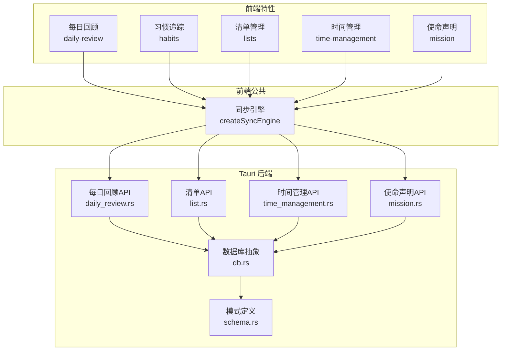
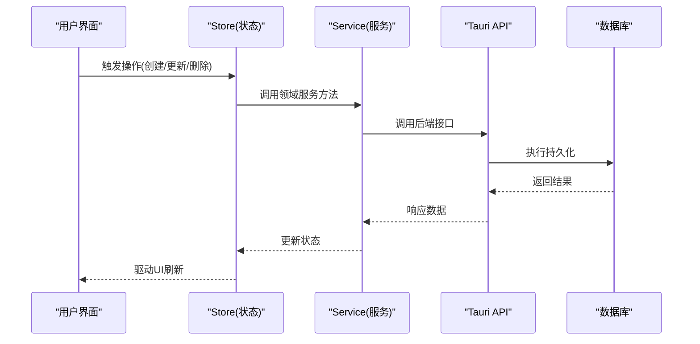
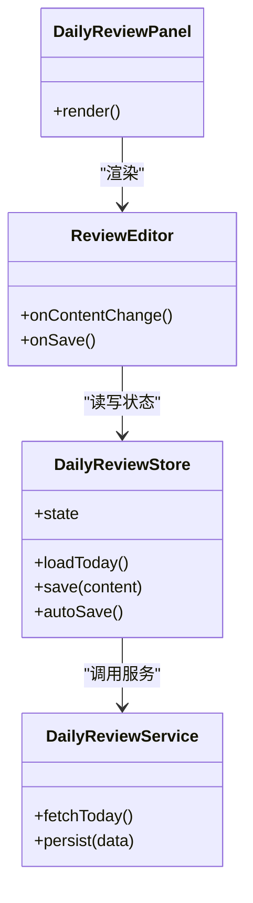
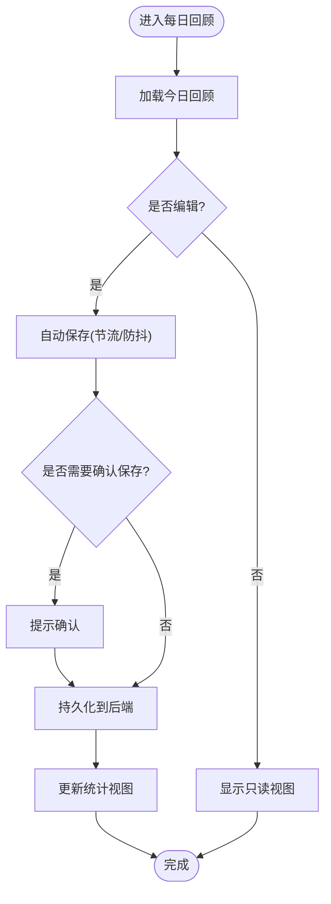
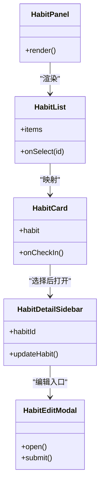
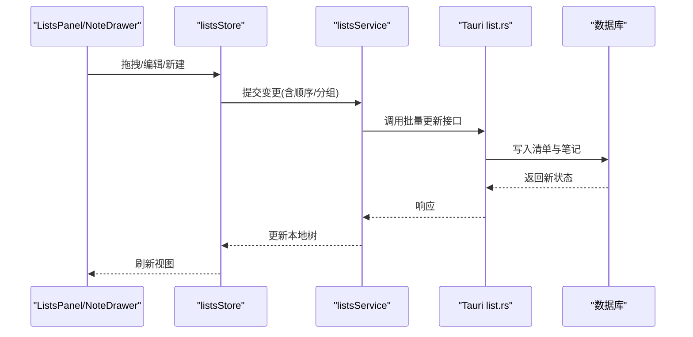
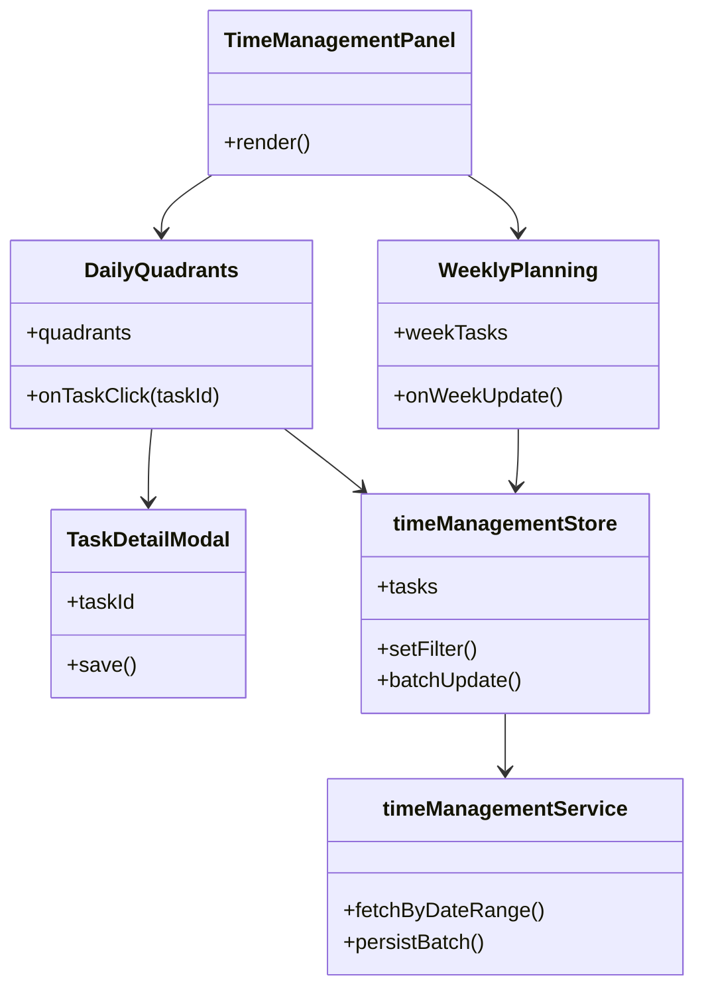
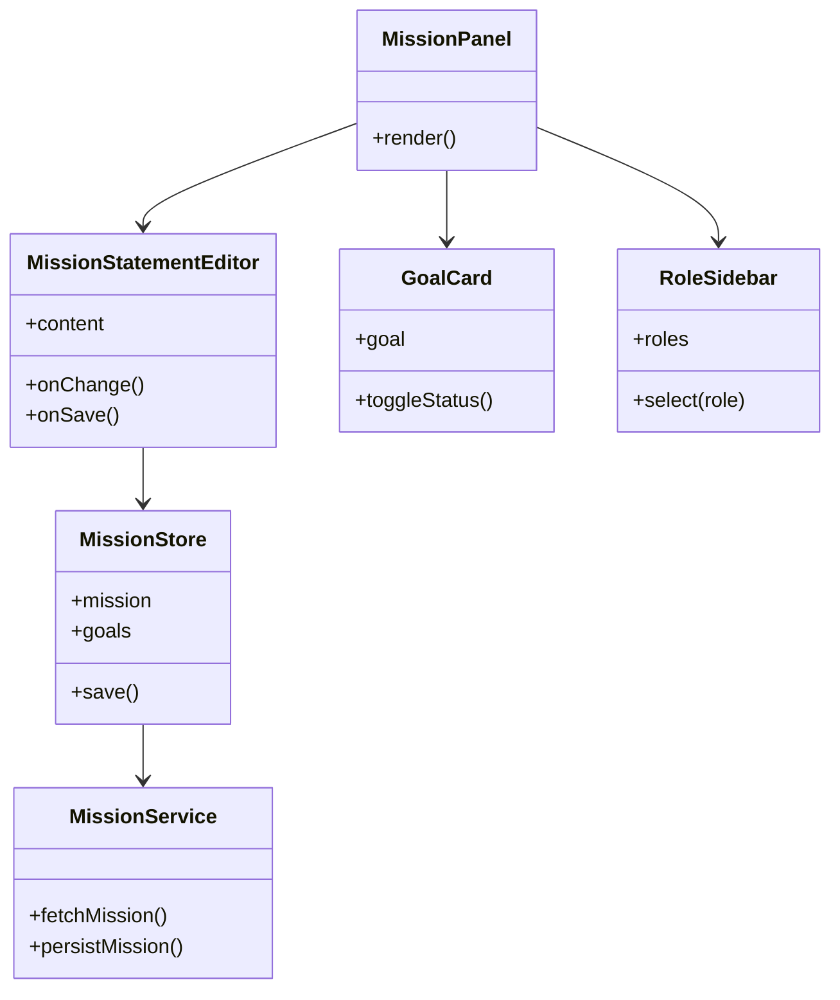
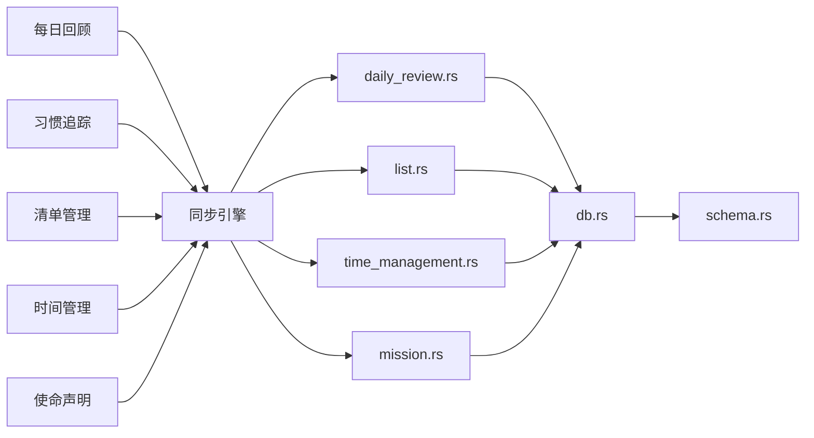

# 核心功能模块

<cite>
**本文引用的文件**   
- [src/features/daily-review/DailyReviewPanel.tsx](file://src/features/daily-review/DailyReviewPanel.tsx)
- [src/features/daily-review/ReviewEditor.tsx](file://src/features/daily-review/ReviewEditor.tsx)
- [src/features/daily-review/dailyReviewStore.ts](file://src/features/daily-review/dailyReviewStore.ts)
- [src/features/daily-review/dailyReviewService.ts](file://src/features/daily-review/dailyReviewService.ts)
- [src/features/daily-review/dailyReviewTypes.ts](file://src/features/daily-review/dailyReviewTypes.ts)
- [src/features/daily-review/useReviewAutoSave.ts](file://src/features/daily-review/useReviewAuto保存.ts)
- [src/features/habits/HabitPanel.tsx](file://src/features/habits/HabitPanel.tsx)
- [src/features/habits/components/HabitCard.tsx](file://src/features/habits/components/HabitCard.tsx)
- [src/features/habits/components/HabitDetailSidebar.tsx](file://src/features/habits/components/HabitDetailSidebar.tsx)
- [src/features/habits/components/HabitEditModal.tsx](file://src/features/habits/components/HabitEditModal.tsx)
- [src/features/habits/components/HabitList.tsx](file://src/features/habits/components/HabitList.tsx)
- [src/features/habits/habitTypes.ts](file://src/features/habits/habitTypes.ts)
- [src/features/lists/ListsPanel.tsx](file://src/features/lists/ListsPanel.tsx)
- [src/features/lists/NoteDrawer.tsx](file://src/features/lists/NoteDrawer.tsx)
- [src/features/lists/NoteItem.tsx](file://src/features/lists/NoteItem.tsx)
- [src/features/lists/NoteGroupView.tsx](file://src/features/lists/NoteGroupView.tsx)
- [src/features/lists/listsStore.ts](file://src/features/lists/listsStore.ts)
- [src/features/lists/listsService.ts](file://src/features/lists/listsService.ts)
- [src/features/lists/listsTypes.ts](file://src/features/lists/listsTypes.ts)
- [src/features/lists/listsReorder.ts](file://src/features/lists/listsReorder.ts)
- [src/features/time-management/TimeManagementPanel.tsx](file://src/features/time-management/TimeManagementPanel.tsx)
- [src/features/time-management/DailyQuadrants.tsx](file://src/features/time-management/DailyQuadrants.tsx)
- [src/features/time-management/WeeklyPlanning.tsx](file://src/features/time-management/WeeklyPlanning.tsx)
- [src/features/time-management/TaskDetailModal.tsx](file://src/features/time-management/TaskDetailModal.tsx)
- [src/features/time-management/timeManagementStore.ts](file://src/features/time-management/timeManagementStore.ts)
- [src/features/time-management/timeManagementService.ts](file://src/features/time-management/timeManagementService.ts)
- [src/features/time-management/timeManagementTypes.ts](file://src/features/time-management/timeManagementTypes.ts)
- [src/features/mission/MissionPanel.tsx](file://src/features/mission/MissionPanel.tsx)
- [src/features/mission/MissionStatementEditor.tsx](file://src/features/mission/MissionStatementEditor.tsx)
- [src/features/mission/MissionStore.ts](file://src/features/mission/MissionStore.ts)
- [src/features/mission/MissionService.ts](file://src/features/mission/MissionService.ts)
- [src/features/mission/MissionTypes.ts](file://src/features/mission/MissionTypes.ts)
- [src/features/mission/GoalCard.tsx](file://src/features/mission/GoalCard.tsx)
- [src/features/mission/RoleSidebar.tsx](file://src/features/mission/RoleSidebar.tsx)
- [src/lib/createSyncEngine.ts](file://src/lib/createSyncEngine.ts)
- [src-tauri/src/db.rs](file://src-tauri/src/db.rs)
- [src-tauri/src/daily_review.rs](file://src-tauri/src/daily_review.rs)
- [src-tauri/src/list.rs](file://src-tauri/src/list.rs)
- [src-tauri/src/time_management.rs](file://src-tauri/src/time_management.rs)
- [src-tauri/src/mission.rs](file://src-tauri/src/mission.rs)
- [src-tauri/src/schema.rs](file://src-tauri/src/schema.rs)
</cite>

## 目录
1. [简介](#简介)
2. [项目结构](#项目结构)
3. [核心组件](#核心组件)
4. [架构总览](#架构总览)
5. [详细组件分析](#详细组件分析)
6. [依赖关系分析](#依赖关系分析)
7. [性能考虑](#性能考虑)
8. [故障排除指南](#故障排除指南)
9. [结论](#结论)
10. [附录](#附录)

## 简介
本文件聚焦 FishWorker 的核心功能模块，覆盖每日回顾、习惯追踪、清单管理、时间管理与使命声明五大模块。文档从业务逻辑、数据模型、用户交互流程、模块间依赖与数据共享机制、配置与扩展点、使用示例与最佳实践、常见问题与排障等方面展开，帮助读者快速理解并高效使用这些能力。

## 项目结构
FishWorker 采用前端 React + Tauri 后端（Rust）的混合架构：
- 前端以“特性”为边界组织代码，每个功能模块位于 src/features/<feature>/ 下，包含 UI 组件、状态存储、服务层与类型定义。
- 后端通过 Tauri 暴露 API，封装数据库访问与持久化逻辑，对应 Rust 源文件位于 src-tauri/src/。
- 公共能力如同步引擎位于 src/lib/，供多模块复用。

图表来源
- [src/lib/createSyncEngine.ts](file://src/lib/createSyncEngine.ts)
- [src-tauri/src/daily_review.rs](file://src-tauri/src/daily_review.rs)
- [src-tauri/src/list.rs](file://src-tauri/src/list.rs)
- [src-tauri/src/time_management.rs](file://src-tauri/src/time_management.rs)
- [src-tauri/src/mission.rs](file://src-tauri/src/mission.rs)
- [src-tauri/src/db.rs](file://src-tauri/src/db.rs)
- [src-tauri/src/schema.rs](file://src-tauri/src/schema.rs)

章节来源
- [src/features/daily-review/DailyReviewPanel.tsx](file://src/features/daily-review/DailyReviewPanel.tsx)
- [src/features/habits/HabitPanel.tsx](file://src/features/habits/HabitPanel.tsx)
- [src/features/lists/ListsPanel.tsx](file://src/features/lists/ListsPanel.tsx)
- [src/features/time-management/TimeManagementPanel.tsx](file://src/features/time-management/TimeManagementPanel.tsx)
- [src/features/mission/MissionPanel.tsx](file://src/features/mission/MissionPanel.tsx)
- [src/lib/createSyncEngine.ts](file://src/lib/createSyncEngine.ts)
- [src-tauri/src/db.rs](file://src-tauri/src/db.rs)
- [src-tauri/src/schema.rs](file://src-tauri/src/schema.rs)

## 核心组件
本节概述各模块的前端入口面板与其职责：
- 每日回顾：提供回顾编辑与自动保存，聚合统计展示。
- 习惯追踪：习惯列表、卡片、详情侧边栏与编辑弹窗。
- 清单管理：分组视图、笔记抽屉、拖拽排序与服务/存储。
- 时间管理：四象限日程、周计划、任务详情弹窗与状态管理。
- 使命声明：使命编辑器、目标卡片、角色侧边栏与持久化。

章节来源
- [src/features/daily-review/DailyReviewPanel.tsx](file://src/features/daily-review/DailyReviewPanel.tsx)
- [src/features/habits/HabitPanel.tsx](file://src/features/habits/HabitPanel.tsx)
- [src/features/lists/ListsPanel.tsx](file://src/features/lists/ListsPanel.tsx)
- [src/features/time-management/TimeManagementPanel.tsx](file://src/features/time-management/TimeManagementPanel.tsx)
- [src/features/mission/MissionPanel.tsx](file://src/features/mission/MissionPanel.tsx)

## 架构总览
整体数据流遵循“UI -> Store -> Service -> Tauri API -> 数据库”的分层模式，并通过同步引擎在前后端之间进行可靠的数据交换。

图表来源
- [src/lib/createSyncEngine.ts](file://src/lib/createSyncEngine.ts)
- [src-tauri/src/db.rs](file://src-tauri/src/db.rs)

## 详细组件分析

### 每日回顾
- 业务逻辑
  - 支持按日维度记录回顾内容，具备自动保存与手动保存能力。
  - 提供复合统计视图，辅助复盘与趋势观察。
- 数据模型
  - 回顾条目包含日期、内容、元数据等字段；类型定义集中于类型文件。
- 用户交互
  - 打开面板后加载当日回顾，编辑时自动保存，提交前可预览或校验。
- 关键实现要点
  - Store 负责本地状态与变更派发。
  - Service 封装对 Tauri 的调用与错误处理。
  - 自动保存 Hook 基于输入变化节流/防抖策略。
- 配置与扩展
  - 可通过 Hook 参数调整自动保存延迟与去抖策略。
  - 可在 Service 中注入自定义持久化策略（例如合并远程同步）。

图表来源
- [src/features/daily-review/dailyReviewStore.ts](file://src/features/daily-review/dailyReviewStore.ts)
- [src/features/daily-review/dailyReviewService.ts](file://src/features/daily-review/dailyReviewService.ts)
- [src/features/daily-review/ReviewEditor.tsx](file://src/features/daily-review/ReviewEditor.tsx)
- [src/features/daily-review/DailyReviewPanel.tsx](file://src/features/daily-review/DailyReviewPanel.tsx)

图表来源
- [src/features/daily-review/useReviewAutoSave.ts](file://src/features/daily-review/useReviewAuto保存.ts)
- [src/features/daily-review/dailyReviewStore.ts](file://src/features/daily-review/dailyReviewStore.ts)

章节来源
- [src/features/daily-review/DailyReviewPanel.tsx](file://src/features/daily-review/DailyReviewPanel.tsx)
- [src/features/daily-review/ReviewEditor.tsx](file://src/features/daily-review/ReviewEditor.tsx)
- [src/features/daily-review/dailyReviewStore.ts](file://src/features/daily-review/dailyReviewStore.ts)
- [src/features/daily-review/dailyReviewService.ts](file://src/features/daily-review/dailyReviewService.ts)
- [src/features/daily-review/dailyReviewTypes.ts](file://src/features/daily-review/dailyReviewTypes.ts)
- [src/features/daily-review/useReviewAutoSave.ts](file://src/features/daily-review/useReviewAuto保存.ts)
- [src-tauri/src/daily_review.rs](file://src-tauri/src/daily_review.rs)

### 习惯追踪
- 业务逻辑
  - 维护习惯集合，支持打卡、查看历史、编辑习惯属性。
- 数据模型
  - 习惯实体包含名称、周期、最近打卡记录等；类型定义集中管理。
- 用户交互
  - 列表页展示所有习惯，点击卡片进入详情侧边栏，支持新增/编辑弹窗。
- 关键实现要点
  - HabitPanel 作为容器协调子组件。
  - HabitList/HabitCard 负责展示与交互事件。
  - HabitDetailSidebar 承载详情与快捷操作。
  - HabitEditModal 负责表单校验与提交。
- 配置与扩展
  - 可替换默认统计口径或导出格式。
  - 可在 Service 层接入外部提醒或日历集成。

图表来源
- [src/features/habits/HabitPanel.tsx](file://src/features/habits/HabitPanel.tsx)
- [src/features/habits/components/HabitList.tsx](file://src/features/habits/components/HabitList.tsx)
- [src/features/habits/components/HabitCard.tsx](file://src/features/habits/components/HabitCard.tsx)
- [src/features/habits/components/HabitDetailSidebar.tsx](file://src/features/habits/components/HabitDetailSidebar.tsx)
- [src/features/habits/components/HabitEditModal.tsx](file://src/features/habits/components/HabitEditModal.tsx)
- [src/features/habits/habitTypes.ts](file://src/features/habits/habitTypes.ts)

章节来源
- [src/features/habits/HabitPanel.tsx](file://src/features/habits/HabitPanel.tsx)
- [src/features/habits/components/HabitList.tsx](file://src/features/habits/components/HabitList.tsx)
- [src/features/habits/components/HabitCard.tsx](file://src/features/habits/components/HabitCard.tsx)
- [src/features/habits/components/HabitDetailSidebar.tsx](file://src/features/habits/components/HabitDetailSidebar.tsx)
- [src/features/habits/components/HabitEditModal.tsx](file://src/features/habits/components/HabitEditModal.tsx)
- [src/features/habits/habitTypes.ts](file://src/features/habits/habitTypes.ts)

### 清单管理
- 业务逻辑
  - 支持文件夹/分组、笔记项增删改查、拖拽排序、批量导出等。
- 数据模型
  - 清单与笔记项存在层级关系，包含标题、内容、顺序、分组标识等。
- 用户交互
  - ListsPanel 为主容器，左侧导航，右侧分组视图与笔记抽屉。
  - NoteDrawer 承载富文本编辑与工具栏。
  - SortableItem 与 listsReorder 协作完成拖拽重排。
- 关键实现要点
  - listsStore 管理清单树结构与选中态。
  - listsService 封装 Tauri 调用与事务性更新。
  - listsReorder 计算最小移动序列，保证一致性。
- 配置与扩展
  - 可自定义导出模板与导入解析器。
  - 可在 Service 层增加版本冲突解决策略。

图表来源
- [src/features/lists/ListsPanel.tsx](file://src/features/lists/ListsPanel.tsx)
- [src/features/lists/NoteDrawer.tsx](file://src/features/lists/NoteDrawer.tsx)
- [src/features/lists/NoteItem.tsx](file://src/features/lists/NoteItem.tsx)
- [src/features/lists/NoteGroupView.tsx](file://src/features/lists/NoteGroupView.tsx)
- [src/features/lists/listsStore.ts](file://src/features/lists/listsStore.ts)
- [src/features/lists/listsService.ts](file://src/features/lists/listsService.ts)
- [src/features/lists/listsReorder.ts](file://src/features/lists/listsReorder.ts)
- [src-tauri/src/list.rs](file://src-tauri/src/list.rs)

章节来源
- [src/features/lists/ListsPanel.tsx](file://src/features/lists/ListsPanel.tsx)
- [src/features/lists/NoteDrawer.tsx](file://src/features/lists/NoteDrawer.tsx)
- [src/features/lists/NoteItem.tsx](file://src/features/lists/NoteItem.tsx)
- [src/features/lists/NoteGroupView.tsx](file://src/features/lists/NoteGroupView.tsx)
- [src/features/lists/listsStore.ts](file://src/features/lists/listsStore.ts)
- [src/features/lists/listsService.ts](file://src/features/lists/listsService.ts)
- [src/features/lists/listsTypes.ts](file://src/features/lists/listsTypes.ts)
- [src/features/lists/listsReorder.ts](file://src/features/lists/listsReorder.ts)
- [src-tauri/src/list.rs](file://src-tauri/src/list.rs)

### 时间管理
- 业务逻辑
  - 四象限法组织任务，支持按日/周规划、任务详情编辑、状态流转。
- 数据模型
  - 任务包含标题、描述、优先级、所属象限、计划时间、状态等。
- 用户交互
  - TimeManagementPanel 整合 DailyQuadrants 与 WeeklyPlanning。
  - TaskDetailModal 承载任务编辑与关联信息。
- 关键实现要点
  - timeManagementStore 维护任务集合与筛选/分组状态。
  - timeManagementService 封装 Tauri 调用与批量操作。
  - DailyQuadrants 根据当前日期与筛选条件渲染四象限。
- 配置与扩展
  - 可自定义周起始日、默认优先级、提醒策略。
  - 可在 Service 层对接日历或提醒系统。

图表来源
- [src/features/time-management/TimeManagementPanel.tsx](file://src/features/time-management/TimeManagementPanel.tsx)
- [src/features/time-management/DailyQuadrants.tsx](file://src/features/time-management/DailyQuadrants.tsx)
- [src/features/time-management/WeeklyPlanning.tsx](file://src/features/time-management/WeeklyPlanning.tsx)
- [src/features/time-management/TaskDetailModal.tsx](file://src/features/time-management/TaskDetailModal.tsx)
- [src/features/time-management/timeManagementStore.ts](file://src/features/time-management/timeManagementStore.ts)
- [src/features/time-management/timeManagementService.ts](file://src/features/time-management/timeManagementService.ts)
- [src/features/time-management/timeManagementTypes.ts](file://src/features/time-management/timeManagementTypes.ts)
- [src-tauri/src/time_management.rs](file://src-tauri/src/time_management.rs)

章节来源
- [src/features/time-management/TimeManagementPanel.tsx](file://src/features/time-management/TimeManagementPanel.tsx)
- [src/features/time-management/DailyQuadrants.tsx](file://src/features/time-management/DailyQuadrants.tsx)
- [src/features/time-management/WeeklyPlanning.tsx](file://src/features/time-management/WeeklyPlanning.tsx)
- [src/features/time-management/TaskDetailModal.tsx](file://src/features/time-management/TaskDetailModal.tsx)
- [src/features/time-management/timeManagementStore.ts](file://src/features/time-management/timeManagementStore.ts)
- [src/features/time-management/timeManagementService.ts](file://src/features/time-management/timeManagementService.ts)
- [src/features/time-management/timeManagementTypes.ts](file://src/features/time-management/timeManagementTypes.ts)
- [src-tauri/src/time_management.rs](file://src-tauri/src/time_management.rs)

### 使命声明
- 业务逻辑
  - 维护使命陈述、角色与目标体系，支持结构化编辑与可视化展示。
- 数据模型
  - 使命实体包含标题、正文、角色、目标列表、更新时间等。
- 用户交互
  - MissionPanel 作为主入口，MissionStatementEditor 承载富文本编辑。
  - GoalCard 与 RoleSidebar 分别展示目标与角色导航。
- 关键实现要点
  - MissionStore 管理使命与目标的本地状态。
  - MissionService 封装 Tauri 调用与版本控制。
- 配置与扩展
  - 可自定义编辑器工具栏与导出格式。
  - 可在 Service 层接入云端同步或审计日志。

图表来源
- [src/features/mission/MissionPanel.tsx](file://src/features/mission/MissionPanel.tsx)
- [src/features/mission/MissionStatementEditor.tsx](file://src/features/mission/MissionStatementEditor.tsx)
- [src/features/mission/MissionStore.ts](file://src/features/mission/MissionStore.ts)
- [src/features/mission/MissionService.ts](file://src/features/mission/MissionService.ts)
- [src/features/mission/MissionTypes.ts](file://src/features/mission/MissionTypes.ts)
- [src/features/mission/GoalCard.tsx](file://src/features/mission/GoalCard.tsx)
- [src/features/mission/RoleSidebar.tsx](file://src/features/mission/RoleSidebar.tsx)
- [src-tauri/src/mission.rs](file://src-tauri/src/mission.rs)

章节来源
- [src/features/mission/MissionPanel.tsx](file://src/features/mission/MissionPanel.tsx)
- [src/features/mission/MissionStatementEditor.tsx](file://src/features/mission/MissionStatementEditor.tsx)
- [src/features/mission/MissionStore.ts](file://src/features/mission/MissionStore.ts)
- [src/features/mission/MissionService.ts](file://src/features/mission/MissionService.ts)
- [src/features/mission/MissionTypes.ts](file://src/features/mission/MissionTypes.ts)
- [src/features/mission/GoalCard.tsx](file://src/features/mission/GoalCard.tsx)
- [src/features/mission/RoleSidebar.tsx](file://src/features/mission/RoleSidebar.tsx)
- [src-tauri/src/mission.rs](file://src-tauri/src/mission.rs)

## 依赖关系分析
- 模块内聚与耦合
  - 各特性模块内部高内聚，对外仅通过 Service 与 Tauri API 交互，降低耦合。
  - 跨模块共享较少，主要依赖公共同步引擎与数据库抽象。
- 直接/间接依赖
  - 前端 Store 依赖 Service；Service 依赖 Tauri API；API 依赖 db.rs 与 schema.rs。
- 外部依赖与集成点
  - Tauri 作为进程间通信桥接前端与后端。
  - 数据库模式由 schema.rs 统一约束，确保前后端数据结构一致。

图表来源
- [src/lib/createSyncEngine.ts](file://src/lib/createSyncEngine.ts)
- [src-tauri/src/daily_review.rs](file://src-tauri/src/daily_review.rs)
- [src-tauri/src/list.rs](file://src-tauri/src/list.rs)
- [src-tauri/src/time_management.rs](file://src-tauri/src/time_management.rs)
- [src-tauri/src/mission.rs](file://src-tauri/src/mission.rs)
- [src-tauri/src/db.rs](file://src-tauri/src/db.rs)
- [src-tauri/src/schema.rs](file://src-tauri/src/schema.rs)

章节来源
- [src/lib/createSyncEngine.ts](file://src/lib/createSyncEngine.ts)
- [src-tauri/src/db.rs](file://src-tauri/src/db.rs)
- [src-tauri/src/schema.rs](file://src-tauri/src/schema.rs)

## 性能考虑
- 自动保存与节流
  - 每日回顾的自动保存应结合输入频率进行节流/防抖，避免频繁写盘。
- 批量操作与事务
  - 清单与时间管理的批量更新建议在后端使用事务，减少中间状态不一致。
- 懒加载与分页
  - 对于大量清单或任务，建议在 Service 层引入分页与按需加载。
- 渲染优化
  - 大列表使用虚拟滚动或分组渲染，减少 DOM 节点数量。
- 缓存策略
  - 对不常变动的元数据（如角色、模板）在前端做短期缓存，提升首屏速度。

[本节为通用指导，无需特定文件引用]

## 故障排除指南
- 自动保存未生效
  - 检查自动保存 Hook 的参数配置与事件绑定是否正确。
  - 确认 Service 层持久化调用是否抛出异常或被吞掉。
- 拖拽排序错乱
  - 核对 listsReorder 的计算逻辑与后端返回的新顺序是否一致。
  - 检查并发编辑场景下的锁或版本号控制。
- 任务无法保存到四象限
  - 验证时间范围过滤与任务状态是否符合预期。
  - 检查 Tauri API 的错误码与消息定位问题。
- 使命编辑丢失内容
  - 确认编辑器内容变更事件是否被正确捕获与合并。
  - 检查持久化失败时的回滚与恢复机制。

章节来源
- [src/features/daily-review/useReviewAutoSave.ts](file://src/features/daily-review/useReviewAuto保存.ts)
- [src/features/lists/listsReorder.ts](file://src/features/lists/listsReorder.ts)
- [src/features/time-management/timeManagementStore.ts](file://src/features/time-management/timeManagementStore.ts)
- [src/features/mission/MissionStore.ts](file://src/features/mission/MissionStore.ts)

## 结论
FishWorker 的核心功能模块围绕“记录—组织—规划—反思”的主线构建，通过清晰的分层与稳定的同步机制，实现了良好的用户体验与可扩展性。建议在后续迭代中持续完善错误处理、性能优化与扩展点设计，以提升系统的健壮性与可维护性。

[本节为总结性内容，无需特定文件引用]

## 附录
- 使用示例与最佳实践
  - 每日回顾：开启自动保存，设置合理的节流间隔；定期查看统计视图以发现改进点。
  - 习惯追踪：为新习惯设定明确的可衡量指标；利用详情侧边栏记录上下文与反思。
  - 清单管理：合理划分分组与标签；使用拖拽排序保持工作流顺畅；定期导出备份。
  - 时间管理：坚持四象限分类；每周回顾任务完成情况并调整优先级。
  - 使命声明：将长期目标拆解为可执行的小目标；定期审视使命与角色的匹配度。

[本节为通用指导，无需特定文件引用]