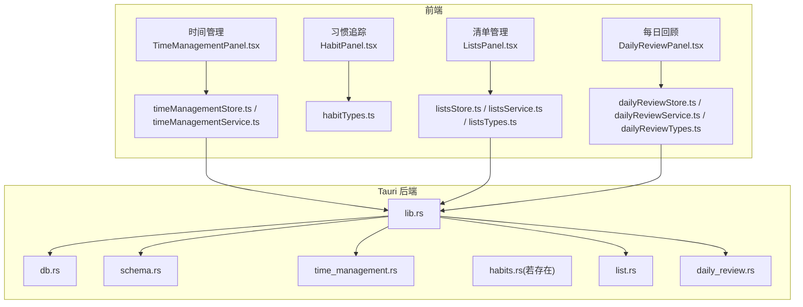
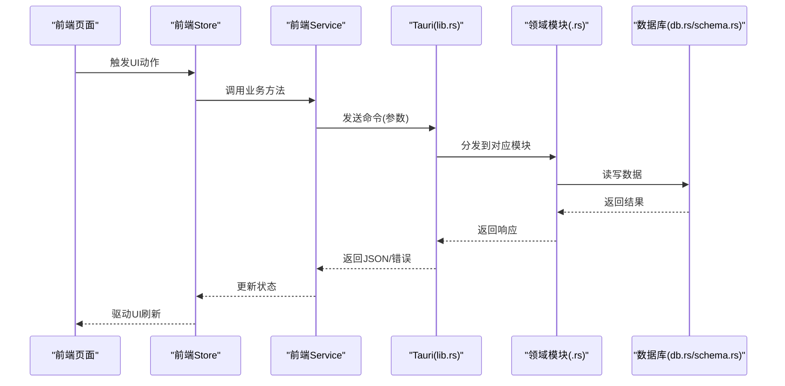
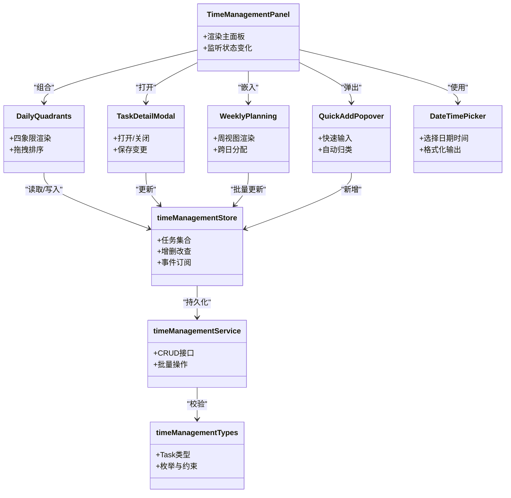
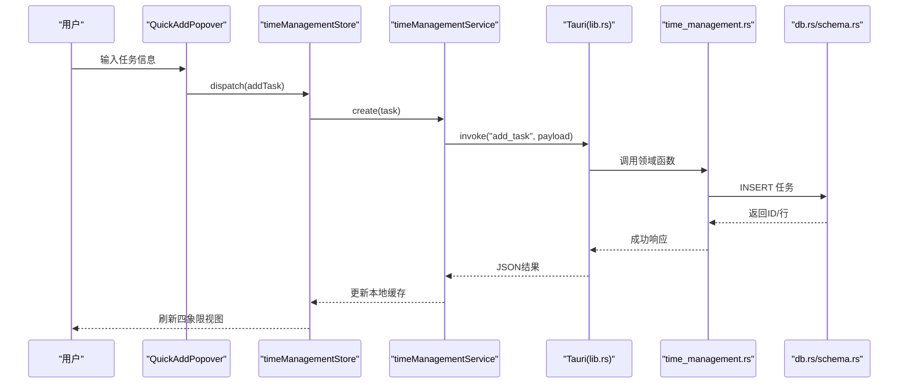
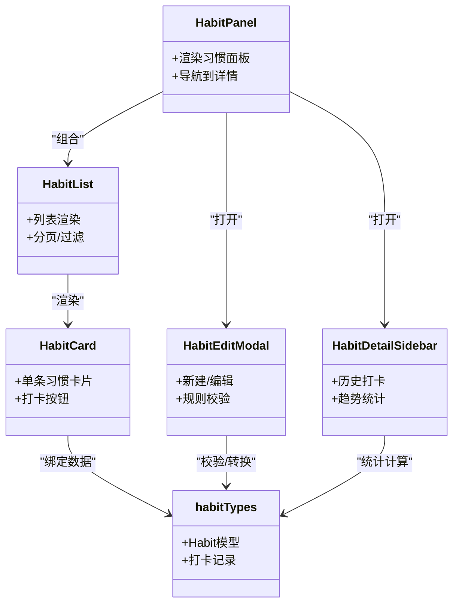
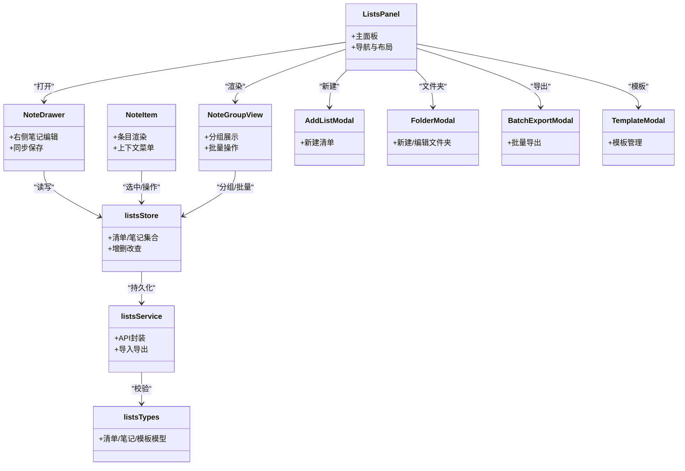
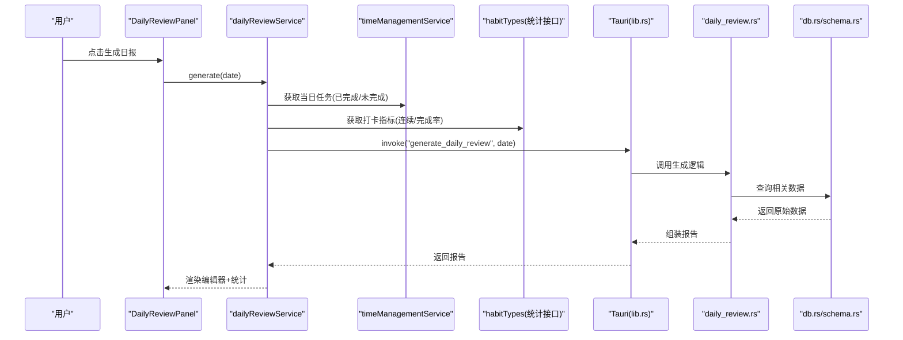
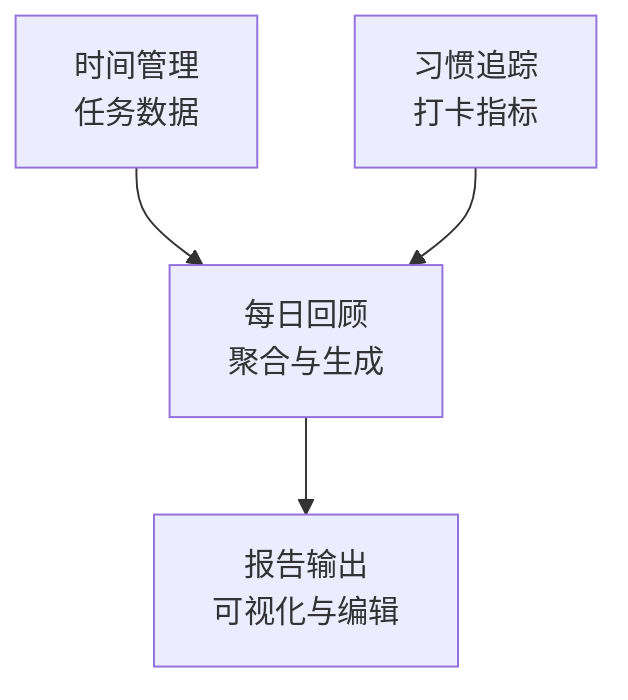
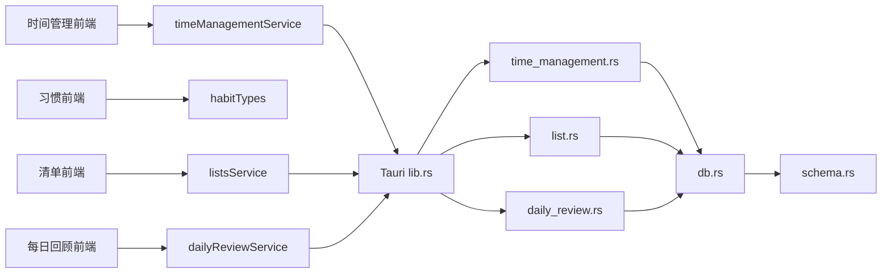

# 核心功能模块

<cite>
**本文引用的文件**   
- [src/features/time-management/TimeManagementPanel.tsx](file://src/features/time-management/TimeManagementPanel.tsx)
- [src/features/time-management/timeManagementStore.ts](file://src/features/time-management/timeManagementStore.ts)
- [src/features/time-management/timeManagementService.ts](file://src/features/time-management/timeManagementService.ts)
- [src/features/time-management/timeManagementTypes.ts](file://src/features/time-management/timeManagementTypes.ts)
- [src/features/time-management/DailyQuadrants.tsx](file://src/features/time-management/DailyQuadrants.tsx)
- [src/features/time-management/components/QuickAddPopover.tsx](file://src/features/time-management/components/QuickAddPopover.tsx)
- [src/features/time-management/components/DateTimePicker.tsx](file://src/features/time-management/components/DateTimePicker.tsx)
- [src/features/time-management/TaskDetailModal.tsx](file://src/features/time-management/TaskDetailModal.tsx)
- [src/features/time-management/WeeklyPlanning.tsx](file://src/features/time-management/WeeklyPlanning.tsx)
- [src-tauri/src/time_management.rs](file://src-tauri/src/time_management.rs)
- [src/features/habits/HabitPanel.tsx](file://src/features/habits/HabitPanel.tsx)
- [src/features/habits/components/HabitCard.tsx](file://src/features/habits/components/HabitCard.tsx)
- [src/features/habits/components/HabitList.tsx](file://src/features/habits/components/HabitList.tsx)
- [src/features/habits/components/HabitEditModal.tsx](file://src/features/habits/components/HabitEditModal.tsx)
- [src/features/habits/components/HabitDetailSidebar.tsx](file://src/features/habits/components/HabitDetailSidebar.tsx)
- [src/features/habits/habitTypes.ts](file://src/features/habits/habitTypes.ts)
- [src/features/lists/ListsPanel.tsx](file://src/features/lists/ListsPanel.tsx)
- [src/features/lists/listsStore.ts](file://src/features/lists/listsStore.ts)
- [src/features/lists/listsService.ts](file://src/features/lists/listsService.ts)
- [src/features/lists/listsTypes.ts](file://src/features/lists/listsTypes.ts)
- [src/features/lists/NoteDrawer.tsx](file://src/features/lists/NoteDrawer.tsx)
- [src/features/lists/NoteItem.tsx](file://src/features/lists/NoteItem.tsx)
- [src/features/lists/NoteGroupView.tsx](file://src/features/lists/NoteGroupView.tsx)
- [src/features/lists/AddListModal.tsx](file://src/features/lists/AddListModal.tsx)
- [src/features/lists/FolderModal.tsx](file://src/features/lists/FolderModal.tsx)
- [src/features/lists/BatchExportModal.tsx](file://src/features/lists/BatchExportModal.tsx)
- [src/features/lists/TemplateModal.tsx](file://src/features/lists/TemplateModal.tsx)
- [src/features/daily-review/DailyReviewPanel.tsx](file://src/features/daily-review/DailyReviewPanel.tsx)
- [src/features/daily-review/ReviewEditor.tsx](file://src/features/daily-review/ReviewEditor.tsx)
- [src/features/daily-review/CompoundStats.tsx](file://src/features/daily-review/CompoundStats.tsx)
- [src/features/daily-review/dailyReviewStore.ts](file://src/features/daily-review/dailyReviewStore.ts)
- [src/features/daily-review/dailyReviewService.ts](file://src/features/daily-review/dailyReviewService.ts)
- [src/features/daily-review/dailyReviewTypes.ts](file://src/features/daily-review/dailyReviewTypes.ts)
- [src-tauri/src/daily_review.rs](file://src-tauri/src/daily_review.rs)
- [src-tauri/src/db.rs](file://src-tauri/src/db.rs)
- [src-tauri/src/list.rs](file://src-tauri/src/list.rs)
- [src-tauri/src/schema.rs](file://src-tauri/src/schema.rs)
- [src-tauri/src/lib.rs](file://src-tauri/src/lib.rs)
- [src-tauri/src/main.rs](file://src-tauri/src/main.rs)
</cite>

## 目录
1. [简介](#简介)
2. [项目结构](#项目结构)
3. [核心组件](#核心组件)
4. [架构总览](#架构总览)
5. [详细组件分析](#详细组件分析)
6. [依赖关系分析](#依赖关系分析)
7. [性能考虑](#性能考虑)
8. [故障排查指南](#故障排查指南)
9. [结论](#结论)
10. [附录](#附录)

## 简介
本文件为 FishWorker 的四大核心功能模块提供综合性文档，覆盖时间管理系统、习惯追踪系统、清单管理系统与每日回顾系统。每个模块均包含业务逻辑、用户界面、状态管理与数据持久化的说明，并阐述模块间的协作方式（如时间管理与每日回顾的数据关联、习惯追踪与统计报告的关系）。文档同时给出工作流、异常处理策略、配置选项、扩展点与集成指南，以及最佳实践建议。

## 项目结构
FishWorker 采用前端 React + Tauri 后端的双层架构：
- 前端位于 src/features 下按功能域组织，使用 Store/Service 分层模式管理状态与数据访问。
- 后端位于 src-tauri/src，通过 Rust 暴露能力给前端调用，负责数据库与本地资源操作。

图表来源
- [src/features/time-management/TimeManagementPanel.tsx](file://src/features/time-management/TimeManagementPanel.tsx)
- [src/features/time-management/timeManagementStore.ts](file://src/features/time-management/timeManagementStore.ts)
- [src/features/time-management/timeManagementService.ts](file://src/features/time-management/timeManagementService.ts)
- [src/features/habits/HabitPanel.tsx](file://src/features/habits/HabitPanel.tsx)
- [src/features/habits/habitTypes.ts](file://src/features/habits/habitTypes.ts)
- [src/features/lists/ListsPanel.tsx](file://src/features/lists/ListsPanel.tsx)
- [src/features/lists/listsStore.ts](file://src/features/lists/listsStore.ts)
- [src/features/lists/listsService.ts](file://src/features/lists/listsService.ts)
- [src/features/lists/listsTypes.ts](file://src/features/lists/listsTypes.ts)
- [src/features/daily-review/DailyReviewPanel.tsx](file://src/features/daily-review/DailyReviewPanel.tsx)
- [src/features/daily-review/dailyReviewStore.ts](file://src/features/daily-review/dailyReviewStore.ts)
- [src/features/daily-review/dailyReviewService.ts](file://src/features/daily-review/dailyReviewService.ts)
- [src-tauri/src/lib.rs](file://src-tauri/src/lib.rs)
- [src-tauri/src/db.rs](file://src-tauri/src/db.rs)
- [src-tauri/src/schema.rs](file://src-tauri/src/schema.rs)
- [src-tauri/src/time_management.rs](file://src-tauri/src/time_management.rs)
- [src-tauri/src/list.rs](file://src-tauri/src/list.rs)
- [src-tauri/src/daily_review.rs](file://src-tauri/src/daily_review.rs)

章节来源
- [src/features/time-management/TimeManagementPanel.tsx](file://src/features/time-management/TimeManagementPanel.tsx)
- [src/features/time-management/timeManagementStore.ts](file://src/features/time-management/timeManagementStore.ts)
- [src/features/time-management/timeManagementService.ts](file://src/features/time-management/timeManagementService.ts)
- [src/features/habits/HabitPanel.tsx](file://src/features/habits/HabitPanel.tsx)
- [src/features/habits/habitTypes.ts](file://src/features/habits/habitTypes.ts)
- [src/features/lists/ListsPanel.tsx](file://src/features/lists/ListsPanel.tsx)
- [src/features/lists/listsStore.ts](file://src/features/lists/listsStore.ts)
- [src/features/lists/listsService.ts](file://src/features/lists/listsService.ts)
- [src/features/lists/listsTypes.ts](file://src/features/lists/listsTypes.ts)
- [src/features/daily-review/DailyReviewPanel.tsx](file://src/features/daily-review/DailyReviewPanel.tsx)
- [src/features/daily-review/dailyReviewStore.ts](file://src/features/daily-review/dailyReviewStore.ts)
- [src/features/daily-review/dailyReviewService.ts](file://src/features/daily-review/dailyReviewService.ts)
- [src-tauri/src/lib.rs](file://src-tauri/src/lib.rs)
- [src-tauri/src/db.rs](file://src-tauri/src/db.rs)
- [src-tauri/src/schema.rs](file://src-tauri/src/schema.rs)
- [src-tauri/src/time_management.rs](file://src-tauri/src/time_management.rs)
- [src-tauri/src/list.rs](file://src-tauri/src/list.rs)
- [src-tauri/src/daily_review.rs](file://src-tauri/src/daily_review.rs)

## 核心组件
本节概述四大模块的职责边界与交互契约：
- 时间管理：任务创建、分组、四象限视图、周计划、详情编辑、快速添加等。
- 习惯追踪：习惯定义、打卡记录、详情侧边栏、编辑弹窗、列表展示。
- 清单管理：清单/文件夹/模板/批量导出、笔记抽屉与分组视图、排序与重排。
- 每日回顾：回顾编辑器、复合统计、面板聚合；与时间管理数据联动生成复盘内容。

章节来源
- [src/features/time-management/TimeManagementPanel.tsx](file://src/features/time-management/TimeManagementPanel.tsx)
- [src/features/habits/HabitPanel.tsx](file://src/features/habits/HabitPanel.tsx)
- [src/features/lists/ListsPanel.tsx](file://src/features/lists/ListsPanel.tsx)
- [src/features/daily-review/DailyReviewPanel.tsx](file://src/features/daily-review/DailyReviewPanel.tsx)

## 架构总览
前后端通过 Tauri 命令进行通信。前端 Store 负责 UI 状态，Service 封装对外 API 调用；后端 lib.rs 注册命令路由，具体领域逻辑在各自 .rs 文件中实现，并通过 db.rs 与 schema.rs 访问数据库。

图表来源
- [src-tauri/src/lib.rs](file://src-tauri/src/lib.rs)
- [src-tauri/src/db.rs](file://src-tauri/src/db.rs)
- [src-tauri/src/schema.rs](file://src-tauri/src/schema.rs)
- [src-tauri/src/time_management.rs](file://src-tauri/src/time_management.rs)
- [src-tauri/src/list.rs](file://src-tauri/src/list.rs)
- [src-tauri/src/daily_review.rs](file://src-tauri/src/daily_review.rs)

## 详细组件分析

### 时间管理系统
职责与范围
- 任务实体与分类、四象限视图、周计划编排、任务详情编辑、快速添加。
- 与每日回顾共享“当日任务”数据以生成复盘摘要。

关键文件
- 界面与交互：[TimeManagementPanel.tsx](file://src/features/time-management/TimeManagementPanel.tsx)、[DailyQuadrants.tsx](file://src/features/time-management/DailyQuadrants.tsx)、[TaskDetailModal.tsx](file://src/features/time-management/TaskDetailModal.tsx)、[WeeklyPlanning.tsx](file://src/features/time-management/WeeklyPlanning.tsx)、[components/QuickAddPopover.tsx](file://src/features/time-management/components/QuickAddPopover.tsx)、[components/DateTimePicker.tsx](file://src/features/time-management/components/DateTimePicker.tsx)
- 状态与服务：[timeManagementStore.ts](file://src/features/time-management/timeManagementStore.ts)、[timeManagementService.ts](file://src/features/time-management/timeManagementService.ts)、[timeManagementTypes.ts](file://src/features/time-management/timeManagementTypes.ts)
- 后端：[time_management.rs](file://src-tauri/src/time_management.rs)

类图（前端）

图表来源
- [src/features/time-management/TimeManagementPanel.tsx](file://src/features/time-management/TimeManagementPanel.tsx)
- [src/features/time-management/DailyQuadrants.tsx](file://src/features/time-management/DailyQuadrants.tsx)
- [src/features/time-management/TaskDetailModal.tsx](file://src/features/time-management/TaskDetailModal.tsx)
- [src/features/time-management/WeeklyPlanning.tsx](file://src/features/time-management/WeeklyPlanning.tsx)
- [src/features/time-management/components/QuickAddPopover.tsx](file://src/features/time-management/components/QuickAddPopover.tsx)
- [src/features/time-management/components/DateTimePicker.tsx](file://src/features/time-management/components/DateTimePicker.tsx)
- [src/features/time-management/timeManagementStore.ts](file://src/features/time-management/timeManagementStore.ts)
- [src/features/time-management/timeManagementService.ts](file://src/features/time-management/timeManagementService.ts)
- [src/features/time-management/timeManagementTypes.ts](file://src/features/time-management/timeManagementTypes.ts)

序列图（新增任务）

图表来源
- [src/features/time-management/components/QuickAddPopover.tsx](file://src/features/time-management/components/QuickAddPopover.tsx)
- [src/features/time-management/timeManagementStore.ts](file://src/features/time-management/timeManagementStore.ts)
- [src/features/time-management/timeManagementService.ts](file://src/features/time-management/timeManagementService.ts)
- [src-tauri/src/lib.rs](file://src-tauri/src/lib.rs)
- [src-tauri/src/time_management.rs](file://src-tauri/src/time_management.rs)
- [src-tauri/src/db.rs](file://src-tauri/src/db.rs)
- [src-tauri/src/schema.rs](file://src-tauri/src/schema.rs)

业务流程要点
- 快速添加：支持快捷录入与默认分类，减少操作步骤。
- 四象限视图：基于优先级与紧急度筛选与排序，支持拖拽调整。
- 周计划：跨日分配与批量移动，保持时间线一致性。
- 详情编辑：字段校验、冲突合并与撤销恢复。

异常处理
- 网络/IPC 失败：提示重试或回滚本地缓存。
- 数据校验失败：高亮错误字段并阻止提交。
- 并发冲突：乐观锁或最后写入优先策略可配置。

配置与扩展
- 四象限阈值、默认分类、快捷键映射可在 Store 初始化时注入。
- 自定义分类器可通过 Service 钩子接入。

章节来源
- [src/features/time-management/TimeManagementPanel.tsx](file://src/features/time-management/TimeManagementPanel.tsx)
- [src/features/time-management/timeManagementStore.ts](file://src/features/time-management/timeManagementStore.ts)
- [src/features/time-management/timeManagementService.ts](file://src/features/time-management/timeManagementService.ts)
- [src/features/time-management/timeManagementTypes.ts](file://src/features/time-management/timeManagementTypes.ts)
- [src/features/time-management/DailyQuadrants.tsx](file://src/features/time-management/DailyQuadrants.tsx)
- [src/features/time-management/components/QuickAddPopover.tsx](file://src/features/time-management/components/QuickAddPopover.tsx)
- [src/features/time-management/components/DateTimePicker.tsx](file://src/features/time-management/components/DateTimePicker.tsx)
- [src/features/time-management/TaskDetailModal.tsx](file://src/features/time-management/TaskDetailModal.tsx)
- [src/features/time-management/WeeklyPlanning.tsx](file://src/features/time-management/WeeklyPlanning.tsx)
- [src-tauri/src/time_management.rs](file://src-tauri/src/time_management.rs)
- [src-tauri/src/db.rs](file://src-tauri/src/db.rs)
- [src-tauri/src/schema.rs](file://src-tauri/src/schema.rs)

### 习惯追踪系统
职责与范围
- 习惯定义、打卡记录、统计概览、详情侧边栏与编辑弹窗。
- 与每日回顾联动，提供连续打卡天数、完成率等指标。

关键文件
- 界面与交互：[HabitPanel.tsx](file://src/features/habits/HabitPanel.tsx)、[components/HabitCard.tsx](file://src/features/habits/components/HabitCard.tsx)、[components/HabitList.tsx](file://src/features/habits/components/HabitList.tsx)、[components/HabitEditModal.tsx](file://src/features/habits/components/HabitEditModal.tsx)、[components/HabitDetailSidebar.tsx](file://src/features/habits/components/HabitDetailSidebar.tsx)
- 类型与数据：[habitTypes.ts](file://src/features/habits/habitTypes.ts)

类图（前端）

图表来源
- [src/features/habits/HabitPanel.tsx](file://src/features/habits/HabitPanel.tsx)
- [src/features/habits/components/HabitList.tsx](file://src/features/habits/components/HabitList.tsx)
- [src/features/habits/components/HabitCard.tsx](file://src/features/habits/components/HabitCard.tsx)
- [src/features/habits/components/HabitEditModal.tsx](file://src/features/habits/components/HabitEditModal.tsx)
- [src/features/habits/components/HabitDetailSidebar.tsx](file://src/features/habits/components/HabitDetailSidebar.tsx)
- [src/features/habits/habitTypes.ts](file://src/features/habits/habitTypes.ts)

流程要点
- 打卡：一键完成当日打卡，支持补卡与撤销。
- 统计：连续天数、完成率、近N天趋势。
- 联动：向每日回顾推送指标用于汇总。

异常处理
- 重复打卡：幂等处理，避免重复计数。
- 数据不一致：以服务端为准，客户端做差异合并。

章节来源
- [src/features/habits/HabitPanel.tsx](file://src/features/habits/HabitPanel.tsx)
- [src/features/habits/components/HabitCard.tsx](file://src/features/habits/components/HabitCard.tsx)
- [src/features/habits/components/HabitList.tsx](file://src/features/habits/components/HabitList.tsx)
- [src/features/habits/components/HabitEditModal.tsx](file://src/features/habits/components/HabitEditModal.tsx)
- [src/features/habits/components/HabitDetailSidebar.tsx](file://src/features/habits/components/HabitDetailSidebar.tsx)
- [src/features/habits/habitTypes.ts](file://src/features/habits/habitTypes.ts)

### 清单管理系统
职责与范围
- 清单/文件夹/模板管理、批量导出、笔记抽屉与分组视图、排序与重排。

关键文件
- 界面与交互：[ListsPanel.tsx](file://src/features/lists/ListsPanel.tsx)、[NoteDrawer.tsx](file://src/features/lists/NoteDrawer.tsx)、[NoteItem.tsx](file://src/features/lists/NoteItem.tsx)、[NoteGroupView.tsx](file://src/features/lists/NoteGroupView.tsx)、[AddListModal.tsx](file://src/features/lists/AddListModal.tsx)、[FolderModal.tsx](file://src/features/lists/FolderModal.tsx)、[BatchExportModal.tsx](file://src/features/lists/BatchExportModal.tsx)、[TemplateModal.tsx](file://src/features/lists/TemplateModal.tsx)
- 状态与服务：[listsStore.ts](file://src/features/lists/listsStore.ts)、[listsService.ts](file://src/features/lists/listsService.ts)、[listsTypes.ts](file://src/features/lists/listsTypes.ts)
- 后端：[list.rs](file://src-tauri/src/list.rs)

类图（前端）

图表来源
- [src/features/lists/ListsPanel.tsx](file://src/features/lists/ListsPanel.tsx)
- [src/features/lists/NoteDrawer.tsx](file://src/features/lists/NoteDrawer.tsx)
- [src/features/lists/NoteItem.tsx](file://src/features/lists/NoteItem.tsx)
- [src/features/lists/NoteGroupView.tsx](file://src/features/lists/NoteGroupView.tsx)
- [src/features/lists/AddListModal.tsx](file://src/features/lists/AddListModal.tsx)
- [src/features/lists/FolderModal.tsx](file://src/features/lists/FolderModal.tsx)
- [src/features/lists/BatchExportModal.tsx](file://src/features/lists/BatchExportModal.tsx)
- [src/features/lists/TemplateModal.tsx](file://src/features/lists/TemplateModal.tsx)
- [src/features/lists/listsStore.ts](file://src/features/lists/listsStore.ts)
- [src/features/lists/listsService.ts](file://src/features/lists/listsService.ts)
- [src/features/lists/listsTypes.ts](file://src/features/lists/listsTypes.ts)

流程要点
- 分组与排序：支持拖拽重排与批量移动。
- 模板与导出：模板复用与多格式导出。
- 权限与锁定：可选的条目锁定与只读模式。

异常处理
- 大文件导出：分块导出与进度反馈。
- 并发编辑：版本号控制与冲突提示。

章节来源
- [src/features/lists/ListsPanel.tsx](file://src/features/lists/ListsPanel.tsx)
- [src/features/lists/listsStore.ts](file://src/features/lists/listsStore.ts)
- [src/features/lists/listsService.ts](file://src/features/lists/listsService.ts)
- [src/features/lists/listsTypes.ts](file://src/features/lists/listsTypes.ts)
- [src/features/lists/NoteDrawer.tsx](file://src/features/lists/NoteDrawer.tsx)
- [src/features/lists/NoteItem.tsx](file://src/features/lists/NoteItem.tsx)
- [src/features/lists/NoteGroupView.tsx](file://src/features/lists/NoteGroupView.tsx)
- [src/features/lists/AddListModal.tsx](file://src/features/lists/AddListModal.tsx)
- [src/features/lists/FolderModal.tsx](file://src/features/lists/FolderModal.tsx)
- [src/features/lists/BatchExportModal.tsx](file://src/features/lists/BatchExportModal.tsx)
- [src/features/lists/TemplateModal.tsx](file://src/features/lists/TemplateModal.tsx)
- [src-tauri/src/list.rs](file://src-tauri/src/list.rs)

### 每日回顾系统
职责与范围
- 回顾编辑器、复合统计、面板聚合；从时间管理与习惯系统拉取数据生成复盘内容。

关键文件
- 界面与交互：[DailyReviewPanel.tsx](file://src/features/daily-review/DailyReviewPanel.tsx)、[ReviewEditor.tsx](file://src/features/daily-review/ReviewEditor.tsx)、[CompoundStats.tsx](file://src/features/daily-review/CompoundStats.tsx)
- 状态与服务：[dailyReviewStore.ts](file://src/features/daily-review/dailyReviewStore.ts)、[dailyReviewService.ts](file://src/features/daily-review/dailyReviewService.ts)、[dailyReviewTypes.ts](file://src/features/daily-review/dailyReviewTypes.ts)
- 后端：[daily_review.rs](file://src-tauri/src/daily_review.rs)

序列图（生成日报）

图表来源
- [src/features/daily-review/DailyReviewPanel.tsx](file://src/features/daily-review/DailyReviewPanel.tsx)
- [src/features/daily-review/dailyReviewService.ts](file://src/features/daily-review/dailyReviewService.ts)
- [src/features/time-management/timeManagementService.ts](file://src/features/time-management/timeManagementService.ts)
- [src/features/habits/habitTypes.ts](file://src/features/habits/habitTypes.ts)
- [src-tauri/src/lib.rs](file://src-tauri/src/lib.rs)
- [src-tauri/src/daily_review.rs](file://src-tauri/src/daily_review.rs)
- [src-tauri/src/db.rs](file://src-tauri/src/db.rs)
- [src-tauri/src/schema.rs](file://src-tauri/src/schema.rs)

流程要点
- 数据聚合：从时间与习惯模块拉取指标，结合回顾文本生成结构化报告。
- 编辑与保存：支持富文本编辑与自动保存。
- 统计可视化：完成率、专注时长、任务达成率等。

异常处理
- 数据缺失：显示占位与提示补充。
- 生成失败：降级为仅文本模式并提示重试。

章节来源
- [src/features/daily-review/DailyReviewPanel.tsx](file://src/features/daily-review/DailyReviewPanel.tsx)
- [src/features/daily-review/dailyReviewStore.ts](file://src/features/daily-review/dailyReviewStore.ts)
- [src/features/daily-review/dailyReviewService.ts](file://src/features/daily-review/dailyReviewService.ts)
- [src/features/daily-review/dailyReviewTypes.ts](file://src/features/daily-review/dailyReviewTypes.ts)
- [src/features/daily-review/ReviewEditor.tsx](file://src/features/daily-review/ReviewEditor.tsx)
- [src/features/daily-review/CompoundStats.tsx](file://src/features/daily-review/CompoundStats.tsx)
- [src-tauri/src/daily_review.rs](file://src-tauri/src/daily_review.rs)
- [src-tauri/src/db.rs](file://src-tauri/src/db.rs)
- [src-tauri/src/schema.rs](file://src-tauri/src/schema.rs)

### 概念性总览
以下流程图展示了跨模块协作的核心路径：时间管理产出任务数据，习惯追踪产出打卡指标，两者共同被每日回顾聚合形成复盘报告。

（此图为概念示意，不直接映射具体源码文件）

## 依赖关系分析
- 前端内部依赖
  - 各模块 Store 依赖 Service 进行数据访问。
  - 每日回顾依赖时间管理与习惯模块的数据接口。
- 前后端耦合
  - 通过 Tauri lib.rs 统一注册命令，领域模块解耦于前端。
  - db.rs 与 schema.rs 作为数据层抽象，屏蔽底层存储细节。

图表来源
- [src/features/time-management/timeManagementService.ts](file://src/features/time-management/timeManagementService.ts)
- [src/features/habits/habitTypes.ts](file://src/features/habits/habitTypes.ts)
- [src/features/lists/listsService.ts](file://src/features/lists/listsService.ts)
- [src/features/daily-review/dailyReviewService.ts](file://src/features/daily-review/dailyReviewService.ts)
- [src-tauri/src/lib.rs](file://src-tauri/src/lib.rs)
- [src-tauri/src/time_management.rs](file://src-tauri/src/time_management.rs)
- [src-tauri/src/list.rs](file://src-tauri/src/list.rs)
- [src-tauri/src/daily_review.rs](file://src-tauri/src/daily_review.rs)
- [src-tauri/src/db.rs](file://src-tauri/src/db.rs)
- [src-tauri/src/schema.rs](file://src-tauri/src/schema.rs)

章节来源
- [src-tauri/src/lib.rs](file://src-tauri/src/lib.rs)
- [src-tauri/src/db.rs](file://src-tauri/src/db.rs)
- [src-tauri/src/schema.rs](file://src-tauri/src/schema.rs)
- [src-tauri/src/time_management.rs](file://src-tauri/src/time_management.rs)
- [src-tauri/src/list.rs](file://src-tauri/src/list.rs)
- [src-tauri/src/daily_review.rs](file://src-tauri/src/daily_review.rs)

## 性能考虑
- 前端
  - 列表虚拟化与按需加载，避免大数据量卡顿。
  - 增量更新与防抖/节流，降低频繁状态更新开销。
- 后端
  - 批量 SQL 与索引优化，减少往返次数。
  - 导出任务异步化与分块传输，提升用户体验。
- 跨进程
  - 合并 IPC 调用，减少序列化/反序列化成本。
  - 错误快速失败与重试退避策略。

## 故障排查指南
- 常见问题定位
  - 数据不同步：检查 Store 与 Service 的更新链路是否完整。
  - 导出失败：查看 BatchExportModal 的错误分支与日志。
  - 回顾生成失败：确认时间管理与习惯数据是否存在，检查 daily_review.rs 的聚合逻辑。
- 调试建议
  - 在前端增加关键路径的日志打印与断点。
  - 在后端启用详细日志，关注 db.rs 的 SQL 执行与错误码。
- 恢复策略
  - 本地缓存失效时，主动拉取远端最新数据。
  - 对幂等操作进行去重，防止重复写入。

章节来源
- [src/features/lists/BatchExportModal.tsx](file://src/features/lists/BatchExportModal.tsx)
- [src/features/daily-review/dailyReviewService.ts](file://src/features/daily-review/dailyReviewService.ts)
- [src-tauri/src/daily_review.rs](file://src-tauri/src/daily_review.rs)
- [src-tauri/src/db.rs](file://src-tauri/src/db.rs)

## 结论
FishWorker 的四大核心模块围绕“计划—执行—回顾”的主线展开，通过清晰的前后端分层与模块化设计，实现了良好的可扩展性与可维护性。时间管理与习惯追踪为每日回顾提供数据基础，清单管理则承载更广泛的文档与素材管理需求。建议在后续迭代中持续完善错误处理、性能优化与扩展点，以提升整体体验与稳定性。

## 附录
- 使用示例与最佳实践
  - 时间管理：每天开始用快速添加收集任务，随后在四象限中排序；周末进入周计划进行跨日分配。
  - 习惯追踪：设定最小可行目标，坚持每日打卡；利用连续天数激励自我。
  - 清单管理：使用模板加速创建，定期归档与导出备份。
  - 每日回顾：固定时段生成报告，结合任务与习惯指标进行复盘与改进。
- 集成指南
  - 新增领域：在 Tauri lib.rs 注册新命令，实现对应 .rs 模块，并在前端新增 Service 与 Store。
  - 数据迁移：在 schema.rs 中演进表结构，确保向后兼容。
  - 扩展点：在 Service 层预留钩子，便于接入第三方服务或插件。