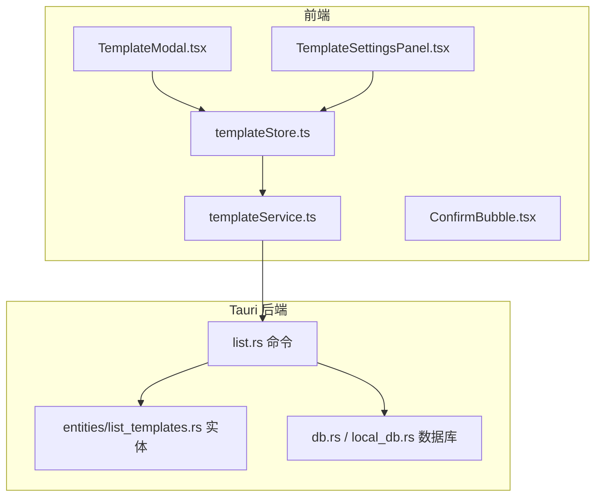
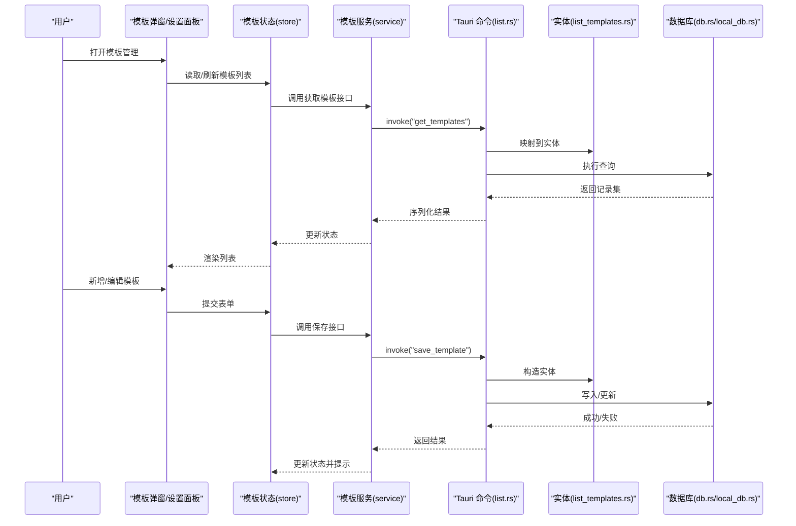
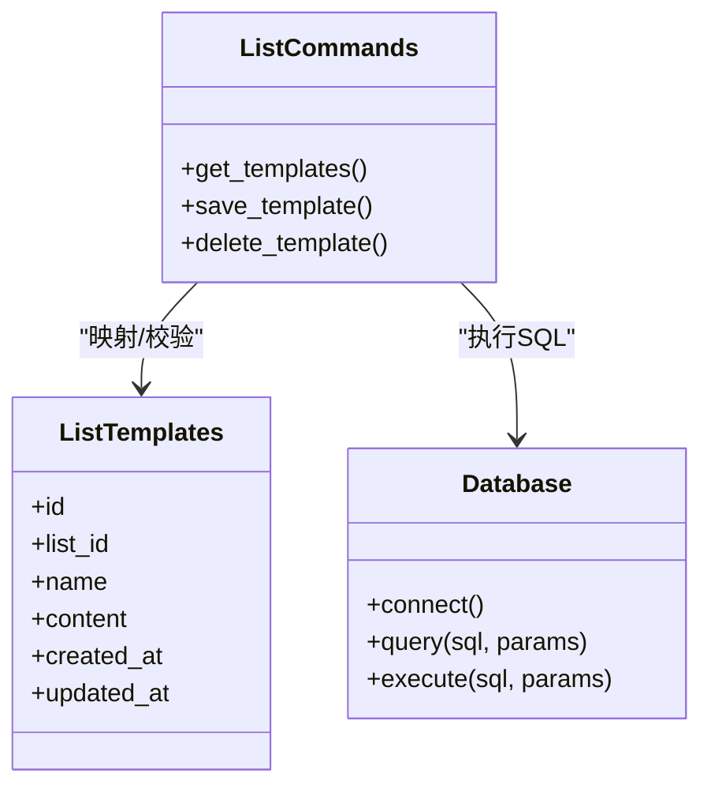
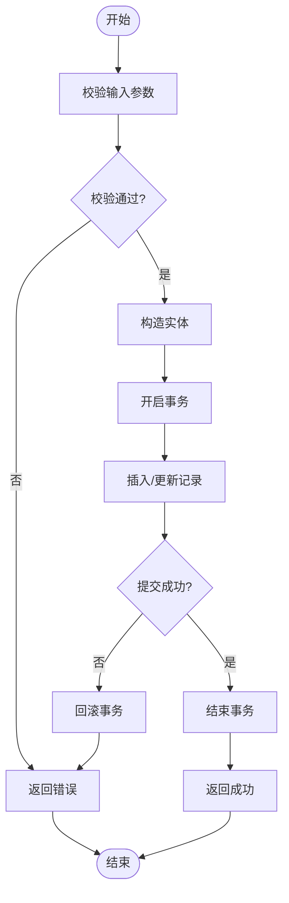
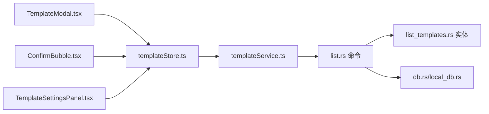

# 模板管理系统

<cite>
**本文引用的文件**   
- [src/features/templates/templateStore.ts](file://src/features/templates/templateStore.ts)
- [src/features/templates/templateService.ts](file://src/features/templates/templateService.ts)
- [src/features/templates/templateTypes.ts](file://src/features/templates/templateTypes.ts)
- [src/features/templates/TemplateModal.tsx](file://src/features/templates/TemplateModal.tsx)
- [src/features/templates/ConfirmBubble.tsx](file://src/features/templates/ConfirmBubble.tsx)
- [src/features/settings/components/TemplateSettingsPanel.tsx](file://src/features/settings/components/TemplateSettingsPanel.tsx)
- [src-tauri/src/entities/list_templates.rs](file://src-tauri/src/entities/list_templates.rs)
- [src-tauri/src/list.rs](file://src-tauri/src/list.rs)
- [src-tauri/src/db.rs](file://src-tauri/src/db.rs)
- [src-tauri/src/local_db.rs](file://src-tauri/src/local_db.rs)
- [src-tauri/Cargo.toml](file://src-tauri/Cargo.toml)
- [src-tauri/tauri.conf.json](file://src-tauri/tauri.conf.json)
</cite>

## 目录
1. [简介](#简介)
2. [项目结构](#项目结构)
3. [核心组件](#核心组件)
4. [架构总览](#架构总览)
5. [详细组件分析](#详细组件分析)
6. [依赖关系分析](#依赖关系分析)
7. [性能考虑](#性能考虑)
8. [故障排查指南](#故障排查指南)
9. [结论](#结论)
10. [附录](#附录)

## 简介
本仓库包含一个基于 Tauri + React 的桌面应用，其中“模板管理”是列表模块的一部分，用于对“模板”进行增删改查与批量操作。前端通过状态管理与服务层组织数据流，后端使用 Rust 与 SQLite 持久化存储，并通过 Tauri 命令暴露给前端调用。

## 项目结构
模板管理相关的前端代码位于 features/templates 目录，设置面板中提供模板管理的入口；后端实体与命令分别位于 src-tauri 的 entities 与 list 模块中，数据库访问由 db 与 local_db 模块负责。

图表来源
- [src/features/templates/templateStore.ts](file://src/features/templates/templateStore.ts)
- [src/features/templates/templateService.ts](file://src/features/templates/templateService.ts)
- [src/features/templates/TemplateModal.tsx](file://src/features/templates/TemplateModal.tsx)
- [src/features/templates/ConfirmBubble.tsx](file://src/features/templates/ConfirmBubble.tsx)
- [src/features/settings/components/TemplateSettingsPanel.tsx](file://src/features/settings/components/TemplateSettingsPanel.tsx)
- [src-tauri/src/list.rs](file://src-tauri/src/list.rs)
- [src-tauri/src/entities/list_templates.rs](file://src-tauri/src/entities/list_templates.rs)
- [src-tauri/src/db.rs](file://src-tauri/src/db.rs)
- [src-tauri/src/local_db.rs](file://src-tauri/src/local_db.rs)

章节来源
- [src/features/templates/templateStore.ts](file://src/features/templates/templateStore.ts)
- [src/features/templates/templateService.ts](file://src/features/templates/templateService.ts)
- [src/features/templates/templateTypes.ts](file://src/features/templates/templateTypes.ts)
- [src/features/templates/TemplateModal.tsx](file://src/features/templates/TemplateModal.tsx)
- [src/features/templates/ConfirmBubble.tsx](file://src/features/templates/ConfirmBubble.tsx)
- [src/features/settings/components/TemplateSettingsPanel.tsx](file://src/features/settings/components/TemplateSettingsPanel.tsx)
- [src-tauri/src/entities/list_templates.rs](file://src-tauri/src/entities/list_templates.rs)
- [src-tauri/src/list.rs](file://src-tauri/src/list.rs)
- [src-tauri/src/db.rs](file://src-tauri/src/db.rs)
- [src-tauri/src/local_db.rs](file://src-tauri/src/local_db.rs)

## 核心组件
- 类型定义：集中声明模板实体的字段、枚举与校验规则，确保前后端数据结构一致。
- 状态管理：维护模板列表、当前选中项、加载与错误状态，并提供统一的更新方法。
- 服务层：封装 Tauri 命令调用，处理请求参数与响应结果，统一错误转换。
- 界面交互：模板弹窗负责新增/编辑表单与确认气泡，设置面板提供模板管理入口。
- 后端实体与命令：定义数据库表结构与 CRUD 接口，供前端通过 Tauri 调用。
- 数据库层：SQLite 初始化、连接与迁移，提供事务与查询执行能力。

章节来源
- [src/features/templates/templateTypes.ts](file://src/features/templates/templateTypes.ts)
- [src/features/templates/templateStore.ts](file://src/features/templates/templateStore.ts)
- [src/features/templates/templateService.ts](file://src/features/templates/templateService.ts)
- [src/features/templates/TemplateModal.tsx](file://src/features/templates/TemplateModal.tsx)
- [src/features/templates/ConfirmBubble.tsx](file://src/features/templates/ConfirmBubble.tsx)
- [src/features/settings/components/TemplateSettingsPanel.tsx](file://src/features/settings/components/TemplateSettingsPanel.tsx)
- [src-tauri/src/entities/list_templates.rs](file://src-tauri/src/entities/list_templates.rs)
- [src-tauri/src/list.rs](file://src-tauri/src/list.rs)
- [src-tauri/src/db.rs](file://src-tauri/src/db.rs)
- [src-tauri/src/local_db.rs](file://src-tauri/src/local_db.rs)

## 架构总览
模板管理采用典型的前后端分离架构：React 前端通过 Tauri 命令与 Rust 后端通信，后端以 SQLite 作为本地持久化存储。

图表来源
- [src/features/templates/TemplateModal.tsx](file://src/features/templates/TemplateModal.tsx)
- [src/features/templates/templateStore.ts](file://src/features/templates/templateStore.ts)
- [src/features/templates/templateService.ts](file://src/features/templates/templateService.ts)
- [src-tauri/src/list.rs](file://src-tauri/src/list.rs)
- [src-tauri/src/entities/list_templates.rs](file://src-tauri/src/entities/list_templates.rs)
- [src-tauri/src/db.rs](file://src-tauri/src/db.rs)
- [src-tauri/src/local_db.rs](file://src-tauri/src/local_db.rs)

## 详细组件分析

### 类型定义（模板实体）
- 职责：定义模板字段、必填校验、默认值与可选扩展属性，保证前后端一致性。
- 关键点：
  - 唯一标识与关联键（如所属列表 ID）。
  - 内容字段（文本或结构化 JSON）。
  - 元信息（创建时间、更新时间、是否启用等）。
  - 校验规则（名称非空、长度限制等）。

章节来源
- [src/features/templates/templateTypes.ts](file://src/features/templates/templateTypes.ts)

### 状态管理（模板 Store）
- 职责：维护模板集合、当前选择、加载与错误状态；提供增删改查与批量操作的原子更新。
- 关键点：
  - 使用不可变更新模式，避免直接修改状态。
  - 将异步操作与副作用隔离在服务层，store 仅负责状态变更。
  - 提供撤销/重做友好的快照策略（如需）。

章节来源
- [src/features/templates/templateStore.ts](file://src/features/templates/templateStore.ts)

### 服务层（模板 Service）
- 职责：封装 Tauri 命令调用，统一参数构建、错误转换与重试策略。
- 关键点：
  - 将业务语义映射为具体命令名（如 get/save/delete）。
  - 对网络/系统异常进行友好提示与降级处理。
  - 支持批量操作的事务性包装（在命令侧实现）。

章节来源
- [src/features/templates/templateService.ts](file://src/features/templates/templateService.ts)

### 界面交互（模板弹窗与确认气泡）
- 职责：提供模板的新增/编辑表单、删除确认与操作反馈。
- 关键点：
  - 表单校验与即时反馈。
  - 确认气泡减少误操作风险。
  - 与 store 联动，触发保存/删除后刷新视图。

章节来源
- [src/features/templates/TemplateModal.tsx](file://src/features/templates/TemplateModal.tsx)
- [src/features/templates/ConfirmBubble.tsx](file://src/features/templates/ConfirmBubble.tsx)

### 设置入口（模板设置面板）
- 职责：在设置中提供模板管理入口，便于全局配置与快速访问。
- 关键点：
  - 路由跳转至模板管理页面。
  - 展示关键统计（模板数量、最近使用等）。

章节来源
- [src/features/settings/components/TemplateSettingsPanel.tsx](file://src/features/settings/components/TemplateSettingsPanel.tsx)

### 后端实体（list_templates）
- 职责：定义模板表的列、约束与索引，提供从行到实体的映射。
- 关键点：
  - 主键与外键设计（如关联列表 ID）。
  - 唯一约束（同一列表内模板名称唯一）。
  - 时间戳字段与软删除标记（可选）。

章节来源
- [src-tauri/src/entities/list_templates.rs](file://src-tauri/src/entities/list_templates.rs)

### 后端命令（list.rs）
- 职责：暴露 Tauri 命令，接收前端请求，执行业务逻辑并返回结果。
- 关键点：
  - 参数校验与错误码映射。
  - 事务边界控制（批量保存/删除）。
  - 日志与审计（可选）。

章节来源
- [src-tauri/src/list.rs](file://src-tauri/src/list.rs)

### 数据库层（db.rs / local_db.rs）
- 职责：初始化 SQLite 连接、执行 SQL、管理迁移与连接池。
- 关键点：
  - 连接复用与并发安全。
  - 迁移脚本与版本管理。
  - 读写分离与查询优化（索引、预编译语句）。

章节来源
- [src-tauri/src/db.rs](file://src-tauri/src/db.rs)
- [src-tauri/src/local_db.rs](file://src-tauri/src/local_db.rs)

#### 类图（后端实体与命令关系）

图表来源
- [src-tauri/src/entities/list_templates.rs](file://src-tauri/src/entities/list_templates.rs)
- [src-tauri/src/list.rs](file://src-tauri/src/list.rs)
- [src-tauri/src/db.rs](file://src-tauri/src/db.rs)

#### 流程图（保存模板流程）

图表来源
- [src-tauri/src/list.rs](file://src-tauri/src/list.rs)
- [src-tauri/src/db.rs](file://src-tauri/src/db.rs)

## 依赖关系分析
- 前端内部依赖：
  - TemplateModal 与 ConfirmBubble 依赖 templateStore 与 templateService。
  - TemplateSettingsPanel 提供入口，间接依赖上述模块。
- 前后端契约：
  - 通过 Tauri 命令进行 RPC 式调用，参数与返回值需严格对齐。
- 后端依赖：
  - list.rs 依赖 entities/list_templates.rs 与 db.rs/local_db.rs。

图表来源
- [src/features/templates/TemplateModal.tsx](file://src/features/templates/TemplateModal.tsx)
- [src/features/templates/ConfirmBubble.tsx](file://src/features/templates/ConfirmBubble.tsx)
- [src/features/templates/templateStore.ts](file://src/features/templates/templateStore.ts)
- [src/features/templates/templateService.ts](file://src/features/templates/templateService.ts)
- [src/features/settings/components/TemplateSettingsPanel.tsx](file://src/features/settings/components/TemplateSettingsPanel.tsx)
- [src-tauri/src/list.rs](file://src-tauri/src/list.rs)
- [src-tauri/src/entities/list_templates.rs](file://src-tauri/src/entities/list_templates.rs)
- [src-tauri/src/db.rs](file://src-tauri/src/db.rs)
- [src-tauri/src/local_db.rs](file://src-tauri/src/local_db.rs)

章节来源
- [src-tauri/Cargo.toml](file://src-tauri/Cargo.toml)
- [src-tauri/tauri.conf.json](file://src-tauri/tauri.conf.json)

## 性能考虑
- 前端：
  - 列表分页与虚拟滚动（当模板量较大时）。
  - 防抖/节流输入，减少无效保存。
  - 合并多次状态更新，避免频繁重渲染。
- 后端：
  - 合理使用索引（名称、列表 ID、时间戳）。
  - 批量操作使用事务，降低 I/O 次数。
  - 预编译 SQL 与连接池复用。
- 传输：
  - 压缩大对象（如富文本内容），按需加载详情。

[本节为通用指导，不直接分析具体文件]

## 故障排查指南
- 常见问题：
  - 模板名称重复：检查唯一约束与前端校验。
  - 保存失败：查看事务日志与数据库错误码。
  - 列表为空：确认初始化迁移是否执行。
- 定位步骤：
  - 在前端控制台查看 service 层错误信息。
  - 在后端日志中检索对应命令与 SQL。
  - 验证数据库 schema 与实体映射是否一致。

章节来源
- [src/features/templates/templateService.ts](file://src/features/templates/templateService.ts)
- [src-tauri/src/list.rs](file://src-tauri/src/list.rs)
- [src-tauri/src/db.rs](file://src-tauri/src/db.rs)

## 结论
模板管理模块遵循清晰的分层架构：前端以类型驱动的状态与服务层组织交互，后端以实体与命令对接 SQLite，整体耦合度低、可维护性强。建议后续引入更完善的日志与监控，并对大数据量场景进行分页与索引优化。

[本节为总结，不直接分析具体文件]

## 附录
- 配置与构建：
  - Cargo 依赖与特性开关参见 Cargo.toml。
  - Tauri 窗口与权限配置参见 tauri.conf.json。

章节来源
- [src-tauri/Cargo.toml](file://src-tauri/Cargo.toml)
- [src-tauri/tauri.conf.json](file://src-tauri/tauri.conf.json)