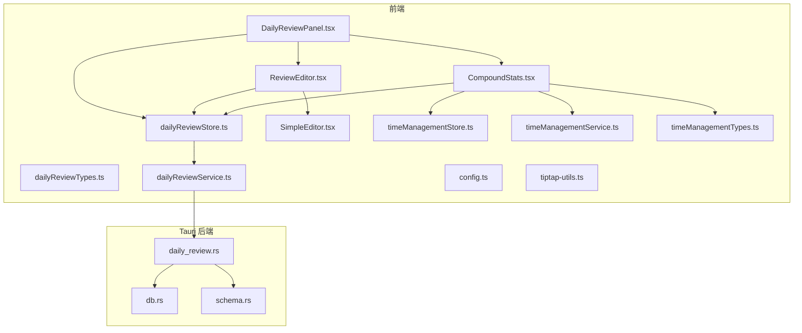
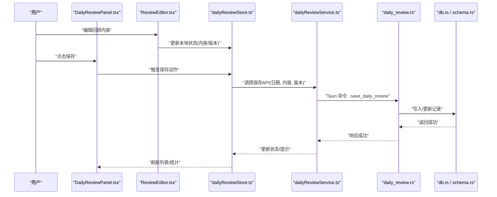
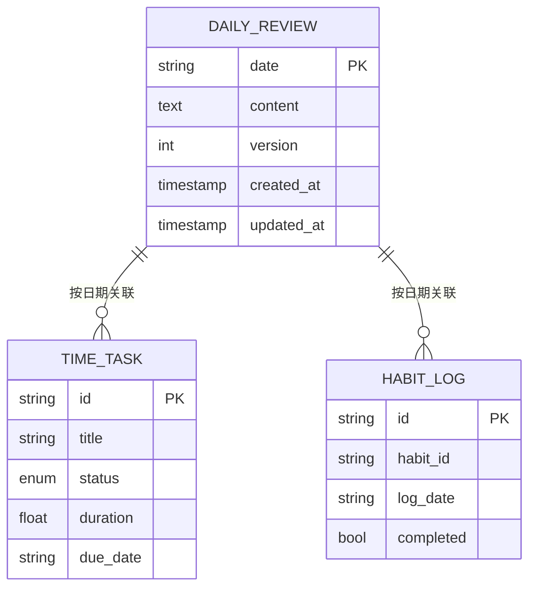
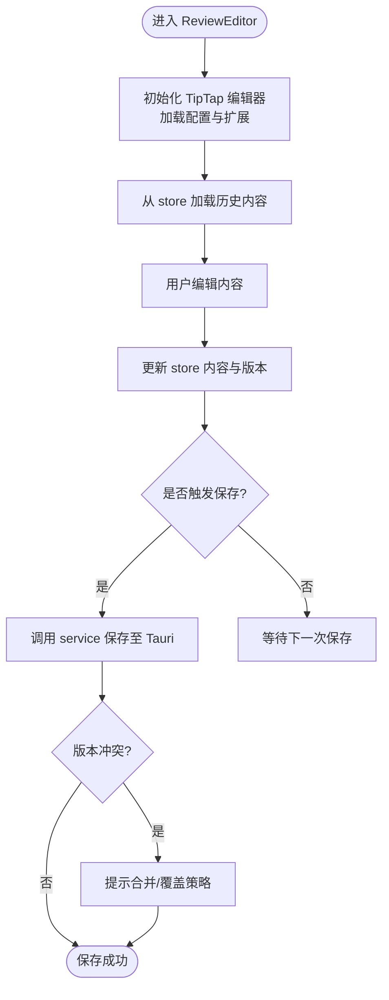
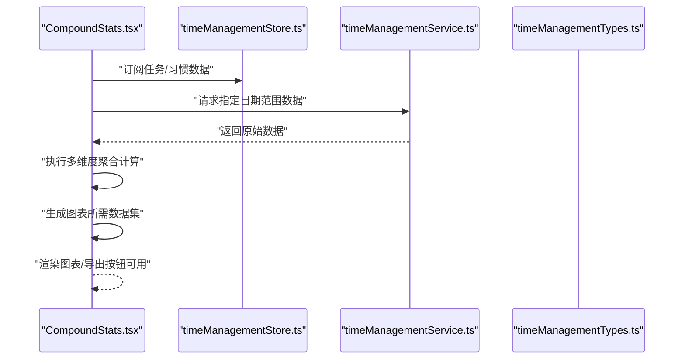
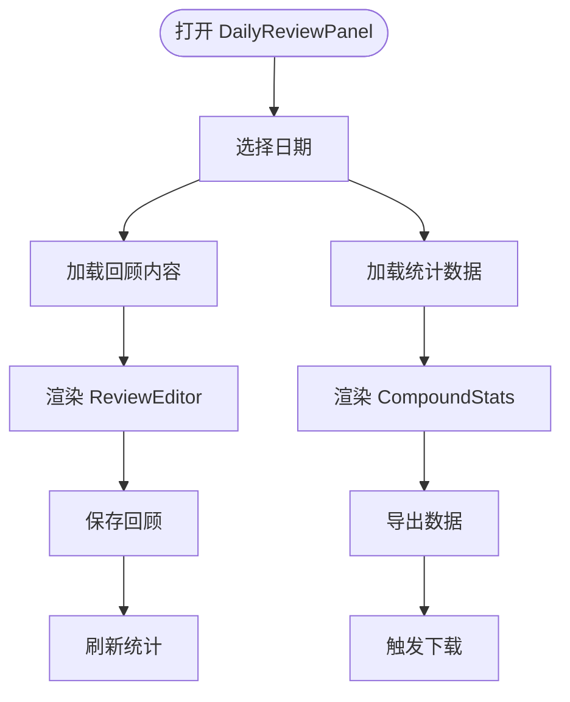
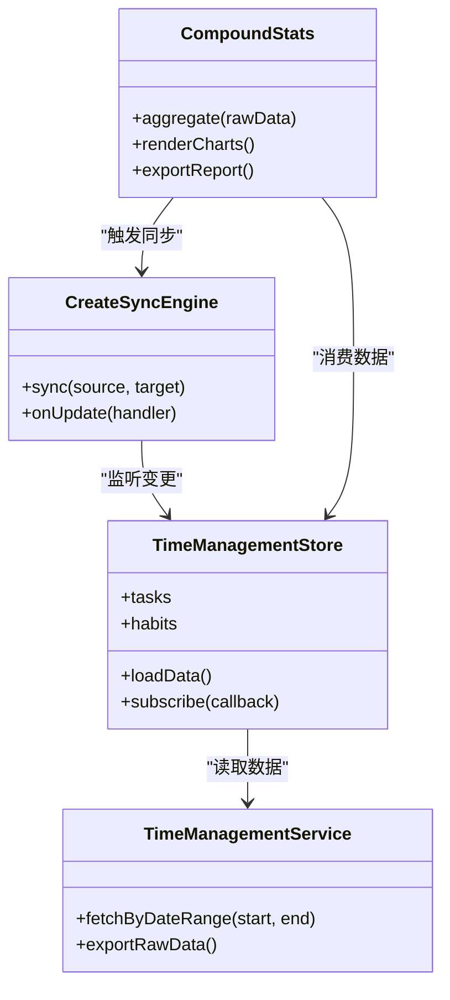
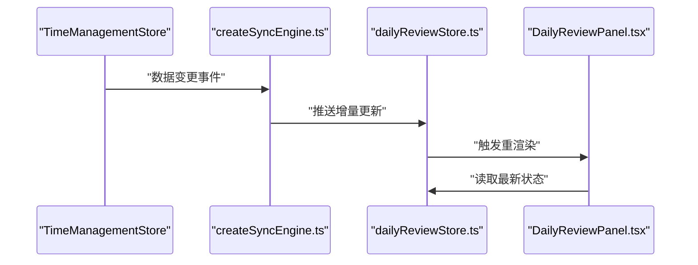
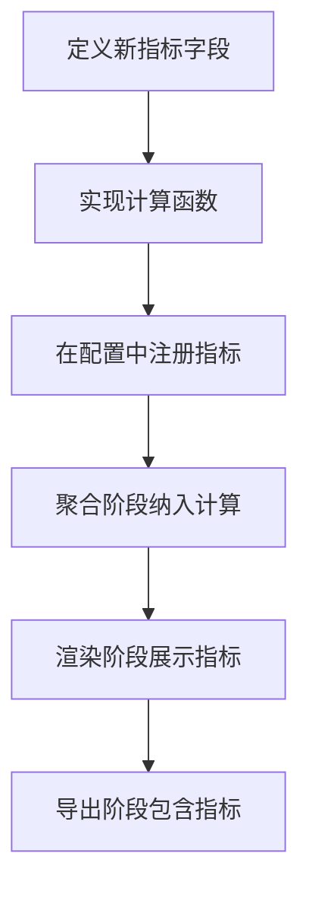
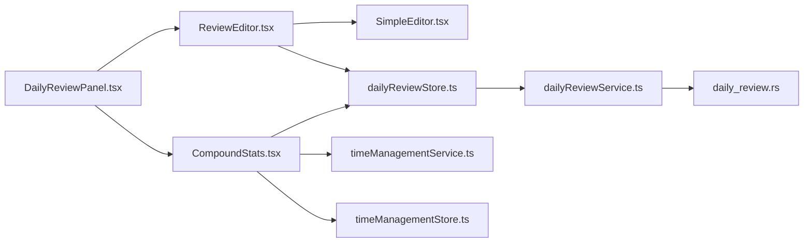

# 每日回顾系统

<cite>
**本文引用的文件**   
- [DailyReviewPanel.tsx](file://src/features/daily-review/DailyReviewPanel.tsx)
- [ReviewEditor.tsx](file://src/features/daily-review/ReviewEditor.tsx)
- [CompoundStats.tsx](file://src/features/daily-review/CompoundStats.tsx)
- [dailyReviewTypes.ts](file://src/features/daily-review/dailyReviewTypes.ts)
- [dailyReviewStore.ts](file://src/features/daily-review/dailyReviewStore.ts)
- [dailyReviewService.ts](file://src/features/daily-review/dailyReviewService.ts)
- [dailyReview.css](file://src/features/daily-review/dailyReview.css)
- [SimpleEditor.tsx](file://src/features/tiptap/SimpleEditor.tsx)
- [config.ts](file://src/features/tiptap/config.ts)
- [tiptap-utils.ts](file://src/lib/tiptap-utils.ts)
- [createSyncEngine.ts](file://src/lib/createSyncEngine.ts)
- [timeManagementStore.ts](file://src/features/time-management/timeManagementStore.ts)
- [timeManagementService.ts](file://src/features/time-management/timeManagementService.ts)
- [timeManagementTypes.ts](file://src/features/time-management/timeManagementTypes.ts)
- [daily_review.rs](file://src-tauri/src/daily_review.rs)
- [db.rs](file://src-tauri/src/db.rs)
- [schema.rs](file://src-tauri/src/schema.rs)
</cite>

## 目录
1. [简介](#简介)
2. [项目结构](#项目结构)
3. [核心组件](#核心组件)
4. [架构总览](#架构总览)
5. [详细组件分析](#详细组件分析)
6. [依赖关系分析](#依赖关系分析)
7. [性能考虑](#性能考虑)
8. [故障排查指南](#故障排查指南)
9. [结论](#结论)
10. [附录](#附录)

## 简介
本技术文档围绕“每日回顾系统”展开，聚焦以下目标：
- 回顾编辑器（ReviewEditor）与 TipTap 的集成方案、内容持久化与版本管理。
- 复合统计报告（CompoundStats）的多维度统计、图表渲染与数据导出逻辑。
- 回顾数据模型设计：回顾条目、统计数据、时间关联等数据结构。
- DailyReviewPanel 面板的布局设计与交互流程。
- 与时间管理系统的集成机制：任务完成情况自动汇总、成就统计生成。
- 数据同步策略：确保回顾数据与任务数据的实时一致性。
- 自定义统计指标的配置方法与扩展指南。
- 性能优化策略：大数据量下的渲染优化、缓存机制等。

## 项目结构
每日回顾系统位于前端 features 模块下，并与 Tauri 后端通过 Rust 服务进行数据持久化。关键目录与职责如下：
- src/features/daily-review：回顾功能的前端实现，包含面板、编辑器、统计与服务层。
- src/features/tiptap：富文本编辑器的通用能力封装与配置。
- src/lib：跨功能共享工具，包括 TiPTap 辅助函数与同步引擎。
- src/features/time-management：时间管理相关的数据与 UI，为回顾提供任务完成度等数据源。
- src-tauri/src：Rust 侧的数据库访问与 API 暴露，负责回顾与时间管理的持久化。

图示来源
- [DailyReviewPanel.tsx](file://src/features/daily-review/DailyReviewPanel.tsx)
- [ReviewEditor.tsx](file://src/features/daily-review/ReviewEditor.tsx)
- [CompoundStats.tsx](file://src/features/daily-review/CompoundStats.tsx)
- [dailyReviewTypes.ts](file://src/features/daily-review/dailyReviewTypes.ts)
- [dailyReviewStore.ts](file://src/features/daily-review/dailyReviewStore.ts)
- [dailyReviewService.ts](file://src/features/daily-review/dailyReviewService.ts)
- [SimpleEditor.tsx](file://src/features/tiptap/SimpleEditor.tsx)
- [config.ts](file://src/features/tiptap/config.ts)
- [tiptap-utils.ts](file://src/lib/tiptap-utils.ts)
- [timeManagementStore.ts](file://src/features/time-management/timeManagementStore.ts)
- [timeManagementService.ts](file://src/features/time-management/timeManagementService.ts)
- [timeManagementTypes.ts](file://src/features/time-management/timeManagementTypes.ts)
- [daily_review.rs](file://src-tauri/src/daily_review.rs)
- [db.rs](file://src-tauri/src/db.rs)
- [schema.rs](file://src-tauri/src/schema.rs)

章节来源
- [DailyReviewPanel.tsx](file://src/features/daily-review/DailyReviewPanel.tsx)
- [ReviewEditor.tsx](file://src/features/daily-review/ReviewEditor.tsx)
- [CompoundStats.tsx](file://src/features/daily-review/CompoundStats.tsx)
- [dailyReviewTypes.ts](file://src/features/daily-review/dailyReviewTypes.ts)
- [dailyReviewStore.ts](file://src/features/daily-review/dailyReviewStore.ts)
- [dailyReviewService.ts](file://src/features/daily-review/dailyReviewService.ts)
- [SimpleEditor.tsx](file://src/features/tiptap/SimpleEditor.tsx)
- [config.ts](file://src/features/tiptap/config.ts)
- [tiptap-utils.ts](file://src/lib/tiptap-utils.ts)
- [timeManagementStore.ts](file://src/features/time-management/timeManagementStore.ts)
- [timeManagementService.ts](file://src/features/time-management/timeManagementService.ts)
- [timeManagementTypes.ts](file://src/features/time-management/timeManagementTypes.ts)
- [daily_review.rs](file://src-tauri/src/daily_review.rs)
- [db.rs](file://src-tauri/src/db.rs)
- [schema.rs](file://src-tauri/src/schema.rs)

## 核心组件
- ReviewEditor：基于 TipTap 的富文本回顾编辑器，负责内容输入、格式化、保存与版本控制。
- CompoundStats：复合统计组件，聚合多维度数据并渲染图表，支持导出。
- DailyReviewPanel：回顾面板容器，编排编辑器与统计视图，处理用户交互与状态流转。
- dailyReviewStore：Zustand 状态管理，维护当前日期、回顾内容、统计结果与加载状态。
- dailyReviewService：与 Tauri 后端的通信层，负责 CRUD 与批量查询。
- timeManagementStore/service/types：时间管理数据源，为统计提供任务完成率、时长等指标。
- Tauri 后端（daily_review.rs/db.rs/schema.rs）：定义表结构与持久化接口。

章节来源
- [ReviewEditor.tsx](file://src/features/daily-review/ReviewEditor.tsx)
- [CompoundStats.tsx](file://src/features/daily-review/CompoundStats.tsx)
- [DailyReviewPanel.tsx](file://src/features/daily-review/DailyReviewPanel.tsx)
- [dailyReviewStore.ts](file://src/features/daily-review/dailyReviewStore.ts)
- [dailyReviewService.ts](file://src/features/daily-review/dailyReviewService.ts)
- [timeManagementStore.ts](file://src/features/time-management/timeManagementStore.ts)
- [timeManagementService.ts](file://src/features/time-management/timeManagementService.ts)
- [timeManagementTypes.ts](file://src/features/time-management/timeManagementTypes.ts)
- [daily_review.rs](file://src-tauri/src/daily_review.rs)
- [db.rs](file://src-tauri/src/db.rs)
- [schema.rs](file://src-tauri/src/schema.rs)

## 架构总览
整体采用“前端组件 + 状态管理 + 服务层 + Tauri 后端”的分层架构。UI 层由 DailyReviewPanel 组合 ReviewEditor 与 CompoundStats；状态由 dailyReviewStore 集中管理；数据读写经由 dailyReviewService 调用 Tauri 命令；Tauri 侧使用 db.rs 与 schema.rs 操作数据库。

图示来源
- [DailyReviewPanel.tsx](file://src/features/daily-review/DailyReviewPanel.tsx)
- [ReviewEditor.tsx](file://src/features/daily-review/ReviewEditor.tsx)
- [dailyReviewStore.ts](file://src/features/daily-review/dailyReviewStore.ts)
- [dailyReviewService.ts](file://src/features/daily-review/dailyReviewService.ts)
- [daily_review.rs](file://src-tauri/src/daily_review.rs)
- [db.rs](file://src-tauri/src/db.rs)
- [schema.rs](file://src-tauri/src/schema.rs)

## 详细组件分析

### 数据模型设计（回顾条目、统计数据、时间关联）
- 回顾条目：以日期为主键或唯一索引，包含富文本内容、版本号、创建/更新时间戳等字段。
- 统计数据：按日/周/月等多粒度聚合，包含任务完成率、专注时长、习惯打卡率、成就计数等。
- 时间关联：通过日期字段与时间管理系统中的任务、习惯数据进行关联，形成回顾与任务的映射。

图示来源
- [dailyReviewTypes.ts](file://src/features/daily-review/dailyReviewTypes.ts)
- [timeManagementTypes.ts](file://src/features/time-management/timeManagementTypes.ts)
- [schema.rs](file://src-tauri/src/schema.rs)

章节来源
- [dailyReviewTypes.ts](file://src/features/daily-review/dailyReviewTypes.ts)
- [timeManagementTypes.ts](file://src/features/time-management/timeManagementTypes.ts)
- [schema.rs](file://src-tauri/src/schema.rs)

### ReviewEditor 富文本编辑器集成方案
- 集成方式：ReviewEditor 基于 SimpleEditor 封装，复用 TipTap 配置与节点/标记扩展。
- TipTap 配置：在 config.ts 中声明扩展集合（标题、列表、代码块、引用、图片上传等），并通过 tiptap-utils.ts 提供初始化与工具方法。
- 内容持久化：编辑器变更时更新 store 中的内容快照；保存时通过 service 调用 Tauri 命令落库。
- 版本管理：每次保存递增版本号，避免覆盖他人修改；冲突检测可在保存前比较服务端版本。

图示来源
- [ReviewEditor.tsx](file://src/features/daily-review/ReviewEditor.tsx)
- [SimpleEditor.tsx](file://src/features/tiptap/SimpleEditor.tsx)
- [config.ts](file://src/features/tiptap/config.ts)
- [tiptap-utils.ts](file://src/lib/tiptap-utils.ts)
- [dailyReviewStore.ts](file://src/features/daily-review/dailyReviewStore.ts)
- [dailyReviewService.ts](file://src/features/daily-review/dailyReviewService.ts)

章节来源
- [ReviewEditor.tsx](file://src/features/daily-review/ReviewEditor.tsx)
- [SimpleEditor.tsx](file://src/features/tiptap/SimpleEditor.tsx)
- [config.ts](file://src/features/tiptap/config.ts)
- [tiptap-utils.ts](file://src/lib/tiptap-utils.ts)
- [dailyReviewStore.ts](file://src/features/daily-review/dailyReviewStore.ts)
- [dailyReviewService.ts](file://src/features/daily-review/dailyReviewService.ts)

### CompoundStats 复合统计组件
- 数据聚合：从 timeManagementStore/service 获取任务完成率、时长、习惯打卡等原始数据，按日/周/月聚合计算。
- 图表渲染：根据聚合结果生成多维指标（如完成率趋势、时长分布、习惯达成率），渲染到页面。
- 数据导出：将聚合后的结构化数据导出为 JSON/CSV，便于离线分析与归档。
- 联动更新：当时间管理数据变化时，重新计算并刷新统计视图。

图示来源
- [CompoundStats.tsx](file://src/features/daily-review/CompoundStats.tsx)
- [timeManagementStore.ts](file://src/features/time-management/timeManagementStore.ts)
- [timeManagementService.ts](file://src/features/time-management/timeManagementService.ts)
- [timeManagementTypes.ts](file://src/features/time-management/timeManagementTypes.ts)

章节来源
- [CompoundStats.tsx](file://src/features/daily-review/CompoundStats.tsx)
- [timeManagementStore.ts](file://src/features/time-management/timeManagementStore.ts)
- [timeManagementService.ts](file://src/features/time-management/timeManagementService.ts)
- [timeManagementTypes.ts](file://src/features/time-management/timeManagementTypes.ts)

### DailyReviewPanel 面板布局与交互
- 布局设计：左侧为 ReviewEditor，右侧为 CompoundStats，顶部提供日期选择与保存操作。
- 交互流程：切换日期时加载对应回顾与统计；编辑器保存成功后刷新统计；导出统计时触发下载。
- 样式组织：通过 dailyReview.css 统一布局与主题适配。

图示来源
- [DailyReviewPanel.tsx](file://src/features/daily-review/DailyReviewPanel.tsx)
- [dailyReview.css](file://src/features/daily-review/dailyReview.css)

章节来源
- [DailyReviewPanel.tsx](file://src/features/daily-review/DailyReviewPanel.tsx)
- [dailyReview.css](file://src/features/daily-review/dailyReview.css)

### 与时间管理系统的集成机制
- 自动汇总：根据时间管理中的任务状态与时长，自动计算完成率、专注时长等指标，供统计组件使用。
- 成就统计：基于连续打卡、达标天数等规则生成成就计数，展示在统计面板。
- 数据一致性：通过 createSyncEngine 与 store 订阅机制，保证回顾与任务数据的一致性。

图示来源
- [timeManagementStore.ts](file://src/features/time-management/timeManagementStore.ts)
- [timeManagementService.ts](file://src/features/time-management/timeManagementService.ts)
- [createSyncEngine.ts](file://src/lib/createSyncEngine.ts)
- [CompoundStats.tsx](file://src/features/daily-review/CompoundStats.tsx)

章节来源
- [timeManagementStore.ts](file://src/features/time-management/timeManagementStore.ts)
- [timeManagementService.ts](file://src/features/time-management/timeManagementService.ts)
- [createSyncEngine.ts](file://src/lib/createSyncEngine.ts)
- [CompoundStats.tsx](file://src/features/daily-review/CompoundStats.tsx)

### 数据同步策略
- 同步方向：时间管理数据 → 统计聚合 → 回顾面板显示；回顾保存 → 状态更新 → 统计刷新。
- 事件驱动：利用 store 的 subscribe 与 createSyncEngine 的 onUpdate，实现增量更新。
- 冲突处理：版本字段用于乐观锁；冲突时提示用户选择保留策略。

图示来源
- [createSyncEngine.ts](file://src/lib/createSyncEngine.ts)
- [dailyReviewStore.ts](file://src/features/daily-review/dailyReviewStore.ts)
- [DailyReviewPanel.tsx](file://src/features/daily-review/DailyReviewPanel.tsx)

章节来源
- [createSyncEngine.ts](file://src/lib/createSyncEngine.ts)
- [dailyReviewStore.ts](file://src/features/daily-review/dailyReviewStore.ts)
- [DailyReviewPanel.tsx](file://src/features/daily-review/DailyReviewPanel.tsx)

### 自定义统计指标的配置与扩展
- 指标定义：在类型文件中新增指标字段，并在聚合逻辑中增加计算分支。
- 配置入口：通过配置文件或 store 选项注入新的指标计算函数。
- 渲染扩展：在统计组件中为新指标添加图表项与导出字段。

图示来源
- [dailyReviewTypes.ts](file://src/features/daily-review/dailyReviewTypes.ts)
- [CompoundStats.tsx](file://src/features/daily-review/CompoundStats.tsx)

章节来源
- [dailyReviewTypes.ts](file://src/features/daily-review/dailyReviewTypes.ts)
- [CompoundStats.tsx](file://src/features/daily-review/CompoundStats.tsx)

## 依赖关系分析
- 组件耦合：DailyReviewPanel 强耦合 ReviewEditor 与 CompoundStats；二者通过 dailyReviewStore 解耦。
- 服务依赖：dailyReviewService 依赖 Tauri 命令；CompoundStats 依赖时间管理服务。
- 外部依赖：TipTap 扩展与图标组件；Tauri 后端数据库访问。

图示来源
- [DailyReviewPanel.tsx](file://src/features/daily-review/DailyReviewPanel.tsx)
- [ReviewEditor.tsx](file://src/features/daily-review/ReviewEditor.tsx)
- [CompoundStats.tsx](file://src/features/daily-review/CompoundStats.tsx)
- [dailyReviewStore.ts](file://src/features/daily-review/dailyReviewStore.ts)
- [dailyReviewService.ts](file://src/features/daily-review/dailyReviewService.ts)
- [SimpleEditor.tsx](file://src/features/tiptap/SimpleEditor.tsx)
- [timeManagementStore.ts](file://src/features/time-management/timeManagementStore.ts)
- [timeManagementService.ts](file://src/features/time-management/timeManagementService.ts)
- [daily_review.rs](file://src-tauri/src/daily_review.rs)

章节来源
- [DailyReviewPanel.tsx](file://src/features/daily-review/DailyReviewPanel.tsx)
- [ReviewEditor.tsx](file://src/features/daily-review/ReviewEditor.tsx)
- [CompoundStats.tsx](file://src/features/daily-review/CompoundStats.tsx)
- [dailyReviewStore.ts](file://src/features/daily-review/dailyReviewStore.ts)
- [dailyReviewService.ts](file://src/features/daily-review/dailyReviewService.ts)
- [SimpleEditor.tsx](file://src/features/tiptap/SimpleEditor.tsx)
- [timeManagementStore.ts](file://src/features/time-management/timeManagementStore.ts)
- [timeManagementService.ts](file://src/features/time-management/timeManagementService.ts)
- [daily_review.rs](file://src-tauri/src/daily_review.rs)

## 性能考虑
- 大数据量渲染优化：对统计图表进行分页/懒加载；使用虚拟滚动减少 DOM 节点数量。
- 缓存机制：对时间管理原始数据与聚合结果进行短期缓存，避免重复计算。
- 增量更新：通过 createSyncEngine 仅更新变更部分，降低重渲染开销。
- 编辑器性能：对 TipTap 内容进行节流保存，避免频繁 I/O。

[本节为通用指导，不直接分析具体文件]

## 故障排查指南
- 保存失败：检查 dailyReviewService 的错误处理与 Tauri 命令返回值；确认版本冲突提示是否正确。
- 统计异常：验证时间管理数据完整性；检查聚合函数的边界条件与空值处理。
- 同步不同步：确认 createSyncEngine 的事件订阅是否生效；检查 store 的更新回调是否触发。

章节来源
- [dailyReviewService.ts](file://src/features/daily-review/dailyReviewService.ts)
- [daily_review.rs](file://src-tauri/src/daily_review.rs)
- [createSyncEngine.ts](file://src/lib/createSyncEngine.ts)
- [dailyReviewStore.ts](file://src/features/daily-review/dailyReviewStore.ts)

## 结论
每日回顾系统通过清晰的组件分层与状态管理，实现了回顾编辑、统计聚合与数据同步的核心能力。结合 TipTap 的灵活性与 Tauri 的本地持久化，系统在用户体验与数据一致性方面具备良好表现。后续可进一步引入更丰富的统计指标与可视化方案，并持续优化大数据量场景下的性能。

[本节为总结性内容，不直接分析具体文件]

## 附录
- 样式文件：dailyReview.css 提供布局与主题适配。
- 类型定义：dailyReviewTypes.ts 与 timeManagementTypes.ts 明确数据结构契约。
- 后端接口：daily_review.rs 暴露 Tauri 命令，db.rs 与 schema.rs 定义数据库访问与表结构。

章节来源
- [dailyReview.css](file://src/features/daily-review/dailyReview.css)
- [dailyReviewTypes.ts](file://src/features/daily-review/dailyReviewTypes.ts)
- [timeManagementTypes.ts](file://src/features/time-management/timeManagementTypes.ts)
- [daily_review.rs](file://src-tauri/src/daily_review.rs)
- [db.rs](file://src-tauri/src/db.rs)
- [schema.rs](file://src-tauri/src/schema.rs)