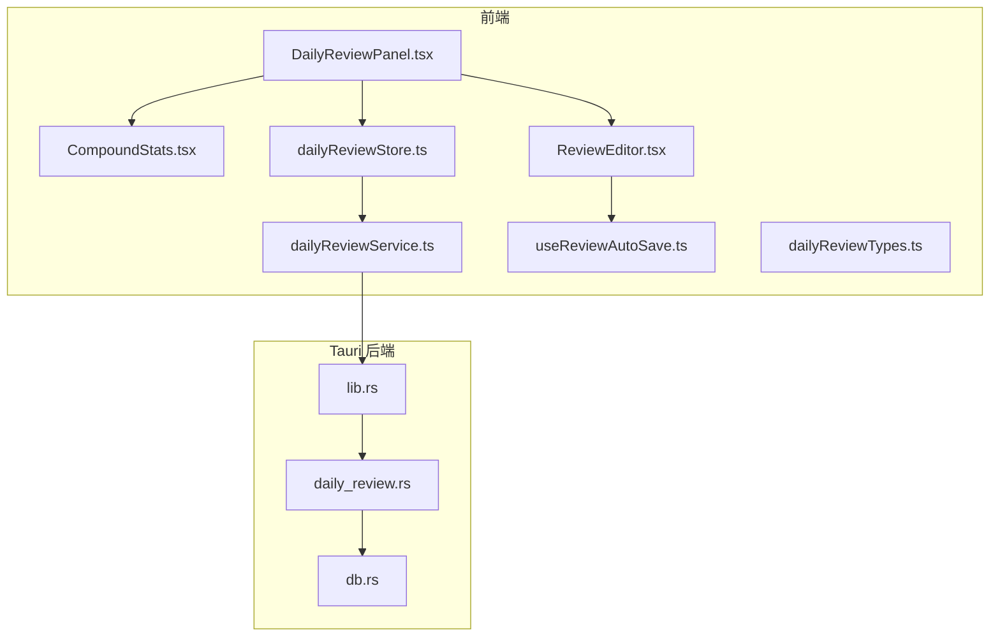
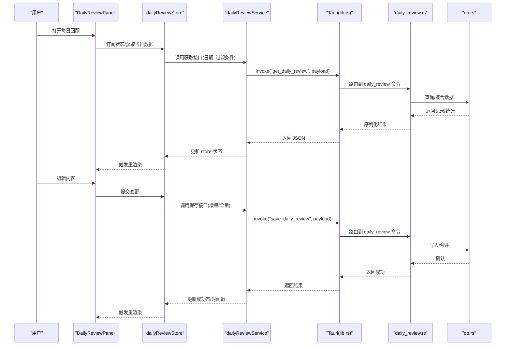
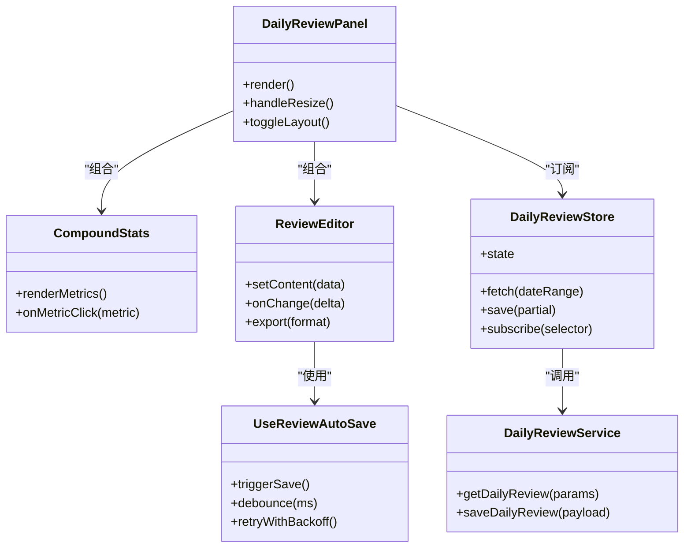
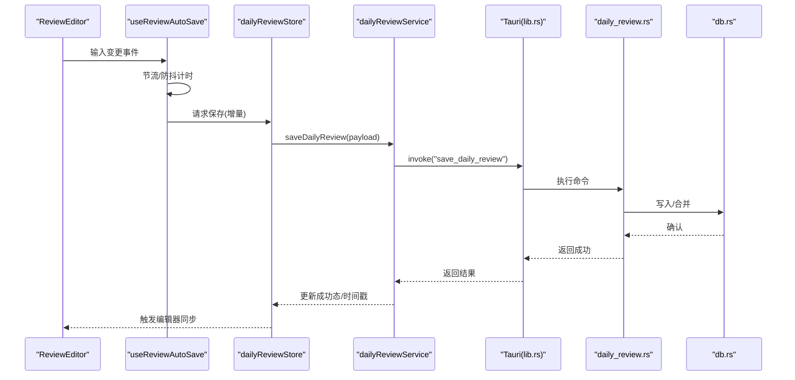
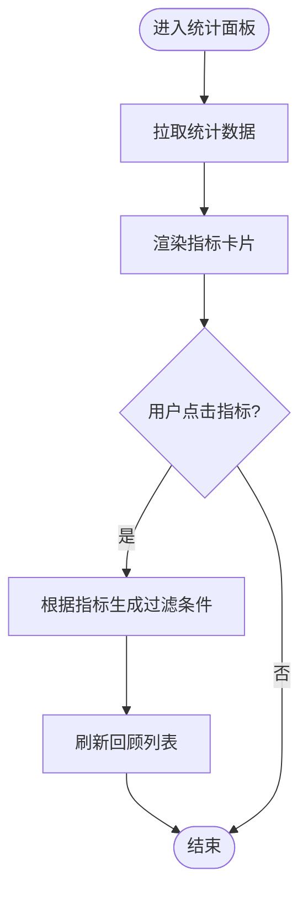
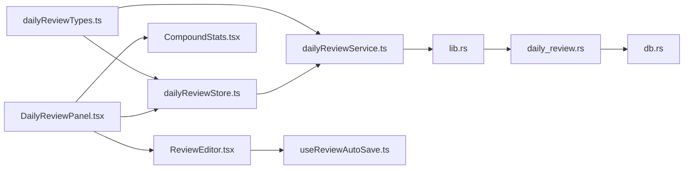

# 每日回顾系统

<cite>
**本文引用的文件**   
- [DailyReviewPanel.tsx](file://src/features/daily-review/DailyReviewPanel.tsx)
- [CompoundStats.tsx](file://src/features/daily-review/CompoundStats.tsx)
- [ReviewEditor.tsx](file://src/features/daily-review/ReviewEditor.tsx)
- [dailyReviewService.ts](file://src/features/daily-review/dailyReviewService.ts)
- [dailyReviewStore.ts](file://src/features/daily-review/dailyReviewStore.ts)
- [dailyReviewTypes.ts](file://src/features/daily-review/dailyReviewTypes.ts)
- [useReviewAutoSave.ts](file://src/features/daily-review/useReviewAutoSave.ts)
- [daily_review.rs](file://src-tauri/src/daily_review.rs)
- [db.rs](file://src-tauri/src/db.rs)
- [lib.rs](file://src-tauri/src/lib.rs)
</cite>

## 目录
1. [简介](#简介)
2. [项目结构](#项目结构)
3. [核心组件](#核心组件)
4. [架构总览](#架构总览)
5. [详细组件分析](#详细组件分析)
6. [依赖关系分析](#依赖关系分析)
7. [性能考虑](#性能考虑)
8. [故障排查指南](#故障排查指南)
9. [结论](#结论)
10. [附录](#附录)

## 简介
本技术文档围绕“每日回顾”功能，系统性阐述其前端实现、状态管理、自动保存机制、复合统计展示与响应式面板布局；同时覆盖数据模型设计、前后端通信与同步策略、错误处理方案、性能优化建议以及扩展方式。目标是帮助开发者快速理解并在此基础上进行二次开发或集成。

## 项目结构
每日回顾功能位于 features 目录下，采用“按特性组织”的模块划分方式，包含视图、服务、状态、类型与自定义 Hook 等职责清晰的子文件。后端通过 Tauri 暴露 Rust 命令，使用本地数据库持久化数据。

图表来源
- [DailyReviewPanel.tsx](file://src/features/daily-review/DailyReviewPanel.tsx)
- [CompoundStats.tsx](file://src/features/daily-review/CompoundStats.tsx)
- [ReviewEditor.tsx](file://src/features/daily-review/ReviewEditor.tsx)
- [dailyReviewStore.ts](file://src/features/daily-review/dailyReviewStore.ts)
- [dailyReviewService.ts](file://src/features/daily-review/dailyReviewService.ts)
- [useReviewAutoSave.ts](file://src/features/daily-review/useReviewAutoSave.ts)
- [dailyReviewTypes.ts](file://src/features/daily-review/dailyReviewTypes.ts)
- [lib.rs](file://src-tauri/src/lib.rs)
- [daily_review.rs](file://src-tauri/src/daily_review.rs)
- [db.rs](file://src-tauri/src/db.rs)

章节来源
- [DailyReviewPanel.tsx](file://src/features/daily-review/DailyReviewPanel.tsx)
- [dailyReviewStore.ts](file://src/features/daily-review/dailyReviewStore.ts)
- [dailyReviewService.ts](file://src/features/daily-review/dailyReviewService.ts)
- [dailyReviewTypes.ts](file://src/features/daily-review/dailyReviewTypes.ts)
- [useReviewAutoSave.ts](file://src/features/daily-review/useReviewAutoSave.ts)
- [lib.rs](file://src-tauri/src/lib.rs)
- [daily_review.rs](file://src-tauri/src/daily_review.rs)
- [db.rs](file://src-tauri/src/db.rs)

## 核心组件
- 视图层
  - DailyReviewPanel：负责整体布局、响应式切换（侧边/全屏）、聚合统计与编辑器容器挂载。
  - CompoundStats：渲染多维度的汇总指标卡片，支持点击筛选与联动刷新。
  - ReviewEditor：封装富文本编辑能力，承载用户输入并与自动保存 Hook 协作。
- 状态与服务
  - dailyReviewStore：基于状态库维护当日回顾数据、加载态、错误态与操作结果。
  - dailyReviewService：封装对后端的调用，统一请求参数与错误映射。
  - useReviewAutoSave：节流/防抖触发保存，避免频繁写入，保障体验与稳定性。
- 类型定义
  - dailyReviewTypes：统一定义前后端交互的数据结构与枚举值，确保类型安全。

章节来源
- [DailyReviewPanel.tsx](file://src/features/daily-review/DailyReviewPanel.tsx)
- [CompoundStats.tsx](file://src/features/daily-review/CompoundStats.tsx)
- [ReviewEditor.tsx](file://src/features/daily-review/ReviewEditor.tsx)
- [dailyReviewStore.ts](file://src/features/daily-review/dailyReviewStore.ts)
- [dailyReviewService.ts](file://src/features/daily-review/dailyReviewService.ts)
- [dailyReviewTypes.ts](file://src/features/daily-review/dailyReviewTypes.ts)
- [useReviewAutoSave.ts](file://src/features/daily-review/useReviewAutoSave.ts)

## 架构总览
每日回顾采用“前端特性模块 + Tauri 命令 + 本地数据库”的分层架构。前端以 Store 为中心驱动 UI，服务层屏蔽网络/IPC 细节，Hook 提供可复用的行为（如自动保存）。后端通过 Tauri 暴露命令，读写本地数据库，保证离线可用与低延迟。

图表来源
- [DailyReviewPanel.tsx](file://src/features/daily-review/DailyReviewPanel.tsx)
- [dailyReviewStore.ts](file://src/features/daily-review/dailyReviewStore.ts)
- [dailyReviewService.ts](file://src/features/daily-review/dailyReviewService.ts)
- [lib.rs](file://src-tauri/src/lib.rs)
- [daily_review.rs](file://src-tauri/src/daily_review.rs)
- [db.rs](file://src-tauri/src/db.rs)

## 详细组件分析

### 数据模型与类型
- 领域实体
  - 回顾条目：包含日期、标题、正文、标签、创建/更新时间等字段。
  - 统计维度：按日期、标签、完成度等多维聚合结果。
- 交互契约
  - 请求体：日期范围、过滤条件、分页/排序参数。
  - 响应体：数据列表、统计对象、元信息（是否首次加载、是否有更多等）。
- 类型约束
  - 使用统一类型文件集中声明，前后端保持一致命名与语义。

章节来源
- [dailyReviewTypes.ts](file://src/features/daily-review/dailyReviewTypes.ts)

### 状态管理策略
- 状态分层
  - 基础数据：当日回顾内容、历史列表、统计结果。
  - 控制态：加载、错误、保存中、撤销/重做栈指针等。
- 更新策略
  - 乐观更新：编辑时立即反映到 UI，后台异步保存，失败回滚。
  - 增量同步：仅发送变更片段，减少传输体积。
- 订阅与选择器
  - 组件按需订阅最小状态切片，避免不必要重渲染。

章节来源
- [dailyReviewStore.ts](file://src/features/daily-review/dailyReviewStore.ts)

### 自动保存机制
- 触发时机
  - 用户停止输入后延时触发，或在页面卸载前强制保存。
- 去重与合并
  - 基于时间戳与版本号合并，避免覆盖远端最新变更。
- 失败重试
  - 指数退避重试，结合用户可见的错误提示与恢复入口。

章节来源
- [useReviewAutoSave.ts](file://src/features/daily-review/useReviewAutoSave.ts)

### 复合统计展示
- 指标维度
  - 日/周/月累计、完成率、标签分布、趋势折线等。
- 交互联动
  - 点击统计卡片可下钻至对应日期或标签的回顾列表。
- 计算策略
  - 前端轻量聚合用于即时反馈，复杂聚合由后端提供预计算结果。

章节来源
- [CompoundStats.tsx](file://src/features/daily-review/CompoundStats.tsx)
- [dailyReviewStore.ts](file://src/features/daily-review/dailyReviewStore.ts)

### 响应式面板布局
- 断点适配
  - 小屏默认折叠为抽屉/底部面板，大屏显示侧边栏+主内容区。
- 手势与键盘
  - 支持拖拽展开/收起、ESC 关闭、Tab 导航等无障碍交互。
- 性能优化
  - 非首屏区域懒加载，统计图表按需初始化。

章节来源
- [DailyReviewPanel.tsx](file://src/features/daily-review/DailyReviewPanel.tsx)

### 编辑器与富文本
- 能力边界
  - 支持段落、列表、引用、代码块、图片等常用节点。
- 与自动保存协作
  - 编辑器变更事件节流上报，避免高频写入。
- 导出与导入
  - 支持 Markdown/JSON 格式互转，便于迁移与备份。

章节来源
- [ReviewEditor.tsx](file://src/features/daily-review/ReviewEditor.tsx)

### 前后端通信与同步逻辑
- 通信通道
  - 通过 Tauri 命令在 JS 与 Rust 之间传递结构化数据。
- 幂等与一致性
  - 服务端对保存操作进行幂等校验，客户端携带版本/时间戳参与冲突解决。
- 错误映射
  - 将底层异常转换为业务友好的错误码与消息，统一在 Store 层处理。

章节来源
- [dailyReviewService.ts](file://src/features/daily-review/dailyReviewService.ts)
- [lib.rs](file://src-tauri/src/lib.rs)
- [daily_review.rs](file://src-tauri/src/daily_review.rs)
- [db.rs](file://src-tauri/src/db.rs)

### 类图（前端组件与状态）

图表来源
- [DailyReviewPanel.tsx](file://src/features/daily-review/DailyReviewPanel.tsx)
- [CompoundStats.tsx](file://src/features/daily-review/CompoundStats.tsx)
- [ReviewEditor.tsx](file://src/features/daily-review/ReviewEditor.tsx)
- [dailyReviewStore.ts](file://src/features/daily-review/dailyReviewStore.ts)
- [dailyReviewService.ts](file://src/features/daily-review/dailyReviewService.ts)
- [useReviewAutoSave.ts](file://src/features/daily-review/useReviewAutoSave.ts)

### 序列图（自动保存流程）

图表来源
- [ReviewEditor.tsx](file://src/features/daily-review/ReviewEditor.tsx)
- [useReviewAutoSave.ts](file://src/features/daily-review/useReviewAutoSave.ts)
- [dailyReviewStore.ts](file://src/features/daily-review/dailyReviewStore.ts)
- [dailyReviewService.ts](file://src/features/daily-review/dailyReviewService.ts)
- [lib.rs](file://src-tauri/src/lib.rs)
- [daily_review.rs](file://src-tauri/src/daily_review.rs)
- [db.rs](file://src-tauri/src/db.rs)

### 流程图（统计计算与下钻）

图表来源
- [CompoundStats.tsx](file://src/features/daily-review/CompoundStats.tsx)
- [dailyReviewStore.ts](file://src/features/daily-review/dailyReviewStore.ts)

## 依赖关系分析
- 内聚性
  - 每日回顾模块内部高内聚，对外仅暴露少量 API（Store 方法、服务函数）。
- 耦合度
  - 视图与状态解耦，通过选择器订阅最小状态切片；服务层屏蔽 IPC 细节。
- 外部依赖
  - Tauri 命令作为唯一后端入口，数据库访问集中在 db.rs，降低跨层耦合。

图表来源
- [dailyReviewTypes.ts](file://src/features/daily-review/dailyReviewTypes.ts)
- [dailyReviewStore.ts](file://src/features/daily-review/dailyReviewStore.ts)
- [dailyReviewService.ts](file://src/features/daily-review/dailyReviewService.ts)
- [DailyReviewPanel.tsx](file://src/features/daily-review/DailyReviewPanel.tsx)
- [CompoundStats.tsx](file://src/features/daily-review/CompoundStats.tsx)
- [ReviewEditor.tsx](file://src/features/daily-review/ReviewEditor.tsx)
- [useReviewAutoSave.ts](file://src/features/daily-review/useReviewAutoSave.ts)
- [lib.rs](file://src-tauri/src/lib.rs)
- [daily_review.rs](file://src-tauri/src/daily_review.rs)
- [db.rs](file://src-tauri/src/db.rs)

章节来源
- [dailyReviewTypes.ts](file://src/features/daily-review/dailyReviewTypes.ts)
- [dailyReviewStore.ts](file://src/features/daily-review/dailyReviewStore.ts)
- [dailyReviewService.ts](file://src/features/daily-review/dailyReviewService.ts)
- [DailyReviewPanel.tsx](file://src/features/daily-review/DailyReviewPanel.tsx)
- [CompoundStats.tsx](file://src/features/daily-review/CompoundStats.tsx)
- [ReviewEditor.tsx](file://src/features/daily-review/ReviewEditor.tsx)
- [useReviewAutoSave.ts](file://src/features/daily-review/useReviewAutoSave.ts)
- [lib.rs](file://src-tauri/src/lib.rs)
- [daily_review.rs](file://src-tauri/src/daily_review.rs)
- [db.rs](file://src-tauri/src/db.rs)

## 性能考虑
- 渲染优化
  - 使用选择器订阅最小状态切片，避免整树重渲染。
  - 大列表虚拟滚动，统计图表按需初始化。
- 存储优化
  - 增量保存与压缩传输，减少 IPC 开销。
  - 本地缓存最近 N 条记录，提升冷启动速度。
- 计算优化
  - 复杂统计由后端预计算，前端只做轻量聚合与展示。
- 资源加载
  - 编辑器与第三方插件按需动态导入，首屏更快。

[本节为通用指导，不直接分析具体文件]

## 故障排查指南
- 常见问题
  - 自动保存失败：检查节流间隔、重试次数与网络/IPC 错误码。
  - 统计不准确：核对过滤条件与后端聚合口径是否一致。
  - 布局错乱：验证断点阈值与容器尺寸监听是否正确。
- 定位手段
  - 在 Store 层打印关键状态快照与变更日志。
  - 在后端命令入口记录入参/出参与耗时。
- 恢复策略
  - 提供“重新拉取”和“本地回滚”按钮，允许用户从最近有效快照恢复。

章节来源
- [dailyReviewStore.ts](file://src/features/daily-review/dailyReviewStore.ts)
- [dailyReviewService.ts](file://src/features/daily-review/dailyReviewService.ts)
- [daily_review.rs](file://src-tauri/src/daily_review.rs)

## 结论
每日回顾系统以清晰的前后端分层、稳健的状态管理与可靠的自动保存为核心，配合复合统计与响应式布局，提供了良好的用户体验与可扩展性。建议在后续迭代中持续完善错误可视化、数据一致性校验与性能监控，以便更好地支撑大规模使用场景。

[本节为总结性内容，不直接分析具体文件]

## 附录
- 配置选项（示例）
  - 自动保存间隔：毫秒数，建议 1~3 秒。
  - 重试策略：最大重试次数与退避系数。
  - 统计维度：启用/禁用特定指标，控制渲染成本。
- 使用示例（步骤）
  - 打开每日回顾面板，等待数据加载。
  - 编辑内容，观察自动保存指示器。
  - 点击统计卡片，查看对应日期的回顾列表。
  - 在小屏设备上测试抽屉/全屏切换与手势。

[本节为概念性说明，不直接分析具体文件]