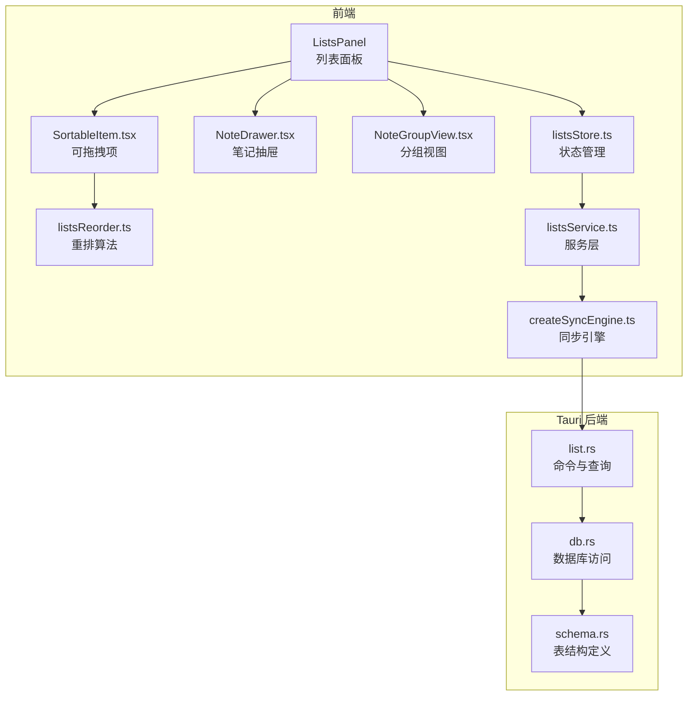
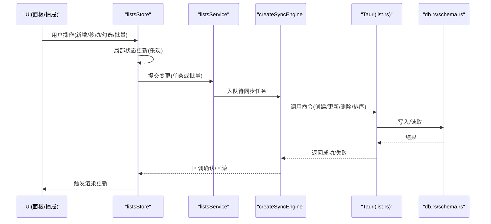
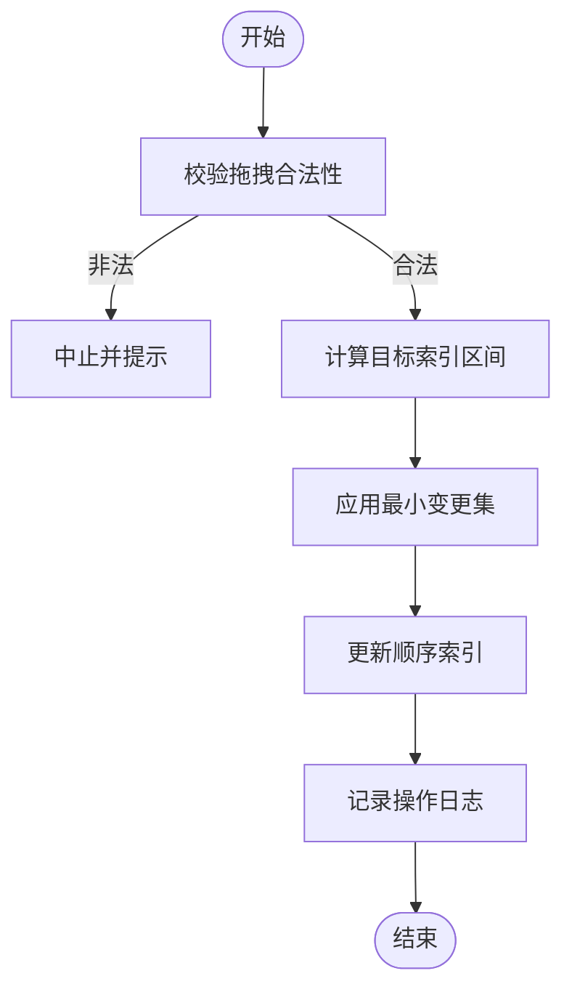
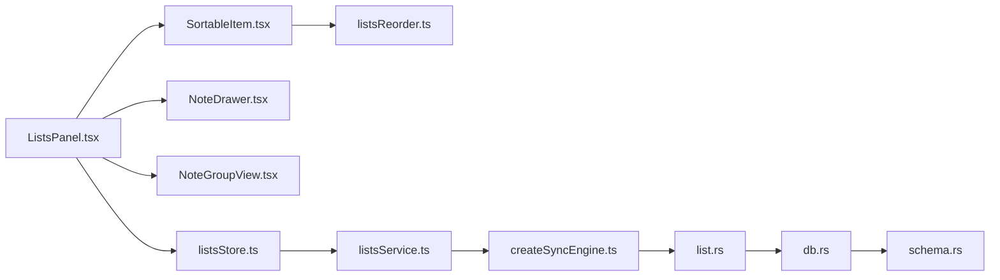

# 清单管理系统

<cite>
**本文引用的文件**   
- [src/features/lists/ListsPanel.tsx](file://src/features/lists/ListsPanel.tsx)
- [src/features/lists/NoteDrawer.tsx](file://src/features/lists/NoteDrawer.tsx)
- [src/features/lists/NoteGroupView.tsx](file://src/features/lists/NoteGroupView.tsx)
- [src/features/lists/SortableItem.tsx](file://src/features/lists/SortableItem.tsx)
- [src/features/lists/listsReorder.ts](file://src/features/lists/listsReorder.ts)
- [src/features/lists/listsStore.ts](file://src/features/lists/listsStore.ts)
- [src/features/lists/listsService.ts](file://src/features/lists/listsService.ts)
- [src/features/lists/listsTypes.ts](file://src/features/lists/listsTypes.ts)
- [src/lib/createSyncEngine.ts](file://src/lib/createSyncEngine.ts)
- [src-tauri/src/list.rs](file://src-tauri/src/list.rs)
- [src-tauri/src/db.rs](file://src-tauri/src/db.rs)
- [src-tauri/src/schema.rs](file://src-tauri/src/schema.rs)
- [src-tauri/Cargo.toml](file://src-tauri/Cargo.toml)
- [src-tauri/tauri.conf.json](file://src-tauri/tauri.conf.json)
</cite>

## 目录
1. [简介](#简介)
2. [项目结构](#项目结构)
3. [核心组件](#核心组件)
4. [架构总览](#架构总览)
5. [详细组件分析](#详细组件分析)
6. [依赖关系分析](#依赖关系分析)
7. [性能考虑](#性能考虑)
8. [故障排查指南](#故障排查指南)
9. [结论](#结论)
10. [附录：API 接口与集成指南](#附录api-接口与集成指南)

## 简介
本技术文档围绕“清单管理系统”的前后端实现进行深入解析，重点覆盖以下方面：
- 清单的层次结构设计（文件夹、子清单、嵌套条目）
- 拖拽排序算法的实现与边界处理
- 批量操作能力（多选、批量移动、批量删除等）
- 列表面板的状态管理（列表树、选中态、展开/折叠）
- 笔记抽屉的交互逻辑（打开/关闭、编辑、保存、同步）
- 分组视图的数据组织方式（按标签/日期/自定义维度）
- 前后端数据同步机制（Tauri + Rust 后端 + 本地数据库）
- 本地存储策略与冲突解决（版本戳、乐观更新、回滚）
- 复杂业务场景（嵌套清单、权限控制、并发冲突）
- API 接口说明与集成开发指南

## 项目结构
清单功能位于前端 features/lists 模块，配合 Tauri 后端 list.rs 提供持久化能力。整体采用“状态集中管理 + 服务层封装 + 引擎驱动同步”的分层架构。

图表来源
- [src/features/lists/ListsPanel.tsx](file://src/features/lists/ListsPanel.tsx)
- [src/features/lists/listsStore.ts](file://src/features/lists/listsStore.ts)
- [src/features/lists/NoteDrawer.tsx](file://src/features/lists/NoteDrawer.tsx)
- [src/features/lists/NoteGroupView.tsx](file://src/features/lists/NoteGroupView.tsx)
- [src/features/lists/SortableItem.tsx](file://src/features/lists/SortableItem.tsx)
- [src/features/lists/listsReorder.ts](file://src/features/lists/listsReorder.ts)
- [src/features/lists/listsService.ts](file://src/features/lists/listsService.ts)
- [src/lib/createSyncEngine.ts](file://src/lib/createSyncEngine.ts)
- [src-tauri/src/list.rs](file://src-tauri/src/list.rs)
- [src-tauri/src/db.rs](file://src-tauri/src/db.rs)
- [src-tauri/src/schema.rs](file://src-tauri/src/schema.rs)

章节来源
- [src/features/lists/ListsPanel.tsx](file://src/features/lists/ListsPanel.tsx)
- [src/features/lists/listsStore.ts](file://src/features/lists/listsStore.ts)
- [src/features/lists/listsService.ts](file://src/features/lists/listsService.ts)
- [src/lib/createSyncEngine.ts](file://src/lib/createSyncEngine.ts)
- [src-tauri/src/list.rs](file://src-tauri/src/list.rs)
- [src-tauri/src/db.rs](file://src-tauri/src/db.rs)
- [src-tauri/src/schema.rs](file://src-tauri/src/schema.rs)

## 核心组件
- 列表面板 ListsPanel：承载清单树、搜索过滤、批量选择、视图切换（列表/分组）、打开笔记抽屉等。
- 状态管理 listsStore：维护清单树、选中集合、当前视图模式、加载与错误状态；提供增删改查、排序、分组、批量操作的原子方法。
- 服务层 listsService：封装对后端的调用，统一错误处理与重试策略，暴露 Promise 风格的 API。
- 同步引擎 createSyncEngine：负责本地缓存、增量同步、冲突检测与合并、失败回滚。
- 拖拽排序 SortableItem + listsReorder：基于索引的重排算法，支持跨层级移动与边界保护。
- 笔记抽屉 NoteDrawer：编辑区、自动保存、撤销/重做、与 store 双向绑定。
- 分组视图 NoteGroupView：按维度聚合展示，保持与列表树一致的数据源。

章节来源
- [src/features/lists/ListsPanel.tsx](file://src/features/lists/ListsPanel.tsx)
- [src/features/lists/listsStore.ts](file://src/features/lists/listsStore.ts)
- [src/features/lists/listsService.ts](file://src/features/lists/listsService.ts)
- [src/lib/createSyncEngine.ts](file://src/lib/createSyncEngine.ts)
- [src/features/lists/SortableItem.tsx](file://src/features/lists/SortableItem.tsx)
- [src/features/lists/listsReorder.ts](file://src/features/lists/listsReorder.ts)
- [src/features/lists/NoteDrawer.tsx](file://src/features/lists/NoteDrawer.tsx)
- [src/features/lists/NoteGroupView.tsx](file://src/features/lists/NoteGroupView.tsx)

## 架构总览
系统采用“前端状态集中 + 服务层 + 同步引擎 + Tauri 后端 + 本地数据库”的分层设计。前端通过 store 驱动 UI，服务层屏蔽网络细节，同步引擎保证一致性，Rust 后端提供稳定可靠的持久化能力。

图表来源
- [src/features/lists/listsStore.ts](file://src/features/lists/listsStore.ts)
- [src/features/lists/listsService.ts](file://src/features/lists/listsService.ts)
- [src/lib/createSyncEngine.ts](file://src/lib/createSyncEngine.ts)
- [src-tauri/src/list.rs](file://src-tauri/src/list.rs)
- [src-tauri/src/db.rs](file://src-tauri/src/db.rs)
- [src-tauri/src/schema.rs](file://src-tauri/src/schema.rs)

## 详细组件分析

### 清单层次结构与数据模型
- 数据结构
  - 节点类型：文件夹、清单、条目（文本/复选框/富文本等）
  - 字段要点：唯一标识、父级引用、层级深度、顺序索引、可见性、权限标记、时间戳、版本戳
- 树形组织
  - 使用扁平数组 + 父级 ID 构建虚拟树，便于批量更新与排序
  - 提供快速查找映射（id -> index）以优化遍历与定位
- 复杂度
  - 插入/删除/移动：O(n) 最坏（需调整后续索引），可通过延迟批处理降低抖动
  - 查找：O(1) 平均（哈希映射）
  - 渲染：按需虚拟化（大列表时建议）

章节来源
- [src/features/lists/listsTypes.ts](file://src/features/lists/listsTypes.ts)
- [src/features/lists/listsStore.ts](file://src/features/lists/listsStore.ts)

### 拖拽排序算法实现
- 输入：被拖拽节点 id、目标位置（前/后/作为子项）、目标容器 id
- 步骤
  1) 校验合法性（不可拖拽到自身或其子树内）
  2) 计算新索引区间，避免越界
  3) 生成最小变更集（仅移动受影响片段）
  4) 应用变更并更新顺序索引
  5) 记录操作日志用于撤销/回滚
- 边界处理
  - 空容器、首尾插入、跨层级移动、重复 id 防护
- 性能
  - 使用 diff 最小化重绘
  - 批量移动合并为一次提交

图表来源
- [src/features/lists/SortableItem.tsx](file://src/features/lists/SortableItem.tsx)
- [src/features/lists/listsReorder.ts](file://src/features/lists/listsReorder.ts)
- [src/features/lists/listsStore.ts](file://src/features/lists/listsStore.ts)

章节来源
- [src/features/lists/SortableItem.tsx](file://src/features/lists/SortableItem.tsx)
- [src/features/lists/listsReorder.ts](file://src/features/lists/listsReorder.ts)
- [src/features/lists/listsStore.ts](file://src/features/lists/listsStore.ts)

### 批量操作功能
- 能力范围
  - 多选：全选/反选/范围选择
  - 批量移动：将多个节点移动到同一父节点下
  - 批量删除：带二次确认与撤销
  - 批量属性修改：如打标签、设置完成状态
- 实现要点
  - 在 store 中维护选中集合，渲染层只读
  - 批量操作转换为一系列原子变更，进入同步队列
  - 失败时按逆序回滚，保证最终一致性
- 用户体验
  - 操作进行中禁用相关控件
  - 进度反馈与错误提示

章节来源
- [src/features/lists/listsStore.ts](file://src/features/lists/listsStore.ts)
- [src/features/lists/listsService.ts](file://src/features/lists/listsService.ts)
- [src/lib/createSyncEngine.ts](file://src/lib/createSyncEngine.ts)

### 列表面板状态管理
- 状态划分
  - 数据：清单树、分组索引、搜索词
  - 交互：选中集合、展开/折叠、当前视图模式
  - 运行期：加载态、错误态、撤销栈
- 更新策略
  - 乐观更新：先更新本地状态，再异步同步
  - 失败回滚：从撤销栈恢复
  - 增量渲染：仅更新变化节点
- 性能优化
  - 防抖/节流：搜索、滚动、输入
  - 虚拟列表：大数据量时启用
  - 惰性加载：按需拉取深层节点

章节来源
- [src/features/lists/ListsPanel.tsx](file://src/features/lists/ListsPanel.tsx)
- [src/features/lists/listsStore.ts](file://src/features/lists/listsStore.ts)

### 笔记抽屉交互逻辑
- 生命周期
  - 打开：根据选中节点加载内容，初始化编辑器
  - 编辑：实时监听变更，进入自动保存
  - 关闭：未保存提示、强制保存或丢弃
- 与 store 的绑定
  - 双向绑定：编辑内容变更 -> store 更新 -> 同步引擎入队
  - 冲突处理：服务端版本高于本地时，提示保留本地/覆盖
- 可用性
  - 快捷键支持（保存、关闭）
  - 离线可用：本地缓存，联网后补同步

章节来源
- [src/features/lists/NoteDrawer.tsx](file://src/features/lists/NoteDrawer.tsx)
- [src/features/lists/listsStore.ts](file://src/features/lists/listsStore.ts)
- [src/lib/createSyncEngine.ts](file://src/lib/createSyncEngine.ts)

### 分组视图的数据组织
- 分组维度
  - 按标签、按日期、按父节点、自定义规则
- 数据流
  - 从清单树派生分组索引（内存计算）
  - 分组项点击跳转至对应节点
- 一致性
  - 分组视图与列表视图共享同一数据源
  - 任何变更均触发分组索引重建（增量优化）

章节来源
- [src/features/lists/NoteGroupView.tsx](file://src/features/lists/NoteGroupView.tsx)
- [src/features/lists/listsStore.ts](file://src/features/lists/listsStore.ts)

### 前后端数据同步机制
- 流程
  - 前端 store 产生变更 -> 服务层封装 -> 同步引擎入队 -> Tauri 命令 -> 数据库持久化
- 可靠性
  - 幂等键：每个写操作携带幂等标识，防止重复提交
  - 版本号：服务端返回最新版本，客户端比较后决定是否合并
  - 重试与退避：指数退避 + 最大重试次数
- 冲突解决
  - 字段级合并策略（最后写入优先/时间戳优先/人工介入）
  - 冲突队列：无法自动合并时进入冲突队列，等待用户决策

章节来源
- [src/features/lists/listsService.ts](file://src/features/lists/listsService.ts)
- [src/lib/createSyncEngine.ts](file://src/lib/createSyncEngine.ts)
- [src-tauri/src/list.rs](file://src-tauri/src/list.rs)
- [src-tauri/src/db.rs](file://src-tauri/src/db.rs)

### 本地存储策略
- 存储介质
  - 本地 SQLite（通过 Tauri 后端访问）
- 策略
  - 读写分离：读走本地缓存，写走后端并落库
  - 增量同步：仅传输差异
  - 断点续传：中断后可继续
- 安全
  - 敏感字段加密（可选）
  - 备份与恢复（导出/导入）

章节来源
- [src-tauri/src/db.rs](file://src-tauri/src/db.rs)
- [src-tauri/src/schema.rs](file://src-tauri/src/schema.rs)
- [src-tauri/tauri.conf.json](file://src-tauri/tauri.conf.json)

### 复杂业务场景处理
- 嵌套清单
  - 限制嵌套深度，避免过深导致性能问题
  - 移动时递归校验祖先关系，防止循环引用
- 权限控制
  - 节点级权限位：查看/编辑/分享/删除
  - 渲染层根据权限隐藏/禁用操作
  - 服务端校验权限后再执行写操作
- 冲突解决
  - 乐观锁：基于版本号的更新
  - 冲突检测：当本地版本落后于服务端时触发合并流程
  - 用户介入：提供对比视图与一键合并

章节来源
- [src/features/lists/listsStore.ts](file://src/features/lists/listsStore.ts)
- [src/features/lists/listsService.ts](file://src/features/lists/listsService.ts)
- [src-tauri/src/list.rs](file://src-tauri/src/list.rs)

## 依赖关系分析
- 前端内部依赖
  - ListsPanel 依赖 listsStore、NoteDrawer、NoteGroupView、SortableItem
  - listsStore 依赖 listsService、createSyncEngine
  - SortableItem 依赖 listsReorder
- 前后端依赖
  - 前端通过 Tauri 命令与 Rust 后端通信
  - 后端依赖 db.rs 与 schema.rs 进行数据存取

图表来源
- [src/features/lists/ListsPanel.tsx](file://src/features/lists/ListsPanel.tsx)
- [src/features/lists/listsStore.ts](file://src/features/lists/listsStore.ts)
- [src/features/lists/NoteDrawer.tsx](file://src/features/lists/NoteDrawer.tsx)
- [src/features/lists/NoteGroupView.tsx](file://src/features/lists/NoteGroupView.tsx)
- [src/features/lists/SortableItem.tsx](file://src/features/lists/SortableItem.tsx)
- [src/features/lists/listsReorder.ts](file://src/features/lists/listsReorder.ts)
- [src/features/lists/listsService.ts](file://src/features/lists/listsService.ts)
- [src/lib/createSyncEngine.ts](file://src/lib/createSyncEngine.ts)
- [src-tauri/src/list.rs](file://src-tauri/src/list.rs)
- [src-tauri/src/db.rs](file://src-tauri/src/db.rs)
- [src-tauri/src/schema.rs](file://src-tauri/src/schema.rs)

章节来源
- [src/features/lists/ListsPanel.tsx](file://src/features/lists/ListsPanel.tsx)
- [src/features/lists/listsStore.ts](file://src/features/lists/listsStore.ts)
- [src/features/lists/listsService.ts](file://src/features/lists/listsService.ts)
- [src/lib/createSyncEngine.ts](file://src/lib/createSyncEngine.ts)
- [src-tauri/src/list.rs](file://src-tauri/src/list.rs)
- [src-tauri/src/db.rs](file://src-tauri/src/db.rs)
- [src-tauri/src/schema.rs](file://src-tauri/src/schema.rs)

## 性能考虑
- 渲染优化
  - 虚拟列表：针对大规模清单树
  - 选择性渲染：仅渲染可视区域与必要层级
  - 去抖/节流：搜索、滚动、输入事件
- 数据同步
  - 增量同步：仅传输变更字段
  - 批量合并：将多次小变更合并为一次提交
  - 重试退避：指数退避 + 最大重试次数
- 内存占用
  - 懒加载深层节点
  - 及时释放不用的中间对象
- 后端
  - 索引优化：常用查询字段建立索引
  - 事务合并：批量写操作使用事务包裹

[本节为通用性能建议，无需特定文件来源]

## 故障排查指南
- 常见问题
  - 拖拽异常：检查合法性校验与索引边界
  - 同步失败：查看重试次数、幂等键是否重复、网络状态
  - 冲突频发：检查版本戳策略与合并规则
  - 内存泄漏：确认事件监听器与定时器清理
- 定位手段
  - 开启调试日志：记录关键操作与返回值
  - 回放操作：利用撤销栈还原现场
  - 断点测试：在同步引擎与服务层注入断点
- 修复建议
  - 增加健壮的错误码与消息
  - 完善单元测试与端到端用例
  - 引入监控指标（成功率、耗时、冲突率）

章节来源
- [src/lib/createSyncEngine.ts](file://src/lib/createSyncEngine.ts)
- [src/features/lists/listsService.ts](file://src/features/lists/listsService.ts)
- [src/features/lists/listsStore.ts](file://src/features/lists/listsStore.ts)

## 结论
本系统通过清晰的分层架构与稳健的同步机制，实现了高可用的清单管理能力。层次结构、拖拽排序、批量操作、分组视图与笔记抽屉共同构成完整的生产级体验。建议在后续迭代中持续优化性能与可观测性，完善权限与冲突策略，提升系统的可扩展性与稳定性。

[本节为总结性内容，无需特定文件来源]

## 附录：API 接口与集成指南

### 前端集成要点
- 初始化
  - 在应用启动时初始化同步引擎与数据库连接
  - 订阅 store 变更，驱动 UI 更新
- 调用约定
  - 所有写操作通过 listsService 暴露的方法发起
  - 使用幂等键避免重复提交
  - 捕获错误并进行用户友好提示
- 扩展点
  - 自定义分组维度：在 store 中注册新的分组策略
  - 自定义权限模型：在渲染层与服务端同时校验

章节来源
- [src/features/lists/listsService.ts](file://src/features/lists/listsService.ts)
- [src/lib/createSyncEngine.ts](file://src/lib/createSyncEngine.ts)
- [src/features/lists/listsStore.ts](file://src/features/lists/listsStore.ts)

### Tauri 后端命令概览
- 命令分类
  - 查询：获取清单树、分组索引、节点详情
  - 写入：创建、更新、删除、排序
  - 批量：批量写入、批量移动、批量删除
- 参数与返回
  - 请求体包含节点信息、幂等键、版本戳
  - 响应包含操作结果、最新版本、冲突标记
- 错误处理
  - 统一错误码与消息
  - 区分网络错误、业务错误、权限错误

章节来源
- [src-tauri/src/list.rs](file://src-tauri/src/list.rs)
- [src-tauri/src/db.rs](file://src-tauri/src/db.rs)
- [src-tauri/src/schema.rs](file://src-tauri/src/schema.rs)
- [src-tauri/Cargo.toml](file://src-tauri/Cargo.toml)
- [src-tauri/tauri.conf.json](file://src-tauri/tauri.conf.json)