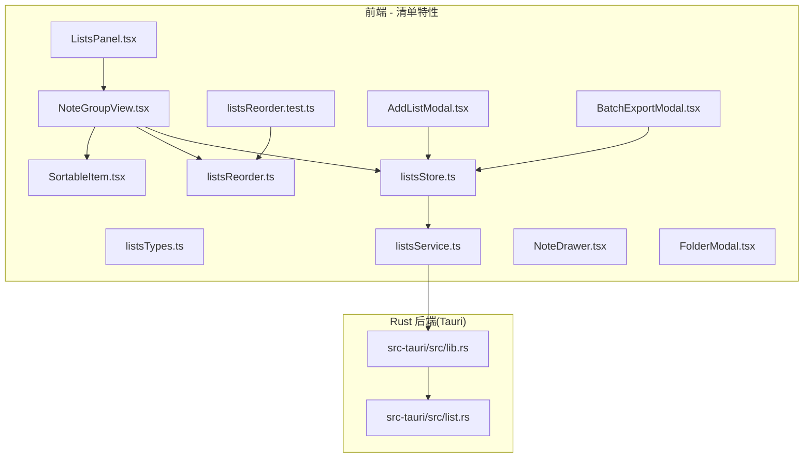
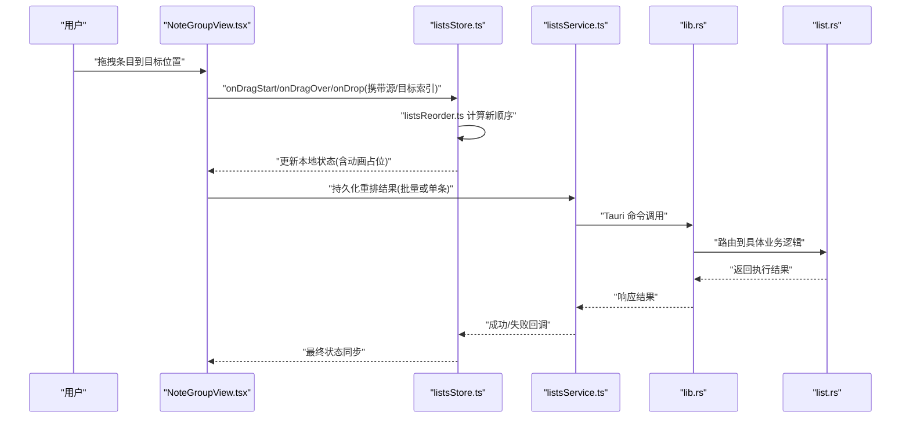
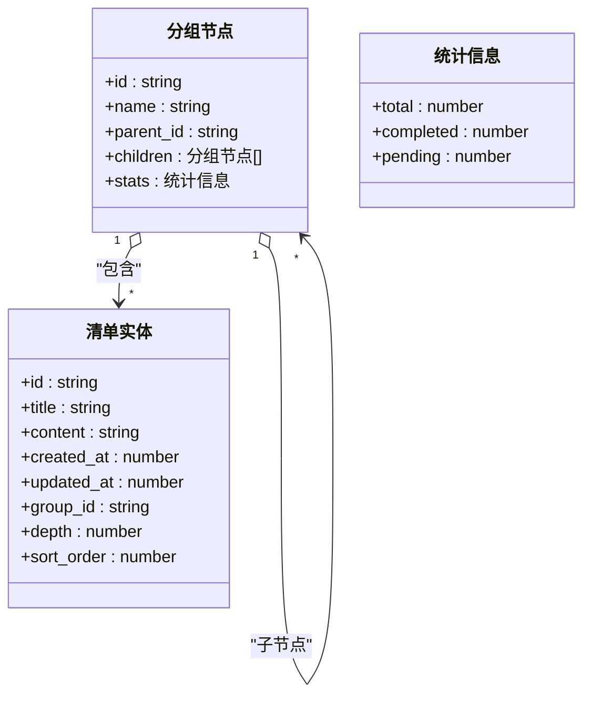
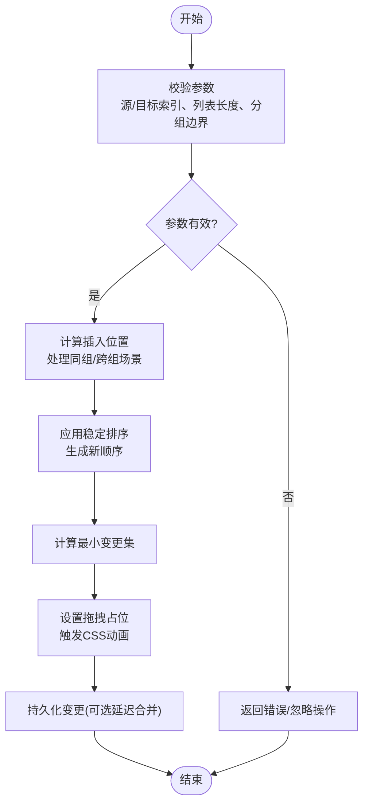
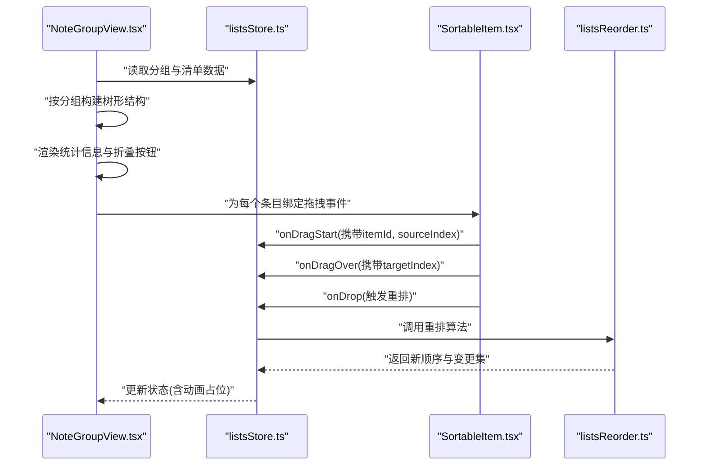
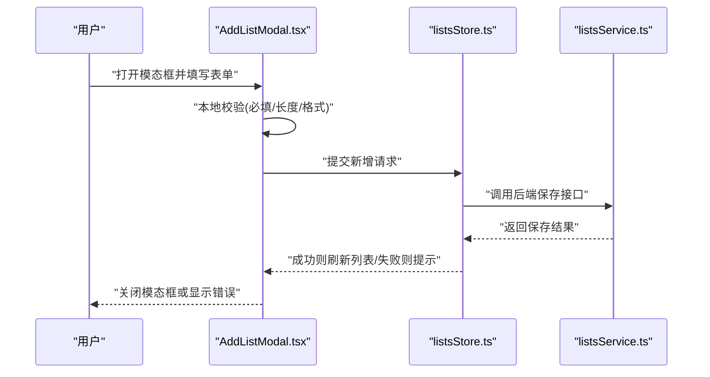
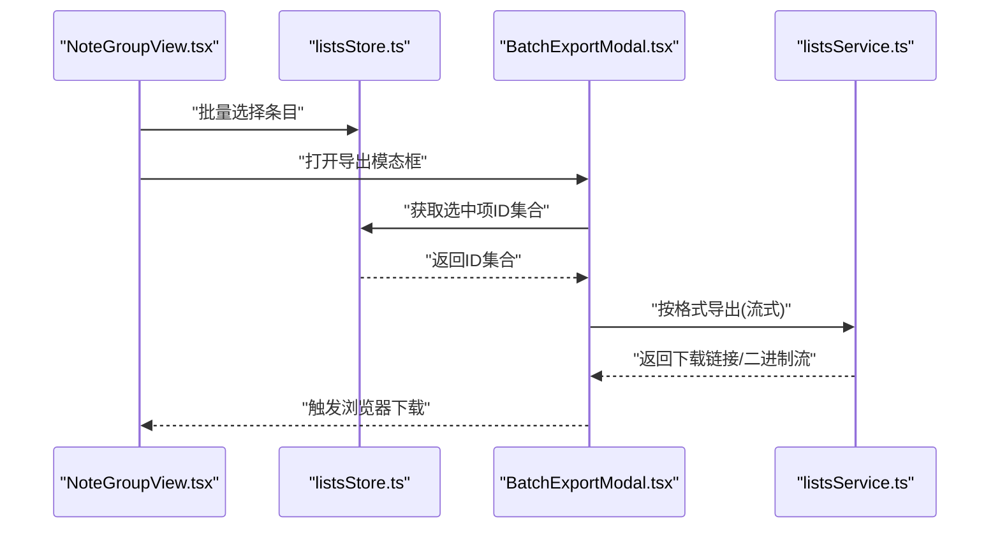
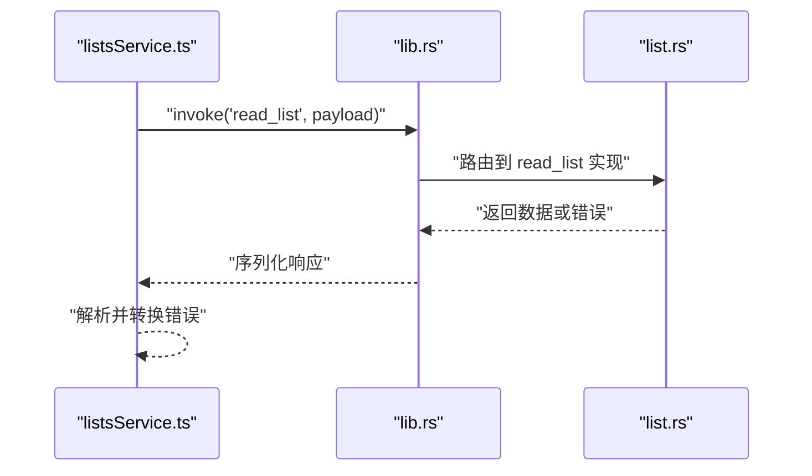
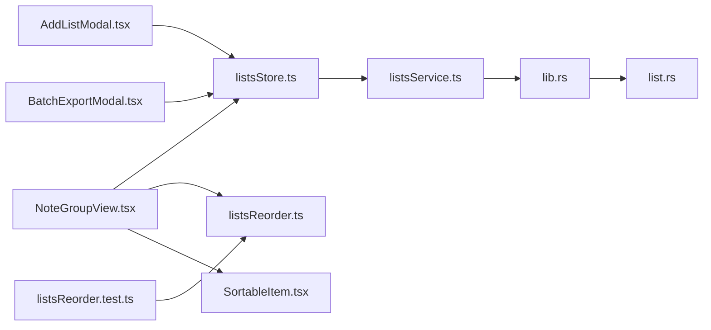
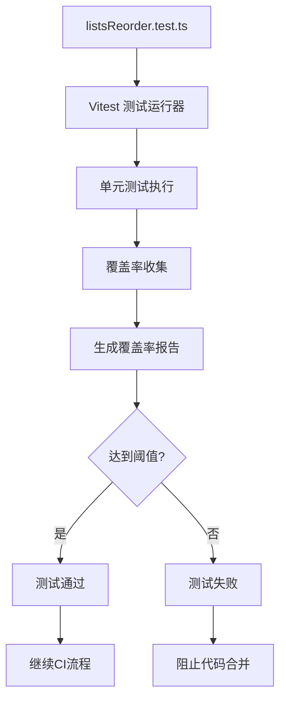

# 清单管理系统

<cite>
**本文引用的文件**   
- [src/features/lists/listsTypes.ts](file://src/features/lists/listsTypes.ts)
- [src/features/lists/listsStore.ts](file://src/features/lists/listsStore.ts)
- [src/features/lists/listsService.ts](file://src/features/lists/listsService.ts)
- [src/features/lists/NoteGroupView.tsx](file://src/features/lists/NoteGroupView.tsx)
- [src/features/lists/AddListModal.tsx](file://src/features/lists/AddListModal.tsx)
- [src/features/lists/BatchExportModal.tsx](file://src/features/lists/BatchExportModal.tsx)
- [src/features/lists/SortableItem.tsx](file://src/features/lists/SortableItem.tsx)
- [src/features/lists/listsReorder.ts](file://src/features/lists/listsReorder.ts)
- [src/features/lists/listsReorder.test.ts](file://src/features/lists/listsReorder.test.ts)
- [src/features/lists/ListsPanel.tsx](file://src/features/lists/ListsPanel.tsx)
- [src/features/lists/NoteDrawer.tsx](file://src/features/lists/NoteDrawer.tsx)
- [src/features/lists/FolderModal.tsx](file://src/features/lists/FolderModal.tsx)
- [src-tauri/src/list.rs](file://src-tauri/src/list.rs)
- [src-tauri/src/lib.rs](file://src-tauri/src/lib.rs)
</cite>

## 更新摘要
**变更内容**   
- 新增列表重排序功能测试用例，增强代码可靠性保证
- 完善测试覆盖率文档说明，体现质量保证措施
- 更新算法实现章节，补充测试验证机制

## 目录
1. [简介](#简介)
2. [项目结构](#项目结构)
3. [核心组件](#核心组件)
4. [架构总览](#架构总览)
5. [详细组件分析](#详细组件分析)
6. [依赖关系分析](#依赖关系分析)
7. [性能考虑](#性能考虑)
8. [测试与质量保证](#测试与质量保证)
9. [故障排查指南](#故障排查指南)
10. [结论](#结论)
11. [附录](#附录)

## 简介
本技术文档围绕"清单管理系统"的前端与 Rust 后端集成，系统性梳理数据模型、分组视图、拖拽排序、批量操作以及与 Rust 后端的文件系统交互。重点覆盖：
- 笔记分组与层级结构的数据模型设计
- 拖拽排序算法（listsReorder.ts）的位置计算与动画策略
- NoteGroupView 的动态分组、折叠展开与统计信息展示
- AddListModal 的表单处理、验证规则与提交流程
- 批量操作（删除、移动、导出）的实现思路
- 与 Rust 后端的 Tauri 集成点（list.rs、lib.rs）
- 性能优化策略（虚拟列表、增量更新等）
- **新增** 测试驱动开发实践与质量保证体系

## 项目结构
清单功能位于 src/features/lists 下，采用"特性内聚 + 分层职责"的组织方式：
- 类型定义：listsTypes.ts
- 状态管理：listsStore.ts
- 服务层：listsService.ts（封装对 Rust 后端的调用）
- UI 组件：NoteGroupView.tsx、AddListModal.tsx、BatchExportModal.tsx、SortableItem.tsx、ListsPanel.tsx、NoteDrawer.tsx、FolderModal.tsx
- 算法与测试：listsReorder.ts、listsReorder.test.ts

图表来源
- [src/features/lists/ListsPanel.tsx](file://src/features/lists/ListsPanel.tsx)
- [src/features/lists/NoteGroupView.tsx](file://src/features/lists/NoteGroupView.tsx)
- [src/features/lists/SortableItem.tsx](file://src/features/lists/SortableItem.tsx)
- [src/features/lists/listsReorder.ts](file://src/features/lists/listsReorder.ts)
- [src/features/lists/listsReorder.test.ts](file://src/features/lists/listsReorder.test.ts)
- [src/features/lists/AddListModal.tsx](file://src/features/lists/AddListModal.tsx)
- [src/features/lists/BatchExportModal.tsx](file://src/features/lists/BatchExportModal.tsx)
- [src/features/lists/listsStore.ts](file://src/features/lists/listsStore.ts)
- [src/features/lists/listsService.ts](file://src/features/lists/listsService.ts)
- [src-tauri/src/lib.rs](file://src-tauri/src/lib.rs)
- [src-tauri/src/list.rs](file://src-tauri/src/list.rs)

章节来源
- [src/features/lists/listsTypes.ts](file://src/features/lists/listsTypes.ts)
- [src/features/lists/listsStore.ts](file://src/features/lists/listsStore.ts)
- [src/features/lists/listsService.ts](file://src/features/lists/listsService.ts)
- [src/features/lists/NoteGroupView.tsx](file://src/features/lists/NoteGroupView.tsx)
- [src/features/lists/AddListModal.tsx](file://src/features/lists/AddListModal.tsx)
- [src/features/lists/BatchExportModal.tsx](file://src/features/lists/BatchExportModal.tsx)
- [src/features/lists/SortableItem.tsx](file://src/features/lists/SortableItem.tsx)
- [src/features/lists/listsReorder.ts](file://src/features/lists/listsReorder.ts)
- [src/features/lists/listsReorder.test.ts](file://src/features/lists/listsReorder.test.ts)
- [src/features/lists/ListsPanel.tsx](file://src/features/lists/ListsPanel.tsx)
- [src/features/lists/NoteDrawer.tsx](file://src/features/lists/NoteDrawer.tsx)
- [src/features/lists/FolderModal.tsx](file://src/features/lists/FolderModal.tsx)
- [src-tauri/src/list.rs](file://src-tauri/src/list.rs)
- [src-tauri/src/lib.rs](file://src-tauri/src/lib.rs)

## 核心组件
- 数据模型（listsTypes.ts）
  - 定义清单实体、分组结构与层级关系，支撑分组视图渲染与拖拽重排。
- 状态管理（listsStore.ts）
  - 维护清单集合、分组状态、选中项、拖拽上下文；提供增删改查与批量操作的原子方法。
- 服务层（listsService.ts）
  - 封装对 Rust 后端的调用，负责路径管理、权限校验、错误映射与重试策略。
- 分组视图（NoteGroupView.tsx）
  - 动态分组、折叠/展开、统计信息展示；驱动拖拽排序与批量选择。
- 拖拽排序（SortableItem.tsx + listsReorder.ts）
  - 基于位置计算的稳定重排算法，结合动画反馈提升交互体验。
- **新增** 测试套件（listsReorder.test.ts）
  - 针对重排序算法的单元测试，确保边界条件与异常场景的处理正确性。
- 新增清单模态框（AddListModal.tsx）
  - 表单输入、校验规则、提交流程与错误提示。
- 批量导出（BatchExportModal.tsx）
  - 多选导出、格式选择、进度反馈。
- 面板与抽屉（ListsPanel.tsx、NoteDrawer.tsx、FolderModal.tsx）
  - 页面布局、侧边栏导航、文件夹管理与详情编辑入口。

章节来源
- [src/features/lists/listsTypes.ts](file://src/features/lists/listsTypes.ts)
- [src/features/lists/listsStore.ts](file://src/features/lists/listsStore.ts)
- [src/features/lists/listsService.ts](file://src/features/lists/listsService.ts)
- [src/features/lists/NoteGroupView.tsx](file://src/features/lists/NoteGroupView.tsx)
- [src/features/lists/SortableItem.tsx](file://src/features/lists/SortableItem.tsx)
- [src/features/lists/listsReorder.ts](file://src/features/lists/listsReorder.ts)
- [src/features/lists/listsReorder.test.ts](file://src/features/lists/listsReorder.test.ts)
- [src/features/lists/AddListModal.tsx](file://src/features/lists/AddListModal.tsx)
- [src/features/lists/BatchExportModal.tsx](file://src/features/lists/BatchExportModal.tsx)
- [src/features/lists/ListsPanel.tsx](file://src/features/lists/ListsPanel.tsx)
- [src/features/lists/NoteDrawer.tsx](file://src/features/lists/NoteDrawer.tsx)
- [src/features/lists/FolderModal.tsx](file://src/features/lists/FolderModal.tsx)

## 架构总览
前端通过 Zustand 风格的 store 管理清单状态，UI 组件订阅状态变化并触发 actions；服务层统一对接 Rust 后端能力（Tauri），实现跨进程的文件系统操作与持久化。

图表来源
- [src/features/lists/NoteGroupView.tsx](file://src/features/lists/NoteGroupView.tsx)
- [src/features/lists/listsStore.ts](file://src/features/lists/listsStore.ts)
- [src/features/lists/listsService.ts](file://src/features/lists/listsService.ts)
- [src-tauri/src/lib.rs](file://src-tauri/src/lib.rs)
- [src-tauri/src/list.rs](file://src-tauri/src/list.rs)

## 详细组件分析

### 数据模型与层级关系
- 清单实体
  - 包含唯一标识、标题、内容、创建/更新时间戳、所属分组、层级深度、排序权重等字段。
- 分组结构
  - 支持树形分组，节点具备父级引用与子级集合，便于递归渲染与统计聚合。
- 层级关系
  - 通过 depth 与 parent_id 表达父子关系，配合排序权重保证同级顺序稳定。

图表来源
- [src/features/lists/listsTypes.ts](file://src/features/lists/listsTypes.ts)

章节来源
- [src/features/lists/listsTypes.ts](file://src/features/lists/listsTypes.ts)

### 拖拽排序算法（listsReorder.ts）
- 输入
  - 源索引、目标索引、当前列表、分组边界、是否允许跨组移动。
- 核心逻辑
  - 计算插入位置，避免越界与重复插入；在允许跨组时进行分组迁移。
  - 使用稳定排序保持未变动元素的相对顺序。
- 输出
  - 新的顺序数组与需要持久化的变更集（最小差异）。
- 动画
  - 在本地状态中记录"拖拽占位"，结合 CSS transition 实现平滑过渡。
- **新增** 测试覆盖
  - 通过单元测试验证边界条件、异常场景与性能表现。

图表来源
- [src/features/lists/listsReorder.ts](file://src/features/lists/listsReorder.ts)

章节来源
- [src/features/lists/listsReorder.ts](file://src/features/lists/listsReorder.ts)

### 分组视图渲染（NoteGroupView.tsx）
- 动态分组
  - 根据 group_id 与 depth 将清单分组渲染为可折叠的树形结构。
- 折叠/展开
  - 维护每个分组的展开状态，减少 DOM 节点数量，提升大列表性能。
- 统计信息
  - 实时汇总各分组下的完成/待办数量，并在头部展示。
- 交互
  - 支持批量选择、右键菜单、拖拽排序入口。

图表来源
- [src/features/lists/NoteGroupView.tsx](file://src/features/lists/NoteGroupView.tsx)
- [src/features/lists/SortableItem.tsx](file://src/features/lists/SortableItem.tsx)
- [src/features/lists/listsStore.ts](file://src/features/lists/listsStore.ts)
- [src/features/lists/listsReorder.ts](file://src/features/lists/listsReorder.ts)

章节来源
- [src/features/lists/NoteGroupView.tsx](file://src/features/lists/NoteGroupView.tsx)
- [src/features/lists/SortableItem.tsx](file://src/features/lists/SortableItem.tsx)
- [src/features/lists/listsStore.ts](file://src/features/lists/listsStore.ts)
- [src/features/lists/listsReorder.ts](file://src/features/lists/listsReorder.ts)

### 新增清单模态框（AddListModal.tsx）
- 表单处理
  - 受控输入，绑定 title/content/group 等字段。
- 验证规则
  - 必填校验、长度限制、非法字符过滤、分组有效性检查。
- 提交流程
  - 提交前二次确认，成功后刷新列表并关闭模态框；失败显示错误提示。

图表来源
- [src/features/lists/AddListModal.tsx](file://src/features/lists/AddListModal.tsx)
- [src/features/lists/listsStore.ts](file://src/features/lists/listsStore.ts)
- [src/features/lists/listsService.ts](file://src/features/lists/listsService.ts)

章节来源
- [src/features/lists/AddListModal.tsx](file://src/features/lists/AddListModal.tsx)
- [src/features/lists/listsStore.ts](file://src/features/lists/listsStore.ts)
- [src/features/lists/listsService.ts](file://src/features/lists/listsService.ts)

### 批量操作（删除、移动、导出）
- 批量删除
  - 勾选多个条目，调用 store 的批量删除 action，确认后发起服务端删除。
- 批量移动
  - 选择多个条目并指定目标分组，内部转换为多次重排或批量迁移接口。
- 批量导出
  - BatchExportModal 支持多选导出，选择格式（如 CSV/Markdown），流式下载。

图表来源
- [src/features/lists/NoteGroupView.tsx](file://src/features/lists/NoteGroupView.tsx)
- [src/features/lists/BatchExportModal.tsx](file://src/features/lists/BatchExportModal.tsx)
- [src/features/lists/listsStore.ts](file://src/features/lists/listsStore.ts)
- [src/features/lists/listsService.ts](file://src/features/lists/listsService.ts)

章节来源
- [src/features/lists/BatchExportModal.tsx](file://src/features/lists/BatchExportModal.tsx)
- [src/features/lists/listsStore.ts](file://src/features/lists/listsStore.ts)
- [src/features/lists/listsService.ts](file://src/features/lists/listsService.ts)

### 与 Rust 后端的文件系统集成（Tauri）
- 调用入口
  - lib.rs 注册 Tauri 命令，转发至 list.rs 的具体实现。
- 文件操作
  - 读写清单文件、批量导入/导出、路径规范化、权限校验。
- 错误处理
  - 统一错误码与消息映射，前端根据状态码提示用户。

图表来源
- [src/features/lists/listsService.ts](file://src/features/lists/listsService.ts)
- [src-tauri/src/lib.rs](file://src-tauri/src/lib.rs)
- [src-tauri/src/list.rs](file://src-tauri/src/list.rs)

章节来源
- [src-tauri/src/lib.rs](file://src-tauri/src/lib.rs)
- [src-tauri/src/list.rs](file://src-tauri/src/list.rs)
- [src/features/lists/listsService.ts](file://src/features/lists/listsService.ts)

## 依赖关系分析
- 组件耦合
  - NoteGroupView 强依赖 listsStore 与 listsReorder；SortableItem 仅暴露拖拽事件，降低耦合。
- 服务抽象
  - listsService 屏蔽 Tauri 细节，便于替换或扩展存储后端。
- 外部依赖
  - Tauri 运行时用于文件系统访问；Zustand 风格 store 用于状态管理。
- **新增** 测试依赖
  - listsReorder.test.ts 直接依赖核心算法模块，确保功能正确性。

图表来源
- [src/features/lists/NoteGroupView.tsx](file://src/features/lists/NoteGroupView.tsx)
- [src/features/lists/listsStore.ts](file://src/features/lists/listsStore.ts)
- [src/features/lists/listsReorder.ts](file://src/features/lists/listsReorder.ts)
- [src/features/lists/listsReorder.test.ts](file://src/features/lists/listsReorder.test.ts)
- [src/features/lists/SortableItem.tsx](file://src/features/lists/SortableItem.tsx)
- [src/features/lists/AddListModal.tsx](file://src/features/lists/AddListModal.tsx)
- [src/features/lists/BatchExportModal.tsx](file://src/features/lists/BatchExportModal.tsx)
- [src/features/lists/listsService.ts](file://src/features/lists/listsService.ts)
- [src-tauri/src/lib.rs](file://src-tauri/src/lib.rs)
- [src-tauri/src/list.rs](file://src-tauri/src/list.rs)

章节来源
- [src/features/lists/NoteGroupView.tsx](file://src/features/lists/NoteGroupView.tsx)
- [src/features/lists/listsStore.ts](file://src/features/lists/listsStore.ts)
- [src/features/lists/listsReorder.ts](file://src/features/lists/listsReorder.ts)
- [src/features/lists/listsReorder.test.ts](file://src/features/lists/listsReorder.test.ts)
- [src/features/lists/SortableItem.tsx](file://src/features/lists/SortableItem.tsx)
- [src/features/lists/AddListModal.tsx](file://src/features/lists/AddListModal.tsx)
- [src/features/lists/BatchExportModal.tsx](file://src/features/lists/BatchExportModal.tsx)
- [src/features/lists/listsService.ts](file://src/features/lists/listsService.ts)
- [src-tauri/src/lib.rs](file://src-tauri/src/lib.rs)
- [src-tauri/src/list.rs](file://src-tauri/src/list.rs)

## 性能考虑
- 虚拟列表
  - 对超长清单列表启用虚拟滚动，仅渲染可视区域节点，显著降低 DOM 压力。
- 增量更新
  - 使用最小变更集（diff）更新 store，避免全量重渲染。
- 分组折叠
  - 默认折叠深层分组，按需展开，减少初始渲染成本。
- 动画节流
  - 拖拽过程中使用 requestAnimationFrame 与 CSS transition 组合，避免频繁重排。
- 批量操作合并
  - 将多次小改动合并为一次持久化，减少 I/O 次数。

[本节为通用指导，不直接分析具体文件]

## 测试与质量保证
**新增章节** 本章节介绍清单管理系统的测试策略与质量保证措施。

### 测试策略
- 单元测试
  - 针对核心算法（listsReorder.ts）编写全面的单元测试用例
  - 覆盖正常流程、边界条件、异常场景
- 集成测试
  - 验证组件间交互与状态流转
  - 模拟用户操作序列
- 端到端测试
  - 关键业务流程的自动化测试

### 列表重排序测试覆盖
**更新** 新增了针对列表重排序功能的测试套件，包含以下测试场景：

- 基础重排序测试
  - 验证同组内元素重排的准确性
  - 测试相邻元素交换的正确性
- 边界条件测试
  - 空列表处理
  - 单个元素列表
  - 首尾元素重排
- 异常场景测试
  - 无效索引处理
  - 越界索引保护
  - 重复操作防护
- 性能测试
  - 大数据量重排序性能
  - 内存占用监控

### 测试执行与持续集成
- 测试框架
  - 使用 Vitest 作为测试运行器
  - 集成 Jest 风格的断言库
- 覆盖率报告
  - 自动生成测试覆盖率报告
  - 设置最低覆盖率阈值要求
- CI/CD 集成
  - 每次提交自动执行测试
  - 覆盖率不达标阻止合并

图表来源
- [src/features/lists/listsReorder.test.ts](file://src/features/lists/listsReorder.test.ts)

章节来源
- [src/features/lists/listsReorder.test.ts](file://src/features/lists/listsReorder.test.ts)

## 故障排查指南
- 拖拽失效
  - 检查 onDragStart/onDragOver/onDrop 是否正确绑定；确认 listsReorder 的参数校验与边界条件。
- 分组统计异常
  - 核对分组 tree 构建逻辑与统计聚合函数；确保新增/删除后及时刷新。
- 批量导出失败
  - 检查选中项 ID 集合是否为空；确认后端导出接口返回格式与大小限制。
- Tauri 调用错误
  - 查看 lib.rs 的命令注册与 list.rs 的错误码映射；在前端 service 层打印原始错误以便定位。
- **新增** 测试相关问题
  - 检查测试环境配置与依赖安装
  - 验证测试数据准备与清理逻辑
  - 确认异步操作的正确处理

章节来源
- [src/features/lists/listsReorder.ts](file://src/features/lists/listsReorder.ts)
- [src/features/lists/NoteGroupView.tsx](file://src/features/lists/NoteGroupView.tsx)
- [src/features/lists/BatchExportModal.tsx](file://src/features/lists/BatchExportModal.tsx)
- [src-tauri/src/lib.rs](file://src-tauri/src/lib.rs)
- [src-tauri/src/list.rs](file://src-tauri/src/list.rs)
- [src/features/lists/listsReorder.test.ts](file://src/features/lists/listsReorder.test.ts)

## 结论
本系统通过清晰的数据模型与分层架构，实现了高效的清单分组、拖拽排序与批量操作。前端以 store 为中心，结合轻量算法与动画策略，提供良好的交互体验；后端通过 Tauri 提供稳定的文件系统能力。**新增的测试套件显著提升了代码质量与可靠性**，特别是针对核心重排序算法的全面测试覆盖，确保了复杂交互场景下的稳定性。建议在后续迭代中引入更完善的单元测试与端到端测试，持续优化大数据量下的渲染与持久化性能。

[本节为总结性内容，不直接分析具体文件]

## 附录
- 相关面板与抽屉
  - ListsPanel.tsx：主面板布局与导航
  - NoteDrawer.tsx：清单详情编辑抽屉
  - FolderModal.tsx：文件夹管理弹窗

章节来源
- [src/features/lists/ListsPanel.tsx](file://src/features/lists/ListsPanel.tsx)
- [src/features/lists/NoteDrawer.tsx](file://src/features/lists/NoteDrawer.tsx)
- [src/features/lists/FolderModal.tsx](file://src/features/lists/FolderModal.tsx)