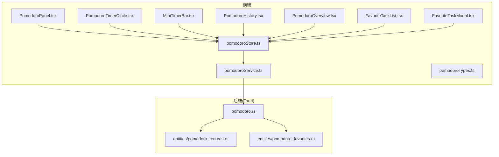
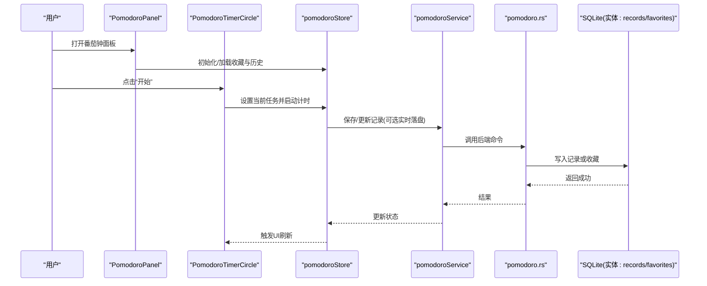
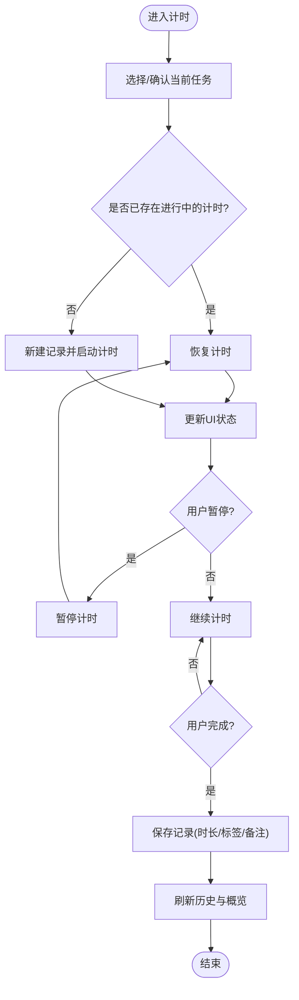
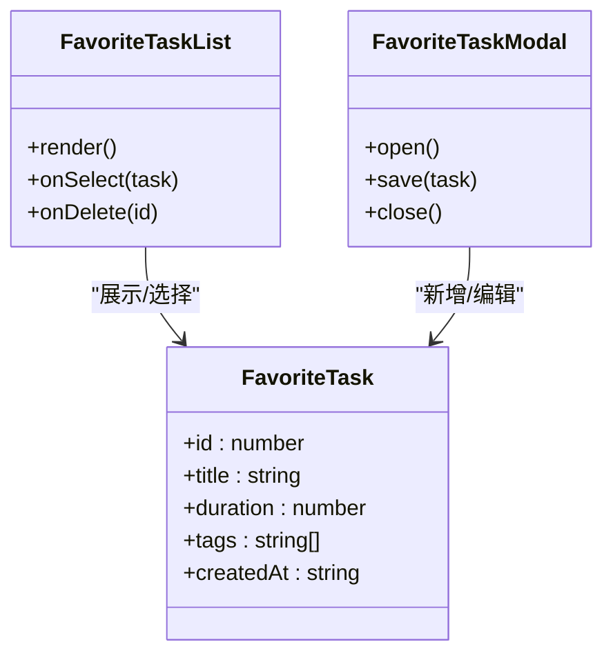
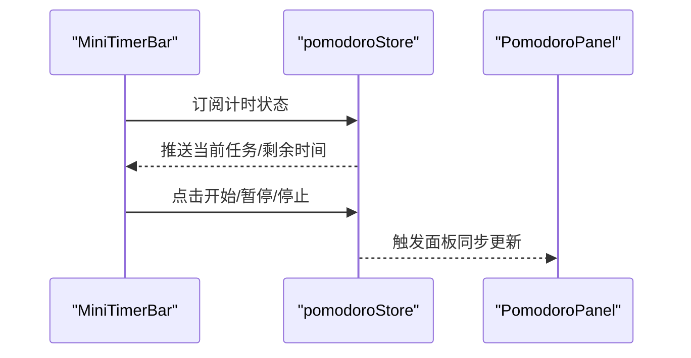
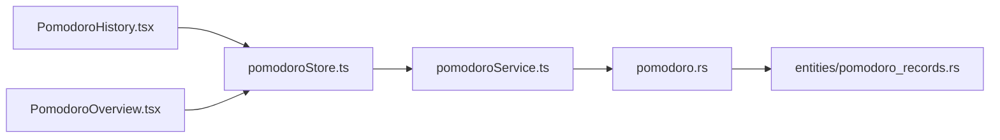
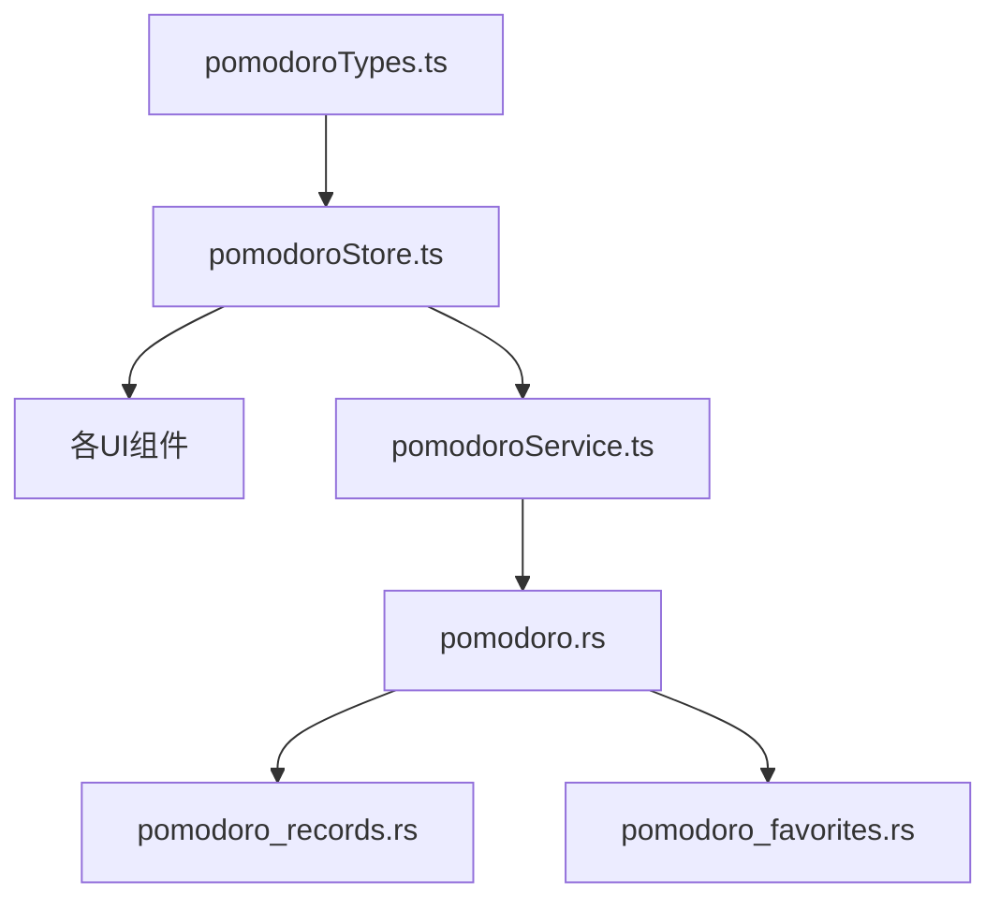

# 番茄钟计时器

<cite>
**本文引用的文件**   
- [src/features/pomodoro/PomodoroPanel.tsx](file://src/features/pomodoro/PomodoroPanel.tsx)
- [src/features/pomodoro/pomodoroStore.ts](file://src/features/pomodoro/pomodoroStore.ts)
- [src/features/pomodoro/pomodoroService.ts](file://src/features/pomodoro/pomodoroService.ts)
- [src/features/pomodoro/pomodoroTypes.ts](file://src/features/pomodoro/pomodoroTypes.ts)
- [src/features/pomodoro/PomodoroTimerCircle.tsx](file://src/features/pomodoro/PomodoroTimerCircle.tsx)
- [src/features/pomodoro/MiniTimerBar.tsx](file://src/features/pomodoro/MiniTimerBar.tsx)
- [src/features/pomodoro/FavoriteTaskList.tsx](file://src/features/pomodoro/FavoriteTaskList.tsx)
- [src/features/pomodoro/FavoriteTaskModal.tsx](file://src/features/pomodoro/FavoriteTaskModal.tsx)
- [src/features/pomodoro/PomodoroHistory.tsx](file://src/features/pomodoro/PomodoroHistory.tsx)
- [src/features/pomodoro/PomodoroOverview.tsx](file://src/features/pomodoro/PomodoroOverview.tsx)
- [src-tauri/src/pomodoro.rs](file://src-tauri/src/pomodoro.rs)
- [src-tauri/src/entities/pomodoro_records.rs](file://src-tauri/src/entities/pomodoro_records.rs)
- [src-tauri/src/entities/pomodoro_favorites.rs](file://src-tauri/src/entities/pomodoro_favorites.rs)
</cite>

## 目录
1. [简介](#简介)
2. [项目结构](#项目结构)
3. [核心组件](#核心组件)
4. [架构总览](#架构总览)
5. [详细组件分析](#详细组件分析)
6. [依赖分析](#依赖分析)
7. [性能考虑](#性能考虑)
8. [故障排查指南](#故障排查指南)
9. [结论](#结论)
10. [附录](#附录)

## 简介
本项目是一个基于 Tauri + React 的桌面端“番茄钟计时器”应用。前端采用 React 与状态管理，后端通过 Rust/Tauri 提供本地持久化能力（SQLite）。功能覆盖番茄工作法的核心流程：创建任务、开始/暂停/完成计时、记录历史、收藏常用任务、概览统计等。整体遵循前后端分离的模块化设计，领域逻辑集中在 features/pomodoro 下，数据访问由 Service 层封装，UI 以组件形式组织。

## 项目结构
本项目的番茄钟相关代码主要分布在以下位置：
- 前端特性模块：src/features/pomodoro
- 后端实体与服务：src-tauri/src/pomodoro.rs 及 entities 下的 pomodoro_* 模型

图表来源
- [src/features/pomodoro/PomodoroPanel.tsx](file://src/features/pomodoro/PomodoroPanel.tsx)
- [src/features/pomodoro/pomodoroStore.ts](file://src/features/pomodoro/pomodoroStore.ts)
- [src/features/pomodoro/pomodoroService.ts](file://src/features/pomodoro/pomodoroService.ts)
- [src/features/pomodoro/pomodoroTypes.ts](file://src/features/pomodoro/pomodoroTypes.ts)
- [src/features/pomodoro/PomodoroTimerCircle.tsx](file://src/features/pomodoro/PomodoroTimerCircle.tsx)
- [src/features/pomodoro/MiniTimerBar.tsx](file://src/features/pomodoro/MiniTimerBar.tsx)
- [src/features/pomodoro/PomodoroHistory.tsx](file://src/features/pomodoro/PomodoroHistory.tsx)
- [src/features/pomodoro/PomodoroOverview.tsx](file://src/features/pomodoro/PomodoroOverview.tsx)
- [src/features/pomodoro/FavoriteTaskList.tsx](file://src/features/pomodoro/FavoriteTaskList.tsx)
- [src/features/pomodoro/FavoriteTaskModal.tsx](file://src/features/pomodoro/FavoriteTaskModal.tsx)
- [src-tauri/src/pomodoro.rs](file://src-tauri/src/pomodoro.rs)
- [src-tauri/src/entities/pomodoro_records.rs](file://src-tauri/src/entities/pomodoro_records.rs)
- [src-tauri/src/entities/pomodoro_favorites.rs](file://src-tauri/src/entities/pomodoro_favorites.rs)

章节来源
- [src/features/pomodoro/PomodoroPanel.tsx](file://src/features/pomodoro/PomodoroPanel.tsx)
- [src/features/pomodoro/pomodoroStore.ts](file://src/features/pomodoro/pomodoroStore.ts)
- [src/features/pomodoro/pomodoroService.ts](file://src/features/pomodoro/pomodoroService.ts)
- [src/features/pomodoro/pomodoroTypes.ts](file://src/features/pomodoro/pomodoroTypes.ts)
- [src-tauri/src/pomodoro.rs](file://src-tauri/src/pomodoro.rs)
- [src-tauri/src/entities/pomodoro_records.rs](file://src-tauri/src/entities/pomodoro_records.rs)
- [src-tauri/src/entities/pomodoro_favorites.rs](file://src-tauri/src/entities/pomodoro_favorites.rs)

## 核心组件
- PomodoroPanel：页面入口，聚合计时器、历史、概览、收藏任务等子视图，并提供全局操作入口。
- PomodoroTimerCircle：圆形进度展示与交互控制（开始/暂停/重置/切换模式）。
- MiniTimerBar：常驻小条，显示当前倒计时与快捷控制。
- FavoriteTaskList / FavoriteTaskModal：收藏任务列表与新增/编辑弹窗。
- PomodoroHistory：按时间维度查看已完成番茄记录。
- PomodoroOverview：统计概览（如今日/本周时长、完成率等）。
- pomodoroStore：前端状态中心，维护当前任务、计时状态、历史记录、收藏任务等。
- pomodoroService：调用 Tauri 命令进行数据读写（记录、收藏等）。
- pomodoroTypes：类型定义（任务、记录、收藏项、计时状态等）。

章节来源
- [src/features/pomodoro/PomodoroPanel.tsx](file://src/features/pomodoro/PomodoroPanel.tsx)
- [src/features/pomodoro/PomodoroTimerCircle.tsx](file://src/features/pomodoro/PomodoroTimerCircle.tsx)
- [src/features/pomodoro/MiniTimerBar.tsx](file://src/features/pomodoro/MiniTimerBar.tsx)
- [src/features/pomodoro/FavoriteTaskList.tsx](file://src/features/pomodoro/FavoriteTaskList.tsx)
- [src/features/pomodoro/FavoriteTaskModal.tsx](file://src/features/pomodoro/FavoriteTaskModal.tsx)
- [src/features/pomodoro/PomodoroHistory.tsx](file://src/features/pomodoro/PomodoroHistory.tsx)
- [src/features/pomodoro/PomodoroOverview.tsx](file://src/features/pomodoro/PomodoroOverview.tsx)
- [src/features/pomodoro/pomodoroStore.ts](file://src/features/pomodoro/pomodoroStore.ts)
- [src/features/pomodoro/pomodoroService.ts](file://src/features/pomodoro/pomodoroService.ts)
- [src/features/pomodoro/pomodoroTypes.ts](file://src/features/pomodoro/pomodoroTypes.ts)

## 架构总览
系统分为三层：
- 表现层（React 组件）：负责用户交互与界面渲染。
- 状态与业务层（Store/Service）：Store 维护 UI 状态与计时逻辑；Service 封装对后端的调用。
- 持久化层（Tauri/Rust）：通过实体映射到 SQLite 表，提供记录的增删改查与收藏管理。

图表来源
- [src/features/pomodoro/PomodoroPanel.tsx](file://src/features/pomodoro/PomodoroPanel.tsx)
- [src/features/pomodoro/PomodoroTimerCircle.tsx](file://src/features/pomodoro/PomodoroTimerCircle.tsx)
- [src/features/pomodoro/pomodoroStore.ts](file://src/features/pomodoro/pomodoroStore.ts)
- [src/features/pomodoro/pomodoroService.ts](file://src/features/pomodoro/pomodoroService.ts)
- [src-tauri/src/pomodoro.rs](file://src-tauri/src/pomodoro.rs)
- [src-tauri/src/entities/pomodoro_records.rs](file://src-tauri/src/entities/pomodoro_records.rs)
- [src-tauri/src/entities/pomodoro_favorites.rs](file://src-tauri/src/entities/pomodoro_favorites.rs)

## 详细组件分析

### 计时主流程（开始/暂停/完成）
该流程围绕 Store 的状态机展开：选择任务 -> 开始计时 -> 可暂停 -> 完成时写入记录 -> 更新历史与概览。

图表来源
- [src/features/pomodoro/pomodoroStore.ts](file://src/features/pomodoro/pomodoroStore.ts)
- [src/features/pomodoro/pomodoroService.ts](file://src/features/pomodoro/pomodoroService.ts)
- [src-tauri/src/pomodoro.rs](file://src-tauri/src/pomodoro.rs)
- [src-tauri/src/entities/pomodoro_records.rs](file://src-tauri/src/entities/pomodoro_records.rs)

章节来源
- [src/features/pomodoro/pomodoroStore.ts](file://src/features/pomodoro/pomodoroStore.ts)
- [src/features/pomodoro/pomodoroService.ts](file://src/features/pomodoro/pomodoroService.ts)
- [src-tauri/src/pomodoro.rs](file://src-tauri/src/pomodoro.rs)
- [src-tauri/src/entities/pomodoro_records.rs](file://src-tauri/src/entities/pomodoro_records.rs)

### 收藏任务管理
支持将常用任务加入收藏，快速复用。

图表来源
- [src/features/pomodoro/FavoriteTaskList.tsx](file://src/features/pomodoro/FavoriteTaskList.tsx)
- [src/features/pomodoro/FavoriteTaskModal.tsx](file://src/features/pomodoro/FavoriteTaskModal.tsx)
- [src-tauri/src/entities/pomodoro_favorites.rs](file://src-tauri/src/entities/pomodoro_favorites.rs)

章节来源
- [src/features/pomodoro/FavoriteTaskList.tsx](file://src/features/pomodoro/FavoriteTaskList.tsx)
- [src/features/pomodoro/FavoriteTaskModal.tsx](file://src/features/pomodoro/FavoriteTaskModal.tsx)
- [src-tauri/src/entities/pomodoro_favorites.rs](file://src-tauri/src/entities/pomodoro_favorites.rs)

### 迷你计时条（常驻栏）
用于在任意页面快速查看与控制当前计时。

图表来源
- [src/features/pomodoro/MiniTimerBar.tsx](file://src/features/pomodoro/MiniTimerBar.tsx)
- [src/features/pomodoro/pomodoroStore.ts](file://src/features/pomodoro/pomodoroStore.ts)
- [src/features/pomodoro/PomodoroPanel.tsx](file://src/features/pomodoro/PomodoroPanel.tsx)

章节来源
- [src/features/pomodoro/MiniTimerBar.tsx](file://src/features/pomodoro/MiniTimerBar.tsx)
- [src/features/pomodoro/pomodoroStore.ts](file://src/features/pomodoro/pomodoroStore.ts)
- [src/features/pomodoro/PomodoroPanel.tsx](file://src/features/pomodoro/PomodoroPanel.tsx)

### 历史记录与概览
- 历史记录：按日期/任务维度列出已完成记录，支持筛选与导出（若实现）。
- 概览：汇总当日/当周时长、完成率、热门任务等指标。

图表来源
- [src/features/pomodoro/PomodoroHistory.tsx](file://src/features/pomodoro/PomodoroHistory.tsx)
- [src/features/pomodoro/PomodoroOverview.tsx](file://src/features/pomodoro/PomodoroOverview.tsx)
- [src/features/pomodoro/pomodoroStore.ts](file://src/features/pomodoro/pomodoroStore.ts)
- [src/features/pomodoro/pomodoroService.ts](file://src/features/pomodoro/pomodoroService.ts)
- [src-tauri/src/pomodoro.rs](file://src-tauri/src/pomodoro.rs)
- [src-tauri/src/entities/pomodoro_records.rs](file://src-tauri/src/entities/pomodoro_records.rs)

章节来源
- [src/features/pomodoro/PomodoroHistory.tsx](file://src/features/pomodoro/PomodoroHistory.tsx)
- [src/features/pomodoro/PomodoroOverview.tsx](file://src/features/pomodoro/PomodoroOverview.tsx)
- [src/features/pomodoro/pomodoroStore.ts](file://src/features/pomodoro/pomodoroStore.ts)
- [src/features/pomodoro/pomodoroService.ts](file://src/features/pomodoro/pomodoroService.ts)
- [src-tauri/src/pomodoro.rs](file://src-tauri/src/pomodoro.rs)
- [src-tauri/src/entities/pomodoro_records.rs](file://src-tauri/src/entities/pomodoro_records.rs)

## 依赖分析
- 组件耦合度低：各 UI 组件仅依赖 Store 暴露的状态与动作，避免直接跨组件通信。
- 服务解耦：Service 统一封装 Tauri 命令调用，便于替换存储实现或增加缓存策略。
- 类型集中：pomodoroTypes.ts 作为契约，降低前后端字段不一致风险。
- 后端实体清晰：records 与 favorites 分别对应不同业务域，职责单一。

图表来源
- [src/features/pomodoro/pomodoroTypes.ts](file://src/features/pomodoro/pomodoroTypes.ts)
- [src/features/pomodoro/pomodoroStore.ts](file://src/features/pomodoro/pomodoroStore.ts)
- [src/features/pomodoro/pomodoroService.ts](file://src/features/pomodoro/pomodoroService.ts)
- [src-tauri/src/pomodoro.rs](file://src-tauri/src/pomodoro.rs)
- [src-tauri/src/entities/pomodoro_records.rs](file://src-tauri/src/entities/pomodoro_records.rs)
- [src-tauri/src/entities/pomodoro_favorites.rs](file://src-tauri/src/entities/pomodoro_favorites.rs)

章节来源
- [src/features/pomodoro/pomodoroTypes.ts](file://src/features/pomodoro/pomodoroTypes.ts)
- [src/features/pomodoro/pomodoroStore.ts](file://src/features/pomodoro/pomodoroStore.ts)
- [src/features/pomodoro/pomodoroService.ts](file://src/features/pomodoro/pomodoroService.ts)
- [src-tauri/src/pomodoro.rs](file://src-tauri/src/pomodoro.rs)
- [src-tauri/src/entities/pomodoro_records.rs](file://src-tauri/src/entities/pomodoro_records.rs)
- [src-tauri/src/entities/pomodoro_favorites.rs](file://src-tauri/src/entities/pomodoro_favorites.rs)

## 性能考虑
- 计时精度：建议在前端使用高精度定时器（如 requestAnimationFrame 或 Web Worker），减少主线程阻塞导致的跳帧。
- 批量写入：历史记录可在完成时合并写入，避免频繁 I/O。
- 状态订阅粒度：仅在必要组件订阅 Store 片段，减少不必要的重渲染。
- 数据分页：历史记录与概览查询应支持分页与过滤，提升大数据量场景的响应速度。
- 资源占用：常驻迷你条应避免高频 DOM 操作，必要时使用虚拟滚动或节流更新。

[本节为通用指导，不直接分析具体文件]

## 故障排查指南
- 计时不更新
  - 检查 Store 中计时状态是否正确推进，确认 UI 组件是否订阅了相应状态。
  - 验证 MiniTimerBar 与主面板的状态同步逻辑。
- 记录未持久化
  - 核对 Service 调用的 Tauri 命令路径与参数是否与后端一致。
  - 检查后端实体字段映射与数据库约束（非空、唯一性等）。
- 收藏任务异常
  - 确认 FavoriteTaskModal 提交的数据结构与后端实体匹配。
  - 查看错误日志，定位是前端校验失败还是后端写入失败。
- 概览数据不准确
  - 检查过滤条件（日期范围、任务标签）是否正确传递至后端查询。
  - 确认聚合计算逻辑与数据库分组语句一致。

章节来源
- [src/features/pomodoro/pomodoroStore.ts](file://src/features/pomodoro/pomodoroStore.ts)
- [src/features/pomodoro/pomodoroService.ts](file://src/features/pomodoro/pomodoroService.ts)
- [src-tauri/src/pomodoro.rs](file://src-tauri/src/pomodoro.rs)
- [src-tauri/src/entities/pomodoro_records.rs](file://src-tauri/src/entities/pomodoro_records.rs)
- [src-tauri/src/entities/pomodoro_favorites.rs](file://src-tauri/src/entities/pomodoro_favorites.rs)

## 结论
本番茄钟计时器采用清晰的三层架构与模块化组织，前端聚焦交互与状态管理，后端专注数据持久化。通过 Store 与 Service 的解耦，实现了良好的可扩展性与可维护性。建议在后续迭代中完善错误处理、性能优化与测试覆盖，以提升用户体验与稳定性。

[本节为总结性内容，不直接分析具体文件]

## 附录
- 关键类型参考：pomodoroTypes.ts
- 核心状态与动作：pomodoroStore.ts
- 数据访问接口：pomodoroService.ts
- 后端命令与实体：pomodoro.rs、pomodoro_records.rs、pomodoro_favorites.rs

章节来源
- [src/features/pomodoro/pomodoroTypes.ts](file://src/features/pomodoro/pomodoroTypes.ts)
- [src/features/pomodoro/pomodoroStore.ts](file://src/features/pomodoro/pomodoroStore.ts)
- [src/features/pomodoro/pomodoroService.ts](file://src/features/pomodoro/pomodoroService.ts)
- [src-tauri/src/pomodoro.rs](file://src-tauri/src/pomodoro.rs)
- [src-tauri/src/entities/pomodoro_records.rs](file://src-tauri/src/entities/pomodoro_records.rs)
- [src-tauri/src/entities/pomodoro_favorites.rs](file://src-tauri/src/entities/pomodoro_favorites.rs)