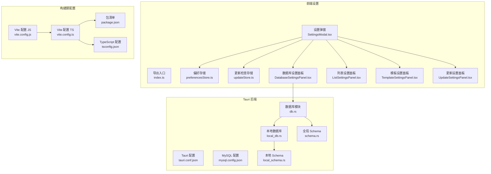
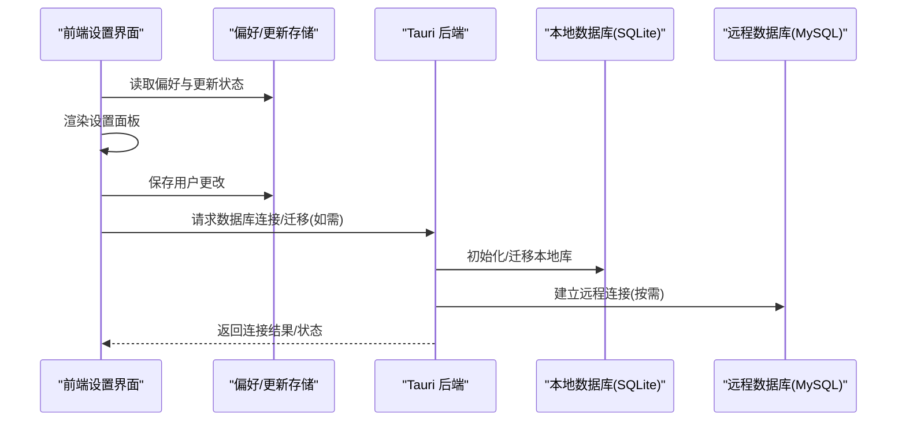
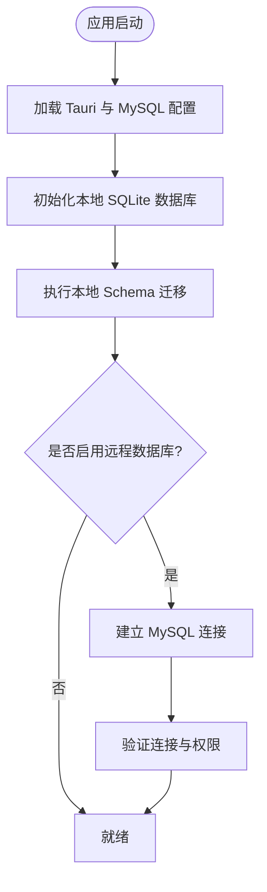
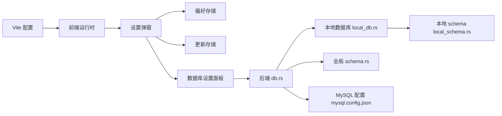

# 设置与配置管理

<cite>
**本文引用的文件**   
- [src/features/settings/SettingsModal.tsx](file://src/features/settings/SettingsModal.tsx)
- [src/features/settings/index.ts](file://src/features/settings/index.ts)
- [src/features/settings/preferencesStore.ts](file://src/features/settings/preferencesStore.ts)
- [src/features/settings/updateStore.ts](file://src/features/settings/updateStore.ts)
- [src/features/settings/components/DatabaseSettingsPanel.tsx](file://src/features/settings/components/DatabaseSettingsPanel.tsx)
- [src/features/settings/components/ListSettingsPanel.tsx](file://src/features/settings/components/ListSettingsPanel.tsx)
- [src/features/settings/components/TemplateSettingsPanel.tsx](file://src/features/settings/components/TemplateSettingsPanel.tsx)
- [src/features/settings/components/UpdateSettingsPanel.tsx](file://src/features/settings/components/UpdateSettingsPanel.tsx)
- [src-tauri/tauri.conf.json](file://src-tauri/tauri.conf.json)
- [src-tauri/mysql.config.json](file://src-tauri/mysql.config.json)
- [src-tauri/src/db.rs](file://src-tauri/src/db.rs)
- [src-tauri/src/local_db.rs](file://src-tauri/src/local_db.rs)
- [src-tauri/src/local_schema.rs](file://src-tauri/src/local_schema.rs)
- [src-tauri/src/schema.rs](file://src-tauri/src/schema.rs)
- [vite.config.js](file://vite.config.js)
- [vite.config.ts](file://vite.config.ts)
- [tsconfig.json](file://tsconfig.json)
- [package.json](file://package.json)
</cite>

## 目录
1. [简介](#简介)
2. [项目结构](#项目结构)
3. [核心组件](#核心组件)
4. [架构总览](#架构总览)
5. [详细组件分析](#详细组件分析)
6. [依赖关系分析](#依赖关系分析)
7. [性能考虑](#性能考虑)
8. [故障排查指南](#故障排查指南)
9. [结论](#结论)
10. [附录](#附录)

## 简介
本章节聚焦于“设置与配置管理”的体系化说明，覆盖前端设置界面、偏好存储、应用更新检查、数据库连接配置（本地 SQLite 与 MySQL）以及构建期环境变量注入等。目标是帮助开发者快速理解配置来源、加载顺序、持久化策略与扩展点，以便正确维护与扩展系统配置能力。

## 项目结构
围绕“设置与配置管理”，代码主要分布在以下位置：
- 前端设置面板与状态管理：src/features/settings
- Tauri 后端配置与数据库初始化：src-tauri
- 构建期配置与环境变量：vite.config.*、tsconfig.json、package.json

图表来源
- [src/features/settings/SettingsModal.tsx](file://src/features/settings/SettingsModal.tsx)
- [src/features/settings/index.ts](file://src/features/settings/index.ts)
- [src/features/settings/preferencesStore.ts](file://src/features/settings/preferencesStore.ts)
- [src/features/settings/updateStore.ts](file://src/features/settings/updateStore.ts)
- [src/features/settings/components/DatabaseSettingsPanel.tsx](file://src/features/settings/components/DatabaseSettingsPanel.tsx)
- [src/features/settings/components/ListSettingsPanel.tsx](file://src/features/settings/components/ListSettingsPanel.tsx)
- [src/features/settings/components/TemplateSettingsPanel.tsx](file://src/features/settings/components/TemplateSettingsPanel.tsx)
- [src/features/settings/components/UpdateSettingsPanel.tsx](file://src/features/settings/components/UpdateSettingsPanel.tsx)
- [src-tauri/tauri.conf.json](file://src-tauri/tauri.conf.json)
- [src-tauri/mysql.config.json](file://src-tauri/mysql.config.json)
- [src-tauri/src/db.rs](file://src-tauri/src/db.rs)
- [src-tauri/src/local_db.rs](file://src-tauri/src/local_db.rs)
- [src-tauri/src/local_schema.rs](file://src-tauri/src/local_schema.rs)
- [src-tauri/src/schema.rs](file://src-tauri/src/schema.rs)
- [vite.config.js](file://vite.config.js)
- [vite.config.ts](file://vite.config.ts)
- [tsconfig.json](file://tsconfig.json)
- [package.json](file://package.json)

章节来源
- [src/features/settings/SettingsModal.tsx](file://src/features/settings/SettingsModal.tsx)
- [src/features/settings/index.ts](file://src/features/settings/index.ts)
- [src/features/settings/preferencesStore.ts](file://src/features/settings/preferencesStore.ts)
- [src/features/settings/updateStore.ts](file://src/features/settings/updateStore.ts)
- [src/features/settings/components/DatabaseSettingsPanel.tsx](file://src/features/settings/components/DatabaseSettingsPanel.tsx)
- [src/features/settings/components/ListSettingsPanel.tsx](file://src/features/settings/components/ListSettingsPanel.tsx)
- [src/features/settings/components/TemplateSettingsPanel.tsx](file://src/features/settings/components/TemplateSettingsPanel.tsx)
- [src/features/settings/components/UpdateSettingsPanel.tsx](file://src/features/settings/components/UpdateSettingsPanel.tsx)
- [src-tauri/tauri.conf.json](file://src-tauri/tauri.conf.json)
- [src-tauri/mysql.config.json](file://src-tauri/mysql.config.json)
- [src-tauri/src/db.rs](file://src-tauri/src/db.rs)
- [src-tauri/src/local_db.rs](file://src-tauri/src/local_db.rs)
- [src-tauri/src/local_schema.rs](file://src-tauri/src/local_schema.rs)
- [src-tauri/src/schema.rs](file://src-tauri/src/schema.rs)
- [vite.config.js](file://vite.config.js)
- [vite.config.ts](file://vite.config.ts)
- [tsconfig.json](file://tsconfig.json)
- [package.json](file://package.json)

## 核心组件
- 设置弹窗与入口
  - 负责聚合各子面板并统一暴露设置入口。
  - 通过 index.ts 提供对外导出，便于在应用其他位置引用。
- 偏好设置存储
  - 集中管理用户偏好（如主题、语言、默认视图等），并提供读写接口。
- 更新检查存储
  - 封装应用版本与更新检查相关状态，供更新设置面板使用。
- 设置子面板
  - 数据库设置面板：用于切换或配置数据源（本地/远程）。
  - 列表设置面板：管理列表类功能的显示与行为偏好。
  - 模板设置面板：管理模板库与默认模板选择。
  - 更新设置面板：控制自动检查更新、渠道等选项。

章节来源
- [src/features/settings/index.ts](file://src/features/settings/index.ts)
- [src/features/settings/SettingsModal.tsx](file://src/features/settings/SettingsModal.tsx)
- [src/features/settings/preferencesStore.ts](file://src/features/settings/preferencesStore.ts)
- [src/features/settings/updateStore.ts](file://src/features/settings/updateStore.ts)
- [src/features/settings/components/DatabaseSettingsPanel.tsx](file://src/features/settings/components/DatabaseSettingsPanel.tsx)
- [src/features/settings/components/ListSettingsPanel.tsx](file://src/features/settings/components/ListSettingsPanel.tsx)
- [src/features/settings/components/TemplateSettingsPanel.tsx](file://src/features/settings/components/TemplateSettingsPanel.tsx)
- [src/features/settings/components/UpdateSettingsPanel.tsx](file://src/features/settings/components/UpdateSettingsPanel.tsx)

## 架构总览
设置与配置管理的整体流程如下：
- 构建期：Vite 将环境变量注入到前端运行时；TypeScript 与包清单定义类型与脚本。
- 运行期：前端设置弹窗加载偏好与更新状态；用户修改后写入本地存储或触发后端能力。
- 后端：Tauri 读取 tauri.conf.json 与 mysql.config.json，初始化本地 SQLite 与可选的 MySQL 连接，并通过 schema 确保表结构一致。

图表来源
- [src/features/settings/SettingsModal.tsx](file://src/features/settings/SettingsModal.tsx)
- [src/features/settings/preferencesStore.ts](file://src/features/settings/preferencesStore.ts)
- [src/features/settings/updateStore.ts](file://src/features/settings/updateStore.ts)
- [src-tauri/tauri.conf.json](file://src-tauri/tauri.conf.json)
- [src-tauri/mysql.config.json](file://src-tauri/mysql.config.json)
- [src-tauri/src/db.rs](file://src-tauri/src/db.rs)
- [src-tauri/src/local_db.rs](file://src-tauri/src/local_db.rs)
- [src-tauri/src/local_schema.rs](file://src-tauri/src/local_schema.rs)
- [src-tauri/src/schema.rs](file://src-tauri/src/schema.rs)

## 详细组件分析

### 设置弹窗与入口
- 职责
  - 聚合数据库、列表、模板、更新等子面板。
  - 提供统一的打开/关闭与状态同步。
- 关键交互
  - 从偏好存储加载初始值。
  - 用户提交时调用对应服务或后端能力进行持久化。
- 扩展建议
  - 新增设置项优先复用 preferencesStore 的键空间与校验逻辑。
  - 复杂设置可拆分为独立子面板，保持单一职责。

章节来源
- [src/features/settings/SettingsModal.tsx](file://src/features/settings/SettingsModal.tsx)
- [src/features/settings/index.ts](file://src/features/settings/index.ts)

### 偏好设置存储
- 职责
  - 提供偏好数据的读/写/订阅能力。
  - 处理默认值、类型校验与持久化策略。
- 典型用法
  - 在设置面板中读取当前值。
  - 用户修改后写入并触发界面刷新。
- 注意事项
  - 避免在高频路径中直接访问底层存储，应通过 store 提供的接口。
  - 对敏感字段（如密码）不应明文持久化。

章节来源
- [src/features/settings/preferencesStore.ts](file://src/features/settings/preferencesStore.ts)

### 更新检查存储
- 职责
  - 管理应用版本信息与更新检查开关、渠道等。
- 典型用法
  - 在更新设置面板中展示当前版本与可用更新。
  - 根据用户选择触发更新检查流程。
- 注意事项
  - 更新检查可能涉及网络请求，需做好超时与错误提示。

章节来源
- [src/features/settings/updateStore.ts](file://src/features/settings/updateStore.ts)

### 数据库设置面板
- 职责
  - 允许用户在本地 SQLite 与远程 MySQL 之间切换或配置连接参数。
- 关键流程
  - 读取当前数据源配置。
  - 用户提交后调用后端建立连接并验证连通性。
  - 失败时给出明确错误信息并回滚 UI 状态。
- 安全建议
  - 远程连接凭据仅在后端持有，前端不落地明文密码。

章节来源
- [src/features/settings/components/DatabaseSettingsPanel.tsx](file://src/features/settings/components/DatabaseSettingsPanel.tsx)
- [src-tauri/src/db.rs](file://src-tauri/src/db.rs)
- [src-tauri/mysql.config.json](file://src-tauri/mysql.config.json)

### 列表设置面板
- 职责
  - 管理列表功能相关的显示与行为偏好（如排序、分组、视图模式）。
- 典型用法
  - 在列表功能页面读取偏好以决定渲染方式。
- 注意事项
  - 变更应即时生效且具备撤销/恢复能力。

章节来源
- [src/features/settings/components/ListSettingsPanel.tsx](file://src/features/settings/components/ListSettingsPanel.tsx)

### 模板设置面板
- 职责
  - 管理模板库、默认模板选择与导入/导出。
- 典型用法
  - 在新建内容时按默认模板生成初始内容。
- 注意事项
  - 模板文件应做完整性校验与版本兼容检查。

章节来源
- [src/features/settings/components/TemplateSettingsPanel.tsx](file://src/features/settings/components/TemplateSettingsPanel.tsx)

### 更新设置面板
- 职责
  - 控制是否自动检查更新、检查频率与更新渠道。
- 典型用法
  - 结合 updateStore 展示版本信息与更新进度。
- 注意事项
  - 在受限网络环境下提供降级提示。

章节来源
- [src/features/settings/components/UpdateSettingsPanel.tsx](file://src/features/settings/components/UpdateSettingsPanel.tsx)
- [src/features/settings/updateStore.ts](file://src/features/settings/updateStore.ts)

### 后端数据库与 Schema
- 职责
  - 初始化本地 SQLite 数据库，执行本地 Schema 迁移。
  - 根据配置建立 MySQL 连接，并在需要时作为远端数据源。
- 关键文件
  - 本地数据库初始化与迁移：local_db.rs、local_schema.rs
  - 全局 Schema 定义：schema.rs
  - 数据库模块入口：db.rs
  - 配置文件：tauri.conf.json、mysql.config.json
- 数据流
  - 启动时加载 tauri.conf.json 与 mysql.config.json。
  - 初始化本地库并执行迁移，确保表结构一致。
  - 按需连接 MySQL，提供跨设备数据同步能力（若启用）。

图表来源
- [src-tauri/tauri.conf.json](file://src-tauri/tauri.conf.json)
- [src-tauri/mysql.config.json](file://src-tauri/mysql.config.json)
- [src-tauri/src/db.rs](file://src-tauri/src/db.rs)
- [src-tauri/src/local_db.rs](file://src-tauri/src/local_db.rs)
- [src-tauri/src/local_schema.rs](file://src-tauri/src/local_schema.rs)
- [src-tauri/src/schema.rs](file://src-tauri/src/schema.rs)

章节来源
- [src-tauri/src/db.rs](file://src-tauri/src/db.rs)
- [src-tauri/src/local_db.rs](file://src-tauri/src/local_db.rs)
- [src-tauri/src/local_schema.rs](file://src-tauri/src/local_schema.rs)
- [src-tauri/src/schema.rs](file://src-tauri/src/schema.rs)
- [src-tauri/tauri.conf.json](file://src-tauri/tauri.conf.json)
- [src-tauri/mysql.config.json](file://src-tauri/mysql.config.json)

### 构建期配置与环境变量
- Vite 配置
  - 通过 vite.config.js/ts 注入环境变量到前端运行时，供设置面板读取（例如功能开关、API 地址等）。
- TypeScript 与包清单
  - tsconfig.json 定义编译与模块解析规则。
  - package.json 提供脚本与依赖声明，便于统一构建与发布流程。

章节来源
- [vite.config.js](file://vite.config.js)
- [vite.config.ts](file://vite.config.ts)
- [tsconfig.json](file://tsconfig.json)
- [package.json](file://package.json)

## 依赖关系分析
- 前端设置模块内部耦合
  - SettingsModal 聚合多个子面板与两个 store（偏好、更新）。
  - 子面板通过 store 读写配置，降低与具体持久化实现的耦合。
- 前后端边界
  - 前端不直接持有数据库凭据，所有连接与迁移由 Tauri 后端完成。
  - 通过 Tauri 命令/能力进行通信，保证安全与一致性。
- 外部依赖
  - 构建期依赖 Vite、TypeScript 与包管理器。
  - 运行期依赖 Tauri 运行时与数据库驱动（SQLite、MySQL）。

图表来源
- [src/features/settings/SettingsModal.tsx](file://src/features/settings/SettingsModal.tsx)
- [src/features/settings/preferencesStore.ts](file://src/features/settings/preferencesStore.ts)
- [src/features/settings/updateStore.ts](file://src/features/settings/updateStore.ts)
- [src/features/settings/components/DatabaseSettingsPanel.tsx](file://src/features/settings/components/DatabaseSettingsPanel.tsx)
- [src-tauri/src/db.rs](file://src-tauri/src/db.rs)
- [src-tauri/src/local_db.rs](file://src-tauri/src/local_db.rs)
- [src-tauri/src/local_schema.rs](file://src-tauri/src/local_schema.rs)
- [src-tauri/src/schema.rs](file://src-tauri/src/schema.rs)
- [src-tauri/mysql.config.json](file://src-tauri/mysql.config.json)
- [vite.config.ts](file://vite.config.ts)

章节来源
- [src/features/settings/SettingsModal.tsx](file://src/features/settings/SettingsModal.tsx)
- [src/features/settings/preferencesStore.ts](file://src/features/settings/preferencesStore.ts)
- [src/features/settings/updateStore.ts](file://src/features/settings/updateStore.ts)
- [src/features/settings/components/DatabaseSettingsPanel.tsx](file://src/features/settings/components/DatabaseSettingsPanel.tsx)
- [src-tauri/src/db.rs](file://src-tauri/src/db.rs)
- [src-tauri/src/local_db.rs](file://src-tauri/src/local_db.rs)
- [src-tauri/src/local_schema.rs](file://src-tauri/src/local_schema.rs)
- [src-tauri/src/schema.rs](file://src-tauri/src/schema.rs)
- [src-tauri/mysql.config.json](file://src-tauri/mysql.config.json)
- [vite.config.ts](file://vite.config.ts)

## 性能考虑
- 偏好读写
  - 批量更新合并写入，避免频繁 I/O。
  - 大对象（如模板）采用懒加载与缓存策略。
- 数据库连接
  - 连接池复用，减少握手开销。
  - 迁移仅在版本变化时执行，避免每次启动都重跑。
- 更新检查
  - 后台异步检查，避免阻塞主线程。
  - 失败重试与退避策略，降低网络抖动影响。

## 故障排查指南
- 无法打开设置弹窗
  - 检查设置入口是否正确挂载与导出。
  - 确认依赖的 store 已初始化且无未捕获异常。
- 偏好未持久化
  - 确认偏好存储的写入路径与权限。
  - 检查是否有并发写入导致覆盖。
- 数据库连接失败
  - 核对 tauri.conf.json 与 mysql.config.json 的配置项。
  - 查看后端日志中的连接错误码与权限问题。
- 本地迁移失败
  - 检查本地 Schema 版本与迁移脚本一致性。
  - 确认数据库文件未被占用或损坏。
- 更新检查无响应
  - 检查网络可达性与代理设置。
  - 确认更新服务器证书与域名配置正确。

章节来源
- [src/features/settings/SettingsModal.tsx](file://src/features/settings/SettingsModal.tsx)
- [src/features/settings/preferencesStore.ts](file://src/features/settings/preferencesStore.ts)
- [src/features/settings/updateStore.ts](file://src/features/settings/updateStore.ts)
- [src-tauri/tauri.conf.json](file://src-tauri/tauri.conf.json)
- [src-tauri/mysql.config.json](file://src-tauri/mysql.config.json)
- [src-tauri/src/db.rs](file://src-tauri/src/db.rs)
- [src-tauri/src/local_db.rs](file://src-tauri/src/local_db.rs)
- [src-tauri/src/local_schema.rs](file://src-tauri/src/local_schema.rs)
- [src-tauri/src/schema.rs](file://src-tauri/src/schema.rs)

## 结论
本项目的设置与配置管理采用“前端面板 + 本地存储 + 后端数据库初始化”的分层设计。前端负责交互与状态管理，后端负责安全的数据源连接与迁移。通过清晰的模块边界与可扩展的 store 机制，既能满足现有需求，也便于未来新增更多配置项与集成点。

## 附录
- 配置项建议
  - 偏好设置：主题、语言、默认视图、快捷键映射等。
  - 数据库：数据源类型、连接参数、迁移策略。
  - 更新：自动检查开关、检查频率、更新渠道。
- 最佳实践
  - 所有敏感配置仅在后端持有。
  - 配置变更需提供回滚与审计能力。
  - 为每个配置项编写最小可复现的测试用例。