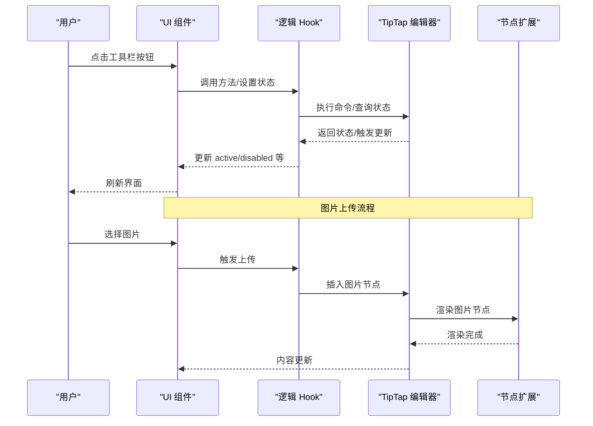
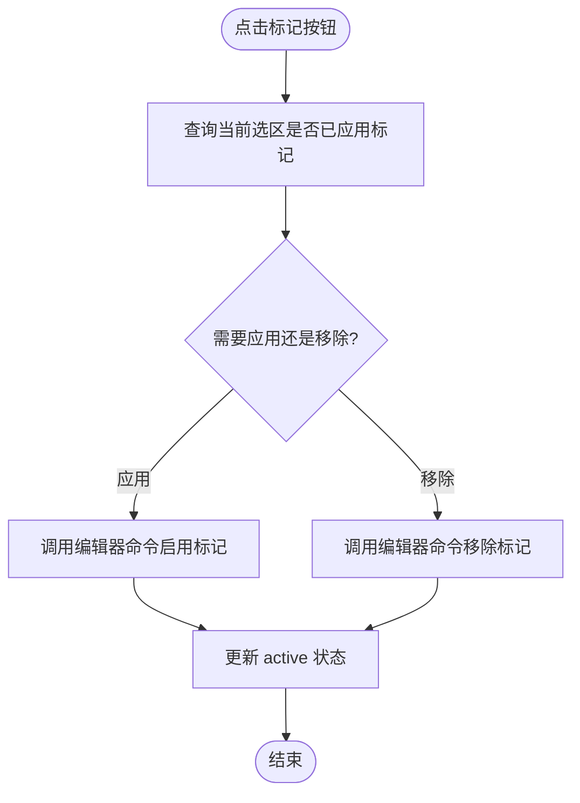
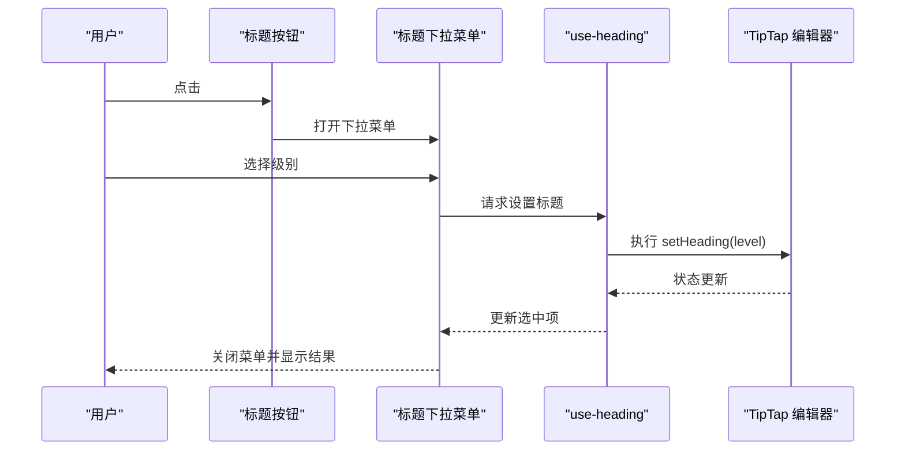
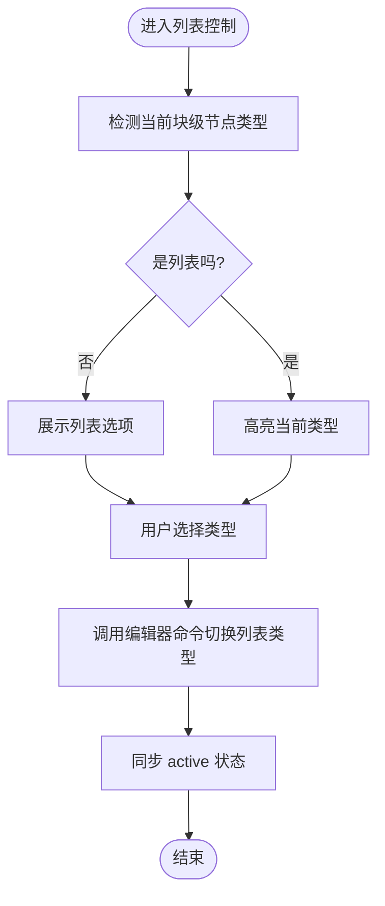
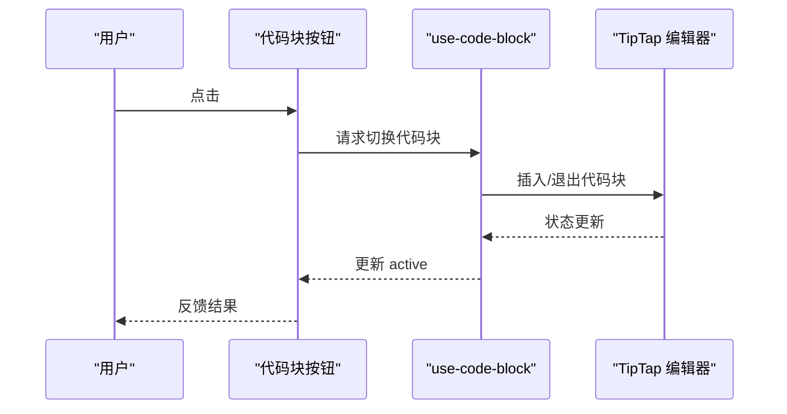
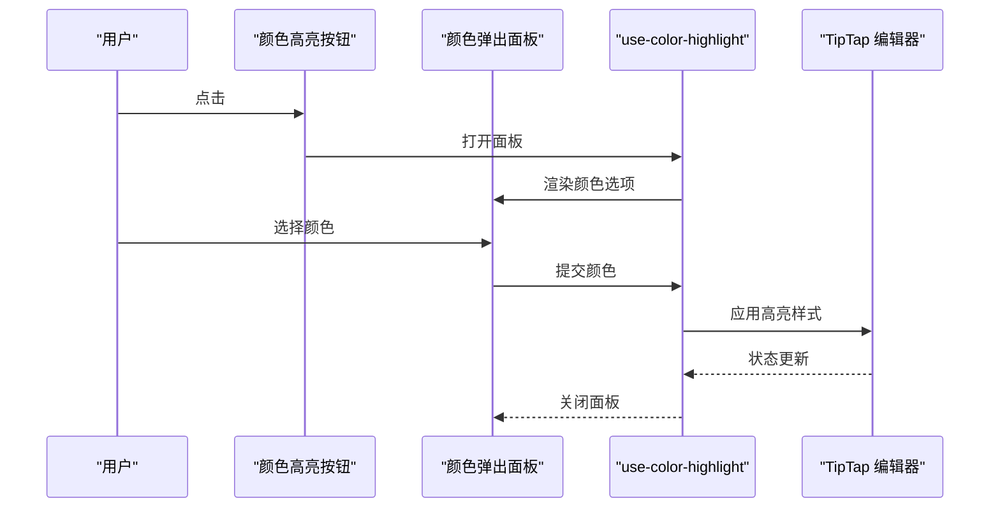
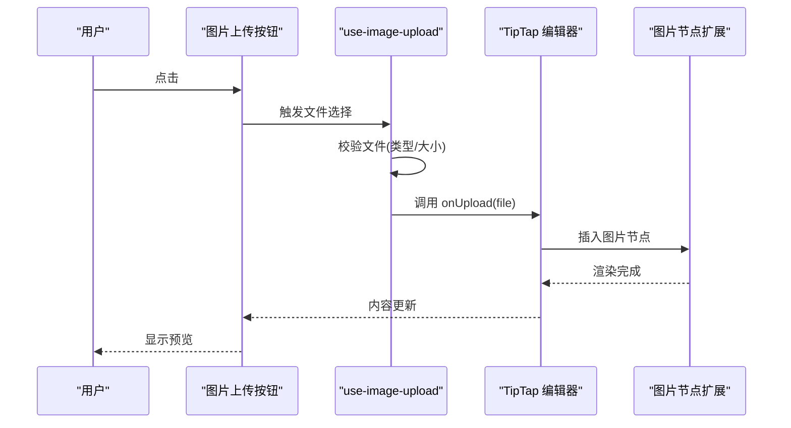
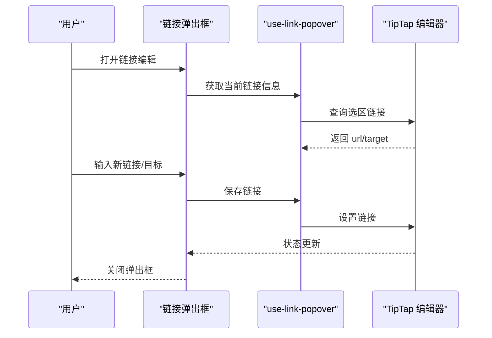
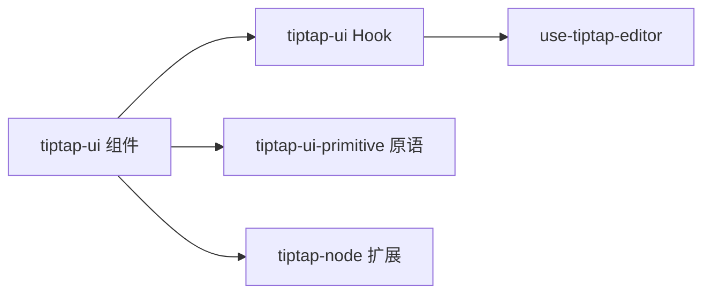

# TipTap UI 组件

<cite>
**本文引用的文件**   
- [src/components/tiptap-ui/index.tsx](file://src/components/tiptap-ui/index.tsx)
- [src/components/tiptap-ui/mark-button.tsx](file://src/components/tiptap-ui/mark-button.tsx)
- [src/components/tiptap-ui/heading-button.tsx](file://src/components/tiptap-ui/heading-button.tsx)
- [src/components/tiptap-ui/heading-dropdown-menu.tsx](file://src/components/tiptap-ui/heading-dropdown-menu.tsx)
- [src/components/tiptap-ui/list-button.tsx](file://src/components/tiptap-ui/list-button.tsx)
- [src/components/tiptap-ui/list-dropdown-menu.tsx](file://src/components/tiptap-ui/list-dropdown-menu.tsx)
- [src/components/tiptap-ui/code-block-button.tsx](file://src/components/tiptap-ui/code-block-button.tsx)
- [src/components/tiptap-ui/color-highlight-button.tsx](file://src/components/tiptap-ui/color-highlight-button.tsx)
- [src/components/tiptap-ui/color-highlight-popover.tsx](file://src/components/tiptap-ui/color-highlight-popover.tsx)
- [src/components/tiptap-ui/image-upload-button.tsx](file://src/components/tiptap-ui/image-upload-button.tsx)
- [src/components/tiptap-ui/link-popover.tsx](file://src/components/tiptap-ui/link-popover.tsx)
- [src/components/tiptap-ui/text-align-button.tsx](file://src/components/tiptap-ui/text-align-button.tsx)
- [src/components/tiptap-ui/undo-redo-button.tsx](file://src/components/tiptap-ui/undo-redo-button.tsx)
- [src/components/tiptap-ui/use-mark.ts](file://src/components/tiptap-ui/use-mark.ts)
- [src/components/tiptap-ui/use-heading.ts](file://src/components/tiptap-ui/use-heading.ts)
- [src/components/tiptap-ui/use-heading-dropdown-menu.ts](file://src/components/tiptap-ui/use-heading-dropdown-menu.ts)
- [src/components/tiptap-ui/use-list.ts](file://src/components/tiptap-ui/use-list.ts)
- [src/components/tiptap-ui/use-list-dropdown-menu.ts](file://src/components/tiptap-ui/use-list-dropdown-menu.ts)
- [src/components/tiptap-ui/use-code-block.ts](file://src/components/tiptap-ui/use-code-block.ts)
- [src/components/tiptap-ui/use-color-highlight.ts](file://src/components/tiptap-ui/use-color-highlight.ts)
- [src/components/tiptap-ui/use-image-upload.ts](file://src/components/tiptap-ui/use-image-upload.ts)
- [src/components/tiptap-ui/use-link-popover.ts](file://src/components/tiptap-ui/use-link-popover.ts)
- [src/components/tiptap-ui/use-text-align.ts](file://src/components/tiptap-ui/use-text-align.ts)
- [src/components/tiptap-ui/use-undo-redo.ts](file://src/components/tiptap-ui/use-undo-redo.ts)
- [src/components/tiptap-ui-primitive/button.tsx](file://src/components/tiptap-ui-primitive/button.tsx)
- [src/components/tiptap-ui-primitive/dropdown-menu.tsx](file://src/components/tiptap-ui-primitive/dropdown-menu.tsx)
- [src/components/tiptap-ui-primitive/popover.tsx](file://src/components/tiptap-ui-primitive/popover.tsx)
- [src/components/tiptap-ui-primitive/toolbar.tsx](file://src/components/tiptap-ui-primitive/toolbar.tsx)
- [src/components/tiptap-node/image-upload-node-extension.ts](file://src/components/tiptap-node/image-upload-node-extension.ts)
- [src/components/tiptap-node/image-upload-node.tsx](file://src/components/tiptap-node/image-upload-node.tsx)
- [src/features/tiptap/SimpleEditor.tsx](file://src/features/tiptap/SimpleEditor.tsx)
- [src/hooks/use-tiptap-editor.ts](file://src/hooks/use-tiptap-editor.ts)
</cite>

## 目录
1. [简介](#简介)
2. [项目结构](#项目结构)
3. [核心组件](#核心组件)
4. [架构总览](#架构总览)
5. [详细组件分析](#详细组件分析)
6. [依赖关系分析](#依赖关系分析)
7. [性能与可访问性](#性能与可访问性)
8. [主题与样式定制](#主题与样式定制)
9. [故障排查指南](#故障排查指南)
10. [结论](#结论)

## 简介
本文件为 FishWorker 中基于 TipTap 的富文本编辑器 UI 组件提供专业文档。内容覆盖标记按钮、标题选择器、列表控制、代码块插入、颜色高亮、图片上传、链接编辑等专用控件，说明其与 TipTap 编辑器的集成方式、数据绑定机制、API 参考（属性、事件、配置）、在自定义工具栏中的使用方式、扩展新功能的最佳实践，以及主题定制与样式覆盖技巧。

## 项目结构
TipTap UI 组件位于 src/components/tiptap-ui 下，采用“UI 组件 + 逻辑 Hook”的分层组织：
- UI 组件：负责渲染与交互（如 mark-button、heading-button、list-button、code-block-button、color-highlight-button、image-upload-button、link-popover 等）
- 逻辑 Hook：封装与 TipTap 编辑器的交互（如 use-mark、use-heading、use-list、use-code-block、use-color-highlight、use-image-upload、use-link-popover、use-text-align、use-undo-redo 等）
- 基础 UI 原语：位于 tiptap-ui-primitive（button、dropdown-menu、popover、toolbar 等），供上层复用
- 节点扩展：位于 tiptap-node（如 image-upload-node-extension、image-upload-node），用于承载编辑器内的复杂节点
- 集成示例：features/tiptap/SimpleEditor.tsx 展示了如何组合上述组件构建完整编辑器

```mermaid
graph TB
subgraph "UI 组件"
MB["mark-button.tsx"]
HB["heading-button.tsx"]
HDM["heading-dropdown-menu.tsx"]
LB["list-button.tsx"]
LDM["list-dropdown-menu.tsx"]
CBB["code-block-button.tsx"]
CHB["color-highlight-button.tsx"]
CHP["color-highlight-popover.tsx"]
IUB["image-upload-button.tsx"]
LP["link-popover.tsx"]
TAB["text-align-button.tsx"]
UR["undo-redo-button.tsx"]
end
subgraph "逻辑 Hook"
UM["use-mark.ts"]
UH["use-heading.ts"]
UHD["use-heading-dropdown-menu.ts"]
UL["use-list.ts"]
ULD["use-list-dropdown-menu.ts"]
UCB["use-code-block.ts"]
UCH["use-color-highlight.ts"]
UIU["use-image-upload.ts"]
ULP["use-link-popover.ts"]
UTAB["use-text-align.ts"]
UUR["use-undo-redo.ts"]
end
subgraph "基础原语"
BTN["button.tsx"]
DDM["dropdown-menu.tsx"]
POP["popover.tsx"]
TOOL["toolbar.tsx"]
end
subgraph "节点扩展"
IUEN["image-upload-node-extension.ts"]
IUENX["image-upload-node.tsx"]
end
MB --> UM
HB --> UH
HDM --> UHD
LB --> UL
LDM --> ULD
CBB --> UCB
CHB --> UCH
CHP --> UCH
IUB --> UIU
LP --> ULP
TAB --> UTAB
UR --> UUR
MB --> BTN
LB --> DDM
HDM --> DDM
LP --> POP
CHP --> POP
MB --> TOOL
HB --> TOOL
LB --> TOOL
CBB --> TOOL
CHB --> TOOL
IUB --> TOOL
LP --> TOOL
TAB --> TOOL
UR --> TOOL
IUB --> IUEN
IUEN --> IUENX
```

图表来源
- [src/components/tiptap-ui/mark-button.tsx](file://src/components/tiptap-ui/mark-button.tsx)
- [src/components/tiptap-ui/heading-button.tsx](file://src/components/tiptap-ui/heading-button.tsx)
- [src/components/tiptap-ui/heading-dropdown-menu.tsx](file://src/components/tiptap-ui/heading-dropdown-menu.tsx)
- [src/components/tiptap-ui/list-button.tsx](file://src/components/tiptap-ui/list-button.tsx)
- [src/components/tiptap-ui/list-dropdown-menu.tsx](file://src/components/tiptap-ui/list-dropdown-menu.tsx)
- [src/components/tiptap-ui/code-block-button.tsx](file://src/components/tiptap-ui/code-block-button.tsx)
- [src/components/tiptap-ui/color-highlight-button.tsx](file://src/components/tiptap-ui/color-highlight-button.tsx)
- [src/components/tiptap-ui/color-highlight-popover.tsx](file://src/components/tiptap-ui/color-highlight-popover.tsx)
- [src/components/tiptap-ui/image-upload-button.tsx](file://src/components/tiptap-ui/image-upload-button.tsx)
- [src/components/tiptap-ui/link-popover.tsx](file://src/components/tiptap-ui/link-popover.tsx)
- [src/components/tiptap-ui/text-align-button.tsx](file://src/components/tiptap-ui/text-align-button.tsx)
- [src/components/tiptap-ui/undo-redo-button.tsx](file://src/components/tiptap-ui/undo-redo-button.tsx)
- [src/components/tiptap-ui/use-mark.ts](file://src/components/tiptap-ui/use-mark.ts)
- [src/components/tiptap-ui/use-heading.ts](file://src/components/tiptap-ui/use-heading.ts)
- [src/components/tiptap-ui/use-heading-dropdown-menu.ts](file://src/components/tiptap-ui/use-heading-dropdown-menu.ts)
- [src/components/tiptap-ui/use-list.ts](file://src/components/tiptap-ui/use-list.ts)
- [src/components/tiptap-ui/use-list-dropdown-menu.ts](file://src/components/tiptap-ui/use-list-dropdown-menu.ts)
- [src/components/tiptap-ui/use-code-block.ts](file://src/components/tiptap-ui/use-code-block.ts)
- [src/components/tiptap-ui/use-color-highlight.ts](file://src/components/tiptap-ui/use-color-highlight.ts)
- [src/components/tiptap-ui/use-image-upload.ts](file://src/components/tiptap-ui/use-image-upload.ts)
- [src/components/tiptap-ui/use-link-popover.ts](file://src/components/tiptap-ui/use-link-popover.ts)
- [src/components/tiptap-ui/use-text-align.ts](file://src/components/tiptap-ui/use-text-align.ts)
- [src/components/tiptap-ui/use-undo-redo.ts](file://src/components/tiptap-ui/use-undo-redo.ts)
- [src/components/tiptap-ui-primitive/button.tsx](file://src/components/tiptap-ui-primitive/button.tsx)
- [src/components/tiptap-ui-primitive/dropdown-menu.tsx](file://src/components/tiptap-ui-primitive/dropdown-menu.tsx)
- [src/components/tiptap-ui-primitive/popover.tsx](file://src/components/tiptap-ui-primitive/popover.tsx)
- [src/components/tiptap-ui-primitive/toolbar.tsx](file://src/components/tiptap-ui-primitive/toolbar.tsx)
- [src/components/tiptap-node/image-upload-node-extension.ts](file://src/components/tiptap-node/image-upload-node-extension.ts)
- [src/components/tiptap-node/image-upload-node.tsx](file://src/components/tiptap-node/image-upload-node.tsx)

章节来源
- [src/components/tiptap-ui/index.tsx](file://src/components/tiptap-ui/index.tsx)
- [src/features/tiptap/SimpleEditor.tsx](file://src/features/tiptap/SimpleEditor.tsx)
- [src/hooks/use-tiptap-editor.ts](file://src/hooks/use-tiptap-editor.ts)

## 核心组件
本节概述各组件的职责与典型用法要点，并给出 API 参考要点（属性、回调、配置）。为避免冗长代码，所有实现细节均通过“章节来源”定位到具体文件行号。

- 标记按钮（Mark Button）
  - 作用：对选中文本应用/移除粗体、斜体、删除线、下划线、上标、下标等标记
  - 关键 Hook：use-mark
  - 常用属性：active（是否激活）、disabled（禁用）、tooltip（提示文案）、icon（图标）、onClick（点击回调）
  - 行为：根据当前选区状态切换标记；支持键盘快捷键
  - 章节来源
    - [src/components/tiptap-ui/mark-button.tsx](file://src/components/tiptap-ui/mark-button.tsx)
    - [src/components/tiptap-ui/use-mark.ts](file://src/components/tiptap-ui/use-mark.ts)

- 标题按钮与下拉菜单（Heading Button & Dropdown）
  - 作用：设置段落为不同级别标题（H1-H6）或正文
  - 关键 Hook：use-heading、use-heading-dropdown-menu
  - 常用属性：value（当前选中级别）、onChange（级别变更回调）、items（可选自定义项）
  - 行为：同步编辑器选区状态；下拉菜单展示可用级别
  - 章节来源
    - [src/components/tiptap-ui/heading-button.tsx](file://src/components/tiptap-ui/heading-button.tsx)
    - [src/components/tiptap-ui/heading-dropdown-menu.tsx](file://src/components/tiptap-ui/heading-dropdown-menu.tsx)
    - [src/components/tiptap-ui/use-heading.ts](file://src/components/tiptap-ui/use-heading.ts)
    - [src/components/tiptap-ui/use-heading-dropdown-menu.ts](file://src/components/tiptap-ui/use-heading-dropdown-menu.ts)

- 列表按钮与下拉菜单（List Button & Dropdown）
  - 作用：切换有序列表、无序列表、待办列表
  - 关键 Hook：use-list、use-list-dropdown-menu
  - 常用属性：type（列表类型）、active（是否激活）、onChange（类型变更回调）
  - 行为：在选区所在块级节点上切换列表类型；保持嵌套层级
  - 章节来源
    - [src/components/tiptap-ui/list-button.tsx](file://src/components/tiptap-ui/list-button.tsx)
    - [src/components/tiptap-ui/list-dropdown-menu.tsx](file://src/components/tiptap-ui/list-dropdown-menu.tsx)
    - [src/components/tiptap-ui/use-list.ts](file://src/components/tiptap-ui/use-list.ts)
    - [src/components/tiptap-ui/use-list-dropdown-menu.ts](file://src/components/tiptap-ui/use-list-dropdown-menu.ts)

- 代码块按钮（Code Block）
  - 作用：在当前光标位置插入或切换代码块节点
  - 关键 Hook：use-code-block
  - 常用属性：language（语言标识，可选）、active（是否处于代码块模式）
  - 行为：插入/退出代码块；支持语法高亮（由外部主题或扩展提供）
  - 章节来源
    - [src/components/tiptap-ui/code-block-button.tsx](file://src/components/tiptap-ui/code-block-button.tsx)
    - [src/components/tiptap-ui/use-code-block.ts](file://src/components/tiptap-ui/use-code-block.ts)

- 颜色高亮按钮与弹出面板（Color Highlight）
  - 作用：为选中文本设置背景高亮色
  - 关键 Hook：use-color-highlight
  - 常用属性：colors（可选颜色集合）、active（是否已应用高亮）、onSelect（选择颜色回调）
  - 行为：打开颜色选择面板；将高亮样式应用到选区
  - 章节来源
    - [src/components/tiptap-ui/color-highlight-button.tsx](file://src/components/tiptap-ui/color-highlight-button.tsx)
    - [src/components/tiptap-ui/color-highlight-popover.tsx](file://src/components/tiptap-ui/color-highlight-popover.tsx)
    - [src/components/tiptap-ui/use-color-highlight.ts](file://src/components/tiptap-ui/use-color-highlight.ts)

- 图片上传按钮（Image Upload）
  - 作用：触发本地图片选择并插入到编辑器
  - 关键 Hook：use-image-upload
  - 常用属性：accept（接受的文件类型）、maxSize（文件大小限制）、onUpload（上传完成回调）
  - 行为：读取文件、校验、调用 onUpload；成功后插入图片节点
  - 章节来源
    - [src/components/tiptap-ui/image-upload-button.tsx](file://src/components/tiptap-ui/image-upload-button.tsx)
    - [src/components/tiptap-ui/use-image-upload.ts](file://src/components/tiptap-ui/use-image-upload.ts)
    - [src/components/tiptap-node/image-upload-node-extension.ts](file://src/components/tiptap-node/image-upload-node-extension.ts)
    - [src/components/tiptap-node/image-upload-node.tsx](file://src/components/tiptap-node/image-upload-node.tsx)

- 链接编辑弹出框（Link Popover）
  - 作用：插入或编辑超链接
  - 关键 Hook：use-link-popover
  - 常用属性：url（当前链接地址）、target（打开方式）、onSave（保存回调）、onCancel（取消回调）
  - 行为：检测选区是否为链接；支持新增/修改/移除链接
  - 章节来源
    - [src/components/tiptap-ui/link-popover.tsx](file://src/components/tiptap-ui/link-popover.tsx)
    - [src/components/tiptap-ui/use-link-popover.ts](file://src/components/tiptap-ui/use-link-popover.ts)

- 文本对齐按钮（Text Align）
  - 作用：设置段落左对齐、居中、右对齐、两端对齐
  - 关键 Hook：use-text-align
  - 常用属性：align（当前对齐方式）、onChange（对齐变更回调）
  - 章节来源
    - [src/components/tiptap-ui/text-align-button.tsx](file://src/components/tiptap-ui/text-align-button.tsx)
    - [src/components/tiptap-ui/use-text-align.ts](file://src/components/tiptap-ui/use-text-align.ts)

- 撤销/重做按钮（Undo/Redo）
  - 作用：执行撤销与重做操作
  - 关键 Hook：use-undo-redo
  - 常用属性：disabled（是否禁用）
  - 章节来源
    - [src/components/tiptap-ui/undo-redo-button.tsx](file://src/components/tiptap-ui/undo-redo-button.tsx)
    - [src/components/tiptap-ui/use-undo-redo.ts](file://src/components/tiptap-ui/use-undo-redo.ts)

## 架构总览
TipTap UI 组件通过 Hook 与 TipTap 编辑器实例进行双向绑定：Hook 订阅编辑器状态变化，并在用户交互时调用编辑器命令更新内容。UI 组件仅负责呈现与交互，业务逻辑集中在 Hook 中，便于测试与复用。

图表来源
- [src/components/tiptap-ui/image-upload-button.tsx](file://src/components/tiptap-ui/image-upload-button.tsx)
- [src/components/tiptap-ui/use-image-upload.ts](file://src/components/tiptap-ui/use-image-upload.ts)
- [src/components/tiptap-node/image-upload-node-extension.ts](file://src/components/tiptap-node/image-upload-node-extension.ts)
- [src/components/tiptap-node/image-upload-node.tsx](file://src/components/tiptap-node/image-upload-node.tsx)
- [src/hooks/use-tiptap-editor.ts](file://src/hooks/use-tiptap-editor.ts)

## 详细组件分析

### 标记按钮（Mark Button）
- 职责：对选区应用/移除文本标记
- 关键交互：
  - 根据当前选区状态计算 active
  - 点击时调用编辑器命令切换标记
- 可访问性：
  - 提供 aria-pressed、aria-label 等语义属性
  - 支持键盘操作
- 扩展建议：
  - 新增标记类型时，复用 use-mark 的逻辑，避免重复实现

图表来源
- [src/components/tiptap-ui/mark-button.tsx](file://src/components/tiptap-ui/mark-button.tsx)
- [src/components/tiptap-ui/use-mark.ts](file://src/components/tiptap-ui/use-mark.ts)

章节来源
- [src/components/tiptap-ui/mark-button.tsx](file://src/components/tiptap-ui/mark-button.tsx)
- [src/components/tiptap-ui/use-mark.ts](file://src/components/tiptap-ui/use-mark.ts)

### 标题选择器（Heading Button & Dropdown）
- 职责：设置段落标题级别
- 关键交互：
  - 下拉菜单展示可用级别
  - 选择后调用编辑器命令设置 heading
- 状态同步：
  - 监听编辑器选区变化，自动更新当前选中项
- 可访问性：
  - 下拉菜单支持键盘导航与焦点管理

图表来源
- [src/components/tiptap-ui/heading-button.tsx](file://src/components/tiptap-ui/heading-button.tsx)
- [src/components/tiptap-ui/heading-dropdown-menu.tsx](file://src/components/tiptap-ui/heading-dropdown-menu.tsx)
- [src/components/tiptap-ui/use-heading.ts](file://src/components/tiptap-ui/use-heading.ts)
- [src/components/tiptap-ui/use-heading-dropdown-menu.ts](file://src/components/tiptap-ui/use-heading-dropdown-menu.ts)

章节来源
- [src/components/tiptap-ui/heading-button.tsx](file://src/components/tiptap-ui/heading-button.tsx)
- [src/components/tiptap-ui/heading-dropdown-menu.tsx](file://src/components/tiptap-ui/heading-dropdown-menu.tsx)
- [src/components/tiptap-ui/use-heading.ts](file://src/components/tiptap-ui/use-heading.ts)
- [src/components/tiptap-ui/use-heading-dropdown-menu.ts](file://src/components/tiptap-ui/use-heading-dropdown-menu.ts)

### 列表控制（List Button & Dropdown）
- 职责：切换有序/无序/待办列表
- 关键交互：
  - 根据当前块级节点类型决定 active 状态
  - 选择列表类型后调用编辑器命令切换
- 注意事项：
  - 保持嵌套层级与缩进
  - 对空段落与已有列表的处理差异

图表来源
- [src/components/tiptap-ui/list-button.tsx](file://src/components/tiptap-ui/list-button.tsx)
- [src/components/tiptap-ui/list-dropdown-menu.tsx](file://src/components/tiptap-ui/list-dropdown-menu.tsx)
- [src/components/tiptap-ui/use-list.ts](file://src/components/tiptap-ui/use-list.ts)
- [src/components/tiptap-ui/use-list-dropdown-menu.ts](file://src/components/tiptap-ui/use-list-dropdown-menu.ts)

章节来源
- [src/components/tiptap-ui/list-button.tsx](file://src/components/tiptap-ui/list-button.tsx)
- [src/components/tiptap-ui/list-dropdown-menu.tsx](file://src/components/tiptap-ui/list-dropdown-menu.tsx)
- [src/components/tiptap-ui/use-list.ts](file://src/components/tiptap-ui/use-list.ts)
- [src/components/tiptap-ui/use-list-dropdown-menu.ts](file://src/components/tiptap-ui/use-list-dropdown-menu.ts)

### 代码块插入（Code Block）
- 职责：插入/切换代码块节点
- 关键交互：
  - 在光标处插入代码块或退出代码块
  - 支持 language 属性以配合语法高亮
- 可访问性：
  - 提供合适的标签与提示文案

图表来源
- [src/components/tiptap-ui/code-block-button.tsx](file://src/components/tiptap-ui/code-block-button.tsx)
- [src/components/tiptap-ui/use-code-block.ts](file://src/components/tiptap-ui/use-code-block.ts)

章节来源
- [src/components/tiptap-ui/code-block-button.tsx](file://src/components/tiptap-ui/code-block-button.tsx)
- [src/components/tiptap-ui/use-code-block.ts](file://src/components/tiptap-ui/use-code-block.ts)

### 颜色高亮（Color Highlight）
- 职责：为选中文本设置背景高亮色
- 关键交互：
  - 打开颜色弹出面板
  - 选择颜色后应用到选区
- 可访问性：
  - 颜色对比度提示（可由主题提供）
  - 键盘导航与确认

图表来源
- [src/components/tiptap-ui/color-highlight-button.tsx](file://src/components/tiptap-ui/color-highlight-button.tsx)
- [src/components/tiptap-ui/color-highlight-popover.tsx](file://src/components/tiptap-ui/color-highlight-popover.tsx)
- [src/components/tiptap-ui/use-color-highlight.ts](file://src/components/tiptap-ui/use-color-highlight.ts)

章节来源
- [src/components/tiptap-ui/color-highlight-button.tsx](file://src/components/tiptap-ui/color-highlight-button.tsx)
- [src/components/tiptap-ui/color-highlight-popover.tsx](file://src/components/tiptap-ui/color-highlight-popover.tsx)
- [src/components/tiptap-ui/use-color-highlight.ts](file://src/components/tiptap-ui/use-color-highlight.ts)

### 图片上传（Image Upload）
- 职责：选择本地图片并插入到编辑器
- 关键交互：
  - 触发文件选择
  - 校验文件类型与大小
  - 调用 onUpload 处理上传逻辑
  - 成功后插入图片节点
- 节点扩展：
  - image-upload-node-extension 定义节点结构与行为
  - image-upload-node 负责渲染与交互

图表来源
- [src/components/tiptap-ui/image-upload-button.tsx](file://src/components/tiptap-ui/image-upload-button.tsx)
- [src/components/tiptap-ui/use-image-upload.ts](file://src/components/tiptap-ui/use-image-upload.ts)
- [src/components/tiptap-node/image-upload-node-extension.ts](file://src/components/tiptap-node/image-upload-node-extension.ts)
- [src/components/tiptap-node/image-upload-node.tsx](file://src/components/tiptap-node/image-upload-node.tsx)

章节来源
- [src/components/tiptap-ui/image-upload-button.tsx](file://src/components/tiptap-ui/image-upload-button.tsx)
- [src/components/tiptap-ui/use-image-upload.ts](file://src/components/tiptap-ui/use-image-upload.ts)
- [src/components/tiptap-node/image-upload-node-extension.ts](file://src/components/tiptap-node/image-upload-node-extension.ts)
- [src/components/tiptap-node/image-upload-node.tsx](file://src/components/tiptap-node/image-upload-node.tsx)

### 链接编辑（Link Popover）
- 职责：插入或编辑超链接
- 关键交互：
  - 检测选区是否为链接
  - 支持新增/修改/移除链接
  - 提供 target 选项
- 可访问性：
  - 输入框与按钮的焦点管理
  - 键盘导航与回车确认

图表来源
- [src/components/tiptap-ui/link-popover.tsx](file://src/components/tiptap-ui/link-popover.tsx)
- [src/components/tiptap-ui/use-link-popover.ts](file://src/components/tiptap-ui/use-link-popover.ts)

章节来源
- [src/components/tiptap-ui/link-popover.tsx](file://src/components/tiptap-ui/link-popover.tsx)
- [src/components/tiptap-ui/use-link-popover.ts](file://src/components/tiptap-ui/use-link-popover.ts)

### 文本对齐（Text Align）
- 职责：设置段落对齐方式
- 关键交互：
  - 根据当前块级节点的对齐样式更新 active
  - 选择对齐方式后调用编辑器命令
- 可访问性：
  - 提供清晰的图标与提示文案

章节来源
- [src/components/tiptap-ui/text-align-button.tsx](file://src/components/tiptap-ui/text-align-button.tsx)
- [src/components/tiptap-ui/use-text-align.ts](file://src/components/tiptap-ui/use-text-align.ts)

### 撤销/重做（Undo/Redo）
- 职责：执行撤销与重做
- 关键交互：
  - 根据编辑器历史栈更新 disabled 状态
  - 调用编辑器命令执行操作
- 可访问性：
  - 提供快捷键支持（Ctrl/Cmd+Z/Y）

章节来源
- [src/components/tiptap-ui/undo-redo-button.tsx](file://src/components/tiptap-ui/undo-redo-button.tsx)
- [src/components/tiptap-ui/use-undo-redo.ts](file://src/components/tiptap-ui/use-undo-redo.ts)

## 依赖关系分析
- 组件与 Hook 的耦合：
  - 每个 UI 组件对应一个或多个 Hook，负责状态与命令调用
  - Hook 直接依赖 TipTap 编辑器实例（通过 use-tiptap-editor 或注入）
- 基础原语复用：
  - button、dropdown-menu、popover、toolbar 被多个组件复用，降低重复代码
- 节点扩展：
  - 图片上传节点通过扩展机制嵌入编辑器，与 UI 组件解耦

图表来源
- [src/components/tiptap-ui/index.tsx](file://src/components/tiptap-ui/index.tsx)
- [src/hooks/use-tiptap-editor.ts](file://src/hooks/use-tiptap-editor.ts)
- [src/components/tiptap-ui-primitive/button.tsx](file://src/components/tiptap-ui-primitive/button.tsx)
- [src/components/tiptap-ui-primitive/dropdown-menu.tsx](file://src/components/tiptap-ui-primitive/dropdown-menu.tsx)
- [src/components/tiptap-ui-primitive/popover.tsx](file://src/components/tiptap-ui-primitive/popover.tsx)
- [src/components/tiptap-ui-primitive/toolbar.tsx](file://src/components/tiptap-ui-primitive/toolbar.tsx)
- [src/components/tiptap-node/image-upload-node-extension.ts](file://src/components/tiptap-node/image-upload-node-extension.ts)

章节来源
- [src/components/tiptap-ui/index.tsx](file://src/components/tiptap-ui/index.tsx)
- [src/hooks/use-tiptap-editor.ts](file://src/hooks/use-tiptap-editor.ts)

## 性能与可访问性
- 性能
  - 使用 Hook 集中管理状态，减少不必要的重渲染
  - 图片上传前进行客户端校验，避免无效网络请求
  - 下拉菜单与弹出框按需渲染，减少初始开销
- 可访问性
  - 为按钮与输入控件提供语义化属性（aria-*）
  - 支持键盘导航与焦点管理
  - 颜色高亮需考虑对比度，确保可读性

[本节为通用指导，不直接分析具体文件]

## 主题与样式定制
- 主题变量
  - 通过 SCSS 变量与 CSS 类名覆盖默认样式
  - 颜色高亮与按钮组样式可通过主题文件统一调整
- 样式覆盖技巧
  - 使用更具体的选择器覆盖默认样式
  - 为工具栏与弹出框提供独立的主题类名，避免全局污染
- 图标与配色
  - 图标组件可按主题替换
  - 按钮与下拉菜单的颜色方案应保持一致

章节来源
- [src/components/tiptap-ui/color-highlight-button.scss](file://src/components/tiptap-ui/color-highlight-button.scss)
- [src/components/tiptap-ui/link-popover.scss](file://src/components/tiptap-ui/link-popover.scss)
- [src/components/tiptap-ui-primitive/badge-colors.scss](file://src/components/tiptap-ui-primitive/badge-colors.scss)
- [src/components/tiptap-ui-primitive/button-colors.scss](file://src/components/tiptap-ui-primitive/button-colors.scss)
- [src/components/tiptap-ui-primitive/badge-group.scss](file://src/components/tiptap-ui-primitive/badge-group.scss)
- [src/components/tiptap-ui-primitive/button-group.scss](file://src/components/tiptap-ui-primitive/button-group.scss)
- [src/components/tiptap-ui-primitive/button.scss](file://src/components/tiptap-ui-primitive/button.scss)
- [src/components/tiptap-ui-primitive/card.scss](file://src/components/tiptap-ui-primitive/card.scss)
- [src/components/tiptap-ui-primitive/dropdown-menu.scss](file://src/components/tiptap-ui-primitive/dropdown-menu.scss)
- [src/components/tiptap-ui-primitive/input.scss](file://src/components/tiptap-ui-primitive/input.scss)
- [src/components/tiptap-ui-primitive/popover.scss](file://src/components/tiptap-ui-primitive/popover.scss)
- [src/components/tiptap-ui-primitive/separator.scss](file://src/components/tiptap-ui-primitive/separator.scss)
- [src/components/tiptap-ui-primitive/toolbar.scss](file://src/components/tiptap-ui-primitive/toolbar.scss)
- [src/components/tiptap-ui-primitive/tooltip.scss](file://src/components/tiptap-ui-primitive/tooltip.scss)

## 故障排查指南
- 常见问题
  - 图片上传失败：检查 accept 与 maxSize 配置；确认 onUpload 回调是否正确处理响应
  - 链接未生效：确认选区是否为文本；检查 URL 格式与 target 值
  - 列表样式异常：检查外层容器样式是否与列表节点冲突
- 调试建议
  - 在 Hook 中添加日志输出，观察编辑器状态变化
  - 使用浏览器开发者工具检查 DOM 结构与样式覆盖情况
  - 验证键盘导航与焦点顺序是否符合预期

章节来源
- [src/components/tiptap-ui/image-upload-button.tsx](file://src/components/tiptap-ui/image-upload-button.tsx)
- [src/components/tiptap-ui/link-popover.tsx](file://src/components/tiptap-ui/link-popover.tsx)
- [src/components/tiptap-ui/list-button.tsx](file://src/components/tiptap-ui/list-button.tsx)

## 结论
FishWorker 的 TipTap UI 组件通过“UI 组件 + 逻辑 Hook”的分层设计，实现了与编辑器的松耦合集成。组件具备完善的可访问性与可扩展性，适合在自定义工具栏中灵活组合。通过主题与样式覆盖，可快速适配产品视觉风格。建议在扩展新功能时遵循现有模式，复用基础原语与 Hook，确保一致的用户体验与维护性。