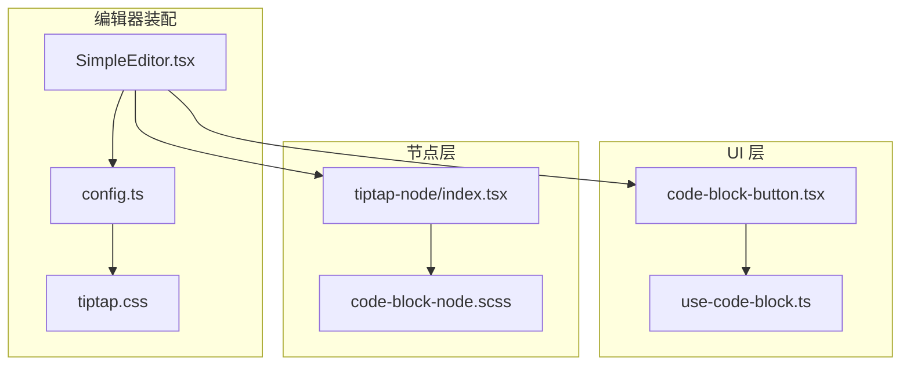
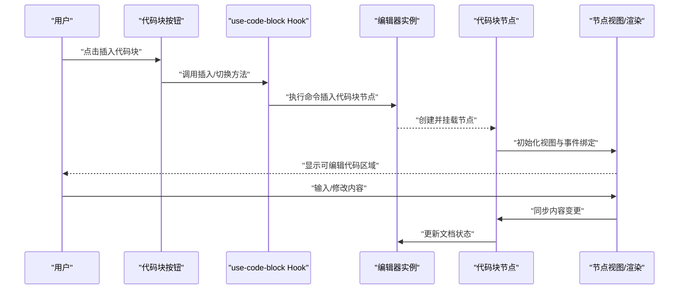
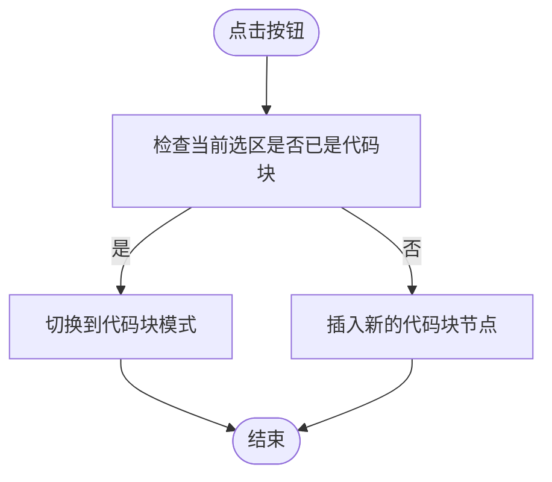
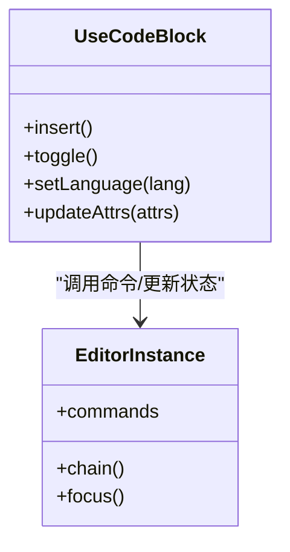
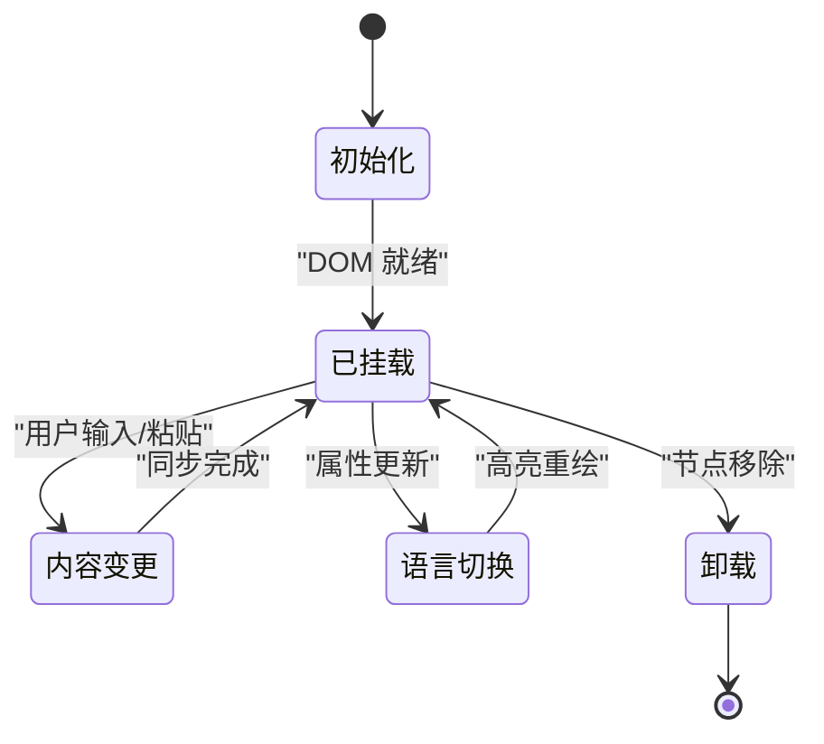
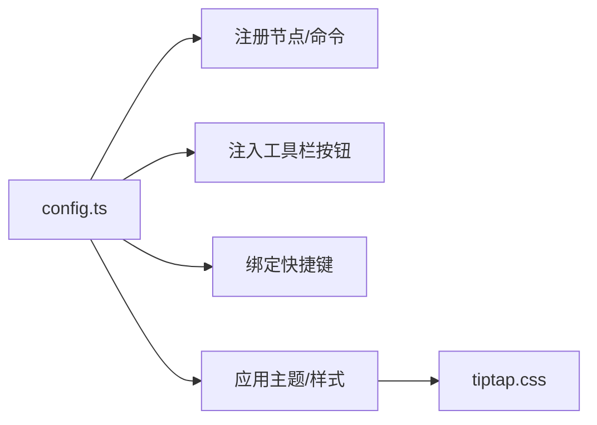
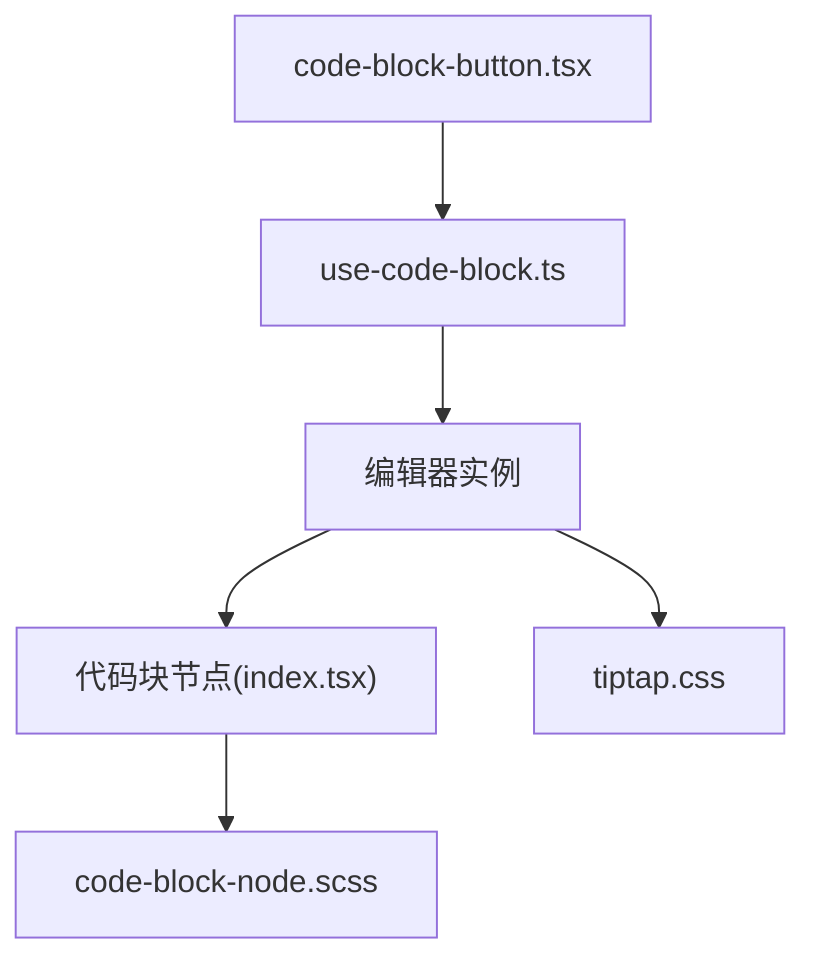

# 代码块控制组件

<cite>
**本文引用的文件**   
- [code-block-node.scss](file://src/components/tiptap-node/code-block-node.scss)
- [code-block-button.tsx](file://src/components/tiptap-ui/code-block-button.tsx)
- [use-code-block.ts](file://src/components/tiptap-ui/use-code-block.ts)
- [index.tsx](file://src/components/tiptap-node/index.tsx)
- [SimpleEditor.tsx](file://src/features/tiptap/SimpleEditor.tsx)
- [config.ts](file://src/features/tiptap/config.ts)
- [tiptap.css](file://src/features/tiptap/tiptap.css)
</cite>

## 目录
1. [简介](#简介)
2. [项目结构](#项目结构)
3. [核心组件](#核心组件)
4. [架构总览](#架构总览)
5. [详细组件分析](#详细组件分析)
6. [依赖分析](#依赖分析)
7. [性能考虑](#性能考虑)
8. [故障排查指南](#故障排查指南)
9. [结论](#结论)
10. [附录：API 参考与扩展指南](#附录api-参考与扩展指南)

## 简介
本文件围绕“代码块控制组件”进行系统化文档化，覆盖以下关键主题：
- 代码块插入、语法高亮与编辑能力
- 代码块节点的生命周期管理、内容同步与渲染优化
- 完整的 API 参考（语言选择、主题配置、快捷键）
- 自定义样式与扩展语法高亮支持
- 导入导出与其他编辑功能的集成方案

该组件基于 Tiptap 编辑器生态构建，通过自定义节点与 UI 控制逻辑实现可插拔的代码块体验。

## 项目结构
与代码块相关的源码主要分布在以下位置：
- 节点视图与样式：src/components/tiptap-node/...
- UI 按钮与控制 Hook：src/components/tiptap-ui/...
- 编辑器装配与配置：src/features/tiptap/...

图表来源
- [SimpleEditor.tsx](file://src/features/tiptap/SimpleEditor.tsx)
- [config.ts](file://src/features/tiptap/config.ts)
- [tiptap.css](file://src/features/tiptap/tiptap.css)
- [code-block-button.tsx](file://src/components/tiptap-ui/code-block-button.tsx)
- [use-code-block.ts](file://src/components/tiptap-ui/use-code-block.ts)
- [index.tsx](file://src/components/tiptap-node/index.tsx)
- [code-block-node.scss](file://src/components/tiptap-node/code-block-node.scss)

章节来源
- [SimpleEditor.tsx](file://src/features/tiptap/SimpleEditor.tsx)
- [config.ts](file://src/features/tiptap/config.ts)
- [tiptap.css](file://src/features/tiptap/tiptap.css)
- [code-block-button.tsx](file://src/components/tiptap-ui/code-block-button.tsx)
- [use-code-block.ts](file://src/components/tiptap-ui/use-code-block.ts)
- [index.tsx](file://src/components/tiptap-node/index.tsx)
- [code-block-node.scss](file://src/components/tiptap-node/code-block-node.scss)

## 核心组件
- 代码块按钮：提供工具栏入口，触发插入或切换代码块模式
- 代码块 Hook：封装插入、切换语言、更新属性等常用操作
- 代码块节点：定义代码块的节点类型、序列化/反序列化、渲染与交互
- 编辑器装配：将代码块节点与 UI 控制整合到编辑器实例中

章节来源
- [code-block-button.tsx](file://src/components/tiptap-ui/code-block-button.tsx)
- [use-code-block.ts](file://src/components/tiptap-ui/use-code-block.ts)
- [index.tsx](file://src/components/tiptap-node/index.tsx)
- [SimpleEditor.tsx](file://src/features/tiptap/SimpleEditor.tsx)

## 架构总览
下图展示了从用户点击工具栏到代码块渲染的完整调用链，以及节点生命周期中的关键阶段。

图表来源
- [code-block-button.tsx](file://src/components/tiptap-ui/code-block-button.tsx)
- [use-code-block.ts](file://src/components/tiptap-ui/use-code-block.ts)
- [index.tsx](file://src/components/tiptap-node/index.tsx)

## 详细组件分析

### 代码块按钮（UI 入口）
职责
- 在工具栏展示“代码块”按钮
- 根据当前选区状态决定是“插入新代码块”还是“切换为代码块”
- 与 use-code-block Hook 协作完成具体动作

交互流程
- 点击按钮 -> 调用 Hook 提供的插入/切换方法 -> 触发编辑器命令 -> 更新选中状态

图表来源
- [code-block-button.tsx](file://src/components/tiptap-ui/code-block-button.tsx)
- [use-code-block.ts](file://src/components/tiptap-ui/use-code-block.ts)

章节来源
- [code-block-button.tsx](file://src/components/tiptap-ui/code-block-button.tsx)
- [use-code-block.ts](file://src/components/tiptap-ui/use-code-block.ts)

### 代码块 Hook（use-code-block）
职责
- 封装插入代码块、切换语言、设置属性等常用操作
- 暴露统一接口供按钮、键盘快捷键、气泡菜单等调用
- 处理编辑器命令与状态同步

典型能力
- 插入代码块：在当前光标处插入一个默认语言的代码块
- 切换语言：更新已选中代码块的语言属性
- 批量操作：对多个选中代码块执行相同操作（如统一语言）

图表来源
- [use-code-block.ts](file://src/components/tiptap-ui/use-code-block.ts)

章节来源
- [use-code-block.ts](file://src/components/tiptap-ui/use-code-block.ts)

### 代码块节点（Node）
职责
- 定义代码块节点的数据结构与序列化规则
- 提供渲染视图（含可编辑区域、行号、复制等可选功能）
- 处理键盘事件（如 Tab 缩进、Enter 换行）、粘贴行为
- 与外部语法高亮库集成（按需加载与销毁）

生命周期要点
- 创建：解析初始内容与语言属性
- 挂载：注册事件监听、初始化高亮引擎
- 更新：响应属性变化（如语言切换）与内容变更
- 卸载：释放资源（取消监听、销毁高亮实例）

图表来源
- [index.tsx](file://src/components/tiptap-node/index.tsx)
- [code-block-node.scss](file://src/components/tiptap-node/code-block-node.scss)

章节来源
- [index.tsx](file://src/components/tiptap-node/index.tsx)
- [code-block-node.scss](file://src/components/tiptap-node/code-block-node.scss)

### 编辑器装配与配置
职责
- 将代码块节点注册到编辑器
- 注入工具栏按钮与快捷键
- 应用全局样式与主题变量

图表来源
- [config.ts](file://src/features/tiptap/config.ts)
- [tiptap.css](file://src/features/tiptap/tiptap.css)
- [SimpleEditor.tsx](file://src/features/tiptap/SimpleEditor.tsx)

章节来源
- [config.ts](file://src/features/tiptap/config.ts)
- [tiptap.css](file://src/features/tiptap/tiptap.css)
- [SimpleEditor.tsx](file://src/features/tiptap/SimpleEditor.tsx)

## 依赖分析
- 组件耦合
  - 按钮与 Hook 解耦：按钮仅负责触发，Hook 封装业务逻辑
  - Hook 与编辑器强耦合：直接调用编辑器命令与状态
  - 节点与渲染样式分离：SCSS 独立维护外观
- 外部依赖
  - 语法高亮：可在节点视图中按需引入第三方库（例如 Prism.js 或 highlight.js），并在节点卸载时清理
  - 编辑器内核：Tiptap 命令系统与节点机制

图表来源
- [code-block-button.tsx](file://src/components/tiptap-ui/code-block-button.tsx)
- [use-code-block.ts](file://src/components/tiptap-ui/use-code-block.ts)
- [index.tsx](file://src/components/tiptap-node/index.tsx)
- [code-block-node.scss](file://src/components/tiptap-node/code-block-node.scss)
- [tiptap.css](file://src/features/tiptap/tiptap.css)

章节来源
- [code-block-button.tsx](file://src/components/tiptap-ui/code-block-button.tsx)
- [use-code-block.ts](file://src/components/tiptap-ui/use-code-block.ts)
- [index.tsx](file://src/components/tiptap-node/index.tsx)
- [code-block-node.scss](file://src/components/tiptap-node/code-block-node.scss)
- [tiptap.css](file://src/features/tiptap/tiptap.css)

## 性能考虑
- 延迟高亮：仅在代码块可见时初始化高亮引擎，避免首屏阻塞
- 增量更新：语言切换时仅重绘受影响区域
- 防抖/节流：大量输入场景下合并高亮计算
- 内存回收：节点卸载时及时释放高亮实例与事件监听
- 样式隔离：使用独立的 SCSS 文件，避免全局污染

[本节为通用指导，不直接分析具体文件]

## 故障排查指南
常见问题与定位建议
- 插入后无高亮
  - 确认节点已正确挂载且高亮库已加载
  - 检查语言属性是否正确传递
  - 查看控制台是否有高亮库报错
- 切换语言无效
  - 确认 Hook 的 setLanguage 被调用
  - 验证节点视图是否收到属性更新并重绘
- 粘贴格式错乱
  - 检查节点的粘贴处理器是否过滤了多余标签
- 样式异常
  - 核对 SCSS 是否被打包
  - 检查主题变量是否与 tiptap.css 一致

章节来源
- [code-block-node.scss](file://src/components/tiptap-node/code-block-node.scss)
- [tiptap.css](file://src/features/tiptap/tiptap.css)
- [index.tsx](file://src/components/tiptap-node/index.tsx)
- [use-code-block.ts](file://src/components/tiptap-ui/use-code-block.ts)

## 结论
代码块控制组件通过“按钮 + Hook + 节点 + 配置”的分层设计，实现了可扩展、易维护的代码块能力。借助节点生命周期管理与按需高亮策略，在保证用户体验的同时兼顾性能。后续可通过插件化方式进一步扩展语言支持与交互能力。

[本节为总结性内容，不直接分析具体文件]

## 附录：API 参考与扩展指南

### 编辑器装配 API（config.ts / SimpleEditor.tsx）
- 注册代码块节点
  - 作用：将自定义代码块节点加入编辑器
  - 参数：节点定义对象（包含 schema、render 等）
- 注入工具栏按钮
  - 作用：在工具栏添加“代码块”按钮
  - 参数：按钮组件引用
- 绑定快捷键
  - 作用：为插入/切换代码块绑定快捷键
  - 参数：键组合与对应命令

章节来源
- [config.ts](file://src/features/tiptap/config.ts)
- [SimpleEditor.tsx](file://src/features/tiptap/SimpleEditor.tsx)

### 代码块 Hook API（use-code-block.ts）
- insert()
  - 作用：在当前光标处插入一个新的代码块
  - 参数：可选初始语言
- toggle()
  - 作用：若当前选区为代码块则退出，否则转换为代码块
- setLanguage(lang)
  - 作用：更新选中代码块的语言属性
  - 参数：语言标识字符串
- updateAttrs(attrs)
  - 作用：批量更新代码块属性（如语言、类名等）
  - 参数：属性映射对象

章节来源
- [use-code-block.ts](file://src/components/tiptap-ui/use-code-block.ts)

### 代码块节点 API（index.tsx）
- 节点属性
  - language：字符串，表示高亮语言
  - content：字符串，代码文本内容
- 生命周期钩子
  - onMount：用于初始化高亮引擎与事件绑定
  - onUpdate：响应内容或属性变化
  - onDestroy：释放资源
- 事件处理
  - onKeyDown：处理 Tab、Enter、Backspace 等
  - onPaste：过滤富文本，保留纯文本

章节来源
- [index.tsx](file://src/components/tiptap-node/index.tsx)

### 样式与主题（code-block-node.scss / tiptap.css）
- 代码块容器样式
  - 背景、边框、圆角、内边距
- 行号与滚动条
  - 行号列宽度、滚动条样式
- 主题变量
  - 通过 CSS 变量控制明暗主题下的颜色

章节来源
- [code-block-node.scss](file://src/components/tiptap-node/code-block-node.scss)
- [tiptap.css](file://src/features/tiptap/tiptap.css)

### 语言选择与高亮扩展
- 内置语言
  - 由所接入的高亮库决定（如 Prism.js 或 highlight.js）
- 动态加载
  - 首次使用时按需加载对应语言包
- 自定义语言
  - 在高亮库中注册自定义语法规则
  - 在节点中确保 language 属性与高亮库识别一致

章节来源
- [index.tsx](file://src/components/tiptap-node/index.tsx)
- [use-code-block.ts](file://src/components/tiptap-ui/use-code-block.ts)

### 快捷键支持
- 推荐快捷键
  - 插入代码块：Ctrl/Cmd + Alt + C
  - 切换语言：在代码块内 Ctrl/Cmd + Shift + L
- 实现方式
  - 在编辑器装配时绑定快捷键到相应命令
  - 在 Hook 中暴露对应方法

章节来源
- [config.ts](file://src/features/tiptap/config.ts)
- [use-code-block.ts](file://src/components/tiptap-ui/use-code-block.ts)

### 导入导出与集成
- 导入
  - 从 JSON/Markdown 解析代码块节点
  - 校验 language 字段并回退到默认语言
- 导出
  - 将代码块序列化为 Markdown 或 HTML
  - 保留语言元数据以便二次渲染
- 与其他功能集成
  - 与“查找替换”联动：在代码块内忽略正则匹配
  - 与“撤销/重做”联动：利用编辑器命令保证一致性

章节来源
- [index.tsx](file://src/components/tiptap-node/index.tsx)
- [SimpleEditor.tsx](file://src/features/tiptap/SimpleEditor.tsx)