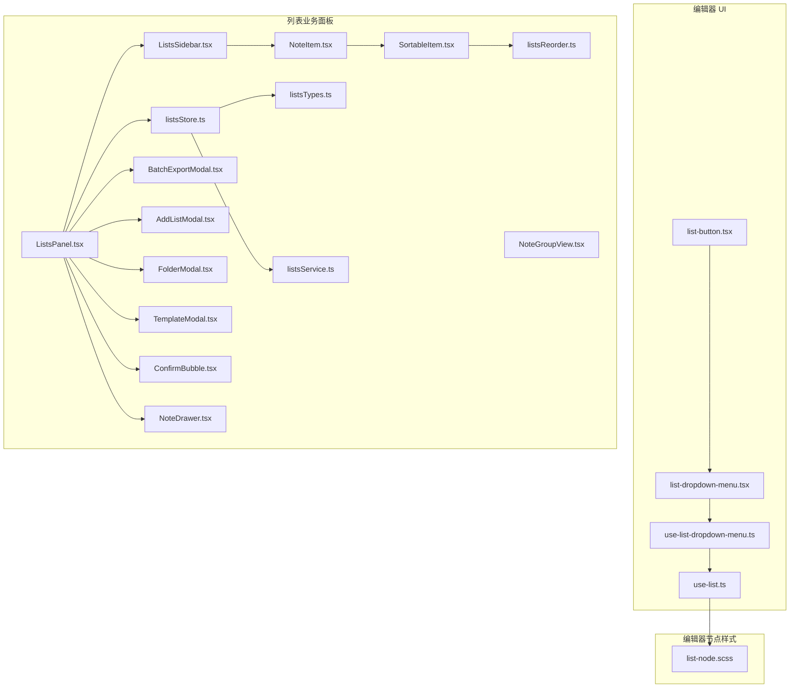
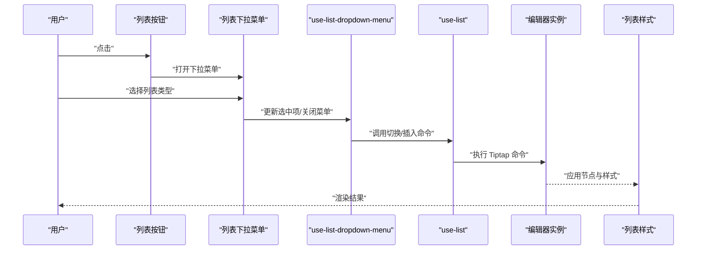
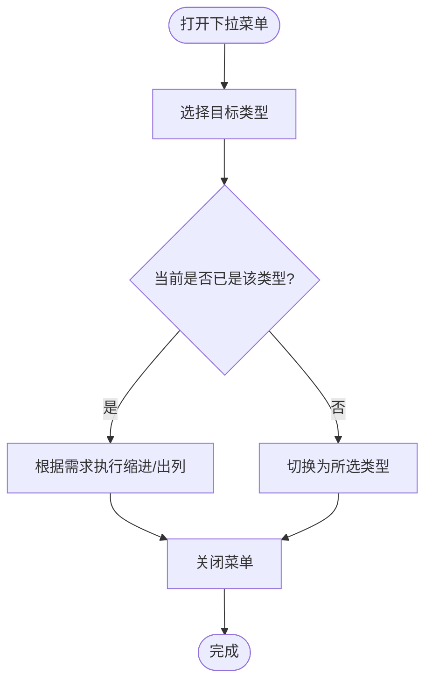
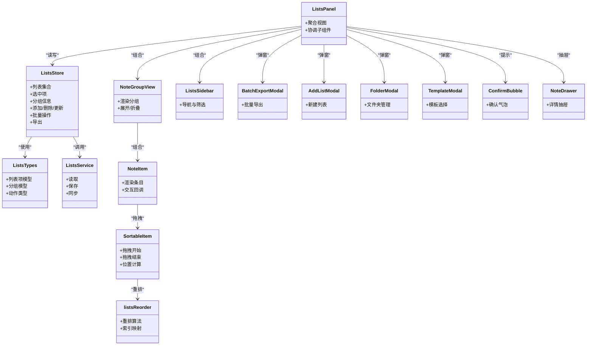
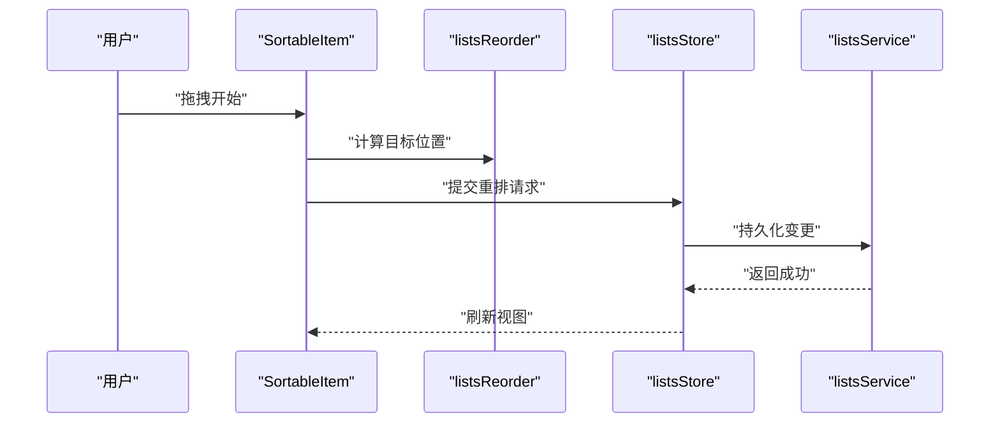
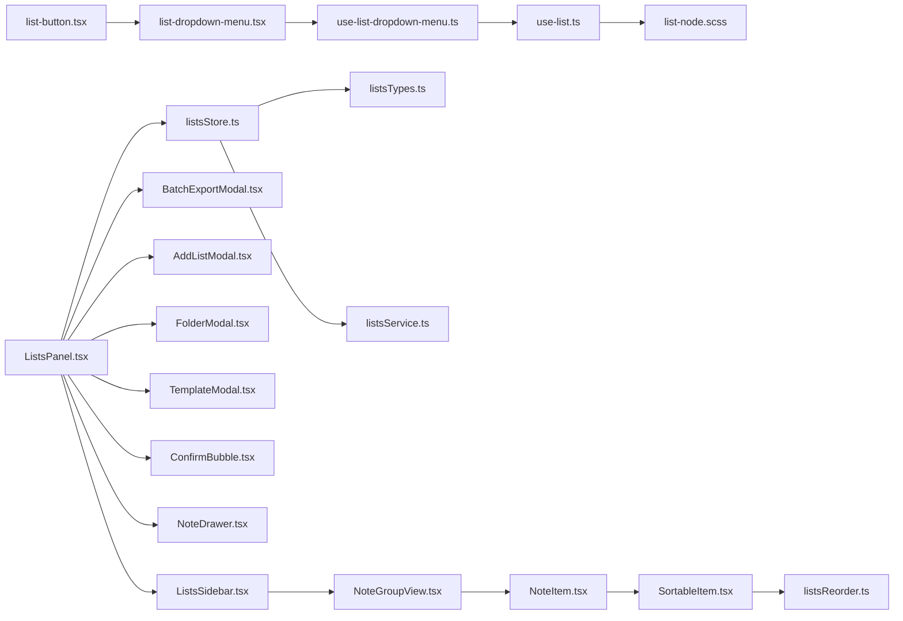

# 列表结构控制组件

<cite>
**本文引用的文件**   
- [src/components/tiptap-ui/list-button.tsx](file://src/components/tiptap-ui/list-button.tsx)
- [src/components/tiptap-ui/list-dropdown-menu.tsx](file://src/components/tiptap-ui/list-dropdown-menu.tsx)
- [src/components/tiptap-ui/use-list-dropdown-menu.ts](file://src/components/tiptap-ui/use-list-dropdown-menu.ts)
- [src/components/tiptap-ui/use-list.ts](file://src/components/tiptap-ui/use-list.ts)
- [src/components/tiptap-node/list-node.scss](file://src/components/tiptap-node/list-node.scss)
- [src/features/lists/listsStore.ts](file://src/features/lists/listsStore.ts)
- [src/features/lists/listsTypes.ts](file://src/features/lists/listsTypes.ts)
- [src/features/lists/SortableItem.tsx](file://src/features/lists/SortableItem.tsx)
- [src/features/lists/listsReorder.ts](file://src/features/lists/listsReorder.ts)
- [src/features/lists/NoteItem.tsx](file://src/features/lists/NoteItem.tsx)
- [src/features/lists/NoteGroupView.tsx](file://src/features/lists/NoteGroupView.tsx)
- [src/features/lists/ListsPanel.tsx](file://src/features/lists/ListsPanel.tsx)
- [src/features/lists/ListsSidebar.tsx](file://src/features/lists/ListsSidebar.tsx)
- [src/features/lists/BatchExportModal.tsx](file://src/features/lists/BatchExportModal.tsx)
- [src/features/lists/AddListModal.tsx](file://src/features/lists/AddListModal.tsx)
- [src/features/lists/FolderModal.tsx](file://src/features/lists/FolderModal.tsx)
- [src/features/lists/TemplateModal.tsx](file://src/features/lists/TemplateModal.tsx)
- [src/features/lists/ConfirmBubble.tsx](file://src/features/lists/ConfirmBubble.tsx)
- [src/features/lists/NoteDrawer.tsx](file://src/features/lists/NoteDrawer.tsx)
- [src/features/lists/listsService.ts](file://src/features/lists/listsService.ts)
- [src/features/lists/lists.css](file://src/features/lists/lists.css)
</cite>

## 目录
1. [简介](#简介)
2. [项目结构](#项目结构)
3. [核心组件](#核心组件)
4. [架构总览](#架构总览)
5. [详细组件分析](#详细组件分析)
6. [依赖关系分析](#依赖关系分析)
7. [性能考虑](#性能考虑)
8. [故障排查指南](#故障排查指南)
9. [结论](#结论)
10. [附录：API 参考](#附录api-参考)

## 简介
本文件面向“列表结构控制组件”，聚焦于在编辑器中实现无序列表、有序列表与待办事项列表的插入与管理，覆盖以下能力：
- 列表类型切换（无序/有序/待办）
- 嵌套支持（多级缩进）
- 下拉菜单交互机制
- 样式定制与主题适配
- 复杂操作：拖拽排序、批量编辑、格式转换
- 状态管理与事件回调
- 性能优化与兼容性建议

## 项目结构
围绕列表功能的前端代码主要分布在两个区域：
- 编辑器工具栏与下拉菜单：位于 tiptap-ui 层，负责用户交互与命令触发
- 列表业务面板与数据流：位于 features/lists 层，负责列表数据的增删改查、分组、导出等

图表来源
- [src/components/tiptap-ui/list-button.tsx](file://src/components/tiptap-ui/list-button.tsx)
- [src/components/tiptap-ui/list-dropdown-menu.tsx](file://src/components/tiptap-ui/list-dropdown-menu.tsx)
- [src/components/tiptap-ui/use-list-dropdown-menu.ts](file://src/components/tiptap-ui/use-list-dropdown-menu.ts)
- [src/components/tiptap-ui/use-list.ts](file://src/components/tiptap-ui/use-list.ts)
- [src/components/tiptap-node/list-node.scss](file://src/components/tiptap-node/list-node.scss)
- [src/features/lists/ListsPanel.tsx](file://src/features/lists/ListsPanel.tsx)
- [src/features/lists/ListsSidebar.tsx](file://src/features/lists/ListsSidebar.tsx)
- [src/features/lists/NoteItem.tsx](file://src/features/lists/NoteItem.tsx)
- [src/features/lists/NoteGroupView.tsx](file://src/features/lists/NoteGroupView.tsx)
- [src/features/lists/SortableItem.tsx](file://src/features/lists/SortableItem.tsx)
- [src/features/lists/listsReorder.ts](file://src/features/lists/listsReorder.ts)
- [src/features/lists/listsStore.ts](file://src/features/lists/listsStore.ts)
- [src/features/lists/listsTypes.ts](file://src/features/lists/listsTypes.ts)
- [src/features/lists/listsService.ts](file://src/features/lists/listsService.ts)
- [src/features/lists/BatchExportModal.tsx](file://src/features/lists/BatchExportModal.tsx)
- [src/features/lists/AddListModal.tsx](file://src/features/lists/AddListModal.tsx)
- [src/features/lists/FolderModal.tsx](file://src/features/lists/FolderModal.tsx)
- [src/features/lists/TemplateModal.tsx](file://src/features/lists/TemplateModal.tsx)
- [src/features/lists/ConfirmBubble.tsx](file://src/features/lists/ConfirmBubble.tsx)
- [src/features/lists/NoteDrawer.tsx](file://src/features/lists/NoteDrawer.tsx)

章节来源
- [src/components/tiptap-ui/list-button.tsx](file://src/components/tiptap-ui/list-button.tsx)
- [src/components/tiptap-ui/list-dropdown-menu.tsx](file://src/components/tiptap-ui/list-dropdown-menu.tsx)
- [src/components/tiptap-ui/use-list-dropdown-menu.ts](file://src/components/tiptap-ui/use-list-dropdown-menu.ts)
- [src/components/tiptap-ui/use-list.ts](file://src/components/tiptap-ui/use-list.ts)
- [src/components/tiptap-node/list-node.scss](file://src/components/tiptap-node/list-node.scss)
- [src/features/lists/ListsPanel.tsx](file://src/features/lists/ListsPanel.tsx)
- [src/features/lists/ListsSidebar.tsx](file://src/features/lists/ListsSidebar.tsx)
- [src/features/lists/NoteItem.tsx](file://src/features/lists/NoteItem.tsx)
- [src/features/lists/NoteGroupView.tsx](file://src/features/lists/NoteGroupView.tsx)
- [src/features/lists/SortableItem.tsx](file://src/features/lists/SortableItem.tsx)
- [src/features/lists/listsReorder.ts](file://src/features/lists/listsReorder.ts)
- [src/features/lists/listsStore.ts](file://src/features/lists/listsStore.ts)
- [src/features/lists/listsTypes.ts](file://src/features/lists/listsTypes.ts)
- [src/features/lists/listsService.ts](file://src/features/lists/listsService.ts)
- [src/features/lists/BatchExportModal.tsx](file://src/features/lists/BatchExportModal.tsx)
- [src/features/lists/AddListModal.tsx](file://src/features/lists/AddListModal.tsx)
- [src/features/lists/FolderModal.tsx](file://src/features/lists/FolderModal.tsx)
- [src/features/lists/TemplateModal.tsx](file://src/features/lists/TemplateModal.tsx)
- [src/features/lists/ConfirmBubble.tsx](file://src/features/lists/ConfirmBubble.tsx)
- [src/features/lists/NoteDrawer.tsx](file://src/features/lists/NoteDrawer.tsx)

## 核心组件
本节聚焦编辑器侧的列表控制入口与交互逻辑。

- 列表按钮：提供点击入口，用于打开列表类型选择下拉菜单
- 列表下拉菜单：展示“无序列表/有序列表/待办事项”三类选项，并处理选中项的激活与关闭
- use-list-dropdown-menu：封装下拉菜单的状态管理、键盘导航、焦点管理等
- use-list：封装与编辑器实例的交互，执行插入/切换/缩进/出列等命令
- list-node.scss：定义列表渲染样式（含嵌套层级缩进、标记样式等）

章节来源
- [src/components/tiptap-ui/list-button.tsx](file://src/components/tiptap-ui/list-button.tsx)
- [src/components/tiptap-ui/list-dropdown-menu.tsx](file://src/components/tiptap-ui/list-dropdown-menu.tsx)
- [src/components/tiptap-ui/use-list-dropdown-menu.ts](file://src/components/tiptap-ui/use-list-dropdown-menu.ts)
- [src/components/tiptap-ui/use-list.ts](file://src/components/tiptap-ui/use-list.ts)
- [src/components/tiptap-node/list-node.scss](file://src/components/tiptap-node/list-node.scss)

## 架构总览
从用户操作到编辑器变更的数据流如下：

图表来源
- [src/components/tiptap-ui/list-button.tsx](file://src/components/tiptap-ui/list-button.tsx)
- [src/components/tiptap-ui/list-dropdown-menu.tsx](file://src/components/tiptap-ui/list-dropdown-menu.tsx)
- [src/components/tiptap-ui/use-list-dropdown-menu.ts](file://src/components/tiptap-ui/use-list-dropdown-menu.ts)
- [src/components/tiptap-ui/use-list.ts](file://src/components/tiptap-ui/use-list.ts)
- [src/components/tiptap-node/list-node.scss](file://src/components/tiptap-node/list-node.scss)

## 详细组件分析

### 列表下拉菜单与类型切换
- 菜单项包含三种类型：无序列表、有序列表、待办事项
- 通过 use-list 提供的 API 进行类型切换或插入新列表项
- 支持键盘导航与焦点管理，提升可访问性
- 支持嵌套：通过缩进/出列命令调整层级

图表来源
- [src/components/tiptap-ui/list-dropdown-menu.tsx](file://src/components/tiptap-ui/list-dropdown-menu.tsx)
- [src/components/tiptap-ui/use-list-dropdown-menu.ts](file://src/components/tiptap-ui/use-list-dropdown-menu.ts)
- [src/components/tiptap-ui/use-list.ts](file://src/components/tiptap-ui/use-list.ts)

章节来源
- [src/components/tiptap-ui/list-dropdown-menu.tsx](file://src/components/tiptap-ui/list-dropdown-menu.tsx)
- [src/components/tiptap-ui/use-list-dropdown-menu.ts](file://src/components/tiptap-ui/use-list-dropdown-menu.ts)
- [src/components/tiptap-ui/use-list.ts](file://src/components/tiptap-ui/use-list.ts)

### 列表样式与嵌套支持
- 使用 SCSS 对列表节点进行样式化，包括不同层级的缩进与标记样式
- 通过 CSS 变量或主题类名实现样式定制
- 针对待办事项复选框与文本的对齐、间距进行微调

章节来源
- [src/components/tiptap-node/list-node.scss](file://src/components/tiptap-node/list-node.scss)

### 列表业务面板与数据流
列表业务面板负责列表数据的组织、展示与持久化，关键职责：
- 列表分组与视图：分组容器、条目渲染、抽屉详情
- 拖拽排序：基于拖拽库与重排算法，保证顺序一致性
- 批量操作：批量导出、批量删除、批量移动
- 模板与文件夹：快速创建、分类管理
- 状态管理：集中式 store 维护列表集合、选中态、撤销栈等
- 服务层：与后端或本地存储交互

图表来源
- [src/features/lists/listsStore.ts](file://src/features/lists/listsStore.ts)
- [src/features/lists/listsTypes.ts](file://src/features/lists/listsTypes.ts)
- [src/features/lists/listsService.ts](file://src/features/lists/listsService.ts)
- [src/features/lists/SortableItem.tsx](file://src/features/lists/SortableItem.tsx)
- [src/features/lists/listsReorder.ts](file://src/features/lists/listsReorder.ts)
- [src/features/lists/NoteItem.tsx](file://src/features/lists/NoteItem.tsx)
- [src/features/lists/NoteGroupView.tsx](file://src/features/lists/NoteGroupView.tsx)
- [src/features/lists/ListsPanel.tsx](file://src/features/lists/ListsPanel.tsx)
- [src/features/lists/ListsSidebar.tsx](file://src/features/lists/ListsSidebar.tsx)
- [src/features/lists/BatchExportModal.tsx](file://src/features/lists/BatchExportModal.tsx)
- [src/features/lists/AddListModal.tsx](file://src/features/lists/AddListModal.tsx)
- [src/features/lists/FolderModal.tsx](file://src/features/lists/FolderModal.tsx)
- [src/features/lists/TemplateModal.tsx](file://src/features/lists/TemplateModal.tsx)
- [src/features/lists/ConfirmBubble.tsx](file://src/features/lists/ConfirmBubble.tsx)
- [src/features/lists/NoteDrawer.tsx](file://src/features/lists/NoteDrawer.tsx)

章节来源
- [src/features/lists/listsStore.ts](file://src/features/lists/listsStore.ts)
- [src/features/lists/listsTypes.ts](file://src/features/lists/listsTypes.ts)
- [src/features/lists/listsService.ts](file://src/features/lists/listsService.ts)
- [src/features/lists/SortableItem.tsx](file://src/features/lists/SortableItem.tsx)
- [src/features/lists/listsReorder.ts](file://src/features/lists/listsReorder.ts)
- [src/features/lists/NoteItem.tsx](file://src/features/lists/NoteItem.tsx)
- [src/features/lists/NoteGroupView.tsx](file://src/features/lists/NoteGroupView.tsx)
- [src/features/lists/ListsPanel.tsx](file://src/features/lists/ListsPanel.tsx)
- [src/features/lists/ListsSidebar.tsx](file://src/features/lists/ListsSidebar.tsx)
- [src/features/lists/BatchExportModal.tsx](file://src/features/lists/BatchExportModal.tsx)
- [src/features/lists/AddListModal.tsx](file://src/features/lists/AddListModal.tsx)
- [src/features/lists/FolderModal.tsx](file://src/features/lists/FolderModal.tsx)
- [src/features/lists/TemplateModal.tsx](file://src/features/lists/TemplateModal.tsx)
- [src/features/lists/ConfirmBubble.tsx](file://src/features/lists/ConfirmBubble.tsx)
- [src/features/lists/NoteDrawer.tsx](file://src/features/lists/NoteDrawer.tsx)

### 拖拽排序与批量编辑
- 拖拽排序：通过拖拽组件与重排算法配合，实时更新列表顺序
- 批量编辑：支持多选后统一修改属性（如移动到某分组、批量删除等）
- 批量导出：将选定列表导出为指定格式

图表来源
- [src/features/lists/SortableItem.tsx](file://src/features/lists/SortableItem.tsx)
- [src/features/lists/listsReorder.ts](file://src/features/lists/listsReorder.ts)
- [src/features/lists/listsStore.ts](file://src/features/lists/listsStore.ts)
- [src/features/lists/listsService.ts](file://src/features/lists/listsService.ts)

章节来源
- [src/features/lists/SortableItem.tsx](file://src/features/lists/SortableItem.tsx)
- [src/features/lists/listsReorder.ts](file://src/features/lists/listsReorder.ts)
- [src/features/lists/listsStore.ts](file://src/features/lists/listsStore.ts)
- [src/features/lists/listsService.ts](file://src/features/lists/listsService.ts)

### 格式转换与嵌套支持
- 在编辑器内，可将当前行转换为无序/有序/待办类型
- 通过缩进/出列命令实现多级嵌套
- 批量转换：选中多个列表项后统一转换类型

章节来源
- [src/components/tiptap-ui/use-list.ts](file://src/components/tiptap-ui/use-list.ts)
- [src/components/tiptap-node/list-node.scss](file://src/components/tiptap-node/list-node.scss)

## 依赖关系分析
- 编辑器 UI 层依赖 use-list 与 use-list-dropdown-menu，进而驱动编辑器命令与样式
- 列表业务层依赖 store、types、service，并通过弹窗与抽屉扩展交互
- 拖拽排序依赖重排算法与 store 的原子更新

图表来源
- [src/components/tiptap-ui/list-button.tsx](file://src/components/tiptap-ui/list-button.tsx)
- [src/components/tiptap-ui/list-dropdown-menu.tsx](file://src/components/tiptap-ui/list-dropdown-menu.tsx)
- [src/components/tiptap-ui/use-list-dropdown-menu.ts](file://src/components/tiptap-ui/use-list-dropdown-menu.ts)
- [src/components/tiptap-ui/use-list.ts](file://src/components/tiptap-ui/use-list.ts)
- [src/components/tiptap-node/list-node.scss](file://src/components/tiptap-node/list-node.scss)
- [src/features/lists/ListsPanel.tsx](file://src/features/lists/ListsPanel.tsx)
- [src/features/lists/ListsSidebar.tsx](file://src/features/lists/ListsSidebar.tsx)
- [src/features/lists/NoteGroupView.tsx](file://src/features/lists/NoteGroupView.tsx)
- [src/features/lists/NoteItem.tsx](file://src/features/lists/NoteItem.tsx)
- [src/features/lists/SortableItem.tsx](file://src/features/lists/SortableItem.tsx)
- [src/features/lists/listsReorder.ts](file://src/features/lists/listsReorder.ts)
- [src/features/lists/listsStore.ts](file://src/features/lists/listsStore.ts)
- [src/features/lists/listsTypes.ts](file://src/features/lists/listsTypes.ts)
- [src/features/lists/listsService.ts](file://src/features/lists/listsService.ts)
- [src/features/lists/BatchExportModal.tsx](file://src/features/lists/BatchExportModal.tsx)
- [src/features/lists/AddListModal.tsx](file://src/features/lists/AddListModal.tsx)
- [src/features/lists/FolderModal.tsx](file://src/features/lists/FolderModal.tsx)
- [src/features/lists/TemplateModal.tsx](file://src/features/lists/TemplateModal.tsx)
- [src/features/lists/ConfirmBubble.tsx](file://src/features/lists/ConfirmBubble.tsx)
- [src/features/lists/NoteDrawer.tsx](file://src/features/lists/NoteDrawer.tsx)

章节来源
- [src/components/tiptap-ui/list-button.tsx](file://src/components/tiptap-ui/list-button.tsx)
- [src/components/tiptap-ui/list-dropdown-menu.tsx](file://src/components/tiptap-ui/list-dropdown-menu.tsx)
- [src/components/tiptap-ui/use-list-dropdown-menu.ts](file://src/components/tiptap-ui/use-list-dropdown-menu.ts)
- [src/components/tiptap-ui/use-list.ts](file://src/components/tiptap-ui/use-list.ts)
- [src/components/tiptap-node/list-node.scss](file://src/components/tiptap-node/list-node.scss)
- [src/features/lists/ListsPanel.tsx](file://src/features/lists/ListsPanel.tsx)
- [src/features/lists/ListsSidebar.tsx](file://src/features/lists/ListsSidebar.tsx)
- [src/features/lists/NoteGroupView.tsx](file://src/features/lists/NoteGroupView.tsx)
- [src/features/lists/NoteItem.tsx](file://src/features/lists/NoteItem.tsx)
- [src/features/lists/SortableItem.tsx](file://src/features/lists/SortableItem.tsx)
- [src/features/lists/listsReorder.ts](file://src/features/lists/listsReorder.ts)
- [src/features/lists/listsStore.ts](file://src/features/lists/listsStore.ts)
- [src/features/lists/listsTypes.ts](file://src/features/lists/listsTypes.ts)
- [src/features/lists/listsService.ts](file://src/features/lists/listsService.ts)
- [src/features/lists/BatchExportModal.tsx](file://src/features/lists/BatchExportModal.tsx)
- [src/features/lists/AddListModal.tsx](file://src/features/lists/AddListModal.tsx)
- [src/features/lists/FolderModal.tsx](file://src/features/lists/FolderModal.tsx)
- [src/features/lists/TemplateModal.tsx](file://src/features/lists/TemplateModal.tsx)
- [src/features/lists/ConfirmBubble.tsx](file://src/features/lists/ConfirmBubble.tsx)
- [src/features/lists/NoteDrawer.tsx](file://src/features/lists/NoteDrawer.tsx)

## 性能考虑
- 列表渲染
  - 使用虚拟滚动或分页加载，避免一次性渲染大量条目
  - 对长列表采用 memo 化与稳定 key，减少不必要的重渲染
- 拖拽排序
  - 合并多次重排为一次批量更新，降低 store 更新频率
  - 使用稳定的 ID 与最小化 diff，提高重绘效率
- 网络与服务层
  - 对批量操作进行节流与去抖，避免频繁请求
  - 使用增量更新与乐观更新策略，提升交互响应
- 样式与主题
  - 将样式拆分为模块，按需加载，减少首屏体积
  - 使用 CSS 变量统一管理主题色与间距，便于运行时切换

[本节为通用性能建议，不直接分析具体文件]

## 故障排查指南
- 列表类型未生效
  - 检查 use-list 的命令调用是否正确
  - 确认当前光标位置是否在有效的列表节点上
- 嵌套异常
  - 检查缩进/出列命令的参数与边界条件
  - 验证 list-node.scss 的层级样式是否被覆盖
- 拖拽错位
  - 核对 sortable 配置与重排算法的索引映射
  - 确保列表项 ID 唯一且稳定
- 批量操作失败
  - 检查批量导出/删除的请求参数与权限
  - 查看错误日志与重试策略

章节来源
- [src/components/tiptap-ui/use-list.ts](file://src/components/tiptap-ui/use-list.ts)
- [src/components/tiptap-node/list-node.scss](file://src/components/tiptap-node/list-node.scss)
- [src/features/lists/SortableItem.tsx](file://src/features/lists/SortableItem.tsx)
- [src/features/lists/listsReorder.ts](file://src/features/lists/listsReorder.ts)
- [src/features/lists/BatchExportModal.tsx](file://src/features/lists/BatchExportModal.tsx)

## 结论
本组件以“编辑器 UI + 业务面板”的双层架构实现了完整的列表管理能力：
- 在编辑器侧，通过下拉菜单与 use-list 命令实现灵活的列表类型切换与嵌套
- 在业务侧，通过 store/service 与拖拽、批量操作、模板与文件夹等功能，形成闭环
- 样式层提供可定制的列表外观，满足多主题与品牌化需求
- 性能与兼容性方面，建议结合虚拟滚动、批量更新与增量同步策略进一步优化

[本节为总结性内容，不直接分析具体文件]

## 附录：API 参考

### 编辑器侧 API（use-list）
- 作用：封装与编辑器实例的交互，提供插入/切换/缩进/出列等能力
- 典型方法
  - 插入列表：在当前光标处插入对应类型的列表项
  - 切换类型：将当前行转换为无序/有序/待办类型
  - 缩进/出列：调整当前列表项的层级
- 返回值与副作用
  - 无返回值，副作用为编辑器文档变更
- 注意事项
  - 需在有效节点上下文中调用
  - 批量操作建议合并为单次事务

章节来源
- [src/components/tiptap-ui/use-list.ts](file://src/components/tiptap-ui/use-list.ts)

### 下拉菜单 Hook（use-list-dropdown-menu）
- 作用：管理下拉菜单的显示/隐藏、选中项、键盘导航与焦点
- 典型属性
  - 菜单可见性
  - 当前选中类型
  - 回调：onSelect(type)、onClose()
- 行为
  - 支持方向键导航与回车确认
  - 自动关闭与失焦处理

章节来源
- [src/components/tiptap-ui/use-list-dropdown-menu.ts](file://src/components/tiptap-ui/use-list-dropdown-menu.ts)

### 列表按钮组件（list-button）
- 作用：作为下拉菜单的触发器
- 典型属性
  - 图标与标题
  - 禁用态与 Tooltip
- 事件
  - onClick：打开下拉菜单

章节来源
- [src/components/tiptap-ui/list-button.tsx](file://src/components/tiptap-ui/list-button.tsx)

### 列表下拉菜单组件（list-dropdown-menu）
- 作用：展示列表类型选项并处理选择
- 典型属性
  - 菜单项列表
  - 选中项高亮
  - 对齐与定位
- 事件
  - onSelect：触发类型切换

章节来源
- [src/components/tiptap-ui/list-dropdown-menu.tsx](file://src/components/tiptap-ui/list-dropdown-menu.tsx)

### 列表样式（list-node.scss）
- 作用：定义列表节点的外观与嵌套层级样式
- 关键点
  - 不同层级的缩进值
  - 标记符号与待办复选框样式
  - 主题变量接入点

章节来源
- [src/components/tiptap-node/list-node.scss](file://src/components/tiptap-node/list-node.scss)

### 列表业务 Store（listsStore）
- 作用：集中管理列表数据、分组、选中态与批量操作
- 典型方法
  - 新增/删除/更新列表项
  - 批量移动/删除/导出
  - 撤销/重做
- 状态
  - 列表集合、分组树、选中项集合、操作历史

章节来源
- [src/features/lists/listsStore.ts](file://src/features/lists/listsStore.ts)

### 列表业务类型（listsTypes）
- 作用：定义列表项、分组、动作类型等数据结构
- 关键点
  - 唯一标识与版本字段
  - 关联关系（父级、分组）
  - 枚举与约束

章节来源
- [src/features/lists/listsTypes.ts](file://src/features/lists/listsTypes.ts)

### 列表服务（listsService）
- 作用：与后端或本地存储交互，提供读写与同步能力
- 典型方法
  - 读取列表数据
  - 保存/更新
  - 批量导入/导出
- 错误处理
  - 网络异常重试与降级策略

章节来源
- [src/features/lists/listsService.ts](file://src/features/lists/listsService.ts)

### 拖拽与重排（SortableItem / listsReorder）
- 作用：实现拖拽排序与位置计算
- 关键点
  - 拖拽开始/结束钩子
  - 目标位置判定与索引映射
  - 与 store 的批量更新集成

章节来源
- [src/features/lists/SortableItem.tsx](file://src/features/lists/SortableItem.tsx)
- [src/features/lists/listsReorder.ts](file://src/features/lists/listsReorder.ts)

### 列表视图与交互（ListsPanel / ListsSidebar / NoteGroupView / NoteItem）
- 作用：聚合视图、分组渲染、条目交互与抽屉详情
- 关键点
  - 分组展开/折叠
  - 条目多选与批量操作入口
  - 抽屉中的编辑与预览

章节来源
- [src/features/lists/ListsPanel.tsx](file://src/features/lists/ListsPanel.tsx)
- [src/features/lists/ListsSidebar.tsx](file://src/features/lists/ListsSidebar.tsx)
- [src/features/lists/NoteGroupView.tsx](file://src/features/lists/NoteGroupView.tsx)
- [src/features/lists/NoteItem.tsx](file://src/features/lists/NoteItem.tsx)

### 辅助弹窗与提示（BatchExportModal / AddListModal / FolderModal / TemplateModal / ConfirmBubble / NoteDrawer）
- 作用：提供批量导出、新建列表、文件夹管理、模板选择、确认气泡与详情抽屉
- 关键点
  - 表单校验与反馈
  - 异步操作进度与错误提示
  - 与 store 的联动更新

章节来源
- [src/features/lists/BatchExportModal.tsx](file://src/features/lists/BatchExportModal.tsx)
- [src/features/lists/AddListModal.tsx](file://src/features/lists/AddListModal.tsx)
- [src/features/lists/FolderModal.tsx](file://src/features/lists/FolderModal.tsx)
- [src/features/lists/TemplateModal.tsx](file://src/features/lists/TemplateModal.tsx)
- [src/features/lists/ConfirmBubble.tsx](file://src/features/lists/ConfirmBubble.tsx)
- [src/features/lists/NoteDrawer.tsx](file://src/features/lists/NoteDrawer.tsx)