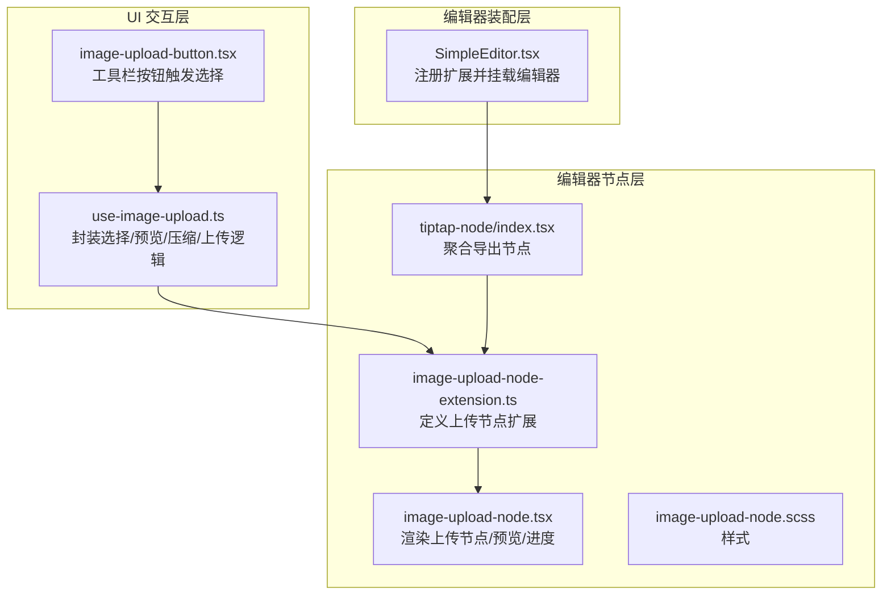
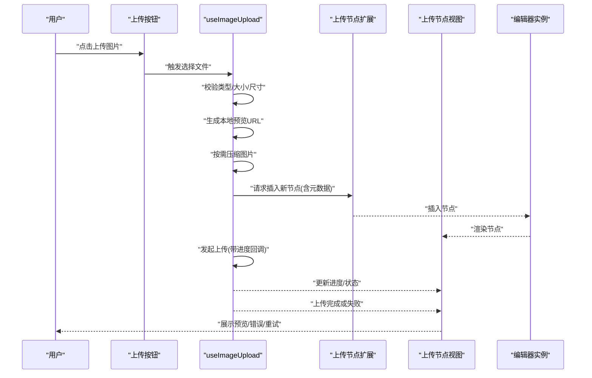
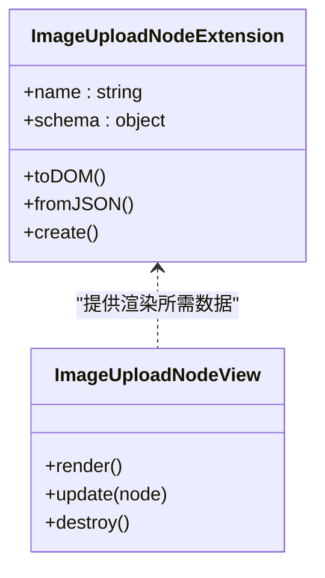
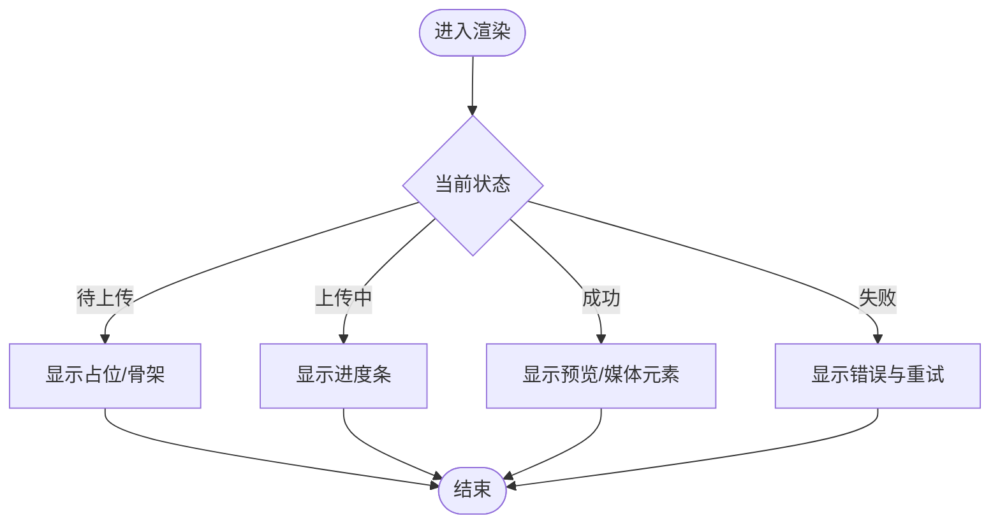
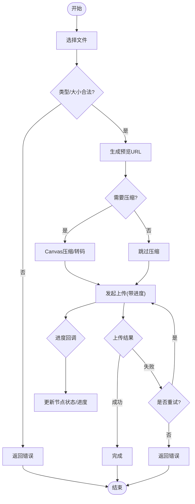
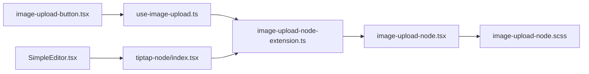

# 媒体上传控制组件

<cite>
**本文引用的文件**   
- [image-upload-node-extension.ts](file://src/components/tiptap-node/image-upload-node-extension.ts)
- [image-upload-node.tsx](file://src/components/tiptap-node/image-upload-node.tsx)
- [image-upload-node.scss](file://src/components/tiptap-node/image-upload-node.scss)
- [use-image-upload.ts](file://src/components/tiptap-ui/use-image-upload.ts)
- [image-upload-button.tsx](file://src/components/tiptap-ui/image-upload-button.tsx)
- [index.tsx](file://src/components/tiptap-node/index.tsx)
- [SimpleEditor.tsx](file://src/features/tiptap/SimpleEditor.tsx)
</cite>

## 目录
1. [简介](#简介)
2. [项目结构](#项目结构)
3. [核心组件](#核心组件)
4. [架构总览](#架构总览)
5. [详细组件分析](#详细组件分析)
6. [依赖关系分析](#依赖关系分析)
7. [性能考虑](#性能考虑)
8. [故障排查指南](#故障排查指南)
9. [结论](#结论)
10. [附录：API 参考](#附录api-参考)

## 简介
本文件面向“媒体上传控制组件”的完整实现，聚焦于图片上传在富文本编辑器中的端到端流程：从用户选择文件、本地预览、压缩与上传，到节点创建、管理与渲染。同时扩展说明如何支持视频、音频与附件等多媒体类型，并给出安全性与性能优化建议。文档以代码级为依据，提供可视化架构图与流程图，帮助读者快速理解并集成该能力。

## 项目结构
媒体上传相关代码主要分布在以下位置：
- 编辑器节点层：定义图片上传节点及其扩展，负责在编辑器中插入、显示与管理媒体节点
- UI 交互层：提供工具栏按钮与 Hook，驱动文件选择与上传流程
- 编辑器装配层：将节点扩展注册到编辑器实例，使媒体上传功能生效

图表来源
- [image-upload-node-extension.ts](file://src/components/tiptap-node/image-upload-node-extension.ts)
- [image-upload-node.tsx](file://src/components/tiptap-node/image-upload-node.tsx)
- [image-upload-node.scss](file://src/components/tiptap-node/image-upload-node.scss)
- [use-image-upload.ts](file://src/components/tiptap-ui/use-image-upload.ts)
- [image-upload-button.tsx](file://src/components/tiptap-ui/image-upload-button.tsx)
- [index.tsx](file://src/components/tiptap-node/index.tsx)
- [SimpleEditor.tsx](file://src/features/tiptap/SimpleEditor.tsx)

章节来源
- [image-upload-node-extension.ts](file://src/components/tiptap-node/image-upload-node-extension.ts)
- [image-upload-node.tsx](file://src/components/tiptap-node/image-upload-node.tsx)
- [use-image-upload.ts](file://src/components/tiptap-ui/use-image-upload.ts)
- [image-upload-button.tsx](file://src/components/tiptap-ui/image-upload-button.tsx)
- [index.tsx](file://src/components/tiptap-node/index.tsx)
- [SimpleEditor.tsx](file://src/features/tiptap/SimpleEditor.tsx)

## 核心组件
- 上传节点扩展（Node Extension）
  - 职责：定义“图片上传”节点类型、属性契约、序列化/反序列化策略，以及插入新节点时的默认值
  - 关键点：为每个上传任务维护唯一标识、状态机（待上传/上传中/成功/失败）、进度百分比、错误信息、资源地址等字段
- 上传节点视图（Node View）
  - 职责：渲染节点内容，包括本地预览图、占位骨架、进度条、错误提示、重试/删除操作
  - 关键点：根据节点状态切换展示；对远程资源采用懒加载与缓存策略
- 上传 Hook（useImageUpload）
  - 职责：封装文件选择、类型校验、尺寸/大小限制、压缩、生成预览 URL、发起上传、处理进度与结果回调
  - 关键点：统一错误分类与重试策略；支持取消与并发控制
- 上传按钮（Image Upload Button）
  - 职责：在工具栏暴露入口，调用 Hook 打开系统文件选择器，并将选中的文件交给 Hook 处理
- 编辑器装配（SimpleEditor）
  - 职责：注册上传节点扩展与其他扩展，确保编辑器能识别并渲染媒体节点

章节来源
- [image-upload-node-extension.ts](file://src/components/tiptap-node/image-upload-node-extension.ts)
- [image-upload-node.tsx](file://src/components/tiptap-node/image-upload-node.tsx)
- [use-image-upload.ts](file://src/components/tiptap-ui/use-image-upload.ts)
- [image-upload-button.tsx](file://src/components/tiptap-ui/image-upload-button.tsx)
- [index.tsx](file://src/components/tiptap-node/index.tsx)
- [SimpleEditor.tsx](file://src/features/tiptap/SimpleEditor.tsx)

## 架构总览
下图展示了从用户点击工具栏按钮到最终在编辑器中渲染出媒体节点的完整序列。

图表来源
- [image-upload-button.tsx](file://src/components/tiptap-ui/image-upload-button.tsx)
- [use-image-upload.ts](file://src/components/tiptap-ui/use-image-upload.ts)
- [image-upload-node-extension.ts](file://src/components/tiptap-node/image-upload-node-extension.ts)
- [image-upload-node.tsx](file://src/components/tiptap-node/image-upload-node.tsx)
- [SimpleEditor.tsx](file://src/features/tiptap/SimpleEditor.tsx)

## 详细组件分析

### 上传节点扩展（Node Extension）
- 设计要点
  - 定义节点 schema：包含 id、type、status、progress、url、error 等字段
  - 提供 toDOM/fromJSON 方法，保证节点在 JSON 内容与 DOM 之间正确转换
  - 提供 create 方法，用于插入新节点时设置初始状态
- 关键行为
  - 插入节点后，由 Hook 异步触发上传，并通过命令更新节点属性（进度、状态、地址）
  - 支持撤销/重做：每次属性变更作为一次编辑历史

图表来源
- [image-upload-node-extension.ts](file://src/components/tiptap-node/image-upload-node-extension.ts)
- [image-upload-node.tsx](file://src/components/tiptap-node/image-upload-node.tsx)

章节来源
- [image-upload-node-extension.ts](file://src/components/tiptap-node/image-upload-node-extension.ts)
- [image-upload-node.tsx](file://src/components/tiptap-node/image-upload-node.tsx)

### 上传节点视图（Node View）
- 渲染策略
  - 本地预览：使用 Blob URL 直接展示，避免额外网络开销
  - 远程加载：当 url 存在时，优先使用 CDN/远端地址；可结合懒加载与缩略图
- 状态展示
  - 待上传：显示占位骨架或图标
  - 上传中：显示进度条与百分比
  - 成功：显示预览图/媒体元素
  - 失败：显示错误提示与重试按钮
- 交互
  - 支持删除、替换、重试等操作，均通过命令更新节点状态

图表来源
- [image-upload-node.tsx](file://src/components/tiptap-node/image-upload-node.tsx)
- [image-upload-node.scss](file://src/components/tiptap-node/image-upload-node.scss)

章节来源
- [image-upload-node.tsx](file://src/components/tiptap-node/image-upload-node.tsx)
- [image-upload-node.scss](file://src/components/tiptap-node/image-upload-node.scss)

### 上传 Hook（useImageUpload）
- 输入参数
  - 可选配置：最大文件大小、允许的类型、目标尺寸、压缩质量、上传接口、并发数、超时时间等
- 核心流程
  - 文件选择：监听 input[type=file] 或拖拽事件，获取 File 对象
  - 类型与大小校验：拒绝不符合要求的文件并返回错误
  - 本地预览：通过 URL.createObjectURL 生成预览地址
  - 压缩：在 Canvas 上缩放/转码，降低体积
  - 上传：分片/断点续传（可选），上报进度，处理成功/失败
  - 回调：将结果回传给编辑器，插入或更新节点
- 错误处理
  - 分类：网络错误、服务端错误、格式不支持、超出大小、取消上传等
  - 重试：指数退避与最大重试次数
  - 取消：中断正在进行的上传

图表来源
- [use-image-upload.ts](file://src/components/tiptap-ui/use-image-upload.ts)

章节来源
- [use-image-upload.ts](file://src/components/tiptap-ui/use-image-upload.ts)

### 上传按钮（Image Upload Button）
- 职责
  - 在工具栏提供“上传图片”入口
  - 触发文件选择对话框，将选中文件传递给 Hook
- 交互细节
  - 支持多选（如需）
  - 禁用态：当编辑器不可用或处于只读模式时禁用

章节来源
- [image-upload-button.tsx](file://src/components/tiptap-ui/image-upload-button.tsx)

### 编辑器装配（SimpleEditor）
- 职责
  - 注册上传节点扩展及其他必要扩展
  - 初始化编辑器实例，绑定必要的命令与事件
- 关键点
  - 确保上传节点扩展被正确引入与注册
  - 提供对外 API 以便外部插入/更新媒体节点

章节来源
- [SimpleEditor.tsx](file://src/features/tiptap/SimpleEditor.tsx)
- [index.tsx](file://src/components/tiptap-node/index.tsx)

## 依赖关系分析
- 模块耦合
  - 按钮依赖 Hook，Hook 依赖节点扩展与编辑器命令
  - 节点视图依赖扩展提供的数据模型
- 外部依赖
  - 浏览器 API：FileReader、URL.createObjectURL、Canvas、Fetch/XHR
  - 编辑器框架：TiPTAP 节点扩展与命令系统

图表来源
- [image-upload-button.tsx](file://src/components/tiptap-ui/image-upload-button.tsx)
- [use-image-upload.ts](file://src/components/tiptap-ui/use-image-upload.ts)
- [image-upload-node-extension.ts](file://src/components/tiptap-node/image-upload-node-extension.ts)
- [image-upload-node.tsx](file://src/components/tiptap-node/image-upload-node.tsx)
- [image-upload-node.scss](file://src/components/tiptap-node/image-upload-node.scss)
- [SimpleEditor.tsx](file://src/features/tiptap/SimpleEditor.tsx)
- [index.tsx](file://src/components/tiptap-node/index.tsx)

章节来源
- [image-upload-button.tsx](file://src/components/tiptap-ui/image-upload-button.tsx)
- [use-image-upload.ts](file://src/components/tiptap-ui/use-image-upload.ts)
- [image-upload-node-extension.ts](file://src/components/tiptap-node/image-upload-node-extension.ts)
- [image-upload-node.tsx](file://src/components/tiptap-node/image-upload-node.tsx)
- [image-upload-node.scss](file://src/components/tiptap-node/image-upload-node.scss)
- [SimpleEditor.tsx](file://src/features/tiptap/SimpleEditor.tsx)
- [index.tsx](file://src/components/tiptap-node/index.tsx)

## 性能考虑
- 前端压缩
  - 基于 Canvas 的有损压缩，合理设置目标宽高与质量，平衡清晰度与体积
  - 对大图进行降采样，避免主线程阻塞
- 预览优化
  - 使用 Blob URL 本地预览，减少首次渲染延迟
  - 对远程资源启用懒加载与缩略图
- 上传优化
  - 并发控制：限制同时上传数量，避免带宽拥塞
  - 进度反馈：节流更新 UI，避免频繁重绘
  - 断点续传与分片上传（可选）：提升大文件稳定性
- 内存管理
  - 及时释放 Blob URL，避免内存泄漏
  - 取消未完成的上传，释放资源

[本节为通用指导，不直接分析具体文件]

## 故障排查指南
- 常见问题
  - 文件类型不被接受：检查 MIME 与后缀名白名单
  - 文件过大：调整大小阈值与压缩策略
  - 上传失败：查看网络错误码与服务端响应，确认鉴权与跨域
  - 预览不显示：确认 Blob URL 有效且未被释放
- 定位手段
  - 在 Hook 中打印关键步骤日志（选择、校验、压缩、上传、回调）
  - 在节点视图中输出状态变化，确认渲染分支是否正确
  - 使用浏览器开发者工具的 Network 面板观察上传请求与响应

章节来源
- [use-image-upload.ts](file://src/components/tiptap-ui/use-image-upload.ts)
- [image-upload-node.tsx](file://src/components/tiptap-node/image-upload-node.tsx)

## 结论
本组件围绕 TiPTAP 节点扩展与自定义 Hook，实现了从选择、预览、压缩到上传的完整闭环，并在编辑器中以节点形式持久化与渲染。通过合理的状态机与错误处理，保证了良好的用户体验与健壮性。后续可扩展视频、音频与附件类型，复用同一套上传与节点管理机制。

[本节为总结，不直接分析具体文件]

## 附录：API 参考

### 上传 Hook（useImageUpload）
- 典型入参
  - maxSize：最大文件大小（字节）
  - allowedTypes：允许的文件类型数组（MIME 或后缀）
  - maxWidth/maxHeight：压缩后的最大宽高
  - quality：压缩质量（0~1）
  - uploadFn：上传函数（接收 FormData 或 Blob，返回 Promise）
  - onProgress：进度回调（0~100）
  - onError：错误回调（错误对象）
  - onSuccess：成功回调（返回资源地址）
- 返回值
  - trigger(file): 触发上传流程
  - cancel(): 取消当前上传
  - state: 当前状态（idle/uploading/success/error）
  - progress: 当前进度
  - error: 错误信息
  - previewUrl: 本地预览地址（压缩前/后）

章节来源
- [use-image-upload.ts](file://src/components/tiptap-ui/use-image-upload.ts)

### 上传节点扩展（ImageUploadNodeExtension）
- 节点属性
  - id：唯一标识
  - type：媒体类型（image/video/audio/file）
  - status：上传状态（pending/uploading/success/error）
  - progress：上传进度（0~100）
  - url：资源地址（本地预览或远端地址）
  - error：错误信息
- 生命周期
  - create：插入节点时初始化默认值
  - toDOM/fromJSON：序列化与反序列化
  - update：节点属性变更时更新视图

章节来源
- [image-upload-node-extension.ts](file://src/components/tiptap-node/image-upload-node-extension.ts)

### 上传节点视图（ImageUploadNodeView）
- 渲染分支
  - pending：占位/骨架
  - uploading：进度条
  - success：预览/媒体元素
  - error：错误提示与重试
- 交互
  - delete：删除节点
  - retry：重新上传
  - replace：替换文件

章节来源
- [image-upload-node.tsx](file://src/components/tiptap-node/image-upload-node.tsx)
- [image-upload-node.scss](file://src/components/tiptap-node/image-upload-node.scss)

### 多类型支持（视频、音频、附件）
- 类型判定
  - 根据 MIME 或后缀区分 image/video/audio/file
- 差异化处理
  - 视频/音频：生成媒体元素（video/audio），自动播放控制与封面图
  - 附件：显示文件名、大小与下载链接
- 复用机制
  - 复用 Hook 的上传流程与节点的状态机，仅改变渲染分支与媒体元素

章节来源
- [use-image-upload.ts](file://src/components/tiptap-ui/use-image-upload.ts)
- [image-upload-node.tsx](file://src/components/tiptap-node/image-upload-node.tsx)

### 安全性考虑
- 客户端校验
  - 类型白名单、大小限制、尺寸上限
- 服务端校验
  - 再次校验类型、大小、病毒扫描
- 访问控制
  - 鉴权令牌、防盗链、CORS 策略
- 资源安全
  - 对用户上传内容进行转码与脱敏，避免脚本注入

[本节为通用指导，不直接分析具体文件]