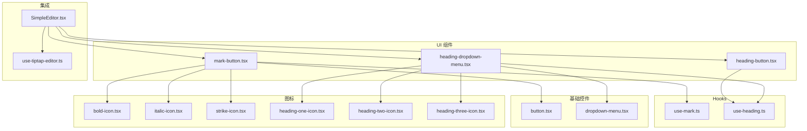
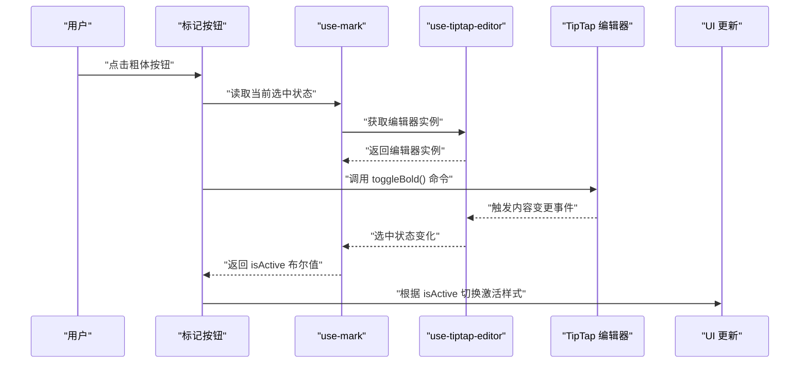
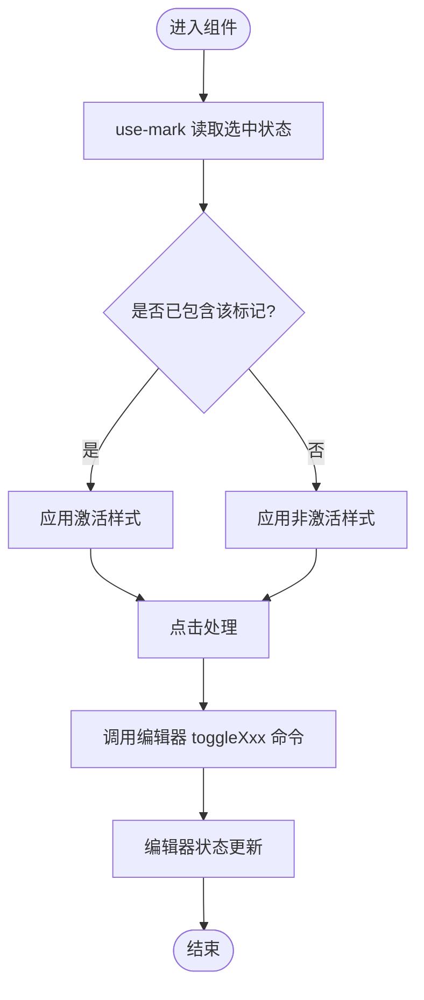
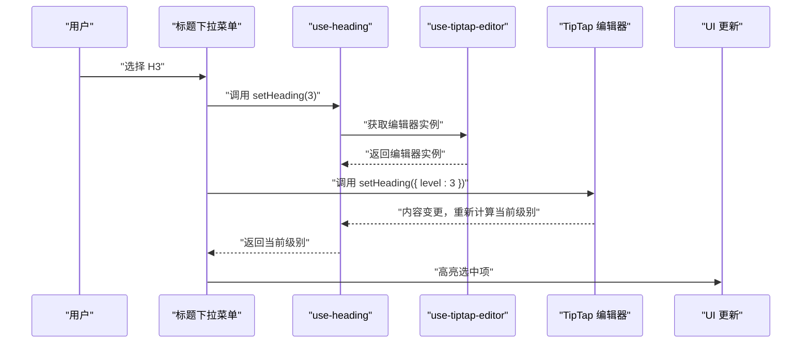
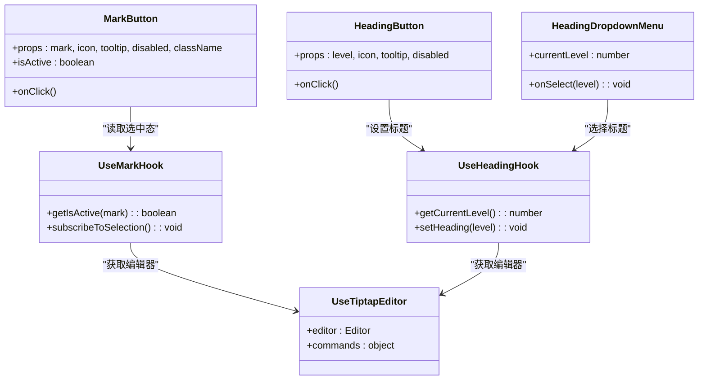
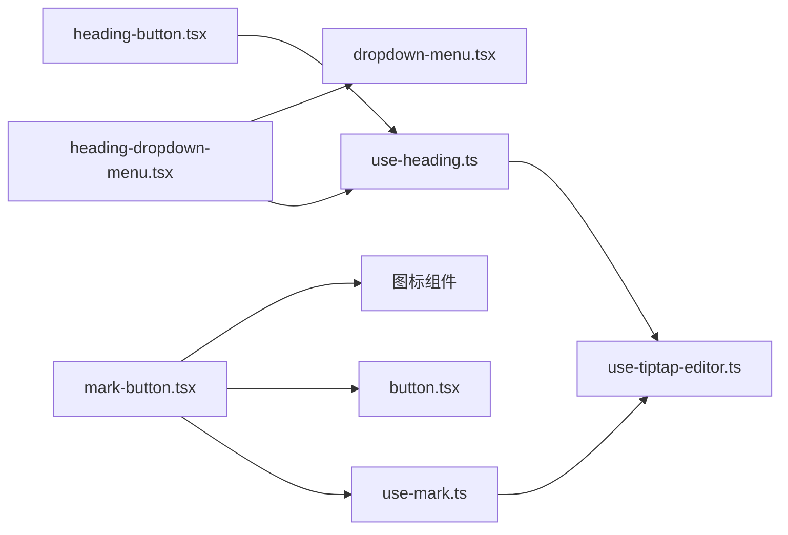

# 文本格式控制组件

<cite>
**本文引用的文件**
- [src/components/tiptap-ui/mark-button.tsx](file://src/components/tiptap-ui/mark-button.tsx)
- [src/components/tiptap-ui/use-mark.ts](file://src/components/tiptap-ui/use-mark.ts)
- [src/components/tiptap-ui/heading-button.tsx](file://src/components/tiptap-ui/heading-button.tsx)
- [src/components/tiptap-ui/heading-dropdown-menu.tsx](file://src/components/tiptap-ui/heading-dropdown-menu.tsx)
- [src/components/tiptap-ui/use-heading.ts](file://src/components/tiptap-ui/use-heading.ts)
- [src/components/tiptap-ui/index.tsx](file://src/components/tiptap-ui/index.tsx)
- [src/components/tiptap-ui-primitive/button.tsx](file://src/components/tiptap-ui-primitive/button.tsx)
- [src/components/tiptap-ui-primitive/dropdown-menu.tsx](file://src/components/tiptap-ui-primitive/dropdown-menu.tsx)
- [src/components/tiptap-icons/bold-icon.tsx](file://src/components/tiptap-icons/bold-icon.tsx)
- [src/components/tiptap-icons/italic-icon.tsx](file://src/components/tiptap-icons/italic-icon.tsx)
- [src/components/tiptap-icons/strike-icon.tsx](file://src/components/tiptap-icons/strike-icon.tsx)
- [src/components/tiptap-icons/heading-one-icon.tsx](file://src/components/tiptap-icons/heading-one-icon.tsx)
- [src/components/tiptap-icons/heading-two-icon.tsx](file://src/components/tiptap-icons/heading-two-icon.tsx)
- [src/components/tiptap-icons/heading-three-icon.tsx](file://src/components/tiptap-icons/heading-three-icon.tsx)
- [src/features/tiptap/SimpleEditor.tsx](file://src/features/tiptap/SimpleEditor.tsx)
- [src/hooks/use-tiptap-editor.ts](file://src/hooks/use-tiptap-editor.ts)
</cite>

## 目录
1. [简介](#简介)
2. [项目结构](#项目结构)
3. [核心组件](#核心组件)
4. [架构总览](#架构总览)
5. [详细组件分析](#详细组件分析)
6. [依赖关系分析](#依赖关系分析)
7. [性能考虑](#性能考虑)
8. [故障排查指南](#故障排查指南)
9. [结论](#结论)
10. [附录：API 参考与最佳实践](#附录api-参考与最佳实践)

## 简介
本文件面向“文本格式控制组件”的实现与使用，聚焦以下能力：
- 标记按钮（粗体、斜体、删除线等）的状态管理、事件处理与样式应用
- 标题选择器（H1-H6）的交互流程与状态同步
- 与 TipTap 编辑器的集成方式（编辑器实例获取、命令调用、选中态反馈）
- 在工具栏中组合这些组件的方法
- 扩展新的文本格式功能的步骤与最佳实践
- 完整的 API 参考（属性、回调、配置项）

## 项目结构
与文本格式控制相关的代码主要分布在如下位置：
- UI 层：mark-button、heading-button、heading-dropdown-menu 及其对应的 hooks
- 基础控件：button、dropdown-menu 等原子化 UI 组件
- 图标库：bold、italic、strike、heading* 等图标
- 集成示例：SimpleEditor 将上述组件组合到工具栏并接入 TipTap 编辑器
- 编辑器 Hook：use-tiptap-editor 提供编辑器实例与常用操作封装

图表来源
- [src/components/tiptap-ui/mark-button.tsx](file://src/components/tiptap-ui/mark-button.tsx)
- [src/components/tiptap-ui/heading-button.tsx](file://src/components/tiptap-ui/heading-button.tsx)
- [src/components/tiptap-ui/heading-dropdown-menu.tsx](file://src/components/tiptap-ui/heading-dropdown-menu.tsx)
- [src/components/tiptap-ui/use-mark.ts](file://src/components/tiptap-ui/use-mark.ts)
- [src/components/tiptap-ui/use-heading.ts](file://src/components/tiptap-ui/use-heading.ts)
- [src/components/tiptap-ui-primitive/button.tsx](file://src/components/tiptap-ui-primitive/button.tsx)
- [src/components/tiptap-ui-primitive/dropdown-menu.tsx](file://src/components/tiptap-ui-primitive/dropdown-menu.tsx)
- [src/components/tiptap-icons/bold-icon.tsx](file://src/components/tiptap-icons/bold-icon.tsx)
- [src/components/tiptap-icons/italic-icon.tsx](file://src/components/tiptap-icons/italic-icon.tsx)
- [src/components/tiptap-icons/strike-icon.tsx](file://src/components/tiptap-icons/strike-icon.tsx)
- [src/components/tiptap-icons/heading-one-icon.tsx](file://src/components/tiptap-icons/heading-one-icon.tsx)
- [src/components/tiptap-icons/heading-two-icon.tsx](file://src/components/tiptap-icons/heading-two-icon.tsx)
- [src/components/tiptap-icons/heading-three-icon.tsx](file://src/components/tiptap-icons/heading-three-icon.tsx)
- [src/features/tiptap/SimpleEditor.tsx](file://src/features/tiptap/SimpleEditor.tsx)
- [src/hooks/use-tiptap-editor.ts](file://src/hooks/use-tiptap-editor.ts)

章节来源
- [src/components/tiptap-ui/mark-button.tsx](file://src/components/tiptap-ui/mark-button.tsx)
- [src/components/tiptap-ui/heading-button.tsx](file://src/components/tiptap-ui/heading-button.tsx)
- [src/components/tiptap-ui/heading-dropdown-menu.tsx](file://src/components/tiptap-ui/heading-dropdown-menu.tsx)
- [src/components/tiptap-ui/use-mark.ts](file://src/components/tiptap-ui/use-mark.ts)
- [src/components/tiptap-ui/use-heading.ts](file://src/components/tiptap-ui/use-heading.ts)
- [src/components/tiptap-ui-primitive/button.tsx](file://src/components/tiptap-ui-primitive/button.tsx)
- [src/components/tiptap-ui-primitive/dropdown-menu.tsx](file://src/components/tiptap-ui-primitive/dropdown-menu.tsx)
- [src/components/tiptap-icons/bold-icon.tsx](file://src/components/tiptap-icons/bold-icon.tsx)
- [src/components/tiptap-icons/italic-icon.tsx](file://src/components/tiptap-icons/italic-icon.tsx)
- [src/components/tiptap-icons/strike-icon.tsx](file://src/components/tiptap-icons/strike-icon.tsx)
- [src/components/tiptap-icons/heading-one-icon.tsx](file://src/components/tiptap-icons/heading-one-icon.tsx)
- [src/components/tiptap-icons/heading-two-icon.tsx](file://src/components/tiptap-icons/heading-two-icon.tsx)
- [src/components/tiptap-icons/heading-three-icon.tsx](file://src/components/tiptap-icons/heading-three-icon.tsx)
- [src/features/tiptap/SimpleEditor.tsx](file://src/features/tiptap/SimpleEditor.tsx)
- [src/hooks/use-tiptap-editor.ts](file://src/hooks/use-tiptap-editor.ts)

## 核心组件
本节概述关键组件的职责与协作方式。

- 标记按钮（Mark Button）
  - 负责切换选中文本的标记（如粗体、斜体、删除线）
  - 通过 use-mark hook 订阅编辑器选中状态，计算当前是否激活
  - 点击时调用 TipTap 对应命令进行切换
  - 使用 button 原子组件渲染，并可传入图标与提示

- 标题按钮与下拉菜单（Heading Button & Dropdown Menu）
  - heading-button 用于快速设置当前段落为某级标题
  - heading-dropdown-menu 提供 H1-H6 的选择列表
  - use-heading hook 维护当前光标所在段落的标题级别，并在选择后执行命令
  - 下拉菜单由 dropdown-menu 原子组件驱动

- 基础控件与图标
  - button、dropdown-menu 提供可复用的交互外壳
  - 各图标组件作为视觉标识注入到按钮或菜单项中

章节来源
- [src/components/tiptap-ui/mark-button.tsx](file://src/components/tiptap-ui/mark-button.tsx)
- [src/components/tiptap-ui/use-mark.ts](file://src/components/tiptap-ui/use-mark.ts)
- [src/components/tiptap-ui/heading-button.tsx](file://src/components/tiptap-ui/heading-button.tsx)
- [src/components/tiptap-ui/heading-dropdown-menu.tsx](file://src/components/tiptap-ui/heading-dropdown-menu.tsx)
- [src/components/tiptap-ui/use-heading.ts](file://src/components/tiptap-ui/use-heading.ts)
- [src/components/tiptap-ui-primitive/button.tsx](file://src/components/tiptap-ui-primitive/button.tsx)
- [src/components/tiptap-ui-primitive/dropdown-menu.tsx](file://src/components/tiptap-ui-primitive/dropdown-menu.tsx)
- [src/components/tiptap-icons/bold-icon.tsx](file://src/components/tiptap-icons/bold-icon.tsx)
- [src/components/tiptap-icons/italic-icon.tsx](file://src/components/tiptap-icons/italic-icon.tsx)
- [src/components/tiptap-icons/strike-icon.tsx](file://src/components/tiptap-icons/strike-icon.tsx)
- [src/components/tiptap-icons/heading-one-icon.tsx](file://src/components/tiptap-icons/heading-one-icon.tsx)
- [src/components/tiptap-icons/heading-two-icon.tsx](file://src/components/tiptap-icons/heading-two-icon.tsx)
- [src/components/tiptap-icons/heading-three-icon.tsx](file://src/components/tiptap-icons/heading-three-icon.tsx)

## 架构总览
下图展示了从用户交互到 TipTap 编辑器命令执行的完整链路，以及状态如何回传到 UI。

图表来源
- [src/components/tiptap-ui/mark-button.tsx](file://src/components/tiptap-ui/mark-button.tsx)
- [src/components/tiptap-ui/use-mark.ts](file://src/components/tiptap-ui/use-mark.ts)
- [src/hooks/use-tiptap-editor.ts](file://src/hooks/use-tiptap-editor.ts)

章节来源
- [src/features/tiptap/SimpleEditor.tsx](file://src/features/tiptap/SimpleEditor.tsx)
- [src/hooks/use-tiptap-editor.ts](file://src/hooks/use-tiptap-editor.ts)

## 详细组件分析

### 标记按钮（Mark Button）
- 职责
  - 接收标记类型（如 bold、italic、strike）
  - 通过 use-mark 判断当前选中是否包含该标记
  - 点击时调用编辑器相应命令进行切换
  - 支持自定义图标、提示文案、禁用态与样式类名
- 状态管理
  - use-mark 内部监听编辑器选中范围与标记存在性，返回 isActive
  - 当编辑器内容变化或光标移动时，自动刷新选中态
- 事件处理
  - onClick 触发命令；可选 onToggle 回调用于外部副作用
- 样式应用
  - 根据 isActive 动态添加激活样式类
  - 可结合 tooltip 显示快捷键或说明

图表来源
- [src/components/tiptap-ui/mark-button.tsx](file://src/components/tiptap-ui/mark-button.tsx)
- [src/components/tiptap-ui/use-mark.ts](file://src/components/tiptap-ui/use-mark.ts)

章节来源
- [src/components/tiptap-ui/mark-button.tsx](file://src/components/tiptap-ui/mark-button.tsx)
- [src/components/tiptap-ui/use-mark.ts](file://src/components/tiptap-ui/use-mark.ts)

### 标题按钮与下拉菜单（Heading Button & Dropdown Menu）
- 职责
  - heading-button：快速设置当前段落为指定级别标题
  - heading-dropdown-menu：展示 H1-H6 选项，供用户选择
  - use-heading：维护当前光标所在段落的标题级别，并提供 setHeading 方法
- 状态管理
  - 基于编辑器节点层级与属性判断当前是否为标题及级别
  - 选择新级别后，立即更新编辑器内容与 UI 激活态
- 事件处理
  - 点击菜单项触发 setHeading(level)
  - 支持键盘导航与无障碍标签
- 样式应用
  - 根据当前级别高亮对应菜单项
  - 按钮可根据当前级别显示不同图标或文字

图表来源
- [src/components/tiptap-ui/heading-dropdown-menu.tsx](file://src/components/tiptap-ui/heading-dropdown-menu.tsx)
- [src/components/tiptap-ui/use-heading.ts](file://src/components/tiptap-ui/use-heading.ts)
- [src/hooks/use-tiptap-editor.ts](file://src/hooks/use-tiptap-editor.ts)

章节来源
- [src/components/tiptap-ui/heading-button.tsx](file://src/components/tiptap-ui/heading-button.tsx)
- [src/components/tiptap-ui/heading-dropdown-menu.tsx](file://src/components/tiptap-ui/heading-dropdown-menu.tsx)
- [src/components/tiptap-ui/use-heading.ts](file://src/components/tiptap-ui/use-heading.ts)

### 与 TipTap 编辑器的集成
- 编辑器实例
  - 通过 use-tiptap-editor 获取编辑器实例与常用方法
  - SimpleEditor 负责初始化编辑器并挂载工具栏
- 命令调用
  - 标记按钮调用 toggleBold/toggleItalic/toggleStrike 等
  - 标题组件调用 setHeading
- 状态同步
  - 编辑器内容变化会触发选中状态与节点属性变化
  - hooks 内部订阅相关事件，确保 UI 与编辑器一致

图表来源
- [src/components/tiptap-ui/mark-button.tsx](file://src/components/tiptap-ui/mark-button.tsx)
- [src/components/tiptap-ui/use-mark.ts](file://src/components/tiptap-ui/use-mark.ts)
- [src/components/tiptap-ui/heading-button.tsx](file://src/components/tiptap-ui/heading-button.tsx)
- [src/components/tiptap-ui/heading-dropdown-menu.tsx](file://src/components/tiptap-ui/heading-dropdown-menu.tsx)
- [src/components/tiptap-ui/use-heading.ts](file://src/components/tiptap-ui/use-heading.ts)
- [src/hooks/use-tiptap-editor.ts](file://src/hooks/use-tiptap-editor.ts)

章节来源
- [src/features/tiptap/SimpleEditor.tsx](file://src/features/tiptap/SimpleEditor.tsx)
- [src/hooks/use-tiptap-editor.ts](file://src/hooks/use-tiptap-editor.ts)

## 依赖关系分析
- 组件耦合
  - mark-button 与 use-mark 强耦合，后者依赖编辑器实例
  - heading-button 与 heading-dropdown-menu 共享 use-heading 状态
- 外部依赖
  - TipTap 编辑器实例与方法
  - 基础控件 button、dropdown-menu 提供通用交互外壳
  - 图标组件提供可视化标识
- 可能的循环依赖
  - 当前结构以 hooks 解耦 UI 与编辑器逻辑，未见明显循环引用

图表来源
- [src/components/tiptap-ui/mark-button.tsx](file://src/components/tiptap-ui/mark-button.tsx)
- [src/components/tiptap-ui/use-mark.ts](file://src/components/tiptap-ui/use-mark.ts)
- [src/components/tiptap-ui/heading-button.tsx](file://src/components/tiptap-ui/heading-button.tsx)
- [src/components/tiptap-ui/heading-dropdown-menu.tsx](file://src/components/tiptap-ui/heading-dropdown-menu.tsx)
- [src/components/tiptap-ui/use-heading.ts](file://src/components/tiptap-ui/use-heading.ts)
- [src/components/tiptap-ui-primitive/button.tsx](file://src/components/tiptap-ui-primitive/button.tsx)
- [src/components/tiptap-ui-primitive/dropdown-menu.tsx](file://src/components/tiptap-ui-primitive/dropdown-menu.tsx)
- [src/hooks/use-tiptap-editor.ts](file://src/hooks/use-tiptap-editor.ts)

章节来源
- [src/components/tiptap-ui/index.tsx](file://src/components/tiptap-ui/index.tsx)

## 性能考虑
- 避免不必要的重渲染
  - 仅在选中状态或标题级别变化时更新 UI
  - 对图标与静态资源进行缓存
- 减少编辑器事件频率
  - 使用节流或防抖策略处理高频输入事件（如需在外部统计或日志记录）
- 合理拆分组件
  - 将大菜单项拆分为独立子组件，按需渲染
- 懒加载与虚拟滚动
  - 若菜单项较多，考虑虚拟化列表提升滚动性能

[本节为通用指导，不直接分析具体文件]

## 故障排查指南
- 常见问题
  - 按钮未反映激活状态：检查 use-mark 是否正确订阅编辑器选中变化
  - 标题级别不更新：确认 use-heading 的 getCurrentLevel 与 setHeading 调用路径
  - 图标不显示：确认图标组件导入与 props 传递
- 调试建议
  - 在 use-mark 与 use-heading 中打印当前状态
  - 在 SimpleEditor 中输出编辑器实例与命令可用性
  - 使用浏览器开发者工具观察 DOM 类名变化

章节来源
- [src/components/tiptap-ui/use-mark.ts](file://src/components/tiptap-ui/use-mark.ts)
- [src/components/tiptap-ui/use-heading.ts](file://src/components/tiptap-ui/use-heading.ts)
- [src/features/tiptap/SimpleEditor.tsx](file://src/features/tiptap/SimpleEditor.tsx)

## 结论
文本格式控制组件通过清晰的职责划分与 hooks 抽象，实现了与 TipTap 编辑器的松耦合集成。标记按钮与标题组件提供了直观且可扩展的格式化能力，配合基础控件与图标库，能够快速构建丰富的富文本工具栏。遵循本文档的 API 参考与最佳实践，可以高效地扩展新的文本格式功能并保持稳定的用户体验。

[本节为总结性内容，不直接分析具体文件]

## 附录：API 参考与最佳实践

### 标记按钮（Mark Button）
- 属性
  - mark: string — 标记类型（如 bold、italic、strike）
  - icon: ReactNode — 按钮图标
  - tooltip: string — 悬停提示
  - disabled: boolean — 禁用态
  - className: string — 自定义样式类
  - activeClassName: string — 激活态样式类
  - onClick?: (event) => void — 点击回调
  - onToggle?: (isActive: boolean) => void — 切换回调
- 行为
  - 点击时调用编辑器对应 toggle 命令
  - 根据 isActive 切换激活样式
- 使用示例路径
  - [src/components/tiptap-ui/mark-button.tsx](file://src/components/tiptap-ui/mark-button.tsx)

章节来源
- [src/components/tiptap-ui/mark-button.tsx](file://src/components/tiptap-ui/mark-button.tsx)

### 标题按钮（Heading Button）
- 属性
  - level: number — 标题级别（1-6）
  - icon: ReactNode — 按钮图标
  - tooltip: string — 悬停提示
  - disabled: boolean — 禁用态
  - className: string — 自定义样式类
  - activeClassName: string — 激活态样式类
  - onClick?: (event) => void — 点击回调
- 行为
  - 点击时调用 setHeading(level)
- 使用示例路径
  - [src/components/tiptap-ui/heading-button.tsx](file://src/components/tiptap-ui/heading-button.tsx)

章节来源
- [src/components/tiptap-ui/heading-button.tsx](file://src/components/tiptap-ui/heading-button.tsx)

### 标题下拉菜单（Heading Dropdown Menu）
- 属性
  - currentLevel: number — 当前标题级别
  - onSelect: (level: number) => void — 选择回调
  - items?: Array<{ label: string; level: number }> — 自定义菜单项
  - className: string — 容器样式类
- 行为
  - 渲染 H1-H6 选项，高亮当前级别
  - 选择后调用 onSelect(level)
- 使用示例路径
  - [src/components/tiptap-ui/heading-dropdown-menu.tsx](file://src/components/tiptap-ui/heading-dropdown-menu.tsx)

章节来源
- [src/components/tiptap-ui/heading-dropdown-menu.tsx](file://src/components/tiptap-ui/heading-dropdown-menu.tsx)

### Hooks
- use-mark
  - 作用：判断当前选中是否包含指定标记
  - 返回值：isActive: boolean
  - 订阅：编辑器选中范围与标记状态变化
  - 使用示例路径
    - [src/components/tiptap-ui/use-mark.ts](file://src/components/tiptap-ui/use-mark.ts)
- use-heading
  - 作用：获取当前段落标题级别并设置新级别
  - 方法：getCurrentLevel(): number; setHeading(level: number): void
  - 订阅：编辑器节点属性变化
  - 使用示例路径
    - [src/components/tiptap-ui/use-heading.ts](file://src/components/tiptap-ui/use-heading.ts)

章节来源
- [src/components/tiptap-ui/use-mark.ts](file://src/components/tiptap-ui/use-mark.ts)
- [src/components/tiptap-ui/use-heading.ts](file://src/components/tiptap-ui/use-heading.ts)

### 基础控件与图标
- 基础控件
  - button.tsx：通用按钮，支持 disabled、tooltip、className 等
  - dropdown-menu.tsx：下拉菜单容器，支持键盘导航与焦点管理
- 图标
  - bold-icon.tsx、italic-icon.tsx、strike-icon.tsx
  - heading-one-icon.tsx、heading-two-icon.tsx、heading-three-icon.tsx
- 使用示例路径
  - [src/components/tiptap-ui-primitive/button.tsx](file://src/components/tiptap-ui-primitive/button.tsx)
  - [src/components/tiptap-ui-primitive/dropdown-menu.tsx](file://src/components/tiptap-ui-primitive/dropdown-menu.tsx)
  - [src/components/tiptap-icons/bold-icon.tsx](file://src/components/tiptap-icons/bold-icon.tsx)
  - [src/components/tiptap-icons/italic-icon.tsx](file://src/components/tiptap-icons/italic-icon.tsx)
  - [src/components/tiptap-icons/strike-icon.tsx](file://src/components/tiptap-icons/strike-icon.tsx)
  - [src/components/tiptap-icons/heading-one-icon.tsx](file://src/components/tiptap-icons/heading-one-icon.tsx)
  - [src/components/tiptap-icons/heading-two-icon.tsx](file://src/components/tiptap-icons/heading-two-icon.tsx)
  - [src/components/tiptap-icons/heading-three-icon.tsx](file://src/components/tiptap-icons/heading-three-icon.tsx)

章节来源
- [src/components/tiptap-ui-primitive/button.tsx](file://src/components/tiptap-ui-primitive/button.tsx)
- [src/components/tiptap-ui-primitive/dropdown-menu.tsx](file://src/components/tiptap-ui-primitive/dropdown-menu.tsx)
- [src/components/tiptap-icons/bold-icon.tsx](file://src/components/tiptap-icons/bold-icon.tsx)
- [src/components/tiptap-icons/italic-icon.tsx](file://src/components/tiptap-icons/italic-icon.tsx)
- [src/components/tiptap-icons/strike-icon.tsx](file://src/components/tiptap-icons/strike-icon.tsx)
- [src/components/tiptap-icons/heading-one-icon.tsx](file://src/components/tiptap-icons/heading-one-icon.tsx)
- [src/components/tiptap-icons/heading-two-icon.tsx](file://src/components/tiptap-icons/heading-two-icon.tsx)
- [src/components/tiptap-icons/heading-three-icon.tsx](file://src/components/tiptap-icons/heading-three-icon.tsx)

### 在工具栏中组合使用
- 组合方式
  - 在 SimpleEditor 中引入 mark-button、heading-button、heading-dropdown-menu
  - 将图标组件作为按钮图标传入
  - 通过 use-tiptap-editor 获取编辑器实例并传递给 hooks
- 示例路径
  - [src/features/tiptap/SimpleEditor.tsx](file://src/features/tiptap/SimpleEditor.tsx)
  - [src/hooks/use-tiptap-editor.ts](file://src/hooks/use-tiptap-editor.ts)

章节来源
- [src/features/tiptap/SimpleEditor.tsx](file://src/features/tiptap/SimpleEditor.tsx)
- [src/hooks/use-tiptap-editor.ts](file://src/hooks/use-tiptap-editor.ts)

### 扩展新的文本格式功能
- 步骤
  - 新增一个标记按钮或标题按钮，复用 use-mark 或 use-heading
  - 在 SimpleEditor 的工具栏中注册新按钮
  - 如需自定义样式，提供 activeClassName 与 CSS
  - 编写单元测试验证选中态与命令调用
- 参考实现
  - [src/components/tiptap-ui/mark-button.tsx](file://src/components/tiptap-ui/mark-button.tsx)
  - [src/components/tiptap-ui/heading-button.tsx](file://src/components/tiptap-ui/heading-button.tsx)
  - [src/components/tiptap-ui/heading-dropdown-menu.tsx](file://src/components/tiptap-ui/heading-dropdown-menu.tsx)
  - [src/features/tiptap/SimpleEditor.tsx](file://src/features/tiptap/SimpleEditor.tsx)

章节来源
- [src/components/tiptap-ui/mark-button.tsx](file://src/components/tiptap-ui/mark-button.tsx)
- [src/components/tiptap-ui/heading-button.tsx](file://src/components/tiptap-ui/heading-button.tsx)
- [src/components/tiptap-ui/heading-dropdown-menu.tsx](file://src/components/tiptap-ui/heading-dropdown-menu.tsx)
- [src/features/tiptap/SimpleEditor.tsx](file://src/features/tiptap/SimpleEditor.tsx)