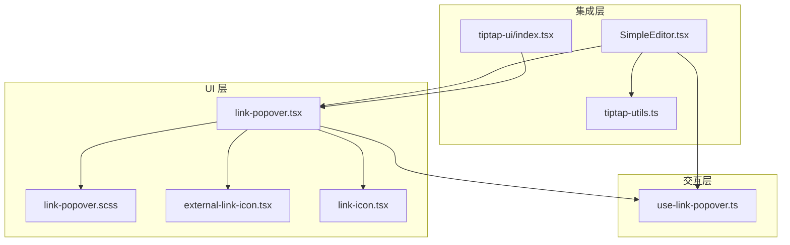
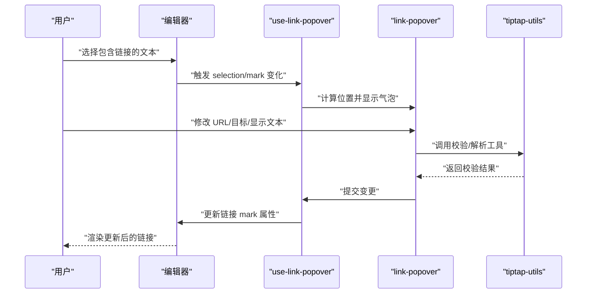
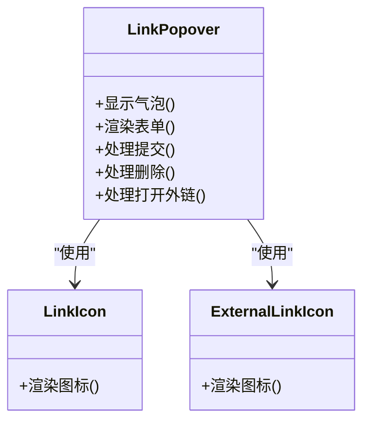
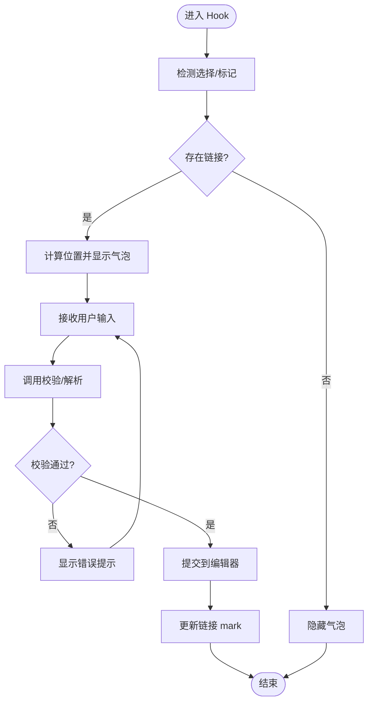
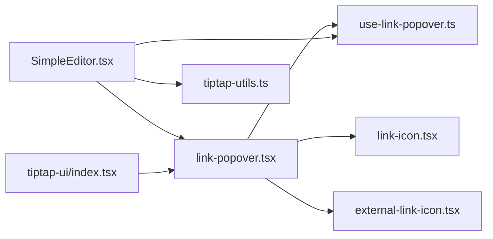

# 链接编辑控制组件

<cite>
**本文引用的文件**   
- [link-popover.tsx](file://src/components/tiptap-ui/link-popover.tsx)
- [use-link-popover.ts](file://src/components/tiptap-ui/use-link-popover.ts)
- [link-popover.scss](file://src/components/tiptap-ui/link-popover.scss)
- [external-link-icon.tsx](file://src/components/tiptap-icons/external-link-icon.tsx)
- [link-icon.tsx](file://src/components/tiptap-icons/link-icon.tsx)
- [index.tsx](file://src/components/tiptap-ui/index.tsx)
- [SimpleEditor.tsx](file://src/features/tiptap/SimpleEditor.tsx)
- [tiptap-utils.ts](file://src/lib/tiptap-utils.ts)
</cite>

## 目录
1. [简介](#简介)
2. [项目结构](#项目结构)
3. [核心组件](#核心组件)
4. [架构总览](#架构总览)
5. [详细组件分析](#详细组件分析)
6. [依赖关系分析](#依赖关系分析)
7. [性能考虑](#性能考虑)
8. [故障排查指南](#故障排查指南)
9. [结论](#结论)
10. [附录：API 与配置](#附录api-与配置)

## 简介
本文件为“链接编辑控制组件”的专业文档，聚焦于在富文本编辑器中插入、编辑与管理链接的完整能力。内容覆盖：
- 链接插入与编辑流程（URL、目标、显示文本）
- 链接气泡菜单的交互逻辑（自动检测、位置计算、用户输入处理）
- 完整的组件 API 与扩展点（规则配置、自定义验证器、样式定制）
- 智能链接识别、批量链接管理与链接统计的实现思路
- 链接安全检查与防钓鱼措施建议

## 项目结构
与链接编辑相关的代码主要位于以下模块：
- UI 层：气泡弹窗、图标、基础控件
- 交互层：气泡菜单状态与行为 Hook
- 集成层：编辑器入口与工具函数

图表来源
- [link-popover.tsx:1-200](file://src/components/tiptap-ui/link-popover.tsx#L1-L200)
- [use-link-popover.ts:1-200](file://src/components/tiptap-ui/use-link-popover.ts#L1-L200)
- [link-popover.scss:1-200](file://src/components/tiptap-ui/link-popover.scss#L1-L200)
- [external-link-icon.tsx:1-200](file://src/components/tiptap-icons/external-link-icon.tsx#L1-L200)
- [link-icon.tsx:1-200](file://src/components/tiptap-icons/link-icon.tsx#L1-L200)
- [SimpleEditor.tsx:1-200](file://src/features/tiptap/SimpleEditor.tsx#L1-L200)
- [tiptap-utils.ts:1-200](file://src/lib/tiptap-utils.ts#L1-L200)
- [index.tsx:1-200](file://src/components/tiptap-ui/index.tsx#L1-L200)

章节来源
- [link-popover.tsx:1-200](file://src/components/tiptap-ui/link-popover.tsx#L1-L200)
- [use-link-popover.ts:1-200](file://src/components/tiptap-ui/use-link-popover.ts#L1-L200)
- [link-popover.scss:1-200](file://src/components/tiptap-ui/link-popover.scss#L1-L200)
- [external-link-icon.tsx:1-200](file://src/components/tiptap-icons/external-link-icon.tsx#L1-L200)
- [link-icon.tsx:1-200](file://src/components/tiptap-icons/link-icon.tsx#L1-L200)
- [SimpleEditor.tsx:1-200](file://src/features/tiptap/SimpleEditor.tsx#L1-L200)
- [tiptap-utils.ts:1-200](file://src/lib/tiptap-utils.ts#L1-L200)
- [index.tsx:1-200](file://src/components/tiptap-ui/index.tsx#L1-L200)

## 核心组件
- 链接气泡弹窗（Link Popover）
  - 负责展示与编辑当前选中文本的链接属性（URL、目标、显示文本），并提供删除、打开等快捷操作。
  - 通过 CSS 控制定位与外观，支持主题化与响应式布局。
- 链接气泡 Hook（use-link-popover）
  - 封装气泡的显示/隐藏、位置计算、键盘导航、表单校验与提交等交互逻辑。
  - 与编辑器 Selection 和 Mark 状态联动，确保 UI 与数据一致。
- 图标资源
  - 外链图标与链接图标用于按钮与状态提示，提升可访问性与一致性。
- 集成入口
  - 编辑器主入口将气泡组件与 Hook 组合使用，并暴露必要的配置项。
- 工具函数
  - 提供 URL 解析、校验、安全策略等通用能力，供气泡与编辑器复用。

章节来源
- [link-popover.tsx:1-200](file://src/components/tiptap-ui/link-popover.tsx#L1-L200)
- [use-link-popover.ts:1-200](file://src/components/tiptap-ui/use-link-popover.ts#L1-L200)
- [link-popover.scss:1-200](file://src/components/tiptap-ui/link-popover.scss#L1-L200)
- [external-link-icon.tsx:1-200](file://src/components/tiptap-icons/external-link-icon.tsx#L1-L200)
- [link-icon.tsx:1-200](file://src/components/tiptap-icons/link-icon.tsx#L1-L200)
- [SimpleEditor.tsx:1-200](file://src/features/tiptap/SimpleEditor.tsx#L1-L200)
- [tiptap-utils.ts:1-200](file://src/lib/tiptap-utils.ts#L1-L200)

## 架构总览
链接编辑控制由“UI 层 + 交互 Hook + 编辑器集成 + 工具库”构成，形成低耦合、高内聚的模块化设计。

图表来源
- [use-link-popover.ts:1-200](file://src/components/tiptap-ui/use-link-popover.ts#L1-L200)
- [link-popover.tsx:1-200](file://src/components/tiptap-ui/link-popover.tsx#L1-L200)
- [tiptap-utils.ts:1-200](file://src/lib/tiptap-utils.ts#L1-L200)
- [SimpleEditor.tsx:1-200](file://src/features/tiptap/SimpleEditor.tsx#L1-L200)

## 详细组件分析

### 链接气泡弹窗（Link Popover）
- 职责
  - 展示当前选中链接的 URL、目标、显示文本字段
  - 提供保存、取消、删除、在新窗口打开等操作
  - 根据输入实时反馈校验错误
- 关键实现要点
  - 表单受控字段绑定到 Hook 提供的状态
  - 通过 CSS 类名控制可见性、定位与动画
  - 图标按钮统一使用外部链接与链接图标组件
- 可扩展点
  - 通过样式变量或类名覆盖主题
  - 通过插槽或回调注入额外操作按钮

图表来源
- [link-popover.tsx:1-200](file://src/components/tiptap-ui/link-popover.tsx#L1-L200)
- [link-icon.tsx:1-200](file://src/components/tiptap-icons/link-icon.tsx#L1-L200)
- [external-link-icon.tsx:1-200](file://src/components/tiptap-icons/external-link-icon.tsx#L1-L200)

章节来源
- [link-popover.tsx:1-200](file://src/components/tiptap-ui/link-popover.tsx#L1-L200)
- [link-popover.scss:1-200](file://src/components/tiptap-ui/link-popover.scss#L1-L200)
- [link-icon.tsx:1-200](file://src/components/tiptap-icons/link-icon.tsx#L1-L200)
- [external-link-icon.tsx:1-200](file://src/components/tiptap-icons/external-link-icon.tsx#L1-L200)

### 链接气泡 Hook（use-link-popover）
- 职责
  - 监听编辑器选择与标记变化，决定是否显示气泡
  - 计算气泡相对视口的位置，避免溢出
  - 管理表单状态、校验与提交，驱动编辑器更新
  - 处理键盘导航与焦点管理
- 关键实现要点
  - 基于 Selection 与 Mark 属性读取当前链接信息
  - 使用节流/防抖优化频繁更新时的性能
  - 提供 onOpen/onClose 等回调以支持上层统计与埋点
- 与编辑器集成
  - 通过编辑器命令更新链接 mark 属性
  - 与工具函数协作完成 URL 规范化与安全校验

图表来源
- [use-link-popover.ts:1-200](file://src/components/tiptap-ui/use-link-popover.ts#L1-L200)
- [tiptap-utils.ts:1-200](file://src/lib/tiptap-utils.ts#L1-L200)

章节来源
- [use-link-popover.ts:1-200](file://src/components/tiptap-ui/use-link-popover.ts#L1-L200)
- [tiptap-utils.ts:1-200](file://src/lib/tiptap-utils.ts#L1-L200)

### 编辑器集成（SimpleEditor）
- 职责
  - 将链接气泡与 Hook 组合进编辑器工具栏或上下文菜单
  - 暴露配置项（如是否启用自动链接识别、默认目标等）
  - 提供事件钩子用于统计与审计
- 关键点
  - 在合适时机订阅选择变化与命令执行
  - 将气泡组件挂载到合适的容器，保证层级与遮挡正确

章节来源
- [SimpleEditor.tsx:1-200](file://src/features/tiptap/SimpleEditor.tsx#L1-L200)
- [index.tsx:1-200](file://src/components/tiptap-ui/index.tsx#L1-L200)

### 工具函数（tiptap-utils）
- 职责
  - URL 解析与规范化（补全协议、去除多余空格等）
  - 链接格式校验（正则/白名单/黑名单）
  - 安全策略（协议白名单、host 校验、跳转拦截提示）
- 关键点
  - 提供纯函数接口，便于单元测试与复用
  - 支持可插拔的自定义验证器与处理器

章节来源
- [tiptap-utils.ts:1-200](file://src/lib/tiptap-utils.ts#L1-L200)

## 依赖关系分析
- 组件间依赖
  - link-popover 依赖 use-link-popover 的状态与行为
  - link-popover 依赖图标组件进行可视化表达
  - SimpleEditor 组合 link-popover 与 use-link-popover，并接入 tiptap-utils
- 外部依赖
  - 富文本编辑器（Tiptap）的选择与标记系统
  - 浏览器 DOM API 用于位置计算与事件监听

图表来源
- [link-popover.tsx:1-200](file://src/components/tiptap-ui/link-popover.tsx#L1-L200)
- [use-link-popover.ts:1-200](file://src/components/tiptap-ui/use-link-popover.ts#L1-L200)
- [link-icon.tsx:1-200](file://src/components/tiptap-icons/link-icon.tsx#L1-L200)
- [external-link-icon.tsx:1-200](file://src/components/tiptap-icons/external-link-icon.tsx#L1-L200)
- [SimpleEditor.tsx:1-200](file://src/features/tiptap/SimpleEditor.tsx#L1-L200)
- [tiptap-utils.ts:1-200](file://src/lib/tiptap-utils.ts#L1-L200)
- [index.tsx:1-200](file://src/components/tiptap-ui/index.tsx#L1-L200)

章节来源
- [link-popover.tsx:1-200](file://src/components/tiptap-ui/link-popover.tsx#L1-L200)
- [use-link-popover.ts:1-200](file://src/components/tiptap-ui/use-link-popover.ts#L1-L200)
- [SimpleEditor.tsx:1-200](file://src/features/tiptap/SimpleEditor.tsx#L1-L200)
- [tiptap-utils.ts:1-200](file://src/lib/tiptap-utils.ts#L1-L200)
- [index.tsx:1-200](file://src/components/tiptap-ui/index.tsx#L1-L200)

## 性能考虑
- 气泡位置计算
  - 使用节流/防抖减少重排与回流
  - 仅在必要的事件（滚动、窗口大小变化、选择变化）时重新计算
- 表单输入处理
  - 对高频输入进行去抖，延迟校验与网络请求
- 渲染优化
  - 仅当状态变化时更新气泡，避免不必要的重绘
  - 使用稳定的 key 与最小化 diff 范围

[本节为通用指导，不直接分析具体文件]

## 故障排查指南
- 气泡不显示
  - 检查选择是否为链接标记；确认 Hook 是否正确订阅选择变化
  - 查看控制台是否有 URL 校验失败或解析异常
- 链接未生效
  - 确认提交后编辑器是否更新了链接 mark 属性
  - 检查工具函数的规范化逻辑是否移除了必要字段
- 样式错乱
  - 检查气泡容器的 z-index 与父级 overflow 设置
  - 确认 SCSS 未被覆盖或冲突

章节来源
- [link-popover.tsx:1-200](file://src/components/tiptap-ui/link-popover.tsx#L1-L200)
- [use-link-popover.ts:1-200](file://src/components/tiptap-ui/use-link-popover.ts#L1-L200)
- [link-popover.scss:1-200](file://src/components/tiptap-ui/link-popover.scss#L1-L200)

## 结论
链接编辑控制组件通过清晰的层次划分与可插拔的工具函数，实现了稳定、可扩展的链接插入、编辑与管理体验。结合气泡菜单的智能交互与严格的安全校验，可在保障用户体验的同时有效降低安全风险。

[本节为总结性内容，不直接分析具体文件]

## 附录：API 与配置

### 组件 API（Link Popover）
- 属性
  - visible: boolean — 控制气泡显示/隐藏
  - value: object — 包含 url、target、text 等字段
  - onChange(value): void — 值变更回调
  - onSubmit(value): void — 提交回调（内部会更新编辑器）
  - onDelete(): void — 删除链接回调
  - onOpen(url): void — 打开外链回调
  - className?: string — 自定义类名
  - style?: CSSProperties — 内联样式
- 事件
  - onFocus / onBlur — 焦点事件
  - onKeyDown — 键盘事件（支持回车提交、Esc 关闭）

章节来源
- [link-popover.tsx:1-200](file://src/components/tiptap-ui/link-popover.tsx#L1-L200)

### Hook API（use-link-popover）
- 返回值
  - visible: boolean
  - position: { top, left }
  - value: object
  - handleChange(field, value): void
  - handleSubmit(): void
  - handleDelete(): void
  - handleOpen(): void
  - show(): void
  - hide(): void
- 参数
  - editorRef: RefObject — 编辑器实例引用
  - options?: object — 可选配置（见下）

章节来源
- [use-link-popover.ts:1-200](file://src/components/tiptap-ui/use-link-popover.ts#L1-L200)

### 编辑器集成配置（SimpleEditor）
- 选项
  - enableAutoLinkDetection: boolean — 是否启用自动链接识别
  - defaultTarget: "_blank" | "_self" — 默认目标
  - allowedProtocols: string[] — 允许的协议白名单
  - allowedHosts: string[] | RegExp[] — 允许的主机白名单
  - onLinkStats(stats): void — 链接统计回调
  - customValidators: Validator[] — 自定义验证器列表

章节来源
- [SimpleEditor.tsx:1-200](file://src/features/tiptap/SimpleEditor.tsx#L1-L200)
- [tiptap-utils.ts:1-200](file://src/lib/tiptap-utils.ts#L1-L200)

### 链接规则与验证器
- 内置规则
  - 协议白名单（http、https、mailto、tel 等）
  - 主机白名单/黑名单
  - URL 格式校验（RFC 兼容）
- 自定义验证器
  - 类型：(url: string) => { valid: boolean; message?: string }
  - 注册方式：传入 customValidators 数组
  - 执行顺序：按注册顺序依次执行，任一失败即拒绝

章节来源
- [tiptap-utils.ts:1-200](file://src/lib/tiptap-utils.ts#L1-L200)

### 样式定制
- 类名覆盖
  - .link-popover — 气泡容器
  - .link-popover__field — 表单字段
  - .link-popover__actions — 操作区
- CSS 变量（示例）
  --lp-bg: #fff
  --lp-border: #e0e0e0
  --lp-shadow: 0 2px 8px rgba(0,0,0,.15)
- 主题适配
  - 通过外层主题类名切换深色模式
  - 使用 CSS 变量统一颜色与阴影

章节来源
- [link-popover.scss:1-200](file://src/components/tiptap-ui/link-popover.scss#L1-L200)

### 智能链接识别
- 触发条件
  - 粘贴文本中包含 URL
  - 输入完成后检测到 URL 片段
- 处理方式
  - 解析并标准化 URL
  - 运行校验与安全检查
  - 自动应用链接 mark 或提示用户确认

章节来源
- [tiptap-utils.ts:1-200](file://src/lib/tiptap-utils.ts#L1-L200)
- [SimpleEditor.tsx:1-200](file://src/features/tiptap/SimpleEditor.tsx#L1-L200)

### 批量链接管理
- 功能建议
  - 批量替换域名或协议
  - 批量添加/移除 target="_blank"
  - 批量导出链接清单
- 实现思路
  - 遍历文档节点，收集所有链接 mark
  - 应用转换函数生成新文档片段
  - 使用事务性更新一次性写入

[本节为概念性说明，不直接分析具体文件]

### 链接统计
- 指标
  - 链接总数、唯一域名数、外链比例、协议分布
- 采集时机
  - 编辑器初始化、内容变更、导出前
- 输出
  - 结构化对象，供上层面板或日志系统消费

章节来源
- [SimpleEditor.tsx:1-200](file://src/features/tiptap/SimpleEditor.tsx#L1-L200)

### 链接安全检查与防钓鱼
- 协议白名单
  - 仅允许 http、https、mailto、tel 等安全协议
- 主机校验
  - 白名单机制优先；必要时配合黑名单过滤已知恶意域
- 跳转防护
  - 对外链增加 rel="noopener noreferrer"
  - 在打开外链前弹出风险提示（可配置）
- 输入净化
  - 去除空白与非法字符
  - 规范化路径与查询参数

章节来源
- [tiptap-utils.ts:1-200](file://src/lib/tiptap-utils.ts#L1-L200)