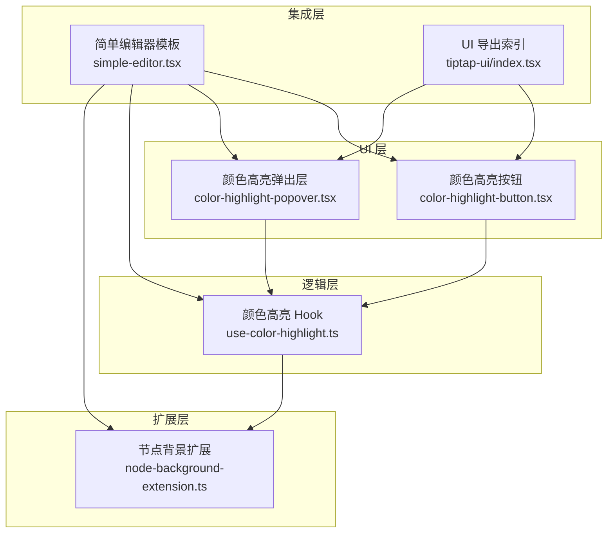
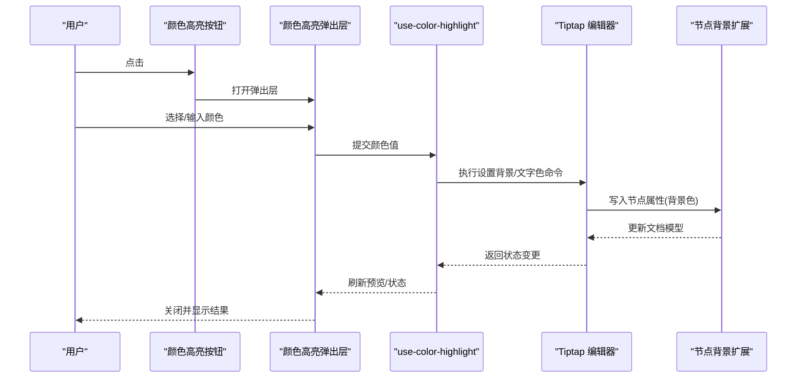
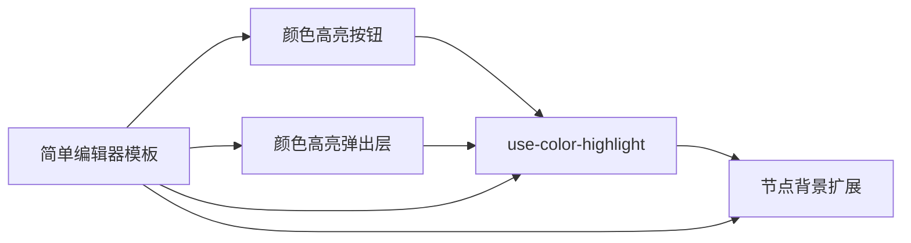

# 颜色高亮控制组件

<cite>
**本文引用的文件**   
- [color-highlight-button.tsx](file://src/components/tiptap-ui/color-highlight-button.tsx)
- [color-highlight-popover.tsx](file://src/components/tiptap-ui/color-highlight-popover.tsx)
- [use-color-highlight.ts](file://src/components/tiptap-ui/use-color-highlight.ts)
- [node-background-extension.ts](file://src/components/tiptap-extension/node-background-extension.ts)
- [simple-editor.tsx](file://src/components/tiptap-templates/simple/simple-editor.tsx)
- [index.tsx](file://src/components/tiptap-ui/index.tsx)
</cite>

## 目录
1. [简介](#简介)
2. [项目结构](#项目结构)
3. [核心组件](#核心组件)
4. [架构总览](#架构总览)
5. [详细组件分析](#详细组件分析)
6. [依赖关系分析](#依赖关系分析)
7. [性能考虑](#性能考虑)
8. [故障排查指南](#故障排查指南)
9. [结论](#结论)
10. [附录：API 参考](#附录api-参考)

## 简介
本文件为“颜色高亮控制组件”的专业文档，聚焦于在基于 Tiptap 的编辑器中实现文本背景色与文字颜色的设置能力。内容涵盖：
- 颜色选择器 UI 与交互流程
- 颜色预设管理与自定义调色板
- 持久化存储策略（含撤销/重做支持）
- 样式冲突处理与最佳实践
- 完整 API 说明（配置项、扩展点、动态颜色生成）
- 与其他格式化功能的协调工作

## 项目结构
颜色高亮功能由以下关键模块组成：
- 工具 Hook：封装对 Tiptap 编辑器的颜色操作命令与状态查询
- UI 按钮与弹出层：提供颜色选择入口与面板
- 节点扩展：将背景色以节点属性形式写入文档模型
- 模板集成：在简单编辑器模板中组合使用上述能力

图表来源
- [color-highlight-button.tsx](file://src/components/tiptap-ui/color-highlight-button.tsx)
- [color-highlight-popover.tsx](file://src/components/tiptap-ui/color-highlight-popover.tsx)
- [use-color-highlight.ts](file://src/components/tiptap-ui/use-color-highlight.ts)
- [node-background-extension.ts](file://src/components/tiptap-extension/node-background-extension.ts)
- [simple-editor.tsx](file://src/components/tiptap-templates/simple/simple-editor.tsx)
- [index.tsx](file://src/components/tiptap-ui/index.tsx)

章节来源
- [color-highlight-button.tsx](file://src/components/tiptap-ui/color-highlight-button.tsx)
- [color-highlight-popover.tsx](file://src/components/tiptap-ui/color-highlight-popover.tsx)
- [use-color-highlight.ts](file://src/components/tiptap-ui/use-color-highlight.ts)
- [node-background-extension.ts](file://src/components/tiptap-extension/node-background-extension.ts)
- [simple-editor.tsx](file://src/components/tiptap-templates/simple/simple-editor.tsx)
- [index.tsx](file://src/components/tiptap-ui/index.tsx)

## 核心组件
- 颜色高亮按钮：触发颜色选择面板，显示当前选中范围的颜色状态
- 颜色高亮弹出层：展示预设颜色网格、自定义输入框与确认/取消操作
- 颜色高亮 Hook：封装对 Tiptap 的命令调用、状态检测、撤销/重做联动
- 节点背景扩展：将背景色作为节点属性持久化到文档模型，避免仅靠 CSS 导致的不一致

章节来源
- [color-highlight-button.tsx](file://src/components/tiptap-ui/color-highlight-button.tsx)
- [color-highlight-popover.tsx](file://src/components/tiptap-ui/color-highlight-popover.tsx)
- [use-color-highlight.ts](file://src/components/tiptap-ui/use-color-highlight.ts)
- [node-background-extension.ts](file://src/components/tiptap-extension/node-background-extension.ts)

## 架构总览
颜色高亮的整体数据流如下：用户通过按钮打开弹出层，选择或输入颜色后，Hook 调用 Tiptap 命令更新文档；背景色通过节点扩展写入文档模型，确保渲染一致性与可序列化。

图表来源
- [color-highlight-button.tsx](file://src/components/tiptap-ui/color-highlight-button.tsx)
- [color-highlight-popover.tsx](file://src/components/tiptap-ui/color-highlight-popover.tsx)
- [use-color-highlight.ts](file://src/components/tiptap-ui/use-color-highlight.ts)
- [node-background-extension.ts](file://src/components/tiptap-extension/node-background-extension.ts)

## 详细组件分析

### 颜色高亮按钮
- 职责
  - 打开/关闭颜色弹出层
  - 根据当前选区状态显示激活态
  - 传递上下文给弹出层（如当前颜色）
- 交互要点
  - 键盘可达性（Tab/Enter/Space）
  - 与气泡菜单/工具栏的布局兼容
- 与 Hook 的关系
  - 通过 Hook 获取当前选区的颜色状态
  - 触发弹出层时携带必要参数

章节来源
- [color-highlight-button.tsx](file://src/components/tiptap-ui/color-highlight-button.tsx)
- [use-color-highlight.ts](file://src/components/tiptap-ui/use-color-highlight.ts)

### 颜色高亮弹出层
- 职责
  - 展示预设颜色网格
  - 提供自定义颜色输入（十六进制/RGB/HSL）
  - 实时预览与确认/取消
- 预设管理
  - 内置常用色板
  - 支持用户自定义色板（本地存储）
- 与 Hook 的关系
  - 接收 Hook 提供的状态与回调
  - 提交颜色后触发编辑器更新

章节来源
- [color-highlight-popover.tsx](file://src/components/tiptap-ui/color-highlight-popover.tsx)
- [use-color-highlight.ts](file://src/components/tiptap-ui/use-color-highlight.ts)

### 颜色高亮 Hook（use-color-highlight）
- 职责
  - 封装对 Tiptap 的命令调用（设置背景色、文字色）
  - 查询当前选区是否已应用颜色
  - 与撤销/重做栈联动
- 关键方法（概念性描述）
  - 设置背景色：将背景色写入当前选区
  - 设置文字色：将前景色写入当前选区
  - 清除颜色：移除背景/文字色
  - 获取状态：返回当前选区的颜色信息
- 撤销/重做
  - 所有颜色变更均进入 Tiptap 历史栈
  - 支持 Ctrl/Cmd+Z/Y 撤销/重做

章节来源
- [use-color-highlight.ts](file://src/components/tiptap-ui/use-color-highlight.ts)

### 节点背景扩展（node-background-extension）
- 职责
  - 定义一个节点类型，用于承载背景色属性
  - 在渲染时将背景色应用到对应 DOM 节点
  - 保证文档序列化包含背景色信息
- 设计要点
  - 与行内标记（mark）的区别：节点级更稳定，适合整段/块级背景
  - 与 CSS 变量结合，便于主题切换
- 与 Hook 的关系
  - Hook 通过该扩展写入/读取背景色

章节来源
- [node-background-extension.ts](file://src/components/tiptap-extension/node-background-extension.ts)

### 简单编辑器模板集成
- 职责
  - 将颜色高亮按钮与弹出层集成到工具栏
  - 初始化节点背景扩展
  - 与其他格式化功能共存（加粗、斜体、链接等）
- 集成方式
  - 在工具栏区域插入颜色高亮按钮
  - 监听选区变化，同步按钮状态
  - 与撤销/重做按钮共用同一历史栈

章节来源
- [simple-editor.tsx](file://src/components/tiptap-templates/simple/simple-editor.tsx)
- [index.tsx](file://src/components/tiptap-ui/index.tsx)

## 依赖关系分析
- 组件耦合
  - 按钮与弹出层通过 Hook 解耦，降低直接依赖
  - Hook 与 Tiptap 编辑器强耦合，但通过扩展抽象了具体渲染细节
- 外部依赖
  - Tiptap 编辑器核心
  - 可选：本地存储用于保存自定义调色板
- 潜在循环依赖
  - 通过 Hook 统一调度，避免 UI 与扩展之间的双向引用

图表来源
- [color-highlight-button.tsx](file://src/components/tiptap-ui/color-highlight-button.tsx)
- [color-highlight-popover.tsx](file://src/components/tiptap-ui/color-highlight-popover.tsx)
- [use-color-highlight.ts](file://src/components/tiptap-ui/use-color-highlight.ts)
- [node-background-extension.ts](file://src/components/tiptap-extension/node-background-extension.ts)
- [simple-editor.tsx](file://src/components/tiptap-templates/simple/simple-editor.tsx)

## 性能考虑
- 渲染优化
  - 仅在选区变化或颜色提交时更新状态，避免频繁重渲染
- 历史栈
  - 批量操作合并为一次历史条目，减少内存占用
- 颜色计算
  - 预设色板预计算对比度，提升可读性判断效率
- 主题切换
  - 使用 CSS 变量集中管理颜色，减少运行时计算

## 故障排查指南
- 颜色未生效
  - 检查是否已启用节点背景扩展
  - 确认选区是否为有效文本范围
- 撤销/重做无效
  - 确认颜色操作是否通过 Hook 调用 Tiptap 命令
  - 检查是否存在第三方插件干扰历史栈
- 样式冲突
  - 避免与全局 CSS 的 background/textColor 规则冲突
  - 使用更高特异性的选择器或 CSS 变量覆盖
- 自定义色板丢失
  - 检查本地存储权限与命名空间
  - 验证 JSON 格式与键名一致性

## 结论
颜色高亮控制组件通过清晰的层次划分与稳定的数据流，实现了可靠的文本强调能力。借助节点扩展与 Hook 的组合，既保证了文档模型的完整性，又提供了良好的用户体验与可扩展性。建议在生产环境中结合主题系统与无障碍规范，持续优化配色与对比度。

## 附录：API 参考

### 颜色配置
- 预设色板
  - 类型：颜色数组
  - 默认值：内置常用色
  - 行为：在弹出层中以网格展示
- 自定义色板
  - 类型：颜色数组
  - 持久化：本地存储
  - 行为：用户新增/删除后自动保存

### 颜色选择器
- 输入模式
  - 十六进制、RGB、HSL
- 实时预览
  - 在弹出层内即时显示效果
- 确认/取消
  - 确认后提交至编辑器，取消则不改变状态

### 动态颜色生成
- 算法
  - 基于文本内容哈希生成稳定色
  - 支持明暗模式下的对比度调整
- 用途
  - 标签、分类、用户头像等场景

### 与格式化功能的协调
- 与加粗/斜体/下划线
  - 互不干扰，可同时应用
- 与链接/代码块
  - 注意层级顺序，避免被外层样式覆盖
- 与对齐/列表
  - 背景色作用于节点级别，不影响行内标记

### 持久化与撤销/重做
- 持久化
  - 文档模型中包含背景色属性
  - 自定义色板保存在本地存储
- 撤销/重做
  - 所有颜色变更进入 Tiptap 历史栈
  - 支持快捷键与 UI 按钮操作

章节来源
- [color-highlight-button.tsx](file://src/components/tiptap-ui/color-highlight-button.tsx)
- [color-highlight-popover.tsx](file://src/components/tiptap-ui/color-highlight-popover.tsx)
- [use-color-highlight.ts](file://src/components/tiptap-ui/use-color-highlight.ts)
- [node-background-extension.ts](file://src/components/tiptap-extension/node-background-extension.ts)
- [simple-editor.tsx](file://src/components/tiptap-templates/simple/simple-editor.tsx)
- [index.tsx](file://src/components/tiptap-ui/index.tsx)