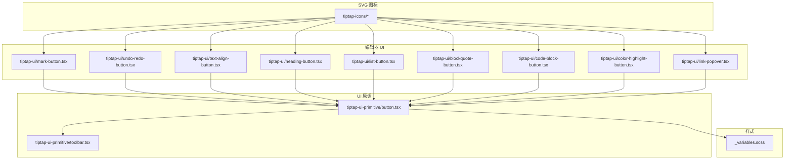
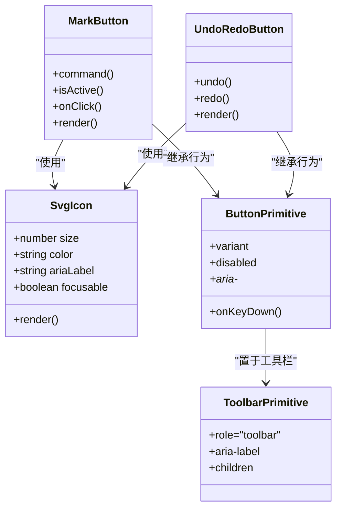
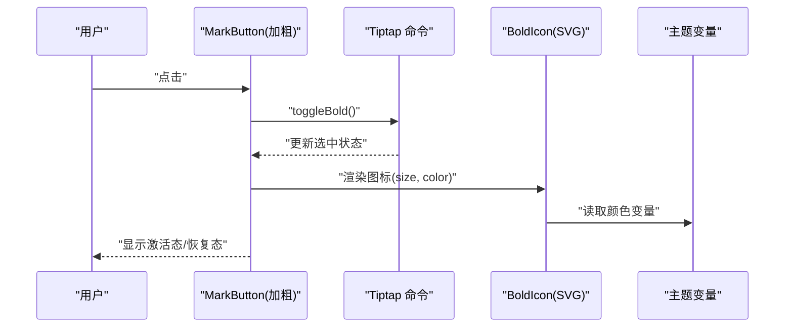
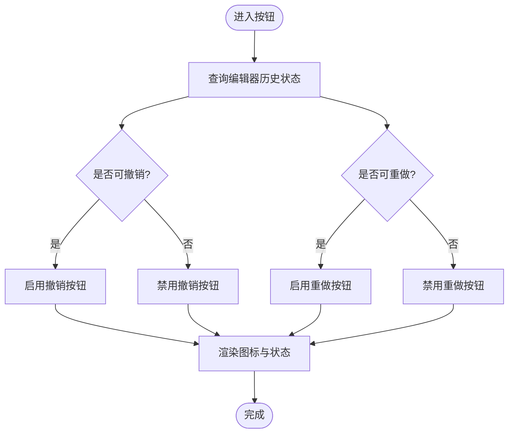
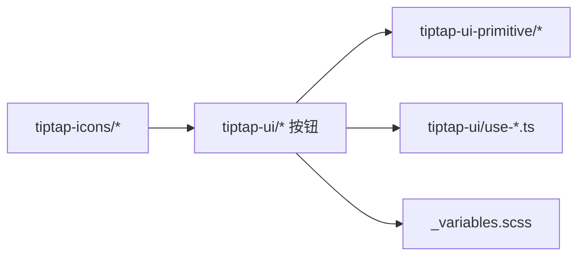

# 图标系统

<cite>
**本文引用的文件**   
- [src/components/tiptap-icons/bold-icon.tsx](file://src/components/tiptap-icons/bold-icon.tsx)
- [src/components/tiptap-icons/italic-icon.tsx](file://src/components/tiptap-icons/italic-icon.tsx)
- [src/components/tiptap-icons/link-icon.tsx](file://src/components/tiptap-icons/link-icon.tsx)
- [src/components/tiptap-icons/list-icon.tsx](file://src/components/tiptap-icons/list-icon.tsx)
- [src/components/tiptap-icons/list-ordered-icon.tsx](file://src/components/tiptap-icons/list-ordered-icon.tsx)
- [src/components/tiptap-icons/list-todo-icon.tsx](file://src/components/tiptap-icons/list-todo-icon.tsx)
- [src/components/tiptap-icons/check-icon.tsx](file://src/components/tiptap-icons/check-icon.tsx)
- [src/components/tiptap-icons/trash-icon.tsx](file://src/components/tiptap-icons/trash-icon.tsx)
- [src/components/tiptap-icons/undo2-icon.tsx](file://src/components/tiptap-icons/undo2-icon.tsx)
- [src/components/tiptap-icons/redo2-icon.tsx](file://src/components/tiptap-icons/redo2-icon.tsx)
- [src/components/tiptap-icons/arrow-left-icon.tsx](file://src/components/tiptap-icons/arrow-left-icon.tsx)
- [src/components/tiptap-icons/chevron-down-icon.tsx](file://src/components/tiptap-icons/chevron-down-icon.tsx)
- [src/components/tiptap-icons/close-icon.tsx](file://src/components/tiptap-icons/close-icon.tsx)
- [src/components/tiptap-icons/external-link-icon.tsx](file://src/components/tiptap-icons/external-link-icon.tsx)
- [src/components/tiptap-icons/sun-icon.tsx](file://src/components/tiptap-icons/sun-icon.tsx)
- [src/components/tiptap-icons/moon-star-icon.tsx](file://src/components/tiptap-icons/moon-star-icon.tsx)
- [src/components/tiptap-icons/heading-icon.tsx](file://src/components/tiptap-icons/heading-icon.tsx)
- [src/components/tiptap-icons/heading-one-icon.tsx](file://src/components/tiptap-icons/heading-one-icon.tsx)
- [src/components/tiptap-icons/heading-two-icon.tsx](file://src/components/tiptap-icons/heading-two-icon.tsx)
- [src/components/tiptap-icons/heading-three-icon.tsx](file://src/components/tiptap-icons/heading-three-icon.tsx)
- [src/components/tiptap-icons/heading-four-icon.tsx](file://src/components/tiptap-icons/heading-four-icon.tsx)
- [src/components/tiptap-icons/heading-five-icon.tsx](file://src/components/tiptap-icons/heading-five-icon.tsx)
- [src/components/tiptap-icons/heading-six-icon.tsx](file://src/components/tiptap-icons/heading-six-icon.tsx)
- [src/components/tiptap-icons/code2-icon.tsx](file://src/components/tiptap-icons/code2-icon.tsx)
- [src/components/tiptap-icons/code-block-icon.tsx](file://src/components/tiptap-icons/code-block-icon.tsx)
- [src/components/tiptap-icons/blockquote-icon.tsx](file://src/components/tiptap-icons/blockquote-icon.tsx)
- [src/components/tiptap-icons/highlighter-icon.tsx](file://src/components/tiptap-icons/highlighter-icon.tsx)
- [src/components/tiptap-icons/strike-icon.tsx](file://src/components/tiptap-icons/strike-icon.tsx)
- [src/components/tiptap-icons/underline-icon.tsx](file://src/components/tiptap-icons/underline-icon.tsx)
- [src/components/tiptap-icons/subscript-icon.tsx](file://src/components/tiptap-icons/subscript-icon.tsx)
- [src/components/tiptap-icons/superscript-icon.tsx](file://src/components/tiptap-icons/superscript-icon.tsx)
- [src/components/tiptap-icons/image-plus-icon.tsx](file://src/components/tiptap-icons/image-plus-icon.tsx)
- [src/components/tiptap-icons/align-center-icon.tsx](file://src/components/tiptap-icons/align-center-icon.tsx)
- [src/components/tiptap-icons/align-left-icon.tsx](file://src/components/tiptap-icons/align-left-icon.tsx)
- [src/components/tiptap-icons/align-right-icon.tsx](file://src/components/tiptap-icons/align-right-icon.tsx)
- [src/components/tiptap-icons/align-justify-icon.tsx](file://src/components/tiptap-icons/align-justify-icon.tsx)
- [src/components/tiptap-icons/corner-down-left-icon.tsx](file://src/components/tiptap-icons/corner-down-left-icon.tsx)
- [src/components/tiptap-icons/ban-icon.tsx](file://src/components/tiptap-icons/ban-icon.tsx)
- [src/components/tiptap-ui-primitive/button.tsx](file://src/components/tiptap-ui-primitive/button.tsx)
- [src/components/tiptap-ui-primitive/toolbar.tsx](file://src/components/tiptap-ui-primitive/toolbar.tsx)
- [src/components/tiptap-ui/mark-button.tsx](file://src/components/tiptap-ui/mark-button.tsx)
- [src/components/tiptap-ui/undo-redo-button.tsx](file://src/components/tiptap-ui/undo-redo-button.tsx)
- [src/components/tiptap-ui/text-align-button.tsx](file://src/components/tiptap-ui/text-align-button.tsx)
- [src/components/tiptap-ui/heading-button.tsx](file://src/components/tiptap-ui/heading-button.tsx)
- [src/components/tiptap-ui/list-button.tsx](file://src/components/tiptap-ui/list-button.tsx)
- [src/components/tiptap-ui/blockquote-button.tsx](file://src/components/tiptap-ui/blockquote-button.tsx)
- [src/components/tiptap-ui/code-block-button.tsx](file://src/components/tiptap-ui/code-block-button.tsx)
- [src/components/tiptap-ui/color-highlight-button.tsx](file://src/components/tiptap-ui/color-highlight-button.tsx)
- [src/components/tiptap-ui/link-popover.tsx](file://src/components/tiptap-ui/link-popover.tsx)
- [src/components/tiptap-ui/use-mark.ts](file://src/components/tiptap-ui/use-mark.ts)
- [src/components/tiptap-ui/use-undo-redo.ts](file://src/components/tiptap-ui/use-undo-redo.ts)
- [src/components/tiptap-ui/use-text-align.ts](file://src/components/tiptap-ui/use-text-align.ts)
- [src/components/tiptap-ui/use-heading.ts](file://src/components/tiptap-ui/use-heading.ts)
- [src/components/tiptap-ui/use-list.ts](file://src/components/tiptap-ui/use-list.ts)
- [src/components/tiptap-ui/use-blockquote.ts](file://src/components/tiptap-ui/use-blockquote.ts)
- [src/components/tiptap-ui/use-code-block.ts](file://src/components/tiptap-ui/use-code-block.ts)
- [src/components/tiptap-ui/use-color-highlight.ts](file://src/components/tiptap-ui/use-color-highlight.ts)
- [src/components/tiptap-ui/use-link-popover.ts](file://src/components/tiptap-ui/use-link-popover.ts)
- [src/components/tiptap-ui/index.tsx](file://src/components/tiptap-ui/index.tsx)
- [src/styles/_variables.scss](file://src/styles/_variables.scss)
</cite>

## 目录
1. [简介](#简介)
2. [项目结构](#项目结构)
3. [核心组件](#核心组件)
4. [架构总览](#架构总览)
5. [详细组件分析](#详细组件分析)
6. [依赖关系分析](#依赖关系分析)
7. [性能与可访问性](#性能与可访问性)
8. [故障排查指南](#故障排查指南)
9. [结论](#结论)
10. [附录：图标清单与使用示例](#附录图标清单与使用示例)

## 简介
本文件为 FishWorker 的图标系统提供完整文档，覆盖基于 SVG 的图标组件架构、设计原则、命名规范、尺寸标准、颜色主题支持、可用图标清单、使用与扩展方法、与业务组件集成方式，以及可访问性与响应式适配方案。目标是帮助开发者快速理解并正确使用现有图标，同时具备扩展新图标的工程能力。

## 项目结构
图标系统位于前端源码中，采用“按功能域组织”的结构：
- 基础 SVG 图标组件：src/components/tiptap-icons/*
- 编辑器 UI 按钮与交互：src/components/tiptap-ui/*
- 基础 UI 原语（按钮、工具栏等）：src/components/tiptap-ui-primitive/*
- 样式变量（主题色、间距等）：src/styles/_variables.scss

图表来源
- [src/components/tiptap-icons/bold-icon.tsx](file://src/components/tiptap-icons/bold-icon.tsx)
- [src/components/tiptap-ui/mark-button.tsx](file://src/components/tiptap-ui/mark-button.tsx)
- [src/components/tiptap-ui-primitive/button.tsx](file://src/components/tiptap-ui-primitive/button.tsx)
- [src/components/tiptap-ui-primitive/toolbar.tsx](file://src/components/tiptap-ui-primitive/toolbar.tsx)
- [src/styles/_variables.scss](file://src/styles/_variables.scss)

章节来源
- [src/components/tiptap-icons/bold-icon.tsx](file://src/components/tiptap-icons/bold-icon.tsx)
- [src/components/tiptap-ui/mark-button.tsx](file://src/components/tiptap-ui/mark-button.tsx)
- [src/components/tiptap-ui-primitive/button.tsx](file://src/components/tiptap-ui-primitive/button.tsx)
- [src/components/tiptap-ui-primitive/toolbar.tsx](file://src/components/tiptap-ui-primitive/toolbar.tsx)
- [src/styles/_variables.scss](file://src/styles/_variables.scss)

## 核心组件
- SVG 图标组件：每个图标以独立 TSX 文件实现，统一通过 props 控制尺寸、颜色、无障碍属性等。
- 编辑器按钮：将图标与 Tiptap 命令绑定，封装状态切换、快捷键、提示等交互逻辑。
- 基础按钮/工具栏：提供统一的点击、禁用、焦点管理、键盘导航与主题样式。

章节来源
- [src/components/tiptap-ui/mark-button.tsx](file://src/components/tiptap-ui/mark-button.tsx)
- [src/components/tiptap-ui/undo-redo-button.tsx](file://src/components/tiptap-ui/undo-redo-button.tsx)
- [src/components/tiptap-ui-primitive/button.tsx](file://src/components/tiptap-ui-primitive/button.tsx)
- [src/components/tiptap-ui-primitive/toolbar.tsx](file://src/components/tiptap-ui-primitive/toolbar.tsx)

## 架构总览
图标系统遵循“低耦合、高复用”的设计原则：
- 图标层：纯展示型 SVG 组件，不关心业务逻辑。
- 交互层：编辑器按钮组合图标与命令，处理状态与事件。
- 原语层：提供通用按钮、工具栏、弹出框等基础控件。
- 主题层：通过 CSS 变量与 SCSS 变量驱动颜色与尺寸。

图表来源
- [src/components/tiptap-ui/mark-button.tsx](file://src/components/tiptap-ui/mark-button.tsx)
- [src/components/tiptap-ui/undo-redo-button.tsx](file://src/components/tiptap-ui/undo-redo-button.tsx)
- [src/components/tiptap-ui-primitive/button.tsx](file://src/components/tiptap-ui-primitive/button.tsx)
- [src/components/tiptap-ui-primitive/toolbar.tsx](file://src/components/tiptap-ui-primitive/toolbar.tsx)

## 详细组件分析

### 文本编辑类图标
- 加粗、斜体、删除线、下划线、上标、下标、代码、代码块、引用块、标题系列、列表、有序列表、待办列表、链接、图片插入、高亮、对齐（左/中/右/两端）、撤销/重做、检查、关闭、外部链接、返回箭头、下拉箭头、禁止、折角箭头等。
- 这些图标在编辑器按钮中被组合使用，如 mark-button、list-button、heading-button、text-align-button、undo-redo-button、blockquote-button、code-block-button、color-highlight-button、link-popover 等。

章节来源
- [src/components/tiptap-icons/bold-icon.tsx](file://src/components/tiptap-icons/bold-icon.tsx)
- [src/components/tiptap-icons/italic-icon.tsx](file://src/components/tiptap-icons/italic-icon.tsx)
- [src/components/tiptap-icons/strike-icon.tsx](file://src/components/tiptap-icons/strike-icon.tsx)
- [src/components/tiptap-icons/underline-icon.tsx](file://src/components/tiptap-icons/underline-icon.tsx)
- [src/components/tiptap-icons/superscript-icon.tsx](file://src/components/tiptap-icons/superscript-icon.tsx)
- [src/components/tiptap-icons/subscript-icon.tsx](file://src/components/tiptap-icons/subscript-icon.tsx)
- [src/components/tiptap-icons/code2-icon.tsx](file://src/components/tiptap-icons/code2-icon.tsx)
- [src/components/tiptap-icons/code-block-icon.tsx](file://src/components/tiptap-icons/code-block-icon.tsx)
- [src/components/tiptap-icons/blockquote-icon.tsx](file://src/components/tiptap-icons/blockquote-icon.tsx)
- [src/components/tiptap-icons/heading-icon.tsx](file://src/components/tiptap-icons/heading-icon.tsx)
- [src/components/tiptap-icons/heading-one-icon.tsx](file://src/components/tiptap-icons/heading-one-icon.tsx)
- [src/components/tiptap-icons/heading-two-icon.tsx](file://src/components/tiptap-icons/heading-two-icon.tsx)
- [src/components/tiptap-icons/heading-three-icon.tsx](file://src/components/tiptap-icons/heading-three-icon.tsx)
- [src/components/tiptap-icons/heading-four-icon.tsx](file://src/components/tiptap-icons/heading-four-icon.tsx)
- [src/components/tiptap-icons/heading-five-icon.tsx](file://src/components/tiptap-icons/heading-five-icon.tsx)
- [src/components/tiptap-icons/heading-six-icon.tsx](file://src/components/tiptap-icons/heading-six-icon.tsx)
- [src/components/tiptap-icons/list-icon.tsx](file://src/components/tiptap-icons/list-icon.tsx)
- [src/components/tiptap-icons/list-ordered-icon.tsx](file://src/components/tiptap-icons/list-ordered-icon.tsx)
- [src/components/tiptap-icons/list-todo-icon.tsx](file://src/components/tiptap-icons/list-todo-icon.tsx)
- [src/components/tiptap-icons/link-icon.tsx](file://src/components/tiptap-icons/link-icon.tsx)
- [src/components/tiptap-icons/image-plus-icon.tsx](file://src/components/tiptap-icons/image-plus-icon.tsx)
- [src/components/tiptap-icons/highlighter-icon.tsx](file://src/components/tiptap-icons/highlighter-icon.tsx)
- [src/components/tiptap-icons/align-left-icon.tsx](file://src/components/tiptap-icons/align-left-icon.tsx)
- [src/components/tiptap-icons/align-center-icon.tsx](file://src/components/tiptap-icons/align-center-icon.tsx)
- [src/components/tiptap-icons/align-right-icon.tsx](file://src/components/tiptap-icons/align-right-icon.tsx)
- [src/components/tiptap-icons/align-justify-icon.tsx](file://src/components/tiptap-icons/align-justify-icon.tsx)
- [src/components/tiptap-icons/undo2-icon.tsx](file://src/components/tiptap-icons/undo2-icon.tsx)
- [src/components/tiptap-icons/redo2-icon.tsx](file://src/components/tiptap-icons/redo2-icon.tsx)

### 操作类图标
- 检查、删除、撤销、重做、关闭、外部链接、禁止、折角箭头等，常用于确认、移除、导航与反馈场景。

章节来源
- [src/components/tiptap-icons/check-icon.tsx](file://src/components/tiptap-icons/check-icon.tsx)
- [src/components/tiptap-icons/trash-icon.tsx](file://src/components/tiptap-icons/trash-icon.tsx)
- [src/components/tiptap-icons/undo2-icon.tsx](file://src/components/tiptap-icons/undo2-icon.tsx)
- [src/components/tiptap-icons/redo2-icon.tsx](file://src/components/tiptap-icons/redo2-icon.tsx)
- [src/components/tiptap-icons/close-icon.tsx](file://src/components/tiptap-icons/close-icon.tsx)
- [src/components/tiptap-icons/external-link-icon.tsx](file://src/components/tiptap-icons/external-link-icon.tsx)
- [src/components/tiptap-icons/ban-icon.tsx](file://src/components/tiptap-icons/ban-icon.tsx)
- [src/components/tiptap-icons/corner-down-left-icon.tsx](file://src/components/tiptap-icons/corner-down-left-icon.tsx)

### 导航类图标
- 返回箭头、下拉箭头、太阳/月亮（主题切换）等，用于页面导航与界面状态指示。

章节来源
- [src/components/tiptap-icons/arrow-left-icon.tsx](file://src/components/tiptap-icons/arrow-left-icon.tsx)
- [src/components/tiptap-icons/chevron-down-icon.tsx](file://src/components/tiptap-icons/chevron-down-icon.tsx)
- [src/components/tiptap-icons/sun-icon.tsx](file://src/components/tiptap-icons/sun-icon.tsx)
- [src/components/tiptap-icons/moon-star-icon.tsx](file://src/components/tiptap-icons/moon-star-icon.tsx)

### 编辑器按钮与图标集成流程
以下序列图展示了“加粗”按钮从用户点击到执行命令的典型调用链。

图表来源
- [src/components/tiptap-ui/mark-button.tsx](file://src/components/tiptap-ui/mark-button.tsx)
- [src/components/tiptap-icons/bold-icon.tsx](file://src/components/tiptap-icons/bold-icon.tsx)
- [src/styles/_variables.scss](file://src/styles/_variables.scss)

章节来源
- [src/components/tiptap-ui/mark-button.tsx](file://src/components/tiptap-ui/mark-button.tsx)
- [src/components/tiptap-icons/bold-icon.tsx](file://src/components/tiptap-icons/bold-icon.tsx)
- [src/styles/_variables.scss](file://src/styles/_variables.scss)

### 复杂逻辑流程图：撤销/重做按钮

图表来源
- [src/components/tiptap-ui/undo-redo-button.tsx](file://src/components/tiptap-ui/undo-redo-button.tsx)
- [src/components/tiptap-ui/use-undo-redo.ts](file://src/components/tiptap-ui/use-undo-redo.ts)
- [src/components/tiptap-icons/undo2-icon.tsx](file://src/components/tiptap-icons/undo2-icon.tsx)
- [src/components/tiptap-icons/redo2-icon.tsx](file://src/components/tiptap-icons/redo2-icon.tsx)

章节来源
- [src/components/tiptap-ui/undo-redo-button.tsx](file://src/components/tiptap-ui/undo-redo-button.tsx)
- [src/components/tiptap-ui/use-undo-redo.ts](file://src/components/tiptap-ui/use-undo-redo.ts)
- [src/components/tiptap-icons/undo2-icon.tsx](file://src/components/tiptap-icons/undo2-icon.tsx)
- [src/components/tiptap-icons/redo2-icon.tsx](file://src/components/tiptap-icons/redo2-icon.tsx)

## 依赖关系分析
- 图标组件被各编辑器按钮直接引用，形成“图标 -> 按钮 -> 原语”的单向依赖。
- 主题变量由按钮与图标共同消费，保证颜色一致性。
- 编辑器状态通过 hooks（use-mark、use-undo-redo、use-text-align、use-heading、use-list、use-blockquote、use-code-block、use-color-highlight、use-link-popover）注入到按钮，避免重复逻辑。

图表来源
- [src/components/tiptap-ui/index.tsx](file://src/components/tiptap-ui/index.tsx)
- [src/components/tiptap-ui/mark-button.tsx](file://src/components/tiptap-ui/mark-button.tsx)
- [src/components/tiptap-ui/use-mark.ts](file://src/components/tiptap-ui/use-mark.ts)
- [src/components/tiptap-ui/use-undo-redo.ts](file://src/components/tiptap-ui/use-undo-redo.ts)
- [src/components/tiptap-ui/use-text-align.ts](file://src/components/tiptap-ui/use-text-align.ts)
- [src/components/tiptap-ui/use-heading.ts](file://src/components/tiptap-ui/use-heading.ts)
- [src/components/tiptap-ui/use-list.ts](file://src/components/tiptap-ui/use-list.ts)
- [src/components/tiptap-ui/use-blockquote.ts](file://src/components/tiptap-ui/use-blockquote.ts)
- [src/components/tiptap-ui/use-code-block.ts](file://src/components/tiptap-ui/use-code-block.ts)
- [src/components/tiptap-ui/use-color-highlight.ts](file://src/components/tiptap-ui/use-color-highlight.ts)
- [src/components/tiptap-ui/use-link-popover.ts](file://src/components/tiptap-ui/use-link-popover.ts)
- [src/styles/_variables.scss](file://src/styles/_variables.scss)

章节来源
- [src/components/tiptap-ui/index.tsx](file://src/components/tiptap-ui/index.tsx)
- [src/components/tiptap-ui/mark-button.tsx](file://src/components/tiptap-ui/mark-button.tsx)
- [src/components/tiptap-ui/use-mark.ts](file://src/components/tiptap-ui/use-mark.ts)
- [src/components/tiptap-ui/use-undo-redo.ts](file://src/components/tiptap-ui/use-undo-redo.ts)
- [src/components/tiptap-ui/use-text-align.ts](file://src/components/tiptap-ui/use-text-align.ts)
- [src/components/tiptap-ui/use-heading.ts](file://src/components/tiptap-ui/use-heading.ts)
- [src/components/tiptap-ui/use-list.ts](file://src/components/tiptap-ui/use-list.ts)
- [src/components/tiptap-ui/use-blockquote.ts](file://src/components/tiptap-ui/use-blockquote.ts)
- [src/components/tiptap-ui/use-code-block.ts](file://src/components/tiptap-ui/use-code-block.ts)
- [src/components/tiptap-ui/use-color-highlight.ts](file://src/components/tiptap-ui/use-color-highlight.ts)
- [src/components/tiptap-ui/use-link-popover.ts](file://src/components/tiptap-ui/use-link-popover.ts)
- [src/styles/_variables.scss](file://src/styles/_variables.scss)

## 性能与可访问性
- 性能
  - 图标为轻量 SVG 组件，建议按需引入，避免打包冗余。
  - 在高频触发的按钮中，尽量复用同一图标实例，减少重复创建。
  - 对大型图标或复杂路径，考虑使用 sprite 或预编译优化。
- 可访问性
  - 所有图标应提供语义化 aria-label，确保屏幕阅读器可读。
  - 按钮需支持键盘导航与焦点可见性，遵循 WAI-ARIA 最佳实践。
  - 颜色对比度需满足 WCAG 要求，尤其在主题切换时保持可读性。
- 响应式适配
  - 通过 size 属性与 CSS 变量控制图标尺寸，结合断点调整工具栏布局。
  - 在小屏设备上，优先保留核心图标，隐藏次要图标或使用折叠菜单。

[本节为通用指导，无需特定文件来源]

## 故障排查指南
- 图标未显示或颜色异常
  - 检查传入的 color 是否与主题变量一致；确认父容器未覆盖 fill/stroke。
  - 验证按钮是否处于 disabled 状态导致图标不可见。
- 按钮状态不同步
  - 核对对应 use-* hook 的状态来源是否正确订阅了编辑器变更。
  - 检查命令 toggle 是否被正确触发，是否存在竞态条件。
- 键盘导航失效
  - 确认按钮实现了 onKeyDown 与正确的 role/tabindex。
  - 检查工具栏是否设置了正确的 aria-* 属性。

章节来源
- [src/components/tiptap-ui-primitive/button.tsx](file://src/components/tiptap-ui-primitive/button.tsx)
- [src/components/tiptap-ui-primitive/toolbar.tsx](file://src/components/tiptap-ui-primitive/toolbar.tsx)
- [src/components/tiptap-ui/mark-button.tsx](file://src/components/tiptap-ui/mark-button.tsx)
- [src/components/tiptap-ui/undo-redo-button.tsx](file://src/components/tiptap-ui/undo-redo-button.tsx)

## 结论
FishWorker 的图标系统以 SVG 组件为核心，配合编辑器按钮与原语控件，形成了清晰的分层架构。通过统一的命名规范、尺寸与主题变量，保证了视觉一致性与可维护性。借助 hooks 与命令体系，图标与业务逻辑解耦，便于扩展与测试。遵循可访问性与响应式策略，可在多端与多主题环境下获得良好体验。

[本节为总结，无需特定文件来源]

## 附录：图标清单与使用示例

### 命名规范
- 文件名：小写英文单词，连字符分隔，语义明确，如 bold-icon.tsx、list-todo-icon.tsx。
- 导出名：与文件名一致，首字母大写，如 BoldIcon、ListTodoIcon。
- 属性：size（数字，单位 px）、color（字符串，支持 CSS 变量）、ariaLabel（字符串）。

### 尺寸标准
- 常用尺寸：16px、20px、24px。
- 工具栏默认：20px；大按钮或弹窗内可使用 24px；紧凑布局使用 16px。
- 通过 CSS 变量统一管理，便于全局调整。

### 颜色主题支持
- 支持明暗主题切换，颜色来源于 _variables.scss 中的变量。
- 建议在图标组件中通过 CSS 变量或受控 color 属性应用主题。

### 可用图标清单（分类）
- 文本编辑
  - 加粗、斜体、删除线、下划线、上标、下标、代码、代码块、引用块、标题（H1-H6）、无序列表、有序列表、待办列表、链接、图片插入、高亮、对齐（左/中/右/两端）
- 操作
  - 检查、删除、撤销、重做、关闭、外部链接、禁止、折角箭头
- 导航
  - 返回箭头、下拉箭头、太阳/月亮（主题切换）

章节来源
- [src/components/tiptap-icons/bold-icon.tsx](file://src/components/tiptap-icons/bold-icon.tsx)
- [src/components/tiptap-icons/italic-icon.tsx](file://src/components/tiptap-icons/italic-icon.tsx)
- [src/components/tiptap-icons/strike-icon.tsx](file://src/components/tiptap-icons/strike-icon.tsx)
- [src/components/tiptap-icons/underline-icon.tsx](file://src/components/tiptap-icons/underline-icon.tsx)
- [src/components/tiptap-icons/superscript-icon.tsx](file://src/components/tiptap-icons/superscript-icon.tsx)
- [src/components/tiptap-icons/subscript-icon.tsx](file://src/components/tiptap-icons/subscript-icon.tsx)
- [src/components/tiptap-icons/code2-icon.tsx](file://src/components/tiptap-icons/code2-icon.tsx)
- [src/components/tiptap-icons/code-block-icon.tsx](file://src/components/tiptap-icons/code-block-icon.tsx)
- [src/components/tiptap-icons/blockquote-icon.tsx](file://src/components/tiptap-icons/blockquote-icon.tsx)
- [src/components/tiptap-icons/heading-icon.tsx](file://src/components/tiptap-icons/heading-icon.tsx)
- [src/components/tiptap-icons/heading-one-icon.tsx](file://src/components/tiptap-icons/heading-one-icon.tsx)
- [src/components/tiptap-icons/heading-two-icon.tsx](file://src/components/tiptap-icons/heading-two-icon.tsx)
- [src/components/tiptap-icons/heading-three-icon.tsx](file://src/components/tiptap-icons/heading-three-icon.tsx)
- [src/components/tiptap-icons/heading-four-icon.tsx](file://src/components/tiptap-icons/heading-four-icon.tsx)
- [src/components/tiptap-icons/heading-five-icon.tsx](file://src/components/tiptap-icons/heading-five-icon.tsx)
- [src/components/tiptap-icons/heading-six-icon.tsx](file://src/components/tiptap-icons/heading-six-icon.tsx)
- [src/components/tiptap-icons/list-icon.tsx](file://src/components/tiptap-icons/list-icon.tsx)
- [src/components/tiptap-icons/list-ordered-icon.tsx](file://src/components/tiptap-icons/list-ordered-icon.tsx)
- [src/components/tiptap-icons/list-todo-icon.tsx](file://src/components/tiptap-icons/list-todo-icon.tsx)
- [src/components/tiptap-icons/link-icon.tsx](file://src/components/tiptap-icons/link-icon.tsx)
- [src/components/tiptap-icons/image-plus-icon.tsx](file://src/components/tiptap-icons/image-plus-icon.tsx)
- [src/components/tiptap-icons/highlighter-icon.tsx](file://src/components/tiptap-icons/highlighter-icon.tsx)
- [src/components/tiptap-icons/align-left-icon.tsx](file://src/components/tiptap-icons/align-left-icon.tsx)
- [src/components/tiptap-icons/align-center-icon.tsx](file://src/components/tiptap-icons/align-center-icon.tsx)
- [src/components/tiptap-icons/align-right-icon.tsx](file://src/components/tiptap-icons/align-right-icon.tsx)
- [src/components/tiptap-icons/align-justify-icon.tsx](file://src/components/tiptap-icons/align-justify-icon.tsx)
- [src/components/tiptap-icons/check-icon.tsx](file://src/components/tiptap-icons/check-icon.tsx)
- [src/components/tiptap-icons/trash-icon.tsx](file://src/components/tiptap-icons/trash-icon.tsx)
- [src/components/tiptap-icons/undo2-icon.tsx](file://src/components/tiptap-icons/undo2-icon.tsx)
- [src/components/tiptap-icons/redo2-icon.tsx](file://src/components/tiptap-icons/redo2-icon.tsx)
- [src/components/tiptap-icons/close-icon.tsx](file://src/components/tiptap-icons/close-icon.tsx)
- [src/components/tiptap-icons/external-link-icon.tsx](file://src/components/tiptap-icons/external-link-icon.tsx)
- [src/components/tiptap-icons/ban-icon.tsx](file://src/components/tiptap-icons/ban-icon.tsx)
- [src/components/tiptap-icons/corner-down-left-icon.tsx](file://src/components/tiptap-icons/corner-down-left-icon.tsx)
- [src/components/tiptap-icons/arrow-left-icon.tsx](file://src/components/tiptap-icons/arrow-left-icon.tsx)
- [src/components/tiptap-icons/chevron-down-icon.tsx](file://src/components/tiptap-icons/chevron-down-icon.tsx)
- [src/components/tiptap-icons/sun-icon.tsx](file://src/components/tiptap-icons/sun-icon.tsx)
- [src/components/tiptap-icons/moon-star-icon.tsx](file://src/components/tiptap-icons/moon-star-icon.tsx)

### 使用示例（路径指引）
- 在标记按钮中使用加粗图标：参考 [src/components/tiptap-ui/mark-button.tsx](file://src/components/tiptap-ui/mark-button.tsx) 与 [src/components/tiptap-icons/bold-icon.tsx](file://src/components/tiptap-icons/bold-icon.tsx)
- 在撤销/重做按钮中使用对应图标：参考 [src/components/tiptap-ui/undo-redo-button.tsx](file://src/components/tiptap-ui/undo-redo-button.tsx)、[src/components/tiptap-icons/undo2-icon.tsx](file://src/components/tiptap-icons/undo2-icon.tsx)、[src/components/tiptap-icons/redo2-icon.tsx](file://src/components/tiptap-icons/redo2-icon.tsx)
- 在文本对齐按钮中使用对齐图标：参考 [src/components/tiptap-ui/text-align-button.tsx](file://src/components/tiptap-ui/text-align-button.tsx) 与各 align-*-icon.tsx
- 在标题按钮中使用标题图标：参考 [src/components/tiptap-ui/heading-button.tsx](file://src/components/tiptap-ui/heading-button.tsx) 与各 heading-*-icon.tsx
- 在列表按钮中使用列表图标：参考 [src/components/tiptap-ui/list-button.tsx](file://src/components/tiptap-ui/list-button.tsx) 与各 list-*-icon.tsx
- 在引用块按钮中使用引用块图标：参考 [src/components/tiptap-ui/blockquote-button.tsx](file://src/components/tiptap-ui/blockquote-button.tsx) 与 [src/components/tiptap-icons/blockquote-icon.tsx](file://src/components/tiptap-icons/blockquote-icon.tsx)
- 在代码块按钮中使用代码块图标：参考 [src/components/tiptap-ui/code-block-button.tsx](file://src/components/tiptap-ui/code-block-button.tsx) 与 [src/components/tiptap-icons/code-block-icon.tsx](file://src/components/tiptap-icons/code-block-icon.tsx)
- 在高亮按钮中使用高亮图标：参考 [src/components/tiptap-ui/color-highlight-button.tsx](file://src/components/tiptap-ui/color-highlight-button.tsx) 与 [src/components/tiptap-icons/highlighter-icon.tsx](file://src/components/tiptap-icons/highlighter-icon.tsx)
- 在链接气泡中使用链接与外部链接图标：参考 [src/components/tiptap-ui/link-popover.tsx](file://src/components/tiptap-ui/link-popover.tsx)、[src/components/tiptap-icons/link-icon.tsx](file://src/components/tiptap-icons/link-icon.tsx)、[src/components/tiptap-icons/external-link-icon.tsx](file://src/components/tiptap-icons/external-link-icon.tsx)

章节来源
- [src/components/tiptap-ui/mark-button.tsx](file://src/components/tiptap-ui/mark-button.tsx)
- [src/components/tiptap-ui/undo-redo-button.tsx](file://src/components/tiptap-ui/undo-redo-button.tsx)
- [src/components/tiptap-ui/text-align-button.tsx](file://src/components/tiptap-ui/text-align-button.tsx)
- [src/components/tiptap-ui/heading-button.tsx](file://src/components/tiptap-ui/heading-button.tsx)
- [src/components/tiptap-ui/list-button.tsx](file://src/components/tiptap-ui/list-button.tsx)
- [src/components/tiptap-ui/blockquote-button.tsx](file://src/components/tiptap-ui/blockquote-button.tsx)
- [src/components/tiptap-ui/code-block-button.tsx](file://src/components/tiptap-ui/code-block-button.tsx)
- [src/components/tiptap-ui/color-highlight-button.tsx](file://src/components/tiptap-ui/color-highlight-button.tsx)
- [src/components/tiptap-ui/link-popover.tsx](file://src/components/tiptap-ui/link-popover.tsx)

### 自定义与扩展
- 新增图标
  - 在 tiptap-icons 目录下新建 xxx-icon.tsx，导出同名组件，设置默认 size 与 color。
  - 在相应按钮中引入并使用该图标，必要时添加 aria-label。
- 与业务组件集成
  - 通过 tiptap-ui 提供的按钮组件组合图标与命令，复用 use-* hooks 管理状态。
  - 将按钮放入 toolbar 原语，确保键盘导航与焦点管理。
- 主题定制
  - 在 _variables.scss 中定义新的颜色变量，并在图标或按钮中引用。
  - 通过 CSS 变量覆盖实现运行时主题切换。

章节来源
- [src/components/tiptap-icons/bold-icon.tsx](file://src/components/tiptap-icons/bold-icon.tsx)
- [src/components/tiptap-ui/mark-button.tsx](file://src/components/tiptap-ui/mark-button.tsx)
- [src/components/tiptap-ui-primitive/toolbar.tsx](file://src/components/tiptap-ui-primitive/toolbar.tsx)
- [src/styles/_variables.scss](file://src/styles/_variables.scss)