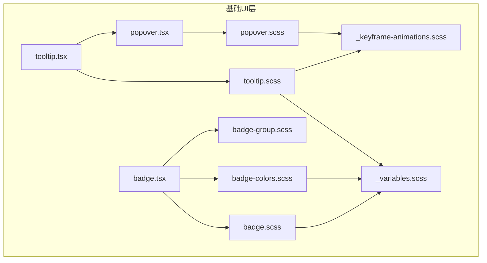
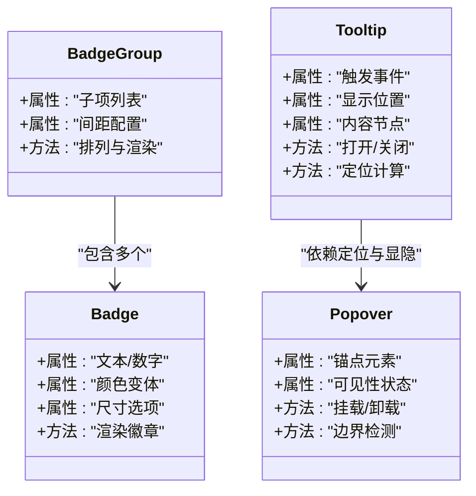
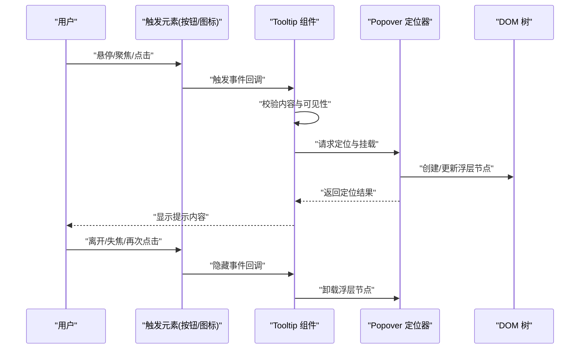
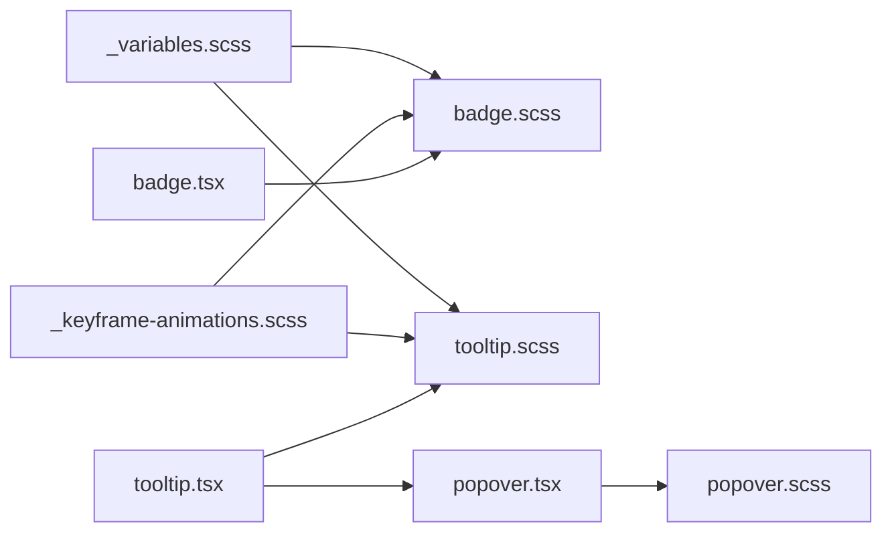

# 反馈组件

<cite>
**本文引用的文件**   
- [src/components/tiptap-ui-primitive/badge.tsx](file://src/components/tiptap-ui-primitive/badge.tsx)
- [src/components/tiptap-ui-primitive/badge-colors.scss](file://src/components/tiptap-ui-primitive/badge-colors.scss)
- [src/components/tiptap-ui-primitive/badge-group.scss](file://src/components/tiptap-ui-primitive/badge-group.scss)
- [src/components/tiptap-ui-primitive/badge.scss](file://src/components/tiptap-ui-primitive/badge.scss)
- [src/components/tiptap-ui-primitive/tooltip.tsx](file://src/components/tiptap-ui-primitive/tooltip.tsx)
- [src/components/tiptap-ui-primitive/tooltip.scss](file://src/components/tiptap-ui-primitive/tooltip.scss)
- [src/components/tiptap-ui-primitive/popover.tsx](file://src/components/tiptap-ui-primitive/popover.tsx)
- [src/components/tiptap-ui-primitive/popover.scss](file://src/components/tiptap-ui-primitive/popover.scss)
- [src/styles/_keyframe-animations.scss](file://src/styles/_keyframe-animations.scss)
- [src/styles/_variables.scss](file://src/styles/_variables.scss)
</cite>

## 目录
1. [简介](#简介)
2. [项目结构](#项目结构)
3. [核心组件](#核心组件)
4. [架构总览](#架构总览)
5. [详细组件分析](#详细组件分析)
6. [依赖关系分析](#依赖关系分析)
7. [性能考虑](#性能考虑)
8. [故障排查指南](#故障排查指南)
9. [结论](#结论)
10. [附录：使用场景与示例路径](#附录使用场景与示例路径)

## 简介
本章节面向 FishWorker 前端中的“反馈组件”集合，聚焦 Badge（徽章）、BadgeGroup（徽章组）与 Tooltip（工具提示）的实现细节、API 能力、样式变体、可访问性与动画表现。文档旨在帮助开发者快速理解并正确使用这些组件，覆盖状态标识、计数显示、帮助提示等典型使用场景，并提供最佳实践建议。

## 项目结构
反馈组件位于 tiptap-ui-primitive 基础 UI 层中，采用“逻辑组件 + 样式分离”的组织方式：
- 组件实现：badge.tsx、tooltip.tsx
- 组合容器：badge-group.scss（仅样式）
- 主题与颜色：badge-colors.scss、_variables.scss
- 定位与弹出：popover.tsx、popover.scss（Tooltip 的底层定位容器）
- 动效：_keyframe-animations.scss（淡入/缩放等通用动画）

图表来源
- [src/components/tiptap-ui-primitive/badge.tsx](file://src/components/tiptap-ui-primitive/badge.tsx)
- [src/components/tiptap-ui-primitive/badge.scss](file://src/components/tiptap-ui-primitive/badge.scss)
- [src/components/tiptap-ui-primitive/badge-colors.scss](file://src/components/tiptap-ui-primitive/badge-colors.scss)
- [src/components/tiptap-ui-primitive/badge-group.scss](file://src/components/tiptap-ui-primitive/badge-group.scss)
- [src/components/tiptap-ui-primitive/tooltip.tsx](file://src/components/tiptap-ui-primitive/tooltip.tsx)
- [src/components/tiptap-ui-primitive/tooltip.scss](file://src/components/tiptap-ui-primitive/tooltip.scss)
- [src/components/tiptap-ui-primitive/popover.tsx](file://src/components/tiptap-ui-primitive/popover.tsx)
- [src/components/tiptap-ui-primitive/popover.scss](file://src/components/tiptap-ui-primitive/popover.scss)
- [src/styles/_keyframe-animations.scss](file://src/styles/_keyframe-animations.scss)
- [src/styles/_variables.scss](file://src/styles/_variables.scss)

章节来源
- [src/components/tiptap-ui-primitive/badge.tsx](file://src/components/tiptap-ui-primitive/badge.tsx)
- [src/components/tiptap-ui-primitive/badge.scss](file://src/components/tiptap-ui-primitive/badge.scss)
- [src/components/tiptap-ui-primitive/badge-colors.scss](file://src/components/tiptap-ui-primitive/badge-colors.scss)
- [src/components/tiptap-ui-primitive/badge-group.scss](file://src/components/tiptap-ui-primitive/badge-group.scss)
- [src/components/tiptap-ui-primitive/tooltip.tsx](file://src/components/tiptap-ui-primitive/tooltip.tsx)
- [src/components/tiptap-ui-primitive/tooltip.scss](file://src/components/tiptap-ui-primitive/tooltip.scss)
- [src/components/tiptap-ui-primitive/popover.tsx](file://src/components/tiptap-ui-primitive/popover.tsx)
- [src/components/tiptap-ui-primitive/popover.scss](file://src/components/tiptap-ui-primitive/popover.scss)
- [src/styles/_keyframe-animations.scss](file://src/styles/_keyframe-animations.scss)
- [src/styles/_variables.scss](file://src/styles/_variables.scss)

## 核心组件
本节概述三个核心组件的职责与关键能力：
- Badge：用于展示状态、计数或简短标签；支持多种颜色变体与尺寸选项；可独立使用或置于按钮、图标等触发元素上。
- BadgeGroup：对多个 Badge 进行排列与间距控制，提供紧凑布局与统一视觉节奏。
- Tooltip：在用户交互时显示补充说明或帮助信息；支持多种触发方式与显示位置，内容可定制。

章节来源
- [src/components/tiptap-ui-primitive/badge.tsx](file://src/components/tiptap-ui-primitive/badge.tsx)
- [src/components/tiptap-ui-primitive/badge.scss](file://src/components/tiptap-ui-primitive/badge.scss)
- [src/components/tiptap-ui-primitive/badge-colors.scss](file://src/components/tiptap-ui-primitive/badge-colors.scss)
- [src/components/tiptap-ui-primitive/badge-group.scss](file://src/components/tiptap-ui-primitive/badge-group.scss)
- [src/components/tiptap-ui-primitive/tooltip.tsx](file://src/components/tiptap-ui-primitive/tooltip.tsx)
- [src/components/tiptap-ui-primitive/tooltip.scss](file://src/components/tiptap-ui-primitive/tooltip.scss)

## 架构总览
从代码层面看，Tooltip 基于 Popover 实现定位与显隐控制，Badge 通过 CSS 变量与颜色类实现主题化，BadgeGroup 通过布局样式管理间距与对齐。

图表来源
- [src/components/tiptap-ui-primitive/badge.tsx](file://src/components/tiptap-ui-primitive/badge.tsx)
- [src/components/tiptap-ui-primitive/tooltip.tsx](file://src/components/tiptap-ui-primitive/tooltip.tsx)
- [src/components/tiptap-ui-primitive/popover.tsx](file://src/components/tiptap-ui-primitive/popover.tsx)

## 详细组件分析

### Badge（徽章）
- 功能要点
  - 颜色变体：通过 badge-colors.scss 定义多套语义色（如成功、警告、错误、中性等），配合 CSS 变量实现主题切换。
  - 尺寸选项：通过 badge.scss 的尺寸类控制内边距、字号与圆角，适配不同上下文（如导航栏、卡片、表格行）。
  - 位置定位：作为内联或绝对定位元素，可与父容器对齐；结合 BadgeGroup 可实现紧凑排列。
  - 可访问性：为屏幕阅读器提供语义化标签与必要 aria 属性（如 role、aria-label），确保键盘可达与焦点顺序合理。
  - 动画效果：可复用 _keyframe-animations.scss 中的淡入/缩放动画，提升微交互体验。

- 使用建议
  - 状态标识：用高对比度颜色表达明确语义（如红色表示错误、绿色表示成功）。
  - 计数显示：当数值较大时，限制最大宽度或使用省略策略，避免破坏布局。
  - 组合使用：与按钮、图标、链接等触发元素搭配，保持视觉层级一致。

- 示例路径（不含具体代码）
  - 状态标识：[src/components/tiptap-ui-primitive/badge.tsx](file://src/components/tiptap-ui-primitive/badge.tsx)
  - 计数显示：[src/components/tiptap-ui-primitive/badge.tsx](file://src/components/tiptap-ui-primitive/badge.tsx)
  - 颜色与尺寸：[src/components/tiptap-ui-primitive/badge-colors.scss](file://src/components/tiptap-ui-primitive/badge-colors.scss)、[src/components/tiptap-ui-primitive/badge.scss](file://src/components/tiptap-ui-primitive/badge.scss)

章节来源
- [src/components/tiptap-ui-primitive/badge.tsx](file://src/components/tiptap-ui-primitive/badge.tsx)
- [src/components/tiptap-ui-primitive/badge.scss](file://src/components/tiptap-ui-primitive/badge.scss)
- [src/components/tiptap-ui-primitive/badge-colors.scss](file://src/components/tiptap-ui-primitive/badge-colors.scss)
- [src/styles/_keyframe-animations.scss](file://src/styles/_keyframe-animations.scss)

### BadgeGroup（徽章组）
- 功能要点
  - 排列方式：通过 badge-group.scss 提供的布局样式，将多个 Badge 以水平或垂直方向排列。
  - 间距控制：支持统一的间距变量，便于在不同密度下保持一致的视觉节奏。
  - 响应式：结合断点与 flex 布局，在小屏设备上自动换行或压缩间距。
  - 可访问性：为分组容器设置合适的 role 与 aria-* 属性，辅助技术可正确朗读分组内的徽章数量与状态。

- 使用建议
  - 控制数量：过多徽章会影响可读性，必要时分页或折叠。
  - 一致性：在同一界面内保持相同的间距与对齐方式，减少认知负担。

- 示例路径（不含具体代码）
  - 排列与间距：[src/components/tiptap-ui-primitive/badge-group.scss](file://src/components/tiptap-ui-primitive/badge-group.scss)

章节来源
- [src/components/tiptap-ui-primitive/badge-group.scss](file://src/components/tiptap-ui-primitive/badge-group.scss)

### Tooltip（工具提示）
- 功能要点
  - 触发方式：支持 hover、focus、click 等多种触发事件，适配不同交互习惯与设备类型。
  - 显示位置：支持上下左右及自适应位置，避免溢出视口；内部借助 Popover 的定位算法进行边界检测与修正。
  - 内容定制：支持纯文本、富文本或自定义节点，满足复杂帮助信息的展示需求。
  - 可访问性：遵循 WAI-ARIA 规范，提供 aria-describedby、role="tooltip" 等属性，确保键盘导航与屏幕阅读器可用。
  - 动画效果：通过 _keyframe-animations.scss 的过渡动画，使出现/消失更自然。

- 使用建议
  - 触发时机：仅在需要解释或补充信息时使用，避免过度提示造成干扰。
  - 内容长度：保持简洁明了，必要时提供“了解更多”链接跳转至详细说明。
  - 位置选择：优先靠近触发元素，避免遮挡重要内容。

- 调用流程（序列图）

图表来源
- [src/components/tiptap-ui-primitive/tooltip.tsx](file://src/components/tiptap-ui-primitive/tooltip.tsx)
- [src/components/tiptap-ui-primitive/popover.tsx](file://src/components/tiptap-ui-primitive/popover.tsx)

章节来源
- [src/components/tiptap-ui-primitive/tooltip.tsx](file://src/components/tiptap-ui-primitive/tooltip.tsx)
- [src/components/tiptap-ui-primitive/tooltip.scss](file://src/components/tiptap-ui-primitive/tooltip.scss)
- [src/components/tiptap-ui-primitive/popover.tsx](file://src/components/tiptap-ui-primitive/popover.tsx)
- [src/components/tiptap-ui-primitive/popover.scss](file://src/components/tiptap-ui-primitive/popover.scss)
- [src/styles/_keyframe-animations.scss](file://src/styles/_keyframe-animations.scss)

## 依赖关系分析
- 组件耦合
  - Tooltip 强依赖 Popover 完成定位与显隐控制，二者形成稳定的协作关系。
  - Badge 与 BadgeGroup 松耦合，BadgeGroup 仅通过样式组织 Badge 的布局。
- 外部依赖
  - 样式变量来自 _variables.scss，保证全局主题一致性。
  - 动画来自 _keyframe-animations.scss，统一动效风格。
- 潜在风险
  - 若 Popover 定位算法变更，需同步验证 Tooltip 的位置与边界处理。
  - 颜色与尺寸变量调整时，需回归测试所有 Badge 的使用场景。

图表来源
- [src/styles/_variables.scss](file://src/styles/_variables.scss)
- [src/styles/_keyframe-animations.scss](file://src/styles/_keyframe-animations.scss)
- [src/components/tiptap-ui-primitive/badge.tsx](file://src/components/tiptap-ui-primitive/badge.tsx)
- [src/components/tiptap-ui-primitive/badge.scss](file://src/components/tiptap-ui-primitive/badge.scss)
- [src/components/tiptap-ui-primitive/tooltip.tsx](file://src/components/tiptap-ui-primitive/tooltip.tsx)
- [src/components/tiptap-ui-primitive/tooltip.scss](file://src/components/tiptap-ui-primitive/tooltip.scss)
- [src/components/tiptap-ui-primitive/popover.tsx](file://src/components/tiptap-ui-primitive/popover.tsx)
- [src/components/tiptap-ui-primitive/popover.scss](file://src/components/tiptap-ui-primitive/popover.scss)

章节来源
- [src/styles/_variables.scss](file://src/styles/_variables.scss)
- [src/styles/_keyframe-animations.scss](file://src/styles/_keyframe-animations.scss)
- [src/components/tiptap-ui-primitive/badge.tsx](file://src/components/tiptap-ui-primitive/badge.tsx)
- [src/components/tiptap-ui-primitive/badge.scss](file://src/components/tiptap-ui-primitive/badge.scss)
- [src/components/tiptap-ui-primitive/tooltip.tsx](file://src/components/tiptap-ui-primitive/tooltip.tsx)
- [src/components/tiptap-ui-primitive/tooltip.scss](file://src/components/tiptap-ui-primitive/tooltip.scss)
- [src/components/tiptap-ui-primitive/popover.tsx](file://src/components/tiptap-ui-primitive/popover.tsx)
- [src/components/tiptap-ui-primitive/popover.scss](file://src/components/tiptap-ui-primitive/popover.scss)

## 性能考虑
- 渲染开销
  - Tooltip 频繁触发时应避免重复创建浮层节点，尽量复用 Popover 实例并进行最小化更新。
  - Badge 数量较多时，注意批量渲染的性能，必要时使用虚拟滚动或分页。
- 样式与主题
  - 颜色与尺寸变量集中管理，减少运行时计算，提高样式解析效率。
- 动画与过渡
  - 使用 GPU 加速的 transform/opacity 动画，避免重排与重绘。

## 故障排查指南
- Tooltip 不显示或位置异常
  - 检查触发事件是否正确绑定，确认 Popover 是否成功挂载到 DOM。
  - 查看边界检测逻辑，确保浮层未超出视口或被其他元素遮挡。
- Badge 颜色或尺寸不符合预期
  - 核对使用的颜色类名与尺寸类名是否与主题变量一致。
  - 确认父级样式是否覆盖了默认样式（如 font-size、line-height）。
- 可访问性问题
  - 验证 aria-* 属性是否存在且语义正确，确保键盘可达与焦点顺序合理。
  - 使用屏幕阅读器测试 Tooltip 的内容朗读与 Badge 的状态播报。

章节来源
- [src/components/tiptap-ui-primitive/tooltip.tsx](file://src/components/tiptap-ui-primitive/tooltip.tsx)
- [src/components/tiptap-ui-primitive/popover.tsx](file://src/components/tiptap-ui-primitive/popover.tsx)
- [src/components/tiptap-ui-primitive/badge.tsx](file://src/components/tiptap-ui-primitive/badge.tsx)

## 结论
Badge、BadgeGroup 与 Tooltip 构成了 FishWorker 中关键的反馈体系。通过清晰的颜色与尺寸系统、灵活的布局与定位机制、完善的可访问性与动画效果，它们能够高效地传达状态、计数与帮助信息。建议在项目中统一使用这些组件，遵循本文的最佳实践，以获得一致的用户体验与良好的维护性。

## 附录：使用场景与示例路径
- 状态标识
  - 参考实现：[src/components/tiptap-ui-primitive/badge.tsx](file://src/components/tiptap-ui-primitive/badge.tsx)
  - 样式与颜色：[src/components/tiptap-ui-primitive/badge-colors.scss](file://src/components/tiptap-ui-primitive/badge-colors.scss)
- 计数显示
  - 参考实现：[src/components/tiptap-ui-primitive/badge.tsx](file://src/components/tiptap-ui-primitive/badge.tsx)
  - 布局与间距：[src/components/tiptap-ui-primitive/badge-group.scss](file://src/components/tiptap-ui-primitive/badge-group.scss)
- 帮助提示
  - 参考实现：[src/components/tiptap-ui-primitive/tooltip.tsx](file://src/components/tiptap-ui-primitive/tooltip.tsx)
  - 定位与显隐：[src/components/tiptap-ui-primitive/popover.tsx](file://src/components/tiptap-ui-primitive/popover.tsx)
  - 动画与样式：[src/components/tiptap-ui-primitive/tooltip.scss](file://src/components/tiptap-ui-primitive/tooltip.scss)、[src/styles/_keyframe-animations.scss](file://src/styles/_keyframe-animations.scss)