# 基础组件

<cite>
**本文引用的文件**   
- [src/components/tiptap-ui-primitive/button.tsx](file://src/components/tiptap-ui-primitive/button.tsx)
- [src/components/tiptap-ui-primitive/button.scss](file://src/components/tiptap-ui-primitive/button.scss)
- [src/components/tiptap-ui-primitive/button-colors.scss](file://src/components/tiptap-ui-primitive/button-colors.scss)
- [src/components/tiptap-ui-primitive/button-group.tsx](file://src/components/tiptap-ui-primitive/button-group.tsx)
- [src/components/tiptap-ui-primitive/button-group.scss](file://src/components/tiptap-ui-primitive/button-group.scss)
- [src/components/tiptap-ui-primitive/card.tsx](file://src/components/tiptap-ui-primitive/card.tsx)
- [src/components/tiptap-ui-primitive/card.scss](file://src/components/tiptap-ui-primitive/card.scss)
- [src/components/tiptap-ui-primitive/input.tsx](file://src/components/tiptap-ui-primitive/input.tsx)
- [src/components/tiptap-ui-primitive/input.scss](file://src/components/tiptap-ui-primitive/input.scss)
- [src/components/tiptap-ui-primitive/dropdown-menu.tsx](file://src/components/tiptap-ui-primitive/dropdown-menu.tsx)
- [src/components/tiptap-ui-primitive/dropdown-menu.scss](file://src/components/tiptap-ui-primitive/dropdown-menu.scss)
- [src/components/tiptap-ui-primitive/badge.tsx](file://src/components/tiptap-ui-primitive/badge.tsx)
- [src/components/tiptap-ui-primitive/badge.scss](file://src/components/tiptap-ui-primitive/badge.scss)
- [src/components/tiptap-ui-primitive/badge-colors.scss](file://src/components/tiptap-ui-primitive/badge-colors.scss)
- [src/components/tiptap-ui-primitive/popover.tsx](file://src/components/tiptap-ui-primitive/popover.tsx)
- [src/components/tiptap-ui-primitive/popover.scss](file://src/components/tiptap-ui-primitive/popover.scss)
- [src/components/tiptap-ui-primitive/tooltip.tsx](file://src/components/tiptap-ui-primitive/tooltip.tsx)
- [src/components/tiptap-ui-primitive/tooltip.scss](file://src/components/tiptap-ui-primitive/tooltip.scss)
- [src/components/tiptap-ui-primitive/separator.tsx](file://src/components/tiptap-ui-primitive/separator.tsx)
- [src/components/tiptap-ui-primitive/separator.scss](file://src/components/tiptap-ui-primitive/separator.scss)
- [src/components/tiptap-ui-primitive/spacer.tsx](file://src/components/tiptap-ui-primitive/spacer.tsx)
- [src/components/tiptap-ui-primitive/toolbar.tsx](file://src/components/tiptap-ui-primitive/toolbar.tsx)
- [src/components/tiptap-ui-primitive/toolbar.scss](file://src/components/tiptap-ui-primitive/toolbar.scss)
- [src/components/tiptap-ui-primitive/index.tsx](file://src/components/tiptap-ui-primitive/index.tsx)
- [src/styles/_variables.scss](file://src/styles/_variables.scss)
</cite>

## 目录
1. [简介](#简介)
2. [项目结构](#项目结构)
3. [核心组件](#核心组件)
4. [架构总览](#架构总览)
5. [详细组件分析](#详细组件分析)
6. [依赖关系分析](#依赖关系分析)
7. [性能考量](#性能考量)
8. [故障排查指南](#故障排查指南)
9. [结论](#结论)
10. [附录](#附录)

## 简介
本章节面向 FishWorker 的基础 UI 组件库，聚焦于按钮、卡片、输入框、下拉菜单、徽章、弹出层、工具提示、分隔符等原子级组件。文档将系统阐述各组件的用途、属性与事件、样式定制与主题支持、可访问性特性、响应式设计与跨浏览器兼容性，并提供组合使用最佳实践与性能优化建议，帮助开发者快速上手并稳定扩展。

## 项目结构
基础组件位于 tiptap-ui-primitive 目录中，采用“组件 + 样式”的一体化组织方式，并通过统一入口导出，便于上层功能模块按需引入。

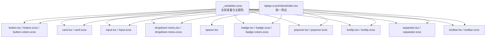

图表来源
- [src/components/tiptap-ui-primitive/index.tsx](file://src/components/tiptap-ui-primitive/index.tsx)
- [src/components/tiptap-ui-primitive/button.tsx](file://src/components/tiptap-ui-primitive/button.tsx)
- [src/components/tiptap-ui-primitive/button.scss](file://src/components/tiptap-ui-primitive/button.scss)
- [src/components/tiptap-ui-primitive/button-colors.scss](file://src/components/tiptap-ui-primitive/button-colors.scss)
- [src/components/tiptap-ui-primitive/card.tsx](file://src/components/tiptap-ui-primitive/card.tsx)
- [src/components/tiptap-ui-primitive/card.scss](file://src/components/tiptap-ui-primitive/card.scss)
- [src/components/tiptap-ui-primitive/input.tsx](file://src/components/tiptap-ui-primitive/input.tsx)
- [src/components/tiptap-ui-primitive/input.scss](file://src/components/tiptap-ui-primitive/input.scss)
- [src/components/tiptap-ui-primitive/dropdown-menu.tsx](file://src/components/tiptap-ui-primitive/dropdown-menu.tsx)
- [src/components/tiptap-ui-primitive/dropdown-menu.scss](file://src/components/tiptap-ui-primitive/dropdown-menu.scss)
- [src/components/tiptap-ui-primitive/badge.tsx](file://src/components/tiptap-ui-primitive/badge.tsx)
- [src/components/tiptap-ui-primitive/badge.scss](file://src/components/tiptap-ui-primitive/badge.scss)
- [src/components/tiptap-ui-primitive/badge-colors.scss](file://src/components/tiptap-ui-primitive/badge-colors.scss)
- [src/components/tiptap-ui-primitive/popover.tsx](file://src/components/tiptap-ui-primitive/popover.tsx)
- [src/components/tiptap-ui-primitive/popover.scss](file://src/components/tiptap-ui-primitive/popover.scss)
- [src/components/tiptap-ui-primitive/tooltip.tsx](file://src/components/tiptap-ui-primitive/tooltip.tsx)
- [src/components/tiptap-ui-primitive/tooltip.scss](file://src/components/tiptap-ui-primitive/tooltip.scss)
- [src/components/tiptap-ui-primitive/separator.tsx](file://src/components/tiptap-ui-primitive/separator.tsx)
- [src/components/tiptap-ui-primitive/separator.scss](file://src/components/tiptap-ui-primitive/separator.scss)
- [src/components/tiptap-ui-primitive/spacer.tsx](file://src/components/tiptap-ui-primitive/spacer.tsx)
- [src/components/tiptap-ui-primitive/toolbar.tsx](file://src/components/tiptap-ui-primitive/toolbar.tsx)
- [src/components/tiptap-ui-primitive/toolbar.scss](file://src/components/tiptap-ui-primitive/toolbar.scss)
- [src/styles/_variables.scss](file://src/styles/_variables.scss)

章节来源
- [src/components/tiptap-ui-primitive/index.tsx](file://src/components/tiptap-ui-primitive/index.tsx)
- [src/styles/_variables.scss](file://src/styles/_variables.scss)

## 核心组件
本节概述各基础组件的职责与典型用法要点：
- 按钮 Button：提供多种变体（主操作、次要、危险、幽灵等）、尺寸、禁用态、加载态；支持图标与分组。
- 卡片 Card：用于内容区块化展示，支持圆角、阴影、内边距与背景色。
- 输入框 Input：文本输入、占位符、前缀/后缀、只读/禁用、验证状态（成功/警告/错误）。
- 下拉菜单 DropdownMenu：触发器 + 菜单项集合，支持键盘导航与焦点管理。
- 徽章 Badge：标签、计数、状态指示，支持颜色变体。
- 弹出层 Popover：轻量浮层容器，常用于复杂交互或表单辅助信息。
- 工具提示 Tooltip：简短说明文字，跟随目标元素定位。
- 分隔符 Separator：水平或垂直分割线，用于视觉分组。
- 间距 Spacer：可控间距元素，简化布局排版。
- 工具栏 Toolbar：横向排列的工具按钮容器，常与编辑器集成。

章节来源
- [src/components/tiptap-ui-primitive/button.tsx](file://src/components/tiptap-ui-primitive/button.tsx)
- [src/components/tiptap-ui-primitive/button.scss](file://src/components/tiptap-ui-primitive/button.scss)
- [src/components/tiptap-ui-primitive/button-colors.scss](file://src/components/tiptap-ui-primitive/button-colors.scss)
- [src/components/tiptap-ui-primitive/button-group.tsx](file://src/components/tiptap-ui-primitive/button-group.tsx)
- [src/components/tiptap-ui-primitive/button-group.scss](file://src/components/tiptap-ui-primitive/button-group.scss)
- [src/components/tiptap-ui-primitive/card.tsx](file://src/components/tiptap-ui-primitive/card.tsx)
- [src/components/tiptap-ui-primitive/card.scss](file://src/components/tiptap-ui-primitive/card.scss)
- [src/components/tiptap-ui-primitive/input.tsx](file://src/components/tiptap-ui-primitive/input.tsx)
- [src/components/tiptap-ui-primitive/input.scss](file://src/components/tiptap-ui-primitive/input.scss)
- [src/components/tiptap-ui-primitive/dropdown-menu.tsx](file://src/components/tiptap-ui-primitive/dropdown-menu.tsx)
- [src/components/tiptap-ui-primitive/dropdown-menu.scss](file://src/components/tiptap-ui-primitive/dropdown-menu.scss)
- [src/components/tiptap-ui-primitive/badge.tsx](file://src/components/tiptap-ui-primitive/badge.tsx)
- [src/components/tiptap-ui-primitive/badge.scss](file://src/components/tiptap-ui-primitive/badge.scss)
- [src/components/tiptap-ui-primitive/badge-colors.scss](file://src/components/tiptap-ui-primitive/badge-colors.scss)
- [src/components/tiptap-ui-primitive/popover.tsx](file://src/components/tiptap-ui-primitive/popover.tsx)
- [src/components/tiptap-ui-primitive/popover.scss](file://src/components/tiptap-ui-primitive/popover.scss)
- [src/components/tiptap-ui-primitive/tooltip.tsx](file://src/components/tiptap-ui-primitive/tooltip.tsx)
- [src/components/tiptap-ui-primitive/tooltip.scss](file://src/components/tiptap-ui-primitive/tooltip.scss)
- [src/components/tiptap-ui-primitive/separator.tsx](file://src/components/tiptap-ui-primitive/separator.tsx)
- [src/components/tiptap-ui-primitive/separator.scss](file://src/components/tiptap-ui-primitive/separator.scss)
- [src/components/tiptap-ui-primitive/spacer.tsx](file://src/components/tiptap-ui-primitive/spacer.tsx)
- [src/components/tiptap-ui-primitive/toolbar.tsx](file://src/components/tiptap-ui-primitive/toolbar.tsx)
- [src/components/tiptap-ui-primitive/toolbar.scss](file://src/components/tiptap-ui-primitive/toolbar.scss)

## 架构总览
基础组件遵循“最小可用单元”的设计原则，通过统一的样式变量与命名空间实现主题一致性。组件之间保持松耦合，复杂交互由上层组合完成。

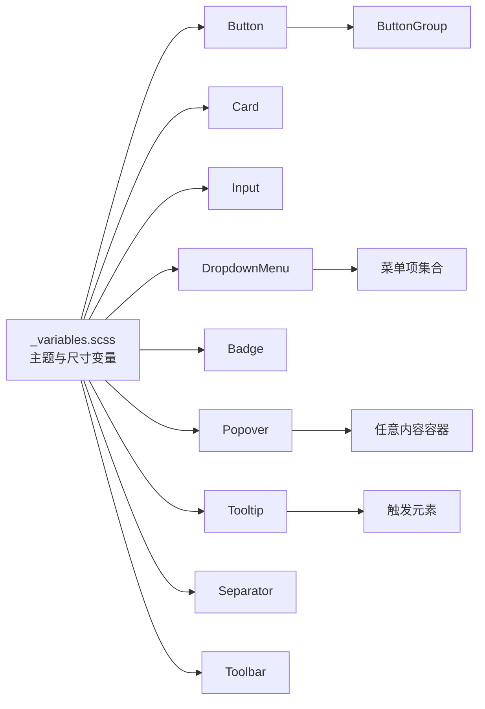

图表来源
- [src/styles/_variables.scss](file://src/styles/_variables.scss)
- [src/components/tiptap-ui-primitive/button.tsx](file://src/components/tiptap-ui-primitive/button.tsx)
- [src/components/tiptap-ui-primitive/button-group.tsx](file://src/components/tiptap-ui-primitive/button-group.tsx)
- [src/components/tiptap-ui-primitive/card.tsx](file://src/components/tiptap-ui-primitive/card.tsx)
- [src/components/tiptap-ui-primitive/input.tsx](file://src/components/tiptap-ui-primitive/input.tsx)
- [src/components/tiptap-ui-primitive/dropdown-menu.tsx](file://src/components/tiptap-ui-primitive/dropdown-menu.tsx)
- [src/components/tiptap-ui-primitive/badge.tsx](file://src/components/tiptap-ui-primitive/badge.tsx)
- [src/components/tiptap-ui-primitive/popover.tsx](file://src/components/tiptap-ui-primitive/popover.tsx)
- [src/components/tiptap-ui-primitive/tooltip.tsx](file://src/components/tiptap-ui-primitive/tooltip.tsx)
- [src/components/tiptap-ui-primitive/separator.tsx](file://src/components/tiptap-ui-primitive/separator.tsx)
- [src/components/tiptap-ui-primitive/toolbar.tsx](file://src/components/tiptap-ui-primitive/toolbar.tsx)

## 详细组件分析

### 按钮 Button
- 职责与变体
  - 提供主操作、次要、危险、幽灵等语义化变体，适配不同业务场景。
  - 支持尺寸（如默认/小/大）、禁用态、加载态、图标位置与对齐。
- Props 与事件
  - 常见属性包括：类型/变体、尺寸、是否禁用、是否加载、点击回调、ARIA 描述、数据标识等。
  - 事件：onClick、onKeyDown（配合键盘导航）、onFocus/onBlur（无障碍与样式反馈）。
- 样式与主题
  - 通过颜色变量与尺寸变量控制外观；支持 hover/focus/active/disabled 状态样式。
  - 与 ButtonGroup 组合时，边框合并与间距由组样式接管。
- 可访问性
  - 正确设置 role、aria-label、aria-disabled、tabIndex 等，确保屏幕阅读器友好。
- 示例场景
  - 主按钮提交表单、危险按钮删除数据、带图标的快捷操作、禁用态防止重复提交。

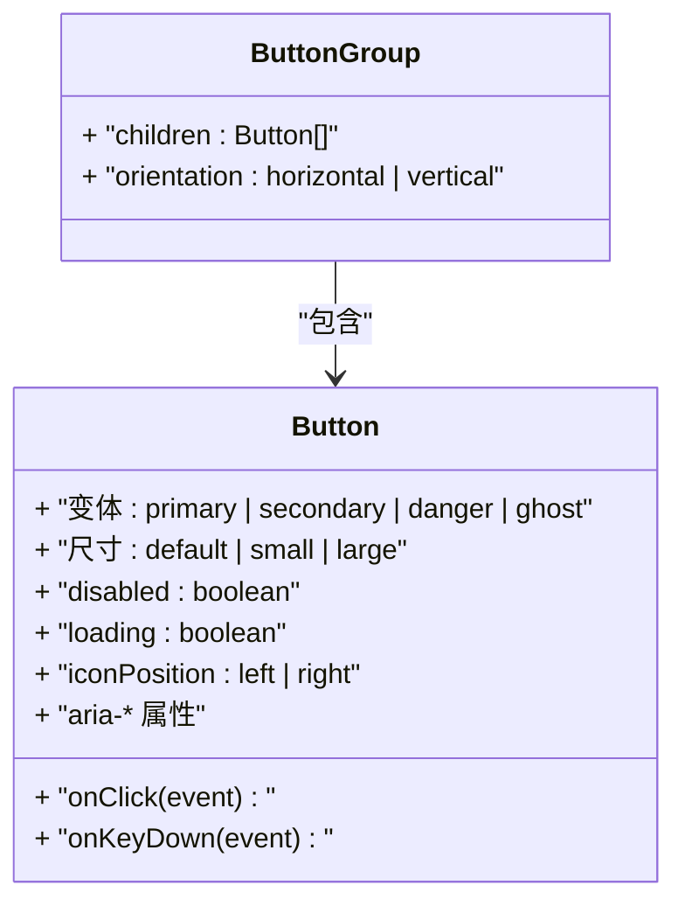

图表来源
- [src/components/tiptap-ui-primitive/button.tsx](file://src/components/tiptap-ui-primitive/button.tsx)
- [src/components/tiptap-ui-primitive/button.scss](file://src/components/tiptap-ui-primitive/button.scss)
- [src/components/tiptap-ui-primitive/button-colors.scss](file://src/components/tiptap-ui-primitive/button-colors.scss)
- [src/components/tiptap-ui-primitive/button-group.tsx](file://src/components/tiptap-ui-primitive/button-group.tsx)
- [src/components/tiptap-ui-primitive/button-group.scss](file://src/components/tiptap-ui-primitive/button-group.scss)

章节来源
- [src/components/tiptap-ui-primitive/button.tsx](file://src/components/tiptap-ui-primitive/button.tsx)
- [src/components/tiptap-ui-primitive/button.scss](file://src/components/tiptap-ui-primitive/button.scss)
- [src/components/tiptap-ui-primitive/button-colors.scss](file://src/components/tiptap-ui-primitive/button-colors.scss)
- [src/components/tiptap-ui-primitive/button-group.tsx](file://src/components/tiptap-ui-primitive/button-group.tsx)
- [src/components/tiptap-ui-primitive/button-group.scss](file://src/components/tiptap-ui-primitive/button-group.scss)

### 卡片 Card
- 职责与布局
  - 作为内容容器，提供圆角、阴影、内边距、背景色等视觉层次。
  - 适合列表项、详情面板、统计卡片等场景。
- Props 与事件
  - 常见属性包括：padding、radius、shadow、background、hover 效果开关等。
  - 事件：通常不直接处理业务事件，更多承载子组件交互。
- 样式与主题
  - 基于变量控制阴影强度、圆角半径、背景色与边框色。
- 可访问性
  - 当卡片作为交互区域时，需设置 role="article" 或适当的语义标签，并为可聚焦子元素提供正确的 tab 顺序。
- 示例场景
  - 任务卡片、用户信息卡片、统计概览卡片。

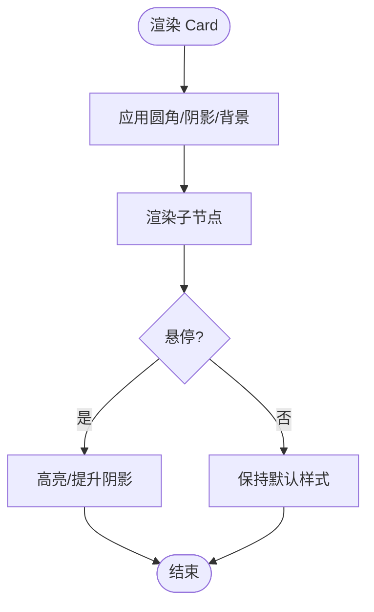

图表来源
- [src/components/tiptap-ui-primitive/card.tsx](file://src/components/tiptap-ui-primitive/card.tsx)
- [src/components/tiptap-ui-primitive/card.scss](file://src/components/tiptap-ui-primitive/card.scss)

章节来源
- [src/components/tiptap-ui-primitive/card.tsx](file://src/components/tiptap-ui-primitive/card.tsx)
- [src/components/tiptap-ui-primitive/card.scss](file://src/components/tiptap-ui-primitive/card.scss)

### 输入框 Input
- 职责与状态
  - 文本输入、占位符、前缀/后缀、只读/禁用、验证状态（成功/警告/错误）。
- Props 与事件
  - 常见属性包括：value、placeholder、prefix/suffix、readOnly、disabled、status、onChange、onFocus、onBlur、aria-invalid、aria-describedby 等。
  - 事件：输入变更、焦点切换、键盘回车/取消等。
- 样式与主题
  - 根据 status 切换边框颜色与图标；focus 状态提供可见焦点环；disabled 降低对比度。
- 可访问性
  - 为错误状态提供 aria-invalid 与 aria-describedby 指向提示信息；为前/后缀提供 aria-hidden 避免朗读干扰。
- 示例场景
  - 搜索框、表单字段、带清除按钮的输入、校验失败的必填项。

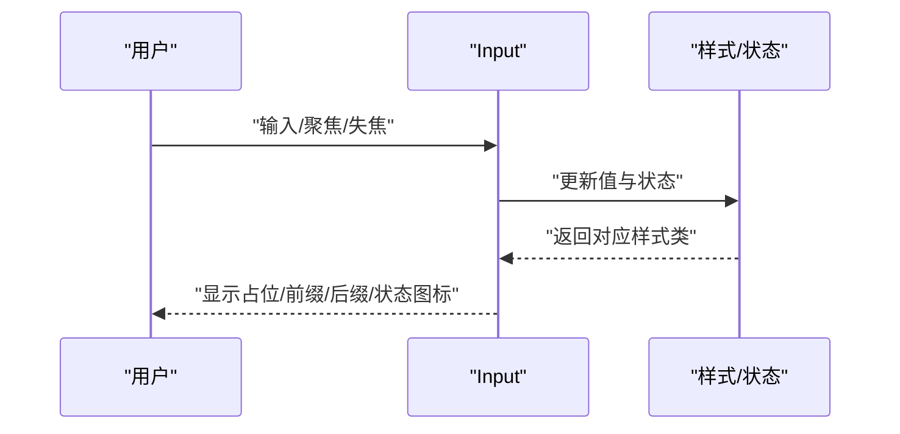

图表来源
- [src/components/tiptap-ui-primitive/input.tsx](file://src/components/tiptap-ui-primitive/input.tsx)
- [src/components/tiptap-ui-primitive/input.scss](file://src/components/tiptap-ui-primitive/input.scss)

章节来源
- [src/components/tiptap-ui-primitive/input.tsx](file://src/components/tiptap-ui-primitive/input.tsx)
- [src/components/tiptap-ui-primitive/input.scss](file://src/components/tiptap-ui-primitive/input.scss)

### 下拉菜单 DropdownMenu
- 职责与交互
  - 由触发器与菜单项集合组成，支持打开/关闭、键盘导航、焦点管理。
- Props 与事件
  - 常见属性包括：open、trigger、items、onOpenChange、onSelect、align、side、offset 等。
  - 事件：打开/关闭、选择项、键盘上下键移动、回车确认、Esc 关闭。
- 样式与主题
  - 菜单容器、选中态、禁用项、分隔线等样式；支持定位偏移与对齐策略。
- 可访问性
  - 使用 menu/menuitem 角色，维护 focus-trap，确保键盘可达性与屏幕阅读器可读。
- 示例场景
  - 工具栏操作、批量操作菜单、排序/筛选选项。

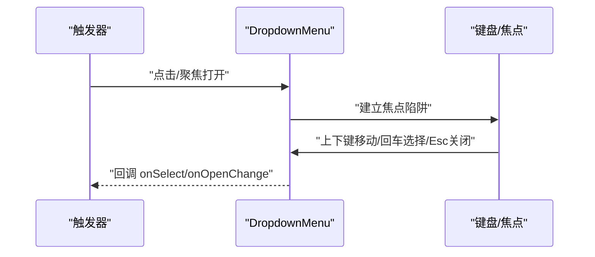

图表来源
- [src/components/tiptap-ui-primitive/dropdown-menu.tsx](file://src/components/tiptap-ui-primitive/dropdown-menu.tsx)
- [src/components/tiptap-ui-primitive/dropdown-menu.scss](file://src/components/tiptap-ui-primitive/dropdown-menu.scss)

章节来源
- [src/components/tiptap-ui-primitive/dropdown-menu.tsx](file://src/components/tiptap-ui-primitive/dropdown-menu.tsx)
- [src/components/tiptap-ui-primitive/dropdown-menu.scss](file://src/components/tiptap-ui-primitive/dropdown-menu.scss)

### 徽章 Badge
- 职责与变体
  - 用于标签、计数、状态指示；支持颜色变体（成功、警告、错误、中性等）。
- Props 与事件
  - 常见属性包括：color、size、dot、count、aria-label 等。
  - 事件：通常无交互事件，仅展示信息。
- 样式与主题
  - 通过颜色变量映射不同语义；点状模式与数字模式切换。
- 可访问性
  - 为计数提供 aria-live 或 aria-label 明确数量；装饰性点可使用 aria-hidden。
- 示例场景
  - 未读消息数、任务优先级、状态标签。

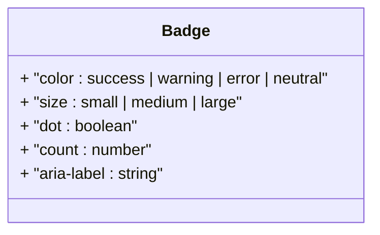

图表来源
- [src/components/tiptap-ui-primitive/badge.tsx](file://src/components/tiptap-ui-primitive/badge.tsx)
- [src/components/tiptap-ui-primitive/badge.scss](file://src/components/tiptap-ui-primitive/badge.scss)
- [src/components/tiptap-ui-primitive/badge-colors.scss](file://src/components/tiptap-ui-primitive/badge-colors.scss)

章节来源
- [src/components/tiptap-ui-primitive/badge.tsx](file://src/components/tiptap-ui-primitive/badge.tsx)
- [src/components/tiptap-ui-primitive/badge.scss](file://src/components/tiptap-ui-primitive/badge.scss)
- [src/components/tiptap-ui-primitive/badge-colors.scss](file://src/components/tiptap-ui-primitive/badge-colors.scss)

### 弹出层 Popover
- 职责与定位
  - 轻量浮层容器，常用于复杂交互或表单辅助信息；支持多向定位与偏移。
- Props 与事件
  - 常见属性包括：open、trigger、content、align、side、offset、onOpenChange 等。
  - 事件：打开/关闭、外部点击关闭、Esc 关闭。
- 样式与主题
  - 容器阴影、圆角、内边距；遮罩可选；滚动穿透控制。
- 可访问性
  - 使用 dialog 或 tooltip 角色；管理焦点与返回焦点到触发器；为内容提供 aria-labelledby。
- 示例场景
  - 高级设置面板、富文本链接编辑、复杂筛选条件。

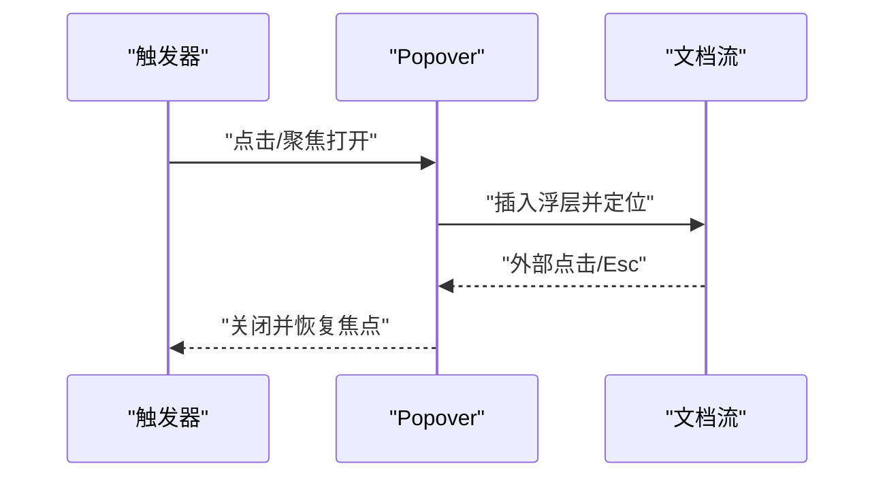

图表来源
- [src/components/tiptap-ui-primitive/popover.tsx](file://src/components/tiptap-ui-primitive/popover.tsx)
- [src/components/tiptap-ui-primitive/popover.scss](file://src/components/tiptap-ui-primitive/popover.scss)

章节来源
- [src/components/tiptap-ui-primitive/popover.tsx](file://src/components/tiptap-ui-primitive/popover.tsx)
- [src/components/tiptap-ui-primitive/popover.scss](file://src/components/tiptap-ui-primitive/popover.scss)

### 工具提示 Tooltip
- 职责与行为
  - 简短说明文字，跟随目标元素定位；延迟显示与隐藏，减少干扰。
- Props 与事件
  - 常见属性包括：text、showDelay、hideDelay、align、side、offset、interactive 等。
  - 事件：mouseenter/mouseleave、focus/blur、键盘 Enter/Space 触发。
- 样式与主题
  - 背景色、文字色、箭头方向、阴影与圆角；深色/浅色主题适配。
- 可访问性
  - 使用 tooltip 角色；为触发器设置 aria-describedby 指向提示内容。
- 示例场景
  - 图标说明、字段帮助、操作提示。

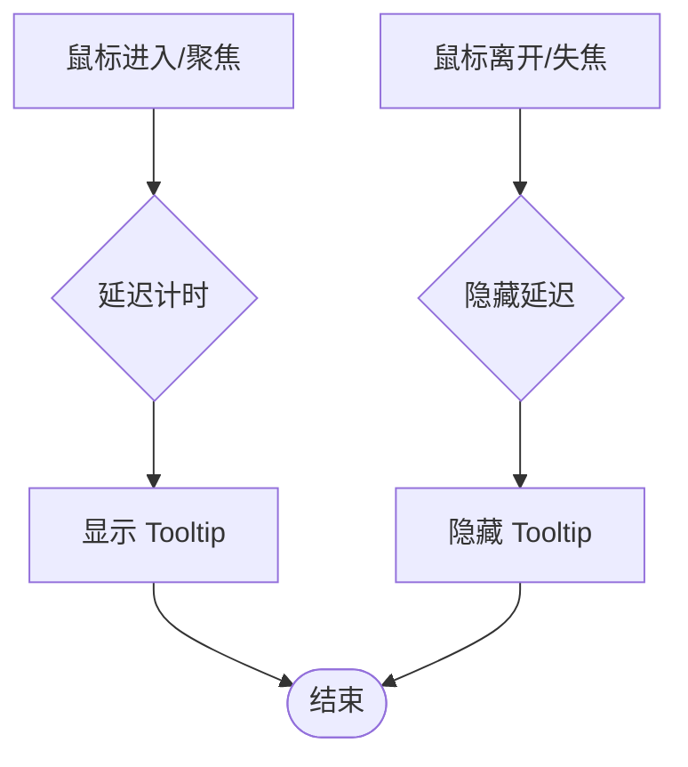

图表来源
- [src/components/tiptap-ui-primitive/tooltip.tsx](file://src/components/tiptap-ui-primitive/tooltip.tsx)
- [src/components/tiptap-ui-primitive/tooltip.scss](file://src/components/tiptap-ui-primitive/tooltip.scss)

章节来源
- [src/components/tiptap-ui-primitive/tooltip.tsx](file://src/components/tiptap-ui-primitive/tooltip.tsx)
- [src/components/tiptap-ui-primitive/tooltip.scss](file://src/components/tiptap-ui-primitive/tooltip.scss)

### 分隔符 Separator
- 职责与方向
  - 水平或垂直分割线，用于视觉分组与信息层级划分。
- Props 与事件
  - 常见属性包括：orientation（horizontal/vertical）、size、color 等。
  - 事件：一般无交互事件。
- 样式与主题
  - 基于变量控制线条粗细、颜色与长度；在工具栏中常用。
- 可访问性
  - 作为装饰性元素时使用 aria-hidden；若承载语义信息，需提供相应角色与描述。
- 示例场景
  - 工具栏分隔、表单分区、列表项间隔。

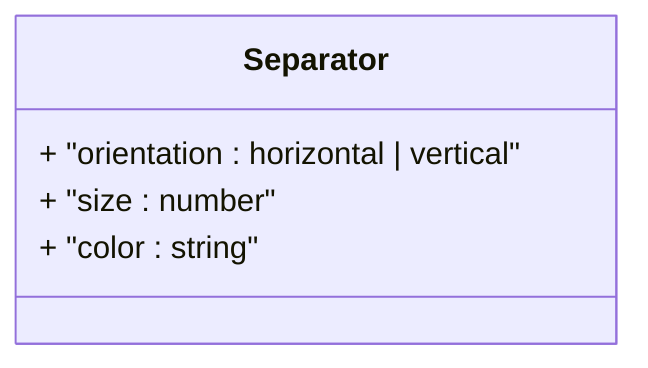

图表来源
- [src/components/tiptap-ui-primitive/separator.tsx](file://src/components/tiptap-ui-primitive/separator.tsx)
- [src/components/tiptap-ui-primitive/separator.scss](file://src/components/tiptap-ui-primitive/separator.scss)

章节来源
- [src/components/tiptap-ui-primitive/separator.tsx](file://src/components/tiptap-ui-primitive/separator.tsx)
- [src/components/tiptap-ui-primitive/separator.scss](file://src/components/tiptap-ui-primitive/separator.scss)

### 间距 Spacer
- 职责
  - 可控间距元素，简化布局排版，避免在业务组件中硬编码 margin/padding。
- Props 与事件
  - 常见属性包括：direction（horizontal/vertical）、size（数值或 token）。
  - 事件：无交互事件。
- 样式与主题
  - 基于变量控制间距刻度，保证设计一致性。
- 可访问性
  - 纯布局元素，无需额外无障碍属性。
- 示例场景
  - 行内控件间距、块级元素间距、响应式间距调整。

章节来源
- [src/components/tiptap-ui-primitive/spacer.tsx](file://src/components/tiptap-ui-primitive/spacer.tsx)

### 工具栏 Toolbar
- 职责与布局
  - 横向排列的工具按钮容器，常与编辑器集成，提供一组相关操作。
- Props 与事件
  - 常见属性包括：children、spacing、align、wrap 等。
  - 事件：由内部按钮分发具体操作事件。
- 样式与主题
  - 容器背景、边框、阴影、按钮间距与对齐策略。
- 可访问性
  - 使用 toolbar 角色；为每个工具按钮提供清晰的 aria-label。
- 示例场景
  - 富文本编辑工具栏、表格操作栏、列表筛选栏。

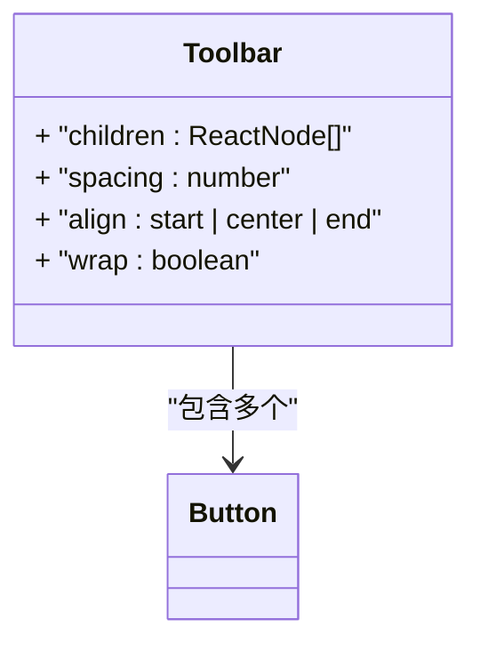

图表来源
- [src/components/tiptap-ui-primitive/toolbar.tsx](file://src/components/tiptap-ui-primitive/toolbar.tsx)
- [src/components/tiptap-ui-primitive/toolbar.scss](file://src/components/tiptap-ui-primitive/toolbar.scss)

章节来源
- [src/components/tiptap-ui-primitive/toolbar.tsx](file://src/components/tiptap-ui-primitive/toolbar.tsx)
- [src/components/tiptap-ui-primitive/toolbar.scss](file://src/components/tiptap-ui-primitive/toolbar.scss)

## 依赖关系分析
- 组件间依赖
  - ButtonGroup 依赖 Button；Toolbar 聚合多个 Button；DropdownMenu 与 Popover/Tooltip 在交互上存在相似定位逻辑，但职责不同。
- 样式依赖
  - 所有组件均依赖 _variables.scss 中的主题与尺寸变量，确保一致性与可替换性。
- 潜在循环依赖
  - 当前组件均为单向依赖，未发现循环引用风险。

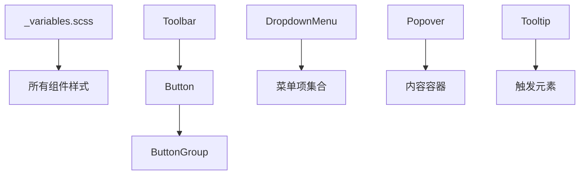

图表来源
- [src/styles/_variables.scss](file://src/styles/_variables.scss)
- [src/components/tiptap-ui-primitive/button.tsx](file://src/components/tiptap-ui-primitive/button.tsx)
- [src/components/tiptap-ui-primitive/button-group.tsx](file://src/components/tiptap-ui-primitive/button-group.tsx)
- [src/components/tiptap-ui-primitive/toolbar.tsx](file://src/components/tiptap-ui-primitive/toolbar.tsx)
- [src/components/tiptap-ui-primitive/dropdown-menu.tsx](file://src/components/tiptap-ui-primitive/dropdown-menu.tsx)
- [src/components/tiptap-ui-primitive/popover.tsx](file://src/components/tiptap-ui-primitive/popover.tsx)
- [src/components/tiptap-ui-primitive/tooltip.tsx](file://src/components/tiptap-ui-primitive/tooltip.tsx)

章节来源
- [src/styles/_variables.scss](file://src/styles/_variables.scss)
- [src/components/tiptap-ui-primitive/index.tsx](file://src/components/tiptap-ui-primitive/index.tsx)

## 性能考量
- 渲染优化
  - 对频繁更新的组件（如 Tooltip、Popover）使用防抖/节流策略，避免过度重排。
  - 大型菜单使用虚拟滚动或分页加载，减少 DOM 节点数量。
- 样式与主题
  - 尽量复用 CSS 变量与类名，减少重复计算；避免在运行时动态注入大量样式。
- 事件处理
  - 合理绑定与解绑事件监听，避免内存泄漏；在组件卸载时清理定时器与焦点陷阱。
- 可访问性与性能平衡
  - 为大量静态内容使用 aria-hidden 减少屏幕阅读器负担；仅在必要时启用 live region。

[本节为通用指导，不涉及具体文件分析]

## 故障排查指南
- 常见问题
  - 主题不一致：检查是否引入了 _variables.scss 及覆盖顺序是否正确。
  - 定位异常：确认父容器 overflow 与 z-index 设置，避免被遮挡或裁剪。
  - 键盘不可达：检查 tabIndex、role 与焦点管理逻辑是否正确实现。
  - 移动端适配：注意触摸事件与点击区域的命中范围，适当增大点击热区。
- 调试建议
  - 使用浏览器开发者工具检查 computed styles 与 accessibility tree。
  - 在关键路径添加日志输出，观察 open/close 生命周期与事件触发顺序。

章节来源
- [src/components/tiptap-ui-primitive/button.tsx](file://src/components/tiptap-ui-primitive/button.tsx)
- [src/components/tiptap-ui-primitive/dropdown-menu.tsx](file://src/components/tiptap-ui-primitive/dropdown-menu.tsx)
- [src/components/tiptap-ui-primitive/popover.tsx](file://src/components/tiptap-ui-primitive/popover.tsx)
- [src/components/tiptap-ui-primitive/tooltip.tsx](file://src/components/tiptap-ui-primitive/tooltip.tsx)

## 结论
FishWorker 的基础组件以最小可用单元为核心，通过统一的样式变量与良好的可访问性设计，提供了可扩展、易组合的 UI 能力。建议在项目中优先使用这些原子组件进行页面构建，结合组合模式与主题变量，实现一致的视觉体验与高效的开发效率。

[本节为总结性内容，不涉及具体文件分析]

## 附录
- 组合使用最佳实践
  - 按钮 + 工具提示：为图标按钮提供 Tooltip 说明。
  - 输入框 + 徽章：在输入框右侧显示计数或状态徽章。
  - 下拉菜单 + 分隔符：在菜单项之间使用分隔符区分功能组。
  - 弹出层 + 卡片：在 Popover 中嵌入 Card 展示详细信息。
- 响应式设计
  - 在小屏设备上减少按钮尺寸与间距，必要时将横向工具栏改为纵向堆叠。
  - 使用相对单位与变量控制字号与行高，确保在不同分辨率下的可读性。
- 跨浏览器兼容性
  - 关注现代 CSS 特性（如 backdrop-filter、scrollbar styling）的兼容情况，必要时提供降级方案。
  - 对焦点环与过渡动画进行回退处理，确保在无动画环境下仍可正常使用。

[本节为通用指导，不涉及具体文件分析]