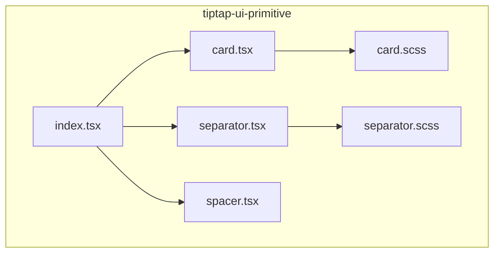
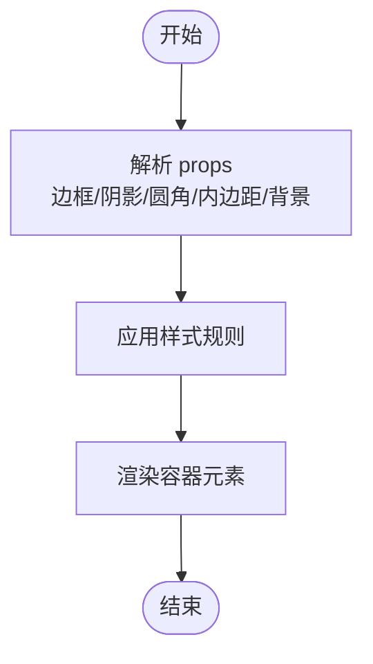
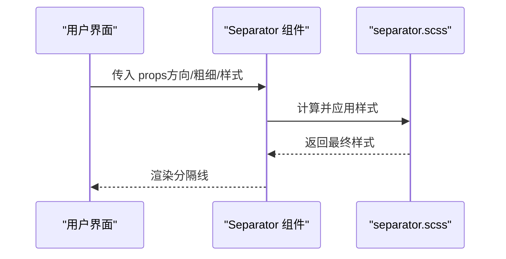
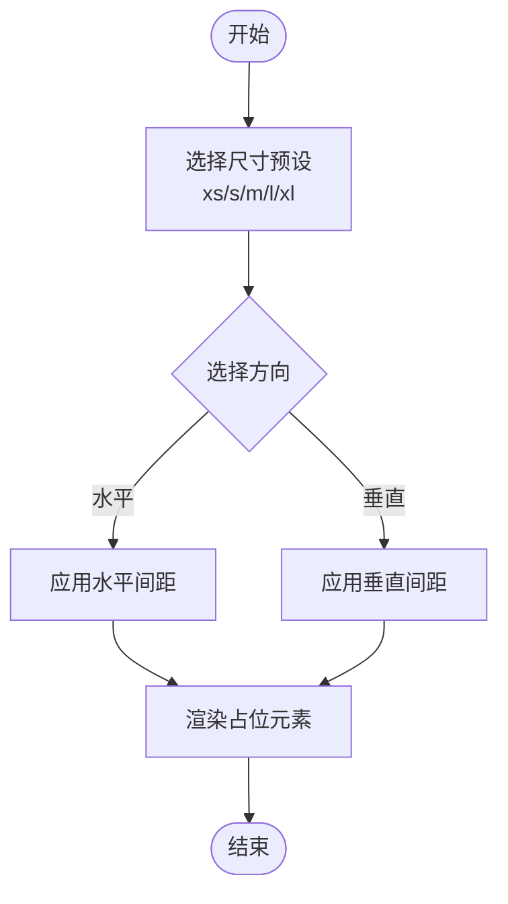
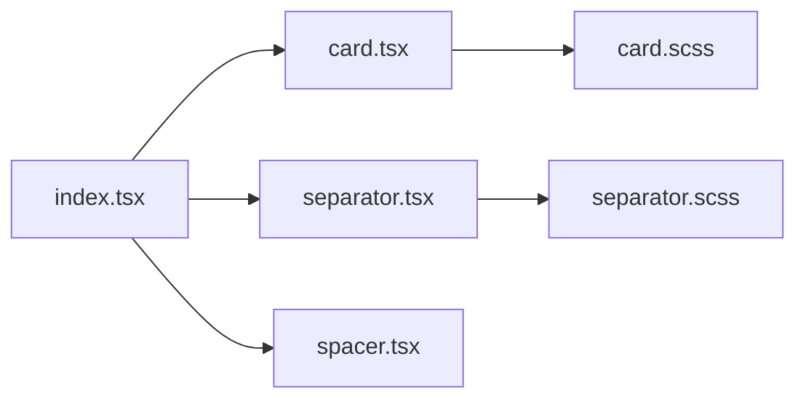

# 布局组件

<cite>
**本文引用的文件**   
- [card.tsx](file://src/components/tiptap-ui-primitive/card.tsx)
- [card.scss](file://src/components/tiptap-ui-primitive/card.scss)
- [separator.tsx](file://src/components/tiptap-ui-primitive/separator.tsx)
- [separator.scss](file://src/components/tiptap-ui-primitive/separator.scss)
- [spacer.tsx](file://src/components/tiptap-ui-primitive/spacer.tsx)
- [index.tsx](file://src/components/tiptap-ui-primitive/index.tsx)
</cite>

## 目录
1. [简介](#简介)
2. [项目结构](#项目结构)
3. [核心组件](#核心组件)
4. [架构总览](#架构总览)
5. [详细组件分析](#详细组件分析)
6. [依赖关系分析](#依赖关系分析)
7. [性能考量](#性能考量)
8. [故障排查指南](#故障排查指南)
9. [结论](#结论)
10. [附录](#附录)

## 简介
本章节面向 FishWorker 前端 UI 基础库中的布局相关原子组件，聚焦以下三个组件：
- Card（卡片）：用于承载内容块，提供边框、阴影、圆角、内边距等视觉与空间控制。
- Separator（分隔符）：用于在水平或垂直方向上划分区域，支持样式定制。
- Spacer（间距）：用于在布局中插入可控的空白间隔，支持多种尺寸选项。

这些组件位于 tiptap-ui-primitive 包中，作为更上层业务组件的基础构建块，强调可组合性、一致性与可访问性。

## 项目结构
布局组件集中在 tiptap-ui-primitive 目录下，采用“组件 + 样式”的成对组织方式，并通过统一入口导出，便于上层引用。



图表来源
- [card.tsx:1-200](file://src/components/tiptap-ui-primitive/card.tsx#L1-L200)
- [card.scss:1-200](file://src/components/tiptap-ui-primitive/card.scss#L1-L200)
- [separator.tsx:1-200](file://src/components/tiptap-ui-primitive/separator.tsx#L1-L200)
- [separator.scss:1-200](file://src/components/tiptap-ui-primitive/separator.scss#L1-L200)
- [spacer.tsx:1-200](file://src/components/tiptap-ui-primitive/spacer.tsx#L1-L200)
- [index.tsx:1-200](file://src/components/tiptap-ui-primitive/index.tsx#L1-L200)

章节来源
- [card.tsx:1-200](file://src/components/tiptap-ui-primitive/card.tsx#L1-L200)
- [separator.tsx:1-200](file://src/components/tiptap-ui-primitive/separator.tsx#L1-L200)
- [spacer.tsx:1-200](file://src/components/tiptap-ui-primitive/spacer.tsx#L1-L200)
- [index.tsx:1-200](file://src/components/tiptap-ui-primitive/index.tsx#L1-L200)

## 核心组件
本节从 API、样式能力、可访问性与使用模式四个维度概述三个组件。

- Card（卡片）
  - 作用：将相关内容分组展示，形成清晰的视觉边界。
  - 关键样式能力：边框、阴影、圆角、内边距、背景色等。
  - 可访问性：默认语义化容器，适合承载标题、段落、列表等内容；如需交互元素，建议配合 aria-* 属性增强。
  - 典型用法：页面区块、表单面板、信息摘要等。

- Separator（分隔符）
  - 作用：在水平或垂直方向上创建视觉分割线。
  - 关键样式能力：方向（水平/垂直）、粗细、颜色、虚线/实线等。
  - 可访问性：作为装饰性元素时，应通过 aria-hidden 隐藏于辅助技术之外。
  - 典型用法：表单字段间分隔、导航项之间分隔、内容区块间的过渡。

- Spacer（间距）
  - 作用：在布局中插入可控的空白间隔，提升可读性与层次。
  - 关键样式能力：尺寸预设（如 xs/s/m/l/xl 等）、方向（水平/垂直）。
  - 可访问性：纯布局占位，无需额外无障碍标记。
  - 典型用法：行间距、列间距、区块外边距、对齐补偿。

章节来源
- [card.tsx:1-200](file://src/components/tiptap-ui-primitive/card.tsx#L1-L200)
- [card.scss:1-200](file://src/components/tiptap-ui-primitive/card.scss#L1-L200)
- [separator.tsx:1-200](file://src/components/tiptap-ui-primitive/separator.tsx#L1-L200)
- [separator.scss:1-200](file://src/components/tiptap-ui-primitive/separator.scss#L1-L200)
- [spacer.tsx:1-200](file://src/components/tiptap-ui-primitive/spacer.tsx#L1-L200)

## 架构总览
下图展示了三个布局组件与其样式文件的耦合关系，以及统一入口导出的方式。

```mermaid
classDiagram
class Card {
+props : 边框/阴影/圆角/内边距/背景
+渲染 : 容器元素
}
class Separator {
+props : 方向/粗细/样式
+渲染 : 分割线元素
}
class Spacer {
+props : 尺寸/方向
+渲染 : 空白占位元素
}
class Index {
+导出 : Card, Separator, Spacer
}
Index --> Card : "导出"
Index --> Separator : "导出"
Index --> Spacer : "导出"
Card --> "card.scss" : "样式"
Separator --> "separator.scss" : "样式"
```

图表来源
- [card.tsx:1-200](file://src/components/tiptap-ui-primitive/card.tsx#L1-L200)
- [card.scss:1-200](file://src/components/tiptap-ui-primitive/card.scss#L1-L200)
- [separator.tsx:1-200](file://src/components/tiptap-ui-primitive/separator.tsx#L1-L200)
- [separator.scss:1-200](file://src/components/tiptap-ui-primitive/separator.scss#L1-L200)
- [spacer.tsx:1-200](file://src/components/tiptap-ui-primitive/spacer.tsx#L1-L200)
- [index.tsx:1-200](file://src/components/tiptap-ui-primitive/index.tsx#L1-L200)

## 详细组件分析

### Card 组件
- 设计目标
  - 为内容提供明确的视觉边界与层级感。
  - 通过一致的边框、阴影、圆角和内边距，建立统一的卡片风格。
- 样式配置要点
  - 边框：宽度、颜色、样式（实线/虚线等）。
  - 阴影：偏移、模糊半径、扩散半径、颜色，营造悬浮或层级效果。
  - 圆角：统一圆角半径，保证视觉一致性。
  - 内边距：根据内容密度调整，确保呼吸感。
  - 背景：浅色/深色主题适配。
- 可访问性
  - 作为容器，不改变文档语义；若承载交互控件，需确保焦点顺序与标签关联。
  - 当卡片作为可点击区域时，建议使用按钮或链接包裹，并设置合适的 aria-label。
- 响应式
  - 在小屏设备上适当减小内边距与阴影强度，保持紧凑布局。
- 常见用法
  - 信息卡片：标题+描述+操作区。
  - 表单卡片：分组输入字段。
  - 统计卡片：数值+单位+趋势说明。



图表来源
- [card.tsx:1-200](file://src/components/tiptap-ui-primitive/card.tsx#L1-L200)
- [card.scss:1-200](file://src/components/tiptap-ui-primitive/card.scss#L1-L200)

章节来源
- [card.tsx:1-200](file://src/components/tiptap-ui-primitive/card.tsx#L1-L200)
- [card.scss:1-200](file://src/components/tiptap-ui-primitive/card.scss#L1-L200)

### Separator 组件
- 设计目标
  - 在水平或垂直方向上创建清晰的分隔线，帮助读者理解内容结构。
- 样式配置要点
  - 方向：水平/垂直。
  - 粗细：细线/粗线，适应不同层级。
  - 样式：实线/虚线/点线，表达不同的分隔意图。
  - 颜色：与主题保持一致，必要时使用半透明。
- 可访问性
  - 作为装饰性元素，应设置 aria-hidden="true"，避免被屏幕阅读器读取。
- 常见用法
  - 表单字段之间的分隔。
  - 导航菜单项之间的分隔。
  - 内容区块之间的过渡。



图表来源
- [separator.tsx:1-200](file://src/components/tiptap-ui-primitive/separator.tsx#L1-L200)
- [separator.scss:1-200](file://src/components/tiptap-ui-primitive/separator.scss#L1-L200)

章节来源
- [separator.tsx:1-200](file://src/components/tiptap-ui-primitive/separator.tsx#L1-L200)
- [separator.scss:1-200](file://src/components/tiptap-ui-primitive/separator.scss#L1-L200)

### Spacer 组件
- 设计目标
  - 提供一致的间距系统，简化布局中的空白控制。
- 尺寸选项
  - 预设尺寸：xs/s/m/l/xl 等，对应不同像素值或相对单位。
  - 方向：水平/垂直，灵活应用于行内或块级布局。
- 可访问性
  - 纯布局占位，无需额外无障碍标记。
- 常见用法
  - 行间距：在文本段落之间插入垂直间距。
  - 列间距：在网格或 Flex 布局中增加列间距离。
  - 对齐补偿：微调元素位置，达到视觉对齐。



图表来源
- [spacer.tsx:1-200](file://src/components/tiptap-ui-primitive/spacer.tsx#L1-L200)

章节来源
- [spacer.tsx:1-200](file://src/components/tiptap-ui-primitive/spacer.tsx#L1-L200)

### 组合使用模式与最佳实践
- 卡片容器
  - 使用 Card 包裹一组相关内容，内部可用 Separator 分隔字段，Spacer 控制行间距。
- 内容分隔
  - 在长列表中，使用 Separator 区分条目，结合 Spacer 调节条目间距。
- 页面布局
  - 使用 Spacer 在主要区块之间建立节奏感，Card 作为内容载体，Separator 细化内部结构。
- 可访问性建议
  - 装饰性元素（如 Separator）设置 aria-hidden。
  - 可交互卡片区域使用语义化元素（button/link），并提供清晰的标签。
- 响应式建议
  - 在小屏设备上减少内边距与阴影强度，优先保证内容可读性。

[本节为概念性指导，不直接分析具体文件]

## 依赖关系分析
- 组件与样式
  - 每个组件与其同名 scss 文件一一对应，样式由组件 props 驱动。
- 统一导出
  - index.tsx 集中导出 Card、Separator、Spacer，供上层模块按需引入。



图表来源
- [index.tsx:1-200](file://src/components/tiptap-ui-primitive/index.tsx#L1-L200)
- [card.tsx:1-200](file://src/components/tiptap-ui-primitive/card.tsx#L1-L200)
- [separator.tsx:1-200](file://src/components/tiptap-ui-primitive/separator.tsx#L1-L200)
- [spacer.tsx:1-200](file://src/components/tiptap-ui-primitive/spacer.tsx#L1-L200)
- [card.scss:1-200](file://src/components/tiptap-ui-primitive/card.scss#L1-L200)
- [separator.scss:1-200](file://src/components/tiptap-ui-primitive/separator.scss#L1-L200)

章节来源
- [index.tsx:1-200](file://src/components/tiptap-ui-primitive/index.tsx#L1-L200)

## 性能考量
- 样式开销
  - 合理控制阴影与圆角的复杂度，避免在大列表中使用过重的阴影。
- 渲染成本
  - Spacer 为轻量占位元素，频繁使用时注意避免不必要的重排。
- 主题切换
  - 颜色与阴影随主题变化时，尽量通过 CSS 变量或类名切换，减少 JS 计算。

[本节提供通用指导，不直接分析具体文件]

## 故障排查指南
- 分隔符不可见
  - 检查方向与粗细是否过小，确认颜色与背景对比度足够。
- 卡片阴影异常
  - 检查父容器 overflow 是否裁剪了阴影，必要时调整 z-index 或父容器样式。
- 间距不生效
  - 确认 Spacer 的方向与布局模型（Flex/Grid）匹配，检查父容器的对齐与换行策略。
- 可访问性问题
  - 装饰性分隔符未设置 aria-hidden，导致屏幕阅读器误读。
  - 可点击卡片缺少语义化元素或标签，影响键盘导航与辅助技术识别。

章节来源
- [separator.tsx:1-200](file://src/components/tiptap-ui-primitive/separator.tsx#L1-L200)
- [card.tsx:1-200](file://src/components/tiptap-ui-primitive/card.tsx#L1-L200)
- [spacer.tsx:1-200](file://src/components/tiptap-ui-primitive/spacer.tsx#L1-L200)

## 结论
Card、Separator、Spacer 构成了 FishWorker 前端布局的基础构件。通过一致的样式系统与可访问性规范，它们能够高效地组合出清晰、易用的界面结构。建议在项目中统一采用这些组件，以提升整体视觉一致性与开发效率。

[本节为总结性内容，不直接分析具体文件]

## 附录
- 快速参考
  - Card：边框/阴影/圆角/内边距/背景。
  - Separator：方向/粗细/样式/颜色。
  - Spacer：尺寸预设/方向。
- 示例路径（不含代码）
  - 卡片容器示例：参见 [card.tsx:1-200](file://src/components/tiptap-ui-primitive/card.tsx#L1-L200) 的使用方式。
  - 内容分隔示例：参见 [separator.tsx:1-200](file://src/components/tiptap-ui-primitive/separator.tsx#L1-L200) 的配置项。
  - 页面布局示例：参见 [spacer.tsx:1-200](file://src/components/tiptap-ui-primitive/spacer.tsx#L1-L200) 的尺寸与方向组合。