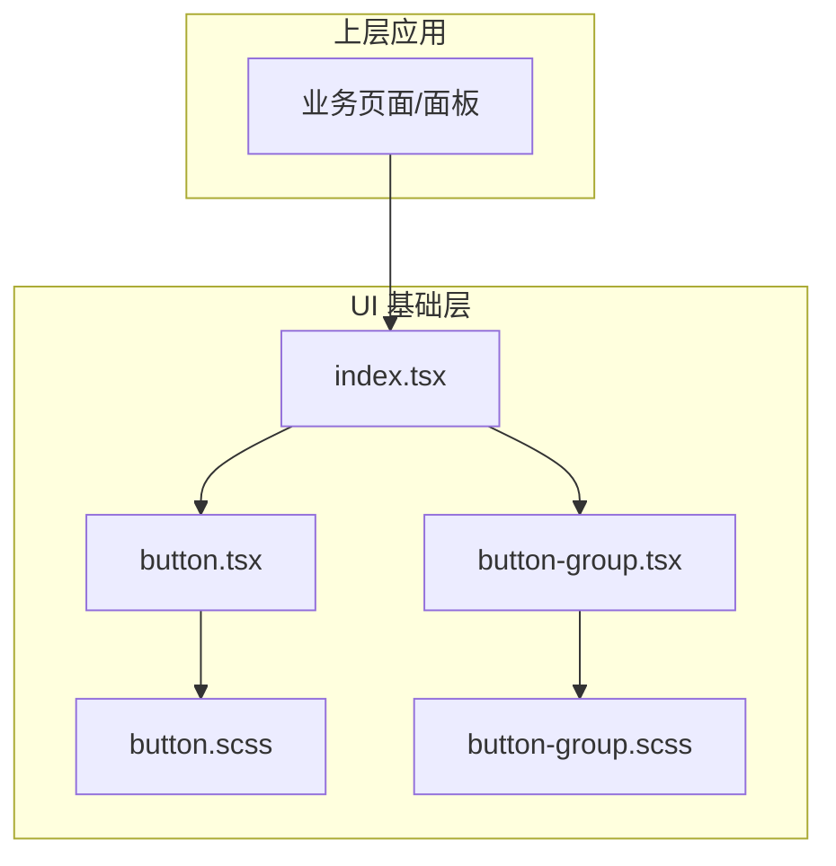
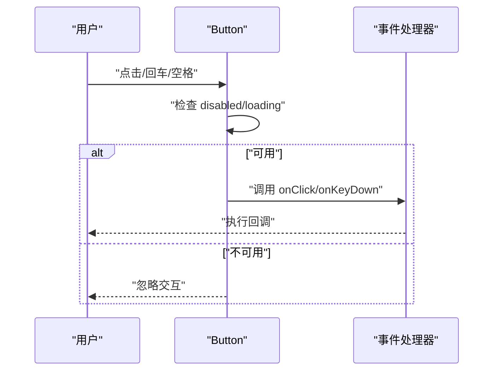
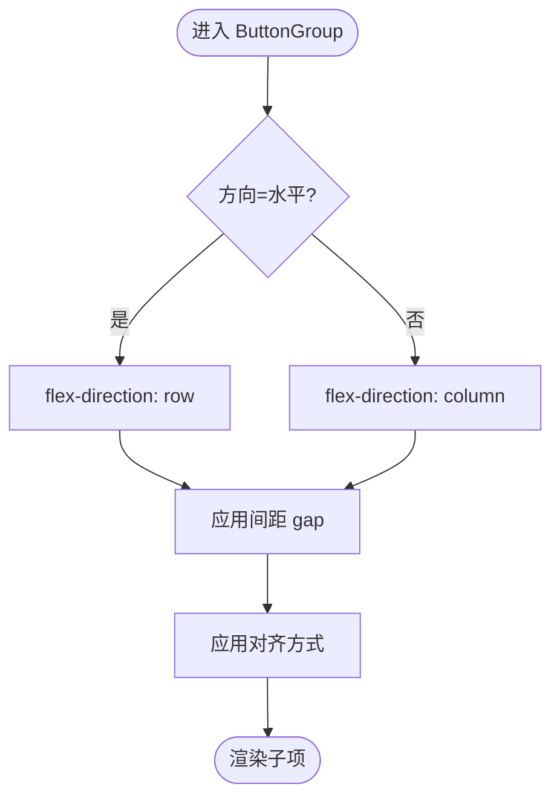
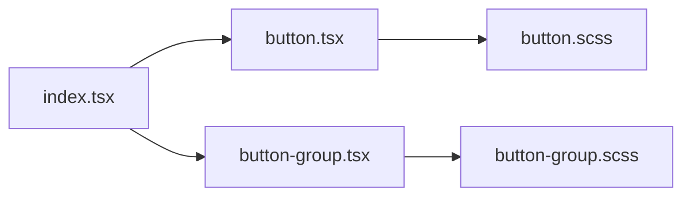

# 按钮组件

<cite>
**本文引用的文件**   
- [button.tsx](file://src/components/tiptap-ui-primitive/button.tsx)
- [button.scss](file://src/components/tiptap-ui-primitive/button.scss)
- [button-group.tsx](file://src/components/tiptap-ui-primitive/button-group.tsx)
- [button-group.scss](file://src/components/tiptap-ui-primitive/button-group.scss)
- [index.tsx](file://src/components/tiptap-ui-primitive/index.tsx)
</cite>

## 目录
1. [简介](#简介)
2. [项目结构](#项目结构)
3. [核心组件](#核心组件)
4. [架构总览](#架构总览)
5. [详细组件分析](#详细组件分析)
6. [依赖分析](#依赖分析)
7. [性能考虑](#性能考虑)
8. [故障排查指南](#故障排查指南)
9. [结论](#结论)
10. [附录](#附录)

## 简介
本章节面向 FishWorker 前端 UI 基础库中的按钮相关组件，聚焦 Button 与 ButtonGroup 的实现细节、使用方式与最佳实践。文档覆盖以下主题：
- 按钮变体（如 primary、secondary、danger 等）
- 尺寸选项
- 禁用状态与加载状态
- 图标集成
- 可访问性与键盘导航
- 样式定制
- 常见使用场景示例（单个按钮、按钮组、带图标的按钮、组合用法）
- 最佳实践与性能优化建议

## 项目结构
按钮组件位于 tiptap-ui-primitive 基础 UI 层，提供原子化能力供上层功能模块复用。



图示来源
- [button.tsx:1-200](file://src/components/tiptap-ui-primitive/button.tsx#L1-L200)
- [button.scss:1-200](file://src/components/tiptap-ui-primitive/button.scss#L1-L200)
- [button-group.tsx:1-200](file://src/components/tiptap-ui-primitive/button-group.tsx#L1-L200)
- [button-group.scss:1-200](file://src/components/tiptap-ui-primitive/button-group.scss#L1-L200)
- [index.tsx:1-200](file://src/components/tiptap-ui-primitive/index.tsx#L1-L200)

章节来源
- [button.tsx:1-200](file://src/components/tiptap-ui-primitive/button.tsx#L1-L200)
- [button-group.tsx:1-200](file://src/components/tiptap-ui-primitive/button-group.tsx#L1-L200)
- [index.tsx:1-200](file://src/components/tiptap-ui-primitive/index.tsx#L1-L200)

## 核心组件
本节对 Button 与 ButtonGroup 的核心职责进行概述，并给出关键属性与行为说明。

- Button
  - 作用：渲染一个可点击的按钮元素，支持多种视觉变体、尺寸、禁用与加载态，并可内嵌图标。
  - 关键属性（概念性说明）
    - 变体：primary、secondary、danger 等，用于表达不同语义与视觉风格。
    - 尺寸：small、medium、large 等，控制高度与字号。
    - 状态：disabled、loading，分别控制交互与反馈。
    - 图标：iconLeft、iconRight，用于在文本两侧插入图标节点。
    - 事件：onClick、onKeyDown 等，用于处理用户交互。
    - 样式：className、style，允许外部覆盖或扩展样式。
  - 可访问性：默认具备焦点可见、键盘可操作、ARIA 语义完善；在 loading 与 disabled 时正确更新 aria-* 属性。

- ButtonGroup
  - 作用：将多个 Button 以分组形式呈现，常用于工具栏、筛选器、分页等场景。
  - 关键属性（概念性说明）
    - 布局：vertical/horizontal，控制排列方向。
    - 间距：gap，控制子项间距。
    - 对齐：justify、center 等，控制整体对齐。
    - 子项：Button 实例或其他兼容的可聚焦元素。
  - 可访问性：为分组内的可操作元素提供正确的角色与导航顺序。

章节来源
- [button.tsx:1-200](file://src/components/tiptap-ui-primitive/button.tsx#L1-L200)
- [button-group.tsx:1-200](file://src/components/tiptap-ui-primitive/button-group.tsx#L1-L200)

## 架构总览
下图展示 Button 与 ButtonGroup 的关系以及样式依赖。

```mermaid
classDiagram
class Button {
+变体 : string
+尺寸 : string
+禁用 : boolean
+加载 : boolean
+图标左 : ReactNode
+图标右 : ReactNode
+点击 : function
+键盘 : function
+样式类名 : string
+内联样式 : object
}
class ButtonGroup {
+方向 : "horizontal" | "vertical"
+间距 : number
+对齐 : string
+子项 : Button[]
}
ButtonGroup --> Button : "包含"
Button --> "样式" : "引用 button.scss"
ButtonGroup --> "样式" : "引用 button-group.scss"
```

图示来源
- [button.tsx:1-200](file://src/components/tiptap-ui-primitive/button.tsx#L1-L200)
- [button-group.tsx:1-200](file://src/components/tiptap-ui-primitive/button-group.tsx#L1-L200)
- [button.scss:1-200](file://src/components/tiptap-ui-primitive/button.scss#L1-L200)
- [button-group.scss:1-200](file://src/components/tiptap-ui-primitive/button-group.scss#L1-L200)

## 详细组件分析

### Button 组件
- 实现要点
  - 通过 props 驱动外观与行为，内部根据变体与尺寸计算最终样式类名。
  - 在 loading 状态下禁用交互并显示加载指示；在 disabled 状态下阻止事件冒泡与键盘操作。
  - 图标区域与文本区域按固定顺序渲染，保证一致的视觉节奏。
  - 可访问性：设置 role、aria-disabled、aria-busy、tabIndex 等属性，确保屏幕阅读器与键盘导航体验一致。
- 关键流程（点击与键盘）


图示来源
- [button.tsx:1-200](file://src/components/tiptap-ui-primitive/button.tsx#L1-L200)

- 样式与主题
  - 通过 CSS 变量或类名切换实现多套配色与尺寸。
  - 支持 hover、active、focus-visible 等伪类增强交互反馈。
  - 可通过 className/style 覆盖默认样式，但建议优先使用设计系统提供的变体与尺寸。

章节来源
- [button.tsx:1-200](file://src/components/tiptap-ui-primitive/button.tsx#L1-L200)
- [button.scss:1-200](file://src/components/tiptap-ui-primitive/button.scss#L1-L200)

### ButtonGroup 组件
- 实现要点
  - 负责子项布局与间距，支持水平/垂直两种排列。
  - 自动为子项注入合适的样式类名，使其在分组中表现一致。
  - 在垂直模式下，子项宽度通常撑满容器；水平模式下保持内容自适应。
- 布局流程（水平模式）


图示来源
- [button-group.tsx:1-200](file://src/components/tiptap-ui-primitive/button-group.tsx#L1-L200)
- [button-group.scss:1-200](file://src/components/tiptap-ui-primitive/button-group.scss#L1-L200)

章节来源
- [button-group.tsx:1-200](file://src/components/tiptap-ui-primitive/button-group.tsx#L1-L200)
- [button-group.scss:1-200](file://src/components/tiptap-ui-primitive/button-group.scss#L1-L200)

### 导出与聚合
- index.tsx 统一对外暴露 Button 与 ButtonGroup，便于上层模块按需引入。
- 推荐从聚合入口导入，避免直接依赖具体实现路径，提升可维护性。

章节来源
- [index.tsx:1-200](file://src/components/tiptap-ui-primitive/index.tsx#L1-L200)

## 依赖分析
- 组件间依赖
  - ButtonGroup 依赖 Button 作为主要子项。
  - 两者均依赖各自样式文件完成视觉呈现。
- 外部依赖
  - 无重型第三方依赖，仅依赖 React 运行时与样式系统。
- 潜在耦合点
  - 若上层业务自定义了全局 CSS 变量或主题，需确保与按钮样式变量命名一致，避免冲突。



图示来源
- [index.tsx:1-200](file://src/components/tiptap-ui-primitive/index.tsx#L1-L200)
- [button.tsx:1-200](file://src/components/tiptap-ui-primitive/button.tsx#L1-L200)
- [button-group.tsx:1-200](file://src/components/tiptap-ui-primitive/button-group.tsx#L1-L200)
- [button.scss:1-200](file://src/components/tiptap-ui-primitive/button.scss#L1-L200)
- [button-group.scss:1-200](file://src/components/tiptap-ui-primitive/button-group.scss#L1-L200)

章节来源
- [index.tsx:1-200](file://src/components/tiptap-ui-primitive/index.tsx#L1-L200)

## 性能考虑
- 减少重排与重绘
  - 避免在高频回调中频繁创建新的对象或函数引用，必要时使用 useMemo/useCallback 稳定引用。
- 懒加载与虚拟化
  - 当按钮数量极大时（如超长列表的工具栏），考虑虚拟滚动或分页加载。
- 样式合并策略
  - 尽量通过类名切换而非大量内联样式，降低样式计算开销。
- 图标资源
  - 使用轻量 SVG 图标，避免大图或复杂滤镜；必要时对图标进行缓存。

[本节为通用指导，不直接分析具体文件]

## 故障排查指南
- 常见问题
  - 点击无效：检查是否设置了 disabled 或 loading，确认事件处理器未被提前 return。
  - 键盘无法聚焦：确认 tabIndex 与 focus-visible 样式生效，未被子级元素拦截。
  - 样式错乱：检查外层容器是否改变了 display/flex 属性导致布局异常。
  - 图标错位：确认图标容器宽高与行高与按钮尺寸匹配。
- 调试建议
  - 打开浏览器开发者工具，查看 computed styles 与 DOM 属性（如 aria-disabled）。
  - 在事件处理器中打印入参与返回值，确认调用链是否符合预期。

章节来源
- [button.tsx:1-200](file://src/components/tiptap-ui-primitive/button.tsx#L1-L200)
- [button-group.tsx:1-200](file://src/components/tiptap-ui-primitive/button-group.tsx#L1-L200)

## 结论
Button 与 ButtonGroup 提供了稳定、可访问且易扩展的基础按钮能力。通过统一的变体与尺寸体系，结合良好的可访问性与键盘支持，能够高效支撑各类业务场景。建议在项目中遵循设计系统的约定，合理使用组合与样式覆盖，以获得一致的用户体验与可维护的代码结构。

[本节为总结性内容，不直接分析具体文件]

## 附录

### 使用场景速查
- 单个按钮
  - 使用 primary 变体表示主操作，配合 onClick 触发业务逻辑。
- 按钮组
  - 使用 horizontal 布局将多个操作并列放置，适合工具栏或筛选条件。
- 带图标的按钮
  - 在 iconLeft/iconRight 传入图标节点，增强语义与识别度。
- 组合用法
  - 在 ButtonGroup 中混合不同变体与尺寸，表达主次关系与层级。

[本节为概念性示例说明，不直接分析具体文件]