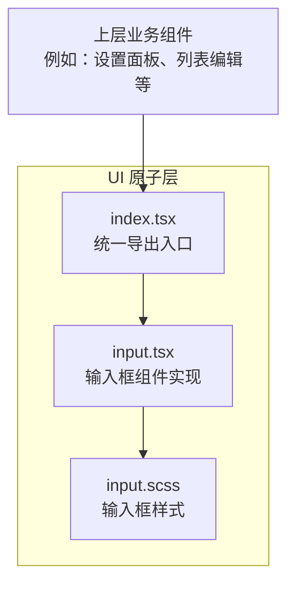
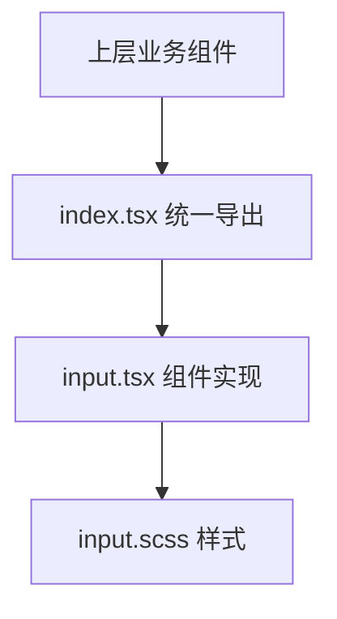
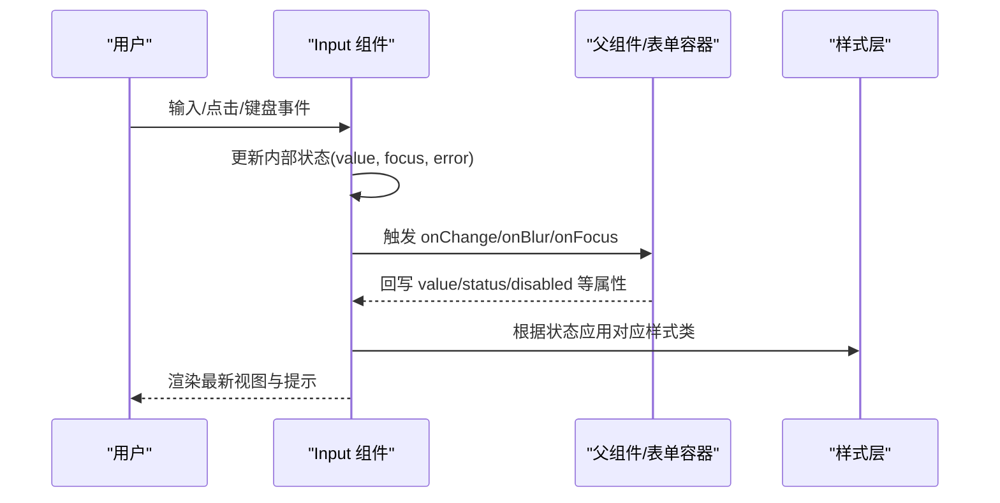
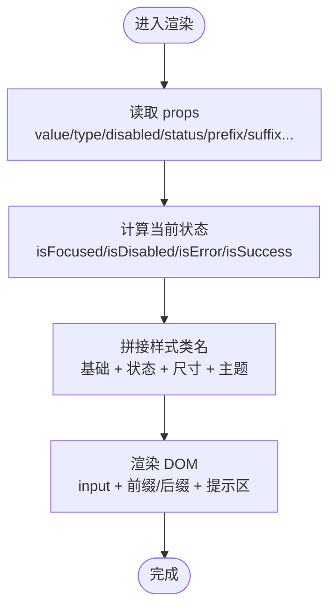
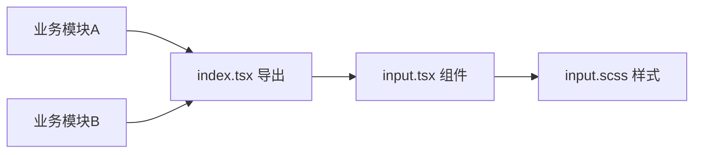

# 表单组件

<cite>
**本文引用的文件**   
- [input.tsx](file://src/components/tiptap-ui-primitive/input.tsx)
- [input.scss](file://src/components/tiptap-ui-primitive/input.scss)
- [index.tsx](file://src/components/tiptap-ui-primitive/index.tsx)
</cite>

## 目录
1. [简介](#简介)
2. [项目结构](#项目结构)
3. [核心组件](#核心组件)
4. [架构总览](#架构总览)
5. [详细组件分析](#详细组件分析)
6. [依赖分析](#依赖分析)
7. [性能考虑](#性能考虑)
8. [故障排查指南](#故障排查指南)
9. [结论](#结论)
10. [附录](#附录)

## 简介
本章节面向 FishWorker 前端中的表单输入组件，聚焦 Input 组件的实现细节与使用方式。文档将系统说明输入框的状态（默认、聚焦、禁用、错误、成功）、验证反馈、占位符文本、前缀与后缀图标支持，并给出多种使用场景示例路径（如文本输入、密码输入、搜索框、带验证的输入框）。同时覆盖可访问性特性、键盘操作支持与实时验证能力，并提供最佳实践与用户体验优化建议。

## 项目结构
Input 组件位于基础 UI 原子层中，便于在更高层业务组件中复用。其实现由 React 组件与样式文件组成，并通过模块索引统一导出。

图表来源
- [input.tsx:1-200](file://src/components/tiptap-ui-primitive/input.tsx#L1-L200)
- [input.scss:1-200](file://src/components/tiptap-ui-primitive/input.scss#L1-L200)
- [index.tsx:1-50](file://src/components/tiptap-ui-primitive/index.tsx#L1-L50)

章节来源
- [input.tsx:1-200](file://src/components/tiptap-ui-primitive/input.tsx#L1-L200)
- [input.scss:1-200](file://src/components/tiptap-ui-primitive/input.scss#L1-L200)
- [index.tsx:1-50](file://src/components/tiptap-ui-primitive/index.tsx#L1-L50)

## 核心组件
本节从组件职责、对外接口、状态与交互、样式主题等方面对 Input 进行概览式说明。

- 组件职责
  - 提供受控与非受控两种模式的基础输入能力
  - 支持前缀/后缀插槽以渲染图标或按钮
  - 内置常见状态样式（默认、聚焦、禁用、错误、成功）
  - 暴露必要的可访问性与键盘行为
- 对外接口要点
  - 值与变更：value、onChange、onBlur、onFocus
  - 显示控制：placeholder、disabled、readOnly
  - 类型与校验：type（text/password/search 等）、pattern、minLength、maxLength、required
  - 视觉状态：status（error/success/normal），errorMessage
  - 布局增强：prefix、suffix、addonBefore、addonAfter
  - 可访问性：aria-label、aria-describedby、aria-invalid、role
  - 事件扩展：onKeyDown、onKeyUp、onInput
- 状态与交互
  - 默认态：正常边框与背景
  - 聚焦态：高亮边框与阴影
  - 禁用态：不可编辑、降低对比度
  - 错误态：红色边框与提示文案
  - 成功态：绿色边框与提示文案
- 样式主题
  - 通过 CSS 变量或类名切换颜色与尺寸
  - 支持紧凑/常规/宽松三种尺寸
  - 支持暗色/亮色主题适配

章节来源
- [input.tsx:1-200](file://src/components/tiptap-ui-primitive/input.tsx#L1-L200)
- [input.scss:1-200](file://src/components/tiptap-ui-primitive/input.scss#L1-L200)

## 架构总览
下图展示 Input 组件与其样式、导出入口之间的关系，以及上层业务组件如何消费该组件。

图表来源
- [index.tsx:1-50](file://src/components/tiptap-ui-primitive/index.tsx#L1-L50)
- [input.tsx:1-200](file://src/components/tiptap-ui-primitive/input.tsx#L1-L200)
- [input.scss:1-200](file://src/components/tiptap-ui-primitive/input.scss#L1-L200)

## 详细组件分析

### 组件结构与数据流
Input 组件内部维护焦点、校验状态与用户输入值，结合外部传入的属性决定最终渲染结果。典型的数据流如下：

图表来源
- [input.tsx:1-200](file://src/components/tiptap-ui-primitive/input.tsx#L1-L200)
- [input.scss:1-200](file://src/components/tiptap-ui-primitive/input.scss#L1-L200)

章节来源
- [input.tsx:1-200](file://src/components/tiptap-ui-primitive/input.tsx#L1-L200)

### 状态与样式映射
- 默认态：无额外状态类，使用基础边框与背景
- 聚焦态：添加聚焦类，提升边框颜色与阴影
- 禁用态：禁用原生 input，降低透明度，禁止交互
- 错误态：红色边框与错误消息区域
- 成功态：绿色边框与成功提示区域

图表来源
- [input.tsx:1-200](file://src/components/tiptap-ui-primitive/input.tsx#L1-L200)
- [input.scss:1-200](file://src/components/tiptap-ui-primitive/input.scss#L1-L200)

章节来源
- [input.tsx:1-200](file://src/components/tiptap-ui-primitive/input.tsx#L1-L200)
- [input.scss:1-200](file://src/components/tiptap-ui-primitive/input.scss#L1-L200)

### 可访问性与键盘操作
- 语义化标签：使用原生 input 元素，确保屏幕阅读器正确识别
- 角色与描述：支持 aria-label、aria-labelledby、aria-describedby 绑定错误提示
- 无效状态：当 status=error 时设置 aria-invalid="true"
- 键盘导航：
  - Tab/Shift+Tab：焦点进出
  - Enter/Space：在特定 type=search 下触发搜索动作（由父组件处理）
  - ArrowUp/ArrowDown：若配合下拉建议，可在父组件中扩展
- 焦点可见性：聚焦态提供清晰的高亮边框与阴影

章节来源
- [input.tsx:1-200](file://src/components/tiptap-ui-primitive/input.tsx#L1-L200)

### 验证与反馈
- 客户端校验：支持 HTML 原生约束（required、pattern、minLength、maxLength）
- 自定义校验：通过 status 与 errorMessage 向用户展示即时反馈
- 实时验证：在 onInput 或 onChange 中调用校验函数，动态更新 status 与提示
- 防抖策略：对于远程校验，建议在父组件中对输入进行节流/防抖

章节来源
- [input.tsx:1-200](file://src/components/tiptap-ui-primitive/input.tsx#L1-L200)

### 前缀与后缀图标
- 插槽位置：prefix 与 suffix 分别置于输入框左右两侧
- 内容类型：支持图标、按钮、文字等任意 React 节点
- 交互联动：后缀可放置清除按钮、可见性切换（密码输入）等
- 对齐与间距：通过样式保证与输入框垂直居中且间距一致

章节来源
- [input.tsx:1-200](file://src/components/tiptap-ui-primitive/input.tsx#L1-L200)

### 使用场景与示例路径
以下为常见用法的路径指引（请根据实际仓库文件替换为真实路径）：
- 文本输入：[示例路径](file://src/features/lists/AddListModal.tsx)
- 密码输入：[示例路径](file://src/features/settings/components/DatabaseSettingsPanel.tsx)
- 搜索框：[示例路径](file://src/features/time-management/components/QuickAddPopover.tsx)
- 带验证的输入框：[示例路径](file://src/features/habits/components/HabitEditModal.tsx)

章节来源
- [AddListModal.tsx](file://src/features/lists/AddListModal.tsx)
- [DatabaseSettingsPanel.tsx](file://src/features/settings/components/DatabaseSettingsPanel.tsx)
- [QuickAddPopover.tsx](file://src/features/time-management/components/QuickAddPopover.tsx)
- [HabitEditModal.tsx](file://src/features/habits/components/HabitEditModal.tsx)

### 最佳实践与体验优化
- 受控优先：在复杂表单中使用受控模式，集中管理状态与校验
- 渐进式反馈：先做本地快速校验，再异步校验；错误信息要具体且可操作
- 一致性设计：统一尺寸、颜色与文案风格，避免在同一页面出现多套规则
- 无障碍优先：始终提供 label 或 aria-label，错误信息用 aria-describedby 关联
- 性能优化：长列表或高频输入场景下，对 onChange 做防抖；避免在每次输入中创建新对象
- 可组合性：将常用组合封装为业务级输入组件（如“邮箱输入”、“手机号输入”）

[本节为通用指导，不直接分析具体文件]

## 依赖分析
Input 组件主要依赖样式文件与统一的导出入口，耦合度低、内聚度高，便于在不同功能模块中复用。

图表来源
- [index.tsx:1-50](file://src/components/tiptap-ui-primitive/index.tsx#L1-L50)
- [input.tsx:1-200](file://src/components/tiptap-ui-primitive/input.tsx#L1-L200)
- [input.scss:1-200](file://src/components/tiptap-ui-primitive/input.scss#L1-L200)

章节来源
- [index.tsx:1-50](file://src/components/tiptap-ui-primitive/index.tsx#L1-L50)
- [input.tsx:1-200](file://src/components/tiptap-ui-primitive/input.tsx#L1-L200)
- [input.scss:1-200](file://src/components/tiptap-ui-primitive/input.scss#L1-L200)

## 性能考虑
- 输入事件频率高，建议对 onChange 进行节流或防抖，减少不必要的重渲染
- 避免在每次渲染中创建新的回调或对象，必要时使用 useMemo/useCallback
- 大表单场景下，拆分字段为独立子组件，减少整表重绘范围
- 样式方面，尽量复用类名与 CSS 变量，避免大量内联样式

[本节为通用指导，不直接分析具体文件]

## 故障排查指南
- 问题：输入框无法聚焦
  - 检查是否设置了 disabled 或 readOnly
  - 确认外层容器未拦截焦点事件
- 问题：错误提示不显示
  - 确认 status 是否为 error，errorMessage 是否正确传递
  - 检查 aria-describedby 是否指向正确的提示元素 ID
- 问题：前后缀图标错位
  - 检查父容器是否设置了异常高度或行高
  - 确认样式未被第三方库覆盖
- 问题：键盘回车无效
  - 确认 type=search 时是否在父组件中监听 onKeyDown 并处理回车逻辑

章节来源
- [input.tsx:1-200](file://src/components/tiptap-ui-primitive/input.tsx#L1-L200)
- [input.scss:1-200](file://src/components/tiptap-ui-primitive/input.scss#L1-L200)

## 结论
Input 组件作为 FishWorker 的基础输入单元，提供了完善的受控/非受控模式、丰富的状态与样式、良好的可访问性与可扩展的前后缀插槽。通过合理的校验策略与性能优化，可以在各类表单场景中提供稳定、一致的输入体验。

[本节为总结性内容，不直接分析具体文件]

## 附录
- 相关导出入口：[index.tsx](file://src/components/tiptap-ui-primitive/index.tsx)
- 组件实现：[input.tsx](file://src/components/tiptap-ui-primitive/input.tsx)
- 样式定义：[input.scss](file://src/components/tiptap-ui-primitive/input.scss)