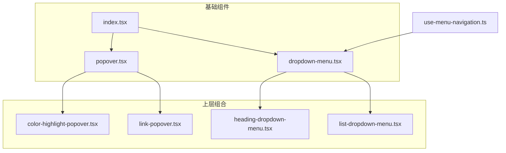
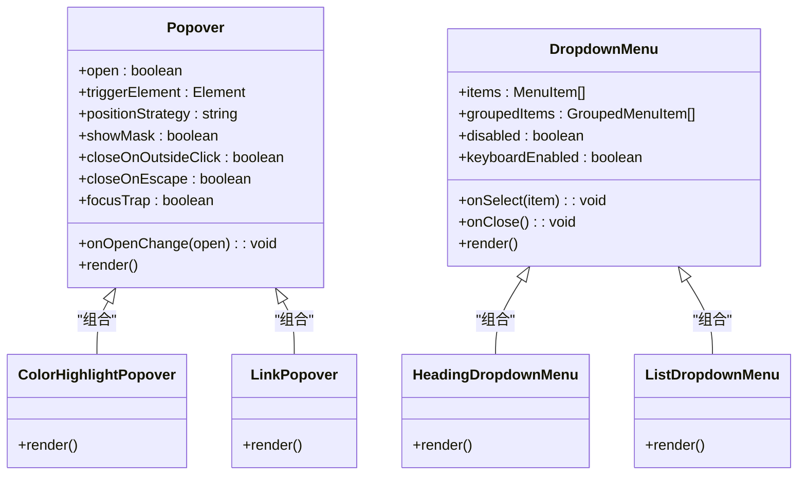
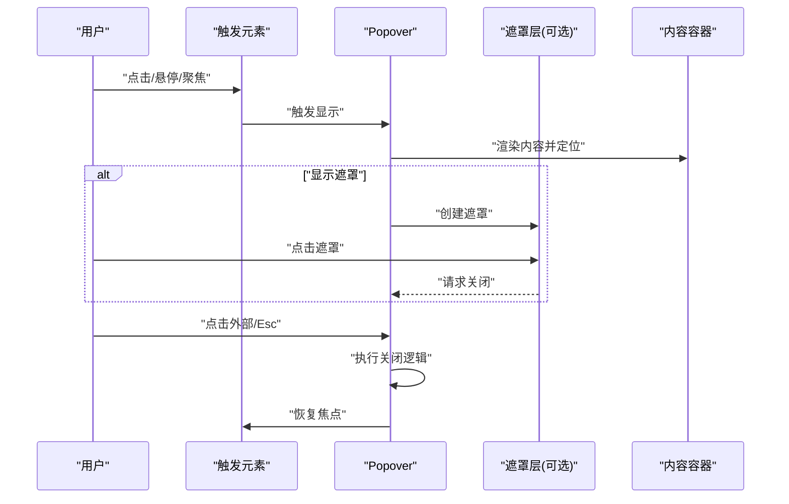
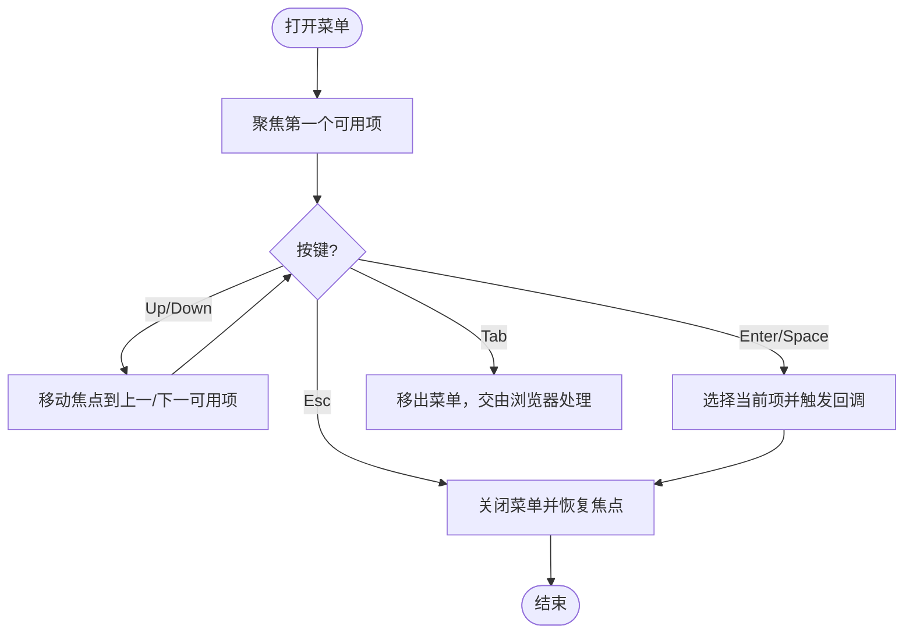
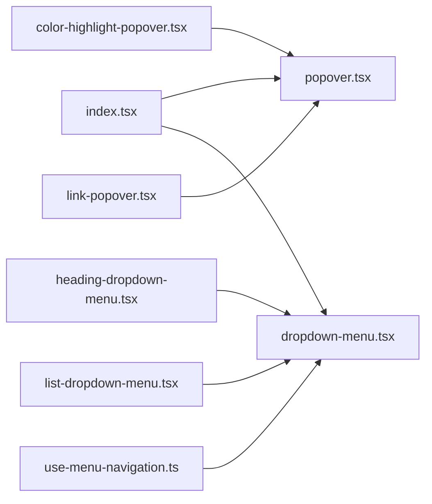

# 覆盖层组件

<cite>
**本文引用的文件**   
- [src/components/tiptap-ui-primitive/popover.tsx](file://src/components/tiptap-ui-primitive/popover.tsx)
- [src/components/tiptap-ui-primitive/dropdown-menu.tsx](file://src/components/tiptap-ui-primitive/dropdown-menu.tsx)
- [src/components/tiptap-ui-primitive/index.tsx](file://src/components/tiptap-ui-primitive/index.tsx)
- [src/hooks/use-menu-navigation.ts](file://src/hooks/use-menu-navigation.ts)
- [src/components/tiptap-ui/color-highlight-popover.tsx](file://src/components/tiptap-ui/color-highlight-popover.tsx)
- [src/components/tiptap-ui/link-popover.tsx](file://src/components/tiptap-ui/link-popover.tsx)
- [src/components/tiptap-ui/heading-dropdown-menu.tsx](file://src/components/tiptap-ui/heading-dropdown-menu.tsx)
- [src/components/tiptap-ui/list-dropdown-menu.tsx](file://src/components/tiptap-ui/list-dropdown-menu.tsx)
</cite>

## 目录
1. [简介](#简介)
2. [项目结构](#项目结构)
3. [核心组件](#核心组件)
4. [架构总览](#架构总览)
5. [详细组件分析](#详细组件分析)
6. [依赖关系分析](#依赖关系分析)
7. [性能考虑](#性能考虑)
8. [故障排查指南](#故障排查指南)
9. [结论](#结论)
10. [附录](#附录)

## 简介
本章节聚焦 FishWorker 前端中的覆盖层（Overlay）能力，重点围绕 Popover 与 DropdownMenu 两个基础组件的实现细节、使用方式与最佳实践。内容涵盖：
- 触发方式与定位策略
- 遮罩层与关闭行为
- 下拉菜单的项结构、分组显示、禁用状态与选择回调
- 可访问性特性、键盘导航与焦点管理
- 常见使用场景示例（上下文菜单、筛选面板、操作菜单等）
- 性能优化与用户体验建议

## 项目结构
覆盖层相关代码主要位于 tiptap-ui-primitive 基础组件目录，并在 tiptap-ui 上层以业务化组合形式复用。

图表来源
- [src/components/tiptap-ui-primitive/popover.tsx](file://src/components/tiptap-ui-primitive/popover.tsx)
- [src/components/tiptap-ui-primitive/dropdown-menu.tsx](file://src/components/tiptap-ui-primitive/dropdown-menu.tsx)
- [src/components/tiptap-ui-primitive/index.tsx](file://src/components/tiptap-ui-primitive/index.tsx)
- [src/components/tiptap-ui/color-highlight-popover.tsx](file://src/components/tiptap-ui/color-highlight-popover.tsx)
- [src/components/tiptap-ui/link-popover.tsx](file://src/components/tiptap-ui/link-popover.tsx)
- [src/components/tiptap-ui/heading-dropdown-menu.tsx](file://src/components/tiptap-ui/heading-dropdown-menu.tsx)
- [src/components/tiptap-ui/list-dropdown-menu.tsx](file://src/components/tiptap-ui/list-dropdown-menu.tsx)
- [src/hooks/use-menu-navigation.ts](file://src/hooks/use-menu-navigation.ts)

章节来源
- [src/components/tiptap-ui-primitive/popover.tsx](file://src/components/tiptap-ui-primitive/popover.tsx)
- [src/components/tiptap-ui-primitive/dropdown-menu.tsx](file://src/components/tiptap-ui-primitive/dropdown-menu.tsx)
- [src/components/tiptap-ui-primitive/index.tsx](file://src/components/tiptap-ui-primitive/index.tsx)
- [src/hooks/use-menu-navigation.ts](file://src/hooks/use-menu-navigation.ts)

## 核心组件
本节对 Popover 与 DropdownMenu 的核心职责、关键属性与交互进行说明。为避免直接粘贴源码，以下通过“路径引用”的方式指向实现位置。

- Popover
  - 职责：提供可定位的弹出容器，支持受控/非受控显隐、点击外部关闭、遮罩层开关、滚动穿透控制、z-index 层级管理等。
  - 关键能力
    - 触发方式：点击、悬停、焦点触发等
    - 定位策略：相对触发元素或自定义锚点，自动边界修正
    - 遮罩层：可选背景遮罩，点击遮罩关闭
    - 关闭行为：点击外部、Esc 键、手动调用关闭方法
    - 焦点管理：打开时聚焦到首个可聚焦项，关闭后恢复焦点
  - 参考实现
    - [src/components/tiptap-ui-primitive/popover.tsx](file://src/components/tiptap-ui-primitive/popover.tsx)

- DropdownMenu
  - 职责：提供带键盘导航的下拉菜单容器，支持分组、分隔符、禁用项、单选/多选、选择回调等。
  - 关键能力
    - 菜单项结构：支持普通项、分组标题、分隔线、子菜单入口
    - 分组显示：按组组织项，提升可读性与可达性
    - 禁用状态：不可聚焦、不可选择、视觉弱化
    - 选择回调：onSelect/onClose 等事件
    - 键盘导航：方向键移动、Enter/Space 选择、Esc 关闭、Tab 切换
  - 参考实现
    - [src/components/tiptap-ui-primitive/dropdown-menu.tsx](file://src/components/tiptap-ui-primitive/dropdown-menu.tsx)
    - [src/hooks/use-menu-navigation.ts](file://src/hooks/use-menu-navigation.ts)

章节来源
- [src/components/tiptap-ui-primitive/popover.tsx](file://src/components/tiptap-ui-primitive/popover.tsx)
- [src/components/tiptap-ui-primitive/dropdown-menu.tsx](file://src/components/tiptap-ui-primitive/dropdown-menu.tsx)
- [src/hooks/use-menu-navigation.ts](file://src/hooks/use-menu-navigation.ts)

## 架构总览
Popover 作为通用弹出容器，常被用于包裹 DropdownMenu 或其他任意内容；DropdownMenu 则专注于菜单交互与可达性。上层组件将两者组合，形成具体业务形态（如颜色高亮浮层、链接编辑浮层、标题样式下拉、列表类型下拉）。

图表来源
- [src/components/tiptap-ui-primitive/popover.tsx](file://src/components/tiptap-ui-primitive/popover.tsx)
- [src/components/tiptap-ui-primitive/dropdown-menu.tsx](file://src/components/tiptap-ui-primitive/dropdown-menu.tsx)
- [src/components/tiptap-ui/color-highlight-popover.tsx](file://src/components/tiptap-ui/color-highlight-popover.tsx)
- [src/components/tiptap-ui/link-popover.tsx](file://src/components/tiptap-ui/link-popover.tsx)
- [src/components/tiptap-ui/heading-dropdown-menu.tsx](file://src/components/tiptap-ui/heading-dropdown-menu.tsx)
- [src/components/tiptap-ui/list-dropdown-menu.tsx](file://src/components/tiptap-ui/list-dropdown-menu.tsx)

## 详细组件分析

### Popover 组件
- 触发方式
  - 点击触发：点击触发元素显示，点击外部或遮罩关闭
  - 悬停触发：鼠标进入显示，离开隐藏（适合轻量提示）
  - 焦点触发：获得焦点显示，失焦关闭（适合表单辅助）
- 定位策略
  - 基于触发元素的相对定位，自动计算边界避免溢出
  - 支持指定对齐方向（上/下/左/右）与偏移量
- 遮罩层设置
  - 可选显示遮罩，点击遮罩关闭
  - 遮罩层级低于弹出层但高于页面主体
- 关闭行为
  - 点击外部区域关闭
  - 按下 Esc 键关闭
  - 主动调用关闭方法
- 焦点管理
  - 打开时将焦点移入弹出层首项
  - 关闭后将焦点归还至触发元素
  - 可选焦点陷阱，防止焦点逃逸
- 使用示例（路径引用）
  - 颜色高亮浮层：[src/components/tiptap-ui/color-highlight-popover.tsx](file://src/components/tiptap-ui/color-highlight-popover.tsx)
  - 链接编辑浮层：[src/components/tiptap-ui/link-popover.tsx](file://src/components/tiptap-ui/link-popover.tsx)

图表来源
- [src/components/tiptap-ui-primitive/popover.tsx](file://src/components/tiptap-ui-primitive/popover.tsx)
- [src/components/tiptap-ui/color-highlight-popover.tsx](file://src/components/tiptap-ui/color-highlight-popover.tsx)
- [src/components/tiptap-ui/link-popover.tsx](file://src/components/tiptap-ui/link-popover.tsx)

章节来源
- [src/components/tiptap-ui-primitive/popover.tsx](file://src/components/tiptap-ui-primitive/popover.tsx)
- [src/components/tiptap-ui/color-highlight-popover.tsx](file://src/components/tiptap-ui/color-highlight-popover.tsx)
- [src/components/tiptap-ui/link-popover.tsx](file://src/components/tiptap-ui/link-popover.tsx)

### DropdownMenu 组件
- 菜单项结构
  - 普通项：包含文本、图标、快捷键提示、禁用态、选中态
  - 分组项：用于组织同类项，提升可读性
  - 分隔线：用于视觉分组
- 分组显示
  - 支持按组渲染，组内保持键盘导航连续性
- 禁用状态
  - 不可聚焦、不可选择、视觉上弱化
- 选择回调
  - onSelect：选择某一项时的回调
  - onClose：关闭菜单时的回调
- 键盘导航与可达性
  - 方向键上下移动焦点
  - Enter/Space 选择当前项
  - Esc 关闭菜单
  - Tab 在菜单间切换
  - aria-* 属性完善，屏幕阅读器友好
- 使用示例（路径引用）
  - 标题样式下拉：[src/components/tiptap-ui/heading-dropdown-menu.tsx](file://src/components/tiptap-ui/heading-dropdown-menu.tsx)
  - 列表类型下拉：[src/components/tiptap-ui/list-dropdown-menu.tsx](file://src/components/tiptap-ui/list-dropdown-menu.tsx)

图表来源
- [src/components/tiptap-ui-primitive/dropdown-menu.tsx](file://src/components/tiptap-ui-primitive/dropdown-menu.tsx)
- [src/hooks/use-menu-navigation.ts](file://src/hooks/use-menu-navigation.ts)

章节来源
- [src/components/tiptap-ui-primitive/dropdown-menu.tsx](file://src/components/tiptap-ui-primitive/dropdown-menu.tsx)
- [src/hooks/use-menu-navigation.ts](file://src/hooks/use-menu-navigation.ts)
- [src/components/tiptap-ui/heading-dropdown-menu.tsx](file://src/components/tiptap-ui/heading-dropdown-menu.tsx)
- [src/components/tiptap-ui/list-dropdown-menu.tsx](file://src/components/tiptap-ui/list-dropdown-menu.tsx)

### 典型使用场景
- 上下文菜单
  - 右键或长按触发，定位到光标或长按位置
  - 结合 Popover 的点击外部关闭与遮罩层
  - 参考：[src/components/tiptap-ui-primitive/popover.tsx](file://src/components/tiptap-ui-primitive/popover.tsx)
- 筛选面板
  - 使用 Popover 承载复杂筛选表单，支持遮罩与外部点击关闭
  - 参考：[src/components/tiptap-ui-primitive/popover.tsx](file://src/components/tiptap-ui-primitive/popover.tsx)
- 操作菜单
  - 使用 DropdownMenu 展示一组操作项，支持分组与禁用
  - 参考：[src/components/tiptap-ui-primitive/dropdown-menu.tsx](file://src/components/tiptap-ui-primitive/dropdown-menu.tsx)

## 依赖关系分析
- 组件导出
  - 基础组件统一从 index.tsx 导出，便于上层按需引入
- 组合关系
  - 上层组件通过组合 Popover 与 DropdownMenu 构建具体功能
- 导航钩子
  - use-menu-navigation 为 DropdownMenu 提供键盘导航与可达性支持

图表来源
- [src/components/tiptap-ui-primitive/index.tsx](file://src/components/tiptap-ui-primitive/index.tsx)
- [src/components/tiptap-ui-primitive/popover.tsx](file://src/components/tiptap-ui-primitive/popover.tsx)
- [src/components/tiptap-ui-primitive/dropdown-menu.tsx](file://src/components/tiptap-ui-primitive/dropdown-menu.tsx)
- [src/components/tiptap-ui/color-highlight-popover.tsx](file://src/components/tiptap-ui/color-highlight-popover.tsx)
- [src/components/tiptap-ui/link-popover.tsx](file://src/components/tiptap-ui/link-popover.tsx)
- [src/components/tiptap-ui/heading-dropdown-menu.tsx](file://src/components/tiptap-ui/heading-dropdown-menu.tsx)
- [src/components/tiptap-ui/list-dropdown-menu.tsx](file://src/components/tiptap-ui/list-dropdown-menu.tsx)
- [src/hooks/use-menu-navigation.ts](file://src/hooks/use-menu-navigation.ts)

章节来源
- [src/components/tiptap-ui-primitive/index.tsx](file://src/components/tiptap-ui-primitive/index.tsx)
- [src/hooks/use-menu-navigation.ts](file://src/hooks/use-menu-navigation.ts)

## 性能考虑
- 延迟渲染与懒挂载
  - 仅在需要时渲染 Popover/DropdownMenu 内容，减少初始渲染开销
- 防抖与节流
  - 对频繁触发的定位计算进行节流，避免布局抖动
- 虚拟滚动
  - 对于大量菜单项，采用虚拟滚动降低 DOM 节点数量
- 事件去重与合并
  - 合并多次快速点击，避免重复状态更新
- 遮罩层优化
  - 仅当需要时插入遮罩节点，关闭后立即移除
- 可访问性代价
  - 合理设置 aria-* 与 tabindex，避免不必要的焦点遍历

## 故障排查指南
- 无法关闭
  - 检查是否禁用了点击外部关闭或 Esc 关闭
  - 确认遮罩层是否拦截了点击事件
  - 参考：[src/components/tiptap-ui-primitive/popover.tsx](file://src/components/tiptap-ui-primitive/popover.tsx)
- 定位异常
  - 检查触发元素是否在视口内
  - 调整定位策略与偏移量
  - 参考：[src/components/tiptap-ui-primitive/popover.tsx](file://src/components/tiptap-ui-primitive/popover.tsx)
- 键盘导航失效
  - 确认菜单项是否被禁用
  - 检查 use-menu-navigation 是否正确绑定
  - 参考：[src/hooks/use-menu-navigation.ts](file://src/hooks/use-menu-navigation.ts)
- 焦点丢失或逃逸
  - 启用焦点陷阱并确保关闭后焦点归位
  - 参考：[src/components/tiptap-ui-primitive/popover.tsx](file://src/components/tiptap-ui-primitive/popover.tsx)

章节来源
- [src/components/tiptap-ui-primitive/popover.tsx](file://src/components/tiptap-ui-primitive/popover.tsx)
- [src/hooks/use-menu-navigation.ts](file://src/hooks/use-menu-navigation.ts)

## 结论
Popover 与 DropdownMenu 构成了 FishWorker 覆盖层能力的基石。前者负责通用弹出容器的定位、遮罩与焦点管理，后者专注菜单结构与键盘可达性。通过合理的组合与配置，可以高效构建上下文菜单、筛选面板、操作菜单等多种交互形态。遵循本文的可访问性与性能建议，可获得更稳定、易用且高效的覆盖层体验。

## 附录
- 常用属性速查（概念性说明）
  - Popover
    - open/onOpenChange：受控显隐
    - trigger：触发方式（点击/悬停/焦点）
    - positionStrategy：定位策略
    - showMask：是否显示遮罩
    - closeOnOutsideClick/closeOnEscape：外部点击/Esc 关闭
    - focusTrap：焦点陷阱
  - DropdownMenu
    - items/groupedItems：菜单项/分组项
    - disabled：整体禁用
    - onSelect/onClose：选择/关闭回调
    - keyboardEnabled：是否启用键盘导航