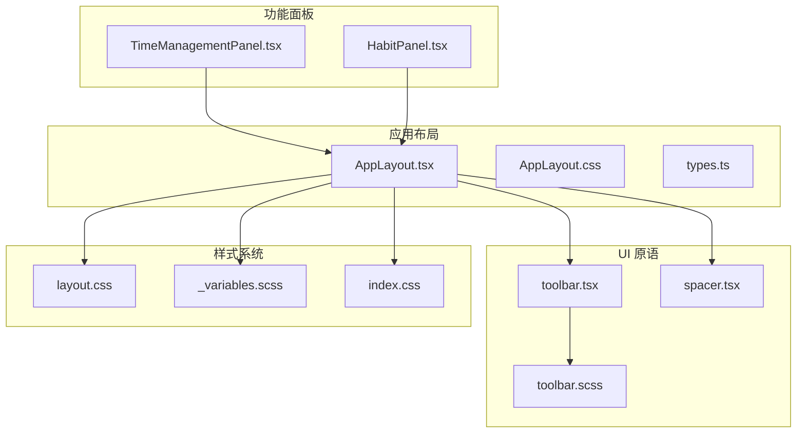
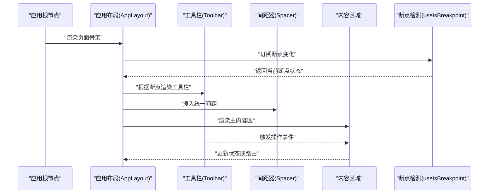
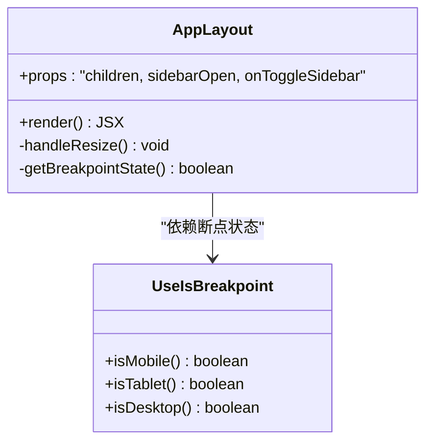
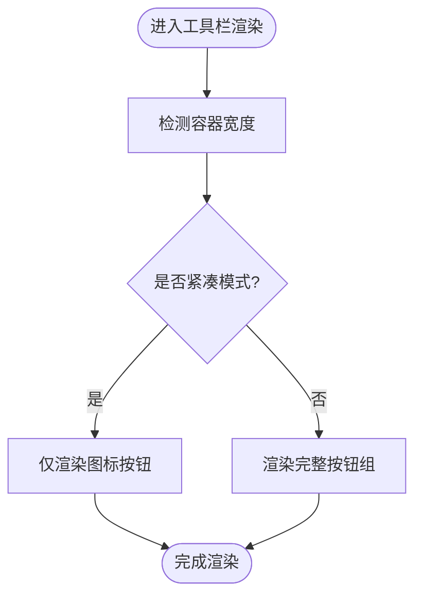
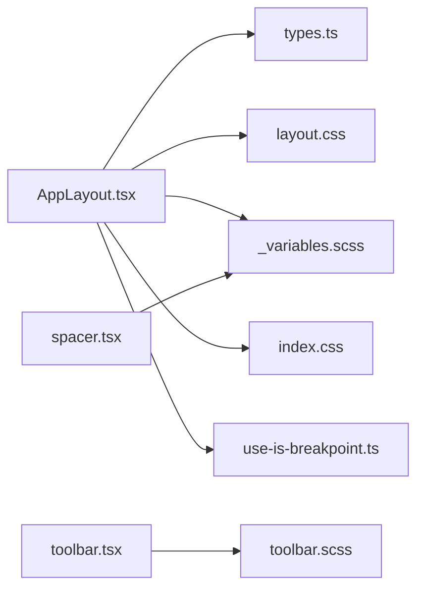

# 布局组件

<cite>
**本文引用的文件**   
- [AppLayout.tsx](file://src/components/layout/AppLayout.tsx)
- [AppLayout.css](file://src/components/layout/AppLayout.css)
- [types.ts](file://src/components/layout/types.ts)
- [toolbar.tsx](file://src/components/tiptap-ui-primitive/toolbar.tsx)
- [toolbar.scss](file://src/components/tiptap-ui-primitive/toolbar.scss)
- [spacer.tsx](file://src/components/tiptap-ui-primitive/spacer.tsx)
- [layout.css](file://src/styles/layout.css)
- [_variables.scss](file://src/styles/_variables.scss)
- [index.css](file://src/index.css)
- [use-is-breakpoint.ts](file://src/hooks/use-is-breakpoint.ts)
- [TimeManagementPanel.tsx](file://src/features/time-management/TimeManagementPanel.tsx)
- [HabitPanel.tsx](file://src/features/habits/HabitPanel.tsx)
</cite>

## 目录
1. [简介](#简介)
2. [项目结构](#项目结构)
3. [核心组件](#核心组件)
4. [架构总览](#架构总览)
5. [详细组件分析](#详细组件分析)
6. [依赖关系分析](#依赖关系分析)
7. [性能考量](#性能考量)
8. [故障排查指南](#故障排查指南)
9. [结论](#结论)
10. [附录](#附录)

## 简介
本章节面向 FishWorker 前端应用中的“布局组件”体系，聚焦工具栏、间距器与应用布局等基础构建块。文档将阐述这些组件的设计理念与实现方式，说明它们如何协同工作以构建响应式界面，包括栅格系统的使用、内容区域的划分与导航结构的组织。同时提供在时间管理与习惯追踪等功能模块中的实际应用场景示例，并给出样式定制与主题适配方案，帮助开发者快速搭建一致、可维护且可扩展的页面布局。

## 项目结构
FishWorker 的前端布局相关代码主要分布在以下位置：
- 应用级布局容器：位于 components/layout 下，负责整体页面骨架、侧边栏与主内容区的组织。
- 通用 UI 原语：位于 components/tiptap-ui-primitive 下的 toolbar 与 spacer，提供工具栏与间距能力。
- 全局样式与变量：位于 styles 目录，包含布局相关的 CSS 与 SCSS 变量。
- 功能面板：features 目录下各业务面板（如时间管理、习惯）通过组合上述布局组件形成完整页面。

图表来源
- [AppLayout.tsx:1-200](file://src/components/layout/AppLayout.tsx#L1-L200)
- [AppLayout.css:1-200](file://src/components/layout/AppLayout.css#L1-L200)
- [types.ts:1-100](file://src/components/layout/types.ts#L1-L100)
- [toolbar.tsx:1-200](file://src/components/tiptap-ui-primitive/toolbar.tsx#L1-L200)
- [toolbar.scss:1-200](file://src/components/tiptap-ui-primitive/toolbar.scss#L1-L200)
- [spacer.tsx:1-100](file://src/components/tiptap-ui-primitive/spacer.tsx#L1-L100)
- [layout.css:1-200](file://src/styles/layout.css#L1-L200)
- [_variables.scss:1-200](file://src/styles/_variables.scss#L1-L200)
- [index.css:1-200](file://src/index.css#L1-L200)
- [TimeManagementPanel.tsx:1-200](file://src/features/time-management/TimeManagementPanel.tsx#L1-L200)
- [HabitPanel.tsx:1-200](file://src/features/habits/HabitPanel.tsx#L1-L200)

章节来源
- [AppLayout.tsx:1-200](file://src/components/layout/AppLayout.tsx#L1-L200)
- [AppLayout.css:1-200](file://src/components/layout/AppLayout.css#L1-L200)
- [types.ts:1-100](file://src/components/layout/types.ts#L1-L100)
- [toolbar.tsx:1-200](file://src/components/tiptap-ui-primitive/toolbar.tsx#L1-L200)
- [toolbar.scss:1-200](file://src/components/tiptap-ui-primitive/toolbar.scss#L1-L200)
- [spacer.tsx:1-100](file://src/components/tiptap-ui-primitive/spacer.tsx#L1-L100)
- [layout.css:1-200](file://src/styles/layout.css#L1-L200)
- [_variables.scss:1-200](file://src/styles/_variables.scss#L1-L200)
- [index.css:1-200](file://src/index.css#L1-L200)
- [TimeManagementPanel.tsx:1-200](file://src/features/time-management/TimeManagementPanel.tsx#L1-L200)
- [HabitPanel.tsx:1-200](file://src/features/habits/HabitPanel.tsx#L1-L200)

## 核心组件
本节概述布局体系的核心构件及其职责：
- 应用布局 AppLayout：作为页面根容器，组织顶部导航、侧边栏与主内容区，处理响应式切换与区域滚动。
- 工具栏 Toolbar：用于放置操作按钮、筛选与分组控件，支持紧凑模式与自适应宽度。
- 间距器 Spacer：提供统一的水平/垂直间距控制，确保视觉节奏一致。
- 样式系统与变量：通过 layout.css 与 _variables.scss 定义断点、间距、颜色与阴影等设计令牌，支撑主题化与一致性。

章节来源
- [AppLayout.tsx:1-200](file://src/components/layout/AppLayout.tsx#L1-L200)
- [AppLayout.css:1-200](file://src/components/layout/AppLayout.css#L1-L200)
- [toolbar.tsx:1-200](file://src/components/tiptap-ui-primitive/toolbar.tsx#L1-L200)
- [toolbar.scss:1-200](file://src/components/tiptap-ui-primitive/toolbar.scss#L1-L200)
- [spacer.tsx:1-100](file://src/components/tiptap-ui-primitive/spacer.tsx#L1-L100)
- [layout.css:1-200](file://src/styles/layout.css#L1-L200)
- [_variables.scss:1-200](file://src/styles/_variables.scss#L1-L200)

## 架构总览
下图展示了布局组件之间的交互关系与数据流向。应用布局作为顶层容器，内部组合工具栏与间距器，并通过响应式钩子在不同屏幕尺寸下调整布局策略。

图表来源
- [AppLayout.tsx:1-200](file://src/components/layout/AppLayout.tsx#L1-L200)
- [toolbar.tsx:1-200](file://src/components/tiptap-ui-primitive/toolbar.tsx#L1-L200)
- [spacer.tsx:1-100](file://src/components/tiptap-ui-primitive/spacer.tsx#L1-L100)
- [use-is-breakpoint.ts:1-200](file://src/hooks/use-is-breakpoint.ts#L1-L200)

## 详细组件分析

### 应用布局 AppLayout
- 设计理念
  - 采用“固定头部 + 可折叠侧边栏 + 弹性主内容区”的经典布局模型，兼顾桌面与移动端体验。
  - 通过断点判断动态切换侧边栏显示策略（抽屉/常驻），保证信息密度与可用性平衡。
- 关键实现要点
  - 使用响应式钩子监听窗口尺寸变化，驱动布局状态更新。
  - 主内容区采用弹性布局与滚动隔离，避免整体页面滚动导致的抖动。
  - 通过类型定义约束插槽与属性，提升复用性与可维护性。
- 响应式行为
  - 在小屏设备上，侧边栏默认隐藏，通过手势或按钮展开；在大屏设备上常驻展示。
  - 工具栏在小屏上自动折叠为图标模式，减少占用空间。
- 与功能面板集成
  - 时间管理与习惯面板均嵌入到 AppLayout 的主内容区，共享一致的导航与布局行为。

图表来源
- [AppLayout.tsx:1-200](file://src/components/layout/AppLayout.tsx#L1-L200)
- [use-is-breakpoint.ts:1-200](file://src/hooks/use-is-breakpoint.ts#L1-L200)

章节来源
- [AppLayout.tsx:1-200](file://src/components/layout/AppLayout.tsx#L1-L200)
- [types.ts:1-100](file://src/components/layout/types.ts#L1-L100)
- [use-is-breakpoint.ts:1-200](file://src/hooks/use-is-breakpoint.ts#L1-L200)

### 工具栏 Toolbar
- 设计理念
  - 提供一组可组合的操作入口，支持图标、文本与下拉菜单混合排列。
  - 在小屏设备下自动压缩为图标模式，保持操作可达性。
- 关键实现要点
  - 基于 Flexbox 进行元素对齐与换行控制。
  - 通过 SCSS 变量控制间距、圆角与阴影，便于主题化。
  - 支持键盘导航与焦点管理，提升无障碍体验。
- 使用场景
  - 在时间管理面板中用于添加任务、切换视图与筛选条件。
  - 在习惯面板中用于创建新习惯、批量操作与导出统计。

图表来源
- [toolbar.tsx:1-200](file://src/components/tiptap-ui-primitive/toolbar.tsx#L1-L200)
- [toolbar.scss:1-200](file://src/components/tiptap-ui-primitive/toolbar.scss#L1-L200)

章节来源
- [toolbar.tsx:1-200](file://src/components/tiptap-ui-primitive/toolbar.tsx#L1-L200)
- [toolbar.scss:1-200](file://src/components/tiptap-ui-primitive/toolbar.scss#L1-L200)

### 间距器 Spacer
- 设计理念
  - 提供统一的间距抽象，避免在业务组件中硬编码 margin/padding。
  - 支持水平与垂直两种方向，以及多种预设间距档位。
- 关键实现要点
  - 基于 CSS 变量映射间距值，便于主题切换与全局调整。
  - 轻量无副作用，适合在复杂布局中频繁使用。
- 使用建议
  - 在卡片之间、表单字段之间、列表项之间使用 Spacer 保持一致的视觉节奏。
  - 结合断点在不同屏幕尺寸下调整间距档位，优化可读性与点击热区。

章节来源
- [spacer.tsx:1-100](file://src/components/tiptap-ui-primitive/spacer.tsx#L1-L100)

### 样式系统与主题适配
- 设计令牌
  - 通过 _variables.scss 集中定义颜色、字体、圆角、阴影与间距等设计令牌。
  - layout.css 提供布局相关的通用类与网格规则，配合 index.css 初始化全局样式。
- 主题适配方案
  - 使用 CSS 变量覆盖默认令牌，实现明暗主题切换。
  - 在 AppLayout 根节点注入主题类名，使所有子组件自动适配。
- 栅格系统
  - 基于 CSS Grid/Flexbox 实现响应式栅格，支持 12 列布局与断点切换。
  - 在功能面板中使用栅格划分内容区域，确保在不同屏幕尺寸下的良好排版。

章节来源
- [_variables.scss:1-200](file://src/styles/_variables.scss#L1-L200)
- [layout.css:1-200](file://src/styles/layout.css#L1-L200)
- [index.css:1-200](file://src/index.css#L1-L200)

### 实际应用示例

#### 时间管理面板
- 布局结构
  - 顶部工具栏：包含新建任务、视图切换、筛选与排序。
  - 左侧导航：按日期或分类组织任务组。
  - 主内容区：四象限视图或列表视图，支持拖拽与快捷编辑。
- 响应式策略
  - 小屏时隐藏左侧导航，改为底部标签页或抽屉形式。
  - 工具栏在小屏下仅显示关键操作图标。
- 与布局组件集成
  - 使用 AppLayout 包裹整个面板，确保一致的导航与滚动行为。
  - 使用 Toolbar 承载操作入口，使用 Spacer 控制卡片间距。

章节来源
- [TimeManagementPanel.tsx:1-200](file://src/features/time-management/TimeManagementPanel.tsx#L1-L200)
- [AppLayout.tsx:1-200](file://src/components/layout/AppLayout.tsx#L1-L200)
- [toolbar.tsx:1-200](file://src/components/tiptap-ui-primitive/toolbar.tsx#L1-L200)
- [spacer.tsx:1-100](file://src/components/tiptap-ui-primitive/spacer.tsx#L1-L100)

#### 习惯追踪面板
- 布局结构
  - 顶部工具栏：新增习惯、批量导入/导出、统计概览。
  - 中间区域：习惯卡片网格，支持滑动打卡与进度查看。
  - 右侧详情：点击卡片后滑出详情抽屉，展示历史趋势与备注。
- 响应式策略
  - 小屏时隐藏右侧详情，改为全屏模态框。
  - 卡片网格从单列过渡到多列，利用栅格系统自动适配。
- 与布局组件集成
  - 使用 AppLayout 提供稳定的页面框架。
  - 使用 Toolbar 与 Spacer 构建一致的操作与视觉节奏。

章节来源
- [HabitPanel.tsx:1-200](file://src/features/habits/HabitPanel.tsx#L1-L200)
- [AppLayout.tsx:1-200](file://src/components/layout/AppLayout.tsx#L1-L200)
- [toolbar.tsx:1-200](file://src/components/tiptap-ui-primitive/toolbar.tsx#L1-L200)
- [spacer.tsx:1-100](file://src/components/tiptap-ui-primitive/spacer.tsx#L1-L100)

## 依赖关系分析
布局组件之间的耦合度较低，主要通过 props 与上下文传递状态，便于独立测试与替换。

图表来源
- [AppLayout.tsx:1-200](file://src/components/layout/AppLayout.tsx#L1-L200)
- [types.ts:1-100](file://src/components/layout/types.ts#L1-L100)
- [layout.css:1-200](file://src/styles/layout.css#L1-L200)
- [_variables.scss:1-200](file://src/styles/_variables.scss#L1-L200)
- [index.css:1-200](file://src/index.css#L1-L200)
- [use-is-breakpoint.ts:1-200](file://src/hooks/use-is-breakpoint.ts#L1-L200)
- [toolbar.tsx:1-200](file://src/components/tiptap-ui-primitive/toolbar.tsx#L1-L200)
- [toolbar.scss:1-200](file://src/components/tiptap-ui-primitive/toolbar.scss#L1-L200)
- [spacer.tsx:1-100](file://src/components/tiptap-ui-primitive/spacer.tsx#L1-L100)

章节来源
- [AppLayout.tsx:1-200](file://src/components/layout/AppLayout.tsx#L1-L200)
- [toolbar.tsx:1-200](file://src/components/tiptap-ui-primitive/toolbar.tsx#L1-L200)
- [spacer.tsx:1-100](file://src/components/tiptap-ui-primitive/spacer.tsx#L1-L100)

## 性能考量
- 避免不必要的重渲染：在 AppLayout 中使用 memo 或 useMemo 缓存计算结果，减少因断点变化导致的过度更新。
- 懒加载侧边栏内容：在大屏常驻模式下，对非首屏内容进行懒加载，降低初始渲染成本。
- 工具栏按钮去抖：对高频操作（如搜索、筛选）进行防抖处理，避免频繁触发状态更新。
- 样式合并与最小化：确保 SCSS/CSS 按需引入，避免全局样式污染。

[本节为通用性能建议，不直接分析具体文件]

## 故障排查指南
- 侧边栏无法展开/收起
  - 检查断点钩子是否正确订阅窗口尺寸变化。
  - 确认 AppLayout 的状态提升逻辑是否与子组件同步。
- 工具栏在小屏下错位
  - 检查 toolbar.scss 中的媒体查询断点是否与全局变量一致。
  - 验证 Flexbox 的 wrap 与 justify 属性是否符合预期。
- 主题切换无效
  - 确认根节点是否正确注入主题类名。
  - 检查 CSS 变量覆盖是否生效，必要时使用浏览器开发者工具调试。

章节来源
- [use-is-breakpoint.ts:1-200](file://src/hooks/use-is-breakpoint.ts#L1-L200)
- [AppLayout.tsx:1-200](file://src/components/layout/AppLayout.tsx#L1-L200)
- [toolbar.scss:1-200](file://src/components/tiptap-ui-primitive/toolbar.scss#L1-L200)
- [_variables.scss:1-200](file://src/styles/_variables.scss#L1-L200)

## 结论
FishWorker 的布局组件体系以 AppLayout 为核心，结合 Toolbar 与 Spacer 等通用原语，构建了灵活、一致且响应式的页面骨架。通过样式系统与主题适配方案，开发者可以快速定制外观并适配不同设备。在实际业务中，时间管理与习惯追踪等面板均能无缝集成该布局体系，获得良好的用户体验与维护性。

[本节为总结性内容，不直接分析具体文件]

## 附录
- 最佳实践
  - 始终使用 Spacer 控制间距，避免硬编码。
  - 在复杂布局中优先使用 AppLayout 提供的插槽与状态管理。
  - 通过 _variables.scss 统一管理设计令牌，确保主题一致性。
- 扩展建议
  - 为特定业务场景封装更高层的布局组件，如“双栏编辑器布局”、“仪表盘布局”。
  - 引入动画过渡增强交互体验，如侧边栏滑入滑出、工具栏折叠展开。

[本节为补充性内容，不直接分析具体文件]