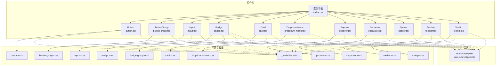
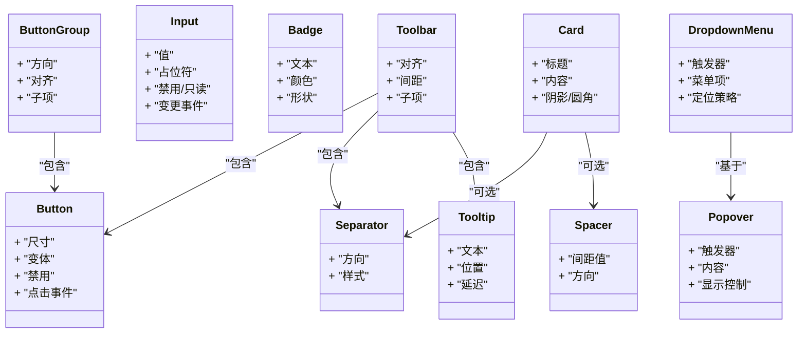
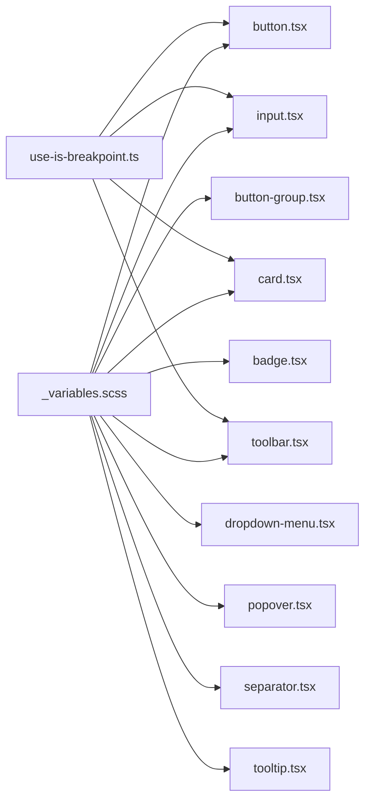

# 组件库文档

<cite>
**本文引用的文件**   
- [src/components/tiptap-ui-primitive/button.tsx](file://src/components/tiptap-ui-primitive/button.tsx)
- [src/components/tiptap-ui-primitive/button.scss](file://src/components/tiptap-ui-primitive/button.scss)
- [src/components/tiptap-ui-primitive/button-group.tsx](file://src/components/tiptap-ui-primitive/button-group.tsx)
- [src/components/tiptap-ui-primitive/button-group.scss](file://src/components/tiptap-ui-primitive/button-group.scss)
- [src/components/tiptap-ui-primitive/badge.tsx](file://src/components/tiptap-ui-primitive/badge.tsx)
- [src/components/tiptap-ui-primitive/badge.scss](file://src/components/tiptap-ui-primitive/badge.scss)
- [src/components/tiptap-ui-primitive/badge-group.scss](file://src/components/tiptap-ui-primitive/badge-group.scss)
- [src/components/tiptap-ui-primitive/card.tsx](file://src/components/tiptap-ui-primitive/card.tsx)
- [src/components/tiptap-ui-primitive/card.scss](file://src/components/tiptap-ui-primitive/card.scss)
- [src/components/tiptap-ui-primitive/input.tsx](file://src/components/tiptap-ui-primitive/input.tsx)
- [src/components/tiptap-ui-primitive/input.scss](file://src/components/tiptap-ui-primitive/input.scss)
- [src/components/tiptap-ui-primitive/dropdown-menu.tsx](file://src/components/tiptap-ui-primitive/dropdown-menu.tsx)
- [src/components/tiptap-ui-primitive/dropdown-menu.scss](file://src/components/tiptap-ui-primitive/dropdown-menu.scss)
- [src/components/tiptap-ui-primitive/popover.tsx](file://src/components/tiptap-ui-primitive/popover.tsx)
- [src/components/tiptap-ui-primitive/popover.scss](file://src/components/tiptap-ui-primitive/popover.scss)
- [src/components/tiptap-ui-primitive/separator.tsx](file://src/components/tiptap-ui-primitive/separator.tsx)
- [src/components/tiptap-ui-primitive/separator.scss](file://src/components/tiptap-ui-primitive/separator.scss)
- [src/components/tiptap-ui-primitive/spacer.tsx](file://src/components/tiptap-ui-primitive/spacer.tsx)
- [src/components/tiptap-ui-primitive/toolbar.tsx](file://src/components/tiptap-ui-primitive/toolbar.tsx)
- [src/components/tiptap-ui-primitive/toolbar.scss](file://src/components/tiptap-ui-primitive/toolbar.scss)
- [src/components/tiptap-ui-primitive/tooltip.tsx](file://src/components/tiptap-ui-primitive/tooltip.tsx)
- [src/components/tiptap-ui-primitive/tooltip.scss](file://src/components/tiptap-ui-primitive/tooltip.scss)
- [src/components/tiptap-ui-primitive/index.tsx](file://src/components/tiptap-ui-primitive/index.tsx)
- [src/hooks/use-is-breakpoint.ts](file://src/hooks/use-is-breakpoint.ts)
- [src/styles/_variables.scss](file://src/styles/_variables.scss)
</cite>

## 目录
1. [简介](#简介)
2. [项目结构](#项目结构)
3. [核心组件](#核心组件)
4. [架构总览](#架构总览)
5. [详细组件分析](#详细组件分析)
6. [依赖分析](#依赖分析)
7. [性能考虑](#性能考虑)
8. [故障排查指南](#故障排查指南)
9. [结论](#结论)
10. [附录](#附录)

## 简介
本文件为 FishWorker 前端组件库的权威文档，聚焦于可复用的 UI 基础组件、布局组件与图标系统。内容覆盖：
- 组件属性、事件、插槽与样式定制
- 组合模式与最佳实践
- 响应式适配方案与可访问性支持
- 自定义主题方法
- 性能考量与浏览器兼容性建议

目标读者包括前端开发者、UI 设计师与产品工程师，帮助快速上手并高质量地集成到业务页面中。

## 项目结构
组件库位于 src/components/tiptap-ui-primitive 目录，采用“原子化 + 组合”的组织方式：
- 原子组件：Button、Input、Badge、Card、Separator、Spacer、Tooltip、Popover、DropdownMenu、Toolbar 等
- 组合能力：通过 index.tsx 统一导出，便于按需引入
- 样式体系：每个组件配套 .scss 文件，全局变量集中在 styles/_variables.scss
- 响应式：提供 useIsBreakpoint Hook 用于断点判断

图表来源
- [src/components/tiptap-ui-primitive/index.tsx](file://src/components/tiptap-ui-primitive/index.tsx)
- [src/components/tiptap-ui-primitive/button.tsx](file://src/components/tiptap-ui-primitive/button.tsx)
- [src/components/tiptap-ui-primitive/button-group.tsx](file://src/components/tiptap-ui-primitive/button-group.tsx)
- [src/components/tiptap-ui-primitive/input.tsx](file://src/components/tiptap-ui-primitive/input.tsx)
- [src/components/tiptap-ui-primitive/badge.tsx](file://src/components/tiptap-ui-primitive/badge.tsx)
- [src/components/tiptap-ui-primitive/card.tsx](file://src/components/tiptap-ui-primitive/card.tsx)
- [src/components/tiptap-ui-primitive/dropdown-menu.tsx](file://src/components/tiptap-ui-primitive/dropdown-menu.tsx)
- [src/components/tiptap-ui-primitive/popover.tsx](file://src/components/tiptap-ui-primitive/popover.tsx)
- [src/components/tiptap-ui-primitive/separator.tsx](file://src/components/tiptap-ui-primitive/separator.tsx)
- [src/components/tiptap-ui-primitive/spacer.tsx](file://src/components/tiptap-ui-primitive/spacer.tsx)
- [src/components/tiptap-ui-primitive/toolbar.tsx](file://src/components/tiptap-ui-primitive/toolbar.tsx)
- [src/components/tiptap-ui-primitive/tooltip.tsx](file://src/components/tiptap-ui-primitive/tooltip.tsx)
- [src/styles/_variables.scss](file://src/styles/_variables.scss)
- [src/hooks/use-is-breakpoint.ts](file://src/hooks/use-is-breakpoint.ts)

章节来源
- [src/components/tiptap-ui-primitive/index.tsx](file://src/components/tiptap-ui-primitive/index.tsx)
- [src/styles/_variables.scss](file://src/styles/_variables.scss)
- [src/hooks/use-is-breakpoint.ts](file://src/hooks/use-is-breakpoint.ts)

## 核心组件
本节概述各组件的职责与典型用法要点（具体属性与事件见后文“详细组件分析”）：
- Button：触发操作的基础按钮，支持多种尺寸、变体与禁用态
- ButtonGroup：将多个按钮分组，常用于工具栏或筛选器
- Input：文本输入控件，支持占位符、禁用、只读等状态
- Badge：标签/徽章，用于计数、状态提示
- Card：卡片容器，承载一组相关内容
- DropdownMenu：下拉菜单，提供选项列表与交互
- Popover：浮层容器，承载任意内容并与触发元素关联
- Separator：分割线，用于视觉分隔
- Spacer：间距控制，用于布局节奏
- Toolbar：工具栏容器，组织一组操作按钮
- Tooltip：悬浮提示，提供简短说明

章节来源
- [src/components/tiptap-ui-primitive/button.tsx](file://src/components/tiptap-ui-primitive/button.tsx)
- [src/components/tiptap-ui-primitive/button-group.tsx](file://src/components/tiptap-ui-primitive/button-group.tsx)
- [src/components/tiptap-ui-primitive/input.tsx](file://src/components/tiptap-ui-primitive/input.tsx)
- [src/components/tiptap-ui-primitive/badge.tsx](file://src/components/tiptap-ui-primitive/badge.tsx)
- [src/components/tiptap-ui-primitive/card.tsx](file://src/components/tiptap-ui-primitive/card.tsx)
- [src/components/tiptap-ui-primitive/dropdown-menu.tsx](file://src/components/tiptap-ui-primitive/dropdown-menu.tsx)
- [src/components/tiptap-ui-primitive/popover.tsx](file://src/components/tiptap-ui-primitive/popover.tsx)
- [src/components/tiptap-ui-primitive/separator.tsx](file://src/components/tiptap-ui-primitive/separator.tsx)
- [src/components/tiptap-ui-primitive/spacer.tsx](file://src/components/tiptap-ui-primitive/spacer.tsx)
- [src/components/tiptap-ui-primitive/toolbar.tsx](file://src/components/tiptap-ui-primitive/toolbar.tsx)
- [src/components/tiptap-ui-primitive/tooltip.tsx](file://src/components/tiptap-ui-primitive/tooltip.tsx)

## 架构总览
组件库遵循“原子 + 组合”的设计原则：
- 原子组件最小粒度，单一职责，无副作用
- 组合组件由原子组件拼装而成，封装常见交互模式
- 样式通过 SCSS 模块化，使用全局变量实现主题一致性
- 响应式通过 Hook 暴露断点信息，组件内部或上层根据断点调整行为

图表来源
- [src/components/tiptap-ui-primitive/button.tsx](file://src/components/tiptap-ui-primitive/button.tsx)
- [src/components/tiptap-ui-primitive/button-group.tsx](file://src/components/tiptap-ui-primitive/button-group.tsx)
- [src/components/tiptap-ui-primitive/input.tsx](file://src/components/tiptap-ui-primitive/input.tsx)
- [src/components/tiptap-ui-primitive/badge.tsx](file://src/components/tiptap-ui-primitive/badge.tsx)
- [src/components/tiptap-ui-primitive/card.tsx](file://src/components/tiptap-ui-primitive/card.tsx)
- [src/components/tiptap-ui-primitive/dropdown-menu.tsx](file://src/components/tiptap-ui-primitive/dropdown-menu.tsx)
- [src/components/tiptap-ui-primitive/popover.tsx](file://src/components/tiptap-ui-primitive/popover.tsx)
- [src/components/tiptap-ui-primitive/separator.tsx](file://src/components/tiptap-ui-primitive/separator.tsx)
- [src/components/tiptap-ui-primitive/spacer.tsx](file://src/components/tiptap-ui-primitive/spacer.tsx)
- [src/components/tiptap-ui-primitive/toolbar.tsx](file://src/components/tiptap-ui-primitive/toolbar.tsx)
- [src/components/tiptap-ui-primitive/tooltip.tsx](file://src/components/tiptap-ui-primitive/tooltip.tsx)

## 详细组件分析

### Button 按钮
- 设计要点
  - 清晰的状态反馈：默认、悬停、按下、禁用
  - 语义化与可访问性：role、aria-*、键盘可达
  - 尺寸与变体满足不同场景
- 关键属性（示例字段名，实际以源码为准）
  - size: 尺寸（如 small/medium/large）
  - variant: 变体（如 primary/secondary/ghost）
  - disabled: 是否禁用
  - onClick: 点击回调
  - children: 按钮内容
- 事件处理
  - 点击事件透传原生 click
  - 键盘 Enter/Space 触发（若为可聚焦元素）
- 插槽与组合
  - 支持在 children 中放置图标、文字等
- 样式定制
  - 通过 CSS 变量或类名覆盖
  - 与 ButtonGroup/Toolbar 组合时保持间距一致
- 响应式
  - 在小屏下可切换为 icon-only 模式（由上层决定）
- 可访问性
  - 提供 aria-label 或 aria-describedby
  - 禁用态不可聚焦
- 使用示例路径
  - [src/components/tiptap-ui-primitive/button.tsx](file://src/components/tiptap-ui-primitive/button.tsx)
  - [src/components/tiptap-ui-primitive/button.scss](file://src/components/tiptap-ui-primitive/button.scss)

章节来源
- [src/components/tiptap-ui-primitive/button.tsx](file://src/components/tiptap-ui-primitive/button.tsx)
- [src/components/tiptap-ui-primitive/button.scss](file://src/components/tiptap-ui-primitive/button.scss)

### ButtonGroup 按钮组
- 设计要点
  - 将相关按钮聚合，提供统一的间距与对齐
- 关键属性
  - direction: 排列方向（水平/垂直）
  - align: 对齐方式
  - children: 子按钮集合
- 事件处理
  - 透传子按钮事件
- 样式定制
  - 通过 button-group.scss 中的变量与类名覆盖
- 响应式
  - 小屏自动换行或改为纵向排列
- 使用示例路径
  - [src/components/tiptap-ui-primitive/button-group.tsx](file://src/components/tiptap-ui-primitive/button-group.tsx)
  - [src/components/tiptap-ui-primitive/button-group.scss](file://src/components/tiptap-ui-primitive/button-group.scss)

章节来源
- [src/components/tiptap-ui-primitive/button-group.tsx](file://src/components/tiptap-ui-primitive/button-group.tsx)
- [src/components/tiptap-ui-primitive/button-group.scss](file://src/components/tiptap-ui-primitive/button-group.scss)

### Input 输入框
- 设计要点
  - 清晰的输入状态：默认、聚焦、错误、禁用、只读
  - 与 Label、HelperText 配合提升可访问性
- 关键属性
  - value: 当前值
  - placeholder: 占位符
  - disabled/readonly: 状态控制
  - onChange/onBlur/onFocus: 输入事件
  - error/helperText: 校验与提示
- 事件处理
  - 标准表单事件透传
- 样式定制
  - 通过 input.scss 的变量与类名覆盖边框、背景、焦点环
- 响应式
  - 宽度自适应，移动端增大触控区域
- 可访问性
  - 关联 label id，错误时设置 aria-invalid
- 使用示例路径
  - [src/components/tiptap-ui-primitive/input.tsx](file://src/components/tiptap-ui-primitive/input.tsx)
  - [src/components/tiptap-ui-primitive/input.scss](file://src/components/tiptap-ui-primitive/input.scss)

章节来源
- [src/components/tiptap-ui-primitive/input.tsx](file://src/components/tiptap-ui-primitive/input.tsx)
- [src/components/tiptap-ui-primitive/input.scss](file://src/components/tiptap-ui-primitive/input.scss)

### Badge 徽章
- 设计要点
  - 轻量提示，常用于计数、状态标记
- 关键属性
  - text: 文本
  - color: 颜色变体
  - shape: 形状（圆角/胶囊）
- 样式定制
  - badge.scss 与 badge-group.scss 提供主题变量
- 组合模式
  - 与 Button、Tab 等组合展示状态
- 使用示例路径
  - [src/components/tiptap-ui-primitive/badge.tsx](file://src/components/tiptap-ui-primitive/badge.tsx)
  - [src/components/tiptap-ui-primitive/badge.scss](file://src/components/tiptap-ui-primitive/badge.scss)
  - [src/components/tiptap-ui-primitive/badge-group.scss](file://src/components/tiptap-ui-primitive/badge-group.scss)

章节来源
- [src/components/tiptap-ui-primitive/badge.tsx](file://src/components/tiptap-ui-primitive/badge.tsx)
- [src/components/tiptap-ui-primitive/badge.scss](file://src/components/tiptap-ui-primitive/badge.scss)
- [src/components/tiptap-ui-primitive/badge-group.scss](file://src/components/tiptap-ui-primitive/badge-group.scss)

### Card 卡片
- 设计要点
  - 承载一组相关内容，具备明确的边界与层次
- 关键属性
  - title: 标题
  - actions: 操作区
  - shadow/radius: 外观控制
- 组合模式
  - 内部可嵌套 Separator、Spacer、Button 等
- 样式定制
  - card.scss 提供阴影、圆角、内边距变量
- 使用示例路径
  - [src/components/tiptap-ui-primitive/card.tsx](file://src/components/tiptap-ui-primitive/card.tsx)
  - [src/components/tiptap-ui-primitive/card.scss](file://src/components/tiptap-ui-primitive/card.scss)

章节来源
- [src/components/tiptap-ui-primitive/card.tsx](file://src/components/tiptap-ui-primitive/card.tsx)
- [src/components/tiptap-ui-primitive/card.scss](file://src/components/tiptap-ui-primitive/card.scss)

### DropdownMenu 下拉菜单
- 设计要点
  - 提供可聚焦的菜单项，支持键盘导航
- 关键属性
  - trigger: 触发器
  - items: 菜单项数组
  - onSelect: 选中回调
  - placement: 定位策略
- 事件处理
  - 键盘上下选择、回车确认、Esc 关闭
- 样式定制
  - dropdown-menu.scss 控制菜单外观与层级
- 可访问性
  - role="menu"/role="menuitem"，aria-activedescendant 联动
- 使用示例路径
  - [src/components/tiptap-ui-primitive/dropdown-menu.tsx](file://src/components/tiptap-ui-primitive/dropdown-menu.tsx)
  - [src/components/tiptap-ui-primitive/dropdown-menu.scss](file://src/components/tiptap-ui-primitive/dropdown-menu.scss)

章节来源
- [src/components/tiptap-ui-primitive/dropdown-menu.tsx](file://src/components/tiptap-ui-primitive/dropdown-menu.tsx)
- [src/components/tiptap-ui-primitive/dropdown-menu.scss](file://src/components/tiptap-ui-primitive/dropdown-menu.scss)

### Popover 浮层
- 设计要点
  - 轻量浮层，承载富内容或与 Trigger 解耦
- 关键属性
  - visible: 显隐控制
  - trigger: 触发元素
  - content: 浮层内容
  - onOpenChange: 显隐变化回调
- 事件处理
  - 点击外部关闭、Esc 关闭
- 样式定制
  - popover.scss 控制阴影、圆角、箭头
- 可访问性
  - role="dialog" 或 "tooltip" 视内容而定，focus trap 可选
- 使用示例路径
  - [src/components/tiptap-ui-primitive/popover.tsx](file://src/components/tiptap-ui-primitive/popover.tsx)
  - [src/components/tiptap-ui-primitive/popover.scss](file://src/components/tiptap-ui-primitive/popover.scss)

章节来源
- [src/components/tiptap-ui-primitive/popover.tsx](file://src/components/tiptap-ui-primitive/popover.tsx)
- [src/components/tiptap-ui-primitive/popover.scss](file://src/components/tiptap-ui-primitive/popover.scss)

### Separator 分割线
- 设计要点
  - 用于区块间的视觉分隔
- 关键属性
  - orientation: 方向（水平/垂直）
  - variant: 样式变体
- 样式定制
  - separator.scss 控制线条粗细与颜色
- 使用示例路径
  - [src/components/tiptap-ui-primitive/separator.tsx](file://src/components/tiptap-ui-primitive/separator.tsx)
  - [src/components/tiptap-ui-primitive/separator.scss](file://src/components/tiptap-ui-primitive/separator.scss)

章节来源
- [src/components/tiptap-ui-primitive/separator.tsx](file://src/components/tiptap-ui-primitive/separator.tsx)
- [src/components/tiptap-ui-primitive/separator.scss](file://src/components/tiptap-ui-primitive/separator.scss)

### Spacer 间距
- 设计要点
  - 提供一致的间距语义，避免硬编码像素
- 关键属性
  - size: 间距等级
  - direction: 方向
- 使用示例路径
  - [src/components/tiptap-ui-primitive/spacer.tsx](file://src/components/tiptap-ui-primitive/spacer.tsx)

章节来源
- [src/components/tiptap-ui-primitive/spacer.tsx](file://src/components/tiptap-ui-primitive/spacer.tsx)

### Toolbar 工具栏
- 设计要点
  - 将一组操作按钮、分隔符、提示等组织在一起
- 关键属性
  - align: 对齐方式
  - gap: 间距
  - children: 子项集合
- 组合模式
  - 与 Button、Separator、Tooltip 组合
- 样式定制
  - toolbar.scss 控制背景、边框、阴影
- 使用示例路径
  - [src/components/tiptap-ui-primitive/toolbar.tsx](file://src/components/tiptap-ui-primitive/toolbar.tsx)
  - [src/components/tiptap-ui-primitive/toolbar.scss](file://src/components/tiptap-ui-primitive/toolbar.scss)

章节来源
- [src/components/tiptap-ui-primitive/toolbar.tsx](file://src/components/tiptap-ui-primitive/toolbar.tsx)
- [src/components/tiptap-ui-primitive/toolbar.scss](file://src/components/tiptap-ui-primitive/toolbar.scss)

### Tooltip 提示
- 设计要点
  - 对复杂控件提供简短说明，避免遮挡重要信息
- 关键属性
  - text: 提示文本
  - position: 相对触发器的位置
  - delay: 显示延迟
- 样式定制
  - tooltip.scss 控制背景、字体、阴影
- 可访问性
  - aria-describedby 指向提示节点
- 使用示例路径
  - [src/components/tiptap-ui-primitive/tooltip.tsx](file://src/components/tiptap-ui-primitive/tooltip.tsx)
  - [src/components/tiptap-ui-primitive/tooltip.scss](file://src/components/tiptap-ui-primitive/tooltip.scss)

章节来源
- [src/components/tiptap-ui-primitive/tooltip.tsx](file://src/components/tiptap-ui-primitive/tooltip.tsx)
- [src/components/tiptap-ui-primitive/tooltip.scss](file://src/components/tiptap-ui-primitive/tooltip.scss)

### 图标系统（概览）
- 图标作为原子元素，通常与 Button、Toolbar 等组合使用
- 命名规范：语义化名称，按功能分类存放
- 使用建议：
  - 与文案并列时确保视觉权重一致
  - 在可访问性场景中提供 aria-label
- 参考目录
  - [src/components/tiptap-icons](file://src/components/tiptap-icons)

章节来源
- [src/components/tiptap-icons](file://src/components/tiptap-icons)

## 依赖分析
- 组件间依赖
  - Toolbar 组合 Button、Separator、Tooltip
  - DropdownMenu 基于 Popover 构建
  - Card 可组合 Separator、Spacer、Button
- 样式依赖
  - 所有组件共享 _variables.scss 中的主题变量
- 响应式依赖
  - 组件可通过 useIsBreakpoint 获取断点信息，进行条件渲染或样式切换

图表来源
- [src/styles/_variables.scss](file://src/styles/_variables.scss)
- [src/components/tiptap-ui-primitive/button.tsx](file://src/components/tiptap-ui-primitive/button.tsx)
- [src/components/tiptap-ui-primitive/button-group.tsx](file://src/components/tiptap-ui-primitive/button-group.tsx)
- [src/components/tiptap-ui-primitive/input.tsx](file://src/components/tiptap-ui-primitive/input.tsx)
- [src/components/tiptap-ui-primitive/badge.tsx](file://src/components/tiptap-ui-primitive/badge.tsx)
- [src/components/tiptap-ui-primitive/card.tsx](file://src/components/tiptap-ui-primitive/card.tsx)
- [src/components/tiptap-ui-primitive/dropdown-menu.tsx](file://src/components/tiptap-ui-primitive/dropdown-menu.tsx)
- [src/components/tiptap-ui-primitive/popover.tsx](file://src/components/tiptap-ui-primitive/popover.tsx)
- [src/components/tiptap-ui-primitive/separator.tsx](file://src/components/tiptap-ui-primitive/separator.tsx)
- [src/components/tiptap-ui-primitive/toolbar.tsx](file://src/components/tiptap-ui-primitive/toolbar.tsx)
- [src/components/tiptap-ui-primitive/tooltip.tsx](file://src/components/tiptap-ui-primitive/tooltip.tsx)
- [src/hooks/use-is-breakpoint.ts](file://src/hooks/use-is-breakpoint.ts)

章节来源
- [src/styles/_variables.scss](file://src/styles/_variables.scss)
- [src/hooks/use-is-breakpoint.ts](file://src/hooks/use-is-breakpoint.ts)

## 性能考虑
- 渲染优化
  - 避免在高频事件中创建新对象；必要时使用 useMemo/useCallback
  - 大列表场景下对 DropdownMenu/Toolbar 的子项做虚拟化或分页
- 样式与主题
  - 优先使用 CSS 变量减少重排；避免在运行时频繁修改大量样式
- 可访问性与交互
  - 合理设置 tabindex 与 focus trap，避免不必要的 reflow
- 资源加载
  - 图标按需导入，避免打包体积膨胀

[本节为通用指导，不直接分析具体文件]

## 故障排查指南
- 常见问题
  - 样式未生效：检查是否引入对应组件的 .scss 文件，以及全局变量是否被正确覆盖
  - 键盘不可用：确认组件是否为可聚焦元素，且设置了正确的 role/aria-*
  - 浮层错位：检查触发器与父容器的定位上下文，必要时调整 placement
- 调试建议
  - 使用浏览器开发者工具检查 computed styles 与 DOM 结构
  - 在控制台打印组件 props 与事件参数，验证数据流
- 参考路径
  - [src/components/tiptap-ui-primitive/index.tsx](file://src/components/tiptap-ui-primitive/index.tsx)

章节来源
- [src/components/tiptap-ui-primitive/index.tsx](file://src/components/tiptap-ui-primitive/index.tsx)

## 结论
FishWorker 组件库以原子化与组合为核心，提供一套风格统一、可访问性强、易于定制的 UI 基础能力。通过统一的变量与 Hook，组件具备良好的响应式与主题扩展能力。建议在项目中优先复用这些组件，以提升一致性与开发效率。

[本节为总结性内容，不直接分析具体文件]

## 附录

### 设计原则
- 一致性：统一的间距、色彩、字号与动效
- 可访问性：语义化标签、键盘可达、屏幕阅读器友好
- 可扩展性：通过变量与类名覆盖实现主题定制
- 组合优先：复杂交互由简单原子组件拼装

### 响应式适配方案
- 使用 useIsBreakpoint 获取断点信息，在组件或上层逻辑中切换布局与交互
- 在小屏设备上优先保证触控区域与可读性

章节来源
- [src/hooks/use-is-breakpoint.ts](file://src/hooks/use-is-breakpoint.ts)

### 可访问性支持清单
- 按钮：role、aria-disabled、键盘触发
- 输入框：label 关联、aria-invalid、错误提示
- 下拉菜单：role="menu"/"menuitem"、键盘导航
- 浮层：role 与 focus management
- 提示：aria-describedby

章节来源
- [src/components/tiptap-ui-primitive/button.tsx](file://src/components/tiptap-ui-primitive/button.tsx)
- [src/components/tiptap-ui-primitive/input.tsx](file://src/components/tiptap-ui-primitive/input.tsx)
- [src/components/tiptap-ui-primitive/dropdown-menu.tsx](file://src/components/tiptap-ui-primitive/dropdown-menu.tsx)
- [src/components/tiptap-ui-primitive/popover.tsx](file://src/components/tiptap-ui-primitive/popover.tsx)
- [src/components/tiptap-ui-primitive/tooltip.tsx](file://src/components/tiptap-ui-primitive/tooltip.tsx)

### 自定义主题指南
- 覆盖全局变量：在 _variables.scss 中定义主题色、字号、圆角等
- 组件级覆盖：通过组件专属 .scss 文件中的类名覆盖局部样式
- 动态主题：结合 CSS 变量在运行时切换主题

章节来源
- [src/styles/_variables.scss](file://src/styles/_variables.scss)
- [src/components/tiptap-ui-primitive/button.scss](file://src/components/tiptap-ui-primitive/button.scss)
- [src/components/tiptap-ui-primitive/input.scss](file://src/components/tiptap-ui-primitive/input.scss)
- [src/components/tiptap-ui-primitive/card.scss](file://src/components/tiptap-ui-primitive/card.scss)
- [src/components/tiptap-ui-primitive/dropdown-menu.scss](file://src/components/tiptap-ui-primitive/dropdown-menu.scss)
- [src/components/tiptap-ui-primitive/popover.scss](file://src/components/tiptap-ui-primitive/popover.scss)
- [src/components/tiptap-ui-primitive/toolbar.scss](file://src/components/tiptap-ui-primitive/toolbar.scss)
- [src/components/tiptap-ui-primitive/tooltip.scss](file://src/components/tiptap-ui-primitive/tooltip.scss)

### 浏览器兼容性建议
- 现代浏览器（Chrome/Firefox/Safari/Edge 最新两个版本）
- 如需兼容旧版 IE，需额外 polyfill 与降级策略（本项目未直接使用高级特性）

[本节为通用指导，不直接分析具体文件]