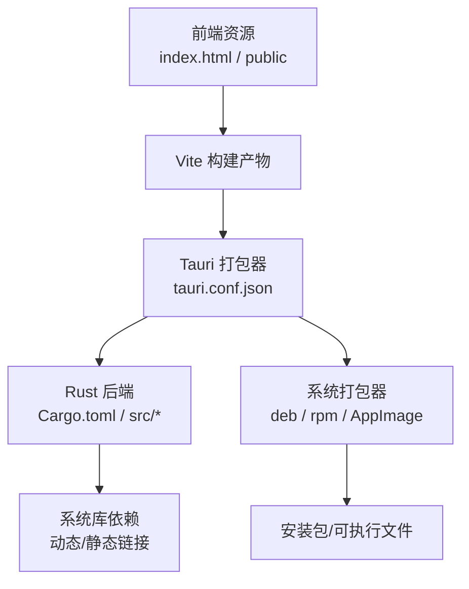
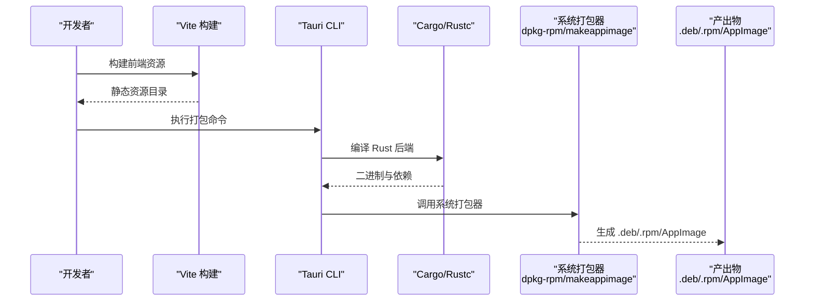
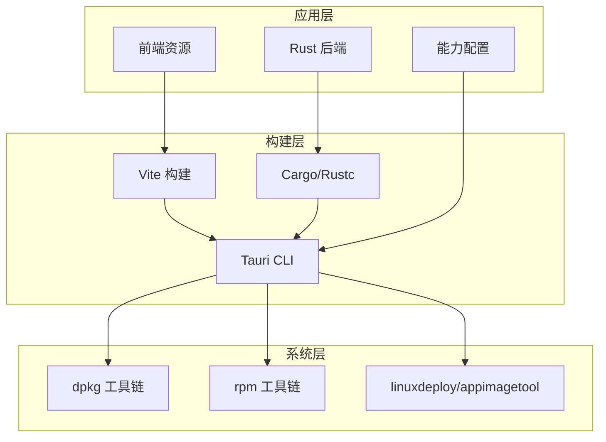

# Linux 平台打包

<cite>
**本文引用的文件**   
- [tauri.conf.json](file://src-tauri/tauri.conf.json)
- [Cargo.toml](file://src-tauri/Cargo.toml)
- [build.rs](file://src-tauri/build.rs)
- [lib.rs](file://src-tauri/src/lib.rs)
- [main.rs](file://src-tauri/src/main.rs)
- [capabilities/default.json](file://src-tauri/capabilities/default.json)
</cite>

## 目录
1. [简介](#简介)
2. [项目结构](#项目结构)
3. [核心组件](#核心组件)
4. [架构总览](#架构总览)
5. [详细组件分析](#详细组件分析)
6. [依赖分析](#依赖分析)
7. [性能考虑](#性能考虑)
8. [故障排查指南](#故障排查指南)
9. [结论](#结论)
10. [附录](#附录)

## 简介
本文件面向 FishWorker 在 Linux 平台的打包与分发，聚焦 Tauri 构建配置、依赖库管理以及多包格式（deb、rpm、AppImage）的构建与发布。文档涵盖：
- Tauri 在 Linux 上的构建配置要点
- deb/rpm/AppImage 的构建流程与差异
- 各发行版特定要求与兼容性注意事项
- 桌面环境集成（.desktop、MIME 类型注册、系统集成）
- 不同发行版的构建环境与依赖安装指引
- 静态链接与运行时依赖处理策略
- 权限模型与安全考量
- 打包脚本与分发策略建议

## 项目结构
FishWorker 使用 Tauri 作为跨平台桌面框架，Linux 打包相关的关键配置集中在 src-tauri 目录中：
- tauri.conf.json：Tauri 应用元数据、窗口、图标、插件、打包目标等
- Cargo.toml：Rust 后端依赖与特性开关
- build.rs：构建期脚本（如代码生成、资源预处理）
- capabilities/default.json：能力与权限控制（安全沙箱）
- src/main.rs、src/lib.rs：Tauri 入口与命令暴露点

图表来源
- [tauri.conf.json](file://src-tauri/tauri.conf.json)
- [Cargo.toml](file://src-tauri/Cargo.toml)
- [build.rs](file://src-tauri/build.rs)

章节来源
- [tauri.conf.json](file://src-tauri/tauri.conf.json)
- [Cargo.toml](file://src-tauri/Cargo.toml)
- [build.rs](file://src-tauri/build.rs)
- [lib.rs](file://src-tauri/src/lib.rs)
- [main.rs](file://src-tauri/src/main.rs)

## 核心组件
- Tauri 配置（tauri.conf.json）
  - 定义应用名称、版本、描述、图标、窗口行为、协议、插件、打包目标等
  - 指定 Linux 打包目标（deb、rpm、AppImage）及输出目录
  - 控制是否启用静态链接、系统库打包策略
- Rust 后端（Cargo.toml、src/*）
  - 声明系统依赖（如数据库驱动、加密库），决定是否需要系统头文件或动态库
  - 通过特性开关影响编译产物大小与功能
- 构建脚本（build.rs）
  - 可在构建阶段生成代码或拷贝资源，影响最终二进制与资源布局
- 能力与权限（capabilities/default.json）
  - 限制 IPC 访问范围、文件系统路径、网络访问等，提升安全性

章节来源
- [tauri.conf.json](file://src-tauri/tauri.conf.json)
- [Cargo.toml](file://src-tauri/Cargo.toml)
- [build.rs](file://src-tauri/build.rs)
- [capabilities/default.json](file://src-tauri/capabilities/default.json)
- [lib.rs](file://src-tauri/src/lib.rs)
- [main.rs](file://src-tauri/src/main.rs)

## 架构总览
下图展示从源码到 Linux 安装包的整体流程，包括前端构建、Rust 编译、Tauri 打包与系统打包器协作。

图表来源
- [tauri.conf.json](file://src-tauri/tauri.conf.json)
- [Cargo.toml](file://src-tauri/Cargo.toml)

## 详细组件分析

### Tauri 打包配置（tauri.conf.json）
- 关键项说明
  - 应用元信息：名称、版本、描述、作者、许可证等
  - 窗口与显示：默认尺寸、全屏、透明度、标题栏样式
  - 图标与资源：应用图标集、启动画面、内置资源
  - 协议与插件：自定义协议、Tauri 插件启用
  - 打包目标：Linux 下选择 deb/rpm/AppImage，并设置输出目录
  - 静态链接：是否将系统库静态化以减少运行时依赖
- 常见调整
  - 为不同发行版定制图标与 MIME 类型
  - 针对最小化体积开启压缩与裁剪未用特性
  - 为调试与发布分离配置不同的构建参数

章节来源
- [tauri.conf.json](file://src-tauri/tauri.conf.json)

### Rust 后端与依赖（Cargo.toml、src/*）
- 依赖管理
  - 第三方库：数据库驱动、序列化、加密等
  - 系统依赖：需要 pkg-config 或 vcpkg 解析的头文件与动态库
- 特性开关
  - 通过 features 控制可选功能，减少二进制体积
- 构建脚本（build.rs）
  - 用于生成代码、拷贝资源、预处理配置文件
  - 注意在不同发行版上保持兼容（路径、工具链）

章节来源
- [Cargo.toml](file://src-tauri/Cargo.toml)
- [build.rs](file://src-tauri/build.rs)
- [lib.rs](file://src-tauri/src/lib.rs)
- [main.rs](file://src-tauri/src/main.rs)

### 能力与权限（capabilities/default.json）
- 作用
  - 限制 IPC 命令、文件系统访问、网络请求等
- 最佳实践
  - 仅开放必要能力，遵循最小权限原则
  - 对敏感操作进行白名单校验

章节来源
- [capabilities/default.json](file://src-tauri/capabilities/default.json)

### 桌面环境集成
- .desktop 文件
  - 提供应用名称、图标、分类、启动命令、MIME 关联
  - 放置位置：/usr/share/applications 或通过包管理器安装时自动部署
- MIME 类型注册
  - 在包内声明支持的 MIME 类型，使系统能正确关联打开方式
  - 可通过 desktop-file-utils 验证与更新缓存
- 系统集成
  - 图标主题支持（SVG/PNG 多分辨率）
  - 全局快捷键、通知、托盘（视具体实现）

章节来源
- [tauri.conf.json](file://src-tauri/tauri.conf.json)

### 包格式与发行版适配

#### deb 包（Debian/Ubuntu）
- 构建要求
  - 安装 dpkg-dev、fakeroot、dh-make 等打包工具
  - 确保系统库满足运行时需求（glibc、X11/Wayland、GTK 等）
- 兼容性
  - 优先在较新 LTS 发行版构建以获得更广泛兼容
  - 若需旧版兼容，可使用容器或 chroot 模拟目标环境
- 安装与卸载
  - 使用 apt/dpkg 安装；升级时注意依赖冲突

章节来源
- [tauri.conf.json](file://src-tauri/tauri.conf.json)

#### rpm 包（Red Hat/CentOS/Fedora）
- 构建要求
  - 安装 rpm-build、rpmlint、mock（可选）
  - Fedora 建议使用 dnf，CentOS/RHEL 使用 yum/dnf
- 兼容性
  - glibc 版本与系统库 ABI 需注意
  - 使用 mock 构建可保证一致性
- 安装与卸载
  - 使用 dnf/yum 安装；升级时处理依赖变更

章节来源
- [tauri.conf.json](file://src-tauri/tauri.conf.json)

#### AppImage
- 构建要求
  - 安装 linuxdeployqt 或 appimagetool
  - 确保运行期依赖被正确收集与嵌入
- 兼容性
  - 以“自包含”为目标，减少对外部库依赖
  - 测试在主流发行版（Ubuntu、Fedora、Arch）上运行
- 分发
  - 直接提供可执行 AppImage，用户无需安装即可运行

章节来源
- [tauri.conf.json](file://src-tauri/tauri.conf.json)

### 构建环境与依赖安装指南

- Debian/Ubuntu
  - 基础工具：git、curl、wget、build-essential
  - Rust：rustup + cargo
  - Tauri：按官方指南安装
  - 打包工具：dpkg-dev、fakeroot、dh-make
  - 系统库：pkg-config、libssl-dev、libsqlite3-dev、libdbus-1-dev、libgtk-3-dev、libwebkit2gtk-4.1-dev（根据实际依赖）
- Red Hat/CentOS/Fedora
  - 基础工具：git、curl、wget、gcc、make
  - Rust：rustup + cargo
  - Tauri：按官方指南安装
  - 打包工具：rpm-build、rpmlint、mock（可选）
  - 系统库：openssl-devel、sqlite-devel、dbus-devel、gtk3-devel、webkit2gtk4.1-devel（根据实际依赖）
- Arch Linux
  - 基础工具：base-devel、git、curl
  - Rust：rustup + cargo
  - Tauri：按官方指南安装
  - 打包工具：packer/yay 辅助构建 PKGBUILD（可选）
  - 系统库：openssl、sqlite、dbus、gtk3、webkit2gtk（根据实际依赖）

章节来源
- [Cargo.toml](file://src-tauri/Cargo.toml)
- [tauri.conf.json](file://src-tauri/tauri.conf.json)

### 静态链接与运行时依赖处理
- 静态链接
  - 优点：减少运行时依赖，便于分发
  - 风险：二进制体积增大、与系统库 ABI 不兼容
  - 适用场景：AppImage 或单文件分发
- 动态链接
  - 优点：体积小、利用系统库更新
  - 风险：需确保目标系统存在所需库
  - 适用场景：deb/rpm 包，配合发行版依赖管理
- 混合策略
  - 核心库静态化，UI 库动态链接
  - 使用 ldd/readelf 检查依赖，结合 ldconfig 或 rpath 调整

章节来源
- [Cargo.toml](file://src-tauri/Cargo.toml)
- [tauri.conf.json](file://src-tauri/tauri.conf.json)

### 权限模型与安全考虑
- 最小权限原则
  - 仅在 capabilities 中开放必要能力
  - 对文件系统路径、网络访问进行白名单限制
- 输入校验与错误处理
  - 对用户输入与外部数据进行严格校验
  - 避免注入与越权访问
- 安全更新
  - 定期更新依赖与系统库
  - 提供签名与完整性校验机制

章节来源
- [capabilities/default.json](file://src-tauri/capabilities/default.json)

## 依赖分析
下图展示 Tauri 打包过程中主要模块与外部工具的依赖关系。

图表来源
- [tauri.conf.json](file://src-tauri/tauri.conf.json)
- [Cargo.toml](file://src-tauri/Cargo.toml)

章节来源
- [tauri.conf.json](file://src-tauri/tauri.conf.json)
- [Cargo.toml](file://src-tauri/Cargo.toml)

## 性能考虑
- 构建优化
  - 使用增量构建与并行编译（cargo -j）
  - 关闭不必要的调试符号与日志
- 运行时优化
  - 按需加载资源，减少首屏时间
  - 合理设置窗口与渲染选项，降低 CPU/GPU 占用
- 包体积优化
  - 启用压缩与裁剪未用特性
  - 静态链接权衡体积与兼容性

[本节为通用指导，不直接分析具体文件]

## 故障排查指南
- 构建失败
  - 检查系统库是否安装完整（pkg-config/vcpkg）
  - 确认 Rust 工具链与 Tauri 版本匹配
- 运行时崩溃
  - 使用 ldd 检查缺失的动态库
  - 查看系统日志（journalctl）定位错误
- 桌面集成问题
  - 验证 .desktop 文件语法与图标路径
  - 使用 update-desktop-database 刷新缓存
- 权限问题
  - 检查 capabilities 配置是否过于宽松或不足
  - 确认用户权限与 SELinux/AppArmor 策略

章节来源
- [capabilities/default.json](file://src-tauri/capabilities/default.json)
- [tauri.conf.json](file://src-tauri/tauri.conf.json)

## 结论
通过合理的 Tauri 配置、依赖管理与打包策略，FishWorker 可在多种 Linux 发行版上稳定构建与分发。建议采用“动态链接为主、静态链接为辅”的策略，并结合 deb/rpm/AppImage 三种包格式覆盖不同用户群体。同时，强化权限控制与安全更新机制，提升整体安全性与可维护性。

[本节为总结性内容，不直接分析具体文件]

## 附录

### 打包脚本与流水线建议
- 本地开发
  - 一键构建脚本：封装 Vite 构建、Rust 编译、Tauri 打包
  - 多目标并行：同时生成 deb/rpm/AppImage
- CI/CD
  - 多发行版矩阵：Ubuntu LTS、Fedora、CentOS/RHEL
  - 缓存依赖与构建产物，缩短流水线时间
  - 自动化签名与校验，生成发布清单
- 分发策略
  - 官网下载：提供 AppImage 与源码包
  - 软件源：上传至发行版仓库（PPA/COPR）
  - 包管理器：提供 snap/flatpak（可选）

[本节为概念性内容，不直接分析具体文件]