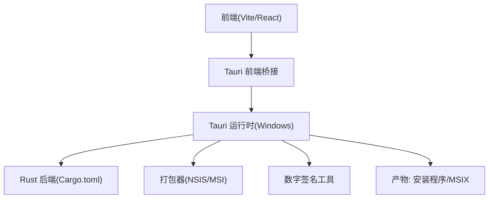
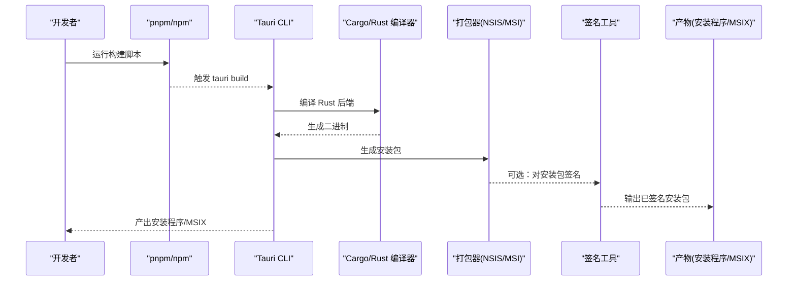
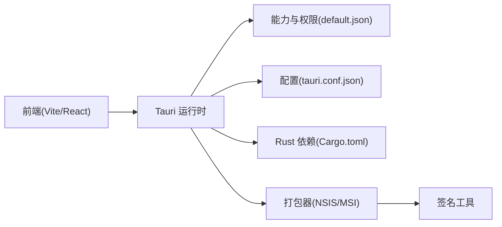

# Windows 平台打包

<cite>
**本文引用的文件**
- [tauri.conf.json](file://src-tauri/tauri.conf.json)
- [Cargo.toml](file://src-tauri/Cargo.toml)
- [build.rs](file://src-tauri/build.rs)
- [main.rs](file://src-tauri/src/main.rs)
- [lib.rs](file://src-tauri/src/lib.rs)
- [default.json](file://src-tauri/capabilities/default.json)
- [package.json](file://package.json)
</cite>

## 目录
1. [简介](#简介)
2. [项目结构](#项目结构)
3. [核心组件](#核心组件)
4. [架构总览](#架构总览)
5. [详细组件分析](#详细组件分析)
6. [依赖关系分析](#依赖关系分析)
7. [性能与体积优化](#性能与体积优化)
8. [故障排查指南](#故障排查指南)
9. [结论](#结论)
10. [附录](#附录)

## 简介
本文件面向 FishWorker 在 Windows 平台的打包与发布，覆盖 Tauri 构建配置、目标架构（x86_64、ARM64）、安装包制作（NSIS/Inno Setup）、数字签名与证书管理、Windows 特定权限与资源处理、Windows Store 发布准备与 MSIX 支持、图标与元数据、版本管理与构建脚本示例，以及常见问题解决方案。文档以仓库现有配置为依据，提供可操作的步骤与参考路径，便于本地与 CI 环境落地。

## 项目结构
FishWorker 采用 Tauri + Rust 后端 + Vite/React 前端的双端工程组织方式。Windows 打包相关的关键位置如下：
- src-tauri/tauri.conf.json：Tauri 应用元数据、窗口、协议、插件、打包器（NSIS/MSI）等配置入口
- src-tauri/Cargo.toml：Rust 依赖与特性开关（如 windows-targets、system-tray 等）
- src-tauri/build.rs：可选的预构建脚本（用于生成代码或拷贝资源）
- src-tauri/src/main.rs / lib.rs：Tauri 应用入口与命令注册
- src-tauri/capabilities/default.json：能力与权限策略（默认能力集）
- package.json：前端构建与 npm/pnpm 脚本（可与 Tauri CLI 集成）

[本节为概念性说明，不直接分析具体文件]

## 核心组件
- Tauri 配置（tauri.conf.json）
  - 负责应用名称、版本号、产品标识符、窗口行为、协议白名单、插件、打包器选择与参数、图标与资源路径等。
  - Windows 打包器通常使用 NSIS 或 MSI；如需 MSIX，可通过外部流程将 Tauri 产物转换为 MSIX。
- Rust 依赖与目标（Cargo.toml）
  - 通过 target 与 features 控制编译目标（x86_64-pc-windows-msvc、aarch64-pc-windows-msvc）。
  - 按需启用系统托盘、文件系统访问、网络请求等能力。
- 构建脚本（build.rs）
  - 可在编译前执行自定义逻辑，例如复制静态资源、生成配置文件或调用外部工具。
- 能力与权限（capabilities/default.json）
  - 定义默认能力集合，控制 IPC 暴露的命令、窗口与文件系统访问范围等。
- 应用入口（main.rs/lib.rs）
  - 初始化 Tauri 应用、注册命令、挂载 UI、处理生命周期事件。

章节来源
- [tauri.conf.json](file://src-tauri/tauri.conf.json)
- [Cargo.toml](file://src-tauri/Cargo.toml)
- [build.rs](file://src-tauri/build.rs)
- [main.rs](file://src-tauri/src/main.rs)
- [lib.rs](file://src-tauri/src/lib.rs)
- [default.json](file://src-tauri/capabilities/default.json)

## 架构总览
下图展示从源码到 Windows 安装包的端到端流程，包括前端构建、Rust 编译、打包器生成安装包、签名与产物输出。

图表来源
- [tauri.conf.json](file://src-tauri/tauri.conf.json)
- [Cargo.toml](file://src-tauri/Cargo.toml)
- [build.rs](file://src-tauri/build.rs)

章节来源
- [tauri.conf.json](file://src-tauri/tauri.conf.json)
- [Cargo.toml](file://src-tauri/Cargo.toml)
- [build.rs](file://src-tauri/build.rs)

## 详细组件分析

### Tauri 配置与 Windows 打包器
- 打包器选择
  - 使用 NSIS 或 MSI 作为 Windows 安装包生成器。
  - 若需 MSIX，可将 Tauri 产物转换为 MSIX（见“Windows Store 发布准备”）。
- 关键配置项
  - 应用元数据：名称、版本号、产品标识符（建议遵循反向域名格式）。
  - 图标与资源：Windows 图标建议使用 .ico；资源文件路径需在配置中声明。
  - 协议与白名单：对外部协议与 URL 进行白名单控制。
  - 打包器参数：NSIS 安装界面文案、快捷方式、卸载行为等。
- 典型流程
  - 修改 tauri.conf.json → 执行构建 → 生成安装包 → 可选签名 → 分发。

章节来源
- [tauri.conf.json](file://src-tauri/tauri.conf.json)

### Rust 目标架构与交叉编译
- 目标架构
  - x86_64：适用于传统 Intel/AMD 桌面设备。
  - ARM64：适用于基于 ARM 的 Windows 设备（如 Surface Pro X）。
- 配置要点
  - 在 Cargo.toml 中指定目标三元组（如 x86_64-pc-windows-msvc、aarch64-pc-windows-msvc）。
  - 在 CI 环境中安装对应工具链并设置环境变量。
- 注意事项
  - 第三方库需支持相应目标；必要时调整 feature 或替换依赖。
  - 交叉编译时注意动态链接与运行时依赖。

章节来源
- [Cargo.toml](file://src-tauri/Cargo.toml)

### 能力与权限（capabilities/default.json）
- 作用
  - 定义默认能力集合，控制 IPC 命令暴露、窗口与文件系统访问范围等。
- 建议
  - 最小权限原则：仅开放必要命令与路径。
  - 针对 Windows 特殊路径（如 Program Files、AppData）谨慎授权。
  - 结合协议白名单限制外部协议调用。

章节来源
- [default.json](file://src-tauri/capabilities/default.json)

### 应用入口与生命周期（main.rs/lib.rs）
- 职责
  - 初始化 Tauri 应用、注册命令、挂载 UI、处理启动/退出事件。
- Windows 相关
  - 首次启动检查与升级提示。
  - 系统托盘与通知（如启用 system-tray 特性）。
  - 与 Windows 安全模型交互（UAC、管理员权限）。

章节来源
- [main.rs](file://src-tauri/src/main.rs)
- [lib.rs](file://src-tauri/src/lib.rs)

### 构建脚本（build.rs）
- 用途
  - 在编译前执行自定义逻辑，例如复制静态资源、生成配置文件、预处理图标或语言包。
- 建议
  - 保持幂等与快速执行。
  - 避免引入平台无关的复杂逻辑，尽量按平台分支处理。

章节来源
- [build.rs](file://src-tauri/build.rs)

### 前端构建与脚本集成（package.json）
- 角色
  - 封装 pnpm/npm 脚本，统一触发 Tauri 构建流程。
- 建议
  - 将 tauri build 与前端构建合并为单一命令，便于 CI 与本地开发。
  - 区分开发与发布模式，关闭调试日志与冗余资源。

章节来源
- [package.json](file://package.json)

## 依赖关系分析
- 模块耦合
  - 前端通过 Tauri 桥接调用 Rust 命令；Rust 侧通过 capabilities 控制暴露面。
  - 打包器依赖 tauri.conf.json 中的打包器配置与资源清单。
- 外部依赖
  - Windows SDK、Visual Studio 构建工具链、NSIS/MSI 工具链。
  - 数字签名工具（如 signtool.exe）。
- 潜在风险
  - 第三方库未适配 ARM64。
  - 资源路径与权限导致运行时失败。

图表来源
- [tauri.conf.json](file://src-tauri/tauri.conf.json)
- [Cargo.toml](file://src-tauri/Cargo.toml)
- [default.json](file://src-tauri/capabilities/default.json)

章节来源
- [tauri.conf.json](file://src-tauri/tauri.conf.json)
- [Cargo.toml](file://src-tauri/Cargo.toml)
- [default.json](file://src-tauri/capabilities/default.json)

## 性能与体积优化
- 启用压缩与剥离符号
  - 在发布模式下开启优化与符号剥离，减小二进制体积。
- 精简依赖
  - 移除未使用的 Rust crate；按需启用 feature。
- 资源优化
  - 图片与字体压缩；按需加载大资源。
- 并行构建
  - 在 CI 中使用并行任务加速前端与 Rust 构建。

[本节为通用指导，不直接分析具体文件]

## 故障排查指南
- 常见错误
  - 目标架构缺失：确保已安装对应 Rust 目标与 Visual Studio 组件。
  - 权限不足：UAC 提升或管理员权限；检查文件系统写入路径。
  - 资源找不到：确认 tauri.conf.json 中资源路径与打包器配置一致。
  - 签名失败：检查证书有效期、私钥可用性与时间戳服务器可达性。
- 定位方法
  - 查看构建日志与 Tauri 控制台输出。
  - 使用 Windows 事件查看器与进程监视器辅助定位。
  - 在 capabilities 中逐步放宽权限以缩小问题范围。

[本节为通用指导，不直接分析具体文件]

## 结论
通过对 Tauri 配置、Rust 目标、能力与权限、打包器与签名的系统化梳理，FishWorker 可在 Windows 平台完成高质量打包与发布。建议在生产环境严格实施最小权限与数字签名策略，并结合 CI 实现多架构自动化构建与验证。

[本节为总结性内容，不直接分析具体文件]

## 附录

### Windows 平台 Tauri 构建配置要点
- 目标架构
  - x86_64：x86_64-pc-windows-msvc
  - ARM64：aarch64-pc-windows-msvc
- 打包器
  - NSIS：适合传统安装包场景，支持自定义安装流程。
  - MSI：企业部署友好，支持组策略与静默安装。
- 元数据与图标
  - 应用名称、版本号、产品标识符、描述、版权信息。
  - 图标建议使用 .ico 格式，包含多种分辨率。
- 协议与白名单
  - 明确允许的外部协议与域名，防止误用。
- 权限与安全
  - 仅在必要时申请管理员权限；避免写入受保护目录。

章节来源
- [tauri.conf.json](file://src-tauri/tauri.conf.json)
- [Cargo.toml](file://src-tauri/Cargo.toml)

### 安装包制作流程（NSIS/Inno Setup）
- 使用 Tauri 内置打包器
  - 在 tauri.conf.json 中选择 NSIS 或 MSI 打包器，并配置安装界面、快捷方式、卸载行为等。
- 使用 Inno Setup（可选）
  - 将 Tauri 生成的单文件或目录作为输入，编写 Inno Setup 脚本生成安装包。
  - 优点：高度可定制；缺点：需要额外维护脚本。
- 推荐流程
  - 优先使用 Tauri 内置打包器；当需求超出内置能力时再考虑 Inno Setup。

章节来源
- [tauri.conf.json](file://src-tauri/tauri.conf.json)

### 数字签名配置与证书管理
- 证书类型
  - EV 证书：高信任度，适合商店与企业分发。
  - OV 证书：标准企业级签名。
- 签名时机
  - 对最终安装包（NSIS/MSI）与主二进制分别签名。
- 时间戳服务器
  - 配置可靠的时间戳服务器，确保证书过期后签名仍有效。
- 自动化
  - 在 CI 中通过环境变量注入证书与密码，避免硬编码。

章节来源
- [tauri.conf.json](file://src-tauri/tauri.conf.json)

### Windows 特定权限与资源处理
- 权限
  - 避免默认管理员权限；仅在需要时通过 UAC 提升。
  - 用户数据存放于 AppData，避免写入 Program Files。
- 资源
  - 将静态资源随应用分发，或通过配置化路径加载。
  - 注意相对路径与绝对路径在不同安装位置下的兼容性。

章节来源
- [default.json](file://src-tauri/capabilities/default.json)
- [tauri.conf.json](file://src-tauri/tauri.conf.json)

### Windows Store 发布准备与 MSIX 支持
- 转换流程
  - 先使用 Tauri 生成安装包或单文件，再通过工具转换为 MSIX。
- 清单与签名
  - 生成 MSIX 清单，配置发布者信息与权限。
  - 使用 Microsoft 提供的签名工具对 MSIX 签名。
- 提交商店
  - 使用 Partner Center 上传 MSIX 包，填写应用元数据与截图。

[本节为通用指导，不直接分析具体文件]

### 图标与元数据、版本管理
- 图标
  - 使用 .ico 格式，包含 16x16、32x32、48x48、256x256 等多尺寸。
- 元数据
  - 应用名称、描述、公司、版权、产品标识符、版本号。
- 版本管理
  - 统一由 tauri.conf.json 的版本号驱动；CI 中根据标签或分支自动递增。

章节来源
- [tauri.conf.json](file://src-tauri/tauri.conf.json)

### 完整构建脚本示例（思路与步骤）
- 本地构建
  - 安装 Rust 目标与 Visual Studio 构建工具。
  - 执行前端构建与 Tauri 构建命令。
  - 对产物进行签名（可选）。
- CI 构建
  - 并行构建 x86_64 与 ARM64。
  - 缓存依赖与中间产物。
  - 自动签名与产物归档。
- 脚本要点
  - 使用环境变量管理证书与密钥。
  - 失败即停，保留日志与产物以便排查。

[本节为通用指导，不直接分析具体文件]

### 常见问题解决方案
- 构建失败
  - 检查目标是否安装；清理目标目录后重试。
  - 更新 Visual Studio 组件至最新。
- 运行时崩溃
  - 检查依赖 DLL 是否存在；使用依赖查看器分析。
  - 核对 capabilities 与资源路径。
- 签名警告
  - 更换时间戳服务器；确认证书链完整。
- 商店审核不通过
  - 修正隐私政策与权限声明；完善元数据与截图。

[本节为通用指导，不直接分析具体文件]