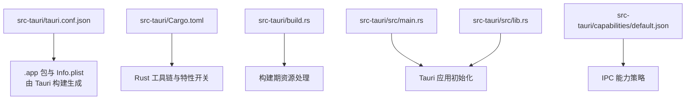
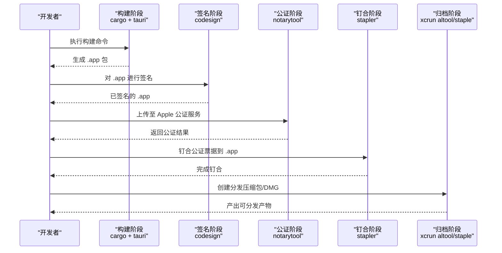
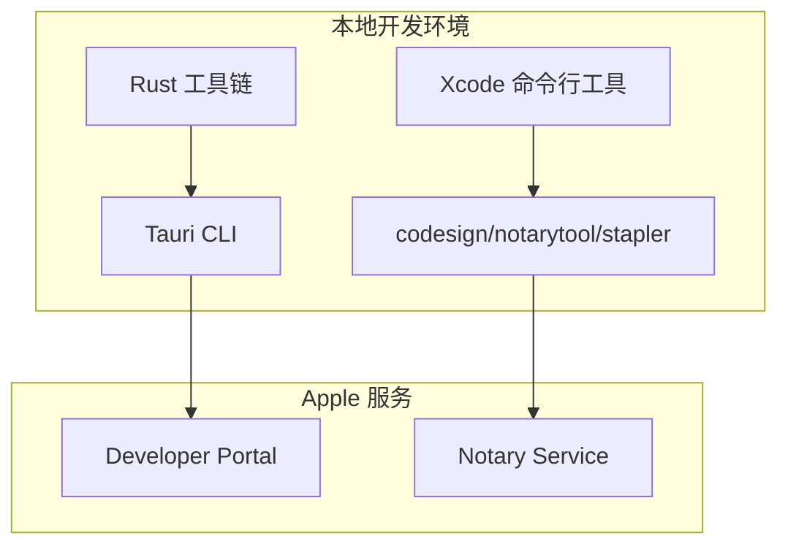

# macOS 平台打包

<cite>
**本文引用的文件**   
- [tauri.conf.json](file://src-tauri/tauri.conf.json)
- [Cargo.toml](file://src-tauri/Cargo.toml)
- [build.rs](file://src-tauri/build.rs)
- [lib.rs](file://src-tauri/src/lib.rs)
- [main.rs](file://src-tauri/src/main.rs)
- [default.json](file://src-tauri/capabilities/default.json)
</cite>

## 目录
1. [简介](#简介)
2. [项目结构](#项目结构)
3. [核心组件](#核心组件)
4. [架构总览](#架构总览)
5. [详细组件分析](#详细组件分析)
6. [依赖关系分析](#依赖关系分析)
7. [性能与优化](#性能与优化)
8. [故障排查指南](#故障排查指南)
9. [结论](#结论)
10. [附录](#附录)

## 简介
本文件面向在 macOS 上构建、签名、公证与分发 FishWorker（基于 Tauri）桌面应用。内容覆盖：
- Tauri 的 macOS 构建配置与 Universal Binary（通用二进制）支持
- .app 包结构与 Info.plist 元数据
- 代码签名流程（开发者证书、Provisioning Profile、签名命令）
- App Store Connect 集成与提交准备
- macOS 公证（Notarization）流程与自动化脚本要点
- macOS 特定资源处理（.icns 图标、启动画面等）
- 沙盒模式与权限声明
- 完整的构建与签名脚本示例（以路径引用为主，避免粘贴具体代码）

## 项目结构
FishWorker 采用 Tauri + Rust 后端 + Web 前端架构。macOS 打包相关的关键位置如下：
- src-tauri/tauri.conf.json：Tauri 应用配置（包含 macOS 目标、Bundle 信息、图标、入口等）
- src-tauri/Cargo.toml：Rust 依赖与特性开关（如 tauri/macos-protection 等）
- src-tauri/build.rs：可选的构建期脚本（用于生成或预处理资源）
- src-tauri/src/main.rs / lib.rs：Tauri 应用主入口与能力注册
- src-tauri/capabilities/default.json：Tauri v2 能力策略（控制 IPC 访问范围）

图示来源
- [tauri.conf.json](file://src-tauri/tauri.conf.json)
- [Cargo.toml](file://src-tauri/Cargo.toml)
- [build.rs](file://src-tauri/build.rs)
- [main.rs](file://src-tauri/src/main.rs)
- [lib.rs](file://src-tauri/src/lib.rs)
- [default.json](file://src-tauri/capabilities/default.json)

章节来源
- [tauri.conf.json](file://src-tauri/tauri.conf.json)
- [Cargo.toml](file://src-tauri/Cargo.toml)
- [build.rs](file://src-tauri/build.rs)
- [main.rs](file://src-tauri/src/main.rs)
- [lib.rs](file://src-tauri/src/lib.rs)
- [default.json](file://src-tauri/capabilities/default.json)

## 核心组件
- Tauri 配置（macOS Bundle）
  - 通过 tauri.conf.json 指定应用标识、版本、名称、图标、入口页面、窗口行为、以及 macOS 专属选项（如目标架构、保护标志等）。
  - 关键项包括：bundle.id、bundle.version、bundle.applications[0].identifier、bundle.icon、bundle.macos 下的 target、protection 等。
- Rust 特性与依赖
  - Cargo.toml 中启用必要的 Tauri 特性（例如 macOS 保护、系统托盘、文件系统访问等），影响最终产物与权限。
- 构建期脚本
  - build.rs 可用于复制/转换资源（如图标集、启动画面、配置文件）到输出目录，确保打包时可用。
- 能力策略
  - capabilities/default.json 定义 IPC 白名单与命令可见性，影响运行时安全边界。

章节来源
- [tauri.conf.json](file://src-tauri/tauri.conf.json)
- [Cargo.toml](file://src-tauri/Cargo.toml)
- [build.rs](file://src-tauri/build.rs)
- [default.json](file://src-tauri/capabilities/default.json)

## 架构总览
下图展示从源码到可分发包的整体流程，包括构建、签名、公证与归档。

图示来源
- [tauri.conf.json](file://src-tauri/tauri.conf.json)
- [Cargo.toml](file://src-tauri/Cargo.toml)
- [build.rs](file://src-tauri/build.rs)
- [main.rs](file://src-tauri/src/main.rs)
- [lib.rs](file://src-tauri/src/lib.rs)
- [default.json](file://src-tauri/capabilities/default.json)

## 详细组件分析

### Tauri 构建与 macOS 配置
- 目标架构与通用二进制
  - 在 tauri.conf.json 的 bundle.macos.target 中指定目标架构（如 aarch64-apple-darwin、x86_64-apple-darwin）。
  - 若需构建 Universal Binary，可在环境变量中设置 TARGET 或使用多目标构建；也可在 CI 中分别构建后使用 lipo 合并。
- 应用保护与最小系统版本
  - bundle.macos.protection 可开启 macOS 应用保护（如 Hardened Runtime），提升安全性并满足公证要求。
  - 建议设置最低系统版本以匹配目标用户环境。
- 图标与启动画面
  - bundle.icon 指向 .icns 图标集路径；Tauri 会将其放入 .app 包内相应位置。
  - 启动画面（Splash）可通过 HTML 页面或原生方式实现，需在入口配置中指定初始页面。
- 应用元数据与窗口行为
  - bundle.applications[0] 下可配置窗口大小、标题栏样式、是否全屏、隐藏菜单栏等。
  - 应用标识符（Identifier）必须唯一且与证书一致。

章节来源
- [tauri.conf.json](file://src-tauri/tauri.conf.json)

### .app 包结构与 Info.plist
- .app 包内部典型结构
  - Contents/MacOS/FishWorker：可执行文件
  - Contents/Resources：静态资源（HTML、JS、CSS、图标等）
  - Contents/Info.plist：应用元数据（CFBundleName、CFBundleVersion、CFBundleIdentifier、LSMinimumSystemVersion 等）
- 元数据来源
  - Tauri 根据 tauri.conf.json 自动生成 Info.plist 字段；部分字段可由自定义模板覆盖（如有）。
- 验证方法
  - 使用 xcrun codesign --display --verbose=4 查看签名与元数据。
  - 使用 defaults read 读取 Info.plist 中的键值。

章节来源
- [tauri.conf.json](file://src-tauri/tauri.conf.json)

### 代码签名流程（开发者证书与 Provisioning Profile）
- 获取开发者证书
  - 在 Mac 上使用“钥匙串访问”或 Xcode 登录 Apple ID，创建并下载“Developer Application”证书。
- 创建与导出 Provisioning Profile
  - 在 Apple Developer Portal 创建 App ID、创建 Provisioning Profile（App Store 或 Ad Hoc），下载并安装到本地。
- 签名命令要点
  - 使用 codesign --sign <证书名> --deep --force --options runtime 对 .app 进行签名。
  - 如需公证，务必启用 --options runtime（Hardened Runtime）。
- 验证签名
  - 使用 codesign --verify --deep --strict --verbose=4 检查签名链与完整性。

章节来源
- [tauri.conf.json](file://src-tauri/tauri.conf.json)

### App Store Connect 集成与提交准备
- 应用标识与版本
  - 确保 bundle.applications[0].identifier 与 App Store Connect 中的应用标识一致。
  - bundle.version 与 build 号需符合 App Store 规范。
- 元数据与截图
  - 在 App Store Connect 中填写应用描述、分类、隐私政策、截图等。
- 上传与审核
  - 使用 Transporter 或 Xcode Organizer 上传 .pkg/.dmg 或直接上传 .app（视分发渠道而定）。
  - 提交前完成公证与钉合，确保首次运行无警告。

章节来源
- [tauri.conf.json](file://src-tauri/tauri.conf.json)

### macOS 公证（Notarization）与自动化
- 准备工作
  - 确保已启用 Hardened Runtime（--options runtime）。
  - 准备 Apple ID 凭据（建议使用专用 App 专用密码）与团队信息。
- 公证步骤
  - 使用 notarytool submit 上传 .app 并等待结果。
  - 使用 stapler staple 将公证票据钉合到 .app。
- 自动化脚本要点
  - 在 CI 中缓存凭据与密钥环，避免交互式输入。
  - 失败重试与日志收集，便于定位问题。

章节来源
- [tauri.conf.json](file://src-tauri/tauri.conf.json)

### macOS 特定资源处理（图标与启动画面）
- .icns 图标
  - 提供多分辨率 PNG 源图，转换为 .icns 并放置于 bundle.icon 指向的路径。
  - Tauri 会将图标复制到 Resources 目录并在 Info.plist 中注册。
- 启动画面
  - 可通过初始 HTML 页面实现；或在原生层注入启动视图（需扩展 Tauri 能力）。
- 其他资源
  - 字体、媒体、配置文件等应放入 Resources 并通过相对路径引用。

章节来源
- [tauri.conf.json](file://src-tauri/tauri.conf.json)

### 沙盒模式与权限声明
- 沙盒模式
  - 若计划上架 App Store，需启用沙盒并在 entitlements 文件中声明所需权限（如网络、文件系统、辅助功能等）。
  - 非 App Store 分发可不强制沙盒，但建议按需限制权限以提升安全。
- 权限声明
  - 在 Info.plist 中添加必要的使用说明（Privacy - Camera Usage Description 等）。
  - 在 capabilities/default.json 中精确控制 IPC 命令可见性与参数校验。

章节来源
- [default.json](file://src-tauri/capabilities/default.json)
- [tauri.conf.json](file://src-tauri/tauri.conf.json)

### 完整构建与签名脚本示例（路径引用）
- 构建脚本
  - 参考仓库根目录下的构建脚本（如有）或自行编写 shell 脚本，调用 cargo build 与 tauri build。
  - 设置环境变量 TARGET 以选择目标架构，或并行构建后合并为 Universal Binary。
- 签名与公证脚本
  - 参考 scripts/ 目录（如有）或新建脚本，封装 codesign、notarytool、stapler 调用。
  - 将凭据与密钥环管理纳入 CI 安全存储。

章节来源
- [build.rs](file://src-tauri/build.rs)
- [tauri.conf.json](file://src-tauri/tauri.conf.json)

## 依赖关系分析
- 构建期依赖
  - Rust 工具链（rustc、cargo）、Tauri CLI、Xcode 命令行工具（codesign、notarytool、stapler）。
- 运行时依赖
  - macOS 系统库、Web 引擎（WebView2 或 WKWebView，取决于 Tauri 配置）。
- 外部服务
  - Apple Developer Portal（证书与 Profile）、Apple Notary Service（公证）。

图示来源
- [Cargo.toml](file://src-tauri/Cargo.toml)
- [tauri.conf.json](file://src-tauri/tauri.conf.json)

章节来源
- [Cargo.toml](file://src-tauri/Cargo.toml)
- [tauri.conf.json](file://src-tauri/tauri.conf.json)

## 性能与优化
- 构建优化
  - 使用增量构建与缓存（CI 缓存 cargo registry、target）。
  - 针对 Apple Silicon 优化：优先构建 aarch64 目标以获得更好性能。
- 产物体积
  - 启用 Tauri 压缩与资源优化；移除未使用的依赖与调试符号。
- 启动速度
  - 精简初始页面与资源；延迟加载非必要模块。

## 故障排查指南
- 签名失败
  - 检查证书有效性、Profile 是否匹配应用标识、是否启用 Hardened Runtime。
  - 使用 codesign --verify --deep --strict --verbose=4 查看详细错误。
- 公证失败
  - 确认应用未包含禁止的代码段（如动态加载未签名二进制）。
  - 检查 entitlements 是否正确声明权限。
- 运行时崩溃或权限拒绝
  - 核对 capabilities/default.json 的 IPC 白名单。
  - 检查 Info.plist 中的权限使用说明是否齐全。

章节来源
- [default.json](file://src-tauri/capabilities/default.json)
- [tauri.conf.json](file://src-tauri/tauri.conf.json)

## 结论
通过合理配置 Tauri 的 macOS Bundle、完善代码签名与公证流程、精细化权限与沙盒策略，FishWorker 可在 macOS 平台上获得稳定、安全、高性能的分发体验。建议在 CI 中固化构建、签名、公证与归档流水线，确保每次发布的一致性与可追溯性。

## 附录
- 常用命令速查（路径引用）
  - 构建：参考构建脚本或 tauri build 文档
  - 签名：参考签名脚本或 codesign 文档
  - 公证：参考公证脚本或 notarytool 文档
  - 钉合：参考钉合脚本或 stapler 文档
- 参考文件
  - [tauri.conf.json](file://src-tauri/tauri.conf.json)
  - [Cargo.toml](file://src-tauri/Cargo.toml)
  - [build.rs](file://src-tauri/build.rs)
  - [main.rs](file://src-tauri/src/main.rs)
  - [lib.rs](file://src-tauri/src/lib.rs)
  - [default.json](file://src-tauri/capabilities/default.json)