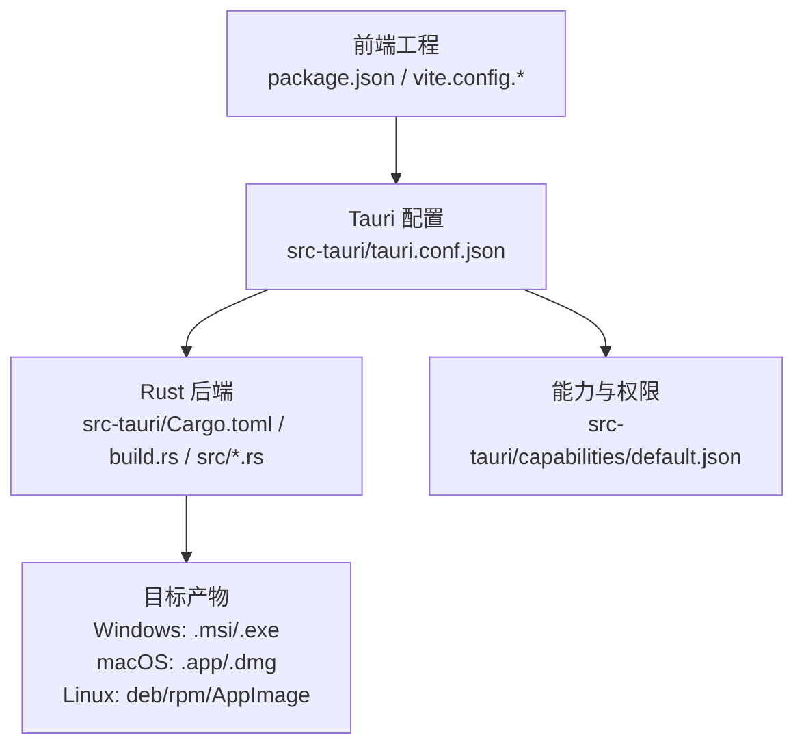
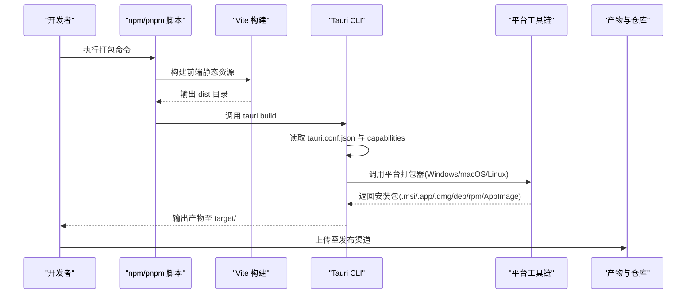
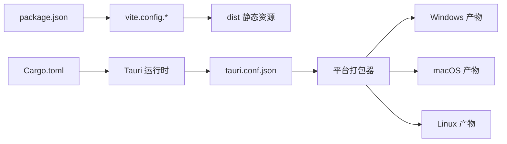

# 多平台打包

<cite>
**本文引用的文件**   
- [tauri.conf.json](file://src-tauri/tauri.conf.json)
- [Cargo.toml](file://src-tauri/Cargo.toml)
- [build.rs](file://src-tauri/build.rs)
- [lib.rs](file://src-tauri/src/lib.rs)
- [main.rs](file://src-tauri/src/main.rs)
- [default.json](file://src-tauri/capabilities/default.json)
- [package.json](file://package.json)
- [vite.config.js](file://vite.config.js)
- [vite.config.ts](file://vite.config.ts)
</cite>

## 目录
1. [简介](#简介)
2. [项目结构](#项目结构)
3. [核心组件](#核心组件)
4. [架构总览](#架构总览)
5. [详细组件分析](#详细组件分析)
6. [依赖分析](#依赖分析)
7. [性能考虑](#性能考虑)
8. [故障排查指南](#故障排查指南)
9. [结论](#结论)
10. [附录](#附录)

## 简介
本文件面向 FishWorker（基于 Tauri 的桌面应用）的多平台打包与发布，覆盖 Windows、macOS、Linux 三大平台的打包配置、签名与分发策略，并给出图标、元数据、权限等关键配置的示例位置与说明。文档同时提供跨平台兼容性测试与调试技巧，以及平台特定资源处理与路径管理的最佳实践。

## 项目结构
FishWorker 采用前端（Vite + React/TS）+ 后端（Tauri/Rust）的分层结构。打包相关的关键配置集中在 src-tauri 目录下的 tauri.conf.json、Cargo.toml、build.rs 以及能力配置文件 capabilities/default.json；前端构建由 Vite 驱动，入口在 vite.config.* 中定义。

图表来源
- [tauri.conf.json](file://src-tauri/tauri.conf.json)
- [Cargo.toml](file://src-tauri/Cargo.toml)
- [build.rs](file://src-tauri/build.rs)
- [default.json](file://src-tauri/capabilities/default.json)
- [package.json](file://package.json)
- [vite.config.js](file://vite.config.js)
- [vite.config.ts](file://vite.config.ts)

章节来源
- [tauri.conf.json](file://src-tauri/tauri.conf.json)
- [Cargo.toml](file://src-tauri/Cargo.toml)
- [build.rs](file://src-tauri/build.rs)
- [default.json](file://src-tauri/capabilities/default.json)
- [package.json](file://package.json)
- [vite.config.js](file://vite.config.js)
- [vite.config.ts](file://vite.config.ts)

## 核心组件
- Tauri 应用配置：位于 src-tauri/tauri.conf.json，集中管理应用名称、版本、窗口、图标、Bundle 输出格式、代码签名、资源嵌入、插件与协议等。
- Rust 后端与构建脚本：src-tauri/Cargo.toml 声明依赖与特性；src-tauri/build.rs 用于构建期逻辑（如生成 schema、拷贝资源等）。
- 能力与权限：src-tauri/capabilities/default.json 控制前端可调用命令与资源的访问范围。
- 前端构建：package.json 与 vite.config.* 负责静态资源构建与输出目录，供 Tauri 打包阶段引用。

章节来源
- [tauri.conf.json](file://src-tauri/tauri.conf.json)
- [Cargo.toml](file://src-tauri/Cargo.toml)
- [build.rs](file://src-tauri/build.rs)
- [default.json](file://src-tauri/capabilities/default.json)
- [package.json](file://package.json)
- [vite.config.js](file://vite.config.js)
- [vite.config.ts](file://vite.config.ts)

## 架构总览
下图展示从源码到各平台安装包的典型流程，包括前端构建、Tauri 打包、签名与产物分发。

图表来源
- [tauri.conf.json](file://src-tauri/tauri.conf.json)
- [default.json](file://src-tauri/capabilities/default.json)
- [package.json](file://package.json)

## 详细组件分析

### Windows 平台打包与发布
- 打包产物
  - 默认支持 MSI 安装包与独立 EXE。可在 tauri.conf.json 的 bundle.windows 中配置目标格式与输出目录。
- 数字签名
  - 使用 Authenticode 对 EXE/MSI 进行签名。需在 tauri.conf.json 的 windows.sign 或全局 sign 字段配置证书路径、密码及时间戳服务器。
  - 若使用企业内部分发，可使用自签证书；对外发布建议使用受信任 CA 颁发的证书。
- 安装包制作
  - 通过 Tauri 内置打包器生成 MSI，包含应用二进制、资源与快捷方式。可在 bundle.windows 中配置安装程序图标、升级 GUID、安装选项等。
- 发布流程建议
  - 本地构建后，将签名后的安装包上传至内部站点或公共下载源；为更新机制准备增量包或全量包。
  - 建议在 CI 中注入证书与凭据，自动化完成签名与上传。

章节来源
- [tauri.conf.json](file://src-tauri/tauri.conf.json)

### macOS 平台打包与发布
- 打包产物
  - 生成 .app 应用包，并可进一步打包为 .dmg 或创建 App Store 提交所需的归档。
- 代码签名与公证
  - 需配置 Apple Developer ID 证书与分发证书，并在 tauri.conf.json 的 macos.sign 或全局 sign 中设置证书标识、团队 ID、钥匙串等。
  - 使用 codesign 与 notarytool 完成签名与公证；可通过环境变量或 CI 注入凭据。
- App Store 提交准备
  - 在 tauri.conf.json 中配置 Bundle Identifier、版本号、应用信息、图标集等；确保遵循沙盒与隐私清单要求。
  - 使用 xcrun altool 或 Xcode 进行上传与验证。

章节来源
- [tauri.conf.json](file://src-tauri/tauri.conf.json)

### Linux 平台打包与分发
- 包格式支持
  - 支持 deb、rpm、AppImage。可在 tauri.conf.json 的 linux.bundle 中指定目标格式与输出目录。
- 分发策略
  - deb/rpm：适合系统包管理器安装，便于更新与依赖管理；AppImage：单文件便携分发，无需安装。
  - 结合发行版仓库或软件中心进行分发；AppImage 可直接提供下载链接。
- 权限与沙箱
  - Linux 下通常无强制沙箱，但可通过 systemd 服务、AppArmor/SELinux 等进行权限约束。

章节来源
- [tauri.conf.json](file://src-tauri/tauri.conf.json)

### 图标、元数据与权限配置
- 图标
  - 在 tauri.conf.json 的 app.icons 或 bundle 相关字段中配置各平台图标路径与尺寸；确保提供高分辨率与透明背景。
- 元数据
  - 应用名称、描述、版权、作者、URL、版本等在 tauri.conf.json 的 app 与 bundle 中统一维护。
- 权限与能力
  - 通过 capabilities/default.json 限制前端可访问的命令与资源；最小权限原则，按需开放。
- 资源与路径
  - 使用 Tauri 提供的资源路径 API 访问应用内资源；避免硬编码绝对路径，使用相对路径与常量。

章节来源
- [tauri.conf.json](file://src-tauri/tauri.conf.json)
- [default.json](file://src-tauri/capabilities/default.json)

### 前端构建与资源集成
- 构建入口
  - package.json 中的脚本可封装 tauri build 与前端构建步骤；vite.config.* 定义构建输出目录与资源优化策略。
- 资源组织
  - 将静态资源放入 public 或 src/assets，并通过 Vite 构建后由 Tauri 打包进应用；敏感配置不要随前端资源发布。

章节来源
- [package.json](file://package.json)
- [vite.config.js](file://vite.config.js)
- [vite.config.ts](file://vite.config.ts)

### 后端构建与自定义逻辑
- Cargo 配置
  - src-tauri/Cargo.toml 声明 Tauri 依赖与平台特性；可按平台启用不同功能。
- 构建脚本
  - src-tauri/build.rs 可用于生成 schema、复制平台特定资源、预处理配置等；注意保持幂等与错误处理。

章节来源
- [Cargo.toml](file://src-tauri/Cargo.toml)
- [build.rs](file://src-tauri/build.rs)

## 依赖分析
- 前端依赖
  - package.json 管理 JS/TS 依赖与脚本；Vite 负责静态资源构建。
- 后端依赖
  - Cargo.toml 管理 Rust 依赖；Tauri 运行时与平台打包器作为外部工具链被调用。
- 配置耦合
  - tauri.conf.json 是前后端打包的“契约”，变更需同步更新图标、元数据与权限。

图表来源
- [package.json](file://package.json)
- [vite.config.js](file://vite.config.js)
- [vite.config.ts](file://vite.config.ts)
- [Cargo.toml](file://src-tauri/Cargo.toml)
- [tauri.conf.json](file://src-tauri/tauri.conf.json)

章节来源
- [package.json](file://package.json)
- [vite.config.js](file://vite.config.js)
- [vite.config.ts](file://vite.config.ts)
- [Cargo.toml](file://src-tauri/Cargo.toml)
- [tauri.conf.json](file://src-tauri/tauri.conf.json)

## 性能考虑
- 前端构建优化
  - 合理拆分路由与组件，开启 Vite 的代码分割与缓存；减少大体积静态资源。
- 后端编译优化
  - 按平台启用必要特性，关闭不必要的日志与调试符号；使用 release 模式构建。
- 打包产物体积
  - 仅嵌入必需资源；利用平台压缩与去重策略；避免重复图标与冗余文件。

## 故障排查指南
- 常见构建问题
  - 前端构建失败：检查 vite.config.* 与 package.json 脚本；确认 Node 与 pnpm 版本。
  - Tauri 打包失败：查看 tauri.conf.json 语法与路径；确认平台工具链已安装（MSVC、Xcode、gcc/make）。
- 签名与公证
  - Windows：确认证书有效、时间戳服务器可达；检查 Authenticode 签名结果。
  - macOS：核对 Developer ID 证书与团队 ID；使用 codesign --verify 与 notarytool log 定位问题。
- 权限与能力
  - 若前端无法调用命令，检查 capabilities/default.json 是否允许对应命令与资源访问。
- 资源路径
  - 使用 Tauri 资源 API 获取路径；避免硬编码绝对路径；在不同平台下验证路径分隔符与大小写敏感性。

章节来源
- [tauri.conf.json](file://src-tauri/tauri.conf.json)
- [default.json](file://src-tauri/capabilities/default.json)

## 结论
FishWorker 的多平台打包以 tauri.conf.json 为核心，配合前端 Vite 构建与 Rust 后端依赖，形成统一的打包流水线。通过合理的签名、权限与资源管理，可实现跨平台一致的安装体验与安全的运行环境。建议在 CI 中固化构建、签名与发布流程，提升效率与一致性。

## 附录
- 快速检查清单
  - 图标与元数据：确认 tauri.conf.json 中各平台图标与版本信息完整。
  - 权限最小化：审查 capabilities/default.json，仅开放必要命令与资源。
  - 签名与公证：Windows 使用 Authenticode，macOS 使用 Developer ID 与公证。
  - 产物校验：在各平台运行安装包，验证安装、启动与更新流程。
- 参考实现位置
  - 打包配置：[tauri.conf.json](file://src-tauri/tauri.conf.json)
  - 能力与权限：[default.json](file://src-tauri/capabilities/default.json)
  - 构建脚本与依赖：[Cargo.toml](file://src-tauri/Cargo.toml)、[build.rs](file://src-tauri/build.rs)
  - 前端构建：[package.json](file://package.json)、[vite.config.js](file://vite.config.js)、[vite.config.ts](file://vite.config.ts)