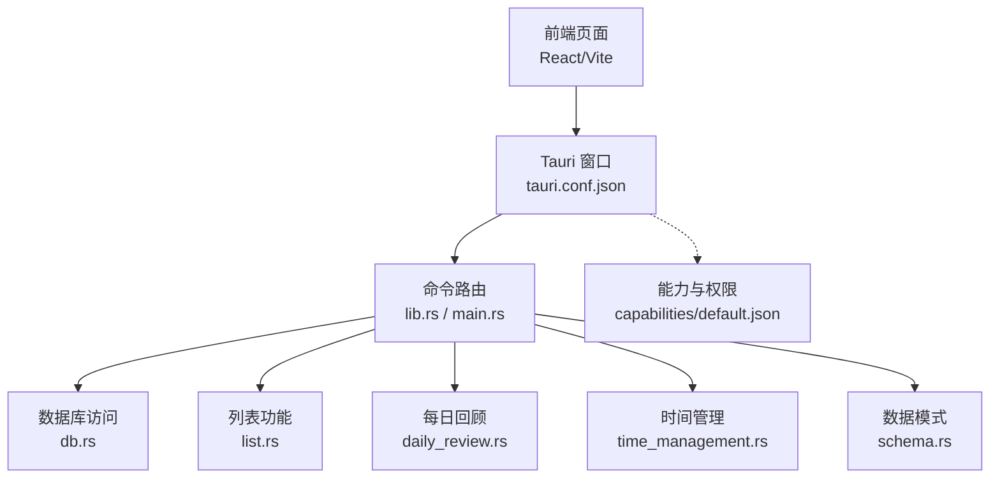
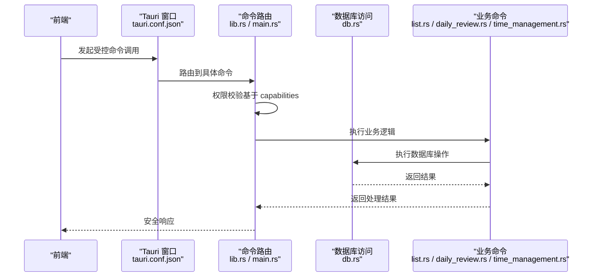
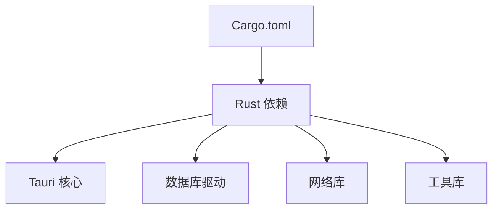

# 安全与权限

<cite>
**本文引用的文件**   
- [tauri.conf.json](file://src-tauri/tauri.conf.json)
- [default.json](file://src-tauri/capabilities/default.json)
- [lib.rs](file://src-tauri/src/lib.rs)
- [main.rs](file://src-tauri/src/main.rs)
- [db.rs](file://src-tauri/src/db.rs)
- [list.rs](file://src-tauri/src/list.rs)
- [daily_review.rs](file://src-tauri/src/daily_review.rs)
- [time_management.rs](file://src-tauri/src/time_management.rs)
- [schema.rs](file://src-tauri/src/schema.rs)
- [Cargo.toml](file://src-tauri/Cargo.toml)
</cite>

## 目录
1. [简介](#简介)
2. [项目结构](#项目结构)
3. [核心组件](#核心组件)
4. [架构总览](#架构总览)
5. [详细组件分析](#详细组件分析)
6. [依赖分析](#依赖分析)
7. [性能考虑](#性能考虑)
8. [故障排查指南](#故障排查指南)
9. [结论](#结论)
10. [附录](#附录)

## 简介
本文件面向 FishWorker 的安全与权限配置，聚焦 Tauri 的权限模型、沙箱机制、能力（capabilities）配置、前后端通信安全、CSP 与安全头、敏感信息管理、密钥存储方案、安全审计清单以及生产环境加固建议。文档以仓库中实际存在的配置文件与后端模块为依据，提供可操作的落地指导。

## 项目结构
FishWorker 采用 Tauri + Rust 后端 + React/Vite 前端的混合架构。安全相关的关键位置包括：
- Tauri 应用配置：位于 src-tauri/tauri.conf.json
- 能力与权限声明：位于 src-tauri/capabilities/default.json
- 后端入口与命令注册：位于 src-tauri/src/main.rs 与 src-tauri/src/lib.rs
- 数据库与业务命令：位于 src-tauri/src/db.rs、list.rs、daily_review.rs、time_management.rs、schema.rs
- 构建与依赖：位于 src-tauri/Cargo.toml

图表来源
- [tauri.conf.json](file://src-tauri/tauri.conf.json)
- [lib.rs](file://src-tauri/src/lib.rs)
- [main.rs](file://src-tauri/src/main.rs)
- [db.rs](file://src-tauri/src/db.rs)
- [list.rs](file://src-tauri/src/list.rs)
- [daily_review.rs](file://src-tauri/src/daily_review.rs)
- [time_management.rs](file://src-tauri/src/time_management.rs)
- [schema.rs](file://src-tauri/src/schema.rs)
- [default.json](file://src-tauri/capabilities/default.json)

章节来源
- [tauri.conf.json](file://src-tauri/tauri.conf.json)
- [default.json](file://src-tauri/capabilities/default.json)
- [lib.rs](file://src-tauri/src/lib.rs)
- [main.rs](file://src-tauri/src/main.rs)

## 核心组件
- 能力与权限（Capabilities）
  - 通过 capabilities/default.json 声明应用可用能力与资源访问范围，是 Tauri 权限模型的入口。
  - 建议按最小权限原则拆分能力集，为不同场景或用户角色分配差异化能力。
- 命令层（Commands）
  - 在 lib.rs 与 main.rs 中注册并暴露给前端的命令接口，作为前后端通信的受控边界。
  - 所有系统级操作（文件系统、网络、数据库等）应集中在命令层进行鉴权与校验。
- 数据库访问
  - db.rs 负责连接与查询封装；list.rs、daily_review.rs、time_management.rs 等业务命令调用数据库。
  - 需确保 SQL 参数化、输入校验、错误信息脱敏。
- 构建与依赖
  - Cargo.toml 声明了 Rust 依赖；应定期更新并启用安全告警。

章节来源
- [default.json](file://src-tauri/capabilities/default.json)
- [lib.rs](file://src-tauri/src/lib.rs)
- [main.rs](file://src-tauri/src/main.rs)
- [db.rs](file://src-tauri/src/db.rs)
- [list.rs](file://src-tauri/src/list.rs)
- [daily_review.rs](file://src-tauri/src/daily_review.rs)
- [time_management.rs](file://src-tauri/src/time_management.rs)
- [Cargo.toml](file://src-tauri/Cargo.toml)

## 架构总览
下图展示了从前端到后端命令再到数据库的完整调用链，以及权限检查点的位置。

图表来源
- [tauri.conf.json](file://src-tauri/tauri.conf.json)
- [lib.rs](file://src-tauri/src/lib.rs)
- [main.rs](file://src-tauri/src/main.rs)
- [db.rs](file://src-tauri/src/db.rs)
- [list.rs](file://src-tauri/src/list.rs)
- [daily_review.rs](file://src-tauri/src/daily_review.rs)
- [time_management.rs](file://src-tauri/src/time_management.rs)

## 详细组件分析

### 能力与权限（Capabilities）
- 目标
  - 明确应用可使用的系统能力与资源访问范围，限制默认权限，按需授予。
- 关键要点
  - 将能力拆分为“基础能力”和“扩展能力”，默认仅启用必要能力。
  - 对文件系统、网络、进程、插件等能力进行白名单控制。
  - 使用资源路径约束（如只允许读写特定目录），避免任意路径访问。
- 建议实践
  - 为每个功能域定义独立的能力集，并在打包时选择最小集合。
  - 在 CI 中加入能力扫描与差异对比，防止越权变更。

章节来源
- [default.json](file://src-tauri/capabilities/default.json)

### 命令层与前后端通信安全
- 目标
  - 建立严格的命令边界，确保前端不可直接调用未授权的系统 API。
- 关键要点
  - 所有命令需在 lib.rs/main.rs 显式注册，禁止动态加载未注册命令。
  - 对输入参数进行严格类型与格式校验，拒绝非法值。
  - 对输出进行最小化返回，避免泄露内部状态或堆栈信息。
- 建议实践
  - 引入请求签名或一次性令牌（可选）用于高敏感命令。
  - 对跨域与本地 IPC 通道进行隔离，避免共享上下文污染。

章节来源
- [lib.rs](file://src-tauri/src/lib.rs)
- [main.rs](file://src-tauri/src/main.rs)

### 数据库访问安全
- 目标
  - 保护数据存储与传输，防止注入与越权读取。
- 关键要点
  - 使用参数化查询，杜绝字符串拼接 SQL。
  - 对表名、字段名进行白名单校验。
  - 记录审计日志（不记录敏感内容），便于追踪异常访问。
- 建议实践
  - 为不同业务模块设置独立数据库账户与最小权限。
  - 对导出/备份操作增加二次确认与权限校验。

章节来源
- [db.rs](file://src-tauri/src/db.rs)
- [list.rs](file://src-tauri/src/list.rs)
- [daily_review.rs](file://src-tauri/src/daily_review.rs)
- [time_management.rs](file://src-tauri/src/time_management.rs)
- [schema.rs](file://src-tauri/src/schema.rs)

### 文件系统访问控制
- 目标
  - 限制对文件系统的访问范围，避免任意读写。
- 关键要点
  - 在 capabilities 中限定允许的根目录与子目录。
  - 对上传/下载文件名进行清洗与长度限制，防止路径穿越。
  - 对大文件操作采用流式处理，避免内存溢出。
- 建议实践
  - 使用临时目录与唯一命名空间隔离用户上传内容。
  - 对敏感文件加密存储并限制访问日志。

章节来源
- [default.json](file://src-tauri/capabilities/default.json)

### 网络请求安全
- 目标
  - 控制对外部网络的访问，降低恶意站点利用风险。
- 关键要点
  - 在 capabilities 中限制域名白名单与协议（仅 HTTPS）。
  - 禁用不必要的协议（如 file、ftp），避免本地资源泄露。
  - 对证书与代理进行统一管理与校验。
- 建议实践
  - 对关键接口启用双向认证或短期令牌。
  - 对响应体进行完整性校验（如签名或哈希）。

章节来源
- [default.json](file://src-tauri/capabilities/default.json)

### CSP 与安全头
- 目标
  - 通过内容安全策略与安全头减少 XSS、点击劫持等攻击面。
- 关键要点
  - 在 tauri.conf.json 中配置 CSP，仅允许必要的脚本来源与内联脚本。
  - 设置安全响应头（如 X-Content-Type-Options、X-Frame-Options、Referrer-Policy）。
  - 禁用 eval 与不安全内联代码，使用非cesium 方式加载第三方资源。
- 建议实践
  - 在开发环境与生产环境分别配置更严格的 CSP。
  - 使用子资源完整性（SRI）校验外部脚本。

章节来源
- [tauri.conf.json](file://src-tauri/tauri.conf.json)

### 敏感信息与密钥管理
- 目标
  - 避免硬编码敏感信息，提供安全的密钥存储与轮换方案。
- 关键要点
  - 不在源码与配置文件中存放密钥；使用环境变量或系统密钥库。
  - 对持久化的敏感数据进行加密存储，密钥与数据分离。
  - 对日志中的敏感信息进行脱敏处理。
- 建议实践
  - 使用平台提供的安全存储（如 Windows DPAPI、macOS Keychain、Linux Secret Service）。
  - 实现密钥轮换流程与版本兼容策略。

章节来源
- [tauri.conf.json](file://src-tauri/tauri.conf.json)
- [db.rs](file://src-tauri/src/db.rs)

### 安全审计清单
- 能力与权限
  - 是否启用了最小权限？是否限制了文件系统与网络白名单？
- 命令层
  - 是否对所有输入进行了校验？是否记录了审计日志？
- 数据库
  - 是否使用参数化查询？是否限制了账户权限？
- 前端
  - CSP 是否足够严格？是否移除了调试开关与危险 API？
- 密钥与敏感信息
  - 是否避免了硬编码？是否实现了加密存储与轮换？
- 构建与发布
  - 是否启用了依赖安全扫描？是否对产物进行了完整性校验？

[本节为通用清单，无需列出具体文件来源]

### 常见漏洞防护
- 注入攻击：SQL 注入、命令注入、模板注入
  - 措施：参数化查询、白名单校验、禁用危险函数。
- 跨站脚本（XSS）
  - 措施：严格 CSP、转义输出、避免内联脚本。
- 路径穿越与任意文件读写
  - 措施：路径规范化、白名单目录、限制文件大小。
- 中间人攻击
  - 措施：强制 HTTPS、证书固定、禁用不安全协议。
- 信息泄露
  - 措施：最小化错误信息、脱敏日志、隐藏内部结构。

[本节为通用防护建议，无需列出具体文件来源]

### 生产环境加固与最佳实践
- 启用最小能力集，关闭调试与开发者工具。
- 使用代码签名与完整性校验，防止篡改。
- 开启依赖漏洞扫描与自动更新策略。
- 实施运行时监控与异常告警。
- 定期进行渗透测试与安全评估。

[本节为通用实践建议，无需列出具体文件来源]

## 依赖分析
Rust 侧依赖由 Cargo.toml 管理，建议关注以下方面：
- 依赖版本锁定与定期升级
- 已知漏洞告警与修复优先级
- 第三方库的最小化引入，避免不必要功能

图表来源
- [Cargo.toml](file://src-tauri/Cargo.toml)

章节来源
- [Cargo.toml](file://src-tauri/Cargo.toml)

## 性能考虑
- 数据库连接池与超时控制，避免阻塞 UI。
- 大文件与大数据集的分页与流式处理。
- 命令层异步化，避免主线程阻塞。
- 缓存热点数据，减少重复 IO。

[本节为通用性能建议，无需列出具体文件来源]

## 故障排查指南
- 权限不足
  - 检查 capabilities/default.json 是否包含所需能力与资源路径。
- 命令未注册
  - 确认命令在 lib.rs/main.rs 中正确注册且名称一致。
- 数据库连接失败
  - 检查 db.rs 的连接配置与凭据来源，查看错误日志是否脱敏。
- 网络请求被拦截
  - 核对 capabilities 的网络白名单与协议限制。
- CSP 报错
  - 调整 tauri.conf.json 的 CSP 配置，逐步放宽并定位问题资源。

章节来源
- [default.json](file://src-tauri/capabilities/default.json)
- [lib.rs](file://src-tauri/src/lib.rs)
- [main.rs](file://src-tauri/src/main.rs)
- [db.rs](file://src-tauri/src/db.rs)
- [tauri.conf.json](file://src-tauri/tauri.conf.json)

## 结论
FishWorker 的安全与权限体系应以“最小权限、严格校验、可观测性”为核心。通过能力配置精细化控制、命令层集中鉴权、数据库与网络访问白名单、CSP 与安全头强化、敏感信息加密与轮换，以及生产环境的加固措施，可有效降低安全风险并提升整体安全性。

[本节为总结性内容，无需列出具体文件来源]

## 附录
- 术语
  - 能力（Capabilities）：Tauri 中用于声明应用可用权限与资源的配置单元。
  - 命令（Commands）：Tauri 后端暴露给前端的受控接口。
  - CSP（内容安全策略）：浏览器/渲染引擎用于限制资源加载与脚本执行的安全策略。
- 参考
  - Tauri 官方文档：权限与能力配置、CSP 与安全头设置。
  - OWASP 客户端安全指南：XSS、注入、路径穿越等防护要点。

[本节为补充说明，无需列出具体文件来源]