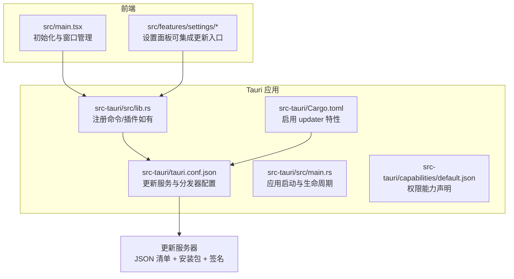
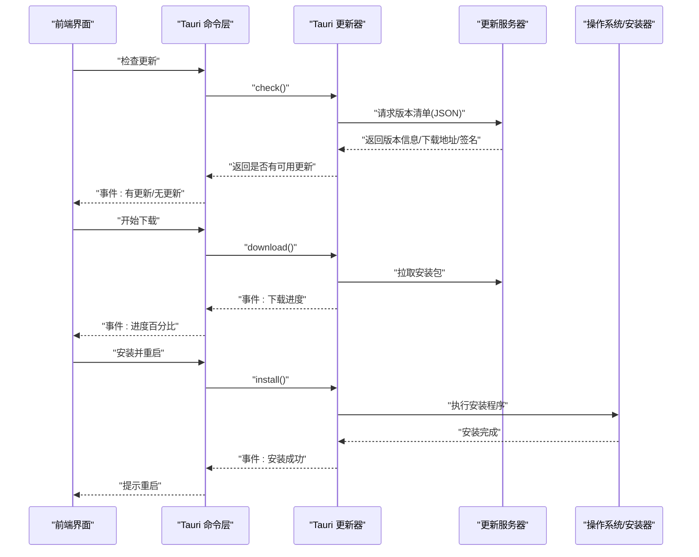
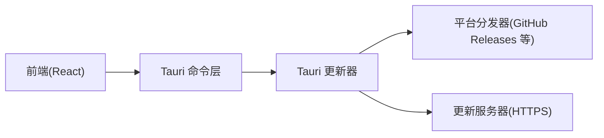
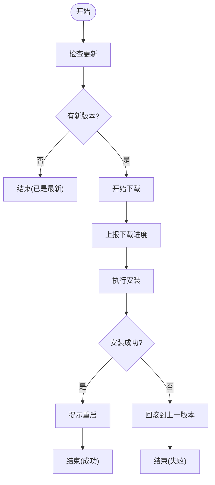

# 更新机制

<cite>
**本文引用的文件**   
- [tauri.conf.json](file://src-tauri/tauri.conf.json)
- [Cargo.toml](file://src-tauri/Cargo.toml)
- [lib.rs](file://src-tauri/src/lib.rs)
- [main.rs](file://src-tauri/src/main.rs)
- [default.json](file://src-tauri/capabilities/default.json)
</cite>

## 目录
1. [简介](#简介)
2. [项目结构](#项目结构)
3. [核心组件](#核心组件)
4. [架构总览](#架构总览)
5. [详细组件分析](#详细组件分析)
6. [依赖分析](#依赖分析)
7. [性能考虑](#性能考虑)
8. [故障排查指南](#故障排查指南)
9. [结论](#结论)
10. [附录](#附录)

## 简介
本文件为 FishWorker 的“应用更新机制”文档，聚焦于基于 Tauri 内置自动更新能力的配置与使用。内容涵盖：
- 增量更新与全量更新的策略说明
- 版本检查、下载进度跟踪与安装流程
- 自定义更新服务器的配置与部署方案
- 失败回滚与错误处理策略
- 更新包签名验证与安全校验
- 用户偏好设置与手动更新入口
- 更新日志与用户通知的实现思路

## 项目结构
FishWorker 采用 Tauri + Rust 后端 + React 前端的典型结构。更新相关能力主要位于 Tauri 侧（Rust）与构建配置中，前端通过 Tauri 命令或事件进行交互。

图表来源
- [tauri.conf.json](file://src-tauri/tauri.conf.json)
- [Cargo.toml](file://src-tauri/Cargo.toml)
- [lib.rs](file://src-tauri/src/lib.rs)
- [main.rs](file://src-tauri/src/main.rs)
- [default.json](file://src-tauri/capabilities/default.json)

章节来源
- [tauri.conf.json](file://src-tauri/tauri.conf.json)
- [Cargo.toml](file://src-tauri/Cargo.toml)
- [lib.rs](file://src-tauri/src/lib.rs)
- [main.rs](file://src-tauri/src/main.rs)
- [default.json](file://src-tauri/capabilities/default.json)

## 核心组件
- 更新配置与分发器
  - 在 tauri.conf.json 中配置 update 段，指定 JSON 清单地址、签名公钥、以及平台相关的分发器（如 GitHub Releases）。
  - 可选配置是否允许静默更新、是否显示系统弹窗等。
- 特性开关
  - 在 Cargo.toml 中启用 updater 特性，使 Tauri 包含自动更新运行时。
- 能力与权限
  - capabilities/default.json 用于声明应用所需能力；若仅使用 Tauri 内置更新，通常无需额外能力。
- 前端集成点
  - 可在设置页提供“检查更新”“查看更新日志”“立即重启并安装”等入口，通过 Tauri 命令或事件驱动更新流程。

章节来源
- [tauri.conf.json](file://src-tauri/tauri.conf.json)
- [Cargo.toml](file://src-tauri/Cargo.toml)
- [default.json](file://src-tauri/capabilities/default.json)

## 架构总览
下图展示从前端触发到后端执行更新的核心调用链与数据流。

图表来源
- [tauri.conf.json](file://src-tauri/tauri.conf.json)
- [lib.rs](file://src-tauri/src/lib.rs)
- [main.rs](file://src-tauri/src/main.rs)

## 详细组件分析

### 更新配置（tauri.conf.json）
- 关键要点
  - 配置 update 段：定义 JSON 清单 URL、签名公钥、分发器类型（如 GitHub Releases）。
  - 平台差异化：可按 windows/linux/macos 分别配置分发器参数。
  - 行为控制：是否允许静默更新、是否显示系统弹窗、是否强制更新等。
- 建议
  - 将清单与安装包分离存放，确保 HTTPS 与完整性校验。
  - 对敏感字段（如签名公钥）进行最小化暴露。

章节来源
- [tauri.conf.json](file://src-tauri/tauri.conf.json)

### 特性启用（Cargo.toml）
- 关键要点
  - 启用 updater 特性以引入自动更新运行时。
  - 与其他特性组合时注意冲突与体积影响。
- 建议
  - 仅在需要更新的发行版中启用该特性，减少开发包体积。

章节来源
- [Cargo.toml](file://src-tauri/Cargo.toml)

### 能力与权限（capabilities/default.json）
- 关键要点
  - 默认能力通常已满足内置更新需求；如需自定义更新逻辑，再按需扩展。
- 建议
  - 保持最小权限原则，避免授予不必要的网络或文件系统权限。

章节来源
- [default.json](file://src-tauri/capabilities/default.json)

### 命令与事件（lib.rs / main.rs）
- 关键要点
  - 在 lib.rs 中注册命令（如 check/update/install），或在 main.rs 中初始化更新器。
  - 通过事件通道向前端推送“检查完成”“下载进度”“安装结果”等消息。
- 建议
  - 统一封装更新状态机，便于前端渲染与用户交互。

章节来源
- [lib.rs](file://src-tauri/src/lib.rs)
- [main.rs](file://src-tauri/src/main.rs)

### 前端集成（示例位置）
- 建议在设置模块中提供以下入口：
  - “检查更新”按钮
  - “查看更新日志”链接
  - “立即重启并安装”确认对话框
- 通过监听 Tauri 事件更新 UI 状态（空闲/检查中/下载中/安装中/完成/失败）。

章节来源
- [main.tsx](file://src/main.tsx)

## 依赖分析
- 内部依赖
  - 前端通过 Tauri 命令/事件与 Rust 后端通信。
  - Rust 后端依赖 Tauri 更新器实现与目标平台分发器。
- 外部依赖
  - 更新服务器（HTTPS）：提供 JSON 清单、安装包与签名。
  - 平台分发器（如 GitHub Releases）：由 Tauri 内部适配。

图表来源
- [tauri.conf.json](file://src-tauri/tauri.conf.json)
- [Cargo.toml](file://src-tauri/Cargo.toml)
- [lib.rs](file://src-tauri/src/lib.rs)
- [main.rs](file://src-tauri/src/main.rs)

章节来源
- [tauri.conf.json](file://src-tauri/tauri.conf.json)
- [Cargo.toml](file://src-tauri/Cargo.toml)
- [lib.rs](file://src-tauri/src/lib.rs)
- [main.rs](file://src-tauri/src/main.rs)

## 性能考虑
- 增量更新优先
  - 当服务器支持差分包时，优先选择增量更新以降低带宽与时间成本。
- 并发与限速
  - 根据网络状况限制下载并发数，避免阻塞主线程与 UI。
- 缓存与断点续传
  - 利用 Tauri 更新器的断点续传能力，提升弱网环境下的稳定性。
- 资源清理
  - 安装完成后及时清理临时文件，释放磁盘空间。

[本节为通用指导，不直接分析具体文件]

## 故障排查指南
- 常见错误与定位
  - 清单不可达：检查 HTTPS 证书、域名解析与 CORS（如适用）。
  - 签名校验失败：核对公钥与清单签名是否匹配。
  - 下载中断：重试策略与断点续传是否生效。
  - 安装失败：权限不足、杀毒软件拦截、旧进程未退出。
- 回滚策略
  - 安装前备份关键数据与配置文件。
  - 安装失败时自动回滚至上一稳定版本。
- 日志与上报
  - 记录更新全流程日志（检查、下载、安装、回滚）。
  - 在用户授权前提下上报匿名错误摘要，便于问题追踪。

章节来源
- [tauri.conf.json](file://src-tauri/tauri.conf.json)
- [lib.rs](file://src-tauri/src/lib.rs)
- [main.rs](file://src-tauri/src/main.rs)

## 结论
通过 Tauri 内置更新能力，FishWorker 可实现安全、可控且用户体验良好的自动更新。结合合理的配置、完善的错误处理与回滚机制，以及清晰的前端交互设计，可显著提升应用的持续交付质量与可靠性。

[本节为总结性内容，不直接分析具体文件]

## 附录

### 增量更新与全量更新策略
- 增量更新
  - 条件：服务器提供差分包与对应元数据。
  - 优点：体积小、速度快、带宽成本低。
  - 风险：差分生成与合并复杂度较高，需严格测试。
- 全量更新
  - 条件：不提供差分包或回退场景。
  - 优点：实现简单、兼容性好。
  - 风险：体积大、耗时较长。
- 决策建议
  - 小版本优先增量，大版本或跨架构切换使用全量。
  - 首次发布或重大变更建议全量，降低兼容性风险。

[本节为概念性说明，不直接分析具体文件]

### 版本检查、下载进度与安装流程
- 版本检查
  - 前端触发“检查更新”，后端请求清单并比较当前版本。
- 下载进度
  - 后端通过事件推送下载字节数与总量，前端渲染进度条。
- 安装流程
  - 下载完成后进入安装阶段，必要时重启应用以替换文件。

[本节为概念性流程图，不直接映射具体源码文件]

### 自定义更新服务器配置与部署
- 清单格式
  - 提供 JSON 清单，包含版本号、发布日期、平台列表、下载地址、大小、签名等信息。
- 签名与校验
  - 使用 Tauri 支持的签名算法，客户端配置公钥进行校验。
- 部署建议
  - 使用 HTTPS 与 CDN 加速。
  - 清单与安装包分离存储，独立鉴权与访问控制。
  - 保留历史版本以便回滚。

[本节为通用指导，不直接分析具体文件]

### 用户偏好与手动更新入口
- 偏好项
  - 是否开启自动检查更新
  - 是否允许静默更新
  - 是否显示系统弹窗
- 手动入口
  - 设置页提供“检查更新”“查看更新日志”“立即重启并安装”等操作。

[本节为概念性说明，不直接分析具体文件]

### 更新日志与用户通知
- 更新日志
  - 在清单中附带变更摘要，前端渲染“更新日志”面板。
- 通知方式
  - 桌面通知、托盘提示、应用内弹窗等，遵循用户偏好。

[本节为概念性说明，不直接分析具体文件]