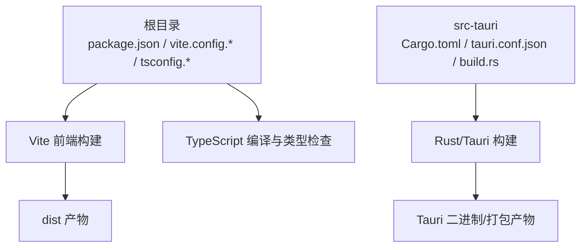
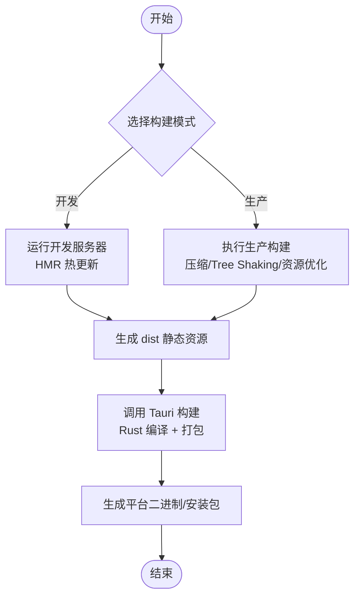
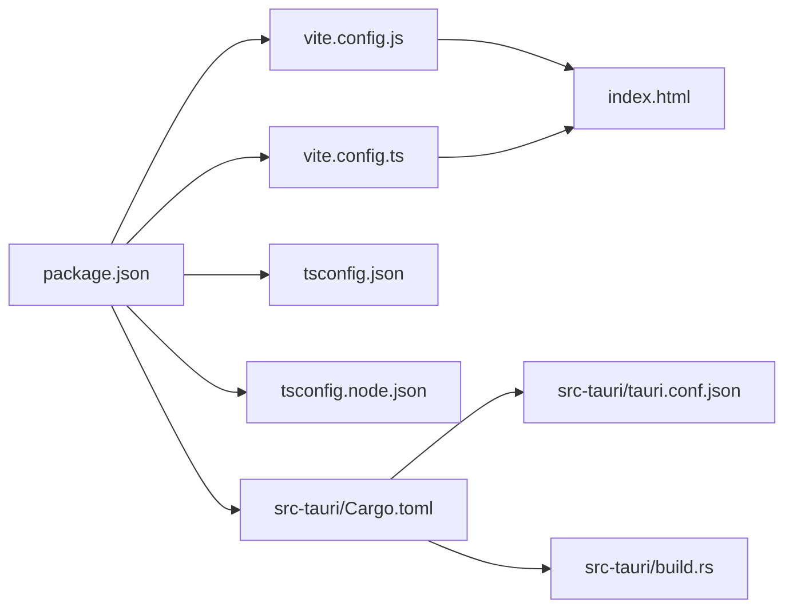

# 构建配置

<cite>
**本文引用的文件**   
- [vite.config.js](file://vite.config.js)
- [vite.config.ts](file://vite.config.ts)
- [tsconfig.json](file://tsconfig.json)
- [tsconfig.node.json](file://tsconfig.node.json)
- [package.json](file://package.json)
- [Cargo.toml](file://src-tauri/Cargo.toml)
- [tauri.conf.json](file://src-tauri/tauri.conf.json)
- [build.rs](file://src-tauri/build.rs)
- [index.html](file://index.html)
</cite>

## 目录
1. [简介](#简介)
2. [项目结构](#项目结构)
3. [核心组件](#核心组件)
4. [架构总览](#架构总览)
5. [详细组件分析](#详细组件分析)
6. [依赖分析](#依赖分析)
7. [性能考虑](#性能考虑)
8. [故障排查指南](#故障排查指南)
9. [结论](#结论)
10. [附录](#附录)

## 简介
本文件面向 FishWorker 项目的构建系统，聚焦以下目标：
- Vite 前端构建配置：代码分割、资源优化、环境变量与插件设置
- TypeScript 编译配置：模块解析、类型检查、路径映射
- Rust/Tauri 后端构建：Cargo.toml 依赖管理、特性开关、优化选项
- 开发环境与生产环境的不同构建策略：压缩、Tree Shaking、资源内联
- 自定义构建脚本与钩子使用方法
- 构建性能优化技巧与常见问题排查

## 项目结构
FishWorker 采用 Tauri + Vite + TypeScript 的混合工程结构。前端由 Vite 驱动，TypeScript 提供类型安全；后端使用 Rust（Tauri），通过 Cargo 管理依赖与构建。根目录包含前端构建配置与脚本，src-tauri 下为 Rust 应用与 Tauri 配置。

图表来源
- [package.json:1-200](file://package.json#L1-L200)
- [vite.config.js:1-200](file://vite.config.js#L1-L200)
- [vite.config.ts:1-200](file://vite.config.ts#L1-L200)
- [tsconfig.json:1-200](file://tsconfig.json#L1-L200)
- [tsconfig.node.json:1-200](file://tsconfig.node.json#L1-L200)
- [Cargo.toml:1-200](file://src-tauri/Cargo.toml#L1-L200)
- [tauri.conf.json:1-200](file://src-tauri/tauri.conf.json#L1-L200)
- [build.rs:1-200](file://src-tauri/build.rs#L1-L200)

章节来源
- [package.json:1-200](file://package.json#L1-L200)
- [vite.config.js:1-200](file://vite.config.js#L1-L200)
- [vite.config.ts:1-200](file://vite.config.ts#L1-L200)
- [tsconfig.json:1-200](file://tsconfig.json#L1-L200)
- [tsconfig.node.json:1-200](file://tsconfig.node.json#L1-L200)
- [Cargo.toml:1-200](file://src-tauri/Cargo.toml#L1-L200)
- [tauri.conf.json:1-200](file://src-tauri/tauri.conf.json#L1-L200)
- [build.rs:1-200](file://src-tauri/build.rs#L1-L200)

## 核心组件
- Vite 前端构建入口与配置：vite.config.js 与 vite.config.ts
- TypeScript 编译与类型检查：tsconfig.json 与 tsconfig.node.json
- 包管理与脚本：package.json
- Rust/Tauri 构建：src-tauri/Cargo.toml、src-tauri/tauri.conf.json、src-tauri/build.rs
- 前端入口 HTML：index.html

章节来源
- [vite.config.js:1-200](file://vite.config.js#L1-L200)
- [vite.config.ts:1-200](file://vite.config.ts#L1-L200)
- [tsconfig.json:1-200](file://tsconfig.json#L1-L200)
- [tsconfig.node.json:1-200](file://tsconfig.node.json#L1-L200)
- [package.json:1-200](file://package.json#L1-L200)
- [Cargo.toml:1-200](file://src-tauri/Cargo.toml#L1-L200)
- [tauri.conf.json:1-200](file://src-tauri/tauri.conf.json#L1-L200)
- [build.rs:1-200](file://src-tauri/build.rs#L1-L200)
- [index.html:1-200](file://index.html#L1-L200)

## 架构总览
下图展示从源码到产物的整体构建流程，包括前端与后端的并行构建以及产物输出位置。

图表来源
- [package.json:1-200](file://package.json#L1-L200)
- [vite.config.js:1-200](file://vite.config.js#L1-L200)
- [vite.config.ts:1-200](file://vite.config.ts#L1-L200)
- [Cargo.toml:1-200](file://src-tauri/Cargo.toml#L1-L200)
- [tauri.conf.json:1-200](file://src-tauri/tauri.conf.json#L1-L200)

## 详细组件分析

### Vite 前端构建配置
- 配置文件位置：vite.config.js 与 vite.config.ts
- 关键能力
  - 代码分割：通过动态导入与路由级拆分实现按需加载
  - 资源优化：图片、字体等静态资源的处理与缓存策略
  - 环境变量：通过 Vite 内置变量注入机制在构建期注入
  - 插件体系：扩展构建流程（如别名、CSS 预处理器、类型声明等）
- 建议实践
  - 将大型第三方库拆分为独立 chunk，减少首屏体积
  - 启用资源哈希与长缓存策略，提升缓存命中率
  - 使用 .env 文件区分开发与生产环境变量

章节来源
- [vite.config.js:1-200](file://vite.config.js#L1-L200)
- [vite.config.ts:1-200](file://vite.config.ts#L1-L200)

### TypeScript 编译配置
- 配置文件位置：tsconfig.json 与 tsconfig.node.json
- 关键能力
  - 模块解析：ESM/CommonJS 兼容、路径映射与模块查找顺序
  - 类型检查：严格模式、类型声明文件引入、全局类型增强
  - 路径映射：基于 baseUrl 与 paths 的配置，简化模块引用
- 建议实践
  - 使用 tsconfig.node.json 隔离 Node 端与浏览器端类型
  - 合理设置 target 与 lib，避免不必要的 polyfill
  - 利用路径映射提升可读性与可维护性

章节来源
- [tsconfig.json:1-200](file://tsconfig.json#L1-L200)
- [tsconfig.node.json:1-200](file://tsconfig.node.json#L1-L200)

### Rust/Tauri 后端构建配置
- 配置文件位置：src-tauri/Cargo.toml、src-tauri/tauri.conf.json、src-tauri/build.rs
- 关键能力
  - 依赖管理：通过 Cargo.toml 声明依赖与版本约束
  - 特性开关：通过 features 控制可选功能与平台差异
  - 优化选项：release 模式下启用 LTO、strip、codegen-units 等
  - Tauri 配置：窗口、权限、资源路径、构建输出等
  - 构建脚本：build.rs 用于预处理或生成代码
- 建议实践
  - 按平台拆分 features，减少不必要依赖
  - 在 release 中开启 LTO 与 strip，减小二进制体积
  - 使用 tauri.conf.json 集中管理应用元数据与权限

章节来源
- [Cargo.toml:1-200](file://src-tauri/Cargo.toml#L1-L200)
- [tauri.conf.json:1-200](file://src-tauri/tauri.conf.json#L1-L200)
- [build.rs:1-200](file://src-tauri/build.rs#L1-L200)

### 构建脚本与命令
- 包管理器脚本：package.json 中的 scripts 字段定义常用命令
- 典型命令
  - 开发：启动 Vite 开发服务器，支持 HMR
  - 构建：执行生产构建并生成 dist 静态资源
  - 集成：调用 Tauri CLI 进行 Rust 编译与打包
- 建议实践
  - 将前后端构建步骤组合为统一命令，降低使用门槛
  - 为不同环境提供专用脚本，避免手动切换参数

章节来源
- [package.json:1-200](file://package.json#L1-L200)

### 前端入口与资源组织
- 入口 HTML：index.html
- 作用
  - 定义应用挂载点与基础资源引用
  - 作为 Vite 构建的起点，关联主入口脚本
- 建议实践
  - 保持 index.html 简洁，避免直接引入大型资源
  - 使用构建工具进行资源注入与版本化

章节来源
- [index.html:1-200](file://index.html#L1-L200)

## 依赖分析
下图展示主要构建相关文件的依赖关系与交互。

图表来源
- [package.json:1-200](file://package.json#L1-L200)
- [vite.config.js:1-200](file://vite.config.js#L1-L200)
- [vite.config.ts:1-200](file://vite.config.ts#L1-L200)
- [tsconfig.json:1-200](file://tsconfig.json#L1-L200)
- [tsconfig.node.json:1-200](file://tsconfig.node.json#L1-L200)
- [index.html:1-200](file://index.html#L1-L200)
- [Cargo.toml:1-200](file://src-tauri/Cargo.toml#L1-L200)
- [tauri.conf.json:1-200](file://src-tauri/tauri.conf.json#L1-L200)
- [build.rs:1-200](file://src-tauri/build.rs#L1-L200)

章节来源
- [package.json:1-200](file://package.json#L1-L200)
- [vite.config.js:1-200](file://vite.config.js#L1-L200)
- [vite.config.ts:1-200](file://vite.config.ts#L1-L200)
- [tsconfig.json:1-200](file://tsconfig.json#L1-L200)
- [tsconfig.node.json:1-200](file://tsconfig.node.json#L1-L200)
- [index.html:1-200](file://index.html#L1-L200)
- [Cargo.toml:1-200](file://src-tauri/Cargo.toml#L1-L200)
- [tauri.conf.json:1-200](file://src-tauri/tauri.conf.json#L1-L200)
- [build.rs:1-200](file://src-tauri/build.rs#L1-L200)

## 性能考虑
- 代码分割
  - 对大体积模块与路由进行拆分，减少首屏加载时间
  - 合理使用动态导入，避免过早加载非关键逻辑
- Tree Shaking
  - 确保使用 ES 模块语法，便于静态分析移除未用代码
  - 谨慎使用命名导出与默认导出，避免副作用影响
- 资源优化
  - 图片与字体启用压缩与懒加载
  - 静态资源使用内容哈希，配合长期缓存策略
- 环境变量
  - 仅在生产构建时注入必要变量，避免泄露调试信息
- Rust 优化
  - 启用 LTO、strip 与合适的 codegen-units
  - 按平台裁剪 features，减少二进制体积

[本节为通用指导，不直接分析具体文件]

## 故障排查指南
- 构建失败
  - 检查 Vite 配置是否正确加载，确认插件与别名设置
  - 验证 TypeScript 配置与类型声明是否完整
  - 查看 Cargo 构建日志，定位 Rust 编译错误
- 运行时异常
  - 确认环境变量注入是否符合预期
  - 检查资源路径与权限配置（Tauri）
- 性能问题
  - 分析 bundle 大小，识别大依赖并进行拆分或替换
  - 评估 Tree Shaking 效果，调整导出方式与依赖结构

章节来源
- [vite.config.js:1-200](file://vite.config.js#L1-L200)
- [vite.config.ts:1-200](file://vite.config.ts#L1-L200)
- [tsconfig.json:1-200](file://tsconfig.json#L1-L200)
- [tsconfig.node.json:1-200](file://tsconfig.node.json#L1-L200)
- [Cargo.toml:1-200](file://src-tauri/Cargo.toml#L1-L200)
- [tauri.conf.json:1-200](file://src-tauri/tauri.conf.json#L1-L200)

## 结论
FishWorker 的构建系统以 Vite 为核心，结合 TypeScript 的类型安全与 Rust/Tauri 的后端能力，形成高效的前后端一体化构建流程。通过合理的代码分割、资源优化与环境变量管理，可在开发体验与生产性能之间取得良好平衡。建议在持续迭代中关注构建产物体积与构建时长，定期评估依赖结构与构建策略。

[本节为总结性内容，不直接分析具体文件]

## 附录
- 常见命令参考
  - 开发：启动本地服务与热更新
  - 构建：执行生产构建并生成静态资源
  - 打包：调用 Tauri 进行 Rust 编译与平台打包
- 最佳实践清单
  - 使用路径映射简化模块引用
  - 按功能域拆分路由与组件，利于代码分割
  - 在 release 构建中启用 LTO 与 strip
  - 通过 .env 管理环境变量，避免硬编码

[本节为补充说明，不直接分析具体文件]