# 监控与日志

<cite>
**本文引用的文件**   
- [src/main.tsx](file://src/main.tsx)
- [src-tauri/src/main.rs](file://src-tauri/src/main.rs)
- [src-tauri/src/lib.rs](file://src-tauri/src/lib.rs)
- [src-tauri/Cargo.toml](file://src-tauri/Cargo.toml)
- [src-tauri/tauri.conf.json](file://src-tauri/tauri.conf.json)
- [vite.config.js](file://vite.config.js)
- [package.json](file://package.json)
</cite>

## 目录
1. [简介](#简介)
2. [项目结构](#项目结构)
3. [核心组件](#核心组件)
4. [架构总览](#架构总览)
5. [详细组件分析](#详细组件分析)
6. [依赖分析](#依赖分析)
7. [性能考虑](#性能考虑)
8. [故障诊断指南](#故障诊断指南)
9. [结论](#结论)
10. [附录](#附录)

## 简介
本文件为 FishWorker 的“监控与日志”专项文档，覆盖前端错误监控与异常捕获、Rust 后端日志记录与错误追踪、性能指标采集与关键业务埋点、生产环境日志聚合与分析工具集成、用户行为分析与使用统计策略、告警规则与通知机制、隐私保护与数据脱敏最佳实践，以及故障诊断和问题定位的工具链配置。目标是帮助团队在生产环境中实现可观测性闭环：从数据采集、传输、存储到分析、告警与处置的全链路方案。

## 项目结构
FishWorker 采用 Tauri 架构：前端基于 Vite + React（TypeScript），后端为 Rust。监控与日志相关的关键位置包括：
- 前端入口与初始化逻辑：用于接入错误监控、性能埋点、用户行为分析等 SDK。
- Tauri 主进程与命令模块：用于统一日志输出、错误上报、系统级异常捕获。
- 构建与打包配置：用于控制环境变量、调试开关、产物体积与性能。

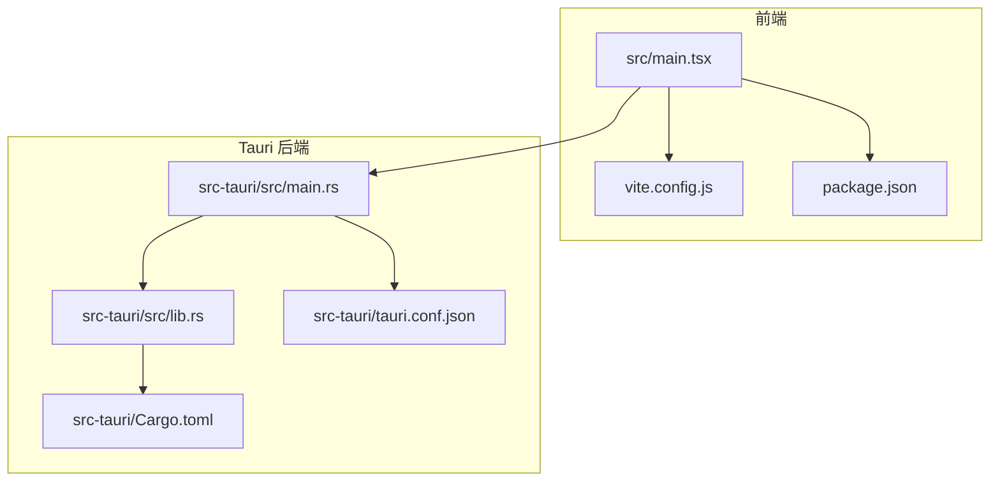

**图表来源**
- [src/main.tsx](file://src/main.tsx)
- [vite.config.js](file://vite.config.js)
- [package.json](file://package.json)
- [src-tauri/src/main.rs](file://src-tauri/src/main.rs)
- [src-tauri/src/lib.rs](file://src-tauri/src/lib.rs)
- [src-tauri/tauri.conf.json](file://src-tauri/tauri.conf.json)
- [src-tauri/Cargo.toml](file://src-tauri/Cargo.toml)

**章节来源**
- [src/main.tsx](file://src/main.tsx)
- [src-tauri/src/main.rs](file://src-tauri/src/main.rs)
- [src-tauri/src/lib.rs](file://src-tauri/src/lib.rs)
- [src-tauri/tauri.conf.json](file://src-tauri/tauri.conf.json)
- [src-tauri/Cargo.toml](file://src-tauri/Cargo.toml)
- [vite.config.js](file://vite.config.js)
- [package.json](file://package.json)

## 核心组件
本节聚焦监控与日志在前后端的关键接入点与职责划分。

- 前端错误监控与异常捕获
  - 在应用启动阶段初始化错误监控 SDK，注册全局未捕获异常与 Promise 拒绝处理器，确保页面崩溃、网络请求失败、第三方库异常均可被捕获并上报。
  - 结合路由与状态管理，对关键业务流程进行错误边界包裹，避免单点异常导致整页白屏。
  - 通过环境变量控制是否启用监控、采样率与上报目标。

- Rust 后端日志与错误追踪
  - 在主进程入口处初始化日志框架，设置日志级别、输出格式与轮转策略。
  - 在 Tauri 命令层统一捕获错误，将结构化错误信息写入日志并可选上报至远端服务。
  - 利用平台能力收集系统事件与崩溃信息，便于问题复现。

- 性能监控与业务埋点
  - 前端采集首屏时间、交互延迟、资源加载耗时、长任务阻塞等指标；后端采集 CPU、内存、I/O、数据库查询耗时等指标。
  - 对关键业务操作（如创建任务、保存清单、导出报告）进行埋点，附带必要上下文但需脱敏。

- 日志聚合与分析
  - 生产环境建议将前端与后端日志统一汇聚至集中式日志系统（如 ELK/EFK、Loki、Sentry 等），并提供检索、聚合、可视化面板。
  - 建立标准字段规范（trace_id、span_id、level、service、env、timestamp、message、metadata）。

- 用户行为分析与使用统计
  - 采集匿名化的用户行为事件（功能使用频次、页面停留时长、转化漏斗），遵循最小化原则与用户授权。
  - 提供开关与偏好设置，允许用户选择退出统计。

- 告警与通知
  - 基于指标阈值与错误率建立告警规则，支持邮件、IM、短信等多通道通知。
  - 区分 P0/P1/P2 等级，定义响应 SLA 与升级路径。

- 隐私保护与数据脱敏
  - 禁止上报敏感信息（密码、令牌、个人身份信息、健康数据等）。
  - 对可能包含敏感信息的字段进行哈希或掩码处理，保留必要的分析维度。

- 故障诊断工具链
  - 本地开发开启详细日志与调试模式；生产环境仅开启必要日志级别。
  - 引入分布式追踪（OpenTelemetry）、APM（如 Sentry、SkyWalking）与浏览器开发者工具联动。

**章节来源**
- [src/main.tsx](file://src/main.tsx)
- [src-tauri/src/main.rs](file://src-tauri/src/main.rs)
- [src-tauri/src/lib.rs](file://src-tauri/src/lib.rs)
- [src-tauri/tauri.conf.json](file://src-tauri/tauri.conf.json)
- [src-tauri/Cargo.toml](file://src-tauri/Cargo.toml)
- [vite.config.js](file://vite.config.js)
- [package.json](file://package.json)

## 架构总览
下图展示监控与日志在 FishWorker 中的整体架构：前端通过 SDK 上报错误、性能与行为事件；Tauri 后端统一输出结构化日志并可选择上报；集中式日志系统与 APM 负责聚合、检索、可视化与告警。

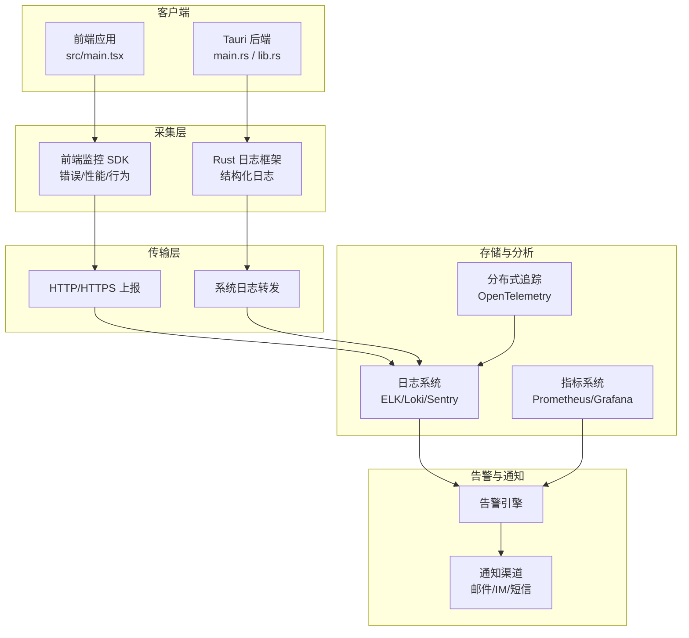

[此图为概念性架构图，不直接映射具体源码文件]

## 详细组件分析

### 前端错误监控与异常捕获
- 初始化时机
  - 在应用启动时完成 SDK 初始化，读取环境变量以决定上报目标与采样策略。
- 全局异常捕获
  - 捕获未处理的 Promise 拒绝与全局异常，附加当前路由、用户会话标识（脱敏）、设备信息与堆栈。
- 业务错误边界
  - 对关键页面与复杂组件使用错误边界，避免单点异常影响整体可用性。
- 网络请求错误
  - 拦截所有 HTTP 请求，记录失败原因、状态码、耗时与重试次数。
- 性能埋点
  - 采集首屏渲染时间、关键交互延迟、资源加载耗时、JS 执行耗时与长任务阻塞。
- 用户行为埋点
  - 对核心功能点击、表单提交、页面跳转等行为进行匿名化埋点，避免上传敏感内容。

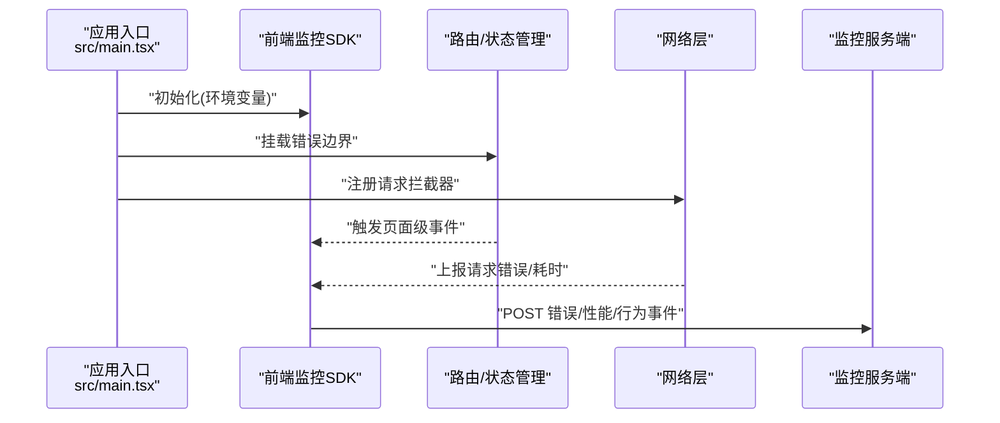

**图表来源**
- [src/main.tsx](file://src/main.tsx)

**章节来源**
- [src/main.tsx](file://src/main.tsx)
- [vite.config.js](file://vite.config.js)
- [package.json](file://package.json)

### Rust 后端日志记录与错误追踪
- 日志框架初始化
  - 在主进程入口初始化日志框架，设置日志级别、输出格式、轮转策略与目标（控制台/文件/远程）。
- 结构化日志
  - 所有关键流程输出结构化日志，包含 trace_id、span_id、level、service、env、timestamp、message、metadata。
- 错误捕获与上报
  - 在 Tauri 命令层统一捕获错误，转换为标准错误对象并写入日志；必要时上报至远端错误追踪系统。
- 系统级异常
  - 捕获未处理异常与 panic，生成崩溃报告并附带上下文信息。

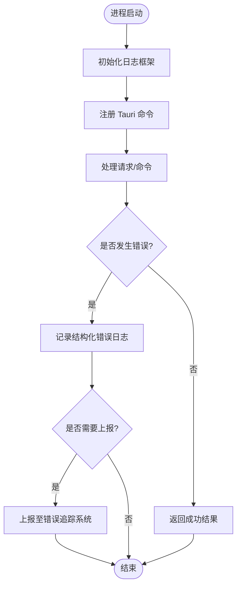

**图表来源**
- [src-tauri/src/main.rs](file://src-tauri/src/main.rs)
- [src-tauri/src/lib.rs](file://src-tauri/src/lib.rs)

**章节来源**
- [src-tauri/src/main.rs](file://src-tauri/src/main.rs)
- [src-tauri/src/lib.rs](file://src-tauri/src/lib.rs)
- [src-tauri/Cargo.toml](file://src-tauri/Cargo.toml)

### 性能监控指标与关键业务埋点
- 前端指标
  - 首屏时间、FCP/LCP、CLS、FID/INP、JS 执行耗时、长任务阻塞、资源命中率。
- 后端指标
  - CPU/内存占用、GC 次数、磁盘 I/O、网络请求耗时、数据库查询耗时、队列积压。
- 业务埋点
  - 关键操作：创建/编辑/删除任务、保存清单、导出报告、同步状态变更。
  - 埋点字段：事件名、时间戳、用户匿名 ID、功能模块、操作类型、耗时、结果码、上下文（脱敏）。

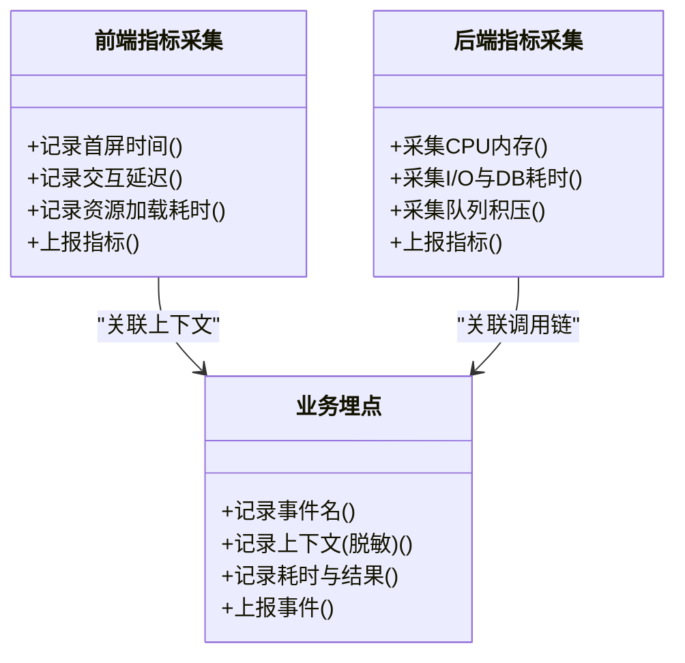

[此图为概念性类图，不直接映射具体源码文件]

**章节来源**
- [src/main.tsx](file://src/main.tsx)
- [src-tauri/src/lib.rs](file://src-tauri/src/lib.rs)

### 生产环境日志聚合与分析工具集成
- 推荐工具
  - 日志系统：ELK/EFK、Loki、Sentry（错误追踪）。
  - 指标系统：Prometheus + Grafana。
  - 分布式追踪：OpenTelemetry。
- 集成要点
  - 统一日志格式与字段规范。
  - 按服务与环境分索引/标签。
  - 设置合理的保留期与冷热分层。
  - 提供检索模板与仪表盘。

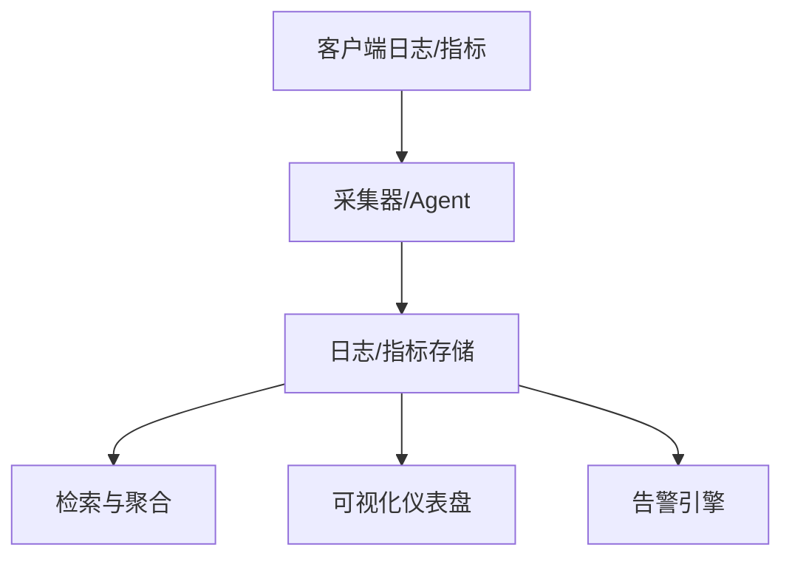

[此图为概念性架构图，不直接映射具体源码文件]

**章节来源**
- [src-tauri/tauri.conf.json](file://src-tauri/tauri.conf.json)
- [vite.config.js](file://vite.config.js)

### 用户行为分析与使用统计策略
- 数据范围
  - 仅采集匿名化行为事件与必要上下文，不包含个人信息与敏感数据。
- 授权与透明
  - 首次运行提示并获取用户同意，提供设置中关闭选项。
- 采样与去重
  - 高流量场景下启用采样与去重，降低存储与带宽压力。
- 合规与审计
  - 定期审查采集字段与用途，满足隐私法规要求。

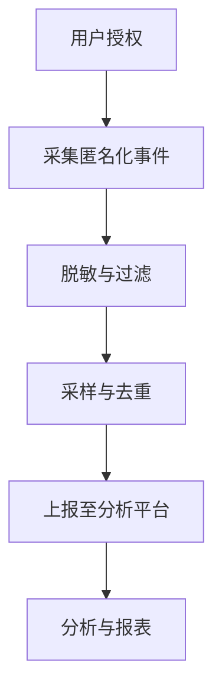

[此图为概念性流程图，不直接映射具体源码文件]

**章节来源**
- [src/main.tsx](file://src/main.tsx)

### 告警规则配置与通知机制
- 告警规则
  - 错误率阈值、慢请求比例、首屏时间超标、资源加载失败率、后端 CPU/内存峰值、数据库慢查询。
- 通知渠道
  - 邮件、企业 IM、短信、电话（P0）。
- 分级与升级
  - P0/P1/P2 分级，定义响应时间与升级路径。
- 演练与验证
  - 定期演练告警触发与处置流程，确保有效性。

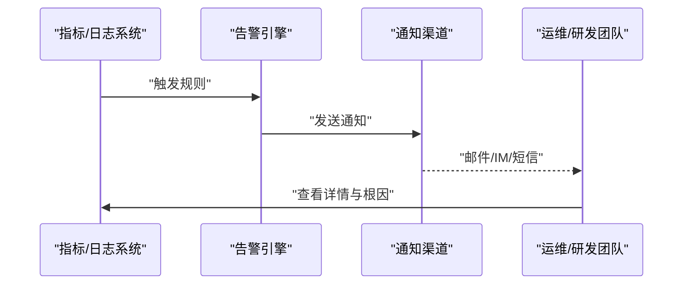

[此图为概念性序列图，不直接映射具体源码文件]

**章节来源**
- [src-tauri/tauri.conf.json](file://src-tauri/tauri.conf.json)

### 隐私保护与数据脱敏最佳实践
- 禁止上报敏感信息
  - 密码、令牌、身份证号、手机号、邮箱、健康数据等。
- 脱敏策略
  - 对可能包含敏感信息的字段进行哈希或掩码处理，保留必要分析维度。
- 最小化原则
  - 仅采集达成目的所需的最小数据集。
- 生命周期管理
  - 设定数据保留期与自动清理策略。

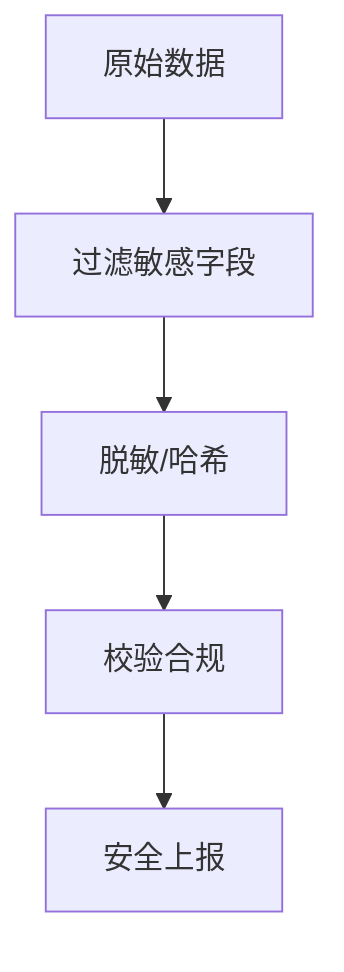

[此图为概念性流程图，不直接映射具体源码文件]

**章节来源**
- [src/main.tsx](file://src/main.tsx)
- [src-tauri/src/lib.rs](file://src-tauri/src/lib.rs)

### 故障诊断与问题定位工具链配置
- 本地开发
  - 开启详细日志与调试模式，使用浏览器开发者工具与 Tauri 调试窗口。
- 生产环境
  - 仅开启必要日志级别，启用结构化日志与分布式追踪。
- 工具链
  - 错误追踪：Sentry。
  - 指标与可视化：Prometheus + Grafana。
  - 日志检索：ELK/Loki。
  - 分布式追踪：OpenTelemetry。
- 排障流程
  - 通过 trace_id 串联前后端日志与调用链，快速定位根因。

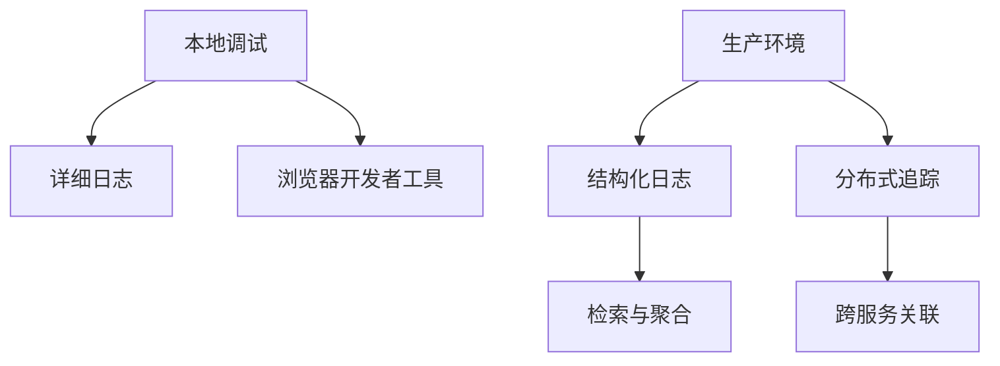

[此图为概念性架构图，不直接映射具体源码文件]

**章节来源**
- [src/main.tsx](file://src/main.tsx)
- [src-tauri/src/main.rs](file://src-tauri/src/main.rs)
- [src-tauri/src/lib.rs](file://src-tauri/src/lib.rs)

## 依赖分析
监控与日志涉及的依赖主要集中在前后端构建与运行时配置中：
- 前端依赖
  - package.json 中声明的监控 SDK、性能采集与行为分析库。
  - vite.config.js 中环境变量注入与构建优化。
- 后端依赖
  - Cargo.toml 中声明的日志框架、错误追踪与指标采集 crate。
  - tauri.conf.json 中权限与能力配置，影响日志输出与上报能力。

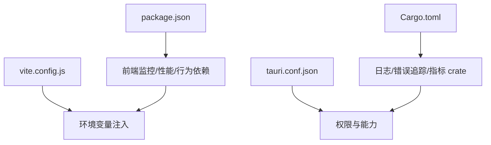

**图表来源**
- [package.json](file://package.json)
- [vite.config.js](file://vite.config.js)
- [src-tauri/Cargo.toml](file://src-tauri/Cargo.toml)
- [src-tauri/tauri.conf.json](file://src-tauri/tauri.conf.json)

**章节来源**
- [package.json](file://package.json)
- [vite.config.js](file://vite.config.js)
- [src-tauri/Cargo.toml](file://src-tauri/Cargo.toml)
- [src-tauri/tauri.conf.json](file://src-tauri/tauri.conf.json)

## 性能考虑
- 采样与节流
  - 在高并发场景下对上报数据进行采样与节流，避免影响主流程性能。
- 批量上报
  - 合并多条日志/指标为批量请求，减少网络开销。
- 异步与非阻塞
  - 监控与日志上报应异步执行，避免阻塞关键路径。
- 资源限制
  - 设置最大缓存条数与超时时间，防止内存泄漏与雪崩。
- 降级策略
  - 当上报服务不可用时，本地缓存并稍后重试，或降级为仅本地日志。

[本节为通用指导，无需特定文件来源]

## 故障诊断指南
- 常见问题
  - 前端白屏：检查错误边界与全局异常捕获是否生效。
  - 日志缺失：确认日志框架初始化与输出目标配置。
  - 上报失败：检查网络连通性与鉴权配置。
  - 性能退化：排查长任务、资源加载瓶颈与数据库慢查询。
- 定位步骤
  - 通过 trace_id 串联前后端日志与调用链。
  - 使用仪表盘观察指标趋势与异常峰值。
  - 复现场景并开启详细日志，收集崩溃报告与堆栈信息。
- 恢复措施
  - 快速回滚或降级非关键功能。
  - 扩容或重启受影响实例。
  - 更新配置与补丁，持续监控效果。

**章节来源**
- [src/main.tsx](file://src/main.tsx)
- [src-tauri/src/main.rs](file://src-tauri/src/main.rs)
- [src-tauri/src/lib.rs](file://src-tauri/src/lib.rs)

## 结论
通过在前端与后端分别接入错误监控、性能采集与结构化日志，并结合集中式日志系统、指标平台与分布式追踪，FishWorker 可实现端到端的可观测性。配合严格的隐私保护与数据脱敏策略、完善的告警与通知机制，以及标准化的故障诊断流程，团队能够在生产环境中快速发现问题、定位根因并高效恢复服务。

[本节为总结性内容，无需特定文件来源]

## 附录
- 术语表
  - 错误追踪：记录并分析应用运行时的错误与异常。
  - 分布式追踪：跨服务调用链的时序与上下文关联。
  - 指标：量化系统运行状态的数值型数据。
  - 结构化日志：具有固定字段与格式的日志记录。
- 参考链接
  - 前端监控 SDK 官方文档
  - Rust 日志框架文档
  - Tauri 权限与能力配置说明
  - 日志系统与 APM 集成指南

[本节为补充信息，无需特定文件来源]