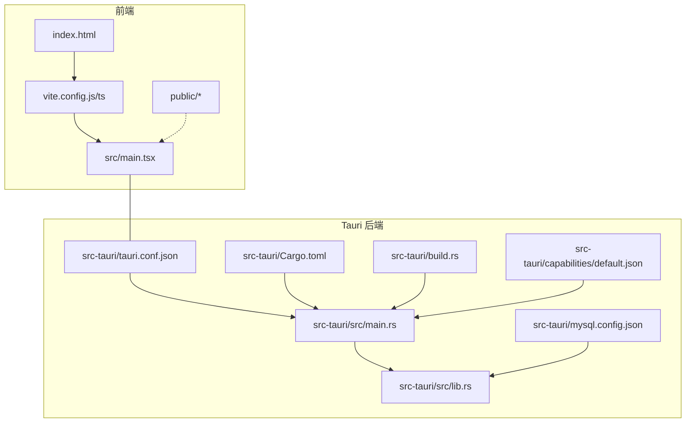
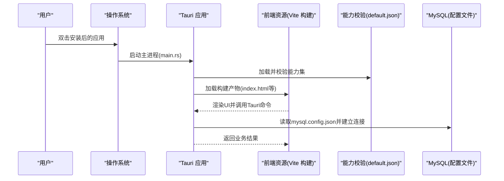
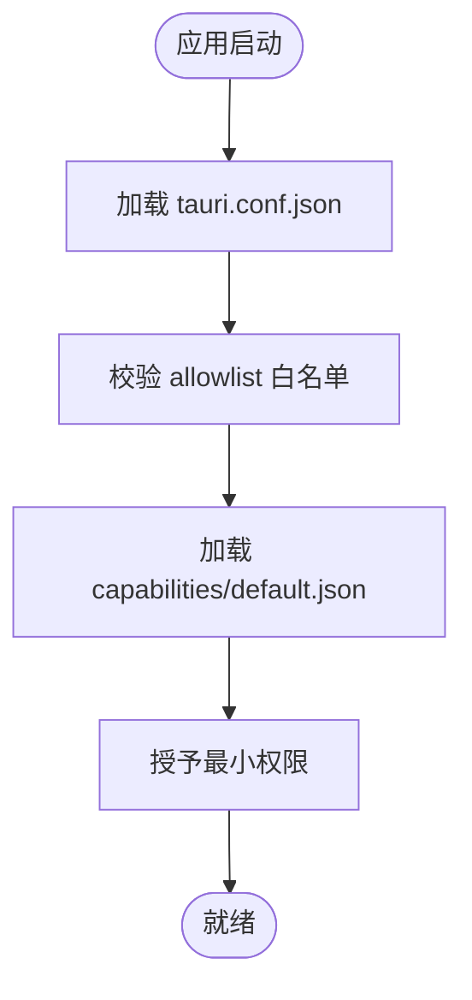
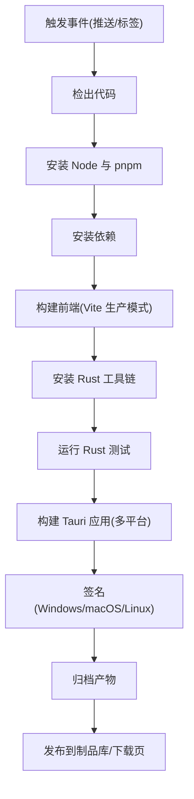
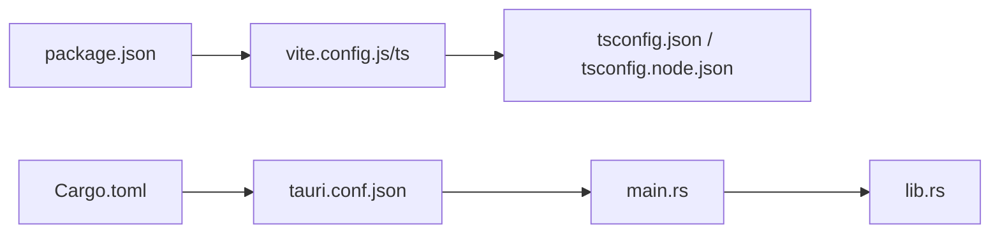

# 部署与发布

<cite>
**本文引用的文件**   
- [README.md](file://README.md)
- [package.json](file://package.json)
- [vite.config.js](file://vite.config.js)
- [vite.config.ts](file://vite.config.ts)
- [tsconfig.json](file://tsconfig.json)
- [tsconfig.node.json](file://tsconfig.node.json)
- [index.html](file://index.html)
- [src/main.tsx](file://src/main.tsx)
- [src-tauri/tauri.conf.json](file://src-tauri/tauri.conf.json)
- [src-tauri/Cargo.toml](file://src-tauri/Cargo.toml)
- [src-tauri/build.rs](file://src-tauri/build.rs)
- [src-tauri/src/lib.rs](file://src-tauri/src/lib.rs)
- [src-tauri/src/main.rs](file://src-tauri/src/main.rs)
- [src-tauri/capabilities/default.json](file://src-tauri/capabilities/default.json)
- [src-tauri/mysql.config.json](file://src-tauri/mysql.config.json)
</cite>

## 目录
1. [简介](#简介)
2. [项目结构](#项目结构)
3. [核心组件](#核心组件)
4. [架构总览](#架构总览)
5. [详细组件分析](#详细组件分析)
6. [依赖分析](#依赖分析)
7. [性能考虑](#性能考虑)
8. [故障排查指南](#故障排查指南)
9. [结论](#结论)
10. [附录](#附录)

## 简介
本文件面向生产环境的构建、打包、签名、权限与安全、CI/CD、更新机制、版本管理、回滚策略，以及监控与运维健康检查。FishWorker 采用前端（Vite + React）+ Tauri（Rust）的桌面应用架构：前端负责 UI 与交互，Tauri 提供系统能力与本地数据库访问。文档将基于仓库现有配置给出可操作的部署与发布方案，并标注具体源码位置以便追溯。

## 项目结构
- 前端工程根目录包含 Vite 配置、TypeScript 配置、入口 HTML 与 React 入口文件。
- Tauri 后端位于 src-tauri，包含 Cargo 工程、Tauri 配置、能力定义、构建脚本与 Rust 源文件。
- 资源与静态文件位于 public 目录。

图表来源
- [vite.config.js:1-200](file://vite.config.js#L1-L200)
- [vite.config.ts:1-200](file://vite.config.ts#L1-L200)
- [index.html:1-200](file://index.html#L1-L200)
- [src/main.tsx:1-200](file://src/main.tsx#L1-L200)
- [src-tauri/tauri.conf.json:1-200](file://src-tauri/tauri.conf.json#L1-L200)
- [src-tauri/Cargo.toml:1-200](file://src-tauri/Cargo.toml#L1-L200)
- [src-tauri/build.rs:1-200](file://src-tauri/build.rs#L1-L200)
- [src-tauri/src/main.rs:1-200](file://src-tauri/src/main.rs#L1-L200)
- [src-tauri/src/lib.rs:1-200](file://src-tauri/src/lib.rs#L1-L200)
- [src-tauri/capabilities/default.json:1-200](file://src-tauri/capabilities/default.json#L1-L200)
- [src-tauri/mysql.config.json:1-200](file://src-tauri/mysql.config.json#L1-L200)

章节来源
- [README.md:1-200](file://README.md#L1-L200)
- [package.json:1-200](file://package.json#L1-L200)
- [vite.config.js:1-200](file://vite.config.js#L1-L200)
- [vite.config.ts:1-200](file://vite.config.ts#L1-L200)
- [tsconfig.json:1-200](file://tsconfig.json#L1-L200)
- [tsconfig.node.json:1-200](file://tsconfig.node.json#L1-L200)
- [index.html:1-200](file://index.html#L1-L200)
- [src/main.tsx:1-200](file://src/main.tsx#L1-L200)
- [src-tauri/tauri.conf.json:1-200](file://src-tauri/tauri.conf.json#L1-L200)
- [src-tauri/Cargo.toml:1-200](file://src-tauri/Cargo.toml#L1-L200)
- [src-tauri/build.rs:1-200](file://src-tauri/build.rs#L1-L200)
- [src-tauri/src/main.rs:1-200](file://src-tauri/src/main.rs#L1-L200)
- [src-tauri/src/lib.rs:1-200](file://src-tauri/src/lib.rs#L1-L200)
- [src-tauri/capabilities/default.json:1-200](file://src-tauri/capabilities/default.json#L1-L200)
- [src-tauri/mysql.config.json:1-200](file://src-tauri/mysql.config.json#L1-L200)

## 核心组件
- 前端构建与优化：由 Vite 驱动，结合 TypeScript 与 CSS/SCSS 处理；通过环境变量区分开发/生产模式，启用代码分割、压缩与缓存策略。
- Tauri 应用：以 Rust 实现，使用 tauri.conf.json 控制窗口、协议、安全策略、插件与打包产物；capabilities 定义最小权限集；build.rs 用于构建期资源处理。
- 数据层：MySQL 连接配置位于 mysql.config.json，供后端在受控环境下读取。

章节来源
- [vite.config.js:1-200](file://vite.config.js#L1-L200)
- [vite.config.ts:1-200](file://vite.config.ts#L1-L200)
- [tsconfig.json:1-200](file://tsconfig.json#L1-L200)
- [tsconfig.node.json:1-200](file://tsconfig.node.json#L1-L200)
- [src/main.tsx:1-200](file://src/main.tsx#L1-L200)
- [src-tauri/tauri.conf.json:1-200](file://src-tauri/tauri.conf.json#L1-L200)
- [src-tauri/Cargo.toml:1-200](file://src-tauri/Cargo.toml#L1-L200)
- [src-tauri/build.rs:1-200](file://src-tauri/build.rs#L1-L200)
- [src-tauri/src/main.rs:1-200](file://src-tauri/src/main.rs#L1-L200)
- [src-tauri/src/lib.rs:1-200](file://src-tauri/src/lib.rs#L1-L200)
- [src-tauri/capabilities/default.json:1-200](file://src-tauri/capabilities/default.json#L1-L200)
- [src-tauri/mysql.config.json:1-200](file://src-tauri/mysql.config.json#L1-L200)

## 架构总览
下图展示了从用户启动到前端渲染、Tauri 初始化、能力校验与本地资源加载的整体流程。

图表来源
- [src-tauri/src/main.rs:1-200](file://src-tauri/src/main.rs#L1-L200)
- [src-tauri/src/lib.rs:1-200](file://src-tauri/src/lib.rs#L1-L200)
- [src-tauri/capabilities/default.json:1-200](file://src-tauri/capabilities/default.json#L1-L200)
- [src-tauri/mysql.config.json:1-200](file://src-tauri/mysql.config.json#L1-L200)
- [index.html:1-200](file://index.html#L1-L200)

## 详细组件分析

### 前端构建与资源优化（Vite）
- 构建目标与环境变量：通过环境变量切换开发与生产模式，生产环境启用压缩、Tree-shaking、代码分割与静态资源哈希。
- 输出目录与路径：配置构建输出目录与基础路径，便于后续打包分发与 CDN 托管。
- 资源处理：支持 SCSS/CSS 预处理、图片与字体资源优化，按需引入第三方库以减少包体。
- 类型与编译：TypeScript 严格模式与 Node 侧 tsconfig 分离，确保前后端构建一致性。

建议的生产级优化要点
- 开启生产模式下的代码压缩与模块拆分，减少首屏体积。
- 对静态资源启用长缓存与内容哈希，配合服务端缓存头。
- 仅在生产构建时注入必要的环境变量，避免泄露调试信息。
- 使用预构建或外部化大型依赖，降低打包时间。

章节来源
- [vite.config.js:1-200](file://vite.config.js#L1-L200)
- [vite.config.ts:1-200](file://vite.config.ts#L1-L200)
- [tsconfig.json:1-200](file://tsconfig.json#L1-L200)
- [tsconfig.node.json:1-200](file://tsconfig.node.json#L1-L200)
- [index.html:1-200](file://index.html#L1-L200)
- [src/main.tsx:1-200](file://src/main.tsx#L1-L200)

### Tauri 应用打包与跨平台配置
- 应用元信息与窗口：在 tauri.conf.json 中设置应用名称、版本、图标、窗口尺寸与行为。
- 安全与沙箱：通过 allowlist 与 capabilities 限制可用 API，遵循最小权限原则。
- 构建脚本：build.rs 可在构建期生成或拷贝资源，统一产物结构。
- 依赖与特性：Cargo.toml 声明 Rust 依赖与可选特性，影响最终二进制大小与功能。

跨平台打包与签名
- Windows：建议使用 Authenticode 签名，提升安装器可信度；配置证书路径与密码。
- macOS：需开发者证书与 Notarization，配置签名与公证参数。
- Linux：按发行版要求生成对应包格式（如 AppImage、deb），必要时进行 GPG 签名。

章节来源
- [src-tauri/tauri.conf.json:1-200](file://src-tauri/tauri.conf.json#L1-L200)
- [src-tauri/build.rs:1-200](file://src-tauri/build.rs#L1-L200)
- [src-tauri/Cargo.toml:1-200](file://src-tauri/Cargo.toml#L1-L200)
- [src-tauri/src/main.rs:1-200](file://src-tauri/src/main.rs#L1-L200)

### 权限配置、安全设置与沙箱机制
- 能力集：default.json 定义默认能力集合，仅暴露必要的 Tauri 命令与系统 API。
- 白名单：t aur i.conf.json 中的 allowlist 控制前端可访问的后端能力范围。
- 最小权限：为不同场景创建独立能力集，按需授予，避免过度授权。
- 输入校验：所有来自前端的命令参数应在 Rust 侧进行严格校验与错误处理。

图表来源
- [src-tauri/tauri.conf.json:1-200](file://src-tauri/tauri.conf.json#L1-L200)
- [src-tauri/capabilities/default.json:1-200](file://src-tauri/capabilities/default.json#L1-L200)

章节来源
- [src-tauri/tauri.conf.json:1-200](file://src-tauri/tauri.conf.json#L1-L200)
- [src-tauri/capabilities/default.json:1-200](file://src-tauri/capabilities/default.json#L1-L200)

### 数据与配置（MySQL）
- 配置文件：mysql.config.json 存放数据库连接参数，建议在构建期注入或通过安全方式读取。
- 连接管理：在后端建立连接池，做好超时、重试与错误上报。
- 敏感信息：生产环境应通过环境变量或密钥管理服务注入，避免硬编码。

章节来源
- [src-tauri/mysql.config.json:1-200](file://src-tauri/mysql.config.json#L1-L200)
- [src-tauri/src/lib.rs:1-200](file://src-tauri/src/lib.rs#L1-L200)

### CI/CD 流水线示例（GitHub Actions）
以下示例展示多平台构建、测试与产物归档的流程，可按需扩展签名与发布步骤。

说明
- 节点环境与 Rust 工具链需在矩阵中覆盖各平台。
- 前端构建产物作为 Tauri 资源嵌入。
- 签名阶段根据平台准备证书与凭据。
- 产物归档后提供下载链接或上传至包管理器。

[本节为概念性流程图，不直接映射具体源码文件]

### 应用更新机制、版本管理与回滚策略
- 版本标识：统一使用语义化版本，并在 tauri.conf.json 与前端构建中保持一致。
- 更新检查：后端定时或启动时检查远端更新清单，对比当前版本与最新版本。
- 增量更新：优先采用差分更新，减小下载体积。
- 灰度发布：先对小比例用户开放新版本，观察指标后再全量。
- 回滚策略：保留上一稳定版本安装包与数据迁移脚本，出现异常快速回退。

章节来源
- [src-tauri/tauri.conf.json:1-200](file://src-tauri/tauri.conf.json#L1-L200)

### 生产环境监控、错误收集与日志
- 前端错误：捕获未处理异常与 Promise 拒绝，上报到错误追踪服务。
- 性能指标：采集关键页面加载时间、交互延迟与内存占用。
- 后端日志：结构化日志输出，包含请求 ID、上下文与错误堆栈。
- 远程配置：通过配置中心动态调整日志级别与采样率。

[本节为通用实践建议，不直接分析具体源码文件]

### 部署后健康检查与运维建议
- 健康检查：提供本地健康接口或状态查询，验证数据库连通性与核心功能可用性。
- 资源监控：关注 CPU、内存、磁盘与网络 IO，设置告警阈值。
- 日志轮转：按天或大小切分日志，保留合理周期。
- 崩溃恢复：自动重启与崩溃报告，记录崩溃现场。

[本节为通用实践建议，不直接分析具体源码文件]

## 依赖分析
- 前端依赖：由 package.json 管理，包含构建工具、运行时与开发依赖。
- 后端依赖：由 Cargo.toml 管理，声明 Tauri、数据库驱动与工具库。
- 构建依赖：Vite 与 TypeScript 配置决定编译与优化行为。

图表来源
- [package.json:1-200](file://package.json#L1-L200)
- [vite.config.js:1-200](file://vite.config.js#L1-L200)
- [vite.config.ts:1-200](file://vite.config.ts#L1-L200)
- [tsconfig.json:1-200](file://tsconfig.json#L1-L200)
- [tsconfig.node.json:1-200](file://tsconfig.node.json#L1-L200)
- [src-tauri/Cargo.toml:1-200](file://src-tauri/Cargo.toml#L1-L200)
- [src-tauri/tauri.conf.json:1-200](file://src-tauri/tauri.conf.json#L1-L200)
- [src-tauri/src/main.rs:1-200](file://src-tauri/src/main.rs#L1-L200)
- [src-tauri/src/lib.rs:1-200](file://src-tauri/src/lib.rs#L1-L200)

章节来源
- [package.json:1-200](file://package.json#L1-L200)
- [src-tauri/Cargo.toml:1-200](file://src-tauri/Cargo.toml#L1-L200)

## 性能考虑
- 前端
  - 启用生产模式压缩与 Tree-shaking，减少包体。
  - 对大依赖进行外部化或懒加载，降低首屏时间。
  - 静态资源启用强缓存与内容哈希，利用浏览器缓存。
- 后端
  - 数据库连接池与查询优化，避免阻塞主线程。
  - 日志采样与异步写入，降低 I/O 开销。
  - 按需启用特性与移除调试符号，减小二进制体积。

[本节为通用指导，不直接分析具体源码文件]

## 故障排查指南
- 构建失败
  - 检查 Node/Rust 工具链版本与平台依赖是否满足。
  - 确认环境变量与密钥已正确注入。
- 权限不足
  - 核对 capabilities 与 allowlist 配置，确保所需 API 已授权。
- 数据库连接问题
  - 校验 mysql.config.json 的连接参数与网络可达性。
- 日志定位
  - 查看应用日志与崩溃报告，结合请求 ID 追踪问题链路。

章节来源
- [src-tauri/capabilities/default.json:1-200](file://src-tauri/capabilities/default.json#L1-L200)
- [src-tauri/tauri.conf.json:1-200](file://src-tauri/tauri.conf.json#L1-L200)
- [src-tauri/mysql.config.json:1-200](file://src-tauri/mysql.config.json#L1-L200)

## 结论
通过合理的 Vite 构建优化与 Tauri 安全配置，FishWorker 可在多平台上高效构建与发布。结合最小权限原则、严格的输入校验与完善的监控日志体系，能够保障生产环境的稳定性与安全性。建议配套 CI/CD 流水线与灰度发布策略，持续改进交付质量与用户体验。

## 附录
- 术语
  - 能力集：定义应用可用的系统 API 集合。
  - 白名单：限制前端可访问的后端能力范围。
  - 语义化版本：主版本.次版本.修订号的版本规范。
- 参考
  - 前端构建：参见 Vite 官方文档。
  - Tauri 安全：参见 Tauri 官方安全指南。