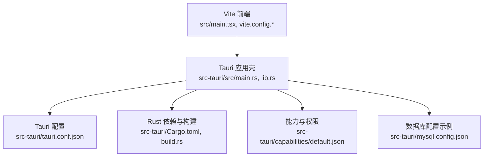
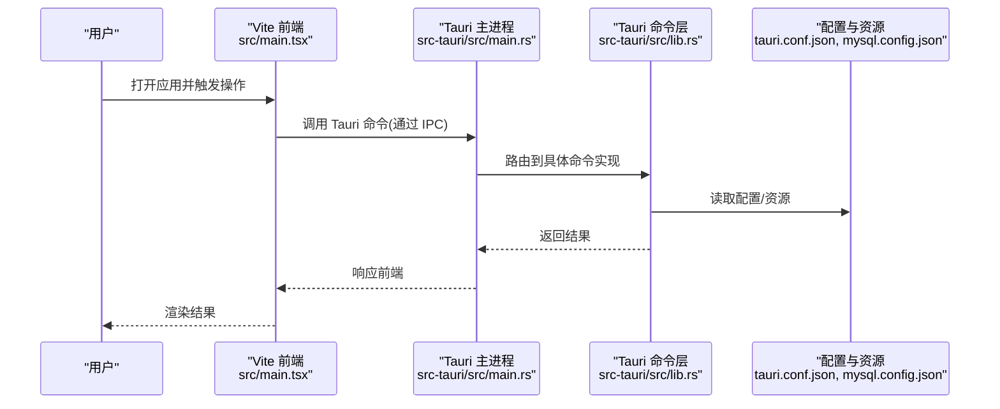
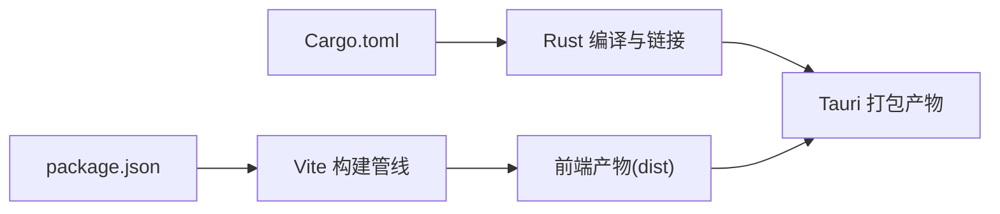

# 部署指南

<cite>
**本文引用的文件**   
- [README.md](file://README.md)
- [package.json](file://package.json)
- [vite.config.js](file://vite.config.js)
- [vite.config.ts](file://vite.config.ts)
- [tsconfig.json](file://tsconfig.json)
- [index.html](file://index.html)
- [src/main.tsx](file://src/main.tsx)
- [src-tauri/tauri.conf.json](file://src-tauri/tauri.conf.json)
- [src-tauri/Cargo.toml](file://src-tauri/Cargo.toml)
- [src-tauri/build.rs](file://src-tauri/build.rs)
- [src-tauri/src/lib.rs](file://src-tauri/src/lib.rs)
- [src-tauri/src/main.rs](file://src-tauri/src/main.rs)
- [src-tauri/capabilities/default.json](file://src-tauri/capabilities/default.json)
- [src-tauri/mysql.config.json](file://src-tauri/mysql.config.json)
</cite>

## 目录
1. [简介](#简介)
2. [项目结构](#项目结构)
3. [核心组件](#核心组件)
4. [架构总览](#架构总览)
5. [详细组件分析](#详细组件分析)
6. [依赖分析](#依赖分析)
7. [性能考虑](#性能考虑)
8. [故障排查指南](#故障排查指南)
9. [结论](#结论)
10. [附录](#附录)

## 简介
本指南面向 FishWorker 应用的跨平台打包与发布，覆盖 Windows、macOS、Linux 的构建与发布流程，包括 Tauri 后端与 Vite 前端的集成、构建优化与代码压缩策略、生产环境配置与环境变量管理、应用更新机制与版本管理、安装程序生成与数字签名、日志收集与问题诊断，以及部署后的监控与维护建议。读者无需深入源码即可按步骤完成本地构建、测试与发布。

## 项目结构
FishWorker 采用 Tauri + Vite 的前后端一体化桌面应用结构：
- 前端使用 Vite 进行开发与构建，输出静态资源供 Tauri 加载。
- 后端使用 Rust（Tauri）提供系统能力与业务逻辑，通过 Tauri 命令与前端通信。
- 配置文件集中于根目录与 src-tauri 目录，便于多环境管理与发布。

图表来源
- [src/main.tsx](file://src/main.tsx)
- [vite.config.js](file://vite.config.js)
- [vite.config.ts](file://vite.config.ts)
- [src-tauri/src/main.rs](file://src-tauri/src/main.rs)
- [src-tauri/src/lib.rs](file://src-tauri/src/lib.rs)
- [src-tauri/tauri.conf.json](file://src-tauri/tauri.conf.json)
- [src-tauri/Cargo.toml](file://src-tauri/Cargo.toml)
- [src-tauri/build.rs](file://src-tauri/build.rs)
- [src-tauri/capabilities/default.json](file://src-tauri/capabilities/default.json)
- [src-tauri/mysql.config.json](file://src-tauri/mysql.config.json)

章节来源
- [README.md](file://README.md)
- [package.json](file://package.json)
- [vite.config.js](file://vite.config.js)
- [vite.config.ts](file://vite.config.ts)
- [tsconfig.json](file://tsconfig.json)
- [index.html](file://index.html)
- [src/main.tsx](file://src/main.tsx)
- [src-tauri/tauri.conf.json](file://src-tauri/tauri.conf.json)
- [src-tauri/Cargo.toml](file://src-tauri/Cargo.toml)
- [src-tauri/build.rs](file://src-tauri/build.rs)
- [src-tauri/src/lib.rs](file://src-tauri/src/lib.rs)
- [src-tauri/src/main.rs](file://src-tauri/src/main.rs)
- [src-tauri/capabilities/default.json](file://src-tauri/capabilities/default.json)
- [src-tauri/mysql.config.json](file://src-tauri/mysql.config.json)

## 核心组件
- 前端入口与构建
  - 前端入口位于 src/main.tsx，由 Vite 驱动开发服务器与构建流程。
  - Vite 配置在 vite.config.js 与 vite.config.ts 中，用于定义开发/生产模式、资源路径、插件与优化选项。
  - TypeScript 编译与类型检查由 tsconfig.json 控制。
  - 页面模板 index.html 作为 SPA 入口。
- Tauri 后端与打包
  - Tauri 主进程与命令注册位于 src-tauri/src/main.rs 与 src-tauri/src/lib.rs。
  - Tauri 应用元数据、窗口与资源路径等由 src-tauri/tauri.conf.json 管理。
  - Rust 依赖与构建脚本由 src-tauri/Cargo.toml 与 src-tauri/build.rs 管理。
  - 能力与权限由 src-tauri/capabilities/default.json 声明。
  - 数据库连接配置示例位于 src-tauri/mysql.config.json。

章节来源
- [src/main.tsx](file://src/main.tsx)
- [vite.config.js](file://vite.config.js)
- [vite.config.ts](file://vite.config.ts)
- [tsconfig.json](file://tsconfig.json)
- [index.html](file://index.html)
- [src-tauri/src/main.rs](file://src-tauri/src/main.rs)
- [src-tauri/src/lib.rs](file://src-tauri/src/lib.rs)
- [src-tauri/tauri.conf.json](file://src-tauri/tauri.conf.json)
- [src-tauri/Cargo.toml](file://src-tauri/Cargo.toml)
- [src-tauri/build.rs](file://src-tauri/build.rs)
- [src-tauri/capabilities/default.json](file://src-tauri/capabilities/default.json)
- [src-tauri/mysql.config.json](file://src-tauri/mysql.config.json)

## 架构总览
下图展示了从用户交互到后端处理的端到端调用链，以及构建产物与发布物的关系。

图表来源
- [src/main.tsx](file://src/main.tsx)
- [src-tauri/src/main.rs](file://src-tauri/src/main.rs)
- [src-tauri/src/lib.rs](file://src-tauri/src/lib.rs)
- [src-tauri/tauri.conf.json](file://src-tauri/tauri.conf.json)
- [src-tauri/mysql.config.json](file://src-tauri/mysql.config.json)

## 详细组件分析

### 前端构建与优化（Vite）
- 构建目标
  - 开发模式：热重载、SourceMap、调试友好。
  - 生产模式：代码分割、Tree Shaking、压缩与缓存策略。
- 关键配置点
  - 入口与模板：src/main.tsx 与 index.html。
  - 构建配置：vite.config.js 与 vite.config.ts 中的模式、输出目录、资源路径与插件。
  - 类型与编译：tsconfig.json 确保类型安全与模块解析。
- 优化建议
  - 启用按需加载与分包策略，减少首屏体积。
  - 对静态资源启用哈希与长期缓存。
  - 关闭不必要的调试信息，开启压缩与混淆。

章节来源
- [src/main.tsx](file://src/main.tsx)
- [vite.config.js](file://vite.config.js)
- [vite.config.ts](file://vite.config.ts)
- [tsconfig.json](file://tsconfig.json)
- [index.html](file://index.html)

### Tauri 后端与打包（Rust）
- 应用壳与命令
  - 主进程初始化与生命周期在 src-tauri/src/main.rs。
  - 命令注册与业务逻辑在 src-tauri/src/lib.rs。
- 配置与资源
  - tauri.conf.json 定义应用名称、版本、窗口、资源路径与构建产物位置。
  - capabilities/default.json 声明所需能力与权限。
  - mysql.config.json 为数据库连接配置示例，生产环境应通过环境变量或外部配置注入。
- 构建与依赖
  - Cargo.toml 管理 Rust 依赖与特性开关。
  - build.rs 可用于预构建任务（如拷贝资源、生成代码）。
- 打包产物
  - 根据 tauri.conf.json 与平台工具链，生成各平台的安装包与可执行文件。

章节来源
- [src-tauri/src/main.rs](file://src-tauri/src/main.rs)
- [src-tauri/src/lib.rs](file://src-tauri/src/lib.rs)
- [src-tauri/tauri.conf.json](file://src-tauri/tauri.conf.json)
- [src-tauri/capabilities/default.json](file://src-tauri/capabilities/default.json)
- [src-tauri/mysql.config.json](file://src-tauri/mysql.config.json)
- [src-tauri/Cargo.toml](file://src-tauri/Cargo.toml)
- [src-tauri/build.rs](file://src-tauri/build.rs)

### 跨平台打包与发布流程
- 前置条件
  - Node.js 与 pnpm 用于前端构建。
  - Rust 工具链（cargo、rustc）与平台特定依赖（Windows SDK、Xcode、Linux 开发库）。
- 通用步骤
  - 安装依赖：pnpm install。
  - 前端构建：运行 Vite 构建命令，产出静态资源。
  - Tauri 构建：执行 Tauri 构建命令，生成平台包。
- 平台差异
  - Windows：需安装 Visual Studio Build Tools；可配置 NSIS 或 Inno Setup 安装器。
  - macOS：需 Xcode 命令行工具；可配置 Apple 开发者证书与 Notarization。
  - Linux：需安装对应发行版的开发头文件与打包工具（如 rpm、deb 工具链）。
- 发布渠道
  - 将构建产物上传至分发站点或应用商店；维护版本与更新清单。

章节来源
- [package.json](file://package.json)
- [src-tauri/tauri.conf.json](file://src-tauri/tauri.conf.json)
- [src-tauri/Cargo.toml](file://src-tauri/Cargo.toml)

### 构建优化与代码压缩策略
- 前端
  - 启用 Tree Shaking 与代码分割，减少首屏体积。
  - 使用 CSS 压缩与图片优化。
  - 合理划分动态导入，提升加载性能。
- 后端
  - 使用 release 模式构建，关闭调试符号。
  - 精简依赖与特性开关，避免引入无用二进制。
- 产物校验
  - 对比构建前后体积变化，定位大依赖。
  - 使用 SourceMap 进行线上问题定位（生产环境谨慎开启）。

章节来源
- [vite.config.js](file://vite.config.js)
- [vite.config.ts](file://vite.config.ts)
- [src-tauri/Cargo.toml](file://src-tauri/Cargo.toml)

### 生产环境配置与环境变量管理
- 配置分层
  - 默认配置：仓库内示例配置（如 mysql.config.json）。
  - 运行时配置：通过环境变量或外部配置文件注入，避免硬编码敏感信息。
- 环境变量
  - 前端：在构建时注入常量，区分开发/测试/生产。
  - 后端：在启动时读取环境变量，覆盖默认配置。
- 安全建议
  - 不在仓库中提交密钥与凭据。
  - 使用 CI/CD 的机密变量管理。
  - 最小权限原则，仅授予必要能力。

章节来源
- [src-tauri/mysql.config.json](file://src-tauri/mysql.config.json)
- [src-tauri/tauri.conf.json](file://src-tauri/tauri.conf.json)

### 应用更新机制与版本管理
- 版本标识
  - 统一版本号在 tauri.conf.json 与 package.json 中保持一致。
- 更新策略
  - 客户端定期请求更新清单（JSON），比对当前版本与最新版本。
  - 下载增量或全量补丁，校验签名后静默安装。
- 回滚与灰度
  - 支持灰度发布与快速回滚。
  - 失败自动降级到上一稳定版本。

章节来源
- [src-tauri/tauri.conf.json](file://src-tauri/tauri.conf.json)
- [package.json](file://package.json)

### 安装程序生成与数字签名配置
- 安装程序
  - Windows：NSIS 或 Inno Setup；配置卸载、快捷方式与开机自启。
  - macOS：DMG 或 PKG；配置沙盒与权限提示。
  - Linux：deb 或 rpm；配置服务与依赖。
- 数字签名
  - Windows：使用 EV 证书对安装包与可执行文件签名。
  - macOS：使用开发者证书签名并进行公证。
  - Linux：可选 GPG 签名与仓库签名。
- 自动化
  - 在 CI/CD 中注入证书与密钥，自动生成签名与公证流程。

章节来源
- [src-tauri/tauri.conf.json](file://src-tauri/tauri.conf.json)

### 日志收集与问题诊断方法
- 日志级别
  - 开发：详细日志与堆栈。
  - 生产：仅错误与关键事件，避免泄露敏感信息。
- 存储位置
  - 遵循各平台规范（Windows 事件查看器、macOS Console、Linux journal）。
- 采集与上报
  - 本地持久化日志文件，支持轮转与清理。
  - 可选远程上报（HTTPS），附带匿名设备信息与版本。
- 诊断工具
  - 结合崩溃报告与内存快照，定位问题根因。

章节来源
- [src-tauri/src/main.rs](file://src-tauri/src/main.rs)
- [src-tauri/src/lib.rs](file://src-tauri/src/lib.rs)

### 部署后的监控与维护建议
- 健康检查
  - 暴露轻量接口或心跳信号，便于运维探测。
- 指标采集
  - 记录启动时间、错误率、关键业务指标。
- 告警与通知
  - 设定阈值与告警规则，及时通知团队。
- 维护计划
  - 定期更新依赖与安全补丁。
  - 清理过期日志与临时文件。

[本节为通用指导，不直接分析具体文件]

## 依赖分析
- 前端依赖
  - Vite、TypeScript、React 生态（若使用）等，由 package.json 管理。
- 后端依赖
  - Tauri 框架与 Rust 第三方库，由 Cargo.toml 管理。
- 构建与打包
  - Vite 负责前端资源构建；Tauri CLI 负责后端打包与平台适配。

图表来源
- [package.json](file://package.json)
- [src-tauri/Cargo.toml](file://src-tauri/Cargo.toml)

章节来源
- [package.json](file://package.json)
- [src-tauri/Cargo.toml](file://src-tauri/Cargo.toml)

## 性能考虑
- 首屏加载
  - 拆分路由与组件，懒加载非关键模块。
  - 预取关键资源与字体。
- 运行时性能
  - 减少不必要重绘与状态更新。
  - 使用 Web Worker 处理耗时任务（如需）。
- 资源体积
  - 图片与媒体资源压缩与格式优化。
  - 移除未使用的样式与脚本。

[本节为通用指导，不直接分析具体文件]

## 故障排查指南
- 常见问题
  - 端口占用：修改开发服务器端口或释放占用。
  - 权限不足：以管理员/Root 权限运行或调整文件系统权限。
  - 网络访问受限：检查代理与防火墙设置。
- 日志定位
  - 查看应用日志与系统日志，定位异常堆栈。
- 复现与回归
  - 使用最小化用例复现问题，逐步缩小范围。
  - 回归测试验证修复效果。

章节来源
- [src-tauri/src/main.rs](file://src-tauri/src/main.rs)
- [src-tauri/src/lib.rs](file://src-tauri/src/lib.rs)

## 结论
通过合理的构建优化、严格的环境变量管理、完善的更新与签名流程，以及系统的日志与监控方案，FishWorker 可在多平台上稳定交付与持续演进。建议在 CI/CD 中固化上述流程，确保一致性与可追溯性。

[本节为总结，不直接分析具体文件]

## 附录
- 常用命令参考
  - 安装依赖：pnpm install
  - 前端构建：运行 Vite 构建命令
  - Tauri 构建：运行 Tauri 构建命令
- 参考文件
  - 应用说明：README.md
  - 前端配置：vite.config.js、vite.config.ts、tsconfig.json、index.html、src/main.tsx
  - 后端配置：src-tauri/tauri.conf.json、src-tauri/Cargo.toml、src-tauri/build.rs、src-tauri/src/main.rs、src-tauri/src/lib.rs、src-tauri/capabilities/default.json、src-tauri/mysql.config.json

章节来源
- [README.md](file://README.md)
- [package.json](file://package.json)
- [vite.config.js](file://vite.config.js)
- [vite.config.ts](file://vite.config.ts)
- [tsconfig.json](file://tsconfig.json)
- [index.html](file://index.html)
- [src/main.tsx](file://src/main.tsx)
- [src-tauri/tauri.conf.json](file://src-tauri/tauri.conf.json)
- [src-tauri/Cargo.toml](file://src-tauri/Cargo.toml)
- [src-tauri/build.rs](file://src-tauri/build.rs)
- [src-tauri/src/lib.rs](file://src-tauri/src/lib.rs)
- [src-tauri/src/main.rs](file://src-tauri/src/main.rs)
- [src-tauri/capabilities/default.json](file://src-tauri/capabilities/default.json)
- [src-tauri/mysql.config.json](file://src-tauri/mysql.config.json)