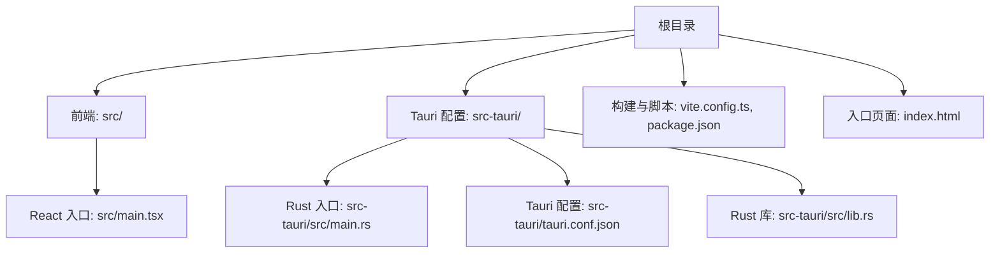
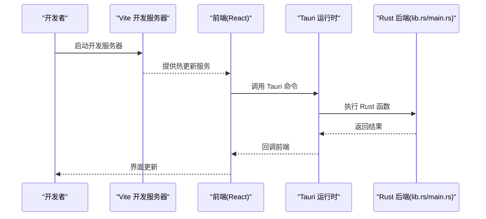
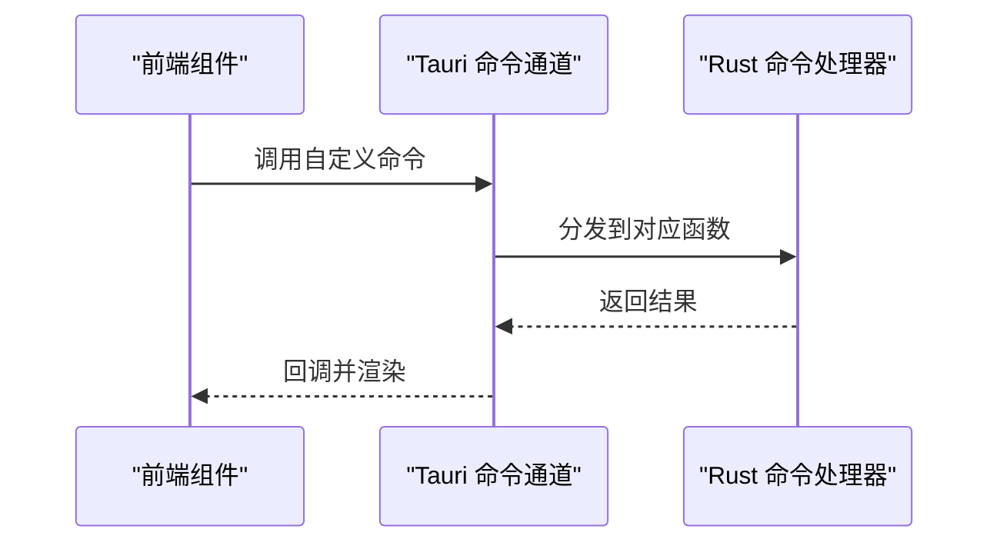
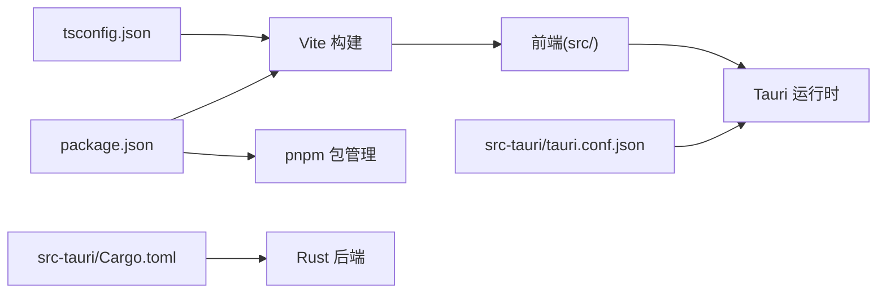

# 快速开始

<cite>
**本文引用的文件**   
- [README.md](file://README.md)
- [package.json](file://package.json)
- [pnpm-workspace.yaml](file://pnpm-workspace.yaml)
- [vite.config.ts](file://vite.config.ts)
- [tsconfig.json](file://tsconfig.json)
- [index.html](file://index.html)
- [src/main.tsx](file://src/main.tsx)
- [src-tauri/Cargo.toml](file://src-tauri/Cargo.toml)
- [src-tauri/tauri.conf.json](file://src-tauri/tauri.conf.json)
- [src-tauri/src/lib.rs](file://src-tauri/src/lib.rs)
- [src-tauri/src/main.rs](file://src-tauri/src/main.rs)
</cite>

## 目录
1. [简介](#简介)
2. [项目结构](#项目结构)
3. [核心组件](#核心组件)
4. [架构总览](#架构总览)
5. [详细组件分析](#详细组件分析)
6. [依赖分析](#依赖分析)
7. [性能考虑](#性能考虑)
8. [故障排查指南](#故障排查指南)
9. [结论](#结论)
10. [附录](#附录)

## 简介
本指南面向首次接触 FishWorker 的开发者，目标是帮助你在最短时间内完成环境搭建、安装依赖、启动开发服务器并运行桌面应用。你将学到：
- 如何准备 Node.js、pnpm、Rust 工具链
- 如何克隆仓库、安装依赖、构建与运行
- 常见问题的定位与解决（如 Rust 编译错误、Node.js 版本不兼容）
- 第一个功能的简单实现示例与调试技巧
- 热重载与开发工作流建议

## 项目结构
FishWorker 是一个基于 Tauri 的桌面应用，前端使用 Vite + React + TypeScript，后端能力由 Rust 提供。根目录包含前端工程配置与脚本，src-tauri 为 Rust 侧源码与 Tauri 配置。

图表来源
- [vite.config.ts](file://vite.config.ts)
- [package.json](file://package.json)
- [index.html](file://index.html)
- [src/main.tsx](file://src/main.tsx)
- [src-tauri/tauri.conf.json](file://src-tauri/tauri.conf.json)
- [src-tauri/src/main.rs](file://src-tauri/src/main.rs)
- [src-tauri/src/lib.rs](file://src-tauri/src/lib.rs)

章节来源
- [README.md](file://README.md)
- [package.json](file://package.json)
- [pnpm-workspace.yaml](file://pnpm-workspace.yaml)
- [vite.config.ts](file://vite.config.ts)
- [tsconfig.json](file://tsconfig.json)
- [index.html](file://index.html)
- [src/main.tsx](file://src/main.tsx)
- [src-tauri/Cargo.toml](file://src-tauri/Cargo.toml)
- [src-tauri/tauri.conf.json](file://src-tauri/tauri.conf.json)
- [src-tauri/src/lib.rs](file://src-tauri/src/lib.rs)
- [src-tauri/src/main.rs](file://src-tauri/src/main.rs)

## 核心组件
- 前端运行时
  - 构建系统：Vite（TypeScript 支持、热更新）
  - 入口：index.html 加载 src/main.tsx
  - 类型与路径：tsconfig.json 管理模块解析与编译选项
- 桌面运行时
  - Tauri 配置：src-tauri/tauri.conf.json
  - Rust 入口：src-tauri/src/main.rs
  - Rust 库：src-tauri/src/lib.rs（暴露给前端的命令与业务逻辑）
- 包管理与工作区
  - pnpm 工作区：pnpm-workspace.yaml
  - 脚本与依赖：package.json

章节来源
- [package.json](file://package.json)
- [pnpm-workspace.yaml](file://pnpm-workspace.yaml)
- [vite.config.ts](file://vite.config.ts)
- [tsconfig.json](file://tsconfig.json)
- [index.html](file://index.html)
- [src/main.tsx](file://src/main.tsx)
- [src-tauri/tauri.conf.json](file://src-tauri/tauri.conf.json)
- [src-tauri/src/main.rs](file://src-tauri/src/main.rs)
- [src-tauri/src/lib.rs](file://src-tauri/src/lib.rs)

## 架构总览
下图展示了从浏览器到桌面后端的调用链路：前端通过 Tauri 的命令通道调用 Rust 侧能力，Rust 侧可访问本地资源或数据库等。

图表来源
- [vite.config.ts](file://vite.config.ts)
- [src/main.tsx](file://src/main.tsx)
- [src-tauri/tauri.conf.json](file://src-tauri/tauri.conf.json)
- [src-tauri/src/lib.rs](file://src-tauri/src/lib.rs)
- [src-tauri/src/main.rs](file://src-tauri/src/main.rs)

## 详细组件分析

### 环境准备与安装
- Node.js
  - 建议使用 LTS 版本；若遇到构建问题，请切换至稳定版本
  - 验证安装：node -v
- pnpm
  - 推荐全局安装 pnpm，或使用 npx 临时执行
  - 验证安装：pnpm -v
- Rust 工具链
  - 安装 rustup 与 stable 工具链
  - 验证安装：rustc --version、cargo --version
- 可选：平台相关依赖
  - Windows：确保已安装 Visual Studio Build Tools
  - macOS：确保已安装 Xcode Command Line Tools
  - Linux：根据发行版安装 gcc/g++、pkg-config、openssl-dev 等

章节来源
- [README.md](file://README.md)
- [package.json](file://package.json)
- [src-tauri/Cargo.toml](file://src-tauri/Cargo.toml)

### 克隆与初始化
- 克隆仓库
  - git clone <仓库地址>
  - cd <项目目录>
- 安装依赖
  - pnpm install
- 校验工作区
  - 确认 pnpm-workspace.yaml 存在且未报错
  - 检查 package.json 中的 scripts 是否可用

章节来源
- [pnpm-workspace.yaml](file://pnpm-workspace.yaml)
- [package.json](file://package.json)

### 启动开发服务器与桌面应用
- 仅前端开发（浏览器）
  - pnpm dev
  - 打开浏览器访问提示的本地地址
- 启动桌面应用（Tauri）
  - pnpm tauri dev
  - 首次运行会触发 Rust 构建，后续将复用缓存

章节来源
- [vite.config.ts](file://vite.config.ts)
- [package.json](file://package.json)
- [src-tauri/tauri.conf.json](file://src-tauri/tauri.conf.json)

### 构建与打包
- 构建前端产物
  - pnpm build
- 构建桌面应用
  - pnpm tauri build
- 产物位置
  - 前端：dist 目录
  - 桌面：src-tauri/target/release/bundle 或 debug 目录（取决于模式）

章节来源
- [vite.config.ts](file://vite.config.ts)
- [package.json](file://package.json)
- [src-tauri/tauri.conf.json](file://src-tauri/tauri.conf.json)

### 第一个功能示例：添加一个 Tauri 命令
目标：在前端调用 Rust 命令，返回一条欢迎消息。

步骤概览
- 在 Rust 侧定义命令
  - 在 lib.rs 中注册命令并实现处理函数
- 在前端调用命令
  - 在 main.tsx 或其他组件中通过 Tauri 客户端调用该命令
- 运行验证
  - 启动 pnpm tauri dev，观察控制台输出与界面反馈

图表来源
- [src-tauri/src/lib.rs](file://src-tauri/src/lib.rs)
- [src/main.tsx](file://src/main.tsx)

章节来源
- [src-tauri/src/lib.rs](file://src-tauri/src/lib.rs)
- [src/main.tsx](file://src/main.tsx)

### 热重载与调试技巧
- 前端热更新
  - 修改 src 下代码后，浏览器自动刷新
- Rust 热更新
  - 修改 Rust 代码后，Tauri 开发模式会自动重新构建并重启
- 日志与断点
  - 前端：浏览器开发者工具 Console/Network
  - Rust：终端输出与 IDE 断点调试（需配置 Cargo 调试器）

章节来源
- [vite.config.ts](file://vite.config.ts)
- [src-tauri/tauri.conf.json](file://src-tauri/tauri.conf.json)

## 依赖分析
- 前端依赖
  - 构建：Vite、TypeScript
  - 运行时：React、DOM 接口
- 桌面依赖
  - Tauri 运行时与 CLI
  - Rust 标准库与第三方 crate（见 Cargo.toml）
- 工作区
  - pnpm-workspace.yaml 协调多包（如有）

图表来源
- [package.json](file://package.json)
- [tsconfig.json](file://tsconfig.json)
- [vite.config.ts](file://vite.config.ts)
- [src-tauri/tauri.conf.json](file://src-tauri/tauri.conf.json)
- [src-tauri/Cargo.toml](file://src-tauri/Cargo.toml)

章节来源
- [package.json](file://package.json)
- [pnpm-workspace.yaml](file://pnpm-workspace.yaml)
- [tsconfig.json](file://tsconfig.json)
- [vite.config.ts](file://vite.config.ts)
- [src-tauri/Cargo.toml](file://src-tauri/Cargo.toml)
- [src-tauri/tauri.conf.json](file://src-tauri/tauri.conf.json)

## 性能考虑
- 启用增量构建
  - Vite 默认具备良好增量构建体验，避免全量重建
- 合理拆分模块
  - 将大组件与重型逻辑按需加载，减少首屏体积
- 控制 Rust 构建时间
  - 使用 cargo 缓存与并行编译；必要时对频繁变更的代码进行优化
- 网络与资源
  - 静态资源压缩与缓存策略；避免在主线程执行耗时任务

[本节为通用指导，无需特定文件引用]

## 故障排查指南
- Node.js 版本不兼容
  - 症状：构建失败、语法不支持
  - 处理：切换到 LTS 版本，清理 node_modules 后重装
- pnpm 安装失败
  - 症状：网络超时、镜像不可用
  - 处理：更换镜像源或代理；重试安装
- Rust 编译错误
  - 症状：找不到编译器、链接失败
  - 处理：确认 rustup 与 stable 工具链已安装；Windows 安装 VS Build Tools；Linux 安装必要系统库
- Tauri 构建失败
  - 症状：缺少系统依赖、权限不足
  - 处理：按平台要求安装依赖；以管理员/root 权限运行（谨慎）
- 端口占用
  - 症状：开发服务器无法启动
  - 处理：更换端口或释放占用进程

章节来源
- [README.md](file://README.md)
- [package.json](file://package.json)
- [src-tauri/Cargo.toml](file://src-tauri/Cargo.toml)

## 结论
通过以上步骤，你应能顺利完成 FishWorker 的环境搭建、依赖安装与开发运行。建议从“第一个功能示例”入手，逐步熟悉前后端协作方式与调试流程。遇到问题时，优先检查 Node.js/pnpm/Rust 版本与平台依赖，再结合日志定位具体原因。

[本节为总结性内容，无需特定文件引用]

## 附录
- 常用命令速查
  - 安装依赖：pnpm install
  - 启动前端：pnpm dev
  - 启动桌面：pnpm tauri dev
  - 构建前端：pnpm build
  - 构建桌面：pnpm tauri build
- 配置文件参考
  - 前端构建：vite.config.ts
  - 类型配置：tsconfig.json
  - Tauri 配置：src-tauri/tauri.conf.json
  - Rust 依赖：src-tauri/Cargo.toml

章节来源
- [vite.config.ts](file://vite.config.ts)
- [tsconfig.json](file://tsconfig.json)
- [src-tauri/tauri.conf.json](file://src-tauri/tauri.conf.json)
- [src-tauri/Cargo.toml](file://src-tauri/Cargo.toml)
- [package.json](file://package.json)