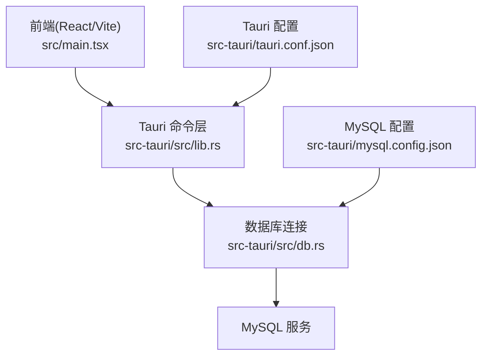
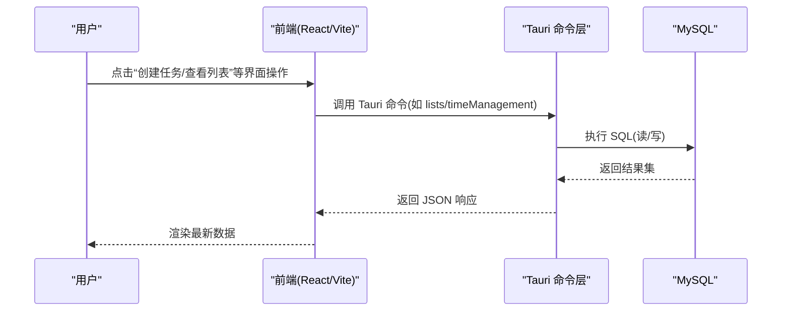
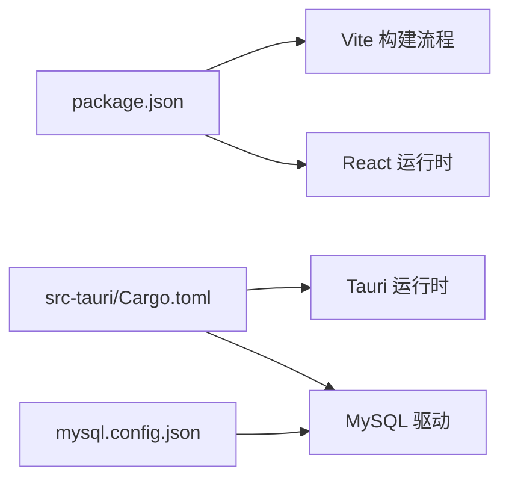

# 快速开始

<cite>
**本文引用的文件**   
- [README.md](file://README.md)
- [package.json](file://package.json)
- [vite.config.js](file://vite.config.js)
- [src/main.tsx](file://src/main.tsx)
- [src-tauri/Cargo.toml](file://src-tauri/Cargo.toml)
- [src-tauri/tauri.conf.json](file://src-tauri/tauri.conf.json)
- [src-tauri/mysql.config.json](file://src-tauri/mysql.config.json)
- [src-tauri/src/lib.rs](file://src-tauri/src/lib.rs)
- [src-tauri/src/db.rs](file://src-tauri/src/db.rs)
- [src/features/lists/listsService.ts](file://src/features/lists/listsService.ts)
- [src/features/time-management/timeManagementService.ts](file://src/features/time-management/timeManagementService.ts)
</cite>

## 目录
1. [简介](#简介)
2. [项目结构](#项目结构)
3. [核心组件](#核心组件)
4. [架构总览](#架构总览)
5. [详细组件分析](#详细组件分析)
6. [依赖分析](#依赖分析)
7. [性能注意事项](#性能注意事项)
8. [故障排除指南](#故障排除指南)
9. [结论](#结论)
10. [附录](#附录)

## 简介
本指南面向首次接触 FishWorker 的开发者与用户，目标是帮助你在最短时间内完成环境搭建、依赖安装、数据库配置并成功运行应用。FishWorker 是一个基于 Tauri + React（Vite）+ Rust 的桌面应用，前端通过 Tauri 命令调用后端 Rust 能力，数据持久化使用 MySQL。

## 项目结构
仓库采用前后端分离的 Tauri 工程组织方式：
- 前端：React + Vite，位于 src 目录，入口为 main.tsx；构建配置在 vite.config.js。
- 后端：Rust + Tauri，位于 src-tauri 目录，包含 Cargo 工程、Tauri 配置、MySQL 连接配置以及业务模块。
- 文档与示例：根目录 README.md 提供项目说明与基础信息。

图表来源
- [src/main.tsx](file://src/main.tsx)
- [src-tauri/src/lib.rs](file://src-tauri/src/lib.rs)
- [src-tauri/src/db.rs](file://src-tauri/src/db.rs)
- [src-tauri/tauri.conf.json](file://src-tauri/tauri.conf.json)
- [src-tauri/mysql.config.json](file://src-tauri/mysql.config.json)

章节来源
- [README.md](file://README.md)
- [package.json](file://package.json)
- [vite.config.js](file://vite.config.js)
- [src/main.tsx](file://src/main.tsx)
- [src-tauri/Cargo.toml](file://src-tauri/Cargo.toml)
- [src-tauri/tauri.conf.json](file://src-tauri/tauri.conf.json)

## 核心组件
- 前端入口与构建
  - 前端入口：src/main.tsx
  - 构建工具：Vite（配置文件 vite.config.js）
  - 包管理：pnpm（参考 package.json）
- 后端与 Tauri
  - Tauri 命令注册与桥接：src-tauri/src/lib.rs
  - 数据库连接与初始化：src-tauri/src/db.rs
  - Tauri 应用配置：src-tauri/tauri.conf.json
  - Rust 工程清单：src-tauri/Cargo.toml
- 数据持久化
  - MySQL 连接参数：src-tauri/mysql.config.json
  - 典型业务调用路径：列表功能（src/features/lists/listsService.ts）、时间管理（src/features/time-management/timeManagementService.ts）

章节来源
- [src/main.tsx](file://src/main.tsx)
- [vite.config.js](file://vite.config.js)
- [package.json](file://package.json)
- [src-tauri/src/lib.rs](file://src-tauri/src/lib.rs)
- [src-tauri/src/db.rs](file://src-tauri/src/db.rs)
- [src-tauri/tauri.conf.json](file://src-tauri/tauri.conf.json)
- [src-tauri/Cargo.toml](file://src-tauri/Cargo.toml)
- [src-tauri/mysql.config.json](file://src-tauri/mysql.config.json)
- [src/features/lists/listsService.ts](file://src/features/lists/listsService.ts)
- [src/features/time-management/timeManagementService.ts](file://src/features/time-management/timeManagementService.ts)

## 架构总览
FishWorker 的整体架构由“前端 UI + Tauri 命令层 + Rust 后端 + MySQL”组成。前端通过 Tauri 暴露的命令调用后端能力，后端读取 mysql.config.json 中的连接信息访问 MySQL。

图表来源
- [src/features/lists/listsService.ts](file://src/features/lists/listsService.ts)
- [src/features/time-management/timeManagementService.ts](file://src/features/time-management/timeManagementService.ts)
- [src-tauri/src/lib.rs](file://src-tauri/src/lib.rs)
- [src-tauri/src/db.rs](file://src-tauri/src/db.rs)

## 详细组件分析

### 前置条件与环境要求
- 系统要求
  - 操作系统：Windows/macOS/Linux（Tauri 官方支持平台）
  - 建议内存：≥4GB（开发体验更佳）
- Node.js 与 pnpm
  - Node.js：建议使用 LTS 版本（参见 package.json 的 engines 字段或 .nvmrc 若存在）
  - pnpm：用于安装依赖与脚本执行
- Rust 工具链
  - 安装 rustup 与 stable 工具链
  - 确保 cargo、rustc、rustfmt 可用
- 数据库
  - 本地或远程 MySQL 服务已启动并可访问
  - 准备一个空库或按后端期望的表结构初始化（见后续“数据库配置”）

章节来源
- [package.json](file://package.json)
- [src-tauri/Cargo.toml](file://src-tauri/Cargo.toml)
- [src-tauri/tauri.conf.json](file://src-tauri/tauri.conf.json)

### 克隆与安装
- 克隆仓库
  - git clone <仓库地址>
  - cd FishWorker
- 安装前端依赖
  - pnpm install
- 验证前端可构建
  - pnpm build 或 pnpm dev（根据 package.json scripts 定义）

章节来源
- [package.json](file://package.json)
- [vite.config.js](file://vite.config.js)

### 数据库配置
- 编辑 MySQL 连接配置
  - 打开 src-tauri/mysql.config.json，填写 host、port、user、password、database 等必要字段
- 初始化数据库（可选）
  - 若后端有建表脚本或迁移，请提前执行；否则先尝试运行应用，观察错误提示后按需创建表结构
- 测试连通性
  - 使用任意客户端连接 MySQL，确认凭据与网络可达

章节来源
- [src-tauri/mysql.config.json](file://src-tauri/mysql.config.json)
- [src-tauri/src/db.rs](file://src-tauri/src/db.rs)

### 首次运行
- 开发模式（推荐）
  - pnpm tauri dev
  - 该命令会同时启动前端开发与 Tauri 调试窗口
- 生产构建
  - pnpm tauri build
  - 产物位于 src-tauri/target/release/bundle（具体路径以平台为准）

章节来源
- [src-tauri/tauri.conf.json](file://src-tauri/tauri.conf.json)
- [package.json](file://package.json)

### 基本使用示例
以下示例帮助你快速体验核心功能。所有交互均通过前端按钮触发，最终经由 Tauri 命令读写 MySQL。

- 列表功能
  - 打开“列表”面板
  - 新增一条记录（标题、内容等）
  - 刷新页面或切换标签，确认数据持久化
  - 参考实现路径：
    - 前端调用：src/features/lists/listsService.ts
    - 后端命令：src-tauri/src/lib.rs
    - 数据库访问：src-tauri/src/db.rs
- 时间管理
  - 打开“时间管理”面板
  - 添加任务、设置优先级与截止时间
  - 保存后刷新，确认数据落库
  - 参考实现路径：
    - 前端调用：src/features/time-management/timeManagementService.ts
    - 后端命令：src-tauri/src/lib.rs
    - 数据库访问：src-tauri/src/db.rs

章节来源
- [src/features/lists/listsService.ts](file://src/features/lists/listsService.ts)
- [src/features/time-management/timeManagementService.ts](file://src/features/time-management/timeManagementService.ts)
- [src-tauri/src/lib.rs](file://src-tauri/src/lib.rs)
- [src-tauri/src/db.rs](file://src-tauri/src/db.rs)

## 依赖分析
- 前端依赖
  - React、Vite、TypeScript 等（详见 package.json）
- 后端依赖
  - Tauri 运行时与 Rust 生态库（详见 src-tauri/Cargo.toml）
- 外部依赖
  - MySQL 服务（网络可达、端口开放、凭据正确）

图表来源
- [package.json](file://package.json)
- [src-tauri/Cargo.toml](file://src-tauri/Cargo.toml)
- [src-tauri/mysql.config.json](file://src-tauri/mysql.config.json)

章节来源
- [package.json](file://package.json)
- [src-tauri/Cargo.toml](file://src-tauri/Cargo.toml)
- [src-tauri/mysql.config.json](file://src-tauri/mysql.config.json)

## 性能注意事项
- 首次启动较慢属于正常现象（Rust 编译与前端资源打包）
- 开发时建议开启增量构建与热更新（Vite 默认行为）
- 大数据量查询建议在数据库侧建立合适索引
- 避免在前端频繁发起重复请求，必要时增加缓存策略

## 故障排除指南
- 无法找到 Node.js 或 pnpm
  - 确认已安装且加入 PATH；Node.js 版本需满足 package.json 的 engines 要求
- Rust 工具链缺失
  - 安装 rustup 与 stable 工具链，并在终端中验证 cargo/rustc 可用
- Tauri 构建失败（缺少系统依赖）
  - Windows：安装 Visual Studio Build Tools 或 MSVC 工作负载
  - macOS：安装 Xcode Command Line Tools
  - Linux：安装对应平台的 Tauri 依赖（如 webkit2gtk 等）
- MySQL 连接失败
  - 检查 src-tauri/mysql.config.json 的 host/port/user/password/database
  - 确认 MySQL 服务已启动且允许本机或指定 IP 访问
  - 防火墙与安全组是否放行相应端口
- 权限问题（Linux/macOS）
  - 如需 sudo 权限，请在当前用户下重新安装 rustup 与 Node.js，避免全局权限污染
- 端口占用
  - 修改 vite 或 Tauri 开发服务器端口，避免冲突

章节来源
- [src-tauri/mysql.config.json](file://src-tauri/mysql.config.json)
- [src-tauri/tauri.conf.json](file://src-tauri/tauri.conf.json)
- [package.json](file://package.json)

## 结论
按照本指南完成前置环境、依赖安装与数据库配置后，即可通过 pnpm tauri dev 快速启动 FishWorker。建议先从“列表”和“时间管理”两个功能入手，熟悉前端到后端再到数据库的完整链路。遇到问题时，优先检查 Node.js/Rust/MySQL 的环境连通性与配置文件。

## 附录
- 常用命令
  - 安装依赖：pnpm install
  - 开发运行：pnpm tauri dev
  - 生产构建：pnpm tauri build
  - 前端构建：pnpm build
- 关键文件定位
  - 前端入口：src/main.tsx
  - Tauri 配置：src-tauri/tauri.conf.json
  - MySQL 配置：src-tauri/mysql.config.json
  - 后端命令与数据库：src-tauri/src/lib.rs、src-tauri/src/db.rs