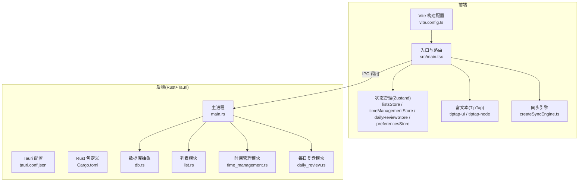
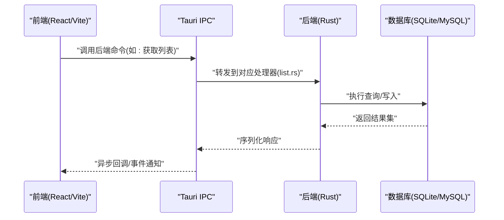
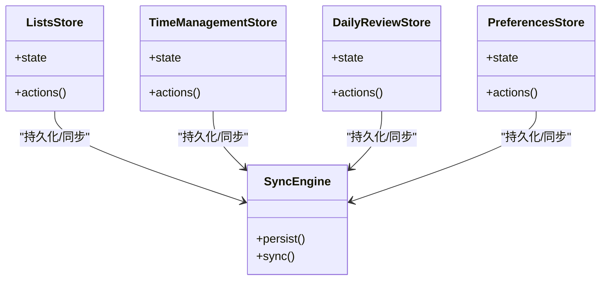
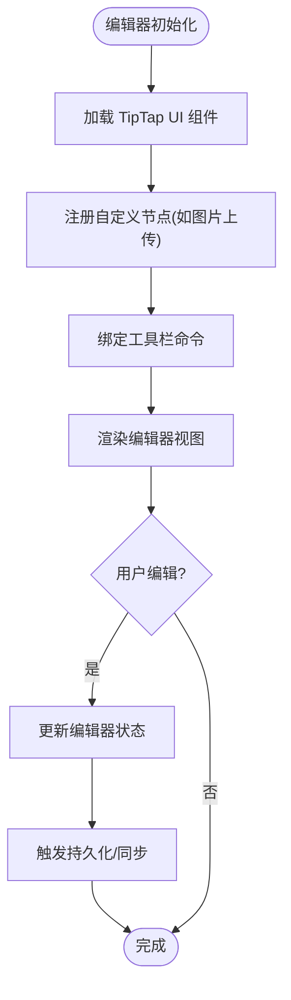
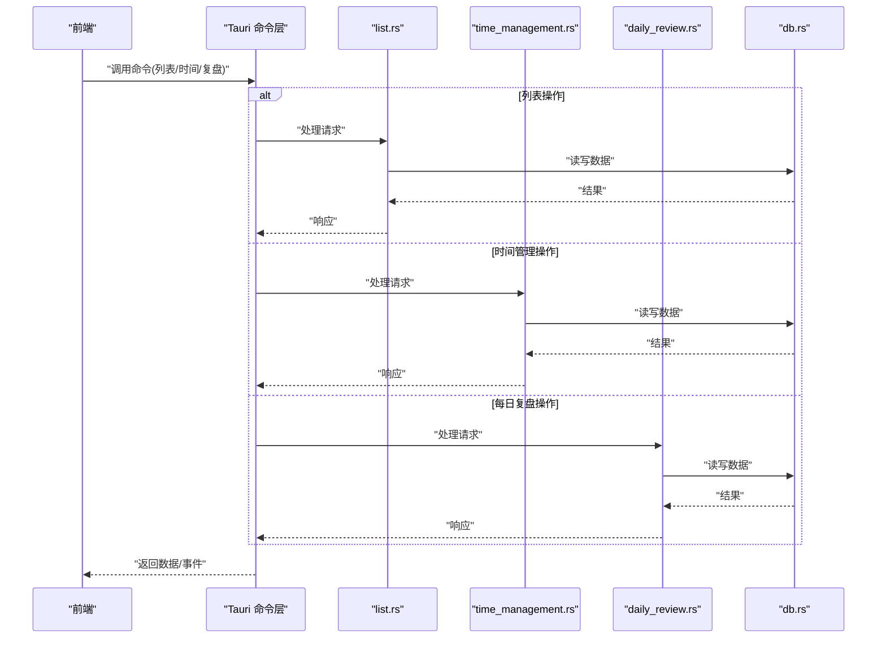
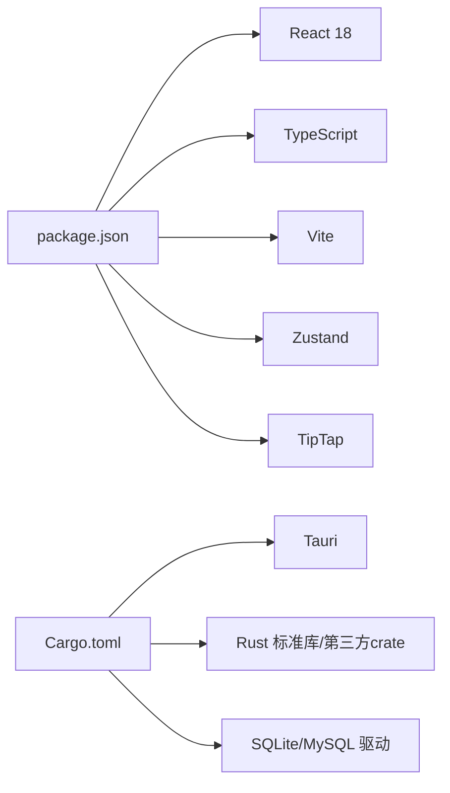

# 技术栈概览

<cite>
**本文引用的文件**   
- [package.json](file://package.json)
- [vite.config.ts](file://vite.config.ts)
- [tsconfig.json](file://tsconfig.json)
- [src/main.tsx](file://src/main.tsx)
- [src/features/lists/listsStore.ts](file://src/features/lists/listsStore.ts)
- [src/features/time-management/timeManagementStore.ts](file://src/features/time-management/timeManagementStore.ts)
- [src/features/daily-review/dailyReviewStore.ts](file://src/features/daily-review/dailyReviewStore.ts)
- [src/features/settings/preferencesStore.ts](file://src/features/settings/preferencesStore.ts)
- [src/components/tiptap-ui/index.tsx](file://src/components/tiptap-ui/index.tsx)
- [src/components/tiptap-node/image-upload-node-extension.ts](file://src/components/tiptap-node/image-upload-node-extension.ts)
- [src/lib/createSyncEngine.ts](file://src/lib/createSyncEngine.ts)
- [src-tauri/Cargo.toml](file://src-tauri/Cargo.toml)
- [src-tauri/tauri.conf.json](file://src-tauri/tauri.conf.json)
- [src-tauri/src/main.rs](file://src-tauri/src/main.rs)
- [src-tauri/src/db.rs](file://src-tauri/src/db.rs)
- [src-tauri/src/list.rs](file://src-tauri/src/list.rs)
- [src-tauri/src/time_management.rs](file://src-tauri/src/time_management.rs)
- [src-tauri/src/daily_review.rs](file://src-tauri/src/daily_review.rs)
</cite>

## 更新摘要
**变更内容**   
- 移除了原桌面应用根工程中的技术栈文档引用
- 更新了项目结构说明以反映当前前后端分离的架构
- 强化了 Tauri 与 Rust 后端的技术选型分析
- 完善了前端技术栈（React 18、TypeScript、Zustand、TipTap）的应用场景说明

## 目录
1. [简介](#简介)
2. [项目结构](#项目结构)
3. [核心组件](#核心组件)
4. [架构总览](#架构总览)
5. [详细组件分析](#详细组件分析)
6. [依赖关系分析](#依赖关系分析)
7. [性能考量](#性能考量)
8. [故障排查指南](#故障排查指南)
9. [结论](#结论)
10. [附录](#附录)

## 简介
本技术栈概览面向 FishWorker 项目的开发者与贡献者，系统梳理前端与后端的技术选型、版本信息与架构决策。前端采用 React 18 + TypeScript + Vite 构建，状态管理使用 Zustand，富文本编辑基于 TipTap；后端以 Rust 为核心，通过 Tauri 桥接桌面端能力，数据层支持 SQLite/MySQL。文档重点解释：
- 为何选择 Tauri 而非 Electron（性能、内存占用、打包体积等）
- React 18 新特性在项目中的应用点
- TypeScript 的类型安全优势
- Zustand 的简洁性与可扩展性
- Rust 在后端的高性能与内存安全性
- 各技术版本信息与依赖关系图
- 技术选型的权衡与未来扩展性

## 项目结构
FishWorker 采用前后端分离的桌面应用结构：
- 前端位于 src 目录，使用 Vite 构建，React 18 作为 UI 框架，TypeScript 提供类型约束，Zustand 管理全局状态，TipTap 提供可插拔的富文本能力。
- 后端位于 src-tauri 目录，Rust 实现业务逻辑与数据库访问，Tauri 负责进程管理与 IPC 通信。

图表来源
- [vite.config.ts:1-200](file://vite.config.ts#L1-L200)
- [src/main.tsx:1-200](file://src/main.tsx#L1-L200)
- [src/features/lists/listsStore.ts:1-200](file://src/features/lists/listsStore.ts#L1-L200)
- [src/features/time-management/timeManagementStore.ts:1-200](file://src/features/time-management/timeManagementStore.ts#L1-L200)
- [src/features/daily-review/dailyReviewStore.ts:1-200](file://src/features/daily-review/dailyReviewStore.ts#L1-L200)
- [src/features/settings/preferencesStore.ts:1-200](file://src/features/settings/preferencesStore.ts#L1-L200)
- [src/components/tiptap-ui/index.tsx:1-200](file://src/components/tiptap-ui/index.tsx#L1-L200)
- [src/components/tiptap-node/image-upload-node-extension.ts:1-200](file://src/components/tiptap-node/image-upload-node-extension.ts#L1-L200)
- [src/lib/createSyncEngine.ts:1-200](file://src/lib/createSyncEngine.ts#L1-L200)
- [src-tauri/tauri.conf.json:1-200](file://src-tauri/tauri.conf.json#L1-L200)
- [src-tauri/Cargo.toml:1-200](file://src-tauri/Cargo.toml#L1-L200)
- [src-tauri/src/main.rs:1-200](file://src-tauri/src/main.rs#L1-L200)
- [src-tauri/src/db.rs:1-200](file://src-tauri/src/db.rs#L1-L200)
- [src-tauri/src/list.rs:1-200](file://src-tauri/src/list.rs#L1-L200)
- [src-tauri/src/time_management.rs:1-200](file://src-tauri/src/time_management.rs#L1-L200)
- [src-tauri/src/daily_review.rs:1-200](file://src-tauri/src/daily_review.rs#L1-L200)

章节来源
- [vite.config.ts:1-200](file://vite.config.ts#L1-L200)
- [src/main.tsx:1-200](file://src/main.tsx#L1-L200)
- [src-tauri/tauri.conf.json:1-200](file://src-tauri/tauri.conf.json#L1-L200)
- [src-tauri/Cargo.toml:1-200](file://src-tauri/Cargo.toml#L1-L200)

## 核心组件
- 前端运行时
  - React 18：利用并发渲染、自动批处理、Suspense 等特性提升交互流畅度与可维护性。
  - TypeScript：为组件、状态、API 接口提供强类型约束，降低运行时错误。
  - Vite：快速热更新与高效打包，优化开发体验与构建产物体积。
  - Zustand：轻量级状态管理，最小 API 设计，易于拆分与测试。
  - TipTap：模块化编辑器，支持自定义节点与命令，便于扩展富文本能力。
- 后端运行时
  - Rust：零成本抽象、所有权模型带来高性能与内存安全。
  - Tauri：基于系统 Webview 的桌面壳，显著降低内存占用与安装包体积。
  - 数据库：SQLite/MySQL 双适配，满足单机与多机协作场景。

章节来源
- [package.json:1-200](file://package.json#L1-L200)
- [tsconfig.json:1-200](file://tsconfig.json#L1-L200)
- [src/features/lists/listsStore.ts:1-200](file://src/features/lists/listsStore.ts#L1-L200)
- [src/features/time-management/timeManagementStore.ts:1-200](file://src/features/time-management/timeManagementStore.ts#L1-L200)
- [src/features/daily-review/dailyReviewStore.ts:1-200](file://src/features/daily-review/dailyReviewStore.ts#L1-L200)
- [src/features/settings/preferencesStore.ts:1-200](file://src/features/settings/preferencesStore.ts#L1-L200)
- [src/components/tiptap-ui/index.tsx:1-200](file://src/components/tiptap-ui/index.tsx#L1-L200)
- [src/components/tiptap-node/image-upload-node-extension.ts:1-200](file://src/components/tiptap-node/image-upload-node-extension.ts#L1-L200)
- [src/lib/createSyncEngine.ts:1-200](file://src/lib/createSyncEngine.ts#L1-L200)
- [src-tauri/Cargo.toml:1-200](file://src-tauri/Cargo.toml#L1-L200)
- [src-tauri/src/db.rs:1-200](file://src-tauri/src/db.rs#L1-L200)

## 架构总览
FishWorker 采用"前端 React + 后端 Rust"的桌面应用架构，通过 Tauri 提供的 IPC 机制进行跨进程通信。前端负责 UI 渲染与用户交互，后端负责持久化与复杂计算。

图表来源
- [src/main.tsx:1-200](file://src/main.tsx#L1-L200)
- [src-tauri/src/main.rs:1-200](file://src-tauri/src/main.rs#L1-L200)
- [src-tauri/src/list.rs:1-200](file://src-tauri/src/list.rs#L1-L200)
- [src-tauri/src/db.rs:1-200](file://src-tauri/src/db.rs#L1-L200)

## 详细组件分析

### 前端状态管理（Zustand）
- 设计要点
  - 按功能域划分 store（列表、时间管理、每日复盘、设置），避免单例臃肿。
  - 使用 selector 精确订阅，减少不必要的重渲染。
  - 结合 createSyncEngine 将状态变更与持久化/同步策略解耦。
- 关键文件
  - 列表状态：[src/features/lists/listsStore.ts](file://src/features/lists/listsStore.ts)
  - 时间管理状态：[src/features/time-management/timeManagementStore.ts](file://src/features/time-management/timeManagementStore.ts)
  - 每日复盘状态：[src/features/daily-review/dailyReviewStore.ts](file://src/features/daily-review/dailyReviewStore.ts)
  - 偏好设置状态：[src/features/settings/preferencesStore.ts](file://src/features/settings/preferencesStore.ts)
  - 同步引擎：[src/lib/createSyncEngine.ts](file://src/lib/createSyncEngine.ts)

图表来源
- [src/features/lists/listsStore.ts:1-200](file://src/features/lists/listsStore.ts#L1-L200)
- [src/features/time-management/timeManagementStore.ts:1-200](file://src/features/time-management/timeManagementStore.ts#L1-L200)
- [src/features/daily-review/dailyReviewStore.ts:1-200](file://src/features/daily-review/dailyReviewStore.ts#L1-L200)
- [src/features/settings/preferencesStore.ts:1-200](file://src/features/settings/preferencesStore.ts#L1-L200)
- [src/lib/createSyncEngine.ts:1-200](file://src/lib/createSyncEngine.ts#L1-L200)

章节来源
- [src/features/lists/listsStore.ts:1-200](file://src/features/lists/listsStore.ts#L1-L200)
- [src/features/time-management/timeManagementStore.ts:1-200](file://src/features/time-management/timeManagementStore.ts#L1-L200)
- [src/features/daily-review/dailyReviewStore.ts:1-200](file://src/features/daily-review/dailyReviewStore.ts#L1-L200)
- [src/features/settings/preferencesStore.ts:1-200](file://src/features/settings/preferencesStore.ts#L1-L200)
- [src/lib/createSyncEngine.ts:1-200](file://src/lib/createSyncEngine.ts#L1-L200)

### 富文本编辑器（TipTap）
- 设计要点
  - 通过 ui 组件与 node 扩展组合，形成可复用的编辑器工具栏与内容节点。
  - 图片上传节点扩展支持本地资源与云端同步。
- 关键文件
  - 编辑器 UI 聚合：[src/components/tiptap-ui/index.tsx](file://src/components/tiptap-ui/index.tsx)
  - 图片上传节点扩展：[src/components/tiptap-node/image-upload-node-extension.ts](file://src/components/tiptap-node/image-upload-node-extension.ts)

图表来源
- [src/components/tiptap-ui/index.tsx:1-200](file://src/components/tiptap-ui/index.tsx#L1-L200)
- [src/components/tiptap-node/image-upload-node-extension.ts:1-200](file://src/components/tiptap-node/image-upload-node-extension.ts#L1-L200)

章节来源
- [src/components/tiptap-ui/index.tsx:1-200](file://src/components/tiptap-ui/index.tsx#L1-L200)
- [src/components/tiptap-node/image-upload-node-extension.ts:1-200](file://src/components/tiptap-node/image-upload-node-extension.ts#L1-L200)

### 后端服务（Rust + Tauri）
- 设计要点
  - main.rs 注册 Tauri 命令与插件，暴露给前端调用。
  - db.rs 封装数据库连接与事务，统一错误处理。
  - list.rs、time_management.rs、daily_review.rs 分别承载领域逻辑。
- 关键文件
  - 主进程：[src-tauri/src/main.rs](file://src-tauri/src/main.rs)
  - 数据库抽象：[src-tauri/src/db.rs](file://src-tauri/src/db.rs)
  - 列表模块：[src-tauri/src/list.rs](file://src-tauri/src/list.rs)
  - 时间管理模块：[src-tauri/src/time_management.rs](file://src-tauri/src/time_management.rs)
  - 每日复盘模块：[src-tauri/src/daily_review.rs](file://src-tauri/src/daily_review.rs)

图表来源
- [src-tauri/src/main.rs:1-200](file://src-tauri/src/main.rs#L1-L200)
- [src-tauri/src/list.rs:1-200](file://src-tauri/src/list.rs#L1-L200)
- [src-tauri/src/time_management.rs:1-200](file://src-tauri/src/time_management.rs#L1-L200)
- [src-tauri/src/daily_review.rs:1-200](file://src-tauri/src/daily_review.rs#L1-L200)
- [src-tauri/src/db.rs:1-200](file://src-tauri/src/db.rs#L1-L200)

章节来源
- [src-tauri/src/main.rs:1-200](file://src-tauri/src/main.rs#L1-L200)
- [src-tauri/src/db.rs:1-200](file://src-tauri/src/db.rs#L1-L200)
- [src-tauri/src/list.rs:1-200](file://src-tauri/src/list.rs#L1-L200)
- [src-tauri/src/time_management.rs:1-200](file://src-tauri/src/time_management.rs#L1-L200)
- [src-tauri/src/daily_review.rs:1-200](file://src-tauri/src/daily_review.rs#L1-L200)

## 依赖关系分析
- 前端依赖
  - React 18、TypeScript、Vite、Zustand、TipTap 及其生态组件。
  - 构建与类型检查由 Vite 与 tsconfig 驱动。
- 后端依赖
  - Rust 工具链、Tauri 运行时、数据库驱动（SQLite/MySQL）。
  - Cargo.toml 声明所有 crate 与版本约束。

图表来源
- [package.json:1-200](file://package.json#L1-L200)
- [src-tauri/Cargo.toml:1-200](file://src-tauri/Cargo.toml#L1-L200)

章节来源
- [package.json:1-200](file://package.json#L1-L200)
- [src-tauri/Cargo.toml:1-200](file://src-tauri/Cargo.toml#L1-L200)

## 性能考量
- 为什么选择 Tauri 而非 Electron
  - 内存占用：Tauri 复用系统 Webview，避免内置 Chromium 实例，显著降低常驻内存。
  - 打包体积：不捆绑浏览器内核，安装包更小，分发更快。
  - 启动速度：更少的初始化开销，冷启动更快。
  - 安全边界：通过白名单命令暴露能力，减少攻击面。
- React 18 的性能收益
  - 并发渲染与 Suspense 提升大列表与复杂页面的交互稳定性。
  - 自动批处理减少多余渲染，配合 Zustand 的细粒度订阅进一步优化。
- Rust 的后端优势
  - 零成本抽象与所有权模型确保无 GC 停顿与内存泄漏风险。
  - 并发模型（Send/Sync）在高吞吐 IO 场景下表现优异。
- 数据库选择
  - SQLite：适合单机离线优先场景，部署简单，事务一致性强。
  - MySQL：适合多端协同与集中式数据治理，需考虑网络延迟与连接池。

章节来源
- [src-tauri/tauri.conf.json:1-200](file://src-tauri/tauri.conf.json#L1-L200)
- [src-tauri/Cargo.toml:1-200](file://src-tauri/Cargo.toml#L1-L200)
- [src/lib/createSyncEngine.ts:1-200](file://src/lib/createSyncEngine.ts#L1-L200)

## 故障排查指南
- 前端常见问题
  - 构建失败：检查 vite.config.ts 与 tsconfig.json 的路径别名与编译选项。
  - 状态不同步：确认 Zustand store 的 selector 是否精准，避免过度订阅。
  - 富文本异常：检查 TipTap 节点扩展是否正确注册，DOM 结构是否符合预期。
- 后端常见问题
  - IPC 调用失败：核对 tauri.conf.json 的命令白名单与权限配置。
  - 数据库连接错误：验证 db.rs 的连接参数与迁移脚本一致性。
  - 模块职责不清：在 list.rs、time_management.rs、daily_review.rs 中明确输入输出契约，避免耦合。

章节来源
- [vite.config.ts:1-200](file://vite.config.ts#L1-L200)
- [tsconfig.json:1-200](file://tsconfig.json#L1-L200)
- [src-tauri/tauri.conf.json:1-200](file://src-tauri/tauri.conf.json#L1-L200)
- [src-tauri/src/db.rs:1-200](file://src-tauri/src/db.rs#L1-L200)

## 结论
FishWorker 通过"前端 React + 后端 Rust + Tauri"的组合，兼顾了用户体验与运行效率。Zustand 与 TipTap 提升了开发与维护效率，Rust 与 Tauri 在保证性能的同时降低了资源消耗。未来可在以下方向持续演进：
- 引入更完善的错误监控与日志体系
- 增强跨平台兼容性（Windows/macOS/Linux）
- 探索增量同步与冲突解决策略
- 评估微前端或插件化架构以支撑更多功能域

## 附录
- 版本信息定位
  - 前端依赖与脚本：[package.json](file://package.json)
  - 构建与类型配置：[vite.config.ts](file://vite.config.ts)、[tsconfig.json](file://tsconfig.json)
  - 后端依赖与元信息：[src-tauri/Cargo.toml](file://src-tauri/Cargo.toml)
  - Tauri 运行时配置：[src-tauri/tauri.conf.json](file://src-tauri/tauri.conf.json)