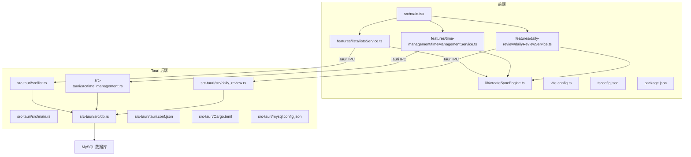
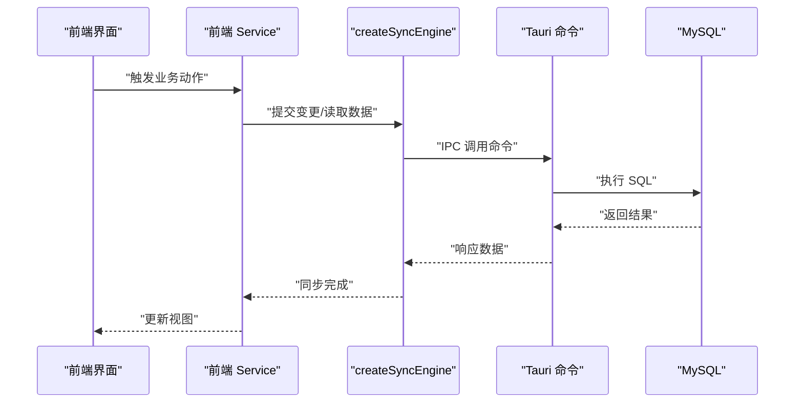
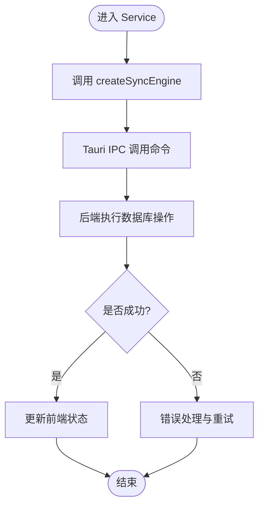
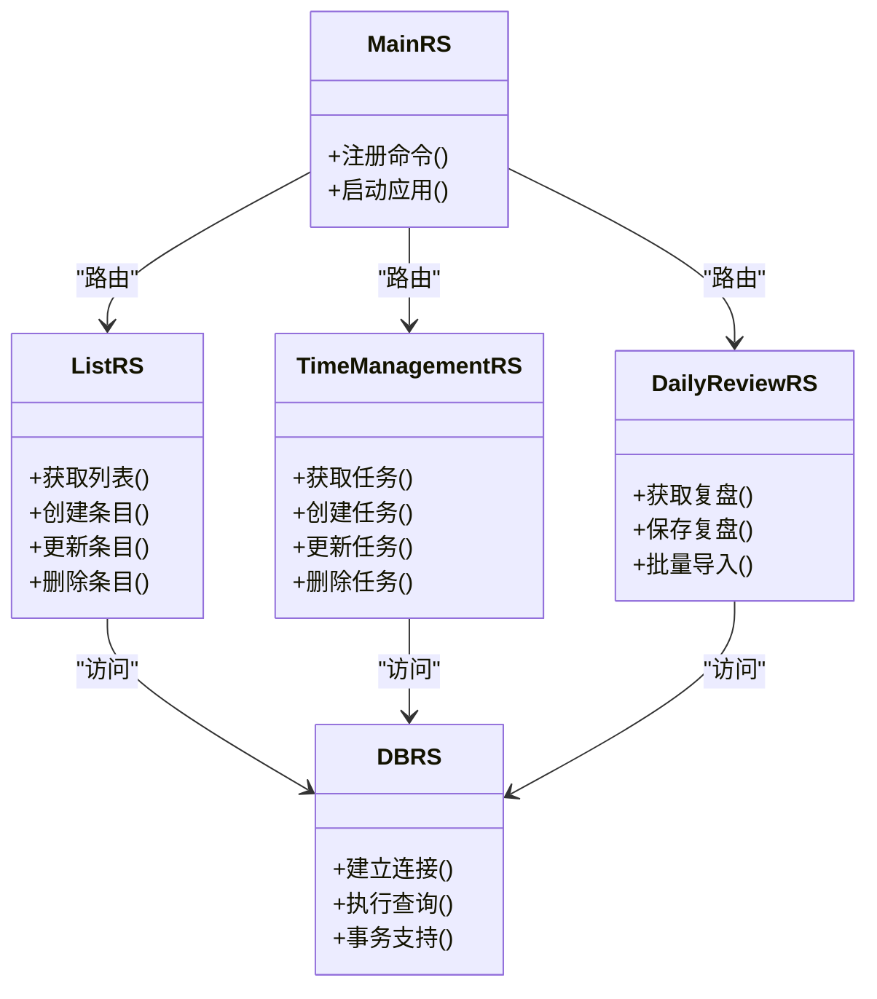
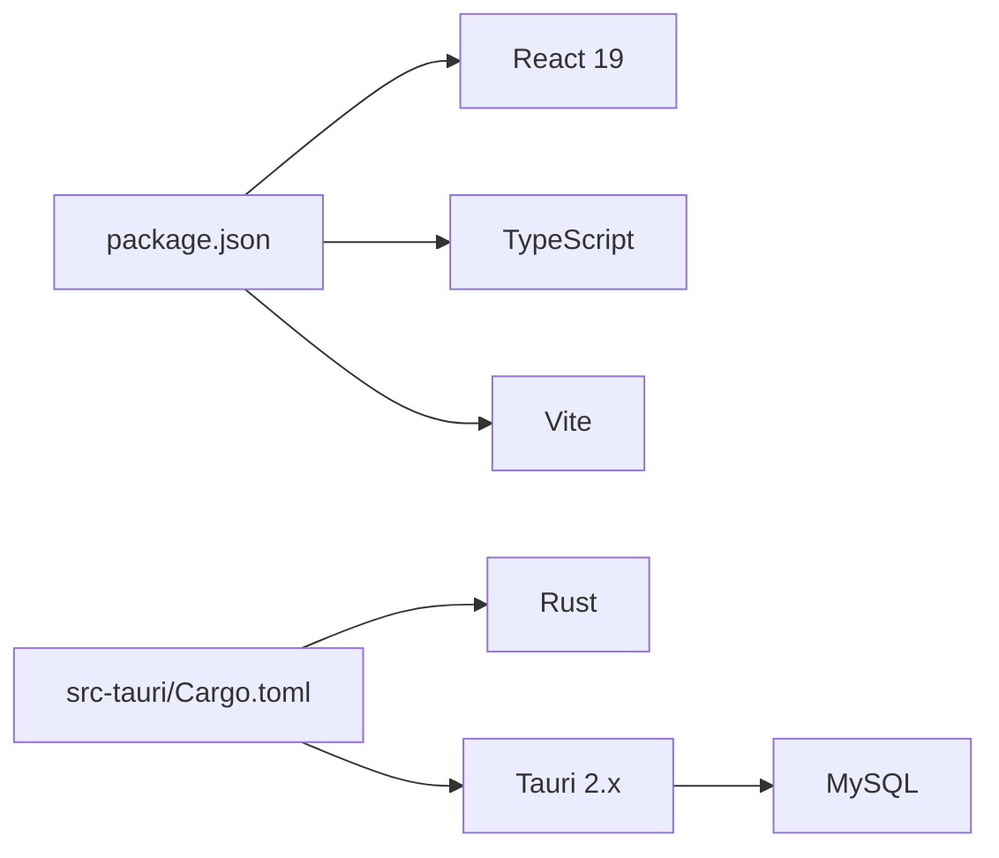

# 技术栈概览

<cite>
**本文引用的文件**   
- [package.json](file://package.json)
- [vite.config.ts](file://vite.config.ts)
- [tsconfig.json](file://tsconfig.json)
- [src/main.tsx](file://src/main.tsx)
- [src/features/lists/listsService.ts](file://src/features/lists/listsService.ts)
- [src/features/time-management/timeManagementService.ts](file://src/features/time-management/timeManagementService.ts)
- [src/features/daily-review/dailyReviewService.ts](file://src/features/daily-review/dailyReviewService.ts)
- [src/lib/createSyncEngine.ts](file://src/lib/createSyncEngine.ts)
- [src-tauri/Cargo.toml](file://src-tauri/Cargo.toml)
- [src-tauri/tauri.conf.json](file://src-tauri/tauri.conf.json)
- [src-tauri/src/main.rs](file://src-tauri/src/main.rs)
- [src-tauri/src/db.rs](file://src-tauri/src/db.rs)
- [src-tauri/src/list.rs](file://src-tauri/src/list.rs)
- [src-tauri/src/time_management.rs](file://src-tauri/src/time_management.rs)
- [src-tauri/src/daily_review.rs](file://src-tauri/src/daily_review.rs)
- [src-tauri/mysql.config.json](file://src-tauri/mysql.config.json)
</cite>

## 目录
1. [简介](#简介)
2. [项目结构](#项目结构)
3. [核心组件](#核心组件)
4. [架构总览](#架构总览)
5. [详细组件分析](#详细组件分析)
6. [依赖关系分析](#依赖关系分析)
7. [性能考量](#性能考量)
8. [故障排查指南](#故障排查指南)
9. [结论](#结论)
10. [附录：学习路径与版本兼容性](#附录学习路径与版本兼容性)

## 简介
本技术栈概览面向 FishWorker 项目的开发者与维护者，系统梳理前端、后端、数据库与工具链的技术选型、协作方式与数据流向。项目采用“前端 React + TypeScript + Vite”、“后端 Rust + Tauri”、“数据库 MySQL”的组合，通过 Tauri 的 IPC 机制将浏览器端能力与本地 Rust 服务桥接，实现桌面应用形态的高效开发体验与运行性能。

## 项目结构
仓库采用前后端分离的组织方式：
- 前端代码位于 src 目录，使用 Vite 构建，TypeScript 提供类型安全，React 作为 UI 框架，按功能域 features 组织业务模块。
- 后端代码位于 src-tauri 目录，基于 Tauri 2.x 与 Rust，暴露命令给前端调用，负责数据库访问与持久化逻辑。
- 配置集中在根级与各自子目录中：package.json、vite.config.ts、tsconfig.json 管理前端；Cargo.toml、tauri.conf.json、mysql.config.json 管理后端与运行时。

图表来源
- [src/main.tsx:1-200](file://src/main.tsx#L1-L200)
- [src/features/lists/listsService.ts:1-200](file://src/features/lists/listsService.ts#L1-L200)
- [src/features/time-management/timeManagementService.ts:1-200](file://src/features/time-management/timeManagementService.ts#L1-L200)
- [src/features/daily-review/dailyReviewService.ts:1-200](file://src/features/daily-review/dailyReviewService.ts#L1-L200)
- [src/lib/createSyncEngine.ts:1-200](file://src/lib/createSyncEngine.ts#L1-L200)
- [src-tauri/src/main.rs:1-200](file://src-tauri/src/main.rs#L1-L200)
- [src-tauri/src/db.rs:1-200](file://src-tauri/src/db.rs#L1-L200)
- [src-tauri/src/list.rs:1-200](file://src-tauri/src/list.rs#L1-L200)
- [src-tauri/src/time_management.rs:1-200](file://src-tauri/src/time_management.rs#L1-L200)
- [src-tauri/src/daily_review.rs:1-200](file://src-tauri/src/daily_review.rs#L1-L200)

章节来源
- [package.json:1-200](file://package.json#L1-L200)
- [vite.config.ts:1-200](file://vite.config.ts#L1-L200)
- [tsconfig.json:1-200](file://tsconfig.json#L1-L200)
- [src/main.tsx:1-200](file://src/main.tsx#L1-L200)
- [src-tauri/Cargo.toml:1-200](file://src-tauri/Cargo.toml#L1-L200)
- [src-tauri/tauri.conf.json:1-200](file://src-tauri/tauri.conf.json#L1-L200)

## 核心组件
- 前端入口与构建
  - 入口文件负责初始化应用与路由挂载，Vite 负责开发与生产构建，TypeScript 提供编译期类型检查与提示。
  - 关键文件：[src/main.tsx](file://src/main.tsx)、[vite.config.ts](file://vite.config.ts)、[tsconfig.json](file://tsconfig.json)。
- 领域服务层（前端）
  - 各功能域通过 Service 封装对外 API 调用与状态同步，统一由 createSyncEngine 协调本地与远端数据一致性。
  - 关键文件：
    - [src/features/lists/listsService.ts](file://src/features/lists/listsService.ts)
    - [src/features/time-management/timeManagementService.ts](file://src/features/time-management/timeManagementService.ts)
    - [src/features/daily-review/dailyReviewService.ts](file://src/features/daily-review/dailyReviewService.ts)
    - [src/lib/createSyncEngine.ts](file://src/lib/createSyncEngine.ts)
- Tauri 后端与命令
  - main.rs 注册 Tauri 命令并启动应用；db.rs 维护数据库连接；list.rs、time_management.rs、daily_review.rs 分别实现对应领域的命令处理。
  - 关键文件：
    - [src-tauri/src/main.rs](file://src-tauri/src/main.rs)
    - [src-tauri/src/db.rs](file://src-tauri/src/db.rs)
    - [src-tauri/src/list.rs](file://src-tauri/src/list.rs)
    - [src-tauri/src/time_management.rs](file://src-tauri/src/time_management.rs)
    - [src-tauri/src/daily_review.rs](file://src-tauri/src/daily_review.rs)
- 配置与环境
  - 前端：package.json 管理依赖与脚本，vite.config.ts 控制构建行为，tsconfig.json 定义 TS 编译选项。
  - 后端：Cargo.toml 声明 Rust 依赖，tauri.conf.json 定义 Tauri 应用元信息与权限，mysql.config.json 提供数据库连接参数。
  - 关键文件：
    - [package.json](file://package.json)
    - [vite.config.ts](file://vite.config.ts)
    - [tsconfig.json](file://tsconfig.json)
    - [src-tauri/Cargo.toml](file://src-tauri/Cargo.toml)
    - [src-tauri/tauri.conf.json](file://src-tauri/tauri.conf.json)
    - [src-tauri/mysql.config.json](file://src-tauri/mysql.config.json)

章节来源
- [src/main.tsx:1-200](file://src/main.tsx#L1-L200)
- [vite.config.ts:1-200](file://vite.config.ts#L1-L200)
- [tsconfig.json:1-200](file://tsconfig.json#L1-L200)
- [src/features/lists/listsService.ts:1-200](file://src/features/lists/listsService.ts#L1-L200)
- [src/features/time-management/timeManagementService.ts:1-200](file://src/features/time-management/timeManagementService.ts#L1-L200)
- [src/features/daily-review/dailyReviewService.ts:1-200](file://src/features/daily-review/dailyReviewService.ts#L1-L200)
- [src/lib/createSyncEngine.ts:1-200](file://src/lib/createSyncEngine.ts#L1-L200)
- [src-tauri/src/main.rs:1-200](file://src-tauri/src/main.rs#L1-L200)
- [src-tauri/src/db.rs:1-200](file://src-tauri/src/db.rs#L1-L200)
- [src-tauri/src/list.rs:1-200](file://src-tauri/src/list.rs#L1-L200)
- [src-tauri/src/time_management.rs:1-200](file://src-tauri/src/time_management.rs#L1-L200)
- [src-tauri/src/daily_review.rs:1-200](file://src-tauri/src/daily_review.rs#L1-L200)
- [package.json:1-200](file://package.json#L1-L200)
- [src-tauri/Cargo.toml:1-200](file://src-tauri/Cargo.toml#L1-L200)
- [src-tauri/tauri.conf.json:1-200](file://src-tauri/tauri.conf.json#L1-L200)
- [src-tauri/mysql.config.json:1-200](file://src-tauri/mysql.config.json#L1-L200)

## 架构总览
FishWorker 采用“前端页面 + Tauri 命令 + 数据库”的分层架构：
- 前端以 React 组件驱动 UI，通过 Service 层发起请求，createSyncEngine 负责数据同步策略。
- Tauri 作为本地运行时承载 Rust 命令，接收前端调用，执行数据库操作并返回结果。
- MySQL 作为持久化存储，承载列表、时间管理与每日复盘等核心数据。

图表来源
- [src/features/lists/listsService.ts:1-200](file://src/features/lists/listsService.ts#L1-L200)
- [src/features/time-management/timeManagementService.ts:1-200](file://src/features/time-management/timeManagementService.ts#L1-L200)
- [src/features/daily-review/dailyReviewService.ts:1-200](file://src/features/daily-review/dailyReviewService.ts#L1-L200)
- [src/lib/createSyncEngine.ts:1-200](file://src/lib/createSyncEngine.ts#L1-L200)
- [src-tauri/src/main.rs:1-200](file://src-tauri/src/main.rs#L1-L200)
- [src-tauri/src/db.rs:1-200](file://src-tauri/src/db.rs#L1-L200)

## 详细组件分析

### 前端 Service 与同步引擎
- 职责划分
  - listsService、timeManagementService、dailyReviewService 分别封装对应领域的 API 调用与状态管理。
  - createSyncEngine 提供统一的同步抽象，协调本地缓存与远端数据的一致性。
- 交互流程
  - 组件调用 Service → Service 调用 createSyncEngine → createSyncEngine 通过 Tauri IPC 调用后端命令 → 后端读写 MySQL → 返回结果 → 前端更新状态。

图表来源
- [src/features/lists/listsService.ts:1-200](file://src/features/lists/listsService.ts#L1-L200)
- [src/features/time-management/timeManagementService.ts:1-200](file://src/features/time-management/timeManagementService.ts#L1-L200)
- [src/features/daily-review/dailyReviewService.ts:1-200](file://src/features/daily-review/dailyReviewService.ts#L1-L200)
- [src/lib/createSyncEngine.ts:1-200](file://src/lib/createSyncEngine.ts#L1-L200)

章节来源
- [src/features/lists/listsService.ts:1-200](file://src/features/lists/listsService.ts#L1-L200)
- [src/features/time-management/timeManagementService.ts:1-200](file://src/features/time-management/timeManagementService.ts#L1-L200)
- [src/features/daily-review/dailyReviewService.ts:1-200](file://src/features/daily-review/dailyReviewService.ts#L1-L200)
- [src/lib/createSyncEngine.ts:1-200](file://src/lib/createSyncEngine.ts#L1-L200)

### Tauri 后端命令与数据库访问
- 命令注册与路由
  - main.rs 负责注册 Tauri 命令，将前端调用映射到具体处理函数。
- 数据库连接
  - db.rs 维护连接池或单例连接，提供通用查询与事务支持。
- 领域命令
  - list.rs、time_management.rs、daily_review.rs 分别实现 CRUD 与业务规则。

图表来源
- [src-tauri/src/main.rs:1-200](file://src-tauri/src/main.rs#L1-L200)
- [src-tauri/src/db.rs:1-200](file://src-tauri/src/db.rs#L1-L200)
- [src-tauri/src/list.rs:1-200](file://src-tauri/src/list.rs#L1-L200)
- [src-tauri/src/time_management.rs:1-200](file://src-tauri/src/time_management.rs#L1-L200)
- [src-tauri/src/daily_review.rs:1-200](file://src-tauri/src/daily_review.rs#L1-L200)

章节来源
- [src-tauri/src/main.rs:1-200](file://src-tauri/src/main.rs#L1-L200)
- [src-tauri/src/db.rs:1-200](file://src-tauri/src/db.rs#L1-L200)
- [src-tauri/src/list.rs:1-200](file://src-tauri/src/list.rs#L1-L200)
- [src-tauri/src/time_management.rs:1-200](file://src-tauri/src/time_management.rs#L1-L200)
- [src-tauri/src/daily_review.rs:1-200](file://src-tauri/src/daily_review.rs#L1-L200)

## 依赖关系分析
- 前端依赖
  - React 19 作为 UI 框架，提供现代并发特性与更好的渲染性能。
  - TypeScript 提供强类型约束，提升可维护性与团队协作效率。
  - Vite 提供极速的开发服务器与构建优化，支持按需加载与插件生态。
- 后端依赖
  - Rust 提供内存安全与高性能，适合本地计算密集型任务。
  - Tauri 2.x 提供轻量级运行时与 IPC 通道，替代传统 Electron 的体积与资源占用。
- 数据库依赖
  - MySQL 作为成熟的关系型数据库，满足结构化数据存储与复杂查询需求。

图表来源
- [package.json:1-200](file://package.json#L1-L200)
- [src-tauri/Cargo.toml:1-200](file://src-tauri/Cargo.toml#L1-L200)

章节来源
- [package.json:1-200](file://package.json#L1-L200)
- [src-tauri/Cargo.toml:1-200](file://src-tauri/Cargo.toml#L1-L200)

## 性能考量
- 前端
  - 使用 Vite 的按需加载与增量构建，缩短冷启动与热更新时延。
  - 通过 Service 层集中处理网络请求与状态同步，减少重复渲染与不必要的重计算。
- 后端
  - Rust 的高性能与低开销使 Tauri 命令执行更高效，尤其在大量数据处理场景。
  - 数据库连接复用与事务合并可降低 I/O 次数，提高吞吐。
- 同步策略
  - createSyncEngine 应实现合理的去抖与批处理，避免频繁 IPC 与数据库写入。

## 故障排查指南
- 前端问题
  - 确认 Vite 配置与 TypeScript 编译选项是否正确，检查构建日志与类型错误。
  - 在 Service 层增加日志输出，定位 IPC 调用失败的原因。
- 后端问题
  - 检查 Tauri 命令注册与权限配置，确保前端能够正确调用。
  - 验证数据库连接参数与网络可达性，关注连接池与超时设置。
- 常见问题
  - 跨进程通信失败：核对 tauri.conf.json 的命令白名单与权限。
  - 数据库连接异常：检查 mysql.config.json 的配置与防火墙策略。

章节来源
- [vite.config.ts:1-200](file://vite.config.ts#L1-L200)
- [tsconfig.json:1-200](file://tsconfig.json#L1-L200)
- [src-tauri/tauri.conf.json:1-200](file://src-tauri/tauri.conf.json#L1-L200)
- [src-tauri/mysql.config.json:1-200](file://src-tauri/mysql.config.json#L1-L200)

## 结论
FishWorker 通过“前端 React + TypeScript + Vite”、“后端 Rust + Tauri”、“数据库 MySQL”的组合，实现了高效、稳定且可扩展的桌面应用架构。Service 层与同步引擎提升了数据一致性与用户体验，Tauri 命令与 Rust 后端保证了性能与安全。建议在后续迭代中持续优化同步策略与数据库访问模式，进一步提升整体性能与可维护性。

## 附录：学习路径与版本兼容性
- 学习路径建议
  - 前端开发者
    - 掌握 React 19 的新特性与最佳实践，理解 TypeScript 在项目中的类型设计。
    - 熟悉 Vite 的构建与插件体系，了解 Service 层与状态管理的协作模式。
  - 后端开发者
    - 学习 Rust 基础与异步编程模型，理解 Tauri 2.x 的命令注册与 IPC 机制。
    - 掌握 MySQL 的连接管理与事务处理，优化查询与索引策略。
- 版本兼容性
  - 前端：React 19 与 TypeScript 的最新稳定版配合 Vite 进行构建与开发。
  - 后端：Rust 与 Tauri 2.x 保持兼容，注意依赖升级带来的 API 变化。
  - 数据库：MySQL 版本需与应用使用的驱动与 SQL 语法兼容。